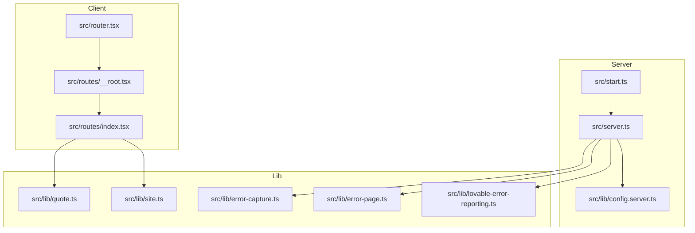
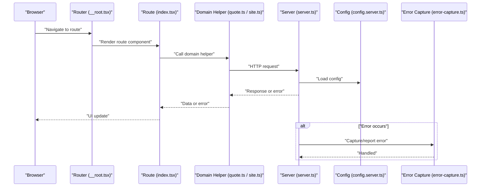
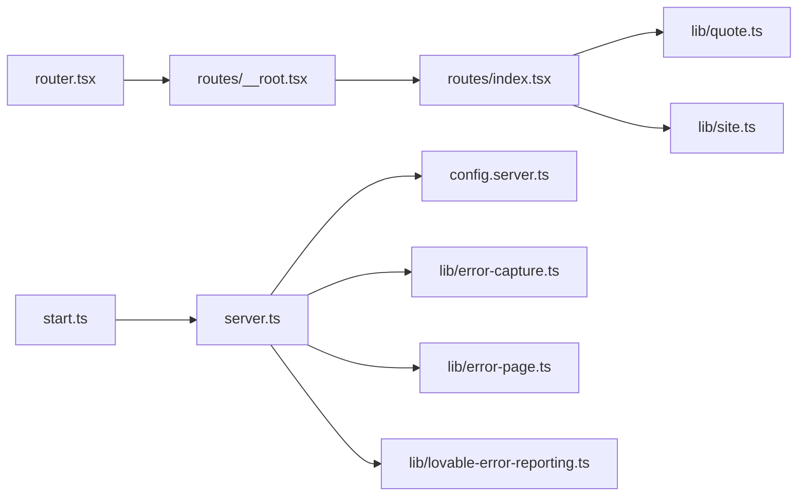

# API Client Architecture

<cite>
**Referenced Files in This Document**
- [config.server.ts](file://src/lib/config.server.ts)
- [server.ts](file://src/server.ts)
- [start.ts](file://src/start.ts)
- [router.tsx](file://src/router.tsx)
- [__root.tsx](file://src/routes/__root.tsx)
- [index.tsx](file://src/routes/index.tsx)
- [quote.ts](file://src/lib/quote.ts)
- [site.ts](file://src/lib/site.ts)
- [error-capture.ts](file://src/lib/error-capture.ts)
- [error-page.ts](file://src/lib/error-page.ts)
- [lovable-error-reporting.ts](file://src/lib/lovable-error-reporting.ts)
</cite>

## Table of Contents
1. [Introduction](#introduction)
2. [Project Structure](#project-structure)
3. [Core Components](#core-components)
4. [Architecture Overview](#architecture-overview)
5. [Detailed Component Analysis](#detailed-component-analysis)
6. [Dependency Analysis](#dependency-analysis)
7. [Performance Considerations](#performance-considerations)
8. [Troubleshooting Guide](#troubleshooting-guide)
9. [Conclusion](#conclusion)
10. [Appendices](#appendices)

## Introduction
This document explains the API client architecture and communication patterns used in SpareAutomation. It focuses on how requests are initiated, configured, intercepted, and handled across server and client boundaries, including configuration management, authentication token handling, error capture, and best practices for extending the system with new integrations. The goal is to provide a clear mental model of the request lifecycle and guidance for consistent, maintainable API usage throughout the application.

## Project Structure
The project is a full-stack web application using a router-based framework. Server-side logic resides under src/server.ts and src/start.ts, while shared utilities and domain helpers live under src/lib. Routes are defined under src/routes, and the root layout is in src/routes/__root.tsx. Configuration is centralized in src/lib/config.server.ts. Error handling utilities are provided by src/lib/error-capture.ts, src/lib/error-page.ts, and src/lib/lovable-error-reporting.ts.

**Diagram sources**
- [server.ts](file://src/server.ts)
- [start.ts](file://src/start.ts)
- [config.server.ts](file://src/lib/config.server.ts)
- [router.tsx](file://src/router.tsx)
- [__root.tsx](file://src/routes/__root.tsx)
- [index.tsx](file://src/routes/index.tsx)
- [quote.ts](file://src/lib/quote.ts)
- [site.ts](file://src/lib/site.ts)
- [error-capture.ts](file://src/lib/error-capture.ts)
- [error-page.ts](file://src/lib/error-page.ts)
- [lovable-error-reporting.ts](file://src/lib/lovable-error-reporting.ts)

**Section sources**
- [server.ts](file://src/server.ts)
- [start.ts](file://src/start.ts)
- [config.server.ts](file://src/lib/config.server.ts)
- [router.tsx](file://src/router.tsx)
- [__root.tsx](file://src/routes/__root.tsx)
- [index.tsx](file://src/routes/index.tsx)
- [quote.ts](file://src/lib/quote.ts)
- [site.ts](file://src/lib/site.ts)
- [error-capture.ts](file://src/lib/error-capture.ts)
- [error-page.ts](file://src/lib/error-page.ts)
- [lovable-error-reporting.ts](file://src/lib/lovable-error-reporting.ts)

## Core Components
- Centralized configuration: Environment-driven settings are loaded from a single source to ensure consistency between server and client.
- Server bootstrap: The server entrypoint initializes middleware, routes, and error handling before starting the HTTP listener.
- Router and layout: The client router sets up route-level components and global layout behavior.
- Domain helpers: Reusable modules encapsulate business-specific API calls (for example, quote and site-related operations).
- Error capture and reporting: Utilities centralize error logging and user-facing error pages.

Key responsibilities:
- Configuration management: Provide typed access to environment variables and defaults.
- Request lifecycle: Ensure consistent headers, timeouts, and error handling across all API calls.
- Authentication: Attach tokens or API keys where required and handle refresh flows if applicable.
- Interceptors/middleware: Apply cross-cutting concerns such as logging, retries, and metrics.

**Section sources**
- [config.server.ts](file://src/lib/config.server.ts)
- [server.ts](file://src/server.ts)
- [router.tsx](file://src/router.tsx)
- [__root.tsx](file://src/routes/__root.tsx)
- [quote.ts](file://src/lib/quote.ts)
- [site.ts](file://src/lib/site.ts)
- [error-capture.ts](file://src/lib/error-capture.ts)
- [error-page.ts](file://src/lib/error-page.ts)
- [lovable-error-reporting.ts](file://src/lib/lovable-error-reporting.ts)

## Architecture Overview
The request flow spans both server and client layers. The server bootstraps the runtime, loads configuration, registers middleware, and serves routes. Client routes invoke domain helpers that perform network requests. Errors are captured centrally and surfaced via standardized error pages or reporting tools.

**Diagram sources**
- [__root.tsx](file://src/routes/__root.tsx)
- [index.tsx](file://src/routes/index.tsx)
- [quote.ts](file://src/lib/quote.ts)
- [site.ts](file://src/lib/site.ts)
- [server.ts](file://src/server.ts)
- [config.server.ts](file://src/lib/config.server.ts)
- [error-capture.ts](file://src/lib/error-capture.ts)

## Detailed Component Analysis

### Configuration Management
- Purpose: Centralize environment variables and defaults for API endpoints, timeouts, and feature flags.
- Typical usage: Import configuration in server and client code to build base URLs, set timeouts, and toggle features.
- Best practices:
  - Validate required values at startup and fail fast if missing.
  - Expose typed getters to avoid stringly-typed access.
  - Keep secrets out of client bundles; use server-only configuration for sensitive values.

Guidance for extending:
- Add new environment variables in the configuration module.
- Update validation and defaults accordingly.
- Reference them consistently across server and client code.

**Section sources**
- [config.server.ts](file://src/lib/config.server.ts)

### Server Bootstrap and Middleware
- Purpose: Initialize the HTTP server, register middleware, configure routing, and attach error handlers.
- Responsibilities:
  - Load configuration.
  - Set up global middleware (e.g., logging, CORS, compression).
  - Mount routes and static assets.
  - Configure error handling and reporting.

Extensibility:
- Add new middleware early in the bootstrap sequence to affect all requests.
- Use route groups to scope middleware to specific paths.

**Section sources**
- [server.ts](file://src/server.ts)
- [start.ts](file://src/start.ts)

### Client Router and Layout
- Purpose: Define the client-side routing structure and global layout behavior.
- Responsibilities:
  - Register top-level layout and route components.
  - Provide context providers for app-wide state and services.
  - Integrate error boundaries and analytics.

Extensibility:
- Add new routes under src/routes following the existing naming conventions.
- Use the root layout to inject global interceptors or providers.

**Section sources**
- [router.tsx](file://src/router.tsx)
- [__root.tsx](file://src/routes/__root.tsx)
- [index.tsx](file://src/routes/index.tsx)

### Domain Helpers (API Consumers)
- Purpose: Encapsulate business-specific API calls behind simple functions.
- Examples:
  - Quote-related operations in a dedicated helper.
  - Site-related operations in another helper.
- Responsibilities:
  - Build requests with correct base URLs and headers.
  - Handle serialization/deserialization.
  - Normalize errors into a consistent shape.
  - Optionally implement retry/backoff for transient failures.

Extensibility:
- Create a new helper per domain area.
- Follow the same pattern for request construction and error normalization.

**Section sources**
- [quote.ts](file://src/lib/quote.ts)
- [site.ts](file://src/lib/site.ts)

### Error Capture and Reporting
- Purpose: Centralize error logging, reporting, and user-facing error pages.
- Responsibilities:
  - Capture unhandled exceptions and promise rejections.
  - Report errors to external systems when available.
  - Render friendly error pages for users.

Extensibility:
- Add new reporters or enrich payloads with contextual metadata.
- Standardize error codes and messages for consistent UI handling.

**Section sources**
- [error-capture.ts](file://src/lib/error-capture.ts)
- [error-page.ts](file://src/lib/error-page.ts)
- [lovable-error-reporting.ts](file://src/lib/lovable-error-reporting.ts)

## Dependency Analysis
The following diagram shows key dependencies among core files involved in API communication.

**Diagram sources**
- [start.ts](file://src/start.ts)
- [server.ts](file://src/server.ts)
- [config.server.ts](file://src/lib/config.server.ts)
- [router.tsx](file://src/router.tsx)
- [__root.tsx](file://src/routes/__root.tsx)
- [index.tsx](file://src/routes/index.tsx)
- [quote.ts](file://src/lib/quote.ts)
- [site.ts](file://src/lib/site.ts)
- [error-capture.ts](file://src/lib/error-capture.ts)
- [error-page.ts](file://src/lib/error-page.ts)
- [lovable-error-reporting.ts](file://src/lib/lovable-error-reporting.ts)

**Section sources**
- [start.ts](file://src/start.ts)
- [server.ts](file://src/server.ts)
- [config.server.ts](file://src/lib/config.server.ts)
- [router.tsx](file://src/router.tsx)
- [__root.tsx](file://src/routes/__root.tsx)
- [index.tsx](file://src/routes/index.tsx)
- [quote.ts](file://src/lib/quote.ts)
- [site.ts](file://src/lib/site.ts)
- [error-capture.ts](file://src/lib/error-capture.ts)
- [error-page.ts](file://src/lib/error-page.ts)
- [lovable-error-reporting.ts](file://src/lib/lovable-error-reporting.ts)

## Performance Considerations
- Connection pooling: Prefer a persistent HTTP agent or connection pool for outbound requests to reduce handshake overhead.
- Timeouts: Configure reasonable request timeouts and cancellation policies to prevent resource leaks.
- Retries: Implement exponential backoff with jitter for idempotent requests; limit total attempts.
- Compression: Enable gzip/br for responses where supported by upstream APIs.
- Caching: Leverage cache headers and local caching strategies for read-heavy endpoints.
- Observability: Add latency and error metrics around request boundaries.

[No sources needed since this section provides general guidance]

## Troubleshooting Guide
Common issues and resolutions:
- Missing configuration: Validate required environment variables at startup and surface clear errors.
- Authentication failures: Ensure tokens or API keys are attached correctly and refreshed when necessary.
- Network errors: Inspect logs from error capture and reporting utilities; check timeouts and retries.
- Inconsistent responses: Normalize payloads in domain helpers and validate shapes before use.

Operational tips:
- Use structured logging with correlation IDs to trace requests end-to-end.
- Centralize error codes and messages to simplify UI handling.
- Instrument critical paths with metrics and alerts.

**Section sources**
- [error-capture.ts](file://src/lib/error-capture.ts)
- [error-page.ts](file://src/lib/error-page.ts)
- [lovable-error-reporting.ts](file://src/lib/lovable-error-reporting.ts)

## Conclusion
SpareAutomation’s API client architecture emphasizes centralized configuration, clear separation of concerns, and consistent error handling. By encapsulating API calls in domain helpers, applying middleware and interceptors at the server boundary, and standardizing error reporting, the system remains extensible and resilient. Following the guidelines above will help you add new integrations safely and maintain predictable behavior across the application.

[No sources needed since this section summarizes without analyzing specific files]

## Appendices

### Extending the Client with New Integrations
- Create a new domain helper under src/lib for the integration.
- Use configuration values for base URLs and timeouts.
- Attach authentication headers or tokens as needed.
- Normalize errors and return typed results.
- Wire any server-side middleware if the integration requires it.

### Example Patterns (by reference)
- Base client initialization: See configuration loading and server bootstrap references below.
- Interceptor/middleware: See server middleware registration references below.
- Custom request interceptor: Implement in domain helpers or server middleware as appropriate.
- Retry mechanisms: Implement in domain helpers with exponential backoff.
- Connection pooling and timeouts: Configure in server HTTP client setup.

**Section sources**
- [config.server.ts](file://src/lib/config.server.ts)
- [server.ts](file://src/server.ts)
- [start.ts](file://src/start.ts)
- [quote.ts](file://src/lib/quote.ts)
- [site.ts](file://src/lib/site.ts)
- [error-capture.ts](file://src/lib/error-capture.ts)
- [error-page.ts](file://src/lib/error-page.ts)
- [lovable-error-reporting.ts](file://src/lib/lovable-error-reporting.ts)