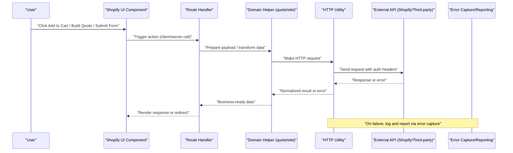
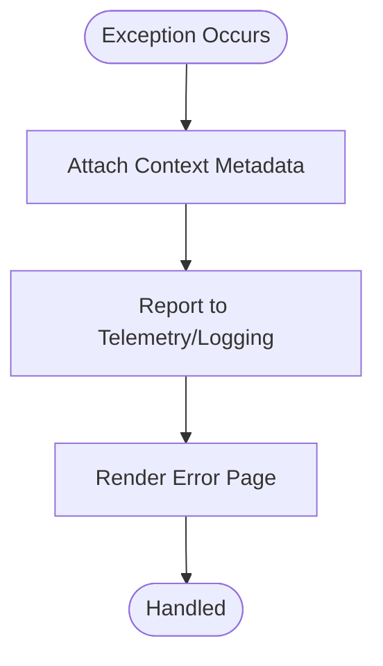
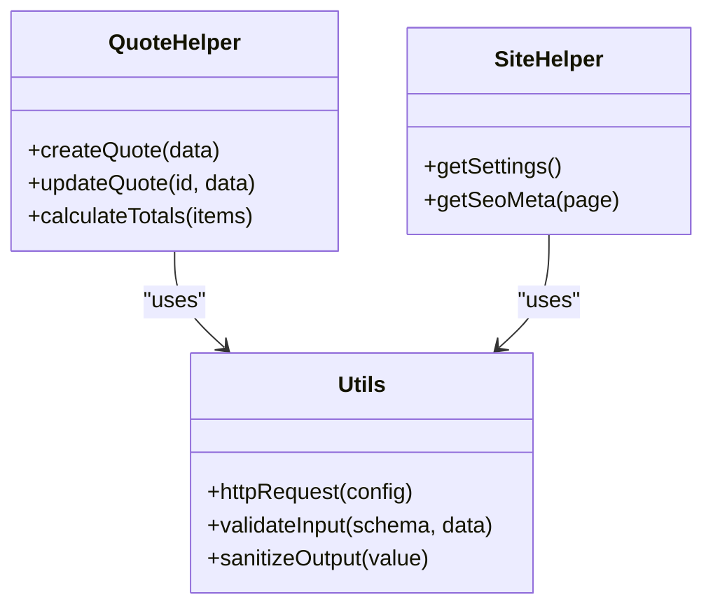
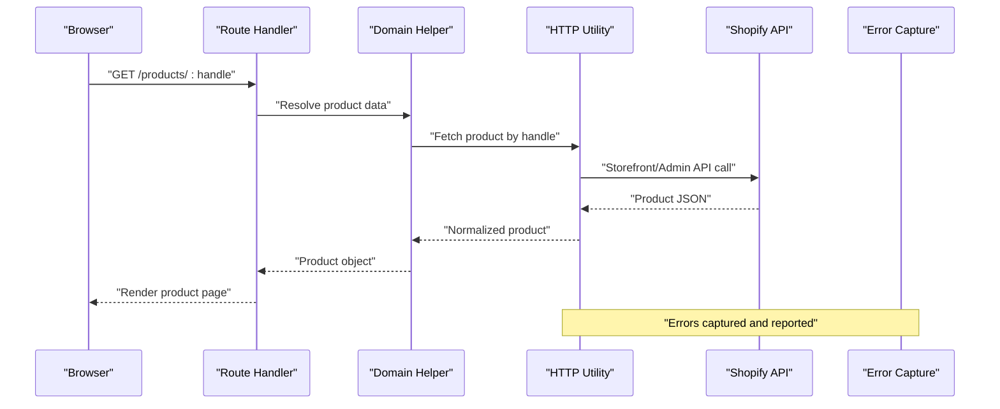
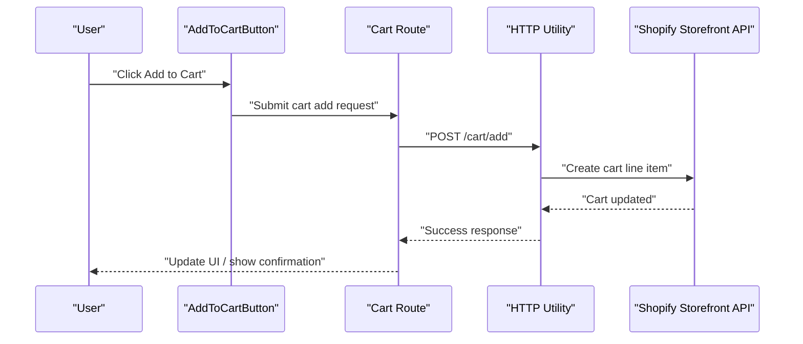
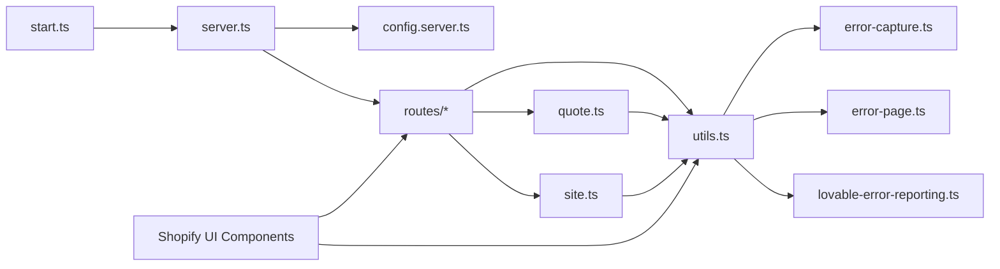

# API Integration Layer

<cite>
**Referenced Files in This Document**
- [server.ts](file://src/server.ts)
- [start.ts](file://src/start.ts)
- [config.server.ts](file://src/lib/config.server.ts)
- [error-capture.ts](file://src/lib/error-capture.ts)
- [error-page.ts](file://src/lib/error-page.ts)
- [lovable-error-reporting.ts](file://src/lib/lovable-error-reporting.ts)
- [quote.ts](file://src/lib/quote.ts)
- [site.ts](file://src/lib/site.ts)
- [utils.ts](file://src/lib/utils.ts)
- [AddToCartButton.tsx](file://src/components/shopify/AddToCartButton.tsx)
- [AddToQuoteButton.tsx](file://src/components/shopify/AddToQuoteButton.tsx)
- [BuildQuoteFromCartButton.tsx](file://src/components/shopify/BuildQuoteFromCartButton.tsx)
- [CollectionPage.tsx](file://src/components/shopify/CollectionPage.tsx)
- [InfoPage.tsx](file://src/components/shopify/InfoPage.tsx)
- [PaymentMarks.tsx](file://src/components/shopify/PaymentMarks.tsx)
- [ProductCard.tsx](file://src/components/shopify/ProductCard.tsx)
- [ProductDetail.tsx](file://src/components/shopify/ProductDetail.tsx)
- [SiteFooter.tsx](file://src/components/shopify/SiteFooter.tsx)
- [SiteHeader.tsx](file://src/components/shopify/SiteHeader.tsx)
- [SupportRequestForm.tsx](file://src/components/shopify/SupportRequestForm.tsx)
- [TradeAccountApplicationForm.tsx](file://src/components/shopify/TradeAccountApplicationForm.tsx)
- [index.tsx](file://src/routes/index.tsx)
- [cart.tsx](file://src/routes/cart.tsx)
- [quote.tsx](file://src/routes/quote.tsx)
- [account.tsx](file://src/routes/account.tsx)
- [login.tsx](file://src/routes/login.tsx)
- [register.tsx](file://src/routes/register.tsx)
- [products/$handle.tsx](file://src/routes/products/$handle.tsx)
- [products/index.tsx](file://src/routes/products/index.tsx)
</cite>

## Table of Contents
1. [Introduction](#introduction)
2. [Project Structure](#project-structure)
3. [Core Components](#core-components)
4. [Architecture Overview](#architecture-overview)
5. [Detailed Component Analysis](#detailed-component-analysis)
6. [Dependency Analysis](#dependency-analysis)
7. [Performance Considerations](#performance-considerations)
8. [Troubleshooting Guide](#troubleshooting-guide)
9. [Conclusion](#conclusion)
10. [Appendices](#appendices)

## Introduction
This document explains the API integration layer in SpareAutomation with a focus on how the application communicates with Shopify, custom endpoints, and third-party services. It covers request/response handling patterns, error management, authentication, retry strategies, logging, debugging, security considerations, caching, deduplication, performance optimization, and guidelines for adding new integrations while maintaining versioning and backward compatibility.

## Project Structure
The API integration spans server-side configuration, runtime bootstrapping, shared utilities, error capture/reporting, route handlers, and UI components that trigger API calls. The key areas are:
- Server bootstrap and configuration
- Error capture and reporting
- Shared utilities and data helpers (e.g., quote, site)
- Route-level handlers for user-facing flows
- Shopify-specific UI components that initiate requests

```mermaid
graph TB
subgraph "Server"
Start["start.ts"]
Server["server.ts"]
Config["config.server.ts"]
end
subgraph "Lib"
Utils["utils.ts"]
Quote["quote.ts"]
Site["site.ts"]
ErrCapture["error-capture.ts"]
ErrPage["error-page.ts"]
LovableErr["lovable-error-reporting.ts"]
end
subgraph "Routes"
RIndex["routes/index.tsx"]
RProductsIdx["routes/products/index.tsx"]
RProductsHandle["routes/products/$handle.tsx"]
RCart["routes/cart.tsx"]
RQuote["routes/quote.tsx"]
RAccount["routes/account.tsx"]
RLogin["routes/login.tsx"]
RRegister["routes/register.tsx"]
end
subgraph "Shopify UI"
SCartBtn["components/shopify/AddToCartButton.tsx"]
SQuoteBtn["components/shopify/AddToQuoteButton.tsx"]
SBuildQuote["components/shopify/BuildQuoteFromCartButton.tsx"]
SCollection["components/shopify/CollectionPage.tsx"]
SProductCard["components/shopify/ProductCard.tsx"]
SProductDetail["components/shopify/ProductDetail.tsx"]
SHeader["components/shopify/SiteHeader.tsx"]
SFooter["components/shopify/SiteFooter.tsx"]
SSupport["components/shopify/SupportRequestForm.tsx"]
STradeAcc["components/shopify/TradeAccountApplicationForm.tsx"]
end
Start --> Server
Server --> Config
Server --> RIndex
Server --> RProductsIdx
Server --> RProductsHandle
Server --> RCart
Server --> RQuote
Server --> RAccount
Server --> RLogin
Server --> RRegister
RIndex --> Utils
RProductsIdx --> Utils
RProductsHandle --> Utils
RCart --> Utils
RQuote --> Quote
RAccount --> Utils
RLogin --> Utils
RRegister --> Utils
SCartBtn --> Utils
SQuoteBtn --> Utils
SBuildQuote --> Utils
SCollection --> Utils
SProductCard --> Utils
SProductDetail --> Utils
SHeader --> Utils
SFooter --> Utils
SSupport --> Utils
STradeAcc --> Utils
Utils --> ErrCapture
Utils --> ErrPage
Utils --> LovableErr
Quote --> ErrCapture
Quote --> ErrPage
Quote --> LovableErr
```

**Diagram sources**
- [start.ts](file://src/start.ts)
- [server.ts](file://src/server.ts)
- [config.server.ts](file://src/lib/config.server.ts)
- [utils.ts](file://src/lib/utils.ts)
- [quote.ts](file://src/lib/quote.ts)
- [site.ts](file://src/lib/site.ts)
- [error-capture.ts](file://src/lib/error-capture.ts)
- [error-page.ts](file://src/lib/error-page.ts)
- [lovable-error-reporting.ts](file://src/lib/lovable-error-reporting.ts)
- [index.tsx](file://src/routes/index.tsx)
- [products/index.tsx](file://src/routes/products/index.tsx)
- [products/$handle.tsx](file://src/routes/products/$handle.tsx)
- [cart.tsx](file://src/routes/cart.tsx)
- [quote.tsx](file://src/routes/quote.tsx)
- [account.tsx](file://src/routes/account.tsx)
- [login.tsx](file://src/routes/login.tsx)
- [register.tsx](file://src/routes/register.tsx)
- [AddToCartButton.tsx](file://src/components/shopify/AddToCartButton.tsx)
- [AddToQuoteButton.tsx](file://src/components/shopify/AddToQuoteButton.tsx)
- [BuildQuoteFromCartButton.tsx](file://src/components/shopify/BuildQuoteFromCartButton.tsx)
- [CollectionPage.tsx](file://src/components/shopify/CollectionPage.tsx)
- [ProductCard.tsx](file://src/components/shopify/ProductCard.tsx)
- [ProductDetail.tsx](file://src/components/shopify/ProductDetail.tsx)
- [SiteHeader.tsx](file://src/components/shopify/SiteHeader.tsx)
- [SiteFooter.tsx](file://src/components/shopify/SiteFooter.tsx)
- [SupportRequestForm.tsx](file://src/components/shopify/SupportRequestForm.tsx)
- [TradeAccountApplicationForm.tsx](file://src/components/shopify/TradeAccountApplicationForm.tsx)

**Section sources**
- [start.ts](file://src/start.ts)
- [server.ts](file://src/server.ts)
- [config.server.ts](file://src/lib/config.server.ts)
- [utils.ts](file://src/lib/utils.ts)
- [quote.ts](file://src/lib/quote.ts)
- [site.ts](file://src/lib/site.ts)
- [error-capture.ts](file://src/lib/error-capture.ts)
- [error-page.ts](file://src/lib/error-page.ts)
- [lovable-error-reporting.ts](file://src/lib/lovable-error-reporting.ts)
- [index.tsx](file://src/routes/index.tsx)
- [products/index.tsx](file://src/routes/products/index.tsx)
- [products/$handle.tsx](file://src/routes/products/$handle.tsx)
- [cart.tsx](file://src/routes/cart.tsx)
- [quote.tsx](file://src/routes/quote.tsx)
- [account.tsx](file://src/routes/account.tsx)
- [login.tsx](file://src/routes/login.tsx)
- [register.tsx](file://src/routes/register.tsx)
- [AddToCartButton.tsx](file://src/components/shopify/AddToCartButton.tsx)
- [AddToQuoteButton.tsx](file://src/components/shopify/AddToQuoteButton.tsx)
- [BuildQuoteFromCartButton.tsx](file://src/components/shopify/BuildQuoteFromCartButton.tsx)
- [CollectionPage.tsx](file://src/components/shopify/CollectionPage.tsx)
- [ProductCard.tsx](file://src/components/shopify/ProductCard.tsx)
- [ProductDetail.tsx](file://src/components/shopify/ProductDetail.tsx)
- [SiteHeader.tsx](file://src/components/shopify/SiteHeader.tsx)
- [SiteFooter.tsx](file://src/components/shopify/SiteFooter.tsx)
- [SupportRequestForm.tsx](file://src/components/shopify/SupportRequestForm.tsx)
- [TradeAccountApplicationForm.tsx](file://src/components/shopify/TradeAccountApplicationForm.tsx)

## Core Components
- Server bootstrap and configuration
  - Entry point initializes the HTTP server and applies middleware and routes.
  - Configuration is loaded from environment variables to avoid hardcoding secrets.
- Error capture and reporting
  - Centralized error capture and reporting modules provide consistent instrumentation and user-friendly error pages.
- Shared utilities
  - Common helpers for HTTP requests, validation, formatting, and cross-cutting concerns used by routes and UI components.
- Domain helpers
  - Quote-related logic encapsulates business rules and data transformations for quotes.
  - Site helper provides site-wide metadata and settings.
- Routes
  - Route handlers orchestrate user flows, call domain helpers or external APIs, and render responses.
- Shopify UI components
  - Buttons and forms that initiate actions such as adding items to cart, building quotes, submitting support requests, and trade account applications.

**Section sources**
- [server.ts](file://src/server.ts)
- [start.ts](file://src/start.ts)
- [config.server.ts](file://src/lib/config.server.ts)
- [error-capture.ts](file://src/lib/error-capture.ts)
- [error-page.ts](file://src/lib/error-page.ts)
- [lovable-error-reporting.ts](file://src/lib/lovable-error-reporting.ts)
- [utils.ts](file://src/lib/utils.ts)
- [quote.ts](file://src/lib/quote.ts)
- [site.ts](file://src/lib/site.ts)
- [index.tsx](file://src/routes/index.tsx)
- [cart.tsx](file://src/routes/cart.tsx)
- [quote.tsx](file://src/routes/quote.tsx)
- [account.tsx](file://src/routes/account.tsx)
- [login.tsx](file://src/routes/login.tsx)
- [register.tsx](file://src/routes/register.tsx)
- [products/index.tsx](file://src/routes/products/index.tsx)
- [products/$handle.tsx](file://src/routes/products/$handle.tsx)
- [AddToCartButton.tsx](file://src/components/shopify/AddToCartButton.tsx)
- [AddToQuoteButton.tsx](file://src/components/shopify/AddToQuoteButton.tsx)
- [BuildQuoteFromCartButton.tsx](file://src/components/shopify/BuildQuoteFromCartButton.tsx)
- [CollectionPage.tsx](file://src/components/shopify/CollectionPage.tsx)
- [ProductCard.tsx](file://src/components/shopify/ProductCard.tsx)
- [ProductDetail.tsx](file://src/components/shopify/ProductDetail.tsx)
- [SiteHeader.tsx](file://src/components/shopify/SiteHeader.tsx)
- [SiteFooter.tsx](file://src/components/shopify/SiteFooter.tsx)
- [SupportRequestForm.tsx](file://src/components/shopify/SupportRequestForm.tsx)
- [TradeAccountApplicationForm.tsx](file://src/components/shopify/TradeAccountApplicationForm.tsx)

## Architecture Overview
The API integration architecture follows a layered approach:
- Presentation layer: React components and routes handle user interactions and rendering.
- Application layer: Route handlers coordinate flows, validate inputs, and call domain helpers.
- Domain layer: Helpers like quote and site encapsulate business logic and data shaping.
- Infrastructure layer: Utilities perform HTTP calls, manage retries, and centralize error capture/reporting.
- External systems: Shopify storefront/admin APIs and any additional third-party services.



**Diagram sources**
- [AddToCartButton.tsx](file://src/components/shopify/AddToCartButton.tsx)
- [AddToQuoteButton.tsx](file://src/components/shopify/AddToQuoteButton.tsx)
- [BuildQuoteFromCartButton.tsx](file://src/components/shopify/BuildQuoteFromCartButton.tsx)
- [SupportRequestForm.tsx](file://src/components/shopify/SupportRequestForm.tsx)
- [TradeAccountApplicationForm.tsx](file://src/components/shopify/TradeAccountApplicationForm.tsx)
- [cart.tsx](file://src/routes/cart.tsx)
- [quote.tsx](file://src/routes/quote.tsx)
- [utils.ts](file://src/lib/utils.ts)
- [quote.ts](file://src/lib/quote.ts)
- [site.ts](file://src/lib/site.ts)
- [error-capture.ts](file://src/lib/error-capture.ts)
- [error-page.ts](file://src/lib/error-page.ts)
- [lovable-error-reporting.ts](file://src/lib/lovable-error-reporting.ts)

## Detailed Component Analysis

### Server Bootstrap and Configuration
- Purpose: Initialize the HTTP server, apply middleware, mount routes, and load configuration.
- Key responsibilities:
  - Load environment-based configuration securely.
  - Register global error handlers and logging.
  - Mount route handlers and static assets.
- Security notes:
  - Avoid hardcoding secrets; use environment variables.
  - Apply CORS and rate limiting where applicable.

**Section sources**
- [start.ts](file://src/start.ts)
- [server.ts](file://src/server.ts)
- [config.server.ts](file://src/lib/config.server.ts)

### Error Capture and Reporting
- Purpose: Centralize error detection, enrichment, and reporting across the application.
- Responsibilities:
  - Capture unhandled exceptions and promise rejections.
  - Attach contextual metadata (request ID, user agent, endpoint).
  - Report to internal telemetry or external services.
  - Provide user-friendly error pages.



**Diagram sources**
- [error-capture.ts](file://src/lib/error-capture.ts)
- [error-page.ts](file://src/lib/error-page.ts)
- [lovable-error-reporting.ts](file://src/lib/lovable-error-reporting.ts)

**Section sources**
- [error-capture.ts](file://src/lib/error-capture.ts)
- [error-page.ts](file://src/lib/error-page.ts)
- [lovable-error-reporting.ts](file://src/lib/lovable-error-reporting.ts)

### Shared Utilities (HTTP, Validation, Formatting)
- Purpose: Provide reusable functions for making HTTP requests, validating inputs, and formatting outputs.
- Typical features:
  - Request builder with headers, timeouts, and retries.
  - Response normalization and error mapping.
  - Input sanitization and output encoding helpers.
- Usage: Consumed by routes and UI components when interacting with Shopify or other APIs.

**Section sources**
- [utils.ts](file://src/lib/utils.ts)

### Domain Helpers (Quote, Site)
- Quote helper:
  - Encapsulates quote creation, updates, and calculations.
  - Coordinates with Shopify cart/checkout flows and custom endpoints.
- Site helper:
  - Provides site-wide settings, SEO metadata, and configuration values.



**Diagram sources**
- [quote.ts](file://src/lib/quote.ts)
- [site.ts](file://src/lib/site.ts)
- [utils.ts](file://src/lib/utils.ts)

**Section sources**
- [quote.ts](file://src/lib/quote.ts)
- [site.ts](file://src/lib/site.ts)
- [utils.ts](file://src/lib/utils.ts)

### Route Handlers
- Index route:
  - Renders landing page and may fetch site settings or product highlights.
- Products routes:
  - List products and resolve product details by handle.
- Cart and Quote routes:
  - Manage cart operations and quote building workflows.
- Account, Login, Register routes:
  - Handle user authentication and profile management.



**Diagram sources**
- [products/$handle.tsx](file://src/routes/products/$handle.tsx)
- [products/index.tsx](file://src/routes/products/index.tsx)
- [quote.ts](file://src/lib/quote.ts)
- [utils.ts](file://src/lib/utils.ts)
- [error-capture.ts](file://src/lib/error-capture.ts)

**Section sources**
- [index.tsx](file://src/routes/index.tsx)
- [products/index.tsx](file://src/routes/products/index.tsx)
- [products/$handle.tsx](file://src/routes/products/$handle.tsx)
- [cart.tsx](file://src/routes/cart.tsx)
- [quote.tsx](file://src/routes/quote.tsx)
- [account.tsx](file://src/routes/account.tsx)
- [login.tsx](file://src/routes/login.tsx)
- [register.tsx](file://src/routes/register.tsx)

### Shopify UI Components
- Add to Cart button:
  - Initiates adding an item to the Shopify cart.
- Add to Quote button:
  - Adds selected items to a quote workflow.
- Build Quote from Cart button:
  - Converts cart contents into a formal quote.
- Product card and detail:
  - Displays product information and triggers add-to-cart or add-to-quote actions.
- Collection page:
  - Lists products within a collection.
- Support request form:
  - Submits customer support requests to backend or third-party service.
- Trade account application form:
  - Collects and submits trade account application data.
- Header and footer:
  - Navigation and links that may trigger API calls (e.g., search, account actions).



**Diagram sources**
- [AddToCartButton.tsx](file://src/components/shopify/AddToCartButton.tsx)
- [cart.tsx](file://src/routes/cart.tsx)
- [utils.ts](file://src/lib/utils.ts)

**Section sources**
- [AddToCartButton.tsx](file://src/components/shopify/AddToCartButton.tsx)
- [AddToQuoteButton.tsx](file://src/components/shopify/AddToQuoteButton.tsx)
- [BuildQuoteFromCartButton.tsx](file://src/components/shopify/BuildQuoteFromCartButton.tsx)
- [CollectionPage.tsx](file://src/components/shopify/CollectionPage.tsx)
- [ProductCard.tsx](file://src/components/shopify/ProductCard.tsx)
- [ProductDetail.tsx](file://src/components/shopify/ProductDetail.tsx)
- [SiteHeader.tsx](file://src/components/shopify/SiteHeader.tsx)
- [SiteFooter.tsx](file://src/components/shopify/SiteFooter.tsx)
- [SupportRequestForm.tsx](file://src/components/shopify/SupportRequestForm.tsx)
- [TradeAccountApplicationForm.tsx](file://src/components/shopify/TradeAccountApplicationForm.tsx)

## Dependency Analysis
The following diagram shows high-level dependencies between core modules involved in API integration.



**Diagram sources**
- [start.ts](file://src/start.ts)
- [server.ts](file://src/server.ts)
- [config.server.ts](file://src/lib/config.server.ts)
- [utils.ts](file://src/lib/utils.ts)
- [quote.ts](file://src/lib/quote.ts)
- [site.ts](file://src/lib/site.ts)
- [error-capture.ts](file://src/lib/error-capture.ts)
- [error-page.ts](file://src/lib/error-page.ts)
- [lovable-error-reporting.ts](file://src/lib/lovable-error-reporting.ts)
- [AddToCartButton.tsx](file://src/components/shopify/AddToCartButton.tsx)
- [AddToQuoteButton.tsx](file://src/components/shopify/AddToQuoteButton.tsx)
- [BuildQuoteFromCartButton.tsx](file://src/components/shopify/BuildQuoteFromCartButton.tsx)
- [CollectionPage.tsx](file://src/components/shopify/CollectionPage.tsx)
- [ProductCard.tsx](file://src/components/shopify/ProductCard.tsx)
- [ProductDetail.tsx](file://src/components/shopify/ProductDetail.tsx)
- [SiteHeader.tsx](file://src/components/shopify/SiteHeader.tsx)
- [SiteFooter.tsx](file://src/components/shopify/SiteFooter.tsx)
- [SupportRequestForm.tsx](file://src/components/shopify/SupportRequestForm.tsx)
- [TradeAccountApplicationForm.tsx](file://src/components/shopify/TradeAccountApplicationForm.tsx)
- [index.tsx](file://src/routes/index.tsx)
- [cart.tsx](file://src/routes/cart.tsx)
- [quote.tsx](file://src/routes/quote.tsx)
- [account.tsx](file://src/routes/account.tsx)
- [login.tsx](file://src/routes/login.tsx)
- [register.tsx](file://src/routes/register.tsx)
- [products/index.tsx](file://src/routes/products/index.tsx)
- [products/$handle.tsx](file://src/routes/products/$handle.tsx)

**Section sources**
- [start.ts](file://src/start.ts)
- [server.ts](file://src/server.ts)
- [config.server.ts](file://src/lib/config.server.ts)
- [utils.ts](file://src/lib/utils.ts)
- [quote.ts](file://src/lib/quote.ts)
- [site.ts](file://src/lib/site.ts)
- [error-capture.ts](file://src/lib/error-capture.ts)
- [error-page.ts](file://src/lib/error-page.ts)
- [lovable-error-reporting.ts](file://src/lib/lovable-error-reporting.ts)
- [index.tsx](file://src/routes/index.tsx)
- [cart.tsx](file://src/routes/cart.tsx)
- [quote.tsx](file://src/routes/quote.tsx)
- [account.tsx](file://src/routes/account.tsx)
- [login.tsx](file://src/routes/login.tsx)
- [register.tsx](file://src/routes/register.tsx)
- [products/index.tsx](file://src/routes/products/index.tsx)
- [products/$handle.tsx](file://src/routes/products/$handle.tsx)
- [AddToCartButton.tsx](file://src/components/shopify/AddToCartButton.tsx)
- [AddToQuoteButton.tsx](file://src/components/shopify/AddToQuoteButton.tsx)
- [BuildQuoteFromCartButton.tsx](file://src/components/shopify/BuildQuoteFromCartButton.tsx)
- [CollectionPage.tsx](file://src/components/shopify/CollectionPage.tsx)
- [ProductCard.tsx](file://src/components/shopify/ProductCard.tsx)
- [ProductDetail.tsx](file://src/components/shopify/ProductDetail.tsx)
- [SiteHeader.tsx](file://src/components/shopify/SiteHeader.tsx)
- [SiteFooter.tsx](file://src/components/shopify/SiteFooter.tsx)
- [SupportRequestForm.tsx](file://src/components/shopify/SupportRequestForm.tsx)
- [TradeAccountApplicationForm.tsx](file://src/components/shopify/TradeAccountApplicationForm.tsx)

## Performance Considerations
- Caching strategies:
  - Cache stable data (e.g., site settings, product catalogs) at the edge or server level.
  - Use cache keys derived from resource identifiers and query parameters.
  - Implement cache invalidation on write operations.
- Request deduplication:
  - Deduplicate concurrent identical requests using in-memory maps keyed by normalized request signatures.
- Retry logic:
  - Apply exponential backoff with jitter for transient errors (network failures, rate limits).
  - Limit maximum retries and include circuit breaker behavior for failing endpoints.
- Timeouts and concurrency:
  - Set appropriate timeouts per endpoint.
  - Limit concurrent outbound requests to prevent overload.
- Payload optimization:
  - Minimize request payloads and select only necessary fields from responses.
- Logging efficiency:
  - Sample logs for high-volume endpoints.
  - Include correlation IDs for tracing across layers.

[No sources needed since this section provides general guidance]

## Troubleshooting Guide
- Error capture and reporting:
  - Ensure all unhandled exceptions and promise rejections are captured.
  - Verify context metadata includes request ID, endpoint, and user context.
  - Confirm reports reach telemetry/logging destinations.
- Debugging techniques:
  - Enable verbose logging during development.
  - Use correlation IDs to trace requests through routes, helpers, and utilities.
  - Validate environment configuration for API keys and endpoints.
- Common issues:
  - Authentication failures due to missing or expired tokens.
  - Rate limiting from Shopify or third-party services.
  - Network timeouts and DNS resolution problems.
  - Invalid input causing downstream validation errors.

**Section sources**
- [error-capture.ts](file://src/lib/error-capture.ts)
- [error-page.ts](file://src/lib/error-page.ts)
- [lovable-error-reporting.ts](file://src/lib/lovable-error-reporting.ts)
- [utils.ts](file://src/lib/utils.ts)

## Conclusion
The API integration layer in SpareAutomation is structured around clear separation of concerns: server bootstrap and configuration, centralized error capture and reporting, shared utilities for HTTP and validation, domain helpers for business logic, route handlers for user flows, and Shopify UI components that initiate requests. By following the recommended patterns for authentication, retries, caching, deduplication, and security, teams can maintain robust, scalable integrations with Shopify and third-party services while ensuring reliability and observability.

[No sources needed since this section summarizes without analyzing specific files]

## Appendices

### Adding a New API Integration
- Steps:
  - Define configuration for the new service in environment variables.
  - Create a dedicated helper module for the service’s API client.
  - Implement request builders, response normalizers, and error mappings.
  - Integrate retry and timeout policies in the utility layer.
  - Add route handlers or update existing ones to use the new helper.
  - Update UI components to trigger the new functionality.
  - Add tests for happy path, error paths, and retry scenarios.
- Versioning and backward compatibility:
  - Prefer URL-based versioning or header-based versions.
  - Maintain deprecation windows and migration guides.
  - Keep adapters to abstract changes in upstream APIs.

[No sources needed since this section provides general guidance]

### Security Considerations
- Input validation:
  - Validate all incoming data against schemas before processing.
- Output sanitization:
  - Encode outputs to prevent injection attacks.
- Secure credential management:
  - Store secrets in environment variables or secret managers.
  - Rotate credentials regularly and audit access.
- Transport security:
  - Enforce HTTPS and certificate validation.
- Least privilege:
  - Scope API keys and tokens to required permissions.

[No sources needed since this section provides general guidance]