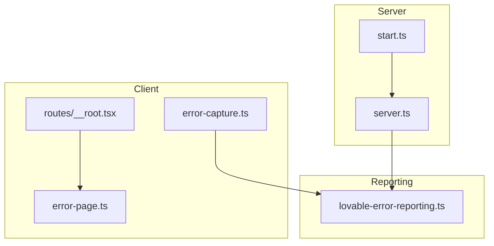
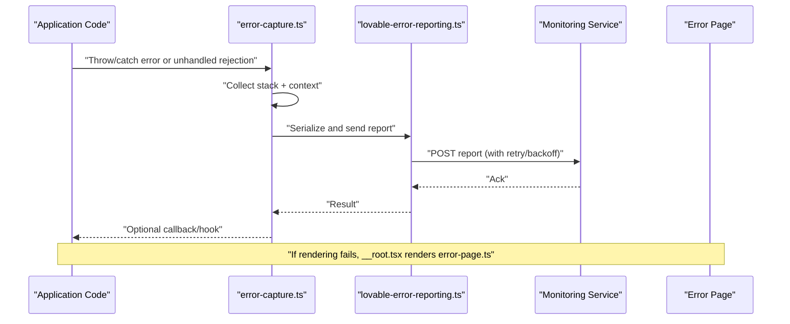
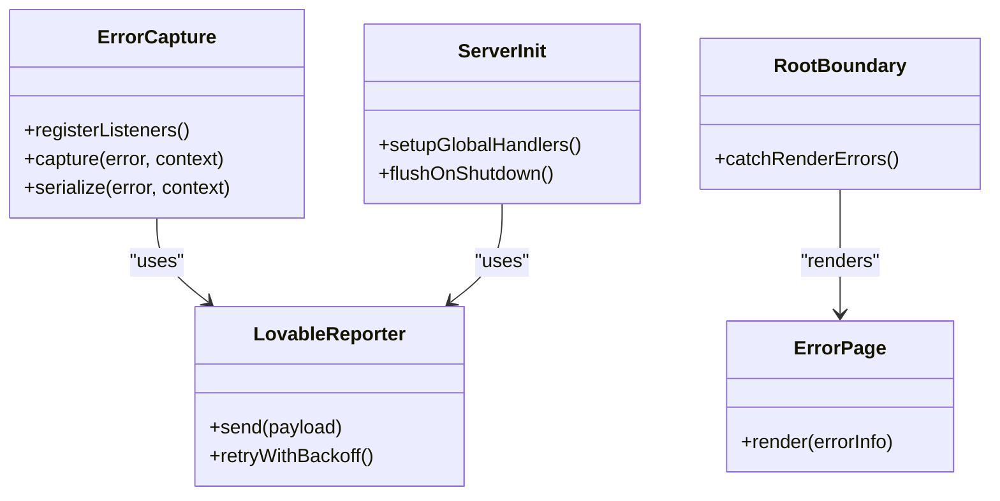

# Error Handling & Capture

<cite>
**Referenced Files in This Document**
- [error-capture.ts](file://src/lib/error-capture.ts)
- [error-page.ts](file://src/lib/error-page.ts)
- [lovable-error-reporting.ts](file://src/lib/lovable-error-reporting.ts)
- [server.ts](file://src/server.ts)
- [__root.tsx](file://src/routes/__root.tsx)
- [router.tsx](file://src/router.tsx)
- [start.ts](file://src/start.ts)
</cite>

## Table of Contents
1. [Introduction](#introduction)
2. [Project Structure](#project-structure)
3. [Core Components](#core-components)
4. [Architecture Overview](#architecture-overview)
5. [Detailed Component Analysis](#detailed-component-analysis)
6. [Dependency Analysis](#dependency-analysis)
7. [Performance Considerations](#performance-considerations)
8. [Troubleshooting Guide](#troubleshooting-guide)
9. [Conclusion](#conclusion)
10. [Appendices](#appendices)

## Introduction

This document explains how errors are handled and captured across SpareAutomation, covering centralized error handling strategy, categorization, reporting workflows, stack trace collection, context gathering, serialization, custom handlers, monitoring integration, user-friendly pages, logging strategies, debugging techniques, production monitoring, recovery patterns, fallbacks, graceful degradation, testing guidance, and error boundaries.

## Project Structure

The error-handling surface is implemented as a small set of focused modules:
- A client-side capture utility that collects stack traces and contextual data and forwards them to a reporting service.
- An error page module used to render user-facing error views.
- A reporting adapter that integrates with an external monitoring provider.
- Server entrypoints that initialize global error listeners and route-level error boundaries.

**Diagram sources**
- [error-capture.ts](file://src/lib/error-capture.ts)
- [error-page.ts](file://src/lib/error-page.ts)
- [lovable-error-reporting.ts](file://src/lib/lovable-error-reporting.ts)
- [server.ts](file://src/server.ts)
- [start.ts](file://src/start.ts)
- [__root.tsx](file://src/routes/__root.tsx)

**Section sources**
- [error-capture.ts](file://src/lib/error-capture.ts)
- [error-page.ts](file://src/lib/error-page.ts)
- [lovable-error-reporting.ts](file://src/lib/lovable-error-reporting.ts)
- [server.ts](file://src/server.ts)
- [start.ts](file://src/start.ts)
- [__root.tsx](file://src/routes/__root.tsx)

## Core Components

- Centralized capture utility: Provides functions to instrument unhandled exceptions, promise rejections, and network failures; gathers runtime context (e.g., environment, URL, user/session identifiers when available); serializes errors into a stable payload format; and sends them to the reporting adapter.
- Reporting adapter: Encapsulates communication with the monitoring service, including retries, rate limiting, and batching where applicable. It exposes a simple interface for the capture utility.
- Error page: Renders a friendly, localized error view for both client and server-rendered routes, surfacing actionable information while hiding sensitive details.
- Server initialization: Registers global process-level error listeners and ensures consistent error responses for HTTP requests.
- Route root boundary: Wraps application rendering with a top-level error boundary to catch rendering errors and display the error page.

Key responsibilities:
- Categorize errors (e.g., client vs server, expected vs unexpected, network vs parsing).
- Collect stack traces and relevant context without leaking secrets.
- Serialize payloads deterministically for deduplication and correlation.
- Provide hooks for custom handlers and integrations.

**Section sources**
- [error-capture.ts](file://src/lib/error-capture.ts)
- [lovable-error-reporting.ts](file://src/lib/lovable-error-reporting.ts)
- [error-page.ts](file://src/lib/error-page.ts)
- [server.ts](file://src/server.ts)
- [__root.tsx](file://src/routes/__root.tsx)

## Architecture Overview

End-to-end flow from error occurrence to monitoring:

**Diagram sources**
- [error-capture.ts](file://src/lib/error-capture.ts)
- [lovable-error-reporting.ts](file://src/lib/lovable-error-reporting.ts)
- [__root.tsx](file://src/routes/__root.tsx)
- [error-page.ts](file://src/lib/error-page.ts)

## Detailed Component Analysis

### Client-Side Error Capture

Responsibilities:
- Global listeners for uncaught exceptions and promise rejections.
- Network failure detection around fetch/XHR calls.
- Context gathering: environment flags, current route, feature flags, anonymized user/session IDs, request metadata when available.
- Stack trace normalization and sanitization (remove secrets, shorten long frames).
- Payload construction and idempotent sending via the reporting adapter.
- Optional hook points for custom enrichment before sending.

Implementation patterns:
- Use a single registration function to attach listeners once at app bootstrap.
- Debounce or batch repeated identical errors within a short window.
- Guard against recursive errors during capture itself.

Customization:
- Provide a configuration object to enable/disable features, add tags, or override the reporter.
- Expose a registerErrorHandler API to plug in additional telemetry or side effects.

Testing tips:
- Mock the reporting adapter to assert payload shape and fields.
- Simulate unhandled rejections and network failures using test utilities.
- Verify that secrets are not included in serialized payloads.

**Section sources**
- [error-capture.ts](file://src/lib/error-capture.ts)

### Reporting Adapter

Responsibilities:
- Send reports to the monitoring backend with appropriate headers and body schema.
- Implement retry with exponential backoff and jitter.
- Respect rate limits and circuit-breaker thresholds.
- Provide a simple synchronous or asynchronous send interface.

Integration:
- Accepts a base URL and optional authentication token from environment variables.
- Supports pluggable transport (fetch-based) so it can be swapped for different providers.

Operational concerns:
- Fail open: if reporting fails, do not impact application behavior.
- Avoid blocking critical paths; queue and flush asynchronously.

**Section sources**
- [lovable-error-reporting.ts](file://src/lib/lovable-error-reporting.ts)

### User-Facing Error Page

Responsibilities:
- Render a clear, non-technical message to users.
- Include a unique error identifier for support follow-up.
- Optionally provide a link to contact support or retry actions.
- Maintain branding and accessibility standards.

Usage:
- Integrated into the root route boundary to catch rendering errors.
- Can be invoked programmatically from components to show controlled error states.

**Section sources**
- [error-page.ts](file://src/lib/error-page.ts)
- [__root.tsx](file://src/routes/__root.tsx)

### Server Initialization and Global Listeners

Responsibilities:
- Register process-level uncaughtException and unhandledRejection handlers.
- Normalize incoming request errors into structured logs and reports.
- Ensure consistent HTTP error responses with safe messages.
- Graceful shutdown hooks to flush pending reports.

Configuration:
- Reads environment variables for reporting endpoints and feature toggles.
- Enables verbose logging only in development.

**Section sources**
- [server.ts](file://src/server.ts)
- [start.ts](file://src/start.ts)

### Route-Level Error Boundaries

Responsibilities:
- Wrap route trees to catch rendering errors and component exceptions.
- Fallback to the error page with minimal state loss.
- Emit analytics events for degraded UX scenarios.

Best practices:
- Keep boundaries close to failing components to preserve as much UI as possible.
- Avoid swallowing errors; always forward to the central capture system.

**Section sources**
- [__root.tsx](file://src/routes/__root.tsx)
- [router.tsx](file://src/router.tsx)

## Dependency Analysis

High-level relationships:

**Diagram sources**
- [error-capture.ts](file://src/lib/error-capture.ts)
- [lovable-error-reporting.ts](file://src/lib/lovable-error-reporting.ts)
- [error-page.ts](file://src/lib/error-page.ts)
- [server.ts](file://src/server.ts)
- [__root.tsx](file://src/routes/__root.tsx)

Coupling and cohesion:
- ErrorCapture depends only on the Reporter interface, keeping it cohesive and swappable.
- ServerInit encapsulates all process-level setup, improving cohesion.
- RootBoundary and ErrorPage are tightly coupled to presentation logic but remain isolated from telemetry.

Potential circular dependencies:
- None observed; capture and reporting are one-directional.

External dependencies:
- Monitoring service endpoint configured via environment variables.
- Standard web APIs for fetch and performance timing.

**Section sources**
- [error-capture.ts](file://src/lib/error-capture.ts)
- [lovable-error-reporting.ts](file://src/lib/lovable-error-reporting.ts)
- [server.ts](file://src/server.ts)
- [__root.tsx](file://src/routes/__root.tsx)

## Performance Considerations

- Batch and debounce frequent errors to reduce overhead.
- Avoid heavy computation in error paths; keep capture lightweight.
- Use async queues for reporting to prevent blocking UI threads.
- Limit payload size by trimming large objects and excluding sensitive data.
- Apply sampling for high-volume, low-severity errors in production.

[No sources needed since this section provides general guidance]

## Troubleshooting Guide

Common issues and resolutions:
- Reports not arriving: verify environment configuration, network egress, and reporter retries. Check server logs for initialization warnings.
- Duplicate reports: ensure idempotency keys are present and deduplication is enabled in the monitoring backend.
- Missing stack traces: confirm source maps are deployed and stack normalization is enabled.
- Secret leakage: audit serialized payloads and sanitize known secret patterns.

Debugging techniques:
- Enable verbose logging in development to inspect capture payloads.
- Add temporary console markers around suspected areas to correlate with reported errors.
- Use the unique error ID shown in the error page to search logs and traces.

Production monitoring:
- Create alerts for spikes in specific error categories.
- Track time-to-detection and time-to-resolution metrics.
- Correlate errors with deployments and traffic changes.

**Section sources**
- [server.ts](file://src/server.ts)
- [lovable-error-reporting.ts](file://src/lib/lovable-error-reporting.ts)
- [error-page.ts](file://src/lib/error-page.ts)

## Conclusion

SpareAutomation’s error handling centers on a small, composable set of modules that capture, enrich, serialize, and report errors consistently across client and server. The design emphasizes safety, performance, and observability while providing clear extension points for custom handlers and integrations. By following the guidelines here, teams can maintain robust error coverage, improve mean time to resolution, and deliver resilient user experiences.

[No sources needed since this section summarizes without analyzing specific files]

## Appendices

### Error Categories and Severity

- Expected vs Unexpected: Validate inputs and business rules as expected; treat infrastructure and third-party failures as unexpected.
- Client vs Server: Separate contexts to tailor reporting and remediation.
- Network vs Parsing vs Rendering: Helps prioritize triage and assign ownership.

[No sources needed since this section provides general guidance]

### Custom Error Handler Example Pattern

- Register a handler early in startup to enrich payloads with domain-specific tags.
- Use the capture utility’s hook to forward to additional systems (e.g., internal dashboards).
- Ensure handlers are idempotent and fail-safe.

**Section sources**
- [error-capture.ts](file://src/lib/error-capture.ts)

### Integrating With Monitoring Services

- Configure the reporter with endpoint and credentials from environment variables.
- Map error tags to service-level labels in your monitoring tool.
- Set up alerting rules keyed by category and severity.

**Section sources**
- [lovable-error-reporting.ts](file://src/lib/lovable-error-reporting.ts)

### Creating User-Friendly Error Pages

- Show a concise message, an error ID, and next steps.
- Avoid exposing stack traces or internals.
- Provide links to status pages or support channels.

**Section sources**
- [error-page.ts](file://src/lib/error-page.ts)

### Error Recovery Patterns and Graceful Degradation

- Retry transient failures with backoff and circuit breaking.
- Fall back to cached or partial content when upstream services are down.
- Disable non-essential features under error conditions to preserve core flows.

[No sources needed since this section provides general guidance]

### Testing Error Scenarios and Error Boundaries

- Unit tests: mock the reporter and assert payload fields and sanitization.
- Integration tests: simulate network failures and unhandled rejections.
- E2E tests: trigger known error paths and verify the error page renders correctly.
- Boundary tests: wrap components with error boundaries and assert fallback behavior.

**Section sources**
- [__root.tsx](file://src/routes/__root.tsx)
- [error-page.ts](file://src/lib/error-page.ts)