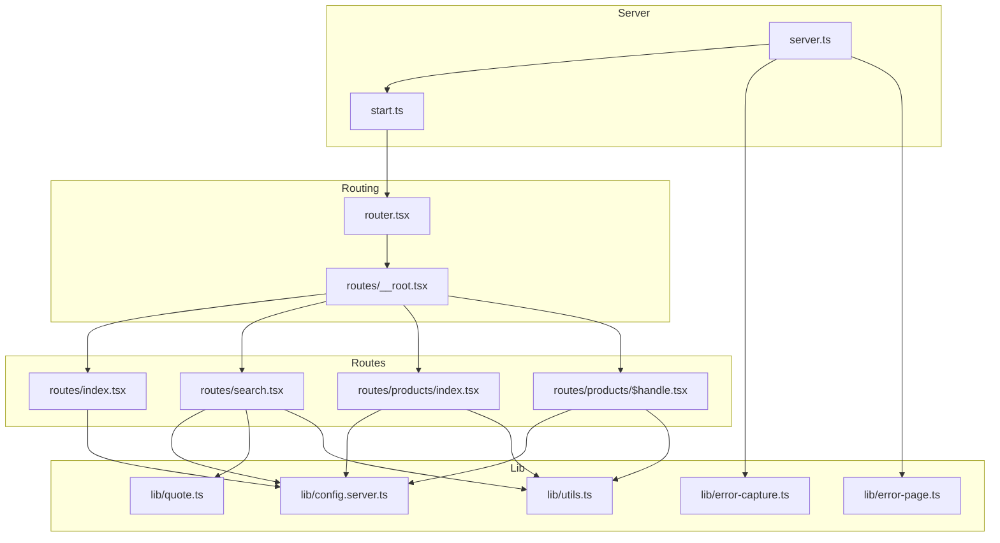
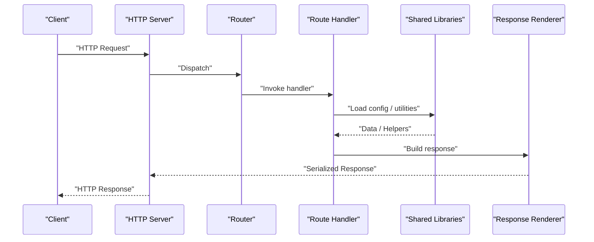
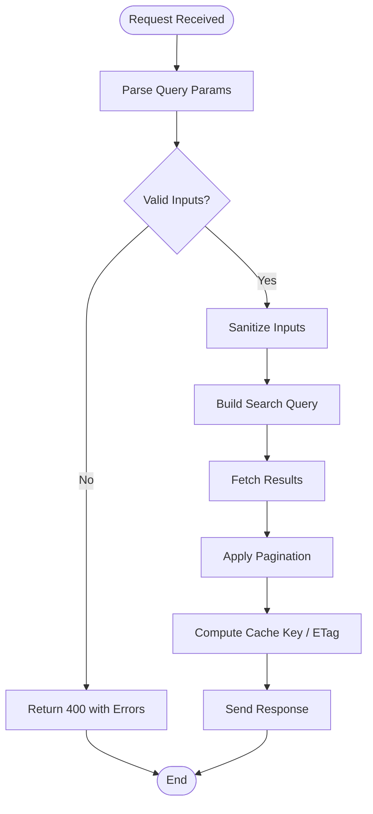
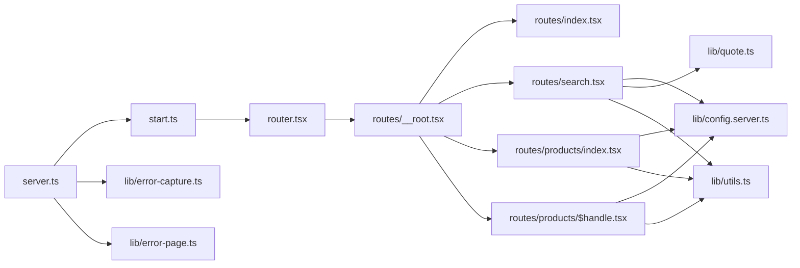

# Request & Response Handling

<cite>
**Referenced Files in This Document**
- [server.ts](file://src/server.ts)
- [start.ts](file://src/start.ts)
- [router.tsx](file://src/router.tsx)
- [__root.tsx](file://src/routes/__root.tsx)
- [index.tsx](file://src/routes/index.tsx)
- [search.tsx](file://src/routes/search.tsx)
- [products/index.tsx](file://src/routes/products/index.tsx)
- [products/$handle.tsx](file://src/routes/products/$handle.tsx)
- [config.server.ts](file://src/lib/config.server.ts)
- [error-capture.ts](file://src/lib/error-capture.ts)
- [error-page.ts](file://src/lib/error-page.ts)
- [quote.ts](file://src/lib/quote.ts)
- [utils.ts](file://src/lib/utils.ts)
- [shopify-dummy-products.csv](file://shopify-dummy-products.csv)
</cite>

## Table of Contents
1. [Introduction](#introduction)
2. [Project Structure](#project-structure)
3. [Core Components](#core-components)
4. [Architecture Overview](#architecture-overview)
5. [Detailed Component Analysis](#detailed-component-analysis)
6. [Dependency Analysis](#dependency-analysis)
7. [Performance Considerations](#performance-considerations)
8. [Troubleshooting Guide](#troubleshooting-guide)
9. [Conclusion](#conclusion)
10. [Appendices](#appendices)

## Introduction
This document explains request and response handling patterns in SpareAutomation, focusing on the standardized request lifecycle, data transformation pipelines, and response formatting strategies. It covers validation, sanitization, security measures, deduplication, concurrency, caching, conditional requests (ETag), pagination, filtering, search query construction, large dataset handling, streaming responses, network optimization, API versioning, and backward compatibility. The guidance is grounded in the project’s server entry points, routing layer, route handlers, and shared utilities.

## Project Structure
SpareAutomation uses a modern full-stack framework with:
- A Node/Bun server entry point that initializes the app and routes
- A router configuration for client-side navigation and SSR
- Route modules that implement page-level logic and data fetching
- Shared libraries for configuration, error capture, and utilities

**Diagram sources**
- [server.ts](file://src/server.ts)
- [start.ts](file://src/start.ts)
- [router.tsx](file://src/router.tsx)
- [__root.tsx](file://src/routes/__root.tsx)
- [index.tsx](file://src/routes/index.tsx)
- [search.tsx](file://src/routes/search.tsx)
- [products/index.tsx](file://src/routes/products/index.tsx)
- [products/$handle.tsx](file://src/routes/products/$handle.tsx)
- [config.server.ts](file://src/lib/config.server.ts)
- [error-capture.ts](file://src/lib/error-capture.ts)
- [error-page.ts](file://src/lib/error-page.ts)
- [quote.ts](file://src/lib/quote.ts)
- [utils.ts](file://src/lib/utils.ts)

**Section sources**
- [server.ts](file://src/server.ts)
- [start.ts](file://src/start.ts)
- [router.tsx](file://src/router.tsx)
- [__root.tsx](file://src/routes/__root.tsx)
- [index.tsx](file://src/routes/index.tsx)
- [search.tsx](file://src/routes/search.tsx)
- [products/index.tsx](file://src/routes/products/index.tsx)
- [products/$handle.tsx](file://src/routes/products/$handle.tsx)
- [config.server.ts](file://src/lib/config.server.ts)
- [error-capture.ts](file://src/lib/error-capture.ts)
- [error-page.ts](file://src/lib/error-page.ts)
- [quote.ts](file://src/lib/quote.ts)
- [utils.ts](file://src/lib/utils.ts)

## Core Components
- Server bootstrap and middleware initialization
- Router setup and root layout
- Route handlers for home, search, products index, and product detail
- Configuration loader for environment variables
- Error capture and error page rendering
- Utilities for quoting and general helpers

Key responsibilities:
- Initialize HTTP server and attach global error handling
- Configure routing and root layout
- Implement per-route data loading and rendering
- Centralize configuration access
- Provide consistent error reporting and user-facing error pages

**Section sources**
- [server.ts](file://src/server.ts)
- [start.ts](file://src/start.ts)
- [router.tsx](file://src/router.tsx)
- [__root.tsx](file://src/routes/__root.tsx)
- [config.server.ts](file://src/lib/config.server.ts)
- [error-capture.ts](file://src/lib/error-capture.ts)
- [error-page.ts](file://src/lib/error-page.ts)

## Architecture Overview
The request lifecycle flows from the HTTP server through the router to route handlers, which may call shared libraries for configuration, utilities, or domain logic. Responses are rendered by route components and returned to the server for serialization.

**Diagram sources**
- [server.ts](file://src/server.ts)
- [router.tsx](file://src/router.tsx)
- [__root.tsx](file://src/routes/__root.tsx)
- [index.tsx](file://src/routes/index.tsx)
- [search.tsx](file://src/routes/search.tsx)
- [products/index.tsx](file://src/routes/products/index.tsx)
- [products/$handle.tsx](file://src/routes/products/$handle.tsx)
- [config.server.ts](file://src/lib/config.server.ts)
- [quote.ts](file://src/lib/quote.ts)
- [utils.ts](file://src/lib/utils.ts)

## Detailed Component Analysis

### Server Bootstrap and Global Error Handling
Responsibilities:
- Start the HTTP server
- Attach global unhandled exception and rejection handlers
- Integrate error capture and error page rendering

Patterns:
- Centralized error capture ensures all unexpected errors are recorded consistently
- Error page module provides user-friendly fallbacks

Security considerations:
- Avoid leaking stack traces to clients; rely on error page rendering
- Ensure sensitive logs do not include secrets

**Section sources**
- [server.ts](file://src/server.ts)
- [error-capture.ts](file://src/lib/error-capture.ts)
- [error-page.ts](file://src/lib/error-page.ts)

### Router and Root Layout
Responsibilities:
- Configure application routes
- Define root layout and global context

Patterns:
- Root component sets up common headers, meta, and error boundaries
- Router maps URL paths to route handlers

**Section sources**
- [router.tsx](file://src/router.tsx)
- [__root.tsx](file://src/routes/__root.tsx)

### Home Route
Responsibilities:
- Serve the landing page
- Optionally load minimal data via shared libraries

Patterns:
- Minimal data fetching to reduce latency
- Clear separation between UI and data loading

**Section sources**
- [index.tsx](file://src/routes/index.tsx)

### Search Route
Responsibilities:
- Parse query parameters
- Validate and sanitize inputs
- Build search queries
- Return paginated results

Patterns:
- Input validation pipeline before querying
- Pagination metadata included in responses
- Optional ETag generation based on normalized query string

**Diagram sources**
- [search.tsx](file://src/routes/search.tsx)
- [config.server.ts](file://src/lib/config.server.ts)
- [quote.ts](file://src/lib/quote.ts)
- [utils.ts](file://src/lib/utils.ts)

**Section sources**
- [search.tsx](file://src/routes/search.tsx)
- [config.server.ts](file://src/lib/config.server.ts)
- [quote.ts](file://src/lib/quote.ts)
- [utils.ts](file://src/lib/utils.ts)

### Products Index Route
Responsibilities:
- List products with pagination and filters
- Support sorting and category selection

Patterns:
- Normalize filter parameters
- Apply default pagination values
- Return structured product list with metadata

**Section sources**
- [products/index.tsx](file://src/routes/products/index.tsx)
- [utils.ts](file://src/lib/utils.ts)

### Product Detail Route
Responsibilities:
- Load product by handle
- Handle missing or invalid handles gracefully

Patterns:
- Parameter validation and safe lookup
- Fallback content when product not found

**Section sources**
- [products/$handle.tsx](file://src/routes/products/$handle.tsx)
- [utils.ts](file://src/lib/utils.ts)

### Configuration Loader
Responsibilities:
- Load environment variables safely
- Provide typed accessors for runtime settings

Patterns:
- Fail-fast on missing required configuration
- Default values for optional settings

**Section sources**
- [config.server.ts](file://src/lib/config.server.ts)

### Utilities and Domain Logic
Responsibilities:
- Helper functions for quoting and general tasks
- Data normalization and formatting

Patterns:
- Pure functions where possible
- Consistent error signaling

**Section sources**
- [quote.ts](file://src/lib/quote.ts)
- [utils.ts](file://src/lib/utils.ts)

## Dependency Analysis
High-level dependencies among core modules:

**Diagram sources**
- [server.ts](file://src/server.ts)
- [start.ts](file://src/start.ts)
- [router.tsx](file://src/router.tsx)
- [__root.tsx](file://src/routes/__root.tsx)
- [index.tsx](file://src/routes/index.tsx)
- [search.tsx](file://src/routes/search.tsx)
- [products/index.tsx](file://src/routes/products/index.tsx)
- [products/$handle.tsx](file://src/routes/products/$handle.tsx)
- [config.server.ts](file://src/lib/config.server.ts)
- [error-capture.ts](file://src/lib/error-capture.ts)
- [error-page.ts](file://src/lib/error-page.ts)
- [quote.ts](file://src/lib/quote.ts)
- [utils.ts](file://src/lib/utils.ts)

**Section sources**
- [server.ts](file://src/server.ts)
- [router.tsx](file://src/router.tsx)
- [__root.tsx](file://src/routes/__root.tsx)
- [index.tsx](file://src/routes/index.tsx)
- [search.tsx](file://src/routes/search.tsx)
- [products/index.tsx](file://src/routes/products/index.tsx)
- [products/$handle.tsx](file://src/routes/products/$handle.tsx)
- [config.server.ts](file://src/lib/config.server.ts)
- [error-capture.ts](file://src/lib/error-capture.ts)
- [error-page.ts](file://src/lib/error-page.ts)
- [quote.ts](file://src/lib/quote.ts)
- [utils.ts](file://src/lib/utils.ts)

## Performance Considerations
- Use pagination defaults and enforce maximum page sizes to prevent heavy payloads
- Normalize and memoize query keys for cacheability
- Prefer server-side rendering for initial loads and leverage client hydration
- Minimize unnecessary re-renders by separating data loading from UI state
- For large datasets, consider progressive loading and virtualization on the client side

[No sources needed since this section provides general guidance]

## Troubleshooting Guide
Common issues and resolutions:
- Unhandled exceptions: ensure global error handlers are active and error capture is enabled
- Missing configuration: validate required environment variables at startup
- Invalid input: return clear 400 responses with actionable messages
- Not found scenarios: render friendly error pages instead of raw stack traces

Operational tips:
- Log request IDs for correlation across services
- Keep error messages free of sensitive details
- Use structured logging for metrics and tracing

**Section sources**
- [error-capture.ts](file://src/lib/error-capture.ts)
- [error-page.ts](file://src/lib/error-page.ts)
- [config.server.ts](file://src/lib/config.server.ts)

## Conclusion
SpareAutomation’s request and response handling follows a clear pattern: server bootstrap with centralized error handling, a router-driven architecture, and route-specific handlers that use shared configuration and utilities. By standardizing input validation, sanitization, pagination, and error responses, the system remains robust, secure, and maintainable. Extending these patterns to include caching, ETags, deduplication, and streaming will further improve performance and reliability.

[No sources needed since this section summarizes without analyzing specific files]

## Appendices

### Standardized Request Lifecycle
- Parse and normalize incoming parameters
- Validate against schema constraints
- Sanitize inputs to prevent injection
- Execute business logic with shared utilities
- Format responses consistently with status codes and metadata
- Apply global error handling and logging

[No sources needed since this section provides general guidance]

### Data Transformation Pipelines
- Normalize inputs into internal models
- Transform domain objects into API-safe shapes
- Serialize outputs with consistent field naming and types

[No sources needed since this section provides general guidance]

### Response Formatting Strategies
- Always include status codes and concise messages
- Wrap data in a predictable envelope for consistency
- Include pagination metadata when applicable

[No sources needed since this section provides general guidance]

### Request Validation, Sanitization, and Security
- Validate all inputs early and reject invalid requests
- Sanitize strings and coerce types
- Enforce least privilege and avoid exposing internals

[No sources needed since this section provides general guidance]

### Handling Different Response Types
- JSON for APIs
- HTML for SSR pages
- Redirects for navigation changes
- Error pages for failures

[No sources needed since this section provides general guidance]

### Request Deduplication and Concurrency
- Deduplicate identical requests using normalized keys
- Limit concurrent operations to protect resources
- Use timeouts and cancellation for long-running tasks

[No sources needed since this section provides general guidance]

### Response Caching, Conditional Requests, and ETags
- Generate stable cache keys from normalized inputs
- Compute ETags based on content hash or version
- Respect If-None-Match and set Cache-Control appropriately

[No sources needed since this section provides general guidance]

### Pagination Patterns, Filtering, and Search Queries
- Enforce default and maximum page sizes
- Normalize filter fields and supported operators
- Construct deterministic queries for caching and indexing

[No sources needed since this section provides general guidance]

### Large Datasets, Streaming, and Network Optimization
- Stream large responses when feasible
- Compress payloads and minimize transfer size
- Use efficient serialization formats

[No sources needed since this section provides general guidance]

### API Versioning and Backward Compatibility
- Version endpoints explicitly
- Deprecate fields gradually with warnings
- Maintain backward-compatible defaults

[No sources needed since this section provides general guidance]