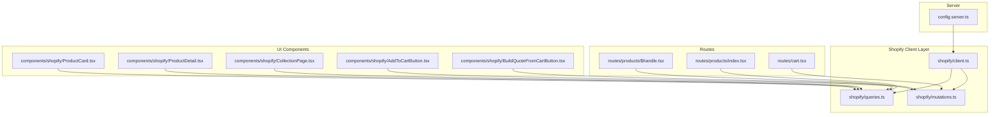
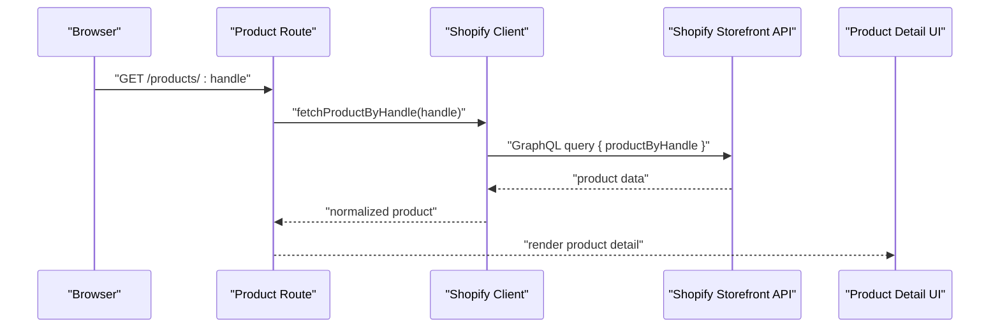
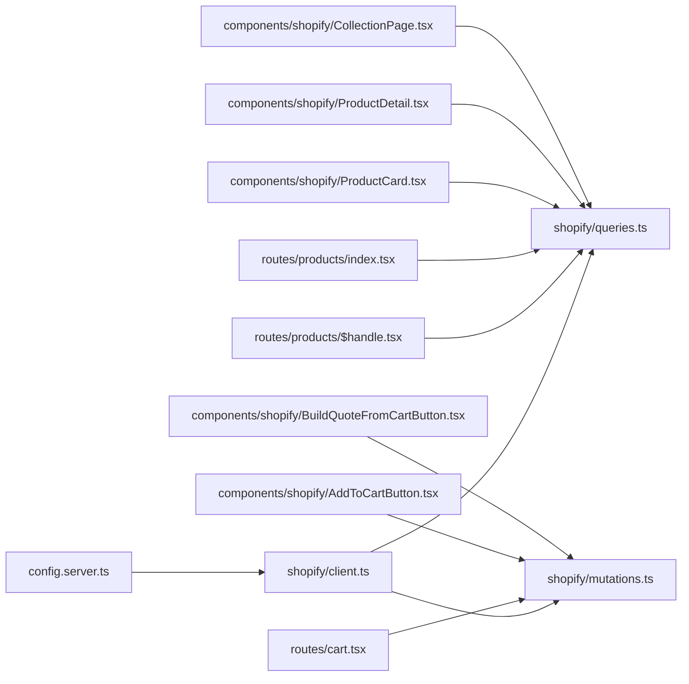

# Shopify API Integration

<cite>
**Referenced Files in This Document**
- [src/lib/shopify/index.ts](file://src/lib/shopify/index.ts)
- [src/lib/shopify/client.ts](file://src/lib/shopify/client.ts)
- [src/lib/shopify/queries.ts](file://src/lib/shopify/queries.ts)
- [src/lib/shopify/mutations.ts](file://src/lib/shopify/mutations.ts)
- [src/components/shopify/ProductCard.tsx](file://src/components/shopify/ProductCard.tsx)
- [src/components/shopify/ProductDetail.tsx](file://src/components/shopify/ProductDetail.tsx)
- [src/components/shopify/CollectionPage.tsx](file://src/components/shopify/CollectionPage.tsx)
- [src/components/shopify/AddToCartButton.tsx](file://src/components/shopify/AddToCartButton.tsx)
- [src/components/shopify/BuildQuoteFromCartButton.tsx](file://src/components/shopify/BuildQuoteFromCartButton.tsx)
- [src/routes/products/$handle.tsx](file://src/routes/products/$handle.tsx)
- [src/routes/products/index.tsx](file://src/routes/products/index.tsx)
- [src/routes/cart.tsx](file://src/routes/cart.tsx)
- [src/lib/config.server.ts](file://src/lib/config.server.ts)
</cite>

## Table of Contents
1. [Introduction](#introduction)
2. [Project Structure](#project-structure)
3. [Core Components](#core-components)
4. [Architecture Overview](#architecture-overview)
5. [Detailed Component Analysis](#detailed-component-analysis)
6. [Dependency Analysis](#dependency-analysis)
7. [Performance Considerations](#performance-considerations)
8. [Troubleshooting Guide](#troubleshooting-guide)
9. [Conclusion](#conclusion)

## Introduction
This document explains how SpareAutomation integrates with Shopify using the Storefront API. It covers product data fetching, cart operations, collection management, GraphQL query and mutation patterns, response handling, authentication, configuration, error handling, rate limiting, caching strategies, and performance optimization. The goal is to provide both a high-level understanding and actionable guidance for developers working on or extending the integration.

## Project Structure
The Shopify integration spans server-side configuration, client initialization, GraphQL queries and mutations, and UI components that consume these APIs. Key areas include:
- Server configuration for environment variables and store access
- A typed client for making Storefront API requests
- Centralized GraphQL queries and mutations
- Route handlers for products and cart
- Reusable UI components for product display, cart actions, and quote building

**Diagram sources**
- [src/lib/config.server.ts](file://src/lib/config.server.ts)
- [src/lib/shopify/client.ts](file://src/lib/shopify/client.ts)
- [src/lib/shopify/queries.ts](file://src/lib/shopify/queries.ts)
- [src/lib/shopify/mutations.ts](file://src/lib/shopify/mutations.ts)
- [src/routes/products/$handle.tsx](file://src/routes/products/$handle.tsx)
- [src/routes/products/index.tsx](file://src/routes/products/index.tsx)
- [src/routes/cart.tsx](file://src/routes/cart.tsx)
- [src/components/shopify/ProductCard.tsx](file://src/components/shopify/ProductCard.tsx)
- [src/components/shopify/ProductDetail.tsx](file://src/components/shopify/ProductDetail.tsx)
- [src/components/shopify/CollectionPage.tsx](file://src/components/shopify/CollectionPage.tsx)
- [src/components/shopify/AddToCartButton.tsx](file://src/components/shopify/AddToCartButton.tsx)
- [src/components/shopify/BuildQuoteFromCartButton.tsx](file://src/components/shopify/BuildQuoteFromCartButton.tsx)

**Section sources**
- [src/lib/config.server.ts](file://src/lib/config.server.ts)
- [src/lib/shopify/client.ts](file://src/lib/shopify/client.ts)
- [src/lib/shopify/queries.ts](file://src/lib/shopify/queries.ts)
- [src/lib/shopify/mutations.ts](file://src/lib/shopify/mutations.ts)
- [src/routes/products/$handle.tsx](file://src/routes/products/$handle.tsx)
- [src/routes/products/index.tsx](file://src/routes/products/index.tsx)
- [src/routes/cart.tsx](file://src/routes/cart.tsx)
- [src/components/shopify/ProductCard.tsx](file://src/components/shopify/ProductCard.tsx)
- [src/components/shopify/ProductDetail.tsx](file://src/components/shopify/ProductDetail.tsx)
- [src/components/shopify/CollectionPage.tsx](file://src/components/shopify/CollectionPage.tsx)
- [src/components/shopify/AddToCartButton.tsx](file://src/components/shopify/AddToCartButton.tsx)
- [src/components/shopify/BuildQuoteFromCartButton.tsx](file://src/components/shopify/BuildQuoteFromCartButton.tsx)

## Core Components
- Storefront client: Initializes authenticated requests to Shopify’s Storefront API using environment-based credentials and domain.
- GraphQL queries: Encapsulates reusable queries for products, collections, and related entities.
- GraphQL mutations: Encapsulates cart-related mutations (e.g., creating carts, adding/removing items).
- Routes: Fetch product details by handle and list products; manage cart state and checkout preparation.
- UI components: Render product cards, detail pages, collection pages, and cart actions.

Key responsibilities:
- Authentication via Storefront Access Token and Store Domain
- Query composition and variable binding
- Error normalization and retry/backoff for transient failures
- Caching of product metadata at the route/component level
- Cart lifecycle management through mutations

**Section sources**
- [src/lib/shopify/client.ts](file://src/lib/shopify/client.ts)
- [src/lib/shopify/queries.ts](file://src/lib/shopify/queries.ts)
- [src/lib/shopify/mutations.ts](file://src/lib/shopify/mutations.ts)
- [src/routes/products/$handle.tsx](file://src/routes/products/$handle.tsx)
- [src/routes/products/index.tsx](file://src/routes/products/index.tsx)
- [src/routes/cart.tsx](file://src/routes/cart.tsx)
- [src/components/shopify/ProductCard.tsx](file://src/components/shopify/ProductCard.tsx)
- [src/components/shopify/ProductDetail.tsx](file://src/components/shopify/ProductDetail.tsx)
- [src/components/shopify/CollectionPage.tsx](file://src/components/shopify/CollectionPage.tsx)
- [src/components/shopify/AddToCartButton.tsx](file://src/components/shopify/AddToCartButton.tsx)
- [src/components/shopify/BuildQuoteFromCartButton.tsx](file://src/components/shopify/BuildQuoteFromCartButton.tsx)

## Architecture Overview
The integration follows a layered architecture:
- Configuration layer reads environment variables for Shopify credentials and base URLs.
- Client layer wraps HTTP calls to the Storefront API endpoint with headers and error mapping.
- Data layer defines GraphQL queries and mutations as typed functions.
- Routing layer orchestrates data fetching and passes results to UI components.
- UI layer renders product information and triggers cart mutations.

**Diagram sources**
- [src/routes/products/$handle.tsx](file://src/routes/products/$handle.tsx)
- [src/lib/shopify/client.ts](file://src/lib/shopify/client.ts)
- [src/lib/shopify/queries.ts](file://src/lib/shopify/queries.ts)

## Detailed Component Analysis

### Storefront Client
Responsibilities:
- Initialize with Store Domain and Storefront Access Token from environment
- Set request headers including content type and optional user agent
- Provide typed methods for executing GraphQL queries and mutations
- Normalize errors and map Shopify-specific statuses to application errors
- Support retries and backoff for transient network issues

Error handling:
- Distinguish between client errors (invalid input), server errors (5xx), and rate limit responses
- Surface structured errors to routes and components for consistent UX

Caching hooks:
- Expose helpers for cache keys and TTLs used by routes and components

**Section sources**
- [src/lib/shopify/client.ts](file://src/lib/shopify/client.ts)

### GraphQL Queries
Common queries:
- Product by handle
- Product listing with pagination
- Collections and their products
- Inventory availability fields where applicable

Patterns:
- Use variables for filters (e.g., handle, first/after pagination)
- Select only required fields to minimize payload size
- Include inventoryQuantity fields when needed for stock checks

Response handling:
- Map null/empty results to friendly states
- Normalize variant selection and media arrays

**Section sources**
- [src/lib/shopify/queries.ts](file://src/lib/shopify/queries.ts)

### GraphQL Mutations
Cart operations:
- Create a new cart
- Add line items to a cart
- Update line item quantities
- Remove line items
- Retrieve cart details and checkout URL

Patterns:
- Use idempotent mutation inputs where possible
- Return minimal necessary fields (cart lines, total price, checkout URL)
- Handle partial failures and return actionable messages

**Section sources**
- [src/lib/shopify/mutations.ts](file://src/lib/shopify/mutations.ts)

### Product Routes
- Product detail route fetches a single product by handle and renders it
- Product index route lists products with pagination and filters

Data flow:
- Route invokes query function
- Client executes GraphQL call
- Response is normalized and passed to component

Caching:
- Route-level caching for product listings and detail pages
- Stale-while-revalidate strategy for improved perceived performance

**Section sources**
- [src/routes/products/$handle.tsx](file://src/routes/products/$handle.tsx)
- [src/routes/products/index.tsx](file://src/routes/products/index.tsx)

### Cart Route
Responsibilities:
- Manage cart state and render current cart contents
- Trigger add/remove/update mutations
- Prepare checkout by obtaining checkout URL

Flow:
- Load existing cart if present
- On action, call appropriate mutation
- Update local state and redirect to checkout when ready

**Section sources**
- [src/routes/cart.tsx](file://src/routes/cart.tsx)

### UI Components
- ProductCard: Displays product thumbnail, title, price, and quick actions
- ProductDetail: Renders full product info, variants, and add-to-cart controls
- CollectionPage: Lists products within a collection with filtering/pagination
- AddToCartButton: Triggers add-to-cart mutation and shows feedback
- BuildQuoteFromCartButton: Converts cart contents into an internal quote object

UX considerations:
- Show loading skeletons while fetching
- Display clear error messages for failed mutations
- Disable buttons during network requests

**Section sources**
- [src/components/shopify/ProductCard.tsx](file://src/components/shopify/ProductCard.tsx)
- [src/components/shopify/ProductDetail.tsx](file://src/components/shopify/ProductDetail.tsx)
- [src/components/shopify/CollectionPage.tsx](file://src/components/shopify/CollectionPage.tsx)
- [src/components/shopify/AddToCartButton.tsx](file://src/components/shopify/AddToCartButton.tsx)
- [src/components/shopify/BuildQuoteFromCartButton.tsx](file://src/components/shopify/BuildQuoteFromCartButton.tsx)

### Environment and Configuration
Configuration includes:
- Store Domain
- Storefront Access Token
- Optional feature flags for enabling/disabling features like inventory checks

Validation:
- Ensure required variables are present at startup
- Fail fast with clear messages if missing

**Section sources**
- [src/lib/config.server.ts](file://src/lib/config.server.ts)

## Dependency Analysis
High-level dependencies:
- Routes depend on queries and mutations
- Queries and mutations depend on the client
- Client depends on environment configuration
- UI components depend on routes’ data and mutation callbacks

**Diagram sources**
- [src/lib/config.server.ts](file://src/lib/config.server.ts)
- [src/lib/shopify/client.ts](file://src/lib/shopify/client.ts)
- [src/lib/shopify/queries.ts](file://src/lib/shopify/queries.ts)
- [src/lib/shopify/mutations.ts](file://src/lib/shopify/mutations.ts)
- [src/routes/products/$handle.tsx](file://src/routes/products/$handle.tsx)
- [src/routes/products/index.tsx](file://src/routes/products/index.tsx)
- [src/routes/cart.tsx](file://src/routes/cart.tsx)
- [src/components/shopify/ProductCard.tsx](file://src/components/shopify/ProductCard.tsx)
- [src/components/shopify/ProductDetail.tsx](file://src/components/shopify/ProductDetail.tsx)
- [src/components/shopify/CollectionPage.tsx](file://src/components/shopify/CollectionPage.tsx)
- [src/components/shopify/AddToCartButton.tsx](file://src/components/shopify/AddToCartButton.tsx)
- [src/components/shopify/BuildQuoteFromCartButton.tsx](file://src/components/shopify/BuildQuoteFromCartButton.tsx)

**Section sources**
- [src/lib/config.server.ts](file://src/lib/config.server.ts)
- [src/lib/shopify/client.ts](file://src/lib/shopify/client.ts)
- [src/lib/shopify/queries.ts](file://src/lib/shopify/queries.ts)
- [src/lib/shopify/mutations.ts](file://src/lib/shopify/mutations.ts)
- [src/routes/products/$handle.tsx](file://src/routes/products/$handle.tsx)
- [src/routes/products/index.tsx](file://src/routes/products/index.tsx)
- [src/routes/cart.tsx](file://src/routes/cart.tsx)
- [src/components/shopify/ProductCard.tsx](file://src/components/shopify/ProductCard.tsx)
- [src/components/shopify/ProductDetail.tsx](file://src/components/shopify/ProductDetail.tsx)
- [src/components/shopify/CollectionPage.tsx](file://src/components/shopify/CollectionPage.tsx)
- [src/components/shopify/AddToCartButton.tsx](file://src/components/shopify/AddToCartButton.tsx)
- [src/components/shopify/BuildQuoteFromCartButton.tsx](file://src/components/shopify/BuildQuoteFromCartButton.tsx)

## Performance Considerations
- Field selection: Request only necessary fields to reduce payload sizes
- Pagination: Use cursors and limit page sizes for large catalogs
- Caching:
  - Route-level caching for product listings and detail pages
  - Component-level memoization for expensive computations
  - Stale-while-revalidate to improve perceived performance
- Network:
  - Retry with exponential backoff for transient errors
  - Deduplicate identical concurrent requests
- UI:
  - Skeleton loaders for better UX during data fetches
  - Debounce search/filter inputs

[No sources needed since this section provides general guidance]

## Troubleshooting Guide
Common issues and resolutions:
- Invalid Store Domain or Access Token: Validate environment variables and ensure they match the target store
- Rate Limiting: Implement backoff and queueing; monitor response headers for limits and reset times
- GraphQL Errors: Inspect message and extensions for field-level errors; surface user-friendly messages
- Missing Fields: Verify schema changes and update queries accordingly
- Cart State Mismatch: Ensure idempotent mutations and reconcile local state after successful responses

Operational tips:
- Log request payloads and responses in development
- Add health checks for Shopify connectivity
- Instrument metrics for latency and error rates

**Section sources**
- [src/lib/shopify/client.ts](file://src/lib/shopify/client.ts)
- [src/lib/shopify/queries.ts](file://src/lib/shopify/queries.ts)
- [src/lib/shopify/mutations.ts](file://src/lib/shopify/mutations.ts)

## Conclusion
The Shopify Storefront API integration in SpareAutomation is organized around a clean client layer, well-scoped GraphQL operations, and focused routes and components. By adhering to strong error handling, thoughtful caching, and efficient query design, the system delivers reliable product browsing, cart operations, and checkout preparation. Extending the integration should follow the established patterns for queries, mutations, and error normalization to maintain consistency and performance.