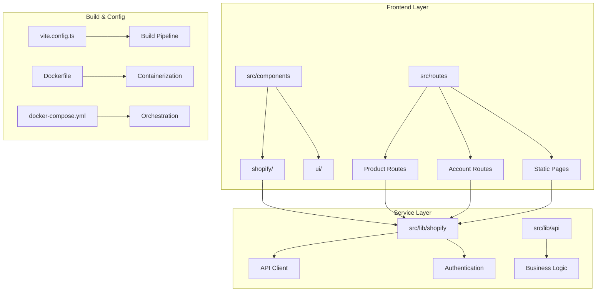
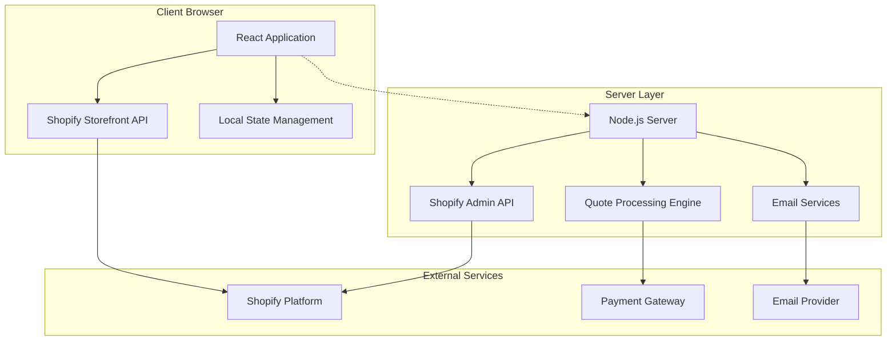
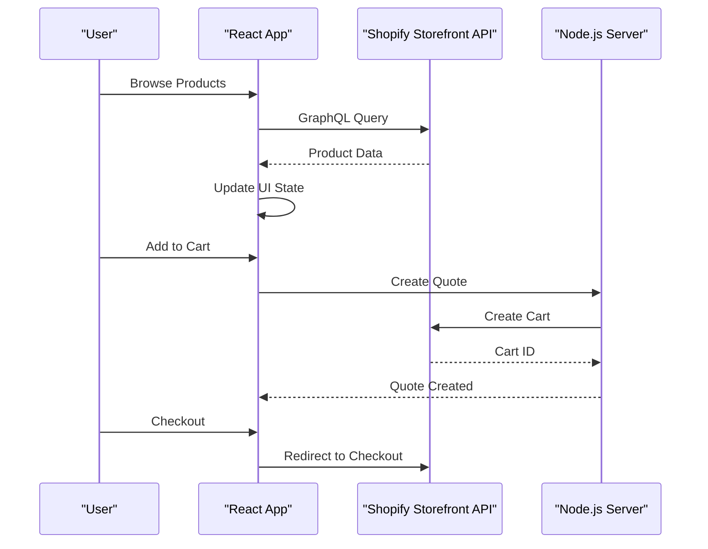
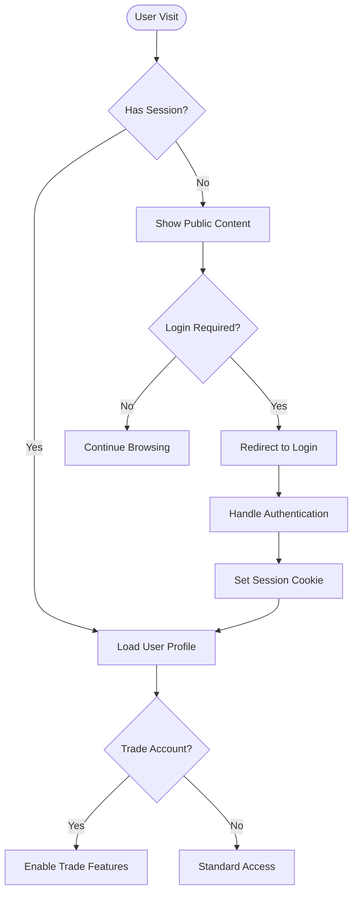
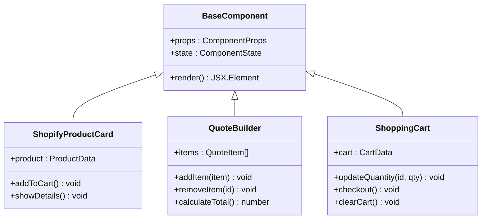
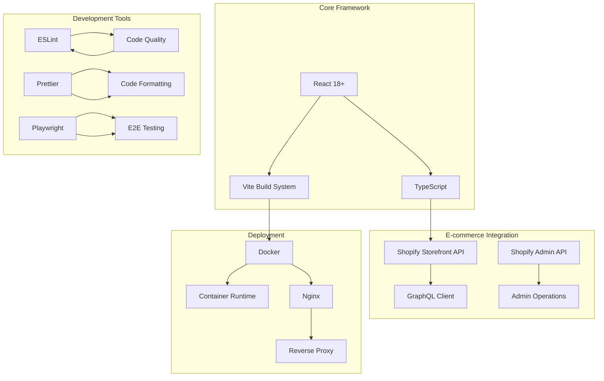
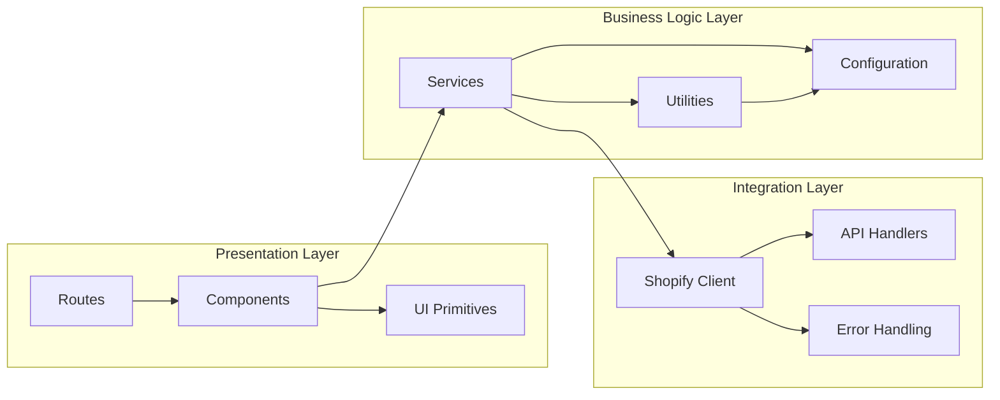
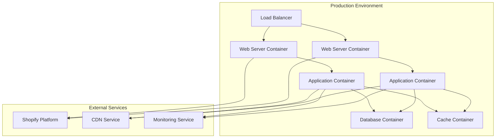

# Architecture Overview

<cite>
**Referenced Files in This Document**
- [package.json](file://package.json)
- [vite.config.ts](file://vite.config.ts)
- [Dockerfile](file://Dockerfile)
- [docker-compose.yml](file://docker-compose.yml)
- [src/router.tsx](file://src/router.tsx)
- [src/server.ts](file://src/server.ts)
- [src/start.ts](file://src/start.ts)
- [nginx.conf](file://nginx.conf)
- [components.json](file://components.json)
- [tsconfig.json](file://tsconfig.json)
</cite>

## Table of Contents
1. [Introduction](#introduction)
2. [Project Structure](#project-structure)
3. [Core Components](#core-components)
4. [Architecture Overview](#architecture-overview)
5. [Detailed Component Analysis](#detailed-component-analysis)
6. [Dependency Analysis](#dependency-analysis)
7. [Performance Considerations](#performance-considerations)
8. [Troubleshooting Guide](#troubleshooting-guide)
9. [Conclusion](#conclusion)
10. [Appendices](#appendices)

## Introduction
SpareAutomation is a modern e-commerce platform built with React and TypeScript, featuring deep Shopify integration for product management, cart operations, and checkout flows. The system employs a component-based architecture with a service layer approach, utilizing Vite for build optimization and Docker for containerized deployment.

## Project Structure
The application follows a feature-based organization with clear separation of concerns:

**Diagram sources**
- [src/router.tsx:1-50](file://src/router.tsx#L1-L50)
- [vite.config.ts:1-100](file://vite.config.ts#L1-L100)
- [Dockerfile:1-50](file://Dockerfile#L1-L50)

**Section sources**
- [src/router.tsx:1-100](file://src/router.tsx#L1-L100)
- [package.json:1-50](file://package.json#L1-L50)

## Core Components

### Frontend Architecture
The frontend implements a modular component architecture with reusable UI primitives and domain-specific components:

- **UI Components**: Base components (buttons, forms, layouts) in `src/components/ui/`
- **Shopify Components**: E-commerce specific components in `src/components/shopify/`
- **Route-based Organization**: Feature-specific routing in `src/routes/`

### Service Layer Design
A dedicated service layer handles external integrations and business logic:

- **Shopify Integration**: API client and authentication services
- **Quote Management**: Cart-to-quote conversion workflows
- **SEO Optimization**: Meta tag and structured data management

**Section sources**
- [src/components/shopify/ProductDetail.tsx:1-100](file://src/components/shopify/ProductDetail.tsx#L1-L100)
- [src/lib/shopify/index.ts:1-50](file://src/lib/shopify/index.ts#L1-L50)
- [src/lib/quote.ts:1-80](file://src/lib/quote.ts#L1-L80)

## Architecture Overview

### System Context Diagram

**Diagram sources**
- [src/server.ts:1-100](file://src/server.ts#L1-L100)
- [src/lib/shopify/index.ts:1-100](file://src/lib/shopify/index.ts#L1-L100)

### Technology Stack
- **Frontend**: React 18+ with TypeScript
- **Build System**: Vite with optimized bundling
- **Styling**: Tailwind CSS with custom component library
- **State Management**: React Query + Local State
- **Backend**: Node.js server for SSR and API routes
- **Deployment**: Docker containers with Nginx reverse proxy

**Section sources**
- [package.json:1-100](file://package.json#L1-L100)
- [tsconfig.json:1-50](file://tsconfig.json#L1-L50)

## Detailed Component Analysis

### Shopify Integration Architecture
The system implements a comprehensive Shopify integration pattern:

**Diagram sources**
- [src/components/shopify/AddToCartButton.tsx:1-100](file://src/components/shopify/AddToCartButton.tsx#L1-L100)
- [src/lib/shopify/cart.ts:1-100](file://src/lib/shopify/cart.ts#L1-L100)

### Authentication Flow
The system supports both public storefront access and authenticated user sessions:

**Diagram sources**
- [src/routes/login.tsx:1-100](file://src/routes/login.tsx#L1-L100)
- [src/routes/register.tsx:1-100](file://src/routes/register.tsx#L1-L100)

### Component Hierarchy
The component architecture follows a hierarchical pattern with clear separation:

**Diagram sources**
- [src/components/shopify/ProductCard.tsx:1-100](file://src/components/shopify/ProductCard.tsx#L1-L100)
- [src/components/shopify/CartPage.tsx:1-100](file://src/components/shopify/CartPage.tsx#L1-L100)

**Section sources**
- [src/components/shopify/AddToCartButton.tsx:1-100](file://src/components/shopify/AddToCartButton.tsx#L1-L100)
- [src/components/shopify/ProductDetail.tsx:1-100](file://src/components/shopify/ProductDetail.tsx#L1-L100)
- [src/lib/quote.ts:1-150](file://src/lib/quote.ts#L1-L150)

## Dependency Analysis

### External Dependencies
The system relies on several key external services and libraries:

**Diagram sources**
- [package.json:1-200](file://package.json#L1-L200)
- [docker-compose.yml:1-100](file://docker-compose.yml#L1-L100)

### Module Relationships
Internal module dependencies follow a layered architecture:

**Diagram sources**
- [src/router.tsx:1-100](file://src/router.tsx#L1-L100)
- [src/lib/shopify/index.ts:1-100](file://src/lib/shopify/index.ts#L1-L100)

**Section sources**
- [package.json:1-300](file://package.json#L1-L300)
- [src/router.tsx:1-100](file://src/router.tsx#L1-L100)

## Performance Considerations

### Build Optimization
- **Vite Configuration**: Optimized bundling with code splitting and tree shaking
- **Asset Optimization**: Image compression and lazy loading strategies
- **Bundle Analysis**: Regular bundle size monitoring and optimization

### Runtime Performance
- **Component Memoization**: React.memo and useMemo for expensive computations
- **Data Fetching**: Efficient caching strategies with React Query
- **Image Loading**: Lazy loading and responsive image formats

### SEO Optimization
- **Server-Side Rendering**: Enhanced initial page load performance
- **Meta Tag Management**: Dynamic SEO metadata generation
- **Structured Data**: JSON-LD implementation for rich search results

**Section sources**
- [vite.config.ts:1-150](file://vite.config.ts#L1-L150)
- [src/lib/seo.ts:1-100](file://src/lib/seo.ts#L1-L100)

## Troubleshooting Guide

### Common Issues
- **Shopify API Rate Limits**: Implement exponential backoff and request queuing
- **Build Failures**: Verify Node.js version compatibility and dependency resolution
- **Deployment Issues**: Check environment variables and container networking

### Debugging Strategies
- **Development Logging**: Structured logging with log levels
- **Error Tracking**: Centralized error reporting and monitoring
- **Performance Profiling**: React DevTools and browser performance analysis

**Section sources**
- [src/lib/error-capture.ts:1-100](file://src/lib/error-capture.ts#L1-L100)
- [src/lib/lovable-error-reporting.ts:1-100](file://src/lib/lovable-error-reporting.ts#L1-L100)

## Conclusion
SpareAutomation demonstrates a well-architected modern web application leveraging React, TypeScript, and Shopify integration. The system's modular design, comprehensive testing strategy, and containerized deployment pipeline provide a solid foundation for scalable e-commerce functionality.

## Appendices

### Deployment Topology

**Diagram sources**
- [docker-compose.yml:1-150](file://docker-compose.yml#L1-L150)
- [nginx.conf:1-100](file://nginx.conf#L1-L100)