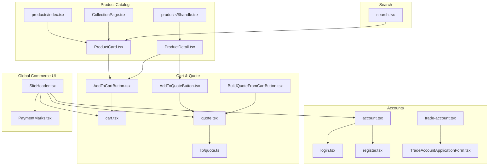
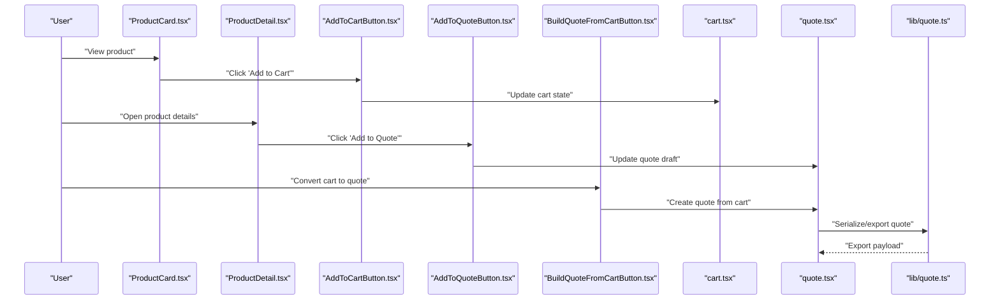
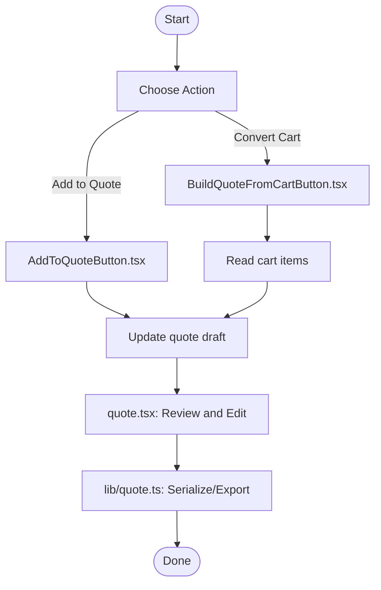
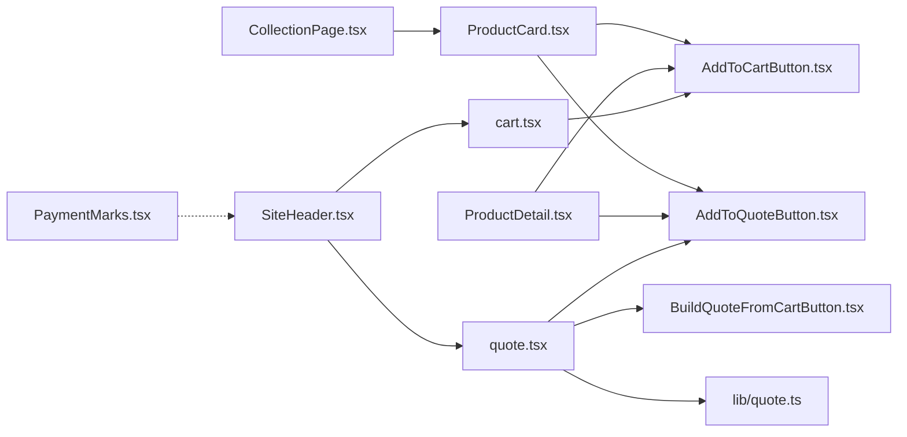

# Core Features

<cite>
**Referenced Files in This Document**
- [src/components/shopify/ProductCard.tsx](file://src/components/shopify/ProductCard.tsx)
- [src/components/shopify/ProductDetail.tsx](file://src/components/shopify/ProductDetail.tsx)
- [src/components/shopify/CollectionPage.tsx](file://src/components/shopify/CollectionPage.tsx)
- [src/components/shopify/AddToCartButton.tsx](file://src/components/shopify/AddToCartButton.tsx)
- [src/components/shopify/AddToQuoteButton.tsx](file://src/components/shopify/AddToQuoteButton.tsx)
- [src/components/shopify/BuildQuoteFromCartButton.tsx](file://src/components/shopify/BuildQuoteFromCartButton.tsx)
- [src/routes/products/index.tsx](file://src/routes/products/index.tsx)
- [src/routes/products/$handle.tsx](file://src/routes/products/$handle.tsx)
- [src/routes/cart.tsx](file://src/routes/cart.tsx)
- [src/routes/quote.tsx](file://src/routes/quote.tsx)
- [src/lib/quote.ts](file://src/lib/quote.ts)
- [src/routes/search.tsx](file://src/routes/search.tsx)
- [src/routes/account.tsx](file://src/routes/account.tsx)
- [src/routes/login.tsx](file://src/routes/login.tsx)
- [src/routes/register.tsx](file://src/routes/register.tsx)
- [src/routes/trade-account.tsx](file://src/routes/trade-account.tsx)
- [src/components/shopify/TradeAccountApplicationForm.tsx](file://src/components/shopify/TradeAccountApplicationForm.tsx)
- [src/components/shopify/SiteHeader.tsx](file://src/components/shopify/SiteHeader.tsx)
- [src/components/shopify/PaymentMarks.tsx](file://src/components/shopify/PaymentMarks.tsx)
</cite>

## Table of Contents
1. [Introduction](#introduction)
2. [Project Structure](#project-structure)
3. [Core Components](#core-components)
4. [Architecture Overview](#architecture-overview)
5. [Detailed Component Analysis](#detailed-component-analysis)
6. [Dependency Analysis](#dependency-analysis)
7. [Performance Considerations](#performance-considerations)
8. [Troubleshooting Guide](#troubleshooting-guide)
9. [Conclusion](#conclusion)
10. [Appendices](#appendices)

## Introduction
This document explains the core e-commerce features of SpareAutomation, focusing on:
- Product catalog system and browsing
- Shopping cart functionality and persistence
- Quote generation workflow from cart items
- User account management and trade accounts
- Configuration options for product display, cart behavior, and quote export formats
- Practical examples for extending product types, customizing cart operations, and integrating additional payment methods
- Common use cases such as bulk ordering, special pricing for trade accounts, and multi-currency support
- Relationships between products, carts, quotes, and user sessions

The implementation is primarily client-side with React components and routes, complemented by a small library module for quote utilities.

## Project Structure
Key areas relevant to the core features:
- Product catalog UI and routes: components under src/components/shopify and routes under src/routes/products
- Cart and quote flows: routes under src/routes and utility logic under src/lib/quote.ts
- Account and trade account pages: routes under src/routes and related form component
- Global navigation and commerce UI elements: SiteHeader, PaymentMarks

**Diagram sources**
- [src/routes/products/index.tsx](file://src/routes/products/index.tsx)
- [src/routes/products/$handle.tsx](file://src/routes/products/$handle.tsx)
- [src/components/shopify/ProductCard.tsx](file://src/components/shopify/ProductCard.tsx)
- [src/components/shopify/ProductDetail.tsx](file://src/components/shopify/ProductDetail.tsx)
- [src/components/shopify/CollectionPage.tsx](file://src/components/shopify/CollectionPage.tsx)
- [src/components/shopify/AddToCartButton.tsx](file://src/components/shopify/AddToCartButton.tsx)
- [src/components/shopify/AddToQuoteButton.tsx](file://src/components/shopify/AddToQuoteButton.tsx)
- [src/components/shopify/BuildQuoteFromCartButton.tsx](file://src/components/shopify/BuildQuoteFromCartButton.tsx)
- [src/routes/cart.tsx](file://src/routes/cart.tsx)
- [src/routes/quote.tsx](file://src/routes/quote.tsx)
- [src/lib/quote.ts](file://src/lib/quote.ts)
- [src/routes/search.tsx](file://src/routes/search.tsx)
- [src/routes/account.tsx](file://src/routes/account.tsx)
- [src/routes/login.tsx](file://src/routes/login.tsx)
- [src/routes/register.tsx](file://src/routes/register.tsx)
- [src/routes/trade-account.tsx](file://src/routes/trade-account.tsx)
- [src/components/shopify/TradeAccountApplicationForm.tsx](file://src/components/shopify/TradeAccountApplicationForm.tsx)
- [src/components/shopify/SiteHeader.tsx](file://src/components/shopify/SiteHeader.tsx)
- [src/components/shopify/PaymentMarks.tsx](file://src/components/shopify/PaymentMarks.tsx)

**Section sources**
- [src/routes/products/index.tsx](file://src/routes/products/index.tsx)
- [src/routes/products/$handle.tsx](file://src/routes/products/$handle.tsx)
- [src/components/shopify/ProductCard.tsx](file://src/components/shopify/ProductCard.tsx)
- [src/components/shopify/ProductDetail.tsx](file://src/components/shopify/ProductDetail.tsx)
- [src/components/shopify/CollectionPage.tsx](file://src/components/shopify/CollectionPage.tsx)
- [src/routes/cart.tsx](file://src/routes/cart.tsx)
- [src/routes/quote.tsx](file://src/routes/quote.tsx)
- [src/lib/quote.ts](file://src/lib/quote.ts)
- [src/routes/search.tsx](file://src/routes/search.tsx)
- [src/routes/account.tsx](file://src/routes/account.tsx)
- [src/routes/login.tsx](file://src/routes/login.tsx)
- [src/routes/register.tsx](file://src/routes/register.tsx)
- [src/routes/trade-account.tsx](file://src/routes/trade-account.tsx)
- [src/components/shopify/TradeAccountApplicationForm.tsx](file://src/components/shopify/TradeAccountApplicationForm.tsx)
- [src/components/shopify/SiteHeader.tsx](file://src/components/shopify/SiteHeader.tsx)
- [src/components/shopify/PaymentMarks.tsx](file://src/components/shopify/PaymentMarks.tsx)

## Core Components
- ProductCard: Displays product summary and actions (add to cart or add to quote). It is used across collection views and product detail contexts.
- ProductDetail: Shows full product information and controls for adding items to cart or quote.
- CollectionPage: Renders a list/grid of products for browsing categories or collections.
- AddToCartButton: Adds selected product(s) to the shopping cart state and persists it.
- AddToQuoteButton: Adds selected product(s) to the quote draft state.
- BuildQuoteFromCartButton: Converts current cart contents into a quote draft.
- Quote utilities (lib/quote.ts): Provides helpers for building, serializing, and exporting quotes.
- Cart route: Manages cart view, quantities, removals, and checkout initiation.
- Quote route: Manages quote review, editing, and export workflows.
- Search route: Enables product discovery via query parameters.
- Account routes: Provide login, registration, and profile access; trade account application flow is supported.
- SiteHeader: Global navigation including cart and quote entry points.
- PaymentMarks: Displays accepted payment method logos.

**Section sources**
- [src/components/shopify/ProductCard.tsx](file://src/components/shopify/ProductCard.tsx)
- [src/components/shopify/ProductDetail.tsx](file://src/components/shopify/ProductDetail.tsx)
- [src/components/shopify/CollectionPage.tsx](file://src/components/shopify/CollectionPage.tsx)
- [src/components/shopify/AddToCartButton.tsx](file://src/components/shopify/AddToCartButton.tsx)
- [src/components/shopify/AddToQuoteButton.tsx](file://src/components/shopify/AddToQuoteButton.tsx)
- [src/components/shopify/BuildQuoteFromCartButton.tsx](file://src/components/shopify/BuildQuoteFromCartButton.tsx)
- [src/routes/cart.tsx](file://src/routes/cart.tsx)
- [src/routes/quote.tsx](file://src/routes/quote.tsx)
- [src/lib/quote.ts](file://src/lib/quote.ts)
- [src/routes/search.tsx](file://src/routes/search.tsx)
- [src/routes/account.tsx](file://src/routes/account.tsx)
- [src/routes/login.tsx](file://src/routes/login.tsx)
- [src/routes/register.tsx](file://src/routes/register.tsx)
- [src/routes/trade-account.tsx](file://src/routes/trade-account.tsx)
- [src/components/shopify/TradeAccountApplicationForm.tsx](file://src/components/shopify/TradeAccountApplicationForm.tsx)
- [src/components/shopify/SiteHeader.tsx](file://src/components/shopify/SiteHeader.tsx)
- [src/components/shopify/PaymentMarks.tsx](file://src/components/shopify/PaymentMarks.tsx)

## Architecture Overview
High-level data and control flow:
- Products are rendered by ProductCard and ProductDetail, which dispatch actions to update cart or quote state.
- The cart route manages persisted cart state and exposes operations like increment/decrement and remove.
- The quote route composes quotes from either direct “add to quote” actions or by converting the cart.
- Quote utilities provide serialization and export helpers.
- Search route filters and displays matching products.
- Account routes manage authentication context and profile access; trade account application integrates with the same UI framework.

**Diagram sources**
- [src/components/shopify/ProductCard.tsx](file://src/components/shopify/ProductCard.tsx)
- [src/components/shopify/ProductDetail.tsx](file://src/components/shopify/ProductDetail.tsx)
- [src/components/shopify/AddToCartButton.tsx](file://src/components/shopify/AddToCartButton.tsx)
- [src/components/shopify/AddToQuoteButton.tsx](file://src/components/shopify/AddToQuoteButton.tsx)
- [src/components/shopify/BuildQuoteFromCartButton.tsx](file://src/components/shopify/BuildQuoteFromCartButton.tsx)
- [src/routes/cart.tsx](file://src/routes/cart.tsx)
- [src/routes/quote.tsx](file://src/routes/quote.tsx)
- [src/lib/quote.ts](file://src/lib/quote.ts)

## Detailed Component Analysis

### Product Catalog System
- Product listing and browsing:
  - CollectionPage renders multiple ProductCard instances for efficient browsing.
  - products/index.tsx provides the main catalog entry point.
- Product detail:
  - products/$handle.tsx resolves a specific product by handle and renders ProductDetail.
  - ProductDetail shows detailed attributes and action buttons for cart and quote.
- Product card:
  - ProductCard encapsulates product metadata display and quick actions.

Configuration options for product display:
- Use props on ProductCard and ProductDetail to toggle visibility of price, SKU, images, and descriptions.
- Control layout variants (grid vs list) via CollectionPage configuration.

Extending product types:
- Introduce new fields in ProductCard and ProductDetail to render type-specific attributes.
- Add conditional rendering based on product type or tags.

**Section sources**
- [src/components/shopify/CollectionPage.tsx](file://src/components/shopify/CollectionPage.tsx)
- [src/routes/products/index.tsx](file://src/routes/products/index.tsx)
- [src/routes/products/$handle.tsx](file://src/routes/products/$handle.tsx)
- [src/components/shopify/ProductDetail.tsx](file://src/components/shopify/ProductDetail.tsx)
- [src/components/shopify/ProductCard.tsx](file://src/components/shopify/ProductCard.tsx)

### Shopping Cart Functionality
- Adding items:
  - AddToCartButton updates cart state and persists it for session continuity.
- Cart page:
  - cart.tsx manages item quantities, removals, and totals.
- Persistence:
  - Cart state is maintained across navigations within the session.

Customization points:
- Adjust minimum order quantities or step increments in AddToCartButton.
- Customize cart summary calculations and tax/shipping placeholders in cart.tsx.

Bulk ordering:
- Allow quantity increments directly from ProductCard or ProductDetail for high-volume purchases.
- Provide a “duplicate line item” action in cart.tsx for rapid reordering.

**Section sources**
- [src/components/shopify/AddToCartButton.tsx](file://src/components/shopify/AddToCartButton.tsx)
- [src/routes/cart.tsx](file://src/routes/cart.tsx)

### Quote Generation Workflow
- Direct addition:
  - AddToQuoteButton adds items to a quote draft without affecting the cart.
- Convert cart to quote:
  - BuildQuoteFromCartButton creates a quote from the current cart contents.
- Quote management:
  - quote.tsx provides the interface to review, edit, and export quotes.
- Export formats:
  - lib/quote.ts contains helpers to serialize quotes into structured payloads suitable for export.

Export customization:
- Extend lib/quote.ts to support CSV, PDF, or email-ready formats.
- Add optional fields such as requested delivery date or notes.

**Diagram sources**
- [src/components/shopify/AddToQuoteButton.tsx](file://src/components/shopify/AddToQuoteButton.tsx)
- [src/components/shopify/BuildQuoteFromCartButton.tsx](file://src/components/shopify/BuildQuoteFromCartButton.tsx)
- [src/routes/quote.tsx](file://src/routes/quote.tsx)
- [src/lib/quote.ts](file://src/lib/quote.ts)

**Section sources**
- [src/components/shopify/AddToQuoteButton.tsx](file://src/components/shopify/AddToQuoteButton.tsx)
- [src/components/shopify/BuildQuoteFromCartButton.tsx](file://src/components/shopify/BuildQuoteFromCartButton.tsx)
- [src/routes/quote.tsx](file://src/routes/quote.tsx)
- [src/lib/quote.ts](file://src/lib/quote.ts)

### User Account Management
- Authentication and profile:
  - account.tsx provides access to user profile and settings.
  - login.tsx and register.tsx handle sign-in and registration flows.
- Trade accounts:
  - trade-account.tsx offers a dedicated entry point for trade account applications.
  - TradeAccountApplicationForm.tsx captures required applicant information.

Special pricing for trade accounts:
- Integrate trade account status into product pricing logic by checking account type before displaying prices or applying discounts.
- Gate certain products or pricing tiers behind trade account verification.

Multi-currency support:
- Centralize currency selection in SiteHeader and propagate to product components to adjust displayed currencies.
- Ensure consistent formatting across cart and quote summaries.

**Section sources**
- [src/routes/account.tsx](file://src/routes/account.tsx)
- [src/routes/login.tsx](file://src/routes/login.tsx)
- [src/routes/register.tsx](file://src/routes/register.tsx)
- [src/routes/trade-account.tsx](file://src/routes/trade-account.tsx)
- [src/components/shopify/TradeAccountApplicationForm.tsx](file://src/components/shopify/TradeAccountApplicationForm.tsx)
- [src/components/shopify/SiteHeader.tsx](file://src/components/shopify/SiteHeader.tsx)

### Search Capabilities
- search.tsx implements product discovery using query parameters.
- Results integrate with ProductCard for consistent presentation.

Search customization:
- Add filters (category, brand, availability) by extending the search route’s query handling.
- Debounce input to reduce network calls if fetching results remotely.

**Section sources**
- [src/routes/search.tsx](file://src/routes/search.tsx)
- [src/components/shopify/ProductCard.tsx](file://src/components/shopify/ProductCard.tsx)

## Dependency Analysis
Relationships among key modules:
- ProductCard depends on AddToCartButton and AddToQuoteButton for actions.
- ProductDetail depends on AddToCartButton and AddToQuoteButton for interactions.
- CollectionPage composes ProductCard instances.
- Cart route consumes AddToCartButton updates and drives cart state.
- Quote route consumes AddToQuoteButton and BuildQuoteFromCartButton, and uses lib/quote.ts for export.
- SiteHeader links to cart, quote, and account routes.
- PaymentMarks is a static UI element indicating accepted payments.

**Diagram sources**
- [src/components/shopify/ProductCard.tsx](file://src/components/shopify/ProductCard.tsx)
- [src/components/shopify/ProductDetail.tsx](file://src/components/shopify/ProductDetail.tsx)
- [src/components/shopify/CollectionPage.tsx](file://src/components/shopify/CollectionPage.tsx)
- [src/components/shopify/AddToCartButton.tsx](file://src/components/shopify/AddToCartButton.tsx)
- [src/components/shopify/AddToQuoteButton.tsx](file://src/components/shopify/AddToQuoteButton.tsx)
- [src/components/shopify/BuildQuoteFromCartButton.tsx](file://src/components/shopify/BuildQuoteFromCartButton.tsx)
- [src/routes/cart.tsx](file://src/routes/cart.tsx)
- [src/routes/quote.tsx](file://src/routes/quote.tsx)
- [src/lib/quote.ts](file://src/lib/quote.ts)
- [src/components/shopify/SiteHeader.tsx](file://src/components/shopify/SiteHeader.tsx)
- [src/components/shopify/PaymentMarks.tsx](file://src/components/shopify/PaymentMarks.tsx)

**Section sources**
- [src/components/shopify/ProductCard.tsx](file://src/components/shopify/ProductCard.tsx)
- [src/components/shopify/ProductDetail.tsx](file://src/components/shopify/ProductDetail.tsx)
- [src/components/shopify/CollectionPage.tsx](file://src/components/shopify/CollectionPage.tsx)
- [src/components/shopify/AddToCartButton.tsx](file://src/components/shopify/AddToCartButton.tsx)
- [src/components/shopify/AddToQuoteButton.tsx](file://src/components/shopify/AddToQuoteButton.tsx)
- [src/components/shopify/BuildQuoteFromCartButton.tsx](file://src/components/shopify/BuildQuoteFromCartButton.tsx)
- [src/routes/cart.tsx](file://src/routes/cart.tsx)
- [src/routes/quote.tsx](file://src/routes/quote.tsx)
- [src/lib/quote.ts](file://src/lib/quote.ts)
- [src/components/shopify/SiteHeader.tsx](file://src/components/shopify/SiteHeader.tsx)
- [src/components/shopify/PaymentMarks.tsx](file://src/components/shopify/PaymentMarks.tsx)

## Performance Considerations
- Lazy load product images and defer heavy computations until needed.
- Memoize expensive calculations (e.g., totals, discounts) in cart and quote routes.
- Debounce search inputs to minimize unnecessary processing.
- Avoid re-renders by keeping cart and quote state minimal and stable.

[No sources needed since this section provides general guidance]

## Troubleshooting Guide
Common issues and resolutions:
- Cart not persisting:
  - Verify that AddToCartButton updates the cart store and that cart.tsx reads from the same source.
- Quote export fails:
  - Check lib/quote.ts serialization functions for missing fields or unsupported formats.
- Search returns no results:
  - Confirm query parameter parsing in search.tsx and ensure product handles/tags match search terms.
- Trade account pricing not applied:
  - Ensure account status is checked before computing prices in product components.

**Section sources**
- [src/components/shopify/AddToCartButton.tsx](file://src/components/shopify/AddToCartButton.tsx)
- [src/routes/cart.tsx](file://src/routes/cart.tsx)
- [src/routes/quote.tsx](file://src/routes/quote.tsx)
- [src/lib/quote.ts](file://src/lib/quote.ts)
- [src/routes/search.tsx](file://src/routes/search.tsx)

## Conclusion
SpareAutomation’s core e-commerce features are implemented through focused components and routes:
- Product catalog browsing and detail views drive user engagement.
- Cart and quote flows provide flexible purchasing and quoting experiences.
- Account and trade account pages enable specialized pricing and workflows.
- Extensibility points exist in product components, cart/quote routes, and quote utilities to support advanced requirements such as bulk ordering, multi-currency, and custom export formats.

[No sources needed since this section summarizes without analyzing specific files]

## Appendices

### Practical Examples

- Extend product types:
  - Add new fields to ProductCard and ProductDetail to render type-specific attributes.
  - Introduce conditional rendering based on product tags or type identifiers.

- Customize cart operations:
  - Modify AddToCartButton to enforce minimum order quantities or step increments.
  - Enhance cart.tsx with discount rules or shipping estimators.

- Integrate additional payment methods:
  - Update PaymentMarks to reflect new providers.
  - Extend checkout initiation in cart.tsx to call new payment endpoints.

- Multi-currency support:
  - Centralize currency selection in SiteHeader and propagate to product and cart components.
  - Format amounts consistently across all commerce surfaces.

- Bulk ordering:
  - Enable large quantity increments in ProductCard and ProductDetail.
  - Provide duplicate line item actions in cart.tsx for rapid reorders.

- Special pricing for trade accounts:
  - Gate discounted pricing behind trade account verification in product components.
  - Display trade-only badges and messages where applicable.

[No sources needed since this section provides general guidance]