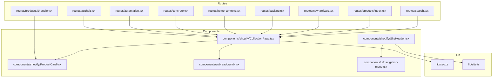
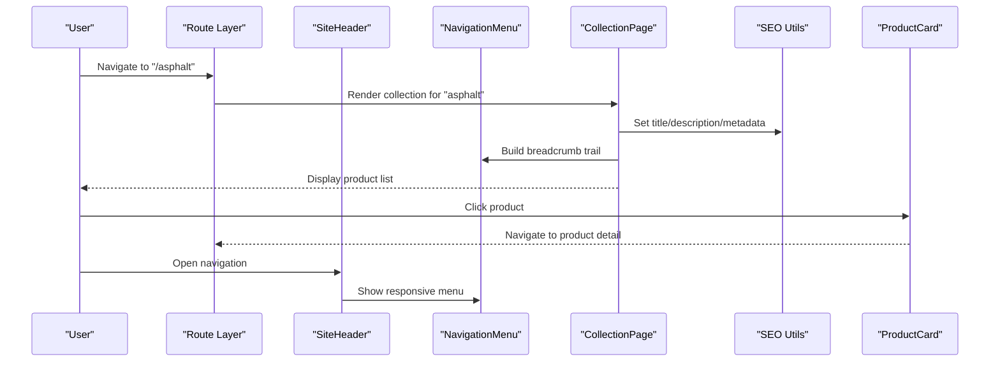
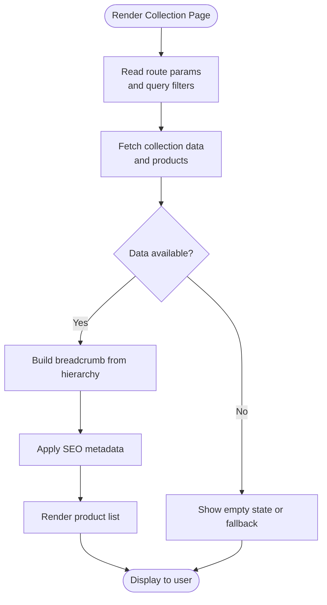
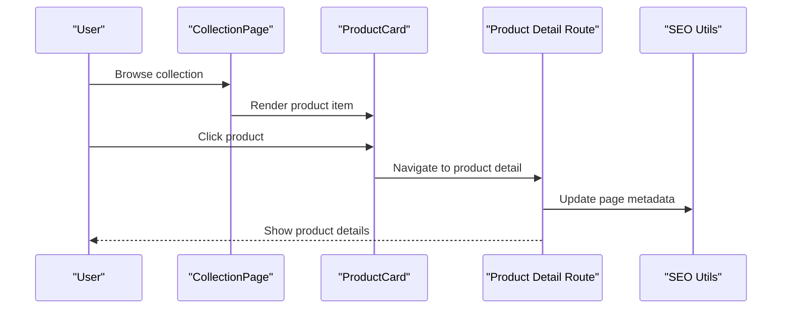
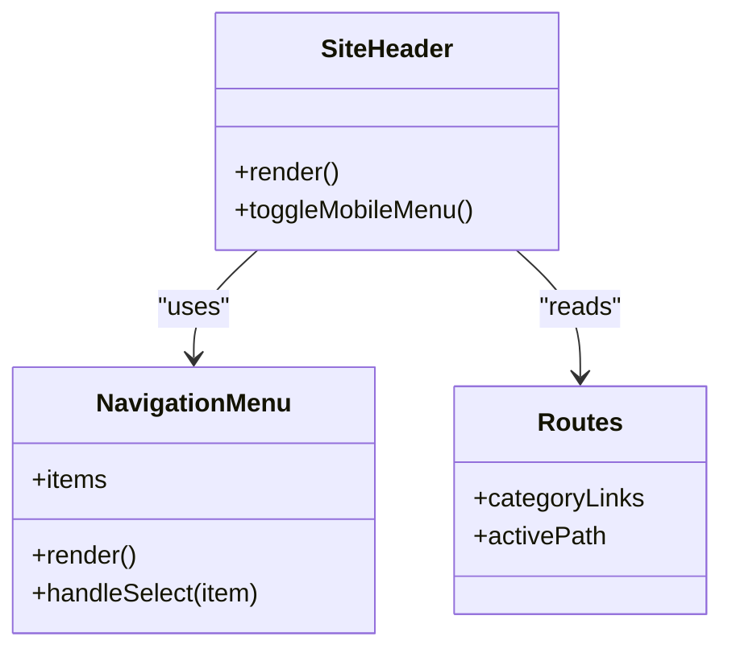
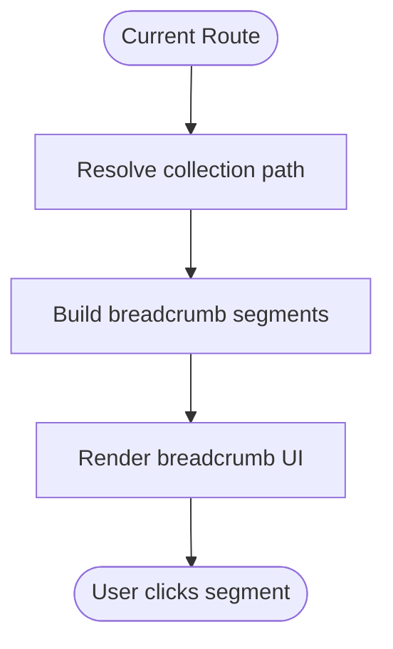
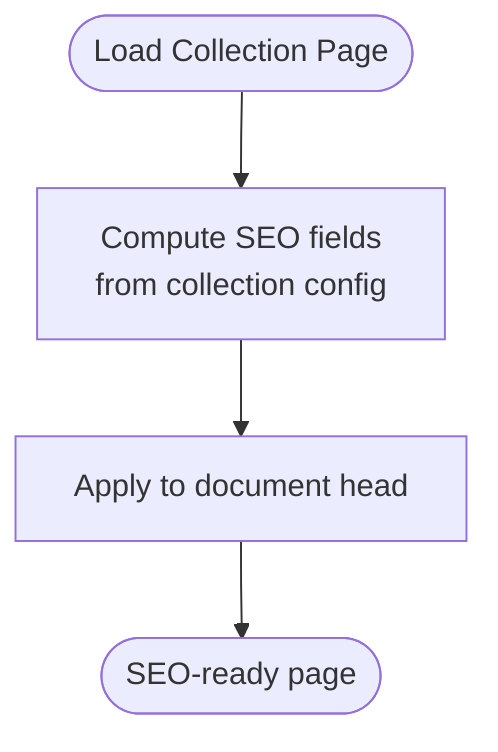
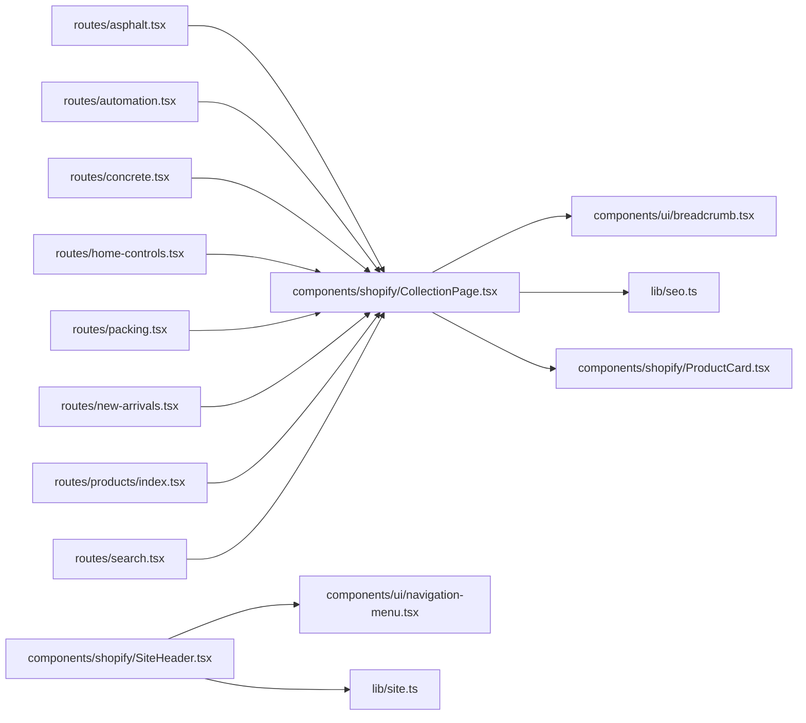

# Collection & Category Management

<cite>
**Referenced Files in This Document**
- [CollectionPage.tsx](file://src/components/shopify/CollectionPage.tsx)
- [ProductCard.tsx](file://src/components/shopify/ProductCard.tsx)
- [SiteHeader.tsx](file://src/components/shopify/SiteHeader.tsx)
- [breadcrumb.tsx](file://src/components/ui/breadcrumb.tsx)
- [navigation-menu.tsx](file://src/components/ui/navigation-menu.tsx)
- [seo.ts](file://src/lib/seo.ts)
- [site.ts](file://src/lib/site.ts)
- [products/index.tsx](file://src/routes/products/index.tsx)
- [products/$handle.tsx](file://src/routes/products/$handle.tsx)
- [asphalt.tsx](file://src/routes/asphalt.tsx)
- [automation.tsx](file://src/routes/automation.tsx)
- [concrete.tsx](file://src/routes/concrete.tsx)
- [home-controls.tsx](file://src/routes/home-controls.tsx)
- [packing.tsx](file://src/routes/packing.tsx)
- [new-arrivals.tsx](file://src/routes/new-arrivals.tsx)
- [search.tsx](file://src/routes/search.tsx)
</cite>

## Table of Contents
1. [Introduction](#introduction)
2. [Project Structure](#project-structure)
3. [Core Components](#core-components)
4. [Architecture Overview](#architecture-overview)
5. [Detailed Component Analysis](#detailed-component-analysis)
6. [Dependency Analysis](#dependency-analysis)
7. [Performance Considerations](#performance-considerations)
8. [Troubleshooting Guide](#troubleshooting-guide)
9. [Conclusion](#conclusion)
10. [Appendices](#appendices)

## Introduction
This document explains how collections and categories are organized, navigated, and displayed across the application. It covers:
- How products relate to collections
- Collection hierarchy and navigation menu integration
- Practical examples for creating new collection types
- Breadcrumb navigation implementation
- Managing collection metadata and SEO optimization
- Filtering and sorting capabilities
- Responsive navigation patterns for different screen sizes

The goal is to provide a clear, actionable guide for developers and content editors to manage product catalogs effectively.

## Project Structure
Collections and categories are implemented using a combination of route-based pages, reusable components, and UI primitives:
- Route-level category pages define top-level categories (e.g., asphalt, automation, concrete).
- A generic collection page renders filtered product lists.
- Product cards display individual items within collections.
- Navigation menus integrate with site header for hierarchical browsing.
- Breadcrumbs provide context-aware navigation paths.
- SEO utilities set metadata for collection pages.

**Diagram sources**
- [asphalt.tsx](file://src/routes/asphalt.tsx)
- [automation.tsx](file://src/routes/automation.tsx)
- [concrete.tsx](file://src/routes/concrete.tsx)
- [home-controls.tsx](file://src/routes/home-controls.tsx)
- [packing.tsx](file://src/routes/packing.tsx)
- [new-arrivals.tsx](file://src/routes/new-arrivals.tsx)
- [products/index.tsx](file://src/routes/products/index.tsx)
- [products/$handle.tsx](file://src/routes/products/$handle.tsx)
- [search.tsx](file://src/routes/search.tsx)
- [CollectionPage.tsx](file://src/components/shopify/CollectionPage.tsx)
- [ProductCard.tsx](file://src/components/shopify/ProductCard.tsx)
- [SiteHeader.tsx](file://src/components/shopify/SiteHeader.tsx)
- [breadcrumb.tsx](file://src/components/ui/breadcrumb.tsx)
- [navigation-menu.tsx](file://src/components/ui/navigation-menu.tsx)
- [seo.ts](file://src/lib/seo.ts)
- [site.ts](file://src/lib/site.ts)

**Section sources**
- [CollectionPage.tsx](file://src/components/shopify/CollectionPage.tsx)
- [ProductCard.tsx](file://src/components/shopify/ProductCard.tsx)
- [SiteHeader.tsx](file://src/components/shopify/SiteHeader.tsx)
- [breadcrumb.tsx](file://src/components/ui/breadcrumb.tsx)
- [navigation-menu.tsx](file://src/components/ui/navigation-menu.tsx)
- [seo.ts](file://src/lib/seo.ts)
- [site.ts](file://src/lib/site.ts)
- [products/index.tsx](file://src/routes/products/index.tsx)
- [products/$handle.tsx](file://src/routes/products/$handle.tsx)
- [asphalt.tsx](file://src/routes/asphalt.tsx)
- [automation.tsx](file://src/routes/automation.tsx)
- [concrete.tsx](file://src/routes/concrete.tsx)
- [home-controls.tsx](file://src/routes/home-controls.tsx)
- [packing.tsx](file://src/routes/packing.tsx)
- [new-arrivals.tsx](file://src/routes/new-arrivals.tsx)
- [search.tsx](file://src/routes/search.tsx)

## Core Components
- CollectionPage: Renders a list of products for a given collection or category. It typically accepts parameters such as collection handle or query filters and composes breadcrumbs and SEO metadata.
- ProductCard: Displays an individual product’s key information and actions (e.g., view details, add to cart/quote).
- SiteHeader: Provides global navigation including links to top-level categories and integrates with the navigation menu component.
- Breadcrumb: Renders contextual navigation based on current route and collection path.
- NavigationMenu: Supplies responsive, accessible navigation structures used by the header.
- SEO Utilities: Centralized helpers for setting titles, descriptions, and structured data for collection pages.
- Site Configuration: Shared site-wide settings that may include default collections, menu structure, and navigation configuration.

These components work together to present collections consistently across routes while enabling flexible filtering and SEO-friendly metadata.

**Section sources**
- [CollectionPage.tsx](file://src/components/shopify/CollectionPage.tsx)
- [ProductCard.tsx](file://src/components/shopify/ProductCard.tsx)
- [SiteHeader.tsx](file://src/components/shopify/SiteHeader.tsx)
- [breadcrumb.tsx](file://src/components/ui/breadcrumb.tsx)
- [navigation-menu.tsx](file://src/components/ui/navigation-menu.tsx)
- [seo.ts](file://src/lib/seo.ts)
- [site.ts](file://src/lib/site.ts)

## Architecture Overview
The collection architecture combines route-driven category pages with a reusable collection renderer:
- Top-level category routes (e.g., asphalt, automation, concrete) render the collection page with specific collection identifiers.
- The collection page fetches and displays products, constructs breadcrumbs, and sets SEO metadata.
- Product cards link to product detail routes.
- The header provides navigation to categories and uses a responsive navigation menu.

**Diagram sources**
- [asphalt.tsx](file://src/routes/asphalt.tsx)
- [CollectionPage.tsx](file://src/components/shopify/CollectionPage.tsx)
- [breadcrumb.tsx](file://src/components/ui/breadcrumb.tsx)
- [navigation-menu.tsx](file://src/components/ui/navigation-menu.tsx)
- [seo.ts](file://src/lib/seo.ts)
- [ProductCard.tsx](file://src/components/shopify/ProductCard.tsx)
- [SiteHeader.tsx](file://src/components/shopify/SiteHeader.tsx)

## Detailed Component Analysis

### Collection Page Rendering Flow
The collection page centralizes product listing logic and integrates breadcrumbs and SEO.

**Diagram sources**
- [CollectionPage.tsx](file://src/components/shopify/CollectionPage.tsx)
- [breadcrumb.tsx](file://src/components/ui/breadcrumb.tsx)
- [seo.ts](file://src/lib/seo.ts)

**Section sources**
- [CollectionPage.tsx](file://src/components/shopify/CollectionPage.tsx)
- [breadcrumb.tsx](file://src/components/ui/breadcrumb.tsx)
- [seo.ts](file://src/lib/seo.ts)

### Product Detail Integration
Product cards link to product detail routes, which can also contribute to breadcrumbs and SEO when needed.

**Diagram sources**
- [CollectionPage.tsx](file://src/components/shopify/CollectionPage.tsx)
- [ProductCard.tsx](file://src/components/shopify/ProductCard.tsx)
- [products/$handle.tsx](file://src/routes/products/$handle.tsx)
- [seo.ts](file://src/lib/seo.ts)

**Section sources**
- [CollectionPage.tsx](file://src/components/shopify/CollectionPage.tsx)
- [ProductCard.tsx](file://src/components/shopify/ProductCard.tsx)
- [products/$handle.tsx](file://src/routes/products/$handle.tsx)
- [seo.ts](file://src/lib/seo.ts)

### Navigation Menu Integration
The header integrates with a navigation menu to expose top-level categories and support responsive behavior.

**Diagram sources**
- [SiteHeader.tsx](file://src/components/shopify/SiteHeader.tsx)
- [navigation-menu.tsx](file://src/components/ui/navigation-menu.tsx)
- [site.ts](file://src/lib/site.ts)

**Section sources**
- [SiteHeader.tsx](file://src/components/shopify/SiteHeader.tsx)
- [navigation-menu.tsx](file://src/components/ui/navigation-menu.tsx)
- [site.ts](file://src/lib/site.ts)

### Breadcrumb Implementation
Breadcrumbs reflect the current collection hierarchy and allow users to navigate up levels.

**Diagram sources**
- [breadcrumb.tsx](file://src/components/ui/breadcrumb.tsx)
- [CollectionPage.tsx](file://src/components/shopify/CollectionPage.tsx)

**Section sources**
- [breadcrumb.tsx](file://src/components/ui/breadcrumb.tsx)
- [CollectionPage.tsx](file://src/components/shopify/CollectionPage.tsx)

### SEO Metadata for Collections
SEO utilities centralize metadata management for collection pages, ensuring consistent titles, descriptions, and structured data.

**Diagram sources**
- [seo.ts](file://src/lib/seo.ts)
- [CollectionPage.tsx](file://src/components/shopify/CollectionPage.tsx)

**Section sources**
- [seo.ts](file://src/lib/seo.ts)
- [CollectionPage.tsx](file://src/components/shopify/CollectionPage.tsx)

### Practical Examples

#### Creating a New Collection Type
- Add a new route file for the category (e.g., a new top-level category).
- Configure the collection identifier and any default filters.
- Ensure breadcrumbs and SEO metadata are applied via the collection page.
- Link the new category in the site header navigation.

**Section sources**
- [asphalt.tsx](file://src/routes/asphalt.tsx)
- [automation.tsx](file://src/routes/automation.tsx)
- [concrete.tsx](file://src/routes/concrete.tsx)
- [home-controls.tsx](file://src/routes/home-controls.tsx)
- [packing.tsx](file://src/routes/packing.tsx)
- [new-arrivals.tsx](file://src/routes/new-arrivals.tsx)
- [CollectionPage.tsx](file://src/components/shopify/CollectionPage.tsx)
- [SiteHeader.tsx](file://src/components/shopify/SiteHeader.tsx)
- [site.ts](file://src/lib/site.ts)

#### Implementing Breadcrumb Navigation
- Use the breadcrumb component to construct segments based on the current route and collection hierarchy.
- Provide clickable segments for parent categories and the current collection.
- Keep breadcrumbs concise and aligned with URL structure.

**Section sources**
- [breadcrumb.tsx](file://src/components/ui/breadcrumb.tsx)
- [CollectionPage.tsx](file://src/components/shopify/CollectionPage.tsx)

#### Managing Collection Metadata
- Centralize SEO fields in the SEO utility module.
- Compute values from collection configuration or route parameters.
- Apply metadata during collection page rendering.

**Section sources**
- [seo.ts](file://src/lib/seo.ts)
- [CollectionPage.tsx](file://src/components/shopify/CollectionPage.tsx)

#### Optimizing Collection Pages for SEO
- Ensure unique titles and descriptions per collection.
- Include relevant keywords naturally in metadata.
- Maintain clean URLs and logical hierarchy reflected in breadcrumbs.
- Avoid duplicate content by differentiating collection pages.

**Section sources**
- [seo.ts](file://src/lib/seo.ts)
- [CollectionPage.tsx](file://src/components/shopify/CollectionPage.tsx)

#### Collection Filtering and Sorting
- Accept query parameters for filters (e.g., type, availability).
- Pass filters to the collection data fetch layer.
- Present filter controls in the collection page UI.
- Persist selected filters in the URL for shareability.

[No sources needed since this section provides general guidance]

#### Responsive Navigation Patterns
- Use the navigation menu component to adapt to mobile screens.
- Collapse menu into a drawer or sheet on small devices.
- Ensure keyboard accessibility and focus management.

**Section sources**
- [navigation-menu.tsx](file://src/components/ui/navigation-menu.tsx)
- [SiteHeader.tsx](file://src/components/shopify/SiteHeader.tsx)

## Dependency Analysis
The following diagram shows key dependencies among collection-related modules:

**Diagram sources**
- [asphalt.tsx](file://src/routes/asphalt.tsx)
- [automation.tsx](file://src/routes/automation.tsx)
- [concrete.tsx](file://src/routes/concrete.tsx)
- [home-controls.tsx](file://src/routes/home-controls.tsx)
- [packing.tsx](file://src/routes/packing.tsx)
- [new-arrivals.tsx](file://src/routes/new-arrivals.tsx)
- [products/index.tsx](file://src/routes/products/index.tsx)
- [search.tsx](file://src/routes/search.tsx)
- [CollectionPage.tsx](file://src/components/shopify/CollectionPage.tsx)
- [breadcrumb.tsx](file://src/components/ui/breadcrumb.tsx)
- [seo.ts](file://src/lib/seo.ts)
- [ProductCard.tsx](file://src/components/shopify/ProductCard.tsx)
- [SiteHeader.tsx](file://src/components/shopify/SiteHeader.tsx)
- [navigation-menu.tsx](file://src/components/ui/navigation-menu.tsx)
- [site.ts](file://src/lib/site.ts)

**Section sources**
- [CollectionPage.tsx](file://src/components/shopify/CollectionPage.tsx)
- [ProductCard.tsx](file://src/components/shopify/ProductCard.tsx)
- [SiteHeader.tsx](file://src/components/shopify/SiteHeader.tsx)
- [breadcrumb.tsx](file://src/components/ui/breadcrumb.tsx)
- [navigation-menu.tsx](file://src/components/ui/navigation-menu.tsx)
- [seo.ts](file://src/lib/seo.ts)
- [site.ts](file://src/lib/site.ts)
- [products/index.tsx](file://src/routes/products/index.tsx)
- [products/$handle.tsx](file://src/routes/products/$handle.tsx)
- [asphalt.tsx](file://src/routes/asphalt.tsx)
- [automation.tsx](file://src/routes/automation.tsx)
- [concrete.tsx](file://src/routes/concrete.tsx)
- [home-controls.tsx](file://src/routes/home-controls.tsx)
- [packing.tsx](file://src/routes/packing.tsx)
- [new-arrivals.tsx](file://src/routes/new-arrivals.tsx)
- [search.tsx](file://src/routes/search.tsx)

## Performance Considerations
- Prefer server-side rendering for collection pages to improve initial load times and SEO.
- Cache frequently accessed collection data where appropriate.
- Defer non-critical assets and use lazy loading for images in product cards.
- Minimize re-renders by memoizing expensive computations and stabilizing props.
- Keep navigation menus lightweight; avoid heavy computations in header components.

[No sources needed since this section provides general guidance]

## Troubleshooting Guide
Common issues and resolutions:
- Missing breadcrumbs: Verify that the breadcrumb component receives correct path segments and that collection routes pass proper hierarchy data.
- Incorrect SEO metadata: Ensure the SEO utility computes fields from the active collection and applies them before rendering.
- Navigation not updating: Confirm that the site configuration includes the new category and that the header reads the updated menu structure.
- Broken product links: Check product card routing and ensure product handles match the detail route expectations.

**Section sources**
- [breadcrumb.tsx](file://src/components/ui/breadcrumb.tsx)
- [seo.ts](file://src/lib/seo.ts)
- [site.ts](file://src/lib/site.ts)
- [ProductCard.tsx](file://src/components/shopify/ProductCard.tsx)
- [products/$handle.tsx](file://src/routes/products/$handle.tsx)

## Conclusion
The collection and category system leverages route-based categories, a reusable collection renderer, and shared UI primitives to deliver consistent, navigable, and SEO-friendly product experiences. By following the patterns outlined here—creating new collection routes, implementing breadcrumbs, managing metadata, and optimizing performance—you can scale the catalog while maintaining usability and search engine visibility.

## Appendices

### Example Collection Routes
Top-level category routes demonstrate how to wire a collection page to a specific category.

**Section sources**
- [asphalt.tsx](file://src/routes/asphalt.tsx)
- [automation.tsx](file://src/routes/automation.tsx)
- [concrete.tsx](file://src/routes/concrete.tsx)
- [home-controls.tsx](file://src/routes/home-controls.tsx)
- [packing.tsx](file://src/routes/packing.tsx)
- [new-arrivals.tsx](file://src/routes/new-arrivals.tsx)

### Generic Collection and Product Listing
The generic collection index and product detail routes illustrate standard patterns for listing and navigating products.

**Section sources**
- [products/index.tsx](file://src/routes/products/index.tsx)
- [products/$handle.tsx](file://src/routes/products/$handle.tsx)

### Search Integration
Search results can leverage the same collection rendering approach to present filtered product lists.

**Section sources**
- [search.tsx](file://src/routes/search.tsx)