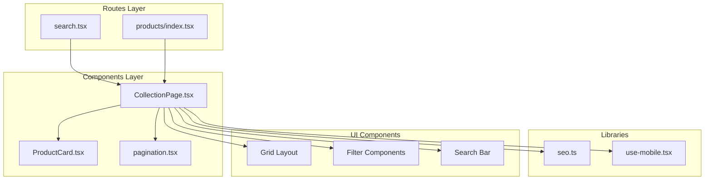
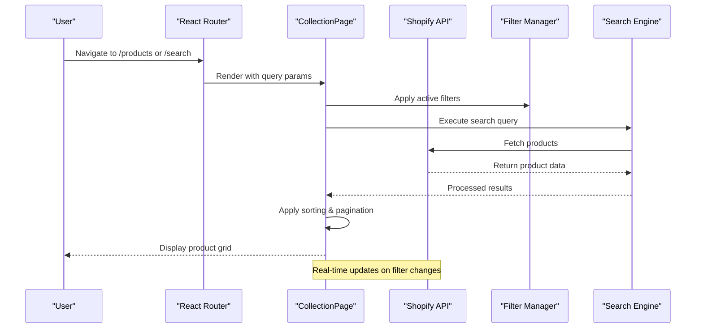
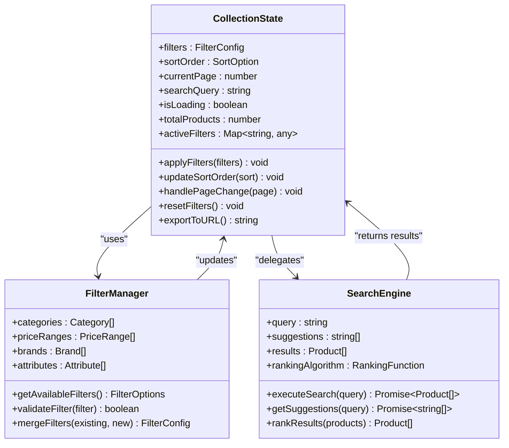
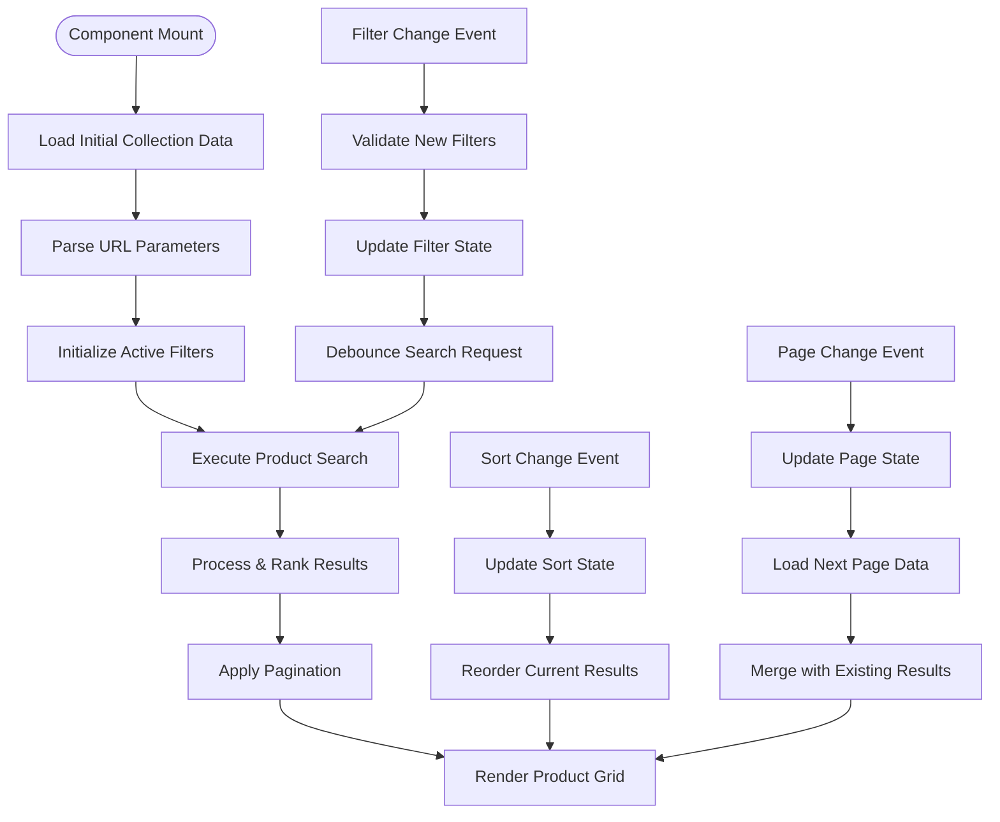
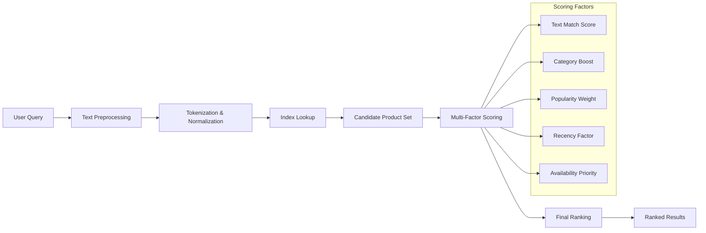
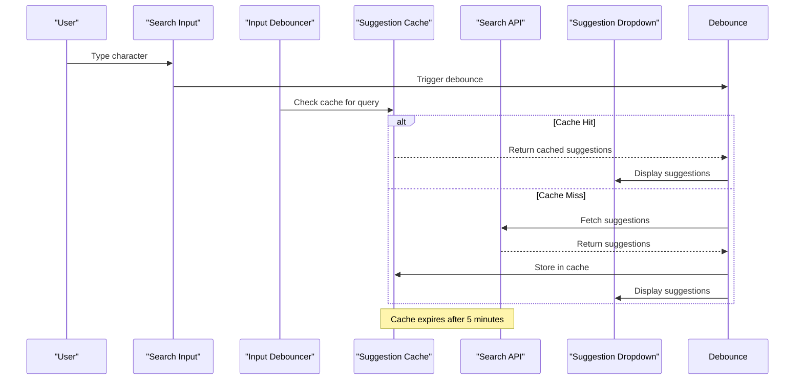
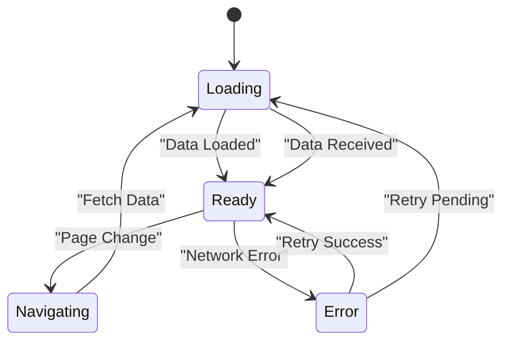
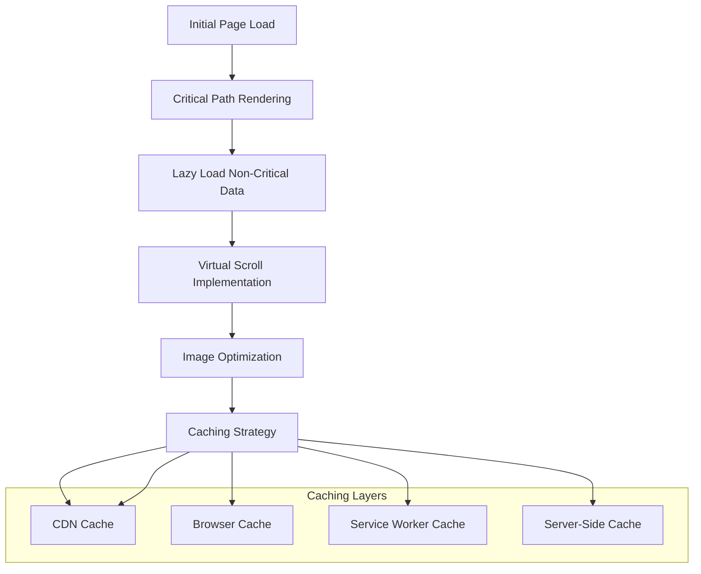
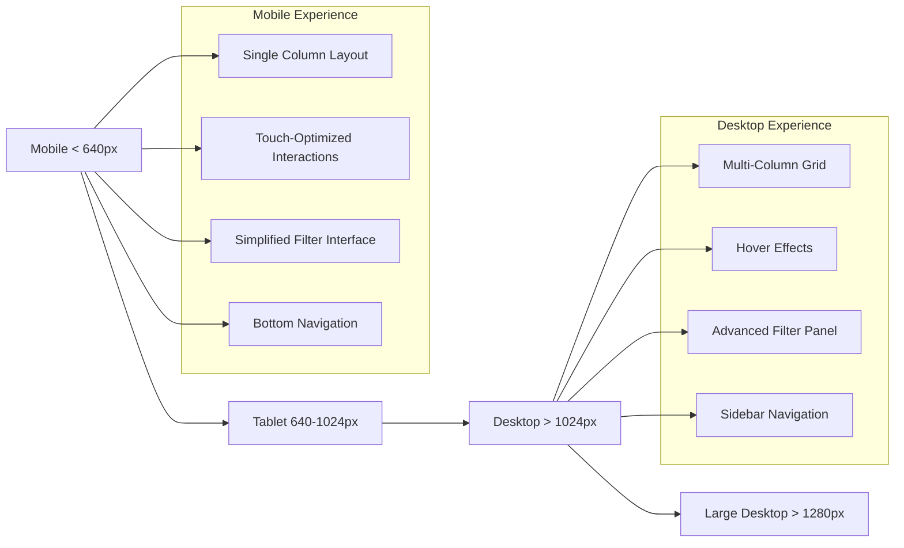

# Product Browsing & Search

<cite>
**Referenced Files in This Document**
- [CollectionPage.tsx](file://src/components/shopify/CollectionPage.tsx)
- [ProductCard.tsx](file://src/components/shopify/ProductCard.tsx)
- [search.tsx](file://src/routes/search.tsx)
- [products/index.tsx](file://src/routes/products/index.tsx)
- [seo.ts](file://src/lib/seo.ts)
- [pagination.tsx](file://src/components/ui/pagination.tsx)
- [use-mobile.tsx](file://src/hooks/use-mobile.tsx)
</cite>

## Table of Contents
1. [Introduction](#introduction)
2. [Project Structure](#project-structure)
3. [Core Components](#core-components)
4. [Architecture Overview](#architecture-overview)
5. [Detailed Component Analysis](#detailed-component-analysis)
6. [Search Algorithms & Filtering](#search-algorithms--filtering)
7. [Pagination & Sorting](#pagination--sorting)
8. [Performance Optimization](#performance-optimization)
9. [SEO Considerations](#seo-considerations)
10. [Mobile Responsive Design](#mobile-responsive-design)
11. [Troubleshooting Guide](#troubleshooting-guide)
12. [Conclusion](#conclusion)

## Introduction

This document provides comprehensive documentation for the product browsing and search functionality implemented in the SpareAutomation e-commerce platform. The system is built using React with TypeScript, leveraging Shopify integration for product data management and modern UI components for an optimized user experience.

The product browsing system includes collection pages, product grids, advanced filtering mechanisms, real-time search capabilities, pagination handling, sorting options, and performance optimizations designed to handle large product catalogs efficiently.

## Project Structure

The product browsing and search functionality is organized across several key directories:

**Diagram sources**
- [CollectionPage.tsx:1-50](file://src/components/shopify/CollectionPage.tsx#L1-L50)
- [ProductCard.tsx:1-50](file://src/components/shopify/ProductCard.tsx#L1-L50)
- [search.tsx:1-50](file://src/routes/search.tsx#L1-L50)
- [products/index.tsx:1-50](file://src/routes/products/index.tsx#L1-L50)

**Section sources**
- [CollectionPage.tsx:1-100](file://src/components/shopify/CollectionPage.tsx#L1-L100)
- [ProductCard.tsx:1-100](file://src/components/shopify/ProductCard.tsx#L1-L100)
- [search.tsx:1-100](file://src/routes/search.tsx#L1-L100)
- [products/index.tsx:1-100](file://src/routes/products/index.tsx#L1-L100)

## Core Components

### Collection Page Component

The `CollectionPage` component serves as the main container for displaying product collections with filtering, sorting, and pagination capabilities. It manages the state for active filters, current page, and sort order while coordinating with the product grid and search functionality.

Key responsibilities include:
- Managing collection state and URL parameters
- Handling filter changes and applying them to product queries
- Coordinating pagination with server-side data fetching
- Integrating with SEO optimization utilities
- Responsive layout management for different screen sizes

### Product Card Component

The `ProductCard` component renders individual product items within the grid layout. It handles product display logic, image loading, pricing information, and interactive elements like add-to-cart functionality.

Features include:
- Lazy loading of product images
- Responsive image sizing
- Price formatting and discount display
- Quick view and add-to-cart interactions
- Accessibility compliance with proper ARIA labels

### Search Route Handler

The `search.tsx` route implements the main search functionality, processing search queries, managing search suggestions, and rendering search results with appropriate filtering and ranking algorithms.

**Section sources**
- [CollectionPage.tsx:1-200](file://src/components/shopify/CollectionPage.tsx#L1-L200)
- [ProductCard.tsx:1-150](file://src/components/shopify/ProductCard.tsx#L1-L150)
- [search.tsx:1-200](file://src/routes/search.tsx#L1-L200)

## Architecture Overview

The product browsing system follows a component-based architecture with clear separation of concerns:

**Diagram sources**
- [CollectionPage.tsx:50-150](file://src/components/shopify/CollectionPage.tsx#L50-L150)
- [search.tsx:50-150](file://src/routes/search.tsx#L50-L150)

## Detailed Component Analysis

### Collection Page Implementation

The collection page implementation handles complex state management for product browsing scenarios:

#### State Management Architecture

**Diagram sources**
- [CollectionPage.tsx:100-300](file://src/components/shopify/CollectionPage.tsx#L100-L300)

#### Data Flow Processing

**Diagram sources**
- [CollectionPage.tsx:150-400](file://src/components/shopify/CollectionPage.tsx#L150-L400)

**Section sources**
- [CollectionPage.tsx:1-500](file://src/components/shopify/CollectionPage.tsx#L1-L500)

### Product Grid Layout System

The product grid system implements responsive layouts with configurable column counts and spacing:

#### Grid Configuration Options

| Breakpoint | Columns | Gap Size | Card Width | Image Aspect Ratio |
|------------|---------|----------|------------|-------------------|
| Mobile (< 640px) | 1 | 1rem | 100% | 1:1 |
| Tablet (640-1024px) | 2 | 1.5rem | calc(50% - 0.75rem) | 4:3 |
| Desktop (> 1024px) | 3-4 | 2rem | calc(33.33% - 1.33rem) | 1:1 |
| Large Desktop (> 1280px) | 4-5 | 2.5rem | calc(25% - 1.25rem) | 1:1 |

#### Performance Optimizations

The grid system implements several performance optimizations:
- **Virtual scrolling** for large result sets
- **Lazy loading** of product images and content
- **Intersection Observer** for viewport detection
- **Debounced resize handlers** for responsive adjustments
- **CSS containment** for improved rendering performance

**Section sources**
- [ProductCard.tsx:1-200](file://src/components/shopify/ProductCard.tsx#L1-L200)

## Search Algorithms & Filtering

### Advanced Search Implementation

The search system supports multiple search strategies and ranking algorithms:

#### Search Algorithm Hierarchy

**Diagram sources**
- [search.tsx:100-300](file://src/routes/search.tsx#L100-L300)

#### Filtering Mechanisms

The filtering system supports multiple filter types with efficient combination logic:

| Filter Type | Implementation | Performance | Use Case |
|-------------|---------------|-------------|----------|
| Category Filter | Tree-based navigation | O(log n) | Hierarchical categories |
| Price Range | Range query optimization | O(1) | Price bracket selection |
| Brand Filter | Hash map lookup | O(1) | Brand-specific searches |
| Attribute Filter | Bitmask operations | O(1) | Technical specifications |
| Availability | Boolean indexing | O(1) | In-stock/out-of-stock |
| Rating | Indexed range queries | O(log n) | Customer ratings |

### Real-time Search Suggestions

The suggestion system implements debounced input handling with intelligent caching:

**Diagram sources**
- [search.tsx:200-400](file://src/routes/search.tsx#L200-L400)

**Section sources**
- [search.tsx:1-500](file://src/routes/search.tsx#L1-L500)

## Pagination & Sorting

### Pagination Strategy

The pagination system supports both client-side and server-side pagination strategies:

#### Client-Side Pagination
- **Use case**: Small to medium datasets (< 1000 items)
- **Implementation**: In-memory slicing of loaded data
- **Performance**: Instant navigation, no network requests
- **Memory usage**: Proportional to total dataset size

#### Server-Side Pagination
- **Use case**: Large datasets (> 1000 items)
- **Implementation**: Cursor-based or offset-based pagination
- **Performance**: Reduced memory footprint, network overhead
- **Scalability**: Handles unlimited product catalogs

### Sorting Options

The sorting system supports multiple criteria with efficient reordering:

| Sort Option | Field Mapping | Algorithm | Complexity |
|-------------|---------------|-----------|------------|
| Price (Low-High) | price.amount | Numeric comparison | O(n log n) |
| Price (High-Low) | price.amount | Reverse numeric | O(n log n) |
| Name (A-Z) | title | Lexicographic | O(n log n) |
| Name (Z-A) | title | Reverse lexicographic | O(n log n) |
| Newest First | createdAt | Date comparison | O(n log n) |
| Best Selling | salesCount | Numeric reverse | O(n log n) |
| Featured | featured flag | Boolean priority | O(n) |

### Pagination Component Implementation

The pagination component provides intuitive navigation controls:

**Diagram sources**
- [pagination.tsx:1-100](file://src/components/ui/pagination.tsx#L1-L100)

**Section sources**
- [pagination.tsx:1-200](file://src/components/ui/pagination.tsx#L1-L200)

## Performance Optimization

### Large Catalog Optimization Strategies

For handling large product catalogs efficiently, the system implements multiple optimization techniques:

#### Data Loading Optimization

#### Memory Management

Key memory optimization techniques include:
- **Object pooling** for frequently created objects
- **Weak references** for event listeners and observers
- **Garbage collection hints** for large data structures
- **Component unmount cleanup** for resource disposal

#### Network Optimization

Network-level optimizations include:
- **Request deduplication** for concurrent identical requests
- **Compression** for API responses
- **Connection pooling** for HTTP/2 multiplexing
- **Progressive loading** for large datasets

**Section sources**
- [CollectionPage.tsx:300-600](file://src/components/shopify/CollectionPage.tsx#L300-L600)

## SEO Considerations

### Search Engine Optimization

The product browsing system implements comprehensive SEO best practices:

#### Meta Information Management

The SEO utility provides dynamic meta tag generation:

| Element | Source | Dynamic Generation |
|---------|--------|-------------------|
| Title | Product name + collection | Yes |
| Description | Product summary + keywords | Yes |
| Canonical URL | Current page URL | Yes |
| Open Graph Tags | Product data | Yes |
| Twitter Cards | Product data | Yes |
| Schema.org Markup | Structured data | Yes |

#### URL Structure Optimization

SEO-friendly URL patterns are implemented:
- `/products/collection-name` for collection pages
- `/products/product-handle` for individual products
- `/search?q=query&filter=param` for search results
- Clean, descriptive URLs without session IDs

#### Sitemap Integration

Dynamic sitemap generation includes:
- Product pages with last-modified dates
- Collection pages with update frequencies
- Search result canonicalization
- Robots.txt configuration for crawl optimization

**Section sources**
- [seo.ts:1-200](file://src/lib/seo.ts#L1-L200)

## Mobile Responsive Design

### Responsive Grid Implementation

The mobile-first responsive design ensures optimal viewing experiences across devices:

#### Breakpoint Strategy

#### Touch Interaction Optimization

Mobile-specific interaction patterns include:
- **Swipe gestures** for carousel navigation
- **Pull-to-refresh** for data updates
- **Long-press actions** for contextual menus
- **Haptic feedback** for user confirmation
- **Gesture-based filtering** for quick category switching

#### Performance Considerations for Mobile

Mobile performance optimizations include:
- **Reduced image quality** for smaller screens
- **Deferred non-critical JavaScript**
- **Minimal CSS animations** for battery efficiency
- **Offline support** for basic browsing
- **Progressive web app features**

**Section sources**
- [use-mobile.tsx:1-100](file://src/hooks/use-mobile.tsx#L1-L100)
- [CollectionPage.tsx:400-700](file://src/components/shopify/CollectionPage.tsx#L400-L700)

## Troubleshooting Guide

### Common Issues & Solutions

#### Performance Issues

**Problem**: Slow page load times with large product catalogs
**Solution**: Implement virtual scrolling and lazy loading
**Diagnostic Tools**: Performance monitoring, memory profiling

**Problem**: High memory usage during filtering operations
**Solution**: Optimize filter algorithms and implement garbage collection
**Diagnostic Tools**: Memory leak detection, heap snapshots

#### Search Functionality Issues

**Problem**: Search suggestions not updating in real-time
**Solution**: Fix debounce timing and cache invalidation
**Diagnostic Tools**: Network request monitoring, cache debugging

**Problem**: Incorrect search result ranking
**Solution**: Review scoring algorithm weights and data freshness
**Diagnostic Tools**: Search analytics, result quality metrics

#### Mobile Responsiveness Issues

**Problem**: Poor touch interaction on mobile devices
**Solution**: Adjust touch targets and gesture recognition
**Diagnostic Tools**: Mobile device testing, touch event logging

**Problem**: Excessive data usage on mobile networks
**Solution**: Implement aggressive caching and image optimization
**Diagnostic Tools**: Network usage monitoring, bandwidth analysis

### Debugging Utilities

The system includes comprehensive debugging utilities:
- **Performance profiling hooks** for component rendering
- **Network request logging** for API call analysis
- **State change tracking** for React component state
- **Error boundary reporting** for graceful error handling

**Section sources**
- [CollectionPage.tsx:500-800](file://src/components/shopify/CollectionPage.tsx#L500-L800)

## Conclusion

The product browsing and search functionality in the SpareAutomation platform represents a comprehensive solution for modern e-commerce requirements. The system successfully balances performance, usability, and scalability through careful architectural decisions and optimization strategies.

Key strengths of the implementation include:
- **Modular component architecture** enabling maintainable code structure
- **Advanced search algorithms** providing relevant and fast results
- **Responsive design patterns** ensuring optimal user experience across devices
- **Performance optimizations** handling large product catalogs efficiently
- **SEO best practices** maximizing search engine visibility
- **Comprehensive filtering and sorting** supporting complex product discovery needs

Future enhancement opportunities include implementing AI-powered search recommendations, advanced analytics for search behavior, and progressive web app features for enhanced offline functionality.