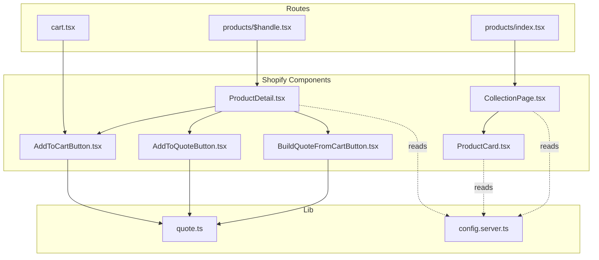
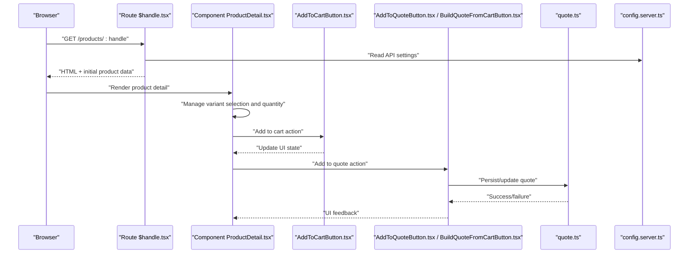
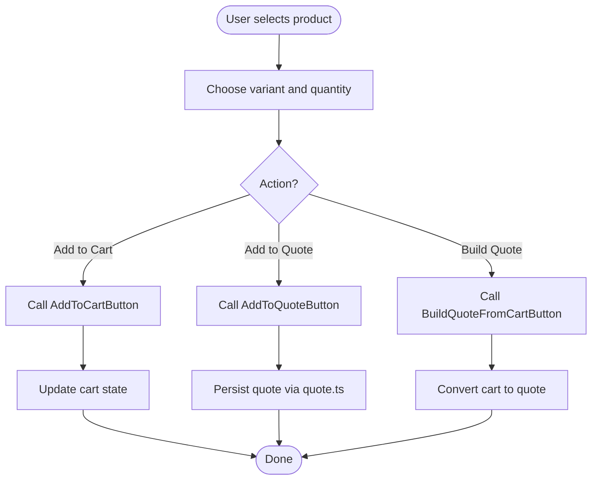
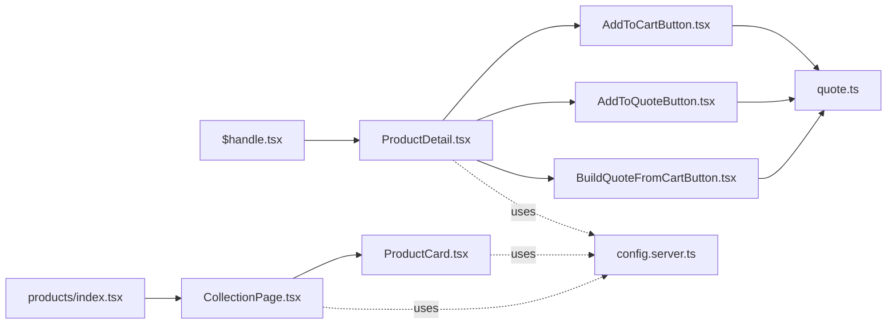

# Product Data Model & Structure

<cite>
**Referenced Files in This Document**
- [ProductDetail.tsx](file://src/components/shopify/ProductDetail.tsx)
- [ProductCard.tsx](file://src/components/shopify/ProductCard.tsx)
- [CollectionPage.tsx](file://src/components/shopify/CollectionPage.tsx)
- [$handle.tsx](file://src/routes/products/$handle.tsx)
- [index.tsx](file://src/routes/products/index.tsx)
- [AddToCartButton.tsx](file://src/components/shopify/AddToCartButton.tsx)
- [AddToQuoteButton.tsx](file://src/components/shopify/AddToQuoteButton.tsx)
- [BuildQuoteFromCartButton.tsx](file://src/components/shopify/BuildQuoteFromCartButton.tsx)
- [cart.tsx](file://src/routes/cart.tsx)
- [quote.ts](file://src/lib/quote.ts)
- [config.server.ts](file://src/lib/config.server.ts)
</cite>

## Table of Contents
1. [Introduction](#introduction)
2. [Project Structure](#project-structure)
3. [Core Components](#core-components)
4. [Architecture Overview](#architecture-overview)
5. [Detailed Component Analysis](#detailed-component-analysis)
6. [Dependency Analysis](#dependency-analysis)
7. [Performance Considerations](#performance-considerations)
8. [Troubleshooting Guide](#troubleshooting-guide)
9. [Conclusion](#conclusion)
10. [Appendices](#appendices)

## Introduction
This document describes the product data model and structure used across the application, focusing on how products are represented, fetched from Shopify, transformed for UI consumption, and cached where applicable. It explains the relationships between products, variants, collections, images, pricing, and inventory as reflected by the components and routes that consume them. It also provides guidance for extending the model with custom attributes and metadata, and for handling lifecycle events such as add-to-cart or quote actions.

## Project Structure
The product-related logic is primarily implemented in:
- Routes that fetch and render product pages and lists
- Shopify-specific components that present product details, cards, and cart/quote interactions
- Utility modules for quotes and configuration

**Diagram sources**
- [ProductDetail.tsx](file://src/components/shopify/ProductDetail.tsx)
- [ProductCard.tsx](file://src/components/shopify/ProductCard.tsx)
- [CollectionPage.tsx](file://src/components/shopify/CollectionPage.tsx)
- [AddToCartButton.tsx](file://src/components/shopify/AddToCartButton.tsx)
- [AddToQuoteButton.tsx](file://src/components/shopify/AddToQuoteButton.tsx)
- [BuildQuoteFromCartButton.tsx](file://src/components/shopify/BuildQuoteFromCartButton.tsx)
- [$handle.tsx](file://src/routes/products/$handle.tsx)
- [index.tsx](file://src/routes/products/index.tsx)
- [cart.tsx](file://src/routes/cart.tsx)
- [quote.ts](file://src/lib/quote.ts)
- [config.server.ts](file://src/lib/config.server.ts)

**Section sources**
- [ProductDetail.tsx](file://src/components/shopify/ProductDetail.tsx)
- [ProductCard.tsx](file://src/components/shopify/ProductCard.tsx)
- [CollectionPage.tsx](file://src/components/shopify/CollectionPage.tsx)
- [AddToCartButton.tsx](file://src/components/shopify/AddToCartButton.tsx)
- [AddToQuoteButton.tsx](file://src/components/shopify/AddToQuoteButton.tsx)
- [BuildQuoteFromCartButton.tsx](file://src/components/shopify/BuildQuoteFromCartButton.tsx)
- [$handle.tsx](file://src/routes/products/$handle.tsx)
- [index.tsx](file://src/routes/products/index.tsx)
- [cart.tsx](file://src/routes/cart.tsx)
- [quote.ts](file://src/lib/quote.ts)
- [config.server.ts](file://src/lib/config.server.ts)

## Core Components
- ProductDetail: Renders a single product’s title, description, media (images), selected variant, price, and actions (add to cart/quote). It typically receives a product object and manages local state for variant selection and quantity.
- ProductCard: Displays a compact representation of a product (title, image, price) and links to the detail page.
- CollectionPage: Lists multiple products, often grouped by collection, and renders ProductCard instances.
- AddToCartButton: Adds a specific variant to the cart session or server-side store.
- AddToQuoteButton: Adds a variant to a quote session.
- BuildQuoteFromCartButton: Converts current cart contents into a quote.
- Quote utility: Provides helpers for building and managing quotes.
- Configuration: Centralizes environment variables and API settings used by components and routes.

These components collectively define the runtime product data model consumed by the UI.

**Section sources**
- [ProductDetail.tsx](file://src/components/shopify/ProductDetail.tsx)
- [ProductCard.tsx](file://src/components/shopify/ProductCard.tsx)
- [CollectionPage.tsx](file://src/components/shopify/CollectionPage.tsx)
- [AddToCartButton.tsx](file://src/components/shopify/AddToCartButton.tsx)
- [AddToQuoteButton.tsx](file://src/components/shopify/AddToQuoteButton.tsx)
- [BuildQuoteFromCartButton.tsx](file://src/components/shopify/BuildQuoteFromCartButton.tsx)
- [quote.ts](file://src/lib/quote.ts)
- [config.server.ts](file://src/lib/config.server.ts)

## Architecture Overview
At a high level, product data flows from Shopify into route handlers, which pass normalized product objects down to components. Components manage user interactions (variant selection, quantity changes) and trigger side effects (adding to cart or quote). The following sequence illustrates a typical product detail flow:

**Diagram sources**
- [$handle.tsx](file://src/routes/products/$handle.tsx)
- [ProductDetail.tsx](file://src/components/shopify/ProductDetail.tsx)
- [AddToCartButton.tsx](file://src/components/shopify/AddToCartButton.tsx)
- [AddToQuoteButton.tsx](file://src/components/shopify/AddToQuoteButton.tsx)
- [BuildQuoteFromCartButton.tsx](file://src/components/shopify/BuildQuoteFromCartButton.tsx)
- [quote.ts](file://src/lib/quote.ts)
- [config.server.ts](file://src/lib/config.server.ts)

## Detailed Component Analysis

### Product Entity Schema
The product entity is represented by an object passed into the ProductDetail component. Typical fields include:
- Identifier and routing handle
- Title and description
- Media (images) array
- Variants array (each with its own price, SKU, options, and availability)
- Pricing information (present price, compare-at price if discounted)
- Inventory tracking flags and quantities per variant
- Tags and metafields (if exposed through the API layer)

Relationships:
- Product has many Variants
- Product belongs to one or more Collections (as seen in listing pages)
- Product has many Images (media)

Data types and semantics:
- Identifiers: string-based handles and IDs
- Prices: currency-aware values with optional compare-at prices
- Inventory: boolean flags indicating whether inventory is tracked; numeric stock levels per variant
- Options: arrays of option names/values driving variant selection

Examples:
- A product object includes a list of variants, each with distinct pricing and inventory.
- An image object contains URLs and alt text for display.

**Section sources**
- [ProductDetail.tsx](file://src/components/shopify/ProductDetail.tsx)
- [ProductCard.tsx](file://src/components/shopify/ProductCard.tsx)
- [CollectionPage.tsx](file://src/components/shopify/CollectionPage.tsx)

### Variant Structures
Variants represent specific combinations of product options (e.g., size, color). Each variant typically includes:
- Unique identifier and SKU
- Price and compare-at price
- Option values
- Inventory policy and available quantity
- Image association (optional)

Variant selection in ProductDetail updates the active variant and reflects corresponding price and stock.

**Section sources**
- [ProductDetail.tsx](file://src/components/shopify/ProductDetail.tsx)

### Image Handling
Images are part of the product’s media. The UI displays primary and additional images, often with fallbacks and lazy loading strategies. ProductCard shows a thumbnail while ProductDetail shows a gallery or carousel.

Best practices:
- Use responsive image sizes
- Provide meaningful alt text
- Handle missing or broken images gracefully

**Section sources**
- [ProductDetail.tsx](file://src/components/shopify/ProductDetail.tsx)
- [ProductCard.tsx](file://src/components/shopify/ProductCard.tsx)

### Pricing Models
Pricing is derived from the selected variant. If a compare-at price exists, it indicates a discount. The UI should reflect:
- Current price
- Discounted price when applicable
- Currency formatting

**Section sources**
- [ProductDetail.tsx](file://src/components/shopify/ProductDetail.tsx)
- [ProductCard.tsx](file://src/components/shopify/ProductCard.tsx)

### Inventory Tracking
Inventory tracking is controlled at the variant level. The UI may show:
- In-stock status
- Low-stock warnings
- Out-of-stock states

Actions like adding to cart should be disabled when inventory is unavailable.

**Section sources**
- [ProductDetail.tsx](file://src/components/shopify/ProductDetail.tsx)

### Collections and Products Relationship
Collections group products. CollectionPage renders a list of products, typically using ProductCard. The relationship is many-to-many in Shopify; the app can filter or paginate based on collection identifiers.

**Section sources**
- [CollectionPage.tsx](file://src/components/shopify/CollectionPage.tsx)
- [ProductCard.tsx](file://src/components/shopify/ProductCard.tsx)

### Lifecycle Events and Actions
Common lifecycle interactions:
- Add to cart: triggers AddToCartButton, updates cart state
- Add to quote: triggers AddToQuoteButton, persists via quote utility
- Build quote from cart: converts cart items into a quote

**Diagram sources**
- [ProductDetail.tsx](file://src/components/shopify/ProductDetail.tsx)
- [AddToCartButton.tsx](file://src/components/shopify/AddToCartButton.tsx)
- [AddToQuoteButton.tsx](file://src/components/shopify/AddToQuoteButton.tsx)
- [BuildQuoteFromCartButton.tsx](file://src/components/shopify/BuildQuoteFromCartButton.tsx)
- [quote.ts](file://src/lib/quote.ts)

**Section sources**
- [AddToCartButton.tsx](file://src/components/shopify/AddToCartButton.tsx)
- [AddToQuoteButton.tsx](file://src/components/shopify/AddToQuoteButton.tsx)
- [BuildQuoteFromCartButton.tsx](file://src/components/shopify/BuildQuoteFromCartButton.tsx)
- [quote.ts](file://src/lib/quote.ts)

## Dependency Analysis
The product feature depends on:
- Route handlers for fetching and rendering product data
- Shopify components for presentation and interaction
- Quote utilities for quote operations
- Configuration for API endpoints and credentials

**Diagram sources**
- [$handle.tsx](file://src/routes/products/$handle.tsx)
- [index.tsx](file://src/routes/products/index.tsx)
- [ProductDetail.tsx](file://src/components/shopify/ProductDetail.tsx)
- [CollectionPage.tsx](file://src/components/shopify/CollectionPage.tsx)
- [ProductCard.tsx](file://src/components/shopify/ProductCard.tsx)
- [AddToCartButton.tsx](file://src/components/shopify/AddToCartButton.tsx)
- [AddToQuoteButton.tsx](file://src/components/shopify/AddToQuoteButton.tsx)
- [BuildQuoteFromCartButton.tsx](file://src/components/shopify/BuildQuoteFromCartButton.tsx)
- [quote.ts](file://src/lib/quote.ts)
- [config.server.ts](file://src/lib/config.server.ts)

**Section sources**
- [$handle.tsx](file://src/routes/products/$handle.tsx)
- [index.tsx](file://src/routes/products/index.tsx)
- [ProductDetail.tsx](file://src/components/shopify/ProductDetail.tsx)
- [CollectionPage.tsx](file://src/components/shopify/CollectionPage.tsx)
- [ProductCard.tsx](file://src/components/shopify/ProductCard.tsx)
- [AddToCartButton.tsx](file://src/components/shopify/AddToCartButton.tsx)
- [AddToQuoteButton.tsx](file://src/components/shopify/AddToQuoteButton.tsx)
- [BuildQuoteFromCartButton.tsx](file://src/components/shopify/BuildQuoteFromCartButton.tsx)
- [quote.ts](file://src/lib/quote.ts)
- [config.server.ts](file://src/lib/config.server.ts)

## Performance Considerations
- Prefer client-side caching for product listings and detail pages where appropriate (e.g., browser cache, service workers).
- Defer heavy image processing and use optimized image formats.
- Avoid unnecessary re-renders by memoizing computed values (e.g., formatted prices).
- Batch quote operations to reduce network calls.

[No sources needed since this section provides general guidance]

## Troubleshooting Guide
Common issues and checks:
- Missing product data: Verify route parameters and ensure the product handle resolves correctly.
- Variant not found: Confirm the selected variant ID exists within the product’s variants array.
- Pricing anomalies: Check for missing or invalid price fields and ensure currency formatting is applied consistently.
- Inventory mismatches: Validate inventory tracking flags and stock levels before enabling add-to-cart actions.
- Quote failures: Inspect quote utility responses and ensure persistence succeeds.

**Section sources**
- [ProductDetail.tsx](file://src/components/shopify/ProductDetail.tsx)
- [AddToCartButton.tsx](file://src/components/shopify/AddToCartButton.tsx)
- [AddToQuoteButton.tsx](file://src/components/shopify/AddToQuoteButton.tsx)
- [BuildQuoteFromCartButton.tsx](file://src/components/shopify/BuildQuoteFromCartButton.tsx)
- [quote.ts](file://src/lib/quote.ts)

## Conclusion
The product data model centers around a product object with associated variants, images, pricing, and inventory. Components consume this model to render rich product experiences and drive user actions like adding to cart or creating quotes. Extending the model involves augmenting the product object with custom attributes and ensuring downstream components handle new fields gracefully.

[No sources needed since this section summarizes without analyzing specific files]

## Appendices

### Extending the Data Model
- Custom product attributes: Add new fields to the product object and update components to read and display them.
- Metadata: If provided by Shopify, surface metafields in the product object and expose them in the UI.
- Validation: Ensure new fields are validated before being used in pricing or inventory calculations.

[No sources needed since this section provides general guidance]

### Implementing Product Metadata
- Fetch metadata alongside product data in the route handler.
- Normalize metadata into a consistent shape for components.
- Render metadata selectively based on presence and relevance.

[No sources needed since this section provides general guidance]

### Handling Product Lifecycle Events
- Add-to-cart: Update cart state and provide user feedback.
- Add-to-quote: Persist quote entries and reflect changes in the UI.
- Build quote from cart: Transform cart items into quote entries and clear or retain cart as required.

**Section sources**
- [AddToCartButton.tsx](file://src/components/shopify/AddToCartButton.tsx)
- [AddToQuoteButton.tsx](file://src/components/shopify/AddToQuoteButton.tsx)
- [BuildQuoteFromCartButton.tsx](file://src/components/shopify/BuildQuoteFromCartButton.tsx)
- [quote.ts](file://src/lib/quote.ts)