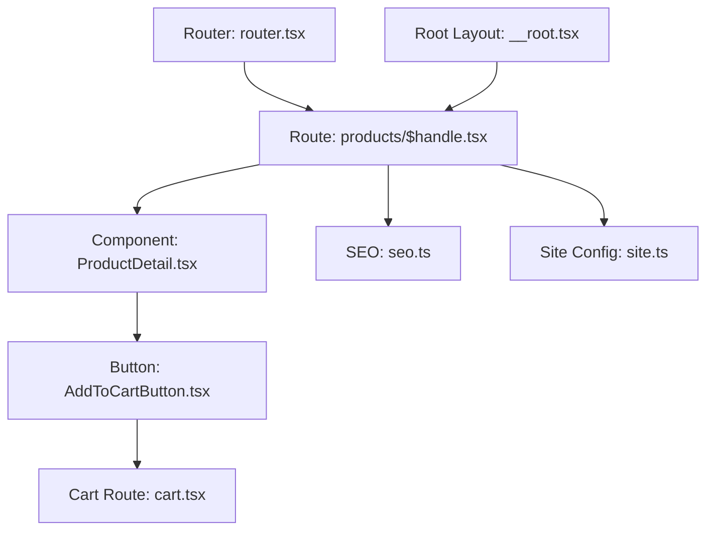
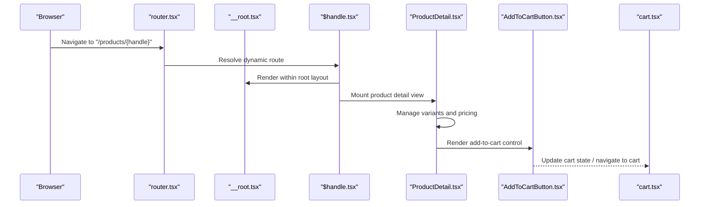
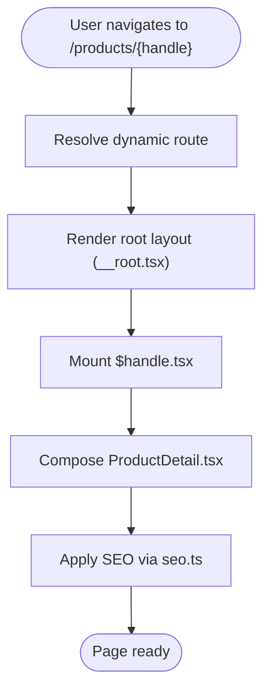
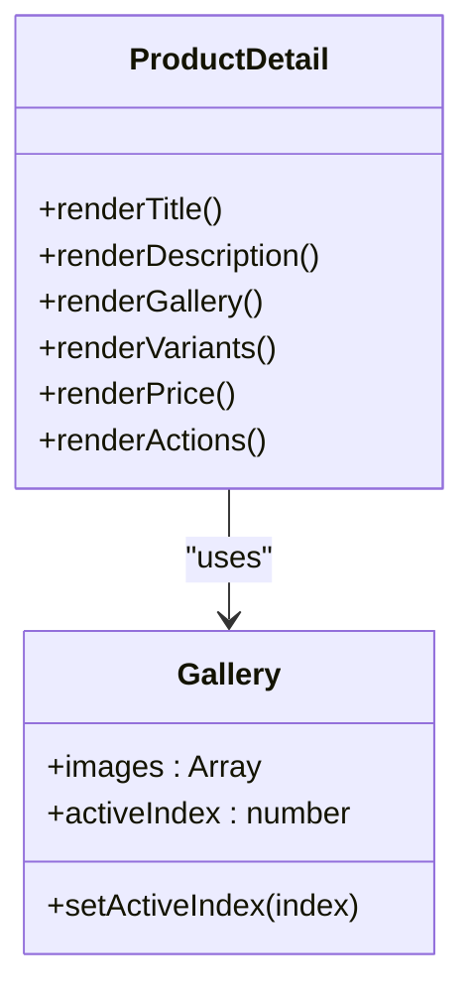
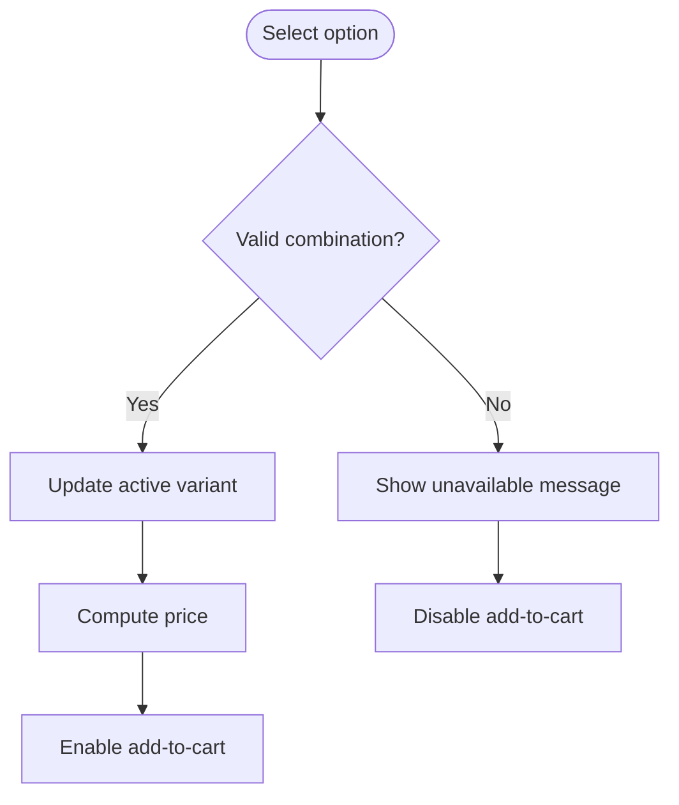
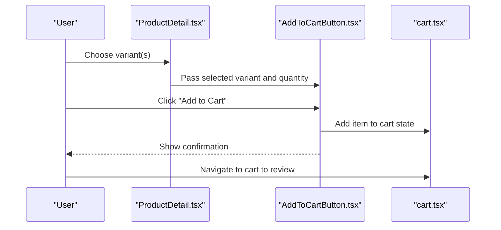
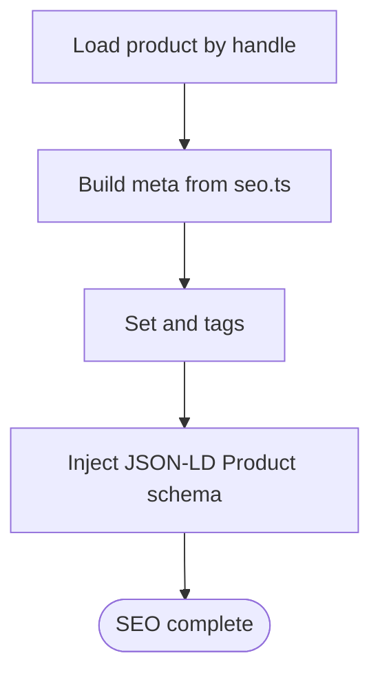
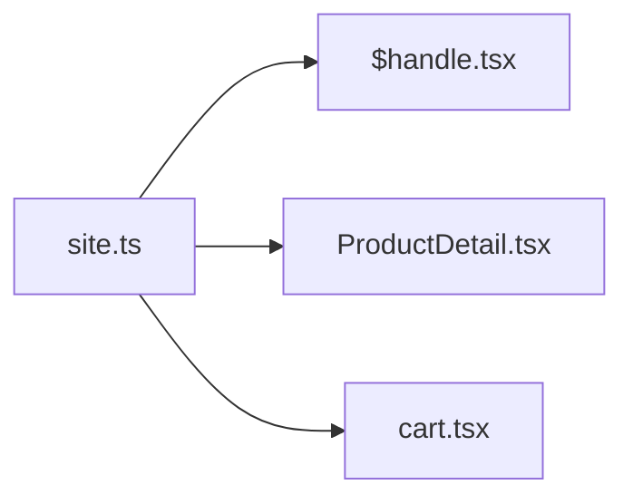
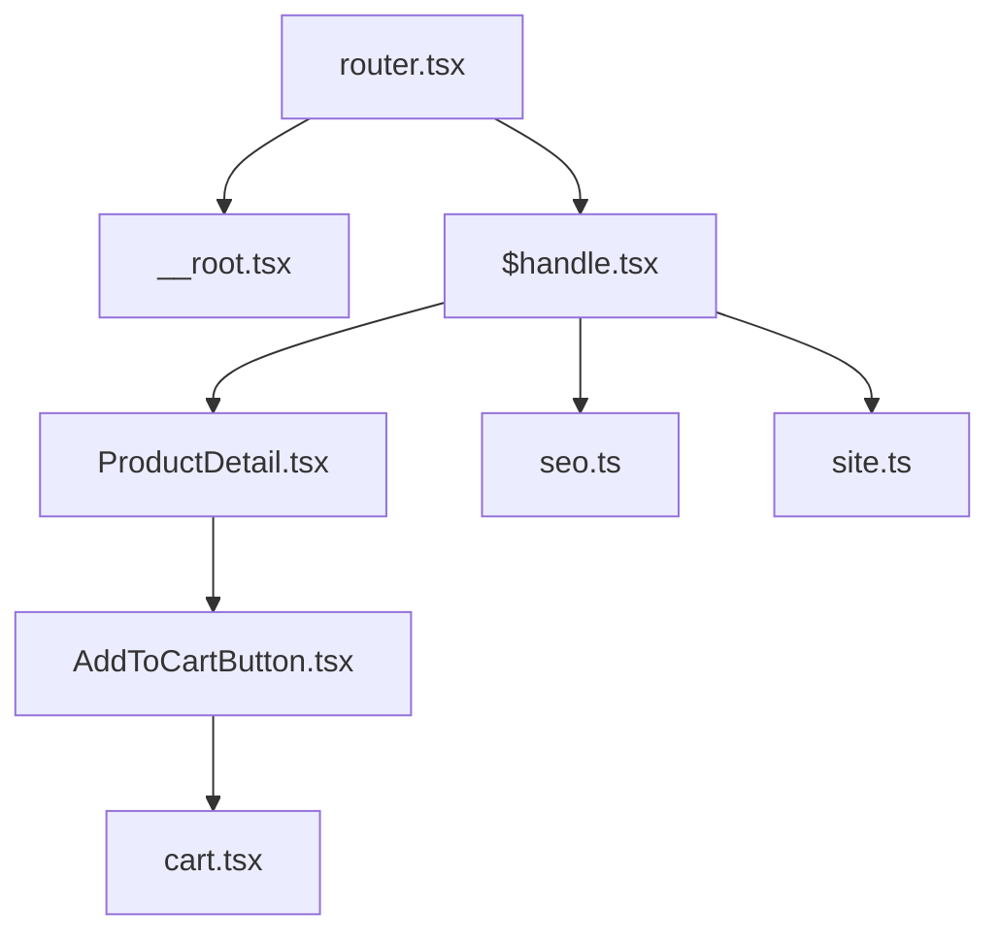

# Product Detail Pages

<cite>
**Referenced Files in This Document**
- [ProductDetail.tsx](file://src/components/shopify/ProductDetail.tsx)
- [AddToCartButton.tsx](file://src/components/shopify/AddToCartButton.tsx)
- [$handle.tsx](file://src/routes/products/$handle.tsx)
- [seo.ts](file://src/lib/seo.ts)
- [site.ts](file://src/lib/site.ts)
- [cart.tsx](file://src/routes/cart.tsx)
- [router.tsx](file://src/router.tsx)
- [__root.tsx](file://src/routes/__root.tsx)
</cite>

## Table of Contents
1. [Introduction](#introduction)
2. [Project Structure](#project-structure)
3. [Core Components](#core-components)
4. [Architecture Overview](#architecture-overview)
5. [Detailed Component Analysis](#detailed-component-analysis)
6. [Dependency Analysis](#dependency-analysis)
7. [Performance Considerations](#performance-considerations)
8. [Troubleshooting Guide](#troubleshooting-guide)
9. [Conclusion](#conclusion)
10. [Appendices](#appendices)

## Introduction
This document explains how product detail pages are implemented in the project, focusing on:
- Displaying product information and images
- Variant selection and pricing display
- Add-to-cart functionality
- Dynamic routing using product handles
- SEO optimization and structured data markup
- Customization patterns for layouts, recommendations, reviews, and cart integration
- Performance optimization for images, accessibility compliance, and cross-browser compatibility

The implementation is built with a React-based router and Shopify-integrated components.

## Project Structure
Key files involved in product detail pages:
- Route definition for dynamic product handle: src/routes/products/$handle.tsx
- Product detail UI component: src/components/shopify/ProductDetail.tsx
- Add to cart button: src/components/shopify/AddToCartButton.tsx
- SEO utilities: src/lib/seo.ts
- Site configuration: src/lib/site.ts
- Cart route: src/routes/cart.tsx
- Router setup: src/router.tsx
- Root layout: src/routes/__root.tsx

**Diagram sources**
- [$handle.tsx](file://src/routes/products/$handle.tsx)
- [ProductDetail.tsx](file://src/components/shopify/ProductDetail.tsx)
- [AddToCartButton.tsx](file://src/components/shopify/AddToCartButton.tsx)
- [seo.ts](file://src/lib/seo.ts)
- [site.ts](file://src/lib/site.ts)
- [cart.tsx](file://src/routes/cart.tsx)
- [router.tsx](file://src/router.tsx)
- [__root.tsx](file://src/routes/__root.tsx)

**Section sources**
- [$handle.tsx](file://src/routes/products/$handle.tsx)
- [ProductDetail.tsx](file://src/components/shopify/ProductDetail.tsx)
- [AddToCartButton.tsx](file://src/components/shopify/AddToCartButton.tsx)
- [seo.ts](file://src/lib/seo.ts)
- [site.ts](file://src/lib/site.ts)
- [cart.tsx](file://src/routes/cart.tsx)
- [router.tsx](file://src/router.tsx)
- [__root.tsx](file://src/routes/__root.tsx)

## Core Components
- ProductDetail.tsx: Renders product details including title, description, media gallery, variants, price, and actions. It orchestrates variant selection and integrates with add-to-cart.
- AddToCartButton.tsx: Provides an interactive control to add selected product options to the cart.
- $handle.tsx: Defines the dynamic route for individual products by handle and wires up SEO and page metadata.
- seo.ts: Utilities for generating meta tags and structured data.
- site.ts: Centralized site configuration used across routes and components.
- cart.tsx: The cart route that displays cart contents and interacts with the cart state.
- router.tsx: Application router configuration that mounts routes.
- __root.tsx: Root layout providing global context and structure.

**Section sources**
- [ProductDetail.tsx](file://src/components/shopify/ProductDetail.tsx)
- [AddToCartButton.tsx](file://src/components/shopify/AddToCartButton.tsx)
- [$handle.tsx](file://src/routes/products/$handle.tsx)
- [seo.ts](file://src/lib/seo.ts)
- [site.ts](file://src/lib/site.ts)
- [cart.tsx](file://src/routes/cart.tsx)
- [router.tsx](file://src/router.tsx)
- [__root.tsx](file://src/routes/__root.tsx)

## Architecture Overview
The product detail flow starts at the router, resolves the dynamic handle, renders the root layout, then the product route, which composes the ProductDetail component. The component manages variant selection and triggers add-to-cart via AddToCartButton. SEO metadata and structured data are applied through utilities.

**Diagram sources**
- [router.tsx](file://src/router.tsx)
- [__root.tsx](file://src/routes/__root.tsx)
- [$handle.tsx](file://src/routes/products/$handle.tsx)
- [ProductDetail.tsx](file://src/components/shopify/ProductDetail.tsx)
- [AddToCartButton.tsx](file://src/components/shopify/AddToCartButton.tsx)
- [cart.tsx](file://src/routes/cart.tsx)

## Detailed Component Analysis

### Dynamic Routing with Product Handles
- The route file uses a dynamic segment for product handles, enabling URLs like /products/{handle}.
- The route composes the ProductDetail component and applies SEO metadata based on the product.
- The root layout provides consistent chrome (header/footer/global styles).

**Diagram sources**
- [$handle.tsx](file://src/routes/products/$handle.tsx)
- [__root.tsx](file://src/routes/__root.tsx)
- [ProductDetail.tsx](file://src/components/shopify/ProductDetail.tsx)
- [seo.ts](file://src/lib/seo.ts)

**Section sources**
- [$handle.tsx](file://src/routes/products/$handle.tsx)
- [__root.tsx](file://src/routes/__root.tsx)
- [seo.ts](file://src/lib/seo.ts)

### Product Information Display and Image Galleries
- The ProductDetail component renders product title, description, and media assets.
- Media galleries should support multiple images and possibly videos, with lazy loading and responsive sizing.
- Ensure alt text is provided for all images to improve accessibility and SEO.

**Diagram sources**
- [ProductDetail.tsx](file://src/components/shopify/ProductDetail.tsx)

**Section sources**
- [ProductDetail.tsx](file://src/components/shopify/ProductDetail.tsx)

### Variant Selection and Pricing Display
- Variants are typically represented by selectable options (e.g., size, color).
- The component should compute the active variant and update price accordingly.
- When no valid variant is selected, disable add-to-cart or show a clear message.

**Diagram sources**
- [ProductDetail.tsx](file://src/components/shopify/ProductDetail.tsx)

**Section sources**
- [ProductDetail.tsx](file://src/components/shopify/ProductDetail.tsx)

### Add-to-Cart Functionality
- AddToCartButton.tsx encapsulates the interaction to add items to the cart.
- It should accept current variant selection and quantity, then dispatch to the cart system.
- Provide user feedback (success/error) and optionally redirect to cart.

**Diagram sources**
- [ProductDetail.tsx](file://src/components/shopify/ProductDetail.tsx)
- [AddToCartButton.tsx](file://src/components/shopify/AddToCartButton.tsx)
- [cart.tsx](file://src/routes/cart.tsx)

**Section sources**
- [AddToCartButton.tsx](file://src/components/shopify/AddToCartButton.tsx)
- [cart.tsx](file://src/routes/cart.tsx)

### SEO Optimization and Structured Data
- Use seo.ts to set meta title, description, canonical URL, and Open Graph/Twitter cards.
- Implement structured data (JSON-LD) for Product schema to enhance search results.
- Ensure unique titles and descriptions per product handle.

**Diagram sources**
- [$handle.tsx](file://src/routes/products/$handle.tsx)
- [seo.ts](file://src/lib/seo.ts)

**Section sources**
- [seo.ts](file://src/lib/seo.ts)
- [$handle.tsx](file://src/routes/products/$handle.tsx)

### Integration with Site Configuration
- site.ts centralizes site-wide settings such as currency, locale, and default metadata.
- ProductDetail and routes can consume these values to render consistent pricing and language.

**Diagram sources**
- [site.ts](file://src/lib/site.ts)
- [$handle.tsx](file://src/routes/products/$handle.tsx)
- [ProductDetail.tsx](file://src/components/shopify/ProductDetail.tsx)
- [cart.tsx](file://src/routes/cart.tsx)

**Section sources**
- [site.ts](file://src/lib/site.ts)

## Dependency Analysis
High-level dependencies among key files:

**Diagram sources**
- [router.tsx](file://src/router.tsx)
- [__root.tsx](file://src/routes/__root.tsx)
- [$handle.tsx](file://src/routes/products/$handle.tsx)
- [ProductDetail.tsx](file://src/components/shopify/ProductDetail.tsx)
- [AddToCartButton.tsx](file://src/components/shopify/AddToCartButton.tsx)
- [seo.ts](file://src/lib/seo.ts)
- [site.ts](file://src/lib/site.ts)
- [cart.tsx](file://src/routes/cart.tsx)

**Section sources**
- [router.tsx](file://src/router.tsx)
- [__root.tsx](file://src/routes/__root.tsx)
- [$handle.tsx](file://src/routes/products/$handle.tsx)
- [ProductDetail.tsx](file://src/components/shopify/ProductDetail.tsx)
- [AddToCartButton.tsx](file://src/components/shopify/AddToCartButton.tsx)
- [seo.ts](file://src/lib/seo.ts)
- [site.ts](file://src/lib/site.ts)
- [cart.tsx](file://src/routes/cart.tsx)

## Performance Considerations
- Image optimization:
  - Use responsive images and appropriate formats (WebP/AVIF where supported).
  - Lazy-load images below the fold; preload hero images.
  - Specify width/height or aspect ratio to avoid layout shifts.
- Rendering efficiency:
  - Memoize expensive computations for variant price updates.
  - Avoid unnecessary re-renders by stabilizing props and keys.
- Network requests:
  - Cache product data when possible; leverage browser caching headers.
  - Defer non-critical scripts and analytics.
- Accessibility:
  - Provide meaningful alt text for images.
  - Ensure keyboard navigation for galleries and variant selectors.
  - Use ARIA attributes for dynamic content updates (e.g., price changes).
- Cross-browser compatibility:
  - Test image format fallbacks and modern APIs.
  - Verify form controls and interactions across browsers.

[No sources needed since this section provides general guidance]

## Troubleshooting Guide
Common issues and checks:
- Missing product data:
  - Verify handle resolution and data fetching path.
  - Confirm that the product exists and is published.
- Variant selection not updating price:
  - Check variant mapping and availability logic.
  - Ensure event handlers are wired correctly.
- Add-to-cart failures:
  - Inspect network calls and error responses.
  - Validate required fields (variant ID, quantity).
- SEO not applying:
  - Confirm meta tags are set during route rendering.
  - Validate JSON-LD structure and properties.
- Accessibility problems:
  - Run automated audits and manual keyboard tests.
  - Ensure focus management and screen reader announcements.

**Section sources**
- [$handle.tsx](file://src/routes/products/$handle.tsx)
- [ProductDetail.tsx](file://src/components/shopify/ProductDetail.tsx)
- [AddToCartButton.tsx](file://src/components/shopify/AddToCartButton.tsx)
- [seo.ts](file://src/lib/seo.ts)

## Conclusion
The product detail page implementation centers around a dynamic route resolved by handle, a composable ProductDetail component, and a dedicated add-to-cart control. SEO and structured data are applied via utilities, while site configuration ensures consistency. By following the performance, accessibility, and compatibility guidelines, you can deliver fast, inclusive, and reliable product experiences.

[No sources needed since this section summarizes without analyzing specific files]

## Appendices

### Customizing Product Layouts
- Extend ProductDetail to include tabs or accordions for additional content (specifications, shipping, returns).
- Integrate recommendation modules above or below the fold, pulling related products by collection or tags.
- Add customer reviews sections with pagination and rating summaries.

[No sources needed since this section doesn't analyze specific files]

### Integrating with the Shopping Cart System
- Ensure AddToCartButton communicates with the cart store or API consistently.
- Provide immediate feedback and allow easy navigation to the cart route.
- Persist cart state across sessions if applicable.

**Section sources**
- [AddToCartButton.tsx](file://src/components/shopify/AddToCartButton.tsx)
- [cart.tsx](file://src/routes/cart.tsx)