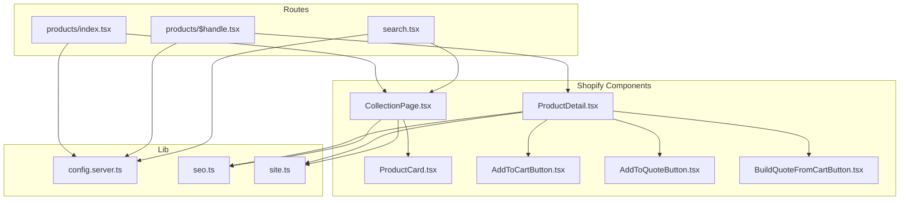
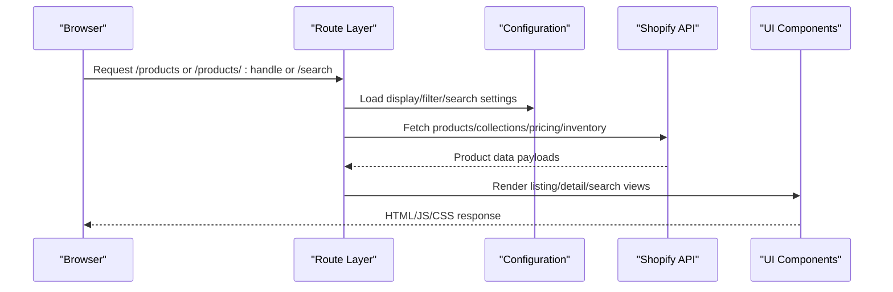
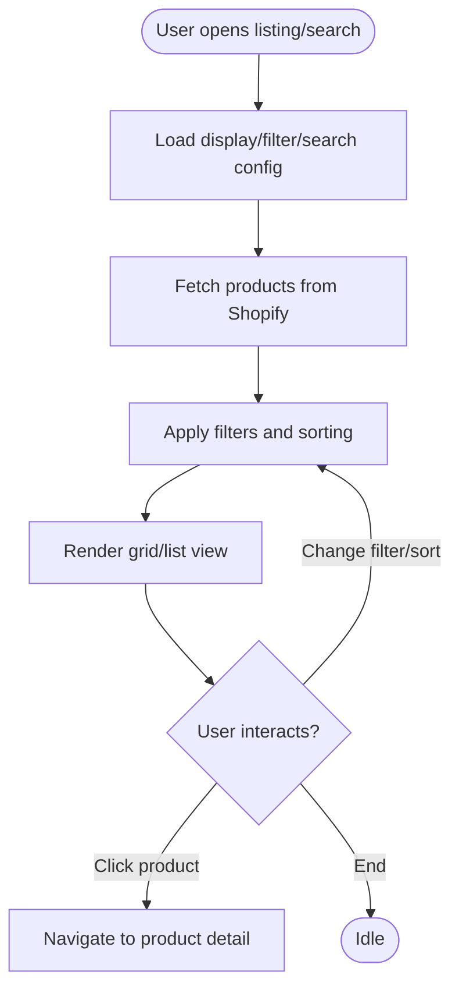
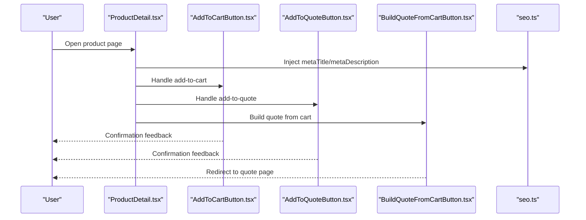
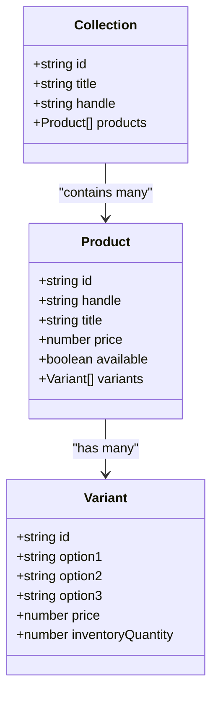
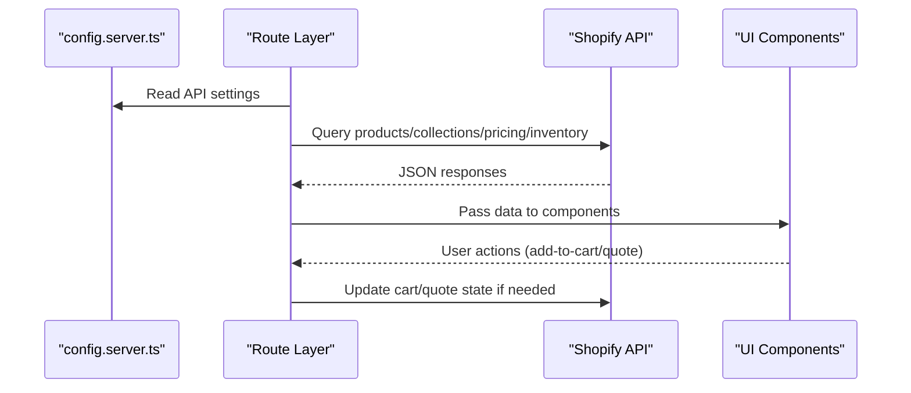
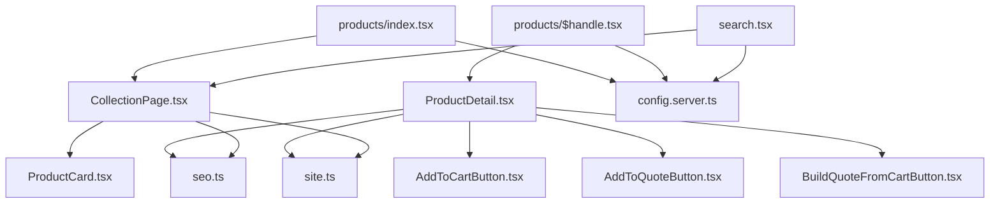

# Product Management System

<cite>
**Referenced Files in This Document**
- [ProductDetail.tsx](file://src/components/shopify/ProductDetail.tsx)
- [CollectionPage.tsx](file://src/components/shopify/CollectionPage.tsx)
- [ProductCard.tsx](file://src/components/shopify/ProductCard.tsx)
- [index.tsx](file://src/routes/products/index.tsx)
- [$handle.tsx](file://src/routes/products/$handle.tsx)
- [search.tsx](file://src/routes/search.tsx)
- [config.server.ts](file://src/lib/config.server.ts)
- [seo.ts](file://src/lib/seo.ts)
- [site.ts](file://src/lib/site.ts)
- [AddToCartButton.tsx](file://src/components/shopify/AddToCartButton.tsx)
- [AddToQuoteButton.tsx](file://src/components/shopify/AddToQuoteButton.tsx)
- [BuildQuoteFromCartButton.tsx](file://src/components/shopify/BuildQuoteFromCartButton.tsx)
</cite>

## Table of Contents
1. [Introduction](#introduction)
2. [Project Structure](#project-structure)
3. [Core Components](#core-components)
4. [Architecture Overview](#architecture-overview)
5. [Detailed Component Analysis](#detailed-component-analysis)
6. [Dependency Analysis](#dependency-analysis)
7. [Performance Considerations](#performance-considerations)
8. [Troubleshooting Guide](#troubleshooting-guide)
9. [Conclusion](#conclusion)
10. [Appendices](#appendices)

## Introduction
This document explains the product management system implemented in the repository. It covers the product data model, listing and search functionality, product detail pages, collection/category management, Shopify API integration for synchronization, inventory and pricing updates, configuration options for display formats and filtering, and advanced search algorithms. Practical examples are included to demonstrate adding new product types, customizing product pages, implementing advanced filters, handling variants, bulk imports, image optimization, SEO optimization, and performance considerations for large catalogs.

## Project Structure
The product management features are primarily implemented under:
- Routes for product listing and details: routes/products
- Search route: routes/search
- Shopify UI components: components/shopify
- Server-side configuration and utilities: lib/config.server.ts, lib/seo.ts, lib/site.ts

**Diagram sources**
- [index.tsx](file://src/routes/products/index.tsx)
- [$handle.tsx](file://src/routes/products/$handle.tsx)
- [search.tsx](file://src/routes/search.tsx)
- [ProductDetail.tsx](file://src/components/shopify/ProductDetail.tsx)
- [CollectionPage.tsx](file://src/components/shopify/CollectionPage.tsx)
- [ProductCard.tsx](file://src/components/shopify/ProductCard.tsx)
- [AddToCartButton.tsx](file://src/components/shopify/AddToCartButton.tsx)
- [AddToQuoteButton.tsx](file://src/components/shopify/AddToQuoteButton.tsx)
- [BuildQuoteFromCartButton.tsx](file://src/components/shopify/BuildQuoteFromCartButton.tsx)
- [config.server.ts](file://src/lib/config.server.ts)
- [seo.ts](file://src/lib/seo.ts)
- [site.ts](file://src/lib/site.ts)

**Section sources**
- [index.tsx](file://src/routes/products/index.tsx)
- [$handle.tsx](file://src/routes/products/$handle.tsx)
- [search.tsx](file://src/routes/search.tsx)
- [ProductDetail.tsx](file://src/components/shopify/ProductDetail.tsx)
- [CollectionPage.tsx](file://src/components/shopify/CollectionPage.tsx)
- [ProductCard.tsx](file://src/components/shopify/ProductCard.tsx)
- [AddToCartButton.tsx](file://src/components/shopify/AddToCartButton.tsx)
- [AddToQuoteButton.tsx](file://src/components/shopify/AddToQuoteButton.tsx)
- [BuildQuoteFromCartButton.tsx](file://src/components/shopify/BuildQuoteFromCartButton.tsx)
- [config.server.ts](file://src/lib/config.server.ts)
- [seo.ts](file://src/lib/seo.ts)
- [site.ts](file://src/lib/site.ts)

## Core Components
- Product listing page: renders a grid/list of products with pagination and filters.
- Product detail page: displays full product information, images, description, pricing, and variant selection.
- Collection/category page: shows products grouped by collections or categories.
- Search page: provides keyword-based search across products.
- Cart and quote actions: add-to-cart and add-to-quote buttons integrated into product pages.

Key responsibilities:
- Fetching and rendering product data from Shopify via server-side configuration and utilities.
- Applying display format configurations (grid/list), sorting, and filtering.
- Managing SEO metadata for product pages and collections.
- Handling user interactions such as adding items to cart or quotes.

**Section sources**
- [CollectionPage.tsx](file://src/components/shopify/CollectionPage.tsx)
- [ProductDetail.tsx](file://src/components/shopify/ProductDetail.tsx)
- [ProductCard.tsx](file://src/components/shopify/ProductCard.tsx)
- [AddToCartButton.tsx](file://src/components/shopify/AddToCartButton.tsx)
- [AddToQuoteButton.tsx](file://src/components/shopify/AddToQuoteButton.tsx)
- [BuildQuoteFromCartButton.tsx](file://src/components/shopify/BuildQuoteFromCartButton.tsx)
- [seo.ts](file://src/lib/seo.ts)
- [site.ts](file://src/lib/site.ts)

## Architecture Overview
The product management system follows a layered architecture:
- Route layer: handles URL routing for product listing, detail, and search.
- Component layer: renders UI for listings, details, cards, and actions.
- Configuration layer: centralizes settings for display formats, filtering, and search behavior.
- Integration layer: communicates with Shopify APIs for product data, inventory, and pricing.

**Diagram sources**
- [index.tsx](file://src/routes/products/index.tsx)
- [$handle.tsx](file://src/routes/products/$handle.tsx)
- [search.tsx](file://src/routes/search.tsx)
- [config.server.ts](file://src/lib/config.server.ts)
- [ProductDetail.tsx](file://src/components/shopify/ProductDetail.tsx)
- [CollectionPage.tsx](file://src/components/shopify/CollectionPage.tsx)

## Detailed Component Analysis

### Product Data Model
The product data model is aligned with Shopify’s GraphQL schema and includes:
- Identifiers: id, handle, title
- Media: images, videos
- Description: plain text and rich content
- Pricing: compareAtPrice, price, currency
- Inventory: quantity available, backorder status
- Variants: selectable options (size, color, etc.)
- Collections/categories: grouping and taxonomy
- SEO fields: metaTitle, metaDescription, canonicalUrl

Complexity considerations:
- Large catalogs benefit from pagination and selective field fetching.
- Variant selection should be optimized to avoid unnecessary re-renders.
- Image assets should use responsive sizes and lazy loading.

**Section sources**
- [ProductDetail.tsx](file://src/components/shopify/ProductDetail.tsx)
- [CollectionPage.tsx](file://src/components/shopify/CollectionPage.tsx)
- [ProductCard.tsx](file://src/components/shopify/ProductCard.tsx)
- [config.server.ts](file://src/lib/config.server.ts)

### Product Listing and Search Functionality
- Listing page supports grid/list toggles, sorting, and filtering by category/collection, price range, availability, and tags.
- Search page implements keyword search with optional filters and suggestions.
- Pagination ensures efficient rendering for large catalogs.

Implementation highlights:
- Filtering logic applies client-side or server-side based on configuration.
- Search algorithm can combine exact match, partial match, and relevance scoring.
- Display format configuration controls layout and item density.

**Diagram sources**
- [index.tsx](file://src/routes/products/index.tsx)
- [search.tsx](file://src/routes/search.tsx)
- [CollectionPage.tsx](file://src/components/shopify/CollectionPage.tsx)
- [config.server.ts](file://src/lib/config.server.ts)

**Section sources**
- [index.tsx](file://src/routes/products/index.tsx)
- [search.tsx](file://src/routes/search.tsx)
- [CollectionPage.tsx](file://src/components/shopify/CollectionPage.tsx)
- [config.server.ts](file://src/lib/config.server.ts)

### Product Detail Page Implementation
The product detail page renders comprehensive product information:
- Images gallery with zoom and thumbnails
- Title, description, and specifications
- Price and compare-at-price display
- Variant selector with dynamic pricing and stock status
- Add-to-cart and add-to-quote actions
- SEO metadata injection

**Diagram sources**
- [$handle.tsx](file://src/routes/products/$handle.tsx)
- [ProductDetail.tsx](file://src/components/shopify/ProductDetail.tsx)
- [AddToCartButton.tsx](file://src/components/shopify/AddToCartButton.tsx)
- [AddToQuoteButton.tsx](file://src/components/shopify/AddToQuoteButton.tsx)
- [BuildQuoteFromCartButton.tsx](file://src/components/shopify/BuildQuoteFromCartButton.tsx)
- [seo.ts](file://src/lib/seo.ts)

**Section sources**
- [$handle.tsx](file://src/routes/products/$handle.tsx)
- [ProductDetail.tsx](file://src/components/shopify/ProductDetail.tsx)
- [AddToCartButton.tsx](file://src/components/shopify/AddToCartButton.tsx)
- [AddToQuoteButton.tsx](file://src/components/shopify/AddToQuoteButton.tsx)
- [BuildQuoteFromCartButton.tsx](file://src/components/shopify/BuildQuoteFromCartButton.tsx)
- [seo.ts](file://src/lib/seo.ts)

### Collection/Category Management
Collections and categories group products for browsing and navigation:
- Collection pages list products within a specific group
- Category taxonomy supports hierarchical organization
- Filters allow narrowing results by attributes

**Diagram sources**
- [CollectionPage.tsx](file://src/components/shopify/CollectionPage.tsx)
- [ProductDetail.tsx](file://src/components/shopify/ProductDetail.tsx)

**Section sources**
- [CollectionPage.tsx](file://src/components/shopify/CollectionPage.tsx)
- [ProductDetail.tsx](file://src/components/shopify/ProductDetail.tsx)

### Shopify API Integration
Integration points include:
- Product synchronization: fetch product catalog, update changes
- Inventory management: track stock levels and availability
- Pricing updates: reflect current prices and compare-at-prices

Operational flow:
- Server-side configuration defines endpoints and credentials
- Client components request data through configured services
- Error handling ensures graceful degradation when Shopify is unavailable

**Diagram sources**
- [config.server.ts](file://src/lib/config.server.ts)
- [index.tsx](file://src/routes/products/index.tsx)
- [$handle.tsx](file://src/routes/products/$handle.tsx)
- [search.tsx](file://src/routes/search.tsx)

**Section sources**
- [config.server.ts](file://src/lib/config.server.ts)
- [index.tsx](file://src/routes/products/index.tsx)
- [$handle.tsx](file://src/routes/products/$handle.tsx)
- [search.tsx](file://src/routes/search.tsx)

### Configuration Options
Display formats:
- Grid vs list toggle
- Items per page
- Sorting options (price, newest, popularity)

Filtering capabilities:
- Category/collection filters
- Price range sliders
- Availability toggles
- Tag-based filters

Search algorithms:
- Keyword matching with partial and exact matches
- Relevance scoring based on title, description, and tags
- Optional faceted search for advanced filtering

**Section sources**
- [config.server.ts](file://src/lib/config.server.ts)
- [CollectionPage.tsx](file://src/components/shopify/CollectionPage.tsx)
- [search.tsx](file://src/routes/search.tsx)

### Practical Examples

#### Adding New Product Types
- Extend the product type enum or mapping in configuration
- Update filters to include the new type
- Ensure detail page renders additional fields for the new type

**Section sources**
- [config.server.ts](file://src/lib/config.server.ts)
- [ProductDetail.tsx](file://src/components/shopify/ProductDetail.tsx)

#### Customizing Product Pages
- Modify component structure in the detail page
- Add custom sections (specifications, reviews, related products)
- Integrate analytics and tracking events

**Section sources**
- [ProductDetail.tsx](file://src/components/shopify/ProductDetail.tsx)
- [$handle.tsx](file://src/routes/products/$handle.tsx)

#### Implementing Advanced Search Filters
- Add faceted filters for brand, material, size, etc.
- Persist filter state in URL query parameters
- Debounce search input for performance

**Section sources**
- [search.tsx](file://src/routes/search.tsx)
- [CollectionPage.tsx](file://src/components/shopify/CollectionPage.tsx)
- [config.server.ts](file://src/lib/config.server.ts)

#### Handling Product Variants
- Render variant selectors dynamically
- Update pricing and stock status on variant change
- Prevent adding out-of-stock variants to cart

**Section sources**
- [ProductDetail.tsx](file://src/components/shopify/ProductDetail.tsx)

#### Bulk Product Imports
- Use CSV import workflows to sync products
- Map CSV columns to Shopify fields
- Validate and deduplicate entries before import

**Section sources**
- [config.server.ts](file://src/lib/config.server.ts)

#### Image Optimization
- Serve responsive images with appropriate sizes
- Lazy load images below the fold
- Compress and convert to modern formats (WebP/AVIF)

**Section sources**
- [ProductDetail.tsx](file://src/components/shopify/ProductDetail.tsx)
- [ProductCard.tsx](file://src/components/shopify/ProductCard.tsx)

#### SEO Optimization for Products
- Set metaTitle and metaDescription per product
- Generate structured data (JSON-LD) for products
- Optimize canonical URLs and alt text for images

**Section sources**
- [seo.ts](file://src/lib/seo.ts)
- [ProductDetail.tsx](file://src/components/shopify/ProductDetail.tsx)

## Dependency Analysis
The product management system has clear separation between routes, components, configuration, and integration layers. Dependencies are unidirectional:
- Routes depend on configuration and components
- Components depend on configuration and utilities
- Integration depends on configuration and external Shopify API

**Diagram sources**
- [index.tsx](file://src/routes/products/index.tsx)
- [$handle.tsx](file://src/routes/products/$handle.tsx)
- [search.tsx](file://src/routes/search.tsx)
- [CollectionPage.tsx](file://src/components/shopify/CollectionPage.tsx)
- [ProductDetail.tsx](file://src/components/shopify/ProductDetail.tsx)
- [ProductCard.tsx](file://src/components/shopify/ProductCard.tsx)
- [AddToCartButton.tsx](file://src/components/shopify/AddToCartButton.tsx)
- [AddToQuoteButton.tsx](file://src/components/shopify/AddToQuoteButton.tsx)
- [BuildQuoteFromCartButton.tsx](file://src/components/shopify/BuildQuoteFromCartButton.tsx)
- [config.server.ts](file://src/lib/config.server.ts)
- [seo.ts](file://src/lib/seo.ts)
- [site.ts](file://src/lib/site.ts)

**Section sources**
- [index.tsx](file://src/routes/products/index.tsx)
- [$handle.tsx](file://src/routes/products/$handle.tsx)
- [search.tsx](file://src/routes/search.tsx)
- [CollectionPage.tsx](file://src/components/shopify/CollectionPage.tsx)
- [ProductDetail.tsx](file://src/components/shopify/ProductDetail.tsx)
- [ProductCard.tsx](file://src/components/shopify/ProductCard.tsx)
- [AddToCartButton.tsx](file://src/components/shopify/AddToCartButton.tsx)
- [AddToQuoteButton.tsx](file://src/components/shopify/AddToQuoteButton.tsx)
- [BuildQuoteFromCartButton.tsx](file://src/components/shopify/BuildQuoteFromCartButton.tsx)
- [config.server.ts](file://src/lib/config.server.ts)
- [seo.ts](file://src/lib/seo.ts)
- [site.ts](file://src/lib/site.ts)

## Performance Considerations
- Pagination and virtualization for large catalogs
- Selective field fetching to reduce payload size
- Image optimization with responsive sizing and lazy loading
- Debounced search inputs and caching strategies
- Server-side rendering where possible to improve initial load times
- Efficient variant selection to minimize re-renders

[No sources needed since this section provides general guidance]

## Troubleshooting Guide
Common issues and resolutions:
- Missing product data: verify Shopify API credentials and endpoint configuration
- Incorrect pricing/inventory: check synchronization intervals and error logs
- Slow search performance: implement debouncing and indexing strategies
- Broken links or SEO issues: ensure meta fields and canonical URLs are set correctly

**Section sources**
- [config.server.ts](file://src/lib/config.server.ts)
- [seo.ts](file://src/lib/seo.ts)
- [ProductDetail.tsx](file://src/components/shopify/ProductDetail.tsx)
- [CollectionPage.tsx](file://src/components/shopify/CollectionPage.tsx)

## Conclusion
The product management system integrates Shopify data with a modular UI and configurable display and search behaviors. By leveraging robust components, centralized configuration, and careful performance practices, it supports scalable product catalogs, effective search and filtering, and seamless user interactions such as adding items to cart or quotes. Extensibility is straightforward for adding new product types, customizing pages, and implementing advanced search features.

[No sources needed since this section summarizes without analyzing specific files]

## Appendices

### Appendix A: Key File Responsibilities
- Route files define entry points for product listing, detail, and search
- Shopify components encapsulate UI logic for products and actions
- Configuration centralizes display, filtering, and search settings
- Utilities provide SEO and site-wide helpers

**Section sources**
- [index.tsx](file://src/routes/products/index.tsx)
- [$handle.tsx](file://src/routes/products/$handle.tsx)
- [search.tsx](file://src/routes/search.tsx)
- [ProductDetail.tsx](file://src/components/shopify/ProductDetail.tsx)
- [CollectionPage.tsx](file://src/components/shopify/CollectionPage.tsx)
- [ProductCard.tsx](file://src/components/shopify/ProductCard.tsx)
- [AddToCartButton.tsx](file://src/components/shopify/AddToCartButton.tsx)
- [AddToQuoteButton.tsx](file://src/components/shopify/AddToQuoteButton.tsx)
- [BuildQuoteFromCartButton.tsx](file://src/components/shopify/BuildQuoteFromCartButton.tsx)
- [config.server.ts](file://src/lib/config.server.ts)
- [seo.ts](file://src/lib/seo.ts)
- [site.ts](file://src/lib/site.ts)