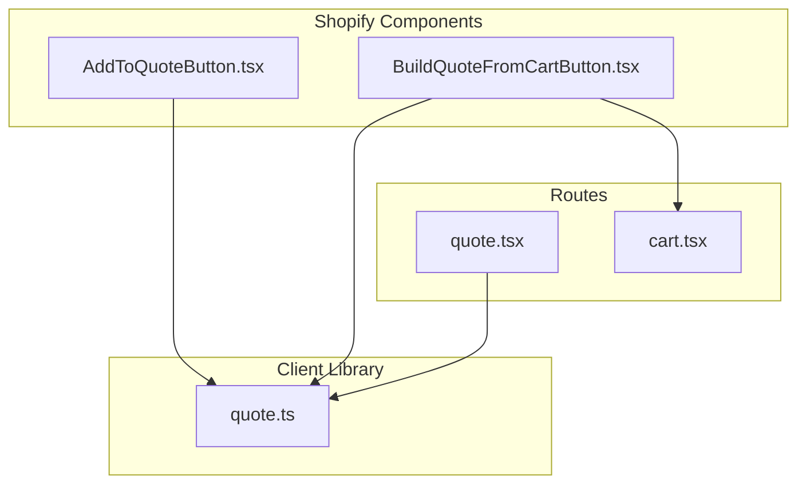
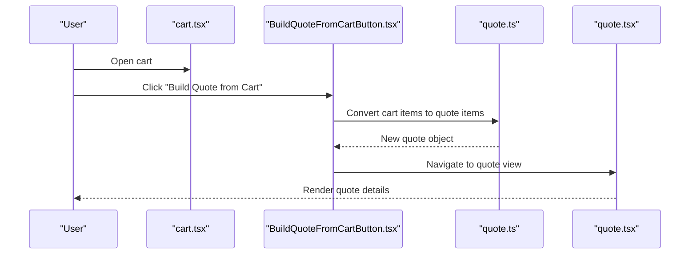
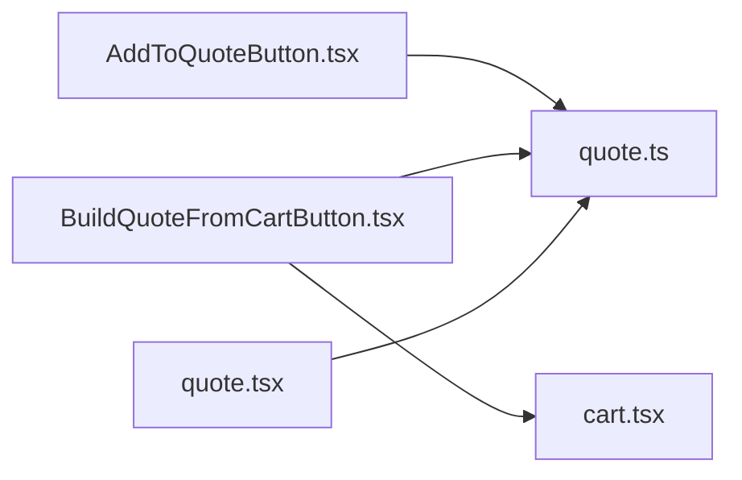

# Quote Generation System

<cite>
**Referenced Files in This Document**
- [AddToQuoteButton.tsx](file://src/components/shopify/AddToQuoteButton.tsx)
- [BuildQuoteFromCartButton.tsx](file://src/components/shopify/BuildQuoteFromCartButton.tsx)
- [quote.ts](file://src/lib/quote.ts)
- [quote.tsx](file://src/routes/quote.tsx)
- [cart.tsx](file://src/routes/cart.tsx)
</cite>

## Table of Contents
1. [Introduction](#introduction)
2. [Project Structure](#project-structure)
3. [Core Components](#core-components)
4. [Architecture Overview](#architecture-overview)
5. [Detailed Component Analysis](#detailed-component-analysis)
6. [Dependency Analysis](#dependency-analysis)
7. [Performance Considerations](#performance-considerations)
8. [Troubleshooting Guide](#troubleshooting-guide)
9. [Conclusion](#conclusion)
10. [Appendices](#appendices)

## Introduction
This document explains the quote generation system, focusing on how cart items are converted into quotes, the structure and formatting of quotes, export and sharing capabilities, and the management interface. It also covers integration points for email services, customization of quote templates, approval workflows, CRM integrations, bulk quoting, special pricing calculations, versioning, and the relationship between quotes and user accounts for trade account holders.

## Project Structure
The quote feature spans UI components, a client-side library for quote data handling, and route pages that render the quote experience. The key files involved are:
- Add-to-quote button component to add items directly to a quote
- Build-from-cart button component to convert an existing cart into a quote
- Client-side quote library for quote data structures and operations
- Quote route page for viewing and managing quotes
- Cart route page as the source of cart items for conversion

**Diagram sources**
- [AddToQuoteButton.tsx](file://src/components/shopify/AddToQuoteButton.tsx)
- [BuildQuoteFromCartButton.tsx](file://src/components/shopify/BuildQuoteFromCartButton.tsx)
- [quote.ts](file://src/lib/quote.ts)
- [quote.tsx](file://src/routes/quote.tsx)
- [cart.tsx](file://src/routes/cart.tsx)

**Section sources**
- [AddToQuoteButton.tsx](file://src/components/shopify/AddToQuoteButton.tsx)
- [BuildQuoteFromCartButton.tsx](file://src/components/shopify/BuildQuoteFromCartButton.tsx)
- [quote.ts](file://src/lib/quote.ts)
- [quote.tsx](file://src/routes/quote.tsx)
- [cart.tsx](file://src/routes/cart.tsx)

## Core Components
- Add-to-quote button: Adds selected product(s) to the current quote without affecting the cart.
- Build-from-cart button: Converts all or selected cart items into a new quote.
- Quote library: Provides data models, helpers, and persistence for quotes.
- Quote route: Displays quote details, allows editing, exporting, and sharing.
- Cart route: Source of cart items; used by build-from-cart flow.

Key responsibilities:
- Maintain a consistent quote data model across components and routes
- Provide conversion logic from cart line items to quote line items
- Support export (e.g., PDF) and sharing (e.g., link/email)
- Surface quote management actions (edit, duplicate, delete)

**Section sources**
- [AddToQuoteButton.tsx](file://src/components/shopify/AddToQuoteButton.tsx)
- [BuildQuoteFromCartButton.tsx](file://src/components/shopify/BuildQuoteFromCartButton.tsx)
- [quote.ts](file://src/lib/quote.ts)
- [quote.tsx](file://src/routes/quote.tsx)
- [cart.tsx](file://src/routes/cart.tsx)

## Architecture Overview
The quote system is primarily client-side with clear separation between UI components, data utilities, and route-level presentation. Conversion from cart to quote uses shared logic in the quote library. Export and sharing are handled within the quote route and related utilities.

**Diagram sources**
- [cart.tsx](file://src/routes/cart.tsx)
- [BuildQuoteFromCartButton.tsx](file://src/components/shopify/BuildQuoteFromCartButton.tsx)
- [quote.ts](file://src/lib/quote.ts)
- [quote.tsx](file://src/routes/quote.tsx)

## Detailed Component Analysis

### Add-to-Quote Button
Purpose:
- Allow users to add one or more products directly to the active quote without modifying the cart.

Behavior:
- Reads current quote state from the quote library
- Creates or updates a quote line item based on product selection
- Persists updated quote via the quote library

Integration points:
- Depends on quote data model and persistence helpers
- Can be placed on product cards or detail pages

Customization hooks:
- Override default label or behavior by wrapping the component
- Adjust which attributes are included in the quote line item

**Section sources**
- [AddToQuoteButton.tsx](file://src/components/shopify/AddToQuoteButton.tsx)
- [quote.ts](file://src/lib/quote.ts)

### Build-from-Cart Button
Purpose:
- Convert existing cart contents into a new quote.

Workflow:
- Collects cart line items from the cart route context
- Maps each cart item to a quote line item using the quote library
- Creates a new quote and navigates to the quote route

Edge cases:
- Empty cart handling
- Duplicate product mapping rules
- Quantity normalization

**Section sources**
- [BuildQuoteFromCartButton.tsx](file://src/components/shopify/BuildQuoteFromCartButton.tsx)
- [cart.tsx](file://src/routes/cart.tsx)
- [quote.ts](file://src/lib/quote.ts)

### Quote Library (quote.ts)
Responsibilities:
- Define the quote data model (header and line items)
- Provide functions to create, update, and persist quotes
- Implement conversion helpers from cart to quote
- Offer formatting utilities for exports and display

Data model highlights:
- Quote header: identifiers, dates, customer info, notes, status
- Quote line items: product references, quantities, unit prices, discounts, taxes, totals
- Versioning fields: version number, created/updated timestamps

Persistence:
- Local storage or session-based storage for client-side durability
- Optional sync hooks for server-backed quotes (if implemented)

Export and sharing:
- Generate printable content (PDF-ready)
- Create shareable links or encoded payloads
- Email payload preparation for integration

Special pricing:
- Apply tiered pricing, volume discounts, or custom price overrides per line item
- Compute subtotal, tax, shipping, and grand total

Versioning:
- Increment version on changes
- Keep history snapshots for auditability

Trade account relationships:
- Associate quote with a user account when available
- Store trade-specific pricing and terms if present

**Section sources**
- [quote.ts](file://src/lib/quote.ts)

### Quote Route (quote.tsx)
Responsibilities:
- Display quote details and line items
- Provide actions: edit, duplicate, delete, export, share
- Integrate with email service for sending quotes
- Show approval workflow steps if enabled

UI features:
- Editable fields for notes, terms, and pricing adjustments
- Summary section with totals and validity period
- Export options (PDF, print-friendly HTML)
- Share via link or email

Approval workflow:
- Status transitions (draft, pending approval, approved, rejected)
- Role-based visibility for approvers
- Audit trail entries for approvals

Email integration:
- Compose email with quote attachment or link
- Trigger send action and handle success/failure states

CRM integration:
- Push quote metadata and line items to external CRM
- Sync status updates back to the app

**Section sources**
- [quote.tsx](file://src/routes/quote.tsx)
- [quote.ts](file://src/lib/quote.ts)

### Cart Route (cart.tsx)
Responsibilities:
- Present cart items and totals
- Provide entry point to build a quote from the cart
- Expose cart context consumed by build-from-cart button

Conversion trigger:
- On click, initiates conversion flow to create a quote

**Section sources**
- [cart.tsx](file://src/routes/cart.tsx)
- [BuildQuoteFromCartButton.tsx](file://src/components/shopify/BuildQuoteFromCartButton.tsx)

## Dependency Analysis
High-level dependencies:
- Add-to-quote and build-from-cart components depend on the quote library for data operations
- Quote route depends on the quote library for rendering and actions
- Build-from-cart depends on cart route context for source items

**Diagram sources**
- [AddToQuoteButton.tsx](file://src/components/shopify/AddToQuoteButton.tsx)
- [BuildQuoteFromCartButton.tsx](file://src/components/shopify/BuildQuoteFromCartButton.tsx)
- [quote.ts](file://src/lib/quote.ts)
- [quote.tsx](file://src/routes/quote.tsx)
- [cart.tsx](file://src/routes/cart.tsx)

**Section sources**
- [AddToQuoteButton.tsx](file://src/components/shopify/AddToQuoteButton.tsx)
- [BuildQuoteFromCartButton.tsx](file://src/components/shopify/BuildQuoteFromCartButton.tsx)
- [quote.ts](file://src/lib/quote.ts)
- [quote.tsx](file://src/routes/quote.tsx)
- [cart.tsx](file://src/routes/cart.tsx)

## Performance Considerations
- Avoid unnecessary re-renders by memoizing quote computations and derived totals
- Defer heavy export generation until explicitly requested
- Batch updates when making multiple changes to quote line items
- Use efficient serialization for persistence to reduce I/O overhead

[No sources needed since this section provides general guidance]

## Troubleshooting Guide
Common issues and resolutions:
- Missing quote data: Ensure the quote library initializes correctly and persists data before navigation
- Conversion errors: Validate cart items have required fields before mapping to quote line items
- Export failures: Check browser capabilities for PDF generation and fallback to print-friendly HTML
- Email send failures: Verify email service configuration and handle network errors gracefully
- Approval workflow stuck: Confirm role permissions and status transition rules

**Section sources**
- [quote.ts](file://src/lib/quote.ts)
- [quote.tsx](file://src/routes/quote.tsx)

## Conclusion
The quote generation system provides a cohesive workflow from cart to quote, robust data modeling, and flexible export and sharing options. With extensible components and a well-defined quote library, teams can customize templates, implement approval flows, integrate with email and CRM systems, and support advanced use cases such as bulk quoting, special pricing, and versioning. For trade account holders, quotes can be tied to user accounts to enable personalized pricing and terms.

[No sources needed since this section summarizes without analyzing specific files]

## Appendices

### Practical Examples and Customization Guides

#### Customize Quote Templates
- Extend the quote library’s formatting utilities to produce different layouts or branding
- Wrap the quote route to inject custom sections (e.g., company logo, terms, disclaimers)
- Provide template variants selectable by admin or per-customer profile

Implementation pointers:
- Modify formatting functions in the quote library
- Add template selection UI in the quote route

**Section sources**
- [quote.ts](file://src/lib/quote.ts)
- [quote.tsx](file://src/routes/quote.tsx)

#### Implement Quote Approval Workflows
- Add status fields to the quote model and enforce transitions in the quote route
- Introduce role checks for approvers and log approval events
- Provide UI controls to request approval and notify stakeholders

Implementation pointers:
- Update quote data model with status and audit fields
- Add approval actions and guards in the quote route

**Section sources**
- [quote.ts](file://src/lib/quote.ts)
- [quote.tsx](file://src/routes/quote.tsx)

#### Integrate with CRM Systems
- Map quote headers and line items to CRM entities
- Push updates when quote status changes
- Sync customer information from user accounts

Implementation pointers:
- Add CRM adapter functions in the quote library or route
- Handle authentication and error retries for CRM API calls

**Section sources**
- [quote.ts](file://src/lib/quote.ts)
- [quote.tsx](file://src/routes/quote.tsx)

#### Bulk Quoting
- Allow selecting multiple cart items to include in a single quote
- Aggregate items and compute consolidated totals
- Provide batch editing for quantities and discounts

Implementation pointers:
- Enhance build-from-cart to accept filtered selections
- Use quote library helpers to aggregate and format bulk data

**Section sources**
- [BuildQuoteFromCartButton.tsx](file://src/components/shopify/BuildQuoteFromCartButton.tsx)
- [cart.tsx](file://src/routes/cart.tsx)
- [quote.ts](file://src/lib/quote.ts)

#### Special Pricing Calculations
- Apply tiered pricing, volume discounts, or custom overrides per line item
- Compute dynamic totals including taxes and shipping
- Persist pricing decisions with quote versions for auditability

Implementation pointers:
- Extend quote line item model with pricing fields
- Implement calculation functions in the quote library

**Section sources**
- [quote.ts](file://src/lib/quote.ts)

#### Quote Versioning
- Increment version on edits and store snapshots
- Enable comparison between versions
- Preserve historical pricing and terms

Implementation pointers:
- Add version fields to the quote model
- Implement snapshot creation and retrieval in the quote library

**Section sources**
- [quote.ts](file://src/lib/quote.ts)

#### Relationship Between Quotes and Trade Accounts
- Associate quotes with authenticated user accounts
- Load trade-specific pricing and terms automatically
- Restrict access to quotes based on account ownership

Implementation pointers:
- Enrich quote header with user account reference
- Gate quote read/write operations by account ownership

**Section sources**
- [quote.ts](file://src/lib/quote.ts)
- [quote.tsx](file://src/routes/quote.tsx)