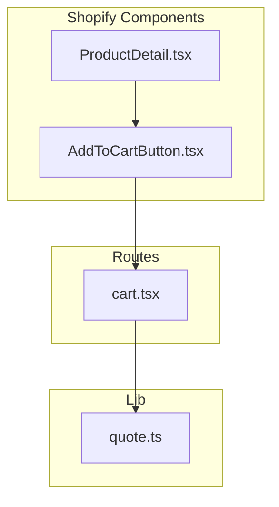
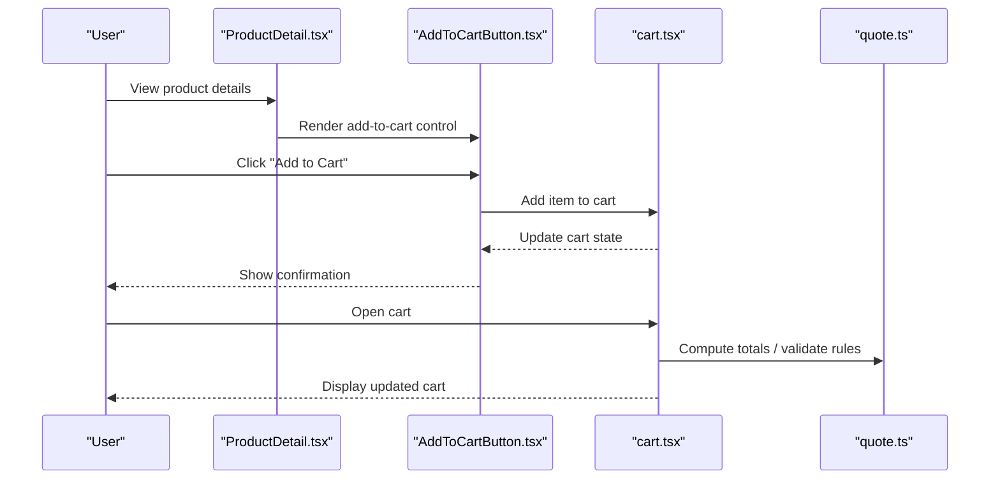
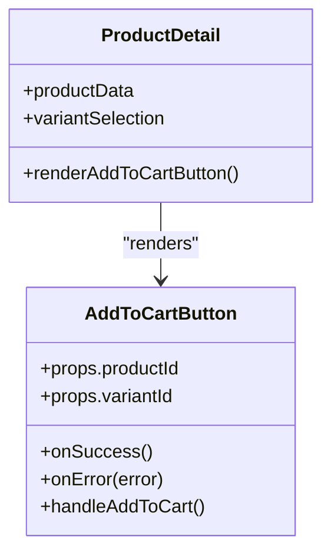
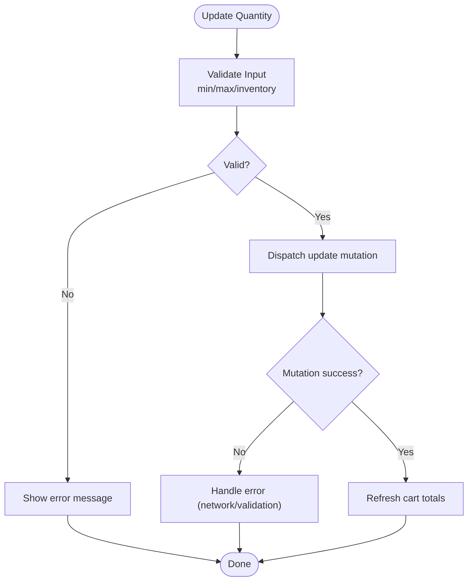
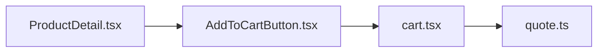

# Cart Operations & Item Management

<cite>
**Referenced Files in This Document**
- [AddToCartButton.tsx](file://src/components/shopify/AddToCartButton.tsx)
- [ProductDetail.tsx](file://src/components/shopify/ProductDetail.tsx)
- [cart.tsx](file://src/routes/cart.tsx)
- [quote.ts](file://src/lib/quote.ts)
</cite>

## Table of Contents
1. [Introduction](#introduction)
2. [Project Structure](#project-structure)
3. [Core Components](#core-components)
4. [Architecture Overview](#architecture-overview)
5. [Detailed Component Analysis](#detailed-component-analysis)
6. [Dependency Analysis](#dependency-analysis)
7. [Performance Considerations](#performance-considerations)
8. [Troubleshooting Guide](#troubleshooting-guide)
9. [Conclusion](#conclusion)
10. [Appendices](#appendices)

## Introduction
This document explains cart operations and item management with a focus on adding items to the cart, updating quantities, removing items, and validating cart rules such as inventory availability. It also documents the AddToCartButton component implementation, quantity adjustment logic, price calculations including taxes and discounts, and integration points with product detail pages. Concrete examples reference actual code paths for implementing custom cart operations, validating stock, and handling errors.

## Project Structure
The cart-related functionality is implemented across UI components and routes:
- Add-to-cart interaction is provided by a reusable button component.
- Product details page integrates add-to-cart actions and displays product information.
- The cart route renders the current cart contents and supports item manipulation.
- A quote utility module provides related business logic that may be used alongside cart flows.

**Diagram sources**
- [AddToCartButton.tsx](file://src/components/shopify/AddToCartButton.tsx)
- [ProductDetail.tsx](file://src/components/shopify/ProductDetail.tsx)
- [cart.tsx](file://src/routes/cart.tsx)
- [quote.ts](file://src/lib/quote.ts)

**Section sources**
- [AddToCartButton.tsx](file://src/components/shopify/AddToCartButton.tsx)
- [ProductDetail.tsx](file://src/components/shopify/ProductDetail.tsx)
- [cart.tsx](file://src/routes/cart.tsx)
- [quote.ts](file://src/lib/quote.ts)

## Core Components
- AddToCartButton: Encapsulates the user action to add an item to the cart. It typically receives product identifiers and variant selection, then triggers the add operation and updates UI state accordingly.
- ProductDetail: Displays product information and exposes controls (including AddToCartButton) to initiate cart modifications from the product page.
- Cart Route: Renders the cart, lists line items, and provides controls to update quantities or remove items. It may also compute totals and apply taxes/discounts.
- Quote Utility: Provides helper functions for quote-related operations; can be integrated into cart workflows where applicable.

Key responsibilities:
- AddToCartButton: Validate inputs, call add-to-cart API/state, handle success/error feedback.
- ProductDetail: Bind product data to AddToCartButton and manage local UI state for selections.
- Cart Route: Fetch cart state, render line items, dispatch update/remove operations, and calculate totals.
- Quote Utility: Offer shared logic reused by cart and quote flows.

**Section sources**
- [AddToCartButton.tsx](file://src/components/shopify/AddToCartButton.tsx)
- [ProductDetail.tsx](file://src/components/shopify/ProductDetail.tsx)
- [cart.tsx](file://src/routes/cart.tsx)
- [quote.ts](file://src/lib/quote.ts)

## Architecture Overview
The cart flow connects product discovery to cart management:
- Users interact with AddToCartButton on ProductDetail.
- The button invokes cart mutation (add item).
- The cart route reflects changes and allows further manipulations (update quantity, remove).
- Totals are computed based on line items, taxes, and discounts.

**Diagram sources**
- [ProductDetail.tsx](file://src/components/shopify/ProductDetail.tsx)
- [AddToCartButton.tsx](file://src/components/shopify/AddToCartButton.tsx)
- [cart.tsx](file://src/routes/cart.tsx)
- [quote.ts](file://src/lib/quote.ts)

## Detailed Component Analysis

### AddToCartButton Implementation
Responsibilities:
- Accepts product and variant identifiers.
- Validates required fields before submission.
- Invokes add-to-cart operation and handles success/error states.
- Updates UI feedback (e.g., loading indicator, toast messages).

Common patterns:
- Controlled inputs for variant selection.
- Optimistic UI updates followed by server confirmation.
- Error boundaries around network calls.

Integration points:
- Consumed by ProductDetail to attach product context.
- Communicates with cart state via the cart route or shared store.

**Section sources**
- [AddToCartButton.tsx](file://src/components/shopify/AddToCartButton.tsx)
- [ProductDetail.tsx](file://src/components/shopify/ProductDetail.tsx)

#### Class Diagram

**Diagram sources**
- [AddToCartButton.tsx](file://src/components/shopify/AddToCartButton.tsx)
- [ProductDetail.tsx](file://src/components/shopify/ProductDetail.tsx)

### Quantity Adjustment Logic
Behavior:
- Increase/decrease quantity with minimum and maximum constraints.
- Prevent exceeding available inventory.
- Debounce rapid updates to reduce unnecessary mutations.

Validation rules:
- Minimum order quantity enforcement.
- Maximum per-order limits.
- Inventory checks against stock levels.

Error scenarios:
- Insufficient stock.
- Invalid quantity input (non-positive, non-integer).
- Network failures during update.

**Section sources**
- [cart.tsx](file://src/routes/cart.tsx)

#### Flowchart: Quantity Update

**Diagram sources**
- [cart.tsx](file://src/routes/cart.tsx)

### Price Calculations Including Taxes and Discounts
Calculation steps:
- Sum line item subtotals (price × quantity).
- Apply discount rules (percentage or fixed amount).
- Compute tax based on configured rates and jurisdiction.
- Derive final total after discounts and taxes.

Edge cases:
- Rounding behavior at each step.
- Handling zero or negative discounts.
- Tax exemptions and overrides.

**Section sources**
- [cart.tsx](file://src/routes/cart.tsx)
- [quote.ts](file://src/lib/quote.ts)

### Cart Validation Rules
Rules commonly enforced:
- Inventory availability per variant.
- Minimum and maximum order quantities.
- Product eligibility (active, published).
- Regional restrictions or shipping constraints.

Implementation approach:
- Pre-mutation validation on client side for UX.
- Post-mutation validation on server side for correctness.
- Centralized validation utilities to avoid duplication.

**Section sources**
- [cart.tsx](file://src/routes/cart.tsx)
- [quote.ts](file://src/lib/quote.ts)

### Integration With Product Detail Pages
Patterns:
- ProductDetail passes product and selected variant to AddToCartButton.
- AddToCartButton triggers add-to-cart and reports back status.
- Cart route listens for state changes and re-renders totals.

Best practices:
- Keep product data immutable when passed down.
- Use optimistic updates with rollback on failure.
- Provide clear user feedback for all outcomes.

**Section sources**
- [ProductDetail.tsx](file://src/components/shopify/ProductDetail.tsx)
- [AddToCartButton.tsx](file://src/components/shopify/AddToCartButton.tsx)
- [cart.tsx](file://src/routes/cart.tsx)

### Custom Cart Operations Examples
Examples to implement:
- Add multiple variants in one action (bulk add).
- Merge cart with existing session or account cart.
- Apply promo codes before checkout.
- Persist cart across sessions using local storage or backend.

Reference locations:
- Add-to-cart entry point: [AddToCartButton.tsx](file://src/components/shopify/AddToCartButton.tsx)
- Cart rendering and mutations: [cart.tsx](file://src/routes/cart.tsx)
- Shared utilities: [quote.ts](file://src/lib/quote.ts)

**Section sources**
- [AddToCartButton.tsx](file://src/components/shopify/AddToCartButton.tsx)
- [cart.tsx](file://src/routes/cart.tsx)
- [quote.ts](file://src/lib/quote.ts)

### Error Scenarios and Handling
Common errors:
- Network timeouts or failures.
- Validation errors (stock, min/max).
- Unauthorized or expired sessions.

Handling strategies:
- Graceful fallbacks and retry mechanisms.
- User-friendly messages with actionable guidance.
- Logging and error capture for diagnostics.

**Section sources**
- [cart.tsx](file://src/routes/cart.tsx)

## Dependency Analysis
Relationships between key files:
- ProductDetail depends on AddToCartButton to trigger cart mutations.
- AddToCartButton interacts with cart state managed by the cart route.
- Cart route may use quote utilities for calculations and validations.

**Diagram sources**
- [ProductDetail.tsx](file://src/components/shopify/ProductDetail.tsx)
- [AddToCartButton.tsx](file://src/components/shopify/AddToCartButton.tsx)
- [cart.tsx](file://src/routes/cart.tsx)
- [quote.ts](file://src/lib/quote.ts)

**Section sources**
- [ProductDetail.tsx](file://src/components/shopify/ProductDetail.tsx)
- [AddToCartButton.tsx](file://src/components/shopify/AddToCartButton.tsx)
- [cart.tsx](file://src/routes/cart.tsx)
- [quote.ts](file://src/lib/quote.ts)

## Performance Considerations
- Debounce quantity updates to minimize mutations.
- Use optimistic UI updates to improve perceived performance.
- Cache product data and cart summaries where appropriate.
- Avoid recalculating totals unless necessary; memoize derived values.
- Batch operations when supporting bulk adds.

[No sources needed since this section provides general guidance]

## Troubleshooting Guide
Symptoms and resolutions:
- Add-to-cart does nothing: Verify props passed to AddToCartButton and ensure product/variant IDs are valid.
- Quantity cannot be increased: Check min/max constraints and inventory availability.
- Totals incorrect: Review discount and tax calculation logic in cart route and quote utility.
- Errors not surfaced: Ensure error handlers are wired and user feedback is displayed.

Diagnostic tips:
- Log mutation payloads and responses.
- Inspect validation rules and thresholds.
- Reproduce with minimal inputs to isolate issues.

**Section sources**
- [AddToCartButton.tsx](file://src/components/shopify/AddToCartButton.tsx)
- [cart.tsx](file://src/routes/cart.tsx)
- [quote.ts](file://src/lib/quote.ts)

## Conclusion
The cart system centers around AddToCartButton for initiating additions, ProductDetail for contextual interactions, and the cart route for managing items and totals. Robust validation, clear error handling, and efficient calculations ensure a reliable shopping experience. Extending functionality—such as bulk operations or advanced promotions—should follow established patterns and leverage shared utilities for consistency.

[No sources needed since this section summarizes without analyzing specific files]

## Appendices

### Quick Reference: Key Files and Roles
- AddToCartButton.tsx: Entry point for adding items to cart.
- ProductDetail.tsx: Integrates add-to-cart with product context.
- cart.tsx: Manages cart state, item manipulation, and totals.
- quote.ts: Shared utilities for calculations and validations.

**Section sources**
- [AddToCartButton.tsx](file://src/components/shopify/AddToCartButton.tsx)
- [ProductDetail.tsx](file://src/components/shopify/ProductDetail.tsx)
- [cart.tsx](file://src/routes/cart.tsx)
- [quote.ts](file://src/lib/quote.ts)