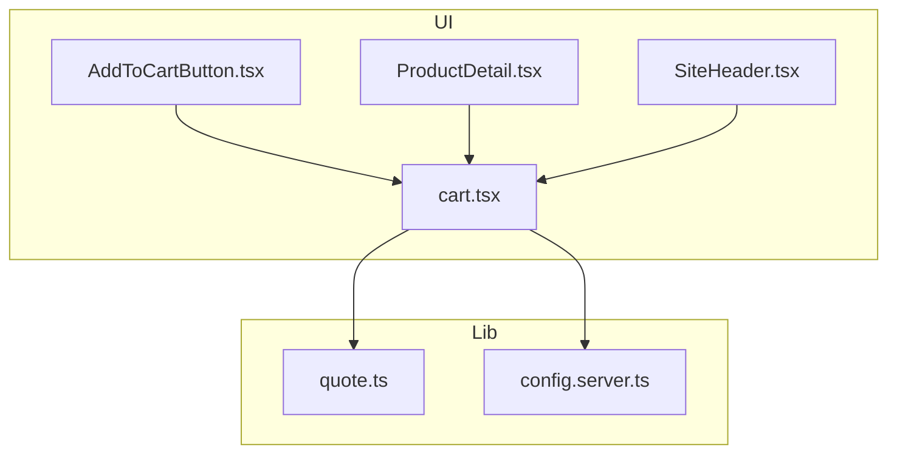
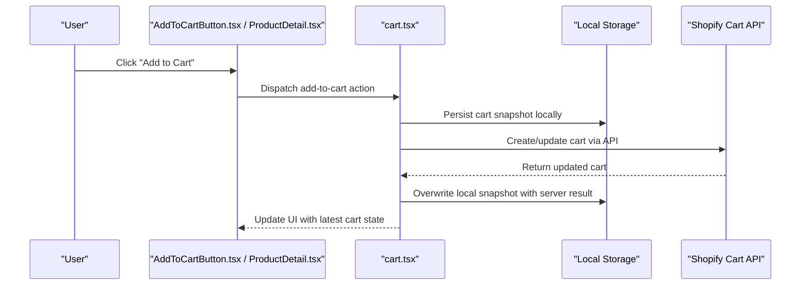
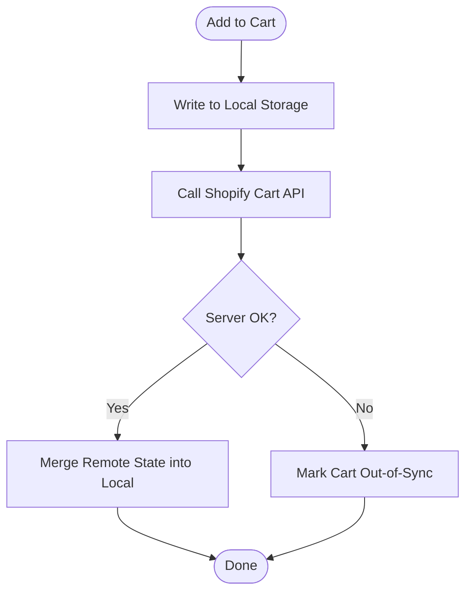
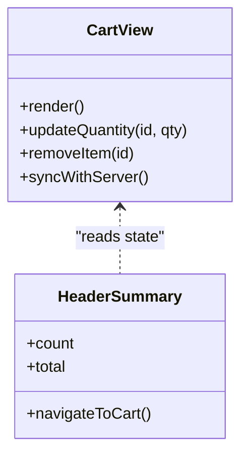
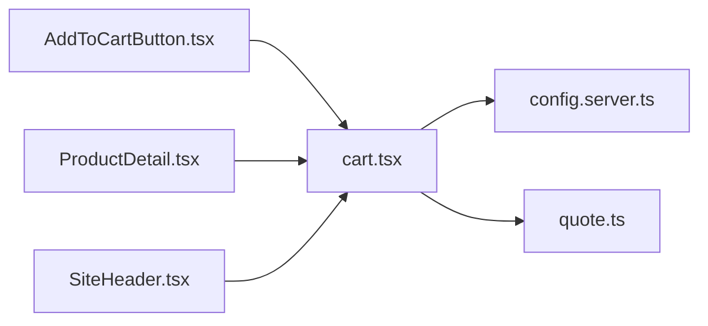

# Cart Persistence & Synchronization

<cite>
**Referenced Files in This Document**
- [cart.tsx](file://src/routes/cart.tsx)
- [AddToCartButton.tsx](file://src/components/shopify/AddToCartButton.tsx)
- [ProductDetail.tsx](file://src/components/shopify/ProductDetail.tsx)
- [SiteHeader.tsx](file://src/components/shopify/SiteHeader.tsx)
- [quote.ts](file://src/lib/quote.ts)
- [config.server.ts](file://src/lib/config.server.ts)
</cite>

## Table of Contents
1. [Introduction](#introduction)
2. [Project Structure](#project-structure)
3. [Core Components](#core-components)
4. [Architecture Overview](#architecture-overview)
5. [Detailed Component Analysis](#detailed-component-analysis)
6. [Dependency Analysis](#dependency-analysis)
7. [Performance Considerations](#performance-considerations)
8. [Troubleshooting Guide](#troubleshooting-guide)
9. [Conclusion](#conclusion)
10. [Appendices](#appendices)

## Introduction
This document explains how cart data is persisted and synchronized in the application, focusing on local storage mechanisms, server-side integration points, and strategies for handling offline scenarios, conflicts, backups, restores, migrations, and expiration policies. It also provides performance guidance for large carts and optimization techniques for loading and updates.

## Project Structure
The cart-related functionality spans a few key files:
- Route-level cart view
- UI components that add items to the cart
- Header component that displays cart state
- Quote utilities that may interact with cart-like structures
- Server configuration used by Shopify integrations

**Diagram sources**
- [cart.tsx](file://src/routes/cart.tsx)
- [AddToCartButton.tsx](file://src/components/shopify/AddToCartButton.tsx)
- [ProductDetail.tsx](file://src/components/shopify/ProductDetail.tsx)
- [SiteHeader.tsx](file://src/components/shopify/SiteHeader.tsx)
- [quote.ts](file://src/lib/quote.ts)
- [config.server.ts](file://src/lib/config.server.ts)

**Section sources**
- [cart.tsx](file://src/routes/cart.tsx)
- [AddToCartButton.tsx](file://src/components/shopify/AddToCartButton.tsx)
- [ProductDetail.tsx](file://src/components/shopify/ProductDetail.tsx)
- [SiteHeader.tsx](file://src/components/shopify/SiteHeader.tsx)
- [quote.ts](file://src/lib/quote.ts)
- [config.server.ts](file://src/lib/config.server.ts)

## Core Components
- Add-to-cart actions originate from product UI components and update the cart state.
- The cart route renders the current cart contents and orchestrates interactions with Shopify APIs.
- The header shows cart summary and can trigger navigation or actions related to the cart.
- Quote utilities provide shared logic that may be reused when building quotes from cart data.
- Server configuration centralizes Shopify settings used across API calls.

Key responsibilities:
- Local persistence: store cart snapshot locally (e.g., localStorage) to support offline viewing and quick load.
- Sync with server: push/pull changes to/from Shopify’s cart API when online.
- Conflict resolution: decide whether to keep local or remote version based on timestamps or explicit user choice.
- Offline handling: allow browsing and editing while offline; queue mutations until connectivity resumes.
- Backup and restore: export/import cart payloads for migration between devices or sessions.
- Expiration policy: define TTL for local cart entries and prune stale items.

**Section sources**
- [AddToCartButton.tsx](file://src/components/shopify/AddToCartButton.tsx)
- [ProductDetail.tsx](file://src/components/shopify/ProductDetail.tsx)
- [SiteHeader.tsx](file://src/components/shopify/SiteHeader.tsx)
- [cart.tsx](file://src/routes/cart.tsx)
- [quote.ts](file://src/lib/quote.ts)
- [config.server.ts](file://src/lib/config.server.ts)

## Architecture Overview
High-level flow for adding an item to the cart and syncing it with Shopify:

**Diagram sources**
- [AddToCartButton.tsx](file://src/components/shopify/AddToCartButton.tsx)
- [ProductDetail.tsx](file://src/components/shopify/ProductDetail.tsx)
- [cart.tsx](file://src/routes/cart.tsx)
- [config.server.ts](file://src/lib/config.server.ts)

## Detailed Component Analysis

### Add-to-Cart Flow
- Entry points:
  - Product card/detail pages initiate add-to-cart actions.
  - The cart route coordinates state updates and synchronization.
- Local persistence:
  - On successful mutation, persist a serialized cart snapshot to local storage for fast rehydration.
- Server sync:
  - After local write, call Shopify’s cart API to create or update the cart.
  - On success, overwrite local snapshot with server response to ensure consistency.
- Error handling:
  - If server call fails, retain local snapshot and mark cart as out-of-sync.
  - Retry strategy: exponential backoff with jitter; retry on reconnect.

**Diagram sources**
- [AddToCartButton.tsx](file://src/components/shopify/AddToCartButton.tsx)
- [ProductDetail.tsx](file://src/components/shopify/ProductDetail.tsx)
- [cart.tsx](file://src/routes/cart.tsx)
- [config.server.ts](file://src/lib/config.server.ts)

**Section sources**
- [AddToCartButton.tsx](file://src/components/shopify/AddToCartButton.tsx)
- [ProductDetail.tsx](file://src/components/shopify/ProductDetail.tsx)
- [cart.tsx](file://src/routes/cart.tsx)
- [config.server.ts](file://src/lib/config.server.ts)

### Cart View and Summary
- The cart route renders the current cart and exposes operations like quantity change and removal.
- The header shows a summary and navigates to the cart route.
- Both components should read from the same source of truth (local snapshot if available, otherwise fetch from server).

**Diagram sources**
- [cart.tsx](file://src/routes/cart.tsx)
- [SiteHeader.tsx](file://src/components/shopify/SiteHeader.tsx)

**Section sources**
- [cart.tsx](file://src/routes/cart.tsx)
- [SiteHeader.tsx](file://src/components/shopify/SiteHeader.tsx)

### Quote Integration
- Quote utilities may build quote objects from cart data, enabling conversion of cart to quote workflows.
- Ensure consistent serialization formats between cart and quote modules to simplify migration and backup.

**Section sources**
- [quote.ts](file://src/lib/quote.ts)

## Dependency Analysis
- UI components depend on the cart route for state and actions.
- The cart route depends on server configuration for Shopify endpoints and credentials.
- Quote utilities are independent but may consume cart-derived data.

**Diagram sources**
- [AddToCartButton.tsx](file://src/components/shopify/AddToCartButton.tsx)
- [ProductDetail.tsx](file://src/components/shopify/ProductDetail.tsx)
- [SiteHeader.tsx](file://src/components/shopify/SiteHeader.tsx)
- [cart.tsx](file://src/routes/cart.tsx)
- [config.server.ts](file://src/lib/config.server.ts)
- [quote.ts](file://src/lib/quote.ts)

**Section sources**
- [AddToCartButton.tsx](file://src/components/shopify/AddToCartButton.tsx)
- [ProductDetail.tsx](file://src/components/shopify/ProductDetail.tsx)
- [SiteHeader.tsx](file://src/components/shopify/SiteHeader.tsx)
- [cart.tsx](file://src/routes/cart.tsx)
- [config.server.ts](file://src/lib/config.server.ts)
- [quote.ts](file://src/lib/quote.ts)

## Performance Considerations
- Batch updates: coalesce multiple add/remove operations within a short window before writing to local storage and calling the server.
- Debounced persistence: avoid excessive writes by debouncing local storage updates.
- Lazy rendering: render only visible cart items; virtualize long lists if needed.
- Selective hydration: on app start, hydrate minimal fields (id, title, price, quantity) and fetch full details on demand.
- Cache invalidation: invalidate cached cart data after mutations and background refreshes.
- Network efficiency: use idempotent requests and conditional updates to reduce payload size.

[No sources needed since this section provides general guidance]

## Troubleshooting Guide
Common issues and resolutions:
- Stale cart state:
  - Ensure local snapshot is overwritten after successful server responses.
  - Implement a background sync job to reconcile differences periodically.
- Duplicate items:
  - Normalize cart keys (variant ID) and merge quantities instead of appending duplicates.
- Offline errors:
  - Queue mutations and replay them when connectivity returns.
  - Show clear indicators when cart is out-of-sync.
- Serialization mismatches:
  - Keep a stable schema version and migrate old formats gracefully.
- Large cart performance:
  - Paginate or limit displayed items; defer heavy computations.

**Section sources**
- [cart.tsx](file://src/routes/cart.tsx)
- [config.server.ts](file://src/lib/config.server.ts)

## Conclusion
A robust cart system combines reliable local persistence with resilient server synchronization. By serializing cart snapshots, implementing conflict resolution, supporting offline queues, and providing backup/restore and migration tools, the application ensures continuity and consistency across sessions and devices. Performance optimizations such as batching, debouncing, and lazy loading further improve responsiveness for large carts.

[No sources needed since this section summarizes without analyzing specific files]

## Appendices

### Data Model and Serialization
- Recommended fields per line item: variant ID, quantity, selected options, price, metadata.
- Include a timestamp and version tag for conflict resolution and migration.
- Use deterministic ordering for arrays to simplify diffs and merges.

[No sources needed since this section provides general guidance]

### Conflict Resolution Strategy
- Prefer server version if newer than local by a threshold.
- If both have changes, prompt the user or apply a deterministic merge rule (e.g., sum quantities for identical variants).

[No sources needed since this section provides general guidance]

### Offline Cart Handling
- Maintain a queue of pending mutations with IDs and timestamps.
- Replay queue on reconnect; deduplicate and resolve conflicts using the strategy above.

[No sources needed since this section provides general guidance]

### Backup and Restore
- Export: serialize the entire cart snapshot to JSON for download or copy.
- Import: validate schema, merge with existing cart, and prompt for conflict resolution if needed.

[No sources needed since this section provides general guidance]

### Device Migration
- Provide a one-time import wizard to merge carts from another device.
- Preserve user selections and notes where applicable.

[No sources needed since this section provides general guidance]

### Expiration Policies
- Define TTL for local cart entries (e.g., 30 days).
- Prune expired items on load and notify users about removed products.

[No sources needed since this section provides general guidance]