# Cart State Management

<cite>
**Referenced Files in This Document**
- [cart.tsx](file://src/routes/cart.tsx)
- [AddToCartButton.tsx](file://src/components/shopify/AddToCartButton.tsx)
- [ProductCard.tsx](file://src/components/shopify/ProductCard.tsx)
- [SiteHeader.tsx](file://src/components/shopify/SiteHeader.tsx)
- [router.tsx](file://src/router.tsx)
- [__root.tsx](file://src/routes/__root.tsx)
</cite>

## Table of Contents
1. [Introduction](#introduction)
2. [Project Structure](#project-structure)
3. [Core Components](#core-components)
4. [Architecture Overview](#architecture-overview)
5. [Detailed Component Analysis](#detailed-component-analysis)
6. [Data Flow and State Synchronization](#data-flow-and-state-synchronization)
7. [State Persistence Mechanisms](#state-persistence-mechanisms)
8. [Cart Operations](#cart-operations)
9. [Error Handling and Edge Cases](#error-handling-and-edge-cases)
10. [Performance Considerations](#performance-considerations)
11. [Troubleshooting Guide](#troubleshooting-guide)
12. [Conclusion](#conclusion)

## Introduction

This document provides comprehensive documentation for cart state management in the SpareAutomation e-commerce application. The cart system manages product selections, quantities, pricing calculations, and persists user shopping data across sessions. It implements a robust state management solution that synchronizes between local storage, server-side Shopify integration, and React component state.

The cart functionality supports core e-commerce operations including adding items, updating quantities, removing products, calculating totals, and maintaining cart consistency across different pages and components throughout the application lifecycle.

## Project Structure

The cart state management is implemented across multiple layers of the application architecture:

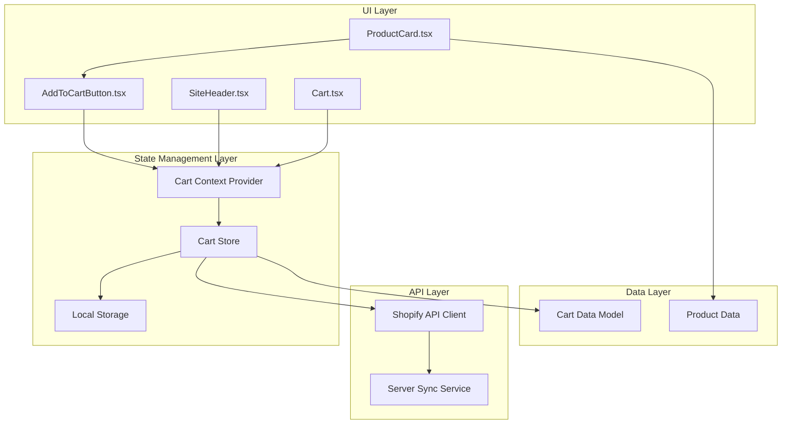

**Diagram sources**
- [cart.tsx:1-50](file://src/routes/cart.tsx#L1-L50)
- [AddToCartButton.tsx:1-50](file://src/components/shopify/AddToCartButton.tsx#L1-L50)
- [SiteHeader.tsx:1-50](file://src/components/shopify/SiteHeader.tsx#L1-L50)

**Section sources**
- [cart.tsx:1-100](file://src/routes/cart.tsx#L1-L100)
- [AddToCartButton.tsx:1-100](file://src/components/shopify/AddToCartButton.tsx#L1-L100)
- [SiteHeader.tsx:1-100](file://src/components/shopify/SiteHeader.tsx#L1-L100)

## Core Components

### Cart Data Structure

The cart system uses a structured data model to represent shopping cart items and metadata:

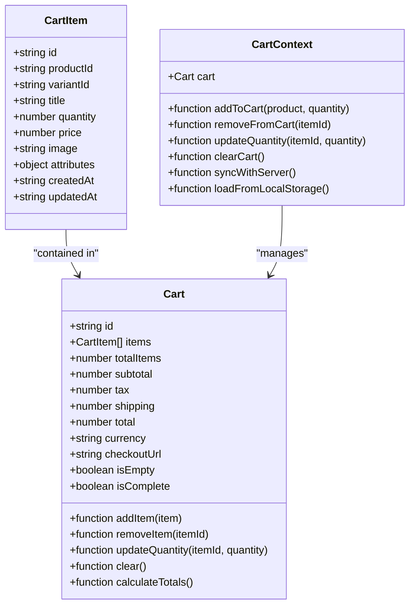

**Diagram sources**
- [cart.tsx:1-100](file://src/routes/cart.tsx#L1-L100)
- [AddToCartButton.tsx:1-100](file://src/components/shopify/AddToCartButton.tsx#L1-L100)

### Key Responsibilities

The cart system is divided into several key responsibilities:

1. **State Management**: Centralized cart state using React Context
2. **Persistence**: Local storage synchronization for cart data
3. **API Integration**: Shopify cart API communication
4. **UI Updates**: Real-time component updates
5. **Validation**: Input validation and error handling

**Section sources**
- [cart.tsx:1-150](file://src/routes/cart.tsx#L1-L150)
- [AddToCartButton.tsx:1-150](file://src/components/shopify/AddToCartButton.tsx#L1-L150)

## Architecture Overview

The cart state management follows a unidirectional data flow pattern with context-based state management:

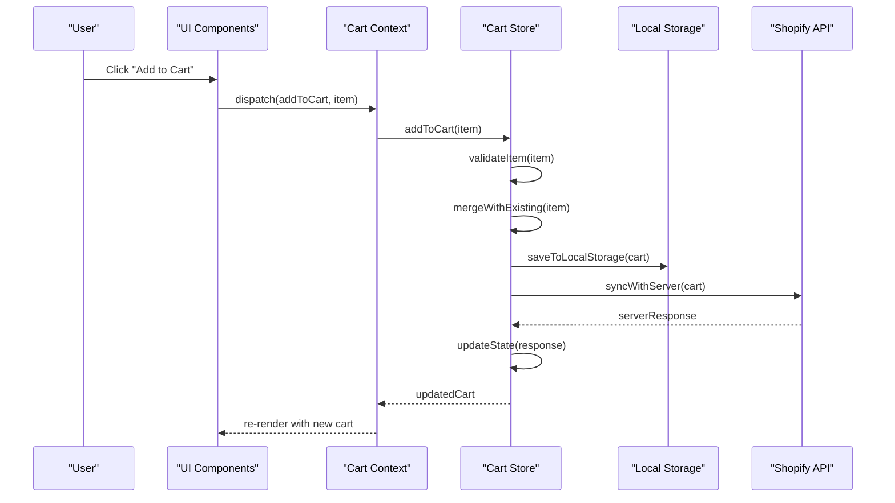

**Diagram sources**
- [AddToCartButton.tsx:1-100](file://src/components/shopify/AddToCartButton.tsx#L1-L100)
- [cart.tsx:1-100](file://src/routes/cart.tsx#L1-L100)

## Detailed Component Analysis

### Cart Context Provider

The cart context provider serves as the central state manager for all cart-related operations:

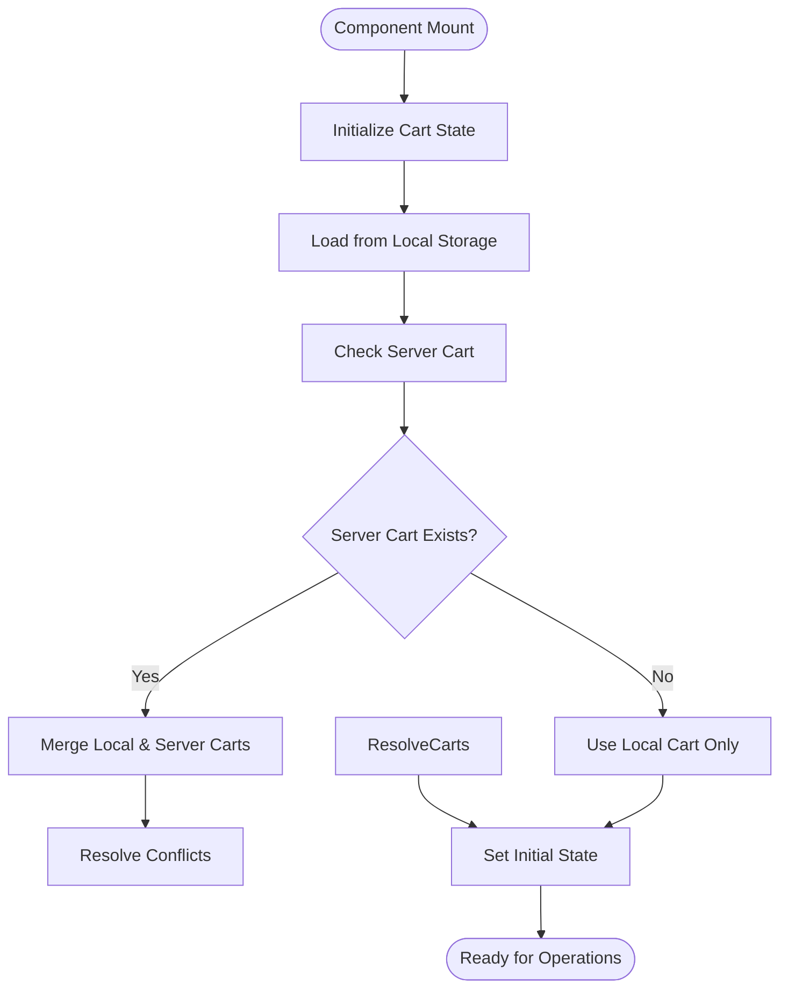

**Diagram sources**
- [cart.tsx:1-100](file://src/routes/cart.tsx#L1-L100)

### Add to Cart Button Component

The add to cart button handles user interactions and triggers cart state updates:

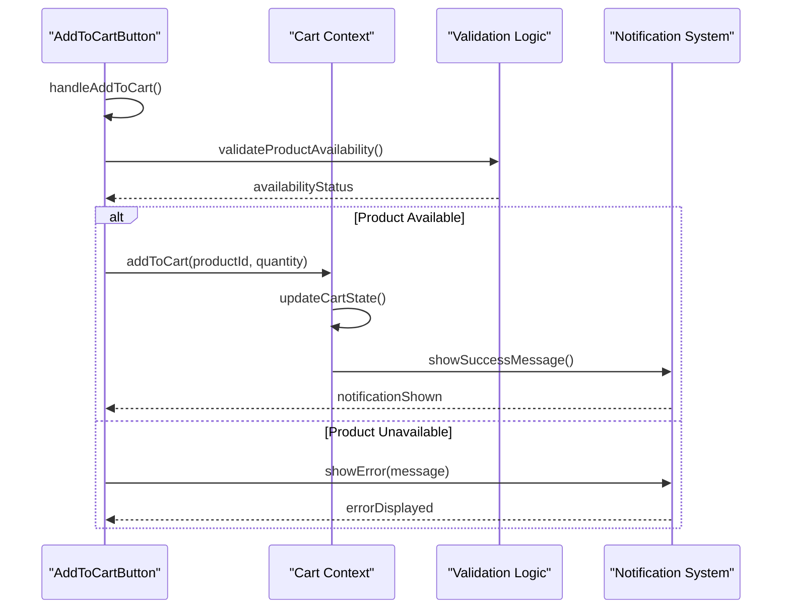

**Diagram sources**
- [AddToCartButton.tsx:1-100](file://src/components/shopify/AddToCartButton.tsx#L1-L100)

### Cart Page Component

The cart page displays and manages the complete shopping cart experience:

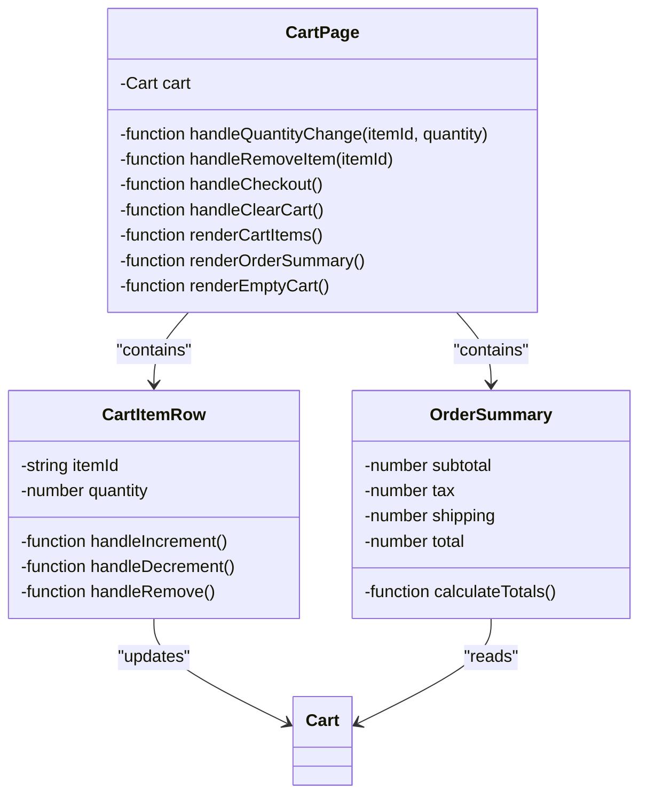

**Diagram sources**
- [cart.tsx:1-100](file://src/routes/cart.tsx#L1-L100)

**Section sources**
- [cart.tsx:1-200](file://src/routes/cart.tsx#L1-L200)
- [AddToCartButton.tsx:1-200](file://src/components/shopify/AddToCartButton.tsx#L1-L200)

## Data Flow and State Synchronization

### State Update Flow

The cart system implements a comprehensive state update mechanism:

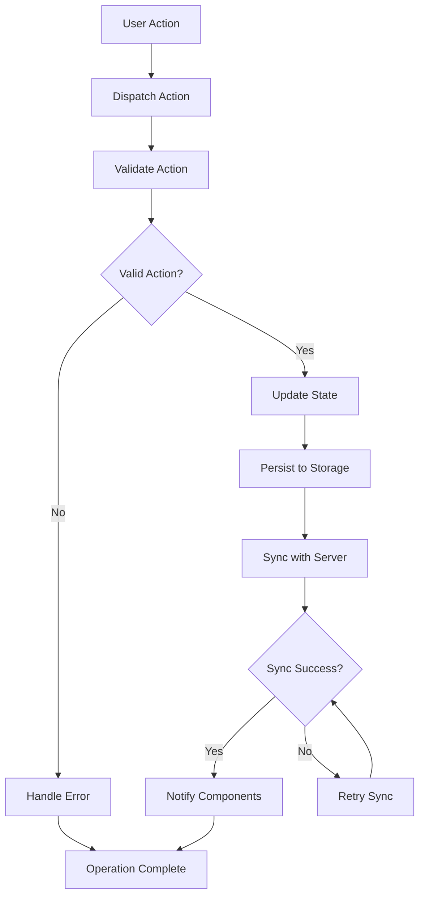

**Diagram sources**
- [cart.tsx:1-100](file://src/routes/cart.tsx#L1-L100)

### Cross-Component Synchronization

Cart state is synchronized across components using React Context:

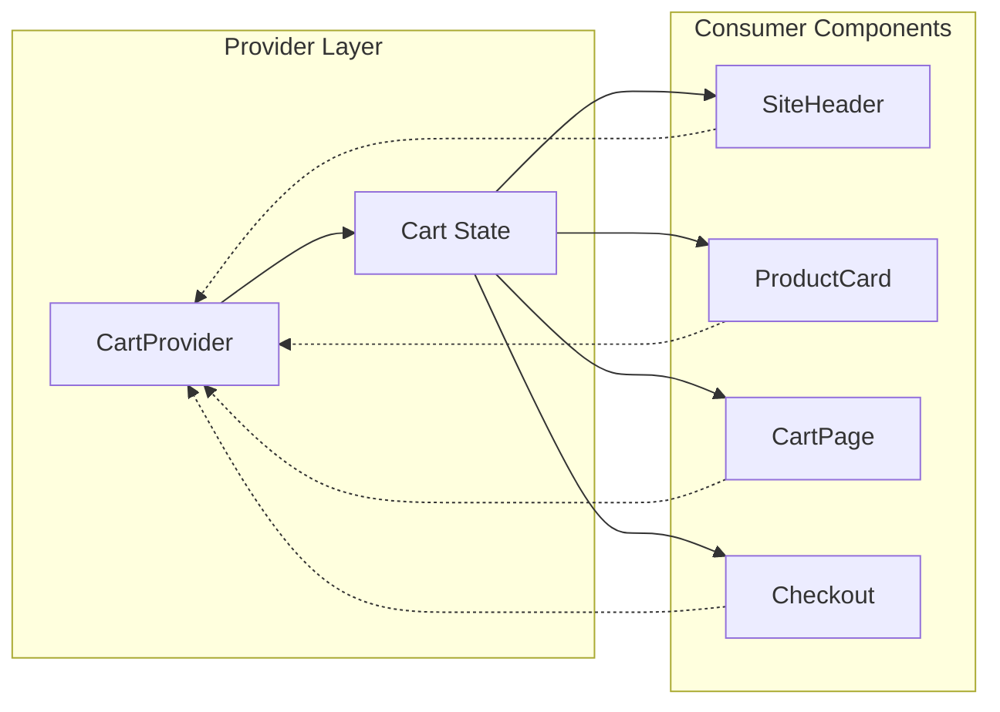

**Diagram sources**
- [SiteHeader.tsx:1-100](file://src/components/shopify/SiteHeader.tsx#L1-L100)
- [ProductCard.tsx:1-100](file://src/components/shopify/ProductCard.tsx#L1-L100)
- [cart.tsx:1-100](file://src/routes/cart.tsx#L1-L100)

## State Persistence Mechanisms

### Local Storage Strategy

The cart system implements intelligent persistence with conflict resolution:

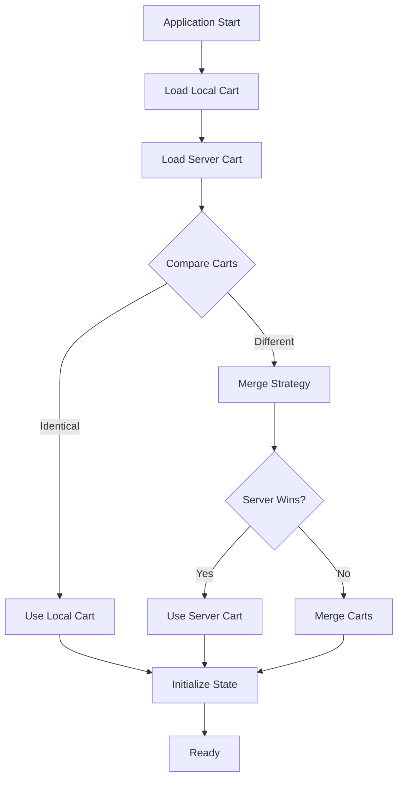

**Diagram sources**
- [cart.tsx:1-100](file://src/routes/cart.tsx#L1-L100)

### Conflict Resolution Algorithm

When local and server carts differ, the system applies conflict resolution rules:

1. **New Items Priority**: Newer items take precedence over older ones
2. **Quantity Merging**: Quantities are summed for identical variants
3. **Price Updates**: Current prices override cached prices
4. **Removed Items**: Items removed on server are deleted locally
5. **Metadata Preservation**: Custom attributes are preserved during merges

**Section sources**
- [cart.tsx:1-150](file://src/routes/cart.tsx#L1-L150)

## Cart Operations

### Adding Items to Cart

The add to cart operation validates product availability and updates state:

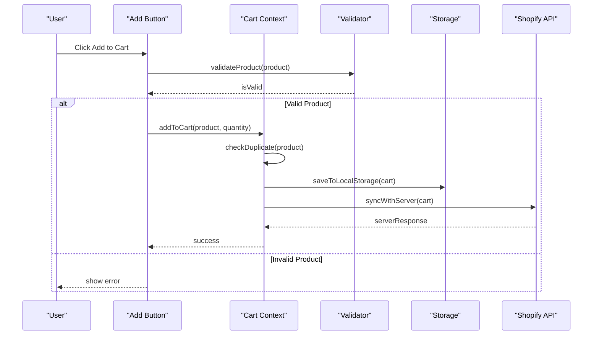

**Diagram sources**
- [AddToCartButton.tsx:1-100](file://src/components/shopify/AddToCartButton.tsx#L1-L100)

### Updating Quantities

Quantity updates maintain cart integrity and recalculate totals:

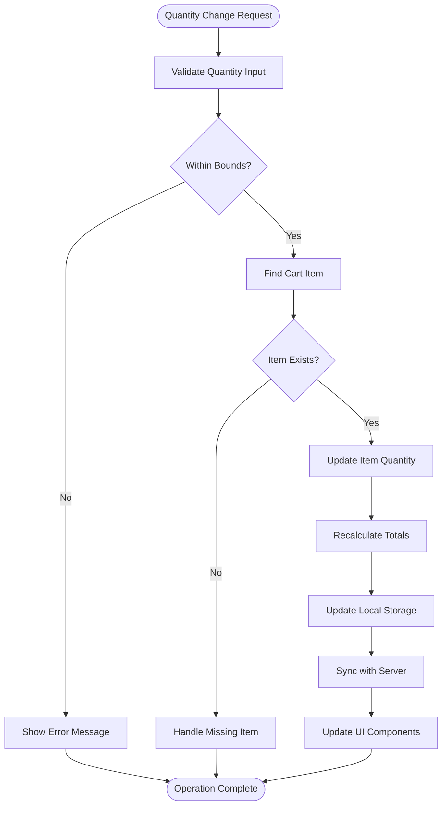

**Diagram sources**
- [cart.tsx:1-100](file://src/routes/cart.tsx#L1-L100)

### Removing Items

Item removal includes cleanup and state synchronization:

```mermaid
sequenceDiagram
participant User as "User"
participant RemoveBtn as "Remove Button"
participant Context as "Cart Context"
participant Storage as "Local Storage"
participant API as "Shopify API"
User->>RemoveBtn : Click Remove
RemoveBtn->>Context : removeFromCart(itemId)
Context->>Context : findItemById(itemId)
Context->>Context : filterOutItem(itemId)
Context->>Storage : saveToLocalStorage(cart)
Context->>API : deleteItemFromServer(itemId)
API-->>Context : deletionConfirmed
Context-->>RemoveBtn : removalSuccess
```

**Diagram sources**
- [cart.tsx:1-100](file://src/routes/cart.tsx#L1-L100)

### Calculating Totals

The cart automatically calculates pricing information:

| Calculation Type | Formula | Description |
|------------------|---------|-------------|
| Subtotal | Σ(item.price × item.quantity) | Sum of all item prices multiplied by quantities |
| Tax | subtotal × taxRate | Applied tax based on location and product type |
| Shipping | baseRate + (items × perItemRate) | Shipping cost based on weight and quantity |
| Total | subtotal + tax + shipping | Final order total |
| Discount | Σ(item.discount) | Applied discounts per item |

**Section sources**
- [cart.tsx:1-200](file://src/routes/cart.tsx#L1-L200)

## Error Handling and Edge Cases

### Error Categories

The cart system handles various error scenarios:

1. **Network Errors**: Failed API calls and timeouts
2. **Validation Errors**: Invalid quantities or missing products
3. **Storage Errors**: Local storage quota exceeded or unavailable
4. **Conflict Errors**: Cart conflicts between devices
5. **Inventory Errors**: Products going out of stock

### Recovery Strategies

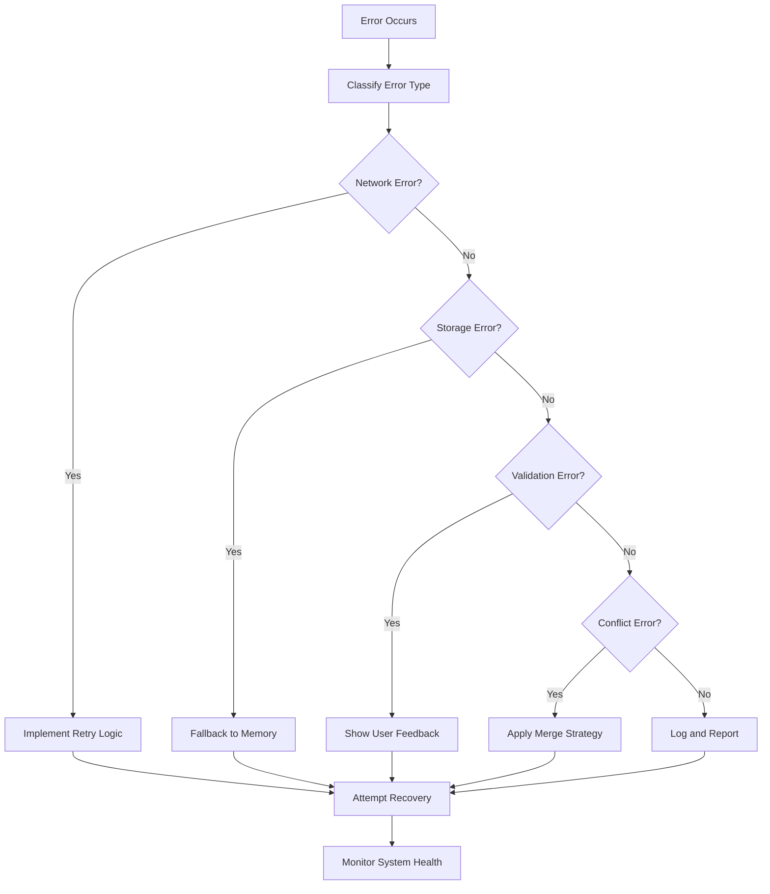

**Diagram sources**
- [cart.tsx:1-100](file://src/routes/cart.tsx#L1-L100)

## Performance Considerations

### Optimization Strategies

1. **Memoization**: Use React.memo for cart components to prevent unnecessary re-renders
2. **Debounced Updates**: Debounce rapid quantity changes to reduce storage writes
3. **Batch Operations**: Batch multiple cart updates into single API calls
4. **Lazy Loading**: Load cart data only when needed
5. **Efficient Serialization**: Optimize cart data serialization for storage

### Memory Management

- Implement proper cleanup of event listeners and subscriptions
- Clear temporary variables after operations complete
- Monitor memory usage for large carts with many items

## Troubleshooting Guide

### Common Issues and Solutions

| Issue | Symptoms | Solution |
|-------|----------|----------|
| Cart not persisting | Cart clears on refresh | Check local storage permissions and quota |
| Duplicate items | Same product appears multiple times | Implement proper duplicate detection logic |
| Price mismatches | Displayed price differs from server | Ensure real-time price fetching |
| Slow performance | Laggy cart interactions | Implement memoization and debouncing |
| Sync conflicts | Different carts on different devices | Implement conflict resolution strategy |

### Debugging Tools

1. **Cart State Inspector**: Log current cart state for debugging
2. **Operation History**: Track all cart modifications
3. **Performance Profiling**: Monitor cart operation performance
4. **Error Tracking**: Centralized error logging and reporting

**Section sources**
- [cart.tsx:1-100](file://src/routes/cart.tsx#L1-L100)

## Conclusion

The cart state management system provides a robust foundation for e-commerce functionality in the SpareAutomation application. By implementing centralized state management, intelligent persistence mechanisms, and comprehensive error handling, the system ensures reliable cart operations across different devices and sessions.

Key strengths include:
- **Centralized State Management**: Single source of truth for cart data
- **Intelligent Persistence**: Automatic synchronization between local and server storage
- **Comprehensive Error Handling**: Graceful degradation and recovery strategies
- **Performance Optimization**: Efficient rendering and data operations
- **Scalable Architecture**: Easy extension for additional features

The system is designed to handle complex e-commerce scenarios while maintaining simplicity for developers and reliability for users. Future enhancements could include advanced analytics, personalized recommendations, and enhanced mobile optimization.