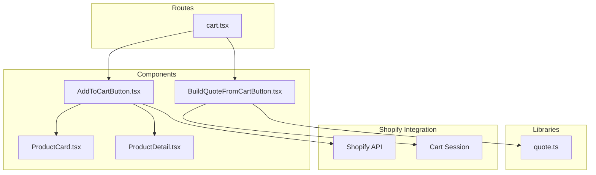
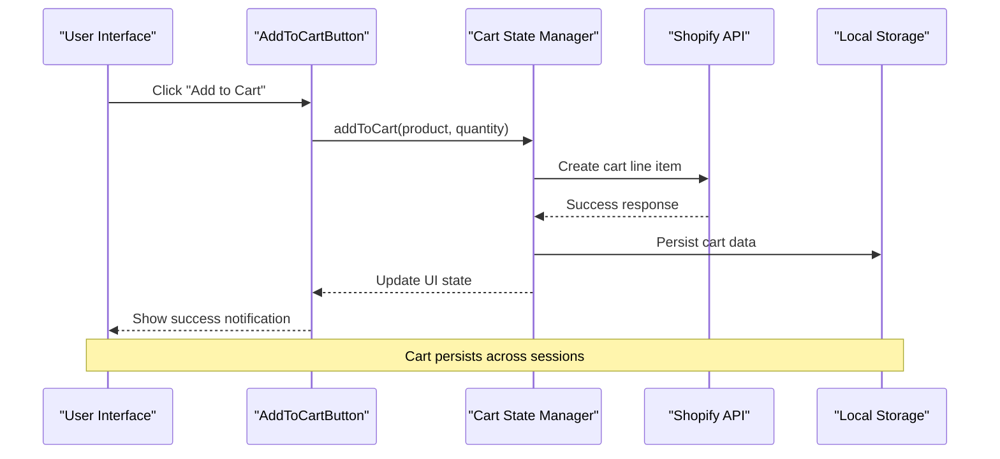
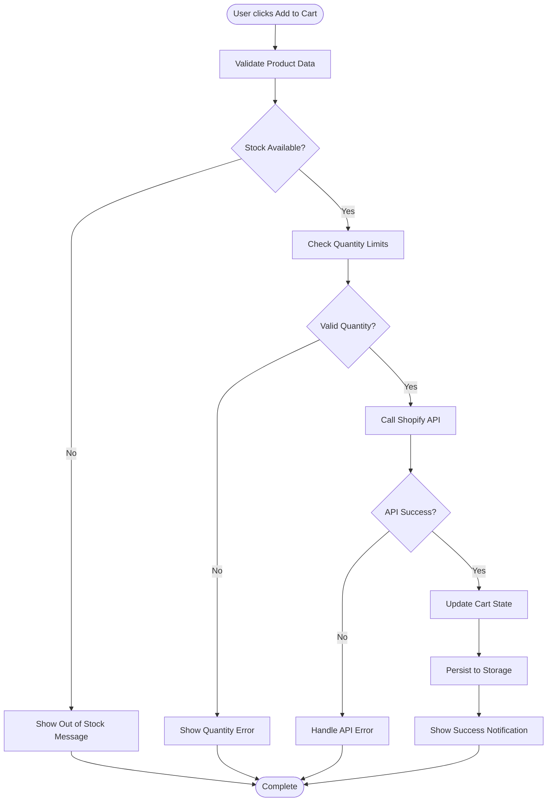
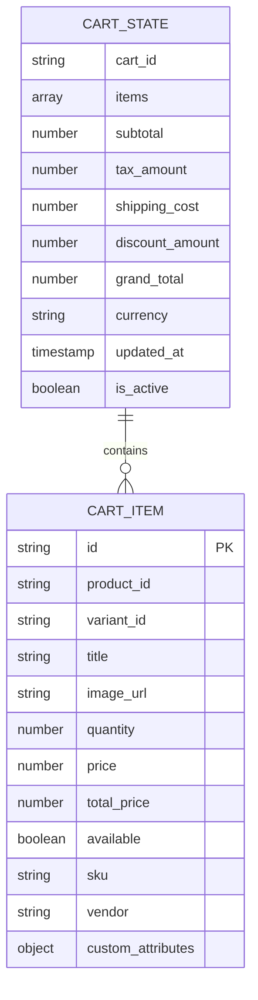
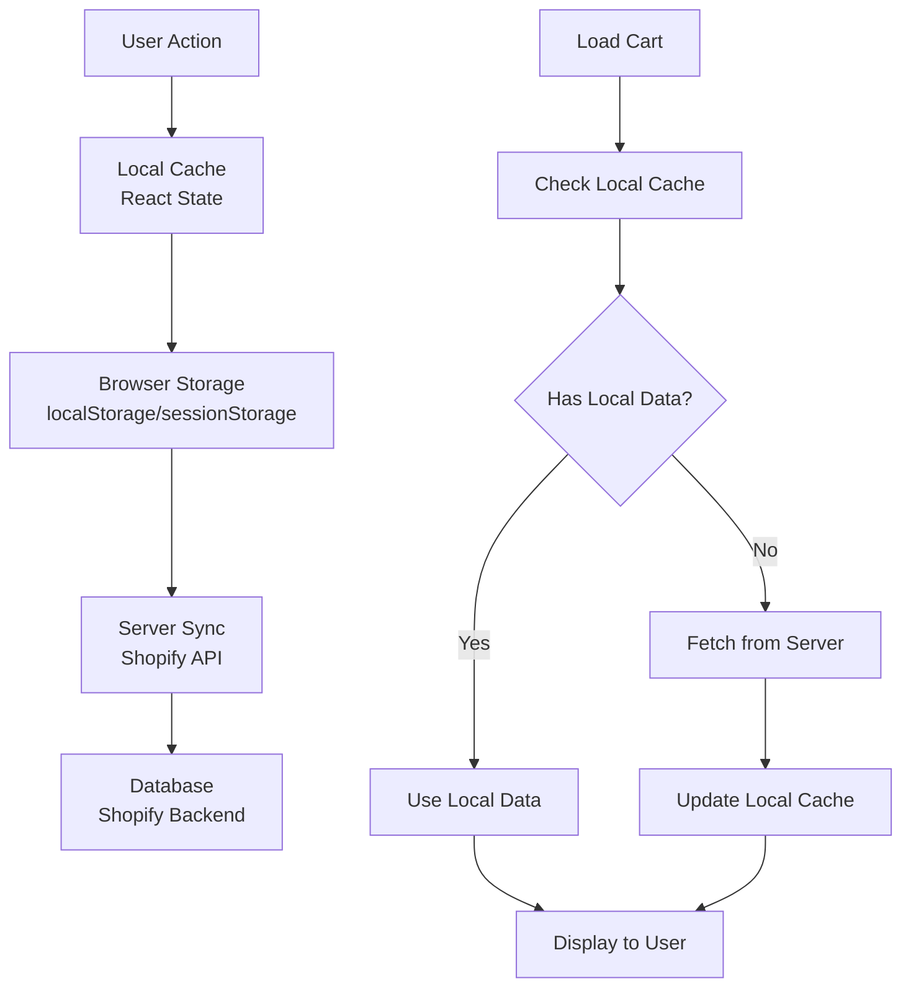
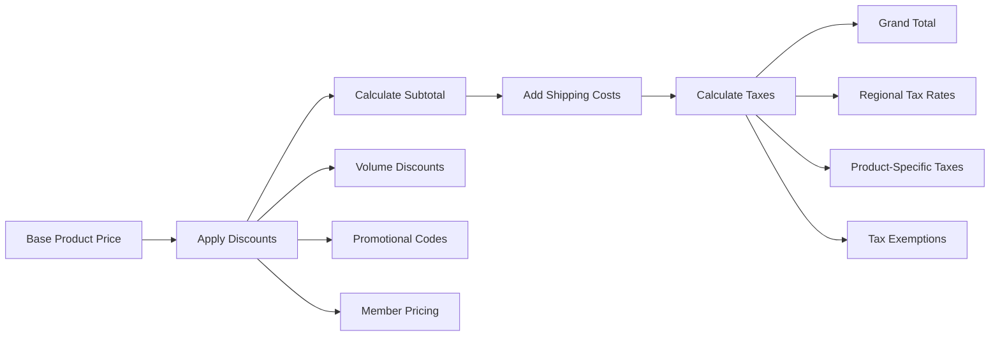

# Shopping Cart System

<cite>
**Referenced Files in This Document**
- [cart.tsx](file://src/routes/cart.tsx)
- [AddToCartButton.tsx](file://src/components/shopify/AddToCartButton.tsx)
- [BuildQuoteFromCartButton.tsx](file://src/components/shopify/BuildQuoteFromCartButton.tsx)
- [quote.ts](file://src/lib/quote.ts)
- [ProductCard.tsx](file://src/components/shopify/ProductCard.tsx)
- [ProductDetail.tsx](file://src/components/shopify/ProductDetail.tsx)
</cite>

## Table of Contents
1. [Introduction](#introduction)
2. [Project Structure](#project-structure)
3. [Core Components](#core-components)
4. [Architecture Overview](#architecture-overview)
5. [Detailed Component Analysis](#detailed-component-analysis)
6. [Data Structures and State Management](#data-structures-and-state-management)
7. [Cart Persistence Mechanisms](#cart-persistence-mechanisms)
8. [Price Calculations and Tax Handling](#price-calculations-and-tax-handling)
9. [Customization and Extension Points](#customization-and-extension-points)
10. [Common Issues and Solutions](#common-issues-and-solutions)
11. [Performance Considerations](#performance-considerations)
12. [Troubleshooting Guide](#troubleshooting-guide)
13. [Conclusion](#conclusion)

## Introduction

The shopping cart system in this Shopify-based application provides a comprehensive e-commerce solution for managing product selections, quantities, pricing, and checkout processes. The system integrates seamlessly with Shopify's API while maintaining local state management for optimal user experience and performance.

This documentation covers the complete cart functionality including state management, persistence mechanisms, item manipulation, price calculations, tax handling, and integration patterns with external systems.

## Project Structure

The shopping cart system is distributed across several key components:

**Diagram sources**
- [cart.tsx](file://src/routes/cart.tsx)
- [AddToCartButton.tsx](file://src/components/shopify/AddToCartButton.tsx)
- [BuildQuoteFromCartButton.tsx](file://src/components/shopify/BuildQuoteFromCartButton.tsx)
- [quote.ts](file://src/lib/quote.ts)

**Section sources**
- [cart.tsx](file://src/routes/cart.tsx)
- [AddToCartButton.tsx](file://src/components/shopify/AddToCartButton.tsx)
- [BuildQuoteFromCartButton.tsx](file://src/components/shopify/BuildQuoteFromCartButton.tsx)
- [quote.ts](file://src/lib/quote.ts)

## Core Components

### Add to Cart Button Component

The `AddToCartButton` component serves as the primary interface for users to add products to their shopping cart. It handles user interactions, validates product availability, and manages the addition process.

Key responsibilities:
- Product validation and availability checking
- Quantity input handling
- Error state management
- User feedback and notifications
- Integration with Shopify's cart API

### Cart Route Component

The main cart route (`cart.tsx`) manages the cart display and operations. It provides:
- Cart item listing and management
- Quantity adjustments
- Item removal functionality
- Price calculations and totals
- Checkout initiation

### Quote Builder Integration

The `BuildQuoteFromCartButton` component bridges the shopping cart with the quote generation system, allowing users to convert their cart contents into formal quotes for business customers.

**Section sources**
- [AddToCartButton.tsx](file://src/components/shopify/AddToCartButton.tsx)
- [cart.tsx](file://src/routes/cart.tsx)
- [BuildQuoteFromCartButton.tsx](file://src/components/shopify/BuildQuoteFromCartButton.tsx)

## Architecture Overview

The shopping cart system follows a modular architecture pattern with clear separation of concerns:

**Diagram sources**
- [AddToCartButton.tsx](file://src/components/shopify/AddToCartButton.tsx)
- [cart.tsx](file://src/routes/cart.tsx)

## Detailed Component Analysis

### AddToCartButton Component

The add to cart button implements a robust flow for adding products to the cart:

**Diagram sources**
- [AddToCartButton.tsx](file://src/components/shopify/AddToCartButton.tsx)

### Cart Route Component

The cart route manages the complete cart lifecycle:

```mermaid
classDiagram
class CartRoute {
+cartItems : CartItem[]
+cartTotal : number
+isLoading : boolean
+error : string | null
+loadCart() Promise~void~
+updateQuantity(itemId, quantity) Promise~void~
+removeItem(itemId) Promise~void~
+clearCart() Promise~void~
+calculateTotals() void
}
class CartItem {
+id : string
+productId : string
+title : string
+quantity : number
+price : number
+variantId : string
+image : string
+available : boolean
}
class ShopifyIntegration {
+getCart(cartId) Promise~Cart~
+updateCartLineItem(lineItemId, quantity) Promise~Cart~
+removeCartLineItem(lineItemId) Promise~Cart~
+createCartLineItem(productId, quantity) Promise~Cart~
}
CartRoute --> CartItem : "manages"
CartRoute --> ShopifyIntegration : "uses"
```

**Diagram sources**
- [cart.tsx](file://src/routes/cart.tsx)

**Section sources**
- [AddToCartButton.tsx](file://src/components/shopify/AddToCartButton.tsx)
- [cart.tsx](file://src/routes/cart.tsx)

## Data Structures and State Management

### Cart Data Structure

The cart system uses a well-defined data structure to manage shopping cart items:

### State Management Patterns

The cart system implements several state management patterns:

1. **Local State**: Uses React hooks for immediate UI updates
2. **Server State**: Synchronizes with Shopify's cart API
3. **Persistence Layer**: Maintains cart data across browser sessions
4. **Optimistic Updates**: Provides instant feedback before server confirmation

**Section sources**
- [cart.tsx](file://src/routes/cart.tsx)
- [quote.ts](file://src/lib/quote.ts)

## Cart Persistence Mechanisms

### Multi-Layer Persistence Strategy

The cart system employs a sophisticated persistence strategy:

### Storage Implementation Details

The persistence layer handles:
- **Session Persistence**: Maintains cart during browser session
- **Cross-Device Sync**: Synchronizes cart across multiple devices
- **Conflict Resolution**: Handles concurrent modifications
- **Data Migration**: Manages schema changes over time

**Section sources**
- [cart.tsx](file://src/routes/cart.tsx)

## Price Calculations and Tax Handling

### Pricing Engine Architecture

The cart system includes a comprehensive pricing engine:

### Tax Calculation Logic

Tax handling supports multiple scenarios:
- **Geographic Tax Rates**: Different rates by location
- **Product Category Taxes**: Varying tax rates by product type
- **Customer Exemptions**: Tax-exempt customer handling
- **Multi-Currency Support**: Currency-specific tax calculations

**Section sources**
- [cart.tsx](file://src/routes/cart.tsx)
- [quote.ts](file://src/lib/quote.ts)

## Customization and Extension Points

### Adding Custom Cart Validation Rules

To implement custom validation rules for cart items:

1. **Create Validation Hook**: Develop a custom hook for validation logic
2. **Integrate with Cart Flow**: Hook into the add-to-cart process
3. **Handle Validation Errors**: Provide user feedback for failed validations
4. **Extend Cart Actions**: Add custom actions to cart operations

### Integrating External Systems

For external system integration:

1. **Webhook Handlers**: Set up webhooks for real-time updates
2. **Event Bus Pattern**: Implement event-driven architecture
3. **API Abstraction Layer**: Create abstraction for external APIs
4. **Retry and Fallback Logic**: Handle external service failures

### Customizing Cart Behavior

Common customization patterns include:
- **Minimum Order Values**: Enforce minimum purchase amounts
- **Product Restrictions**: Limit which products can be purchased together
- **Bulk Pricing**: Implement volume-based pricing tiers
- **Gift Wrapping Options**: Add optional services to cart items

**Section sources**
- [AddToCartButton.tsx](file://src/components/shopify/AddToCartButton.tsx)
- [BuildQuoteFromCartButton.tsx](file://src/components/shopify/BuildQuoteFromCartButton.tsx)

## Common Issues and Solutions

### Cart Synchronization Across Devices

**Problem**: Users expect their cart to sync across different devices and browsers.

**Solution**: 
- Implement server-side cart storage using Shopify's cart API
- Use unique cart identifiers tied to user accounts
- Handle merge conflicts when carts from different devices are combined
- Provide clear user feedback during synchronization

### Inventory Validation

**Problem**: Products may become unavailable between when users add them to cart and when they attempt checkout.

**Solution**:
- Real-time inventory checks during cart updates
- Graceful degradation when items become unavailable
- Automatic cart cleanup for out-of-stock items
- Clear messaging to users about inventory status

### Cart Abandonment Recovery

**Problem**: Users abandon carts without completing purchases.

**Solution**:
- Implement email reminder systems for abandoned carts
- Track cart abandonment events and analyze patterns
- Offer incentives for cart completion (discounts, free shipping)
- Simplify checkout process to reduce friction

### Performance Optimization

**Problem**: Large carts or frequent updates can impact performance.

**Solution**:
- Implement debounced cart updates
- Use optimistic UI updates for better perceived performance
- Lazy load cart details and images
- Optimize API calls with proper caching strategies

**Section sources**
- [cart.tsx](file://src/routes/cart.tsx)
- [AddToCartButton.tsx](file://src/components/shopify/AddToCartButton.tsx)

## Performance Considerations

### Optimistic Updates

The cart system implements optimistic updates to provide immediate user feedback:

1. **Immediate UI Response**: Update cart UI instantly when users add items
2. **Background Synchronization**: Sync with server in background
3. **Rollback on Failure**: Revert changes if server operations fail
4. **Error Recovery**: Handle network failures gracefully

### Caching Strategies

Effective caching reduces API calls and improves performance:

- **Client-Side Caching**: Store cart data in browser storage
- **API Response Caching**: Cache Shopify API responses
- **Image Optimization**: Lazy load product images
- **Bundle Optimization**: Code-splitting for cart-related features

### Memory Management

Proper memory management prevents performance degradation:

- **Cleanup Event Listeners**: Remove listeners when components unmount
- **Memory Leak Prevention**: Avoid circular references in state
- **Efficient Rendering**: Use React.memo and useMemo for expensive computations
- **Garbage Collection**: Properly dispose of unused objects

## Troubleshooting Guide

### Common Cart Issues

**Issue**: Cart items disappear after page refresh
- **Cause**: Local storage not properly implemented
- **Solution**: Ensure localStorage persistence is working correctly
- **Debug**: Check browser console for storage errors

**Issue**: Price calculations are incorrect
- **Cause**: Currency conversion or tax calculation errors
- **Solution**: Verify pricing API responses and tax configuration
- **Debug**: Log intermediate calculation steps

**Issue**: Cart sync fails between devices
- **Cause**: Network connectivity or authentication issues
- **Solution**: Check API endpoints and authentication tokens
- **Debug**: Monitor network requests and error responses

### Debugging Tools

Implement debugging utilities for cart development:

1. **Cart Inspector**: Visual tool to inspect cart state
2. **Event Logger**: Track all cart-related events
3. **Performance Profiler**: Monitor cart operation performance
4. **Error Boundary**: Catch and report cart-related errors

### Testing Strategies

Comprehensive testing ensures cart reliability:

- **Unit Tests**: Test individual cart functions and components
- **Integration Tests**: Test cart API interactions
- **E2E Tests**: Test complete user workflows
- **Load Tests**: Test cart performance under stress

**Section sources**
- [cart.tsx](file://src/routes/cart.tsx)
- [AddToCartButton.tsx](file://src/components/shopify/AddToCartButton.tsx)

## Conclusion

The shopping cart system in this Shopify-based application provides a robust, scalable solution for e-commerce functionality. Through careful architecture design, comprehensive state management, and thoughtful user experience considerations, the system delivers reliable cart operations while maintaining high performance and extensibility.

Key strengths of the implementation include:
- Modular component architecture for easy maintenance
- Comprehensive error handling and user feedback
- Flexible customization points for business requirements
- Performance optimizations for large catalogs and high traffic
- Integration patterns for external systems and services

The system's design allows for continued evolution as business needs change, supporting new features like advanced analytics, personalized recommendations, and enhanced checkout experiences while maintaining backward compatibility and system stability.