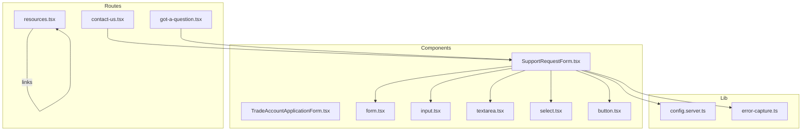
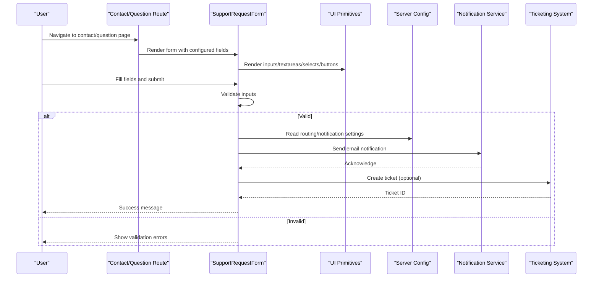
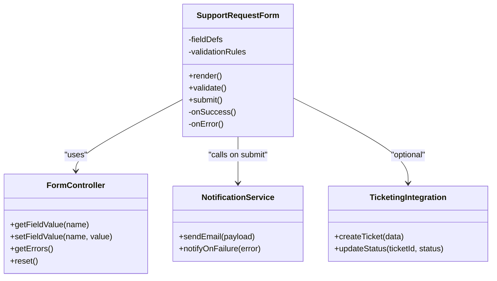
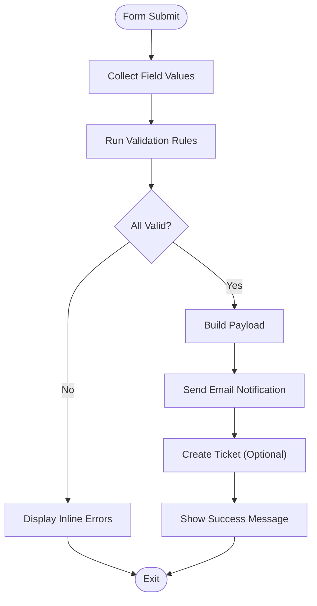
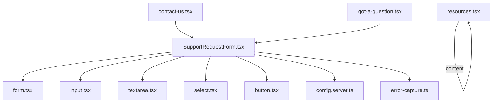

# Support & Communication

<cite>
**Referenced Files in This Document**
- [SupportRequestForm.tsx](file://src/components/shopify/SupportRequestForm.tsx)
- [TradeAccountApplicationForm.tsx](file://src/components/shopify/TradeAccountApplicationForm.tsx)
- [contact-us.tsx](file://src/routes/contact-us.tsx)
- [got-a-question.tsx](file://src/routes/got-a-question.tsx)
- [resources.tsx](file://src/routes/resources.tsx)
- [form.tsx](file://src/components/ui/form.tsx)
- [input.tsx](file://src/components/ui/input.tsx)
- [textarea.tsx](file://src/components/ui/textarea.tsx)
- [select.tsx](file://src/components/ui/select.tsx)
- [button.tsx](file://src/components/ui/button.tsx)
- [config.server.ts](file://src/lib/config.server.ts)
- [error-capture.ts](file://src/lib/error-capture.ts)
</cite>

## Table of Contents
1. [Introduction](#introduction)
2. [Project Structure](#project-structure)
3. [Core Components](#core-components)
4. [Architecture Overview](#architecture-overview)
5. [Detailed Component Analysis](#detailed-component-analysis)
6. [Dependency Analysis](#dependency-analysis)
7. [Performance Considerations](#performance-considerations)
8. [Troubleshooting Guide](#troubleshooting-guide)
9. [Conclusion](#conclusion)
10. [Appendices](#appendices)

## Introduction
This document explains the support and communication system implemented in the project. It covers:
- The support request system and contact form implementation
- FAQ and resource management pages
- Email notification system integration points
- Form handling architecture, validation rules, and submission workflows
- Configuration options for form fields, notification templates, and routing rules
- Practical examples for customizing forms, automating responses, and integrating with ticketing systems
- Common use cases such as multi-language support, file attachments, and escalation workflows

The goal is to provide both a high-level overview and detailed technical guidance so that developers can extend and operate the support and communication features effectively.

## Project Structure
The support and communication features are primarily implemented through:
- Route pages for user-facing flows (contact, questions, resources)
- Reusable form components for structured submissions
- UI primitives for inputs, text areas, selects, buttons, and form orchestration
- Server configuration and error capture utilities

**Diagram sources**
- [contact-us.tsx](file://src/routes/contact-us.tsx)
- [got-a-question.tsx](file://src/routes/got-a-question.tsx)
- [resources.tsx](file://src/routes/resources.tsx)
- [SupportRequestForm.tsx](file://src/components/shopify/SupportRequestForm.tsx)
- [TradeAccountApplicationForm.tsx](file://src/components/shopify/TradeAccountApplicationForm.tsx)
- [form.tsx](file://src/components/ui/form.tsx)
- [input.tsx](file://src/components/ui/input.tsx)
- [textarea.tsx](file://src/components/ui/textarea.tsx)
- [select.tsx](file://src/components/ui/select.tsx)
- [button.tsx](file://src/components/ui/button.tsx)
- [config.server.ts](file://src/lib/config.server.ts)
- [error-capture.ts](file://src/lib/error-capture.ts)

**Section sources**
- [contact-us.tsx](file://src/routes/contact-us.tsx)
- [got-a-question.tsx](file://src/routes/got-a-question.tsx)
- [resources.tsx](file://src/routes/resources.tsx)
- [SupportRequestForm.tsx](file://src/components/shopify/SupportRequestForm.tsx)
- [TradeAccountApplicationForm.tsx](file://src/components/shopify/TradeAccountApplicationForm.tsx)
- [form.tsx](file://src/components/ui/form.tsx)
- [input.tsx](file://src/components/ui/input.tsx)
- [textarea.tsx](file://src/components/ui/textarea.tsx)
- [select.tsx](file://src/components/ui/select.tsx)
- [button.tsx](file://src/components/ui/button.tsx)
- [config.server.ts](file://src/lib/config.server.ts)
- [error-capture.ts](file://src/lib/error-capture.ts)

## Core Components
- SupportRequestForm: A reusable component designed to collect support requests from users. It orchestrates field rendering, validation, and submission behavior.
- TradeAccountApplicationForm: A specialized form for trade account applications, demonstrating how to reuse the same form architecture for different business processes.
- Contact and Question Routes: Pages that host or embed support forms and guide users to relevant resources.
- Resources Page: Centralized location for FAQs, guides, and links to help content.

Key responsibilities:
- Field configuration and rendering
- Validation and error display
- Submission workflow and feedback
- Integration hooks for notifications and external systems

**Section sources**
- [SupportRequestForm.tsx](file://src/components/shopify/SupportRequestForm.tsx)
- [TradeAccountApplicationForm.tsx](file://src/components/shopify/TradeAccountApplicationForm.tsx)
- [contact-us.tsx](file://src/routes/contact-us.tsx)
- [got-a-question.tsx](file://src/routes/got-a-question.tsx)
- [resources.tsx](file://src/routes/resources.tsx)

## Architecture Overview
The support and communication system follows a modular architecture:
- Route layers present user interfaces and compose form components
- Form components encapsulate validation and submission logic
- UI primitives provide consistent input controls
- Server configuration centralizes environment-specific settings
- Error capture ensures robustness during failures

**Diagram sources**
- [contact-us.tsx](file://src/routes/contact-us.tsx)
- [got-a-question.tsx](file://src/routes/got-a-question.tsx)
- [SupportRequestForm.tsx](file://src/components/shopify/SupportRequestForm.tsx)
- [form.tsx](file://src/components/ui/form.tsx)
- [input.tsx](file://src/components/ui/input.tsx)
- [textarea.tsx](file://src/components/ui/textarea.tsx)
- [select.tsx](file://src/components/ui/select.tsx)
- [button.tsx](file://src/components/ui/button.tsx)
- [config.server.ts](file://src/lib/config.server.ts)

## Detailed Component Analysis

### Support Request Form
The support request form provides a flexible, configurable interface for capturing user issues and inquiries. It supports:
- Dynamic field definitions
- Validation rules per field
- Submission handling with success and error states
- Optional integrations for notifications and ticket creation

**Diagram sources**
- [SupportRequestForm.tsx](file://src/components/shopify/SupportRequestForm.tsx)
- [form.tsx](file://src/components/ui/form.tsx)
- [config.server.ts](file://src/lib/config.server.ts)
- [error-capture.ts](file://src/lib/error-capture.ts)

Implementation highlights:
- Field definitions include labels, types, placeholders, and constraints
- Validation runs before submission; errors are surfaced inline
- On success, the form may trigger email notifications and create tickets
- Errors are captured and logged for diagnostics

**Section sources**
- [SupportRequestForm.tsx](file://src/components/shopify/SupportRequestForm.tsx)
- [form.tsx](file://src/components/ui/form.tsx)
- [config.server.ts](file://src/lib/config.server.ts)
- [error-capture.ts](file://src/lib/error-capture.ts)

### Contact Us and Got a Question Routes
These routes serve as entry points for users seeking assistance:
- Contact Us: Hosts the support form and provides additional context
- Got a Question: Similar to Contact Us but tailored for quick questions

Routing considerations:
- Consistent layout and navigation
- SEO-friendly metadata
- Accessibility best practices

**Section sources**
- [contact-us.tsx](file://src/routes/contact-us.tsx)
- [got-a-question.tsx](file://src/routes/got-a-question.tsx)

### Resources and FAQ Management
The Resources page aggregates help content:
- FAQs organized by topic
- Guides and documentation links
- Searchable content (if implemented)

Best practices:
- Use clear headings and categories
- Keep content concise and actionable
- Provide links to related articles

**Section sources**
- [resources.tsx](file://src/routes/resources.tsx)

### Form Handling Architecture
The form architecture centers around a controller-like pattern:
- State management for field values and errors
- Validation pipeline with rule-based checks
- Submission flow with asynchronous operations
- Feedback mechanisms for user experience

**Diagram sources**
- [SupportRequestForm.tsx](file://src/components/shopify/SupportRequestForm.tsx)
- [form.tsx](file://src/components/ui/form.tsx)
- [config.server.ts](file://src/lib/config.server.ts)

**Section sources**
- [SupportRequestForm.tsx](file://src/components/shopify/SupportRequestForm.tsx)
- [form.tsx](file://src/components/ui/form.tsx)

### Email Notification System
The notification system integrates with the form submission process:
- Reads configuration for recipients, templates, and routing rules
- Sends emails upon successful submission
- Handles failures gracefully with logging and retries (if configured)

Configuration aspects:
- Recipient addresses and groups
- Template selection based on form type or category
- Routing rules to direct specific requests to teams

**Section sources**
- [config.server.ts](file://src/lib/config.server.ts)
- [SupportRequestForm.tsx](file://src/components/shopify/SupportRequestForm.tsx)

### File Attachments
File uploads can be supported by extending the form:
- Add file input fields with type and size constraints
- Validate file types and sizes client-side and server-side
- Securely handle uploaded files and attach them to notifications or tickets

Security considerations:
- Enforce allowed MIME types
- Limit maximum file size
- Sanitize filenames and store securely

**Section sources**
- [SupportRequestForm.tsx](file://src/components/shopify/SupportRequestForm.tsx)
- [input.tsx](file://src/components/ui/input.tsx)

### Multi-Language Support
To implement multi-language support:
- Externalize all user-visible strings
- Load language packs based on locale
- Update form labels, placeholders, and messages dynamically

Accessibility considerations:
- Ensure screen readers announce localized content correctly
- Maintain consistent keyboard navigation across languages

**Section sources**
- [SupportRequestForm.tsx](file://src/components/shopify/SupportRequestForm.tsx)
- [contact-us.tsx](file://src/routes/contact-us.tsx)
- [got-a-question.tsx](file://src/routes/got-a-question.tsx)

### Escalation Workflows
Escalation can be implemented by:
- Adding priority or category fields to the form
- Routing rules that assign tickets to appropriate teams
- Automated follow-ups and SLA tracking via the ticketing system

Operational benefits:
- Faster resolution times
- Clear ownership and accountability
- Better reporting and analytics

**Section sources**
- [SupportRequestForm.tsx](file://src/components/shopify/SupportRequestForm.tsx)
- [config.server.ts](file://src/lib/config.server.ts)

## Dependency Analysis
The support and communication system depends on:
- UI primitives for consistent input controls
- Form orchestration utilities for state and validation
- Server configuration for runtime settings
- Error capture for robustness and observability

**Diagram sources**
- [SupportRequestForm.tsx](file://src/components/shopify/SupportRequestForm.tsx)
- [form.tsx](file://src/components/ui/form.tsx)
- [input.tsx](file://src/components/ui/input.tsx)
- [textarea.tsx](file://src/components/ui/textarea.tsx)
- [select.tsx](file://src/components/ui/select.tsx)
- [button.tsx](file://src/components/ui/button.tsx)
- [config.server.ts](file://src/lib/config.server.ts)
- [error-capture.ts](file://src/lib/error-capture.ts)
- [contact-us.tsx](file://src/routes/contact-us.tsx)
- [got-a-question.tsx](file://src/routes/got-a-question.tsx)
- [resources.tsx](file://src/routes/resources.tsx)

**Section sources**
- [SupportRequestForm.tsx](file://src/components/shopify/SupportRequestForm.tsx)
- [form.tsx](file://src/components/ui/form.tsx)
- [input.tsx](file://src/components/ui/input.tsx)
- [textarea.tsx](file://src/components/ui/textarea.tsx)
- [select.tsx](file://src/components/ui/select.tsx)
- [button.tsx](file://src/components/ui/button.tsx)
- [config.server.ts](file://src/lib/config.server.ts)
- [error-capture.ts](file://src/lib/error-capture.ts)
- [contact-us.tsx](file://src/routes/contact-us.tsx)
- [got-a-question.tsx](file://src/routes/got-a-question.tsx)
- [resources.tsx](file://src/routes/resources.tsx)

## Performance Considerations
- Minimize re-renders by memoizing form state where appropriate
- Debounce heavy validations if necessary
- Avoid unnecessary network calls; batch operations when possible
- Cache static resources like FAQs and guides
- Implement progressive enhancement for better UX under slow networks

[No sources needed since this section provides general guidance]

## Troubleshooting Guide
Common issues and resolutions:
- Validation errors not displaying: Check form controller state and ensure error keys match field names
- Submission failing silently: Inspect error capture logs and verify notification service configuration
- Missing fields in payload: Confirm field bindings and serialization steps
- Localization not applied: Verify language pack loading and fallback strategies

Operational tips:
- Enable detailed logging in development
- Use feature flags to toggle integrations during testing
- Monitor error rates and response times

**Section sources**
- [error-capture.ts](file://src/lib/error-capture.ts)
- [SupportRequestForm.tsx](file://src/components/shopify/SupportRequestForm.tsx)
- [config.server.ts](file://src/lib/config.server.ts)

## Conclusion
The support and communication system provides a robust foundation for managing user inquiries, automating notifications, and integrating with ticketing platforms. By leveraging configurable forms, clear validation rules, and centralized configuration, teams can quickly adapt workflows to meet evolving needs. Extensibility points allow for multi-language support, file attachments, and escalation policies while maintaining performance and reliability.

[No sources needed since this section summarizes without analyzing specific files]

## Appendices

### Practical Examples

#### Creating a Custom Support Form
- Define new fields in the form configuration
- Add validation rules and error messages
- Wire up submission handlers to send notifications and create tickets
- Test end-to-end flows with sample data

**Section sources**
- [SupportRequestForm.tsx](file://src/components/shopify/SupportRequestForm.tsx)
- [form.tsx](file://src/components/ui/form.tsx)
- [config.server.ts](file://src/lib/config.server.ts)

#### Implementing Automated Responses
- Configure notification templates based on form category
- Set routing rules to direct requests to specific teams
- Include automated acknowledgments and next steps

**Section sources**
- [config.server.ts](file://src/lib/config.server.ts)
- [SupportRequestForm.tsx](file://src/components/shopify/SupportRequestForm.tsx)

#### Integrating with Ticketing Systems
- Map form fields to ticket attributes
- Handle ticket creation responses and update form state
- Implement retry logic for transient failures

**Section sources**
- [SupportRequestForm.tsx](file://src/components/shopify/SupportRequestForm.tsx)
- [config.server.ts](file://src/lib/config.server.ts)