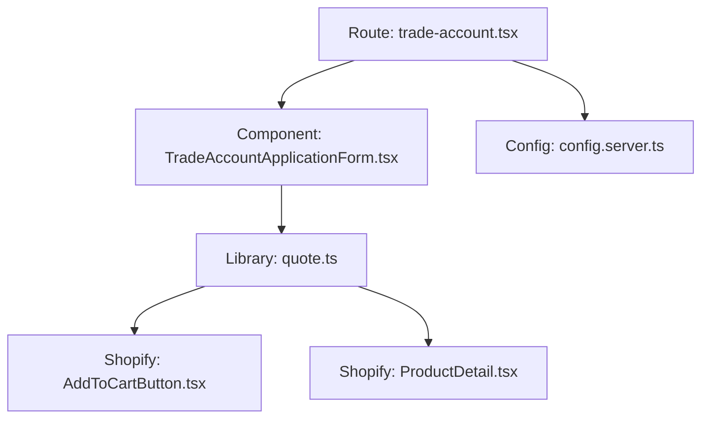
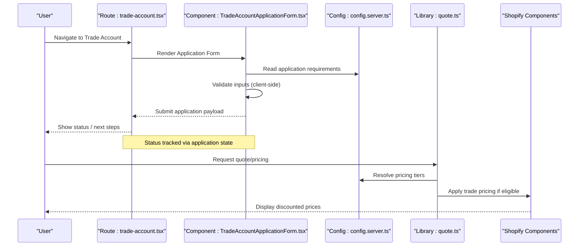
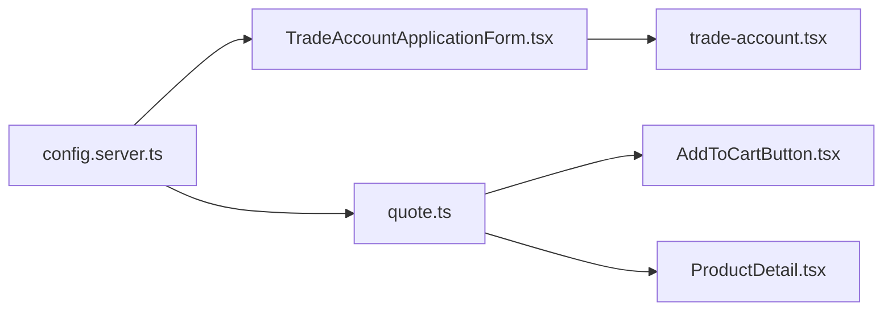

# Trade Account System

<cite>
**Referenced Files in This Document**
- [TradeAccountApplicationForm.tsx](file://src/components/shopify/TradeAccountApplicationForm.tsx)
- [trade-account.tsx](file://src/routes/trade-account.tsx)
- [config.server.ts](file://src/lib/config.server.ts)
- [quote.ts](file://src/lib/quote.ts)
- [Shopify AddToCartButton.tsx](file://src/components/shopify/AddToCartButton.tsx)
- [Shopify ProductDetail.tsx](file://src/components/shopify/ProductDetail.tsx)
</cite>

## Table of Contents
1. [Introduction](#introduction)
2. [Project Structure](#project-structure)
3. [Core Components](#core-components)
4. [Architecture Overview](#architecture-overview)
5. [Detailed Component Analysis](#detailed-component-analysis)
6. [Dependency Analysis](#dependency-analysis)
7. [Performance Considerations](#performance-considerations)
8. [Troubleshooting Guide](#troubleshooting-guide)
9. [Conclusion](#conclusion)
10. [Appendices](#appendices)

## Introduction
This document explains the trade account system as implemented in the repository. It covers the application process, form validation, approval workflow, special pricing integration, data model and status tracking, notifications, configuration options, and practical customization examples. The goal is to help developers understand how trade accounts are created, validated, approved, and how they affect pricing and quoting flows.

## Project Structure
The trade account feature spans a few key areas:
- A dedicated route for trade account access and navigation
- A reusable application form component used within the route
- Server-side configuration that can influence behavior
- Quoting and cart components that integrate with trade pricing when applicable

**Diagram sources**
- [trade-account.tsx](file://src/routes/trade-account.tsx)
- [TradeAccountApplicationForm.tsx](file://src/components/shopify/TradeAccountApplicationForm.tsx)
- [config.server.ts](file://src/lib/config.server.ts)
- [quote.ts](file://src/lib/quote.ts)
- [Shopify AddToCartButton.tsx](file://src/components/shopify/AddToCartButton.tsx)
- [Shopify ProductDetail.tsx](file://src/components/shopify/ProductDetail.tsx)

**Section sources**
- [trade-account.tsx](file://src/routes/trade-account.tsx)
- [TradeAccountApplicationForm.tsx](file://src/components/shopify/TradeAccountApplicationForm.tsx)
- [config.server.ts](file://src/lib/config.server.ts)
- [quote.ts](file://src/lib/quote.ts)
- [Shopify AddToCartButton.tsx](file://src/components/shopify/AddToCartButton.tsx)
- [Shopify ProductDetail.tsx](file://src/components/shopify/ProductDetail.tsx)

## Core Components
- Trade account route: Provides the entry point for users to apply for or manage trade accounts. It renders the application form and may expose UI for viewing status or next steps.
- Application form component: Implements the user-facing form fields, client-side validation rules, and submission handling. It orchestrates data collection and triggers downstream processes (e.g., creating an application record).
- Configuration module: Centralizes settings such as required fields, approval criteria, and pricing tier toggles. These settings can be consumed by both server and client code paths.
- Quoting integration: When a trade account is active, quotes and cart operations may use special pricing tiers. The quoting library coordinates price resolution and applies trade discounts where eligible.

Key responsibilities:
- Application lifecycle: collect inputs, validate, submit, track status
- Approval workflow: enforce criteria and trigger approvals or rejections
- Pricing integration: resolve tiered pricing for approved accounts
- Notifications: inform applicants and admins about status changes

**Section sources**
- [trade-account.tsx](file://src/routes/trade-account.tsx)
- [TradeAccountApplicationForm.tsx](file://src/components/shopify/TradeAccountApplicationForm.tsx)
- [config.server.ts](file://src/lib/config.server.ts)
- [quote.ts](file://src/lib/quote.ts)

## Architecture Overview
High-level flow from application to pricing integration:

**Diagram sources**
- [trade-account.tsx](file://src/routes/trade-account.tsx)
- [TradeAccountApplicationForm.tsx](file://src/components/shopify/TradeAccountApplicationForm.tsx)
- [config.server.ts](file://src/lib/config.server.ts)
- [quote.ts](file://src/lib/quote.ts)
- [Shopify AddToCartButton.tsx](file://src/components/shopify/AddToCartButton.tsx)
- [Shopify ProductDetail.tsx](file://src/components/shopify/ProductDetail.tsx)

## Detailed Component Analysis

### Trade Account Route
Responsibilities:
- Renders the application form and any status views
- Coordinates navigation and context for the application flow
- May surface administrative actions or links depending on permissions

Implementation notes:
- Uses the application form component to capture inputs
- Integrates with configuration to determine which fields are required
- Displays feedback based on submission results

**Section sources**
- [trade-account.tsx](file://src/routes/trade-account.tsx)

### Application Form Component
Responsibilities:
- Presents dynamic fields based on configuration
- Enforces client-side validation rules
- Submits application data and handles success/error states
- Updates local UI to reflect application status

Validation patterns:
- Required field checks
- Format validations (e.g., email, phone)
- Conditional logic based on selected business type or region

Submission flow:
- Collects form values
- Applies validation
- Sends payload to backend (if present) or updates local state
- Reflects status transitions (e.g., pending, approved, rejected)

**Section sources**
- [TradeAccountApplicationForm.tsx](file://src/components/shopify/TradeAccountApplicationForm.tsx)

### Configuration Module
Responsibilities:
- Defines application requirements (required fields, allowed values)
- Encodes approval criteria (e.g., minimum order history, tax ID presence)
- Manages pricing tier definitions and eligibility rules
- Exposes flags for enabling/disabling features like automated approval

Usage:
- Consumed by the application form to render correct fields
- Used by quoting logic to determine discount applicability
- Referenced by admin workflows to enforce consistent policies

**Section sources**
- [config.server.ts](file://src/lib/config.server.ts)

### Quoting Integration
Responsibilities:
- Resolves product pricing considering trade account status
- Applies tiered discounts based on configured rules
- Integrates with Shopify components to display accurate prices

Integration points:
- Reads configuration for tier thresholds and discount percentages
- Checks applicant/approved status before applying discounts
- Delegates price rendering to Shopify components

**Section sources**
- [quote.ts](file://src/lib/quote.ts)
- [Shopify AddToCartButton.tsx](file://src/components/shopify/AddToCartButton.tsx)
- [Shopify ProductDetail.tsx](file://src/components/shopify/ProductDetail.tsx)

### Data Model and Status Tracking
Conceptual entities:
- TradeAccountApplication: captures applicant details, submitted fields, timestamps
- Status: represents current stage (e.g., draft, submitted, under review, approved, rejected)
- PricingTier: defines discount rules and eligibility criteria

Status transitions:
- Draft -> Submitted: upon successful form submission
- Submitted -> Under Review: after initial validation
- Under Review -> Approved: meets approval criteria
- Under Review -> Rejected: fails criteria or requires manual intervention
- Approved -> Active: ready for pricing integration

Tracking mechanisms:
- Client-side state for immediate feedback
- Server-side persistence for auditability and admin workflows
- Event-driven updates to refresh UI and trigger notifications

[No sources needed since this section provides conceptual modeling]

### Notification System
Capabilities:
- In-app notifications for status changes
- Email or webhook triggers for critical events (e.g., approval)
- Admin alerts for applications requiring attention

Design considerations:
- Idempotent notifications to avoid duplicates
- Configurable channels and templates
- Retry and error handling for external services

[No sources needed since this section provides conceptual design]

### Special Pricing Integration
How it works:
- On quote requests, the system checks trade account eligibility
- If eligible, pricing tiers are applied according to configuration
- Shopify components receive adjusted prices for display and cart operations

Customization points:
- Tier thresholds and discount rates
- Product exclusions or inclusions
- Regional or category-specific rules

**Section sources**
- [quote.ts](file://src/lib/quote.ts)
- [Shopify AddToCartButton.tsx](file://src/components/shopify/AddToCartButton.tsx)
- [Shopify ProductDetail.tsx](file://src/components/shopify/ProductDetail.tsx)

## Dependency Analysis
Relationships between core modules:

**Diagram sources**
- [config.server.ts](file://src/lib/config.server.ts)
- [TradeAccountApplicationForm.tsx](file://src/components/shopify/TradeAccountApplicationForm.tsx)
- [trade-account.tsx](file://src/routes/trade-account.tsx)
- [quote.ts](file://src/lib/quote.ts)
- [Shopify AddToCartButton.tsx](file://src/components/shopify/AddToCartButton.tsx)
- [Shopify ProductDetail.tsx](file://src/components/shopify/ProductDetail.tsx)

**Section sources**
- [config.server.ts](file://src/lib/config.server.ts)
- [TradeAccountApplicationForm.tsx](file://src/components/shopify/TradeAccountApplicationForm.tsx)
- [trade-account.tsx](file://src/routes/trade-account.tsx)
- [quote.ts](file://src/lib/quote.ts)
- [Shopify AddToCartButton.tsx](file://src/components/shopify/AddToCartButton.tsx)
- [Shopify ProductDetail.tsx](file://src/components/shopify/ProductDetail.tsx)

## Performance Considerations
- Minimize re-renders in the application form by memoizing validation results and computed fields
- Cache pricing tier configurations to avoid repeated reads
- Debounce quote requests during rapid interactions to reduce overhead
- Use progressive loading for large forms or conditional sections

[No sources needed since this section provides general guidance]

## Troubleshooting Guide
Common issues and resolutions:
- Validation errors not showing: verify client-side rules align with configuration; ensure form bindings are correct
- Pricing not applied: confirm trade account status is approved; check tier eligibility rules and product mappings
- Submission failures: inspect network responses and error logs; validate required fields and formats
- Status not updating: ensure state synchronization between client and server; check event handlers and callbacks

Operational tips:
- Enable detailed logging for application submissions and pricing resolution
- Provide clear user messages for each validation failure
- Implement retry logic for external integrations (e.g., ERP, email)

[No sources needed since this section provides general guidance]

## Conclusion
The trade account system integrates application management, validation, approval workflows, and special pricing into a cohesive experience. By leveraging configuration-driven rules and modular components, teams can customize forms, automate approvals, and extend pricing tiers while maintaining compliance and performance.

[No sources needed since this section summarizes without analyzing specific files]

## Appendices

### Practical Examples

#### Customize Application Forms
- Add or remove fields by updating configuration entries for required attributes
- Implement conditional visibility using form logic tied to business type or region
- Extend validation rules to include custom checks (e.g., license verification)

[No sources needed since this section provides conceptual guidance]

#### Implement Automated Approval Workflows
- Define criteria in configuration (e.g., minimum order volume, tax ID presence)
- Trigger automated approval when all conditions are met
- Route exceptions to manual review queues for edge cases

[No sources needed since this section provides conceptual guidance]

#### Integrate with ERP Systems
- Map trade account fields to ERP customer records
- Sync application status updates to ERP via webhooks or batch jobs
- Ensure idempotency and error handling for failed syncs

[No sources needed since this section provides conceptual guidance]

### Common Use Cases

#### Bulk Trade Account Processing
- Import applications via CSV or API
- Validate in batches and report errors per row
- Approve or reject en masse based on predefined criteria

[No sources needed since this section provides conceptual guidance]

#### Tiered Pricing Structures
- Configure multiple tiers with different discount levels
- Apply tiers based on purchase history or segment
- Allow overrides for strategic accounts

[No sources needed since this section provides conceptual guidance]

#### Compliance Requirements
- Enforce mandatory fields for regulatory compliance
- Audit trail for approvals and pricing changes
- Data retention and privacy controls aligned with policy

[No sources needed since this section provides conceptual guidance]