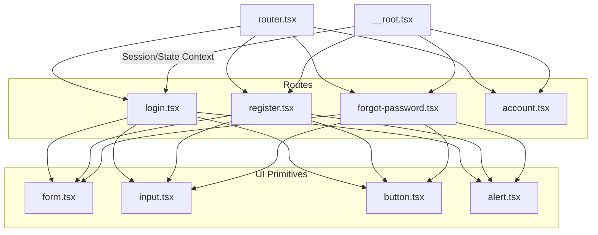
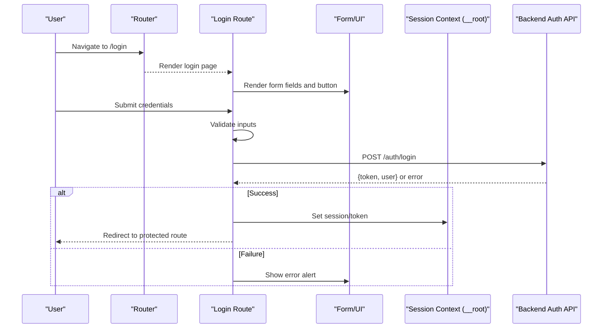
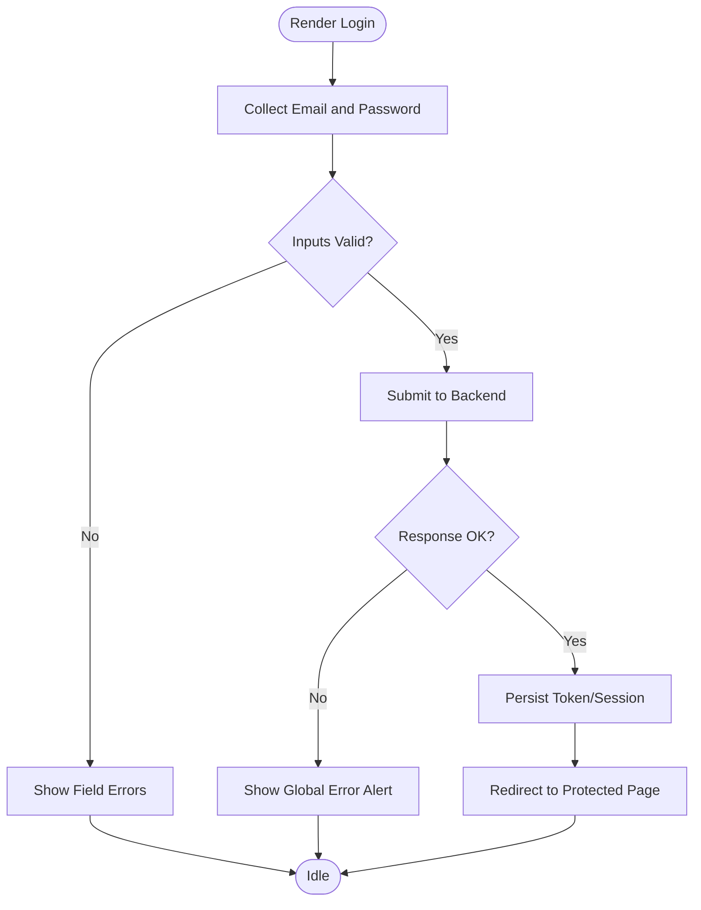
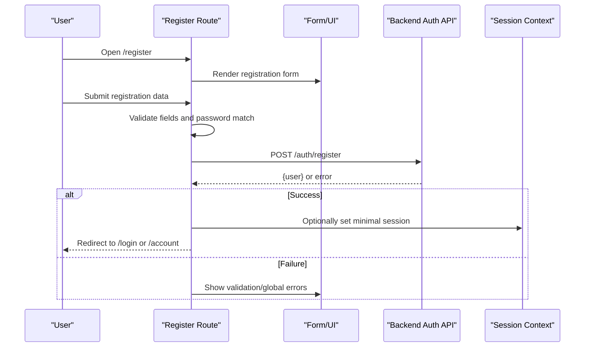
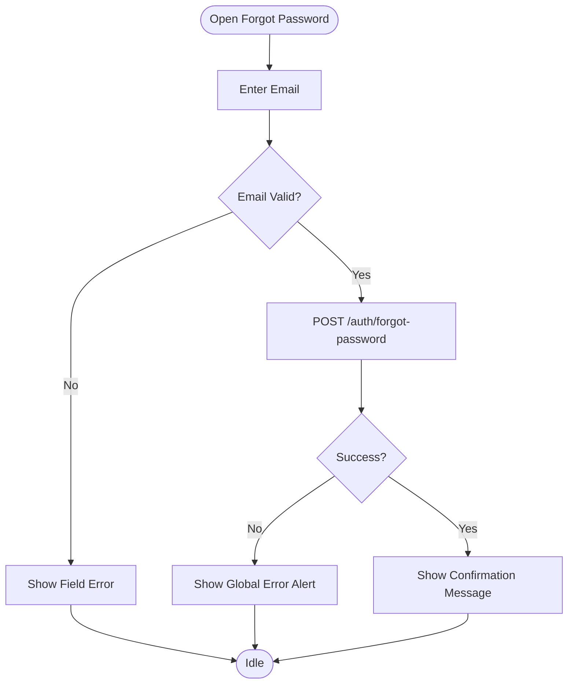
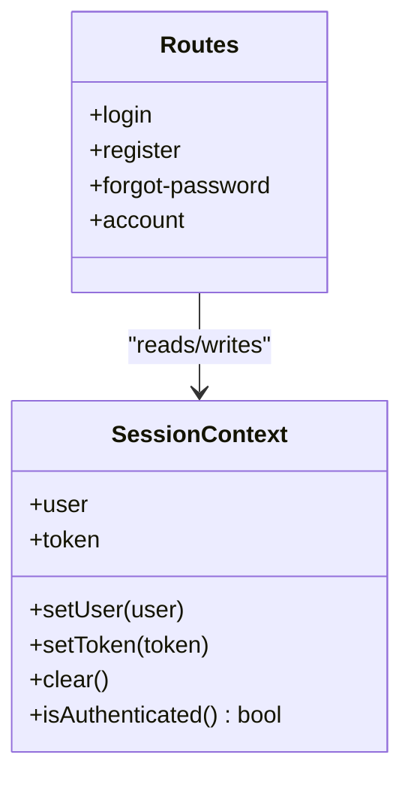
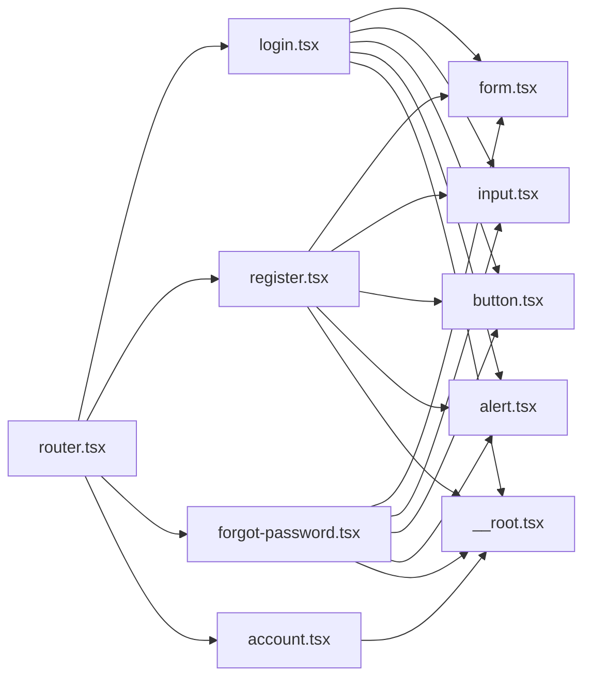

# Authentication Flows

<cite>
**Referenced Files in This Document**
- [login.tsx](file://src/routes/login.tsx)
- [register.tsx](file://src/routes/register.tsx)
- [forgot-password.tsx](file://src/routes/forgot-password.tsx)
- [account.tsx](file://src/routes/account.tsx)
- [router.tsx](file://src/router.tsx)
- [__root.tsx](file://src/routes/__root.tsx)
- [form.tsx](file://src/components/ui/form.tsx)
- [input.tsx](file://src/components/ui/input.tsx)
- [button.tsx](file://src/components/ui/button.tsx)
- [alert.tsx](file://src/components/ui/alert.tsx)
- [error-page.tsx](file://src/lib/error-page.ts)
- [config.server.ts](file://src/lib/config.server.ts)
</cite>

## Table of Contents
1. [Introduction](#introduction)
2. [Project Structure](#project-structure)
3. [Core Components](#core-components)
4. [Architecture Overview](#architecture-overview)
5. [Detailed Component Analysis](#detailed-component-analysis)
6. [Dependency Analysis](#dependency-analysis)
7. [Performance Considerations](#performance-considerations)
8. [Troubleshooting Guide](#troubleshooting-guide)
9. [Conclusion](#conclusion)
10. [Appendices](#appendices)

## Introduction
This document explains the authentication flows for user login, registration, and password recovery. It covers authentication state management, form validation, error handling, user feedback, token/session persistence, and security measures. It also provides guidance on extending authentication providers, implementing custom validation rules, handling errors, debugging techniques, and best practices for secure authentication.

## Project Structure
Authentication-related routes are implemented as standalone route components. Shared UI primitives (forms, inputs, buttons, alerts) are reused across flows. The router wires these routes into the application. A root layout component manages global state and session context. Error pages centralize error presentation.

**Diagram sources**
- [router.tsx](file://src/router.tsx)
- [login.tsx](file://src/routes/login.tsx)
- [register.tsx](file://src/routes/register.tsx)
- [forgot-password.tsx](file://src/routes/forgot-password.tsx)
- [account.tsx](file://src/routes/account.tsx)
- [form.tsx](file://src/components/ui/form.tsx)
- [input.tsx](file://src/components/ui/input.tsx)
- [button.tsx](file://src/components/ui/button.tsx)
- [alert.tsx](file://src/components/ui/alert.tsx)
- [__root.tsx](file://src/routes/__root.tsx)

**Section sources**
- [router.tsx](file://src/router.tsx)
- [login.tsx](file://src/routes/login.tsx)
- [register.tsx](file://src/routes/register.tsx)
- [forgot-password.tsx](file://src/routes/forgot-password.tsx)
- [account.tsx](file://src/routes/account.tsx)
- [__root.tsx](file://src/routes/__root.tsx)

## Core Components
- Route-level forms: Each authentication flow is a route component that owns its own form state, validation, submission, and feedback.
- Shared UI primitives: Reusable form controls and alert components provide consistent UX and accessibility.
- Global session context: The root layout provides session/auth state to all routes.

Key responsibilities:
- Login: Collect credentials, validate, submit, handle success or error, persist tokens if applicable, redirect.
- Register: Validate new account fields, submit, handle success or error, redirect to login or account.
- Password Recovery: Validate email input, submit request, show confirmation message.
- Account: Display current user info, allow logout, protect sensitive actions.

**Section sources**
- [login.tsx](file://src/routes/login.tsx)
- [register.tsx](file://src/routes/register.tsx)
- [forgot-password.tsx](file://src/routes/forgot-password.tsx)
- [account.tsx](file://src/routes/account.tsx)
- [form.tsx](file://src/components/ui/form.tsx)
- [input.tsx](file://src/components/ui/input.tsx)
- [button.tsx](file://src/components/ui/button.tsx)
- [alert.tsx](file://src/components/ui/alert.tsx)
- [__root.tsx](file://src/routes/__root.tsx)

## Architecture Overview
The authentication architecture follows a route-centric pattern with shared UI primitives and a global session context.

**Diagram sources**
- [router.tsx](file://src/router.tsx)
- [login.tsx](file://src/routes/login.tsx)
- [__root.tsx](file://src/routes/__root.tsx)

## Detailed Component Analysis

### Login Flow
Responsibilities:
- Collect email/password
- Validate required fields and format
- Submit to backend
- Persist token/session
- Handle errors and display feedback
- Redirect after success

**Diagram sources**
- [login.tsx](file://src/routes/login.tsx)
- [form.tsx](file://src/components/ui/form.tsx)
- [input.tsx](file://src/components/ui/input.tsx)
- [button.tsx](file://src/components/ui/button.tsx)
- [alert.tsx](file://src/components/ui/alert.tsx)
- [__root.tsx](file://src/routes/__root.tsx)

**Section sources**
- [login.tsx](file://src/routes/login.tsx)
- [form.tsx](file://src/components/ui/form.tsx)
- [input.tsx](file://src/components/ui/input.tsx)
- [button.tsx](file://src/components/ui/button.tsx)
- [alert.tsx](file://src/components/ui/alert.tsx)
- [__root.tsx](file://src/routes/__root.tsx)

### Registration Flow
Responsibilities:
- Collect name, email, password, confirm password
- Enforce password strength and match
- Submit to backend
- On success, redirect to login or account
- On failure, show field-specific and global errors

**Diagram sources**
- [register.tsx](file://src/routes/register.tsx)
- [form.tsx](file://src/components/ui/form.tsx)
- [input.tsx](file://src/components/ui/input.tsx)
- [button.tsx](file://src/components/ui/button.tsx)
- [alert.tsx](file://src/components/ui/alert.tsx)
- [__root.tsx](file://src/routes/__root.tsx)

**Section sources**
- [register.tsx](file://src/routes/register.tsx)
- [form.tsx](file://src/components/ui/form.tsx)
- [input.tsx](file://src/components/ui/input.tsx)
- [button.tsx](file://src/components/ui/button.tsx)
- [alert.tsx](file://src/components/ui/alert.tsx)
- [__root.tsx](file://src/routes/__root.tsx)

### Password Recovery Flow
Responsibilities:
- Collect email
- Validate email format
- Submit reset request
- Show confirmation message
- Handle network/server errors

**Diagram sources**
- [forgot-password.tsx](file://src/routes/forgot-password.tsx)
- [form.tsx](file://src/components/ui/form.tsx)
- [input.tsx](file://src/components/ui/input.tsx)
- [button.tsx](file://src/components/ui/button.tsx)
- [alert.tsx](file://src/components/ui/alert.tsx)

**Section sources**
- [forgot-password.tsx](file://src/routes/forgot-password.tsx)
- [form.tsx](file://src/components/ui/form.tsx)
- [input.tsx](file://src/components/ui/input.tsx)
- [button.tsx](file://src/components/ui/button.tsx)
- [alert.tsx](file://src/components/ui/alert.tsx)

### Session and State Management
- Global session context: Provided by the root layout; holds authenticated user and token.
- Persistence: Tokens may be stored in memory or secure storage depending on implementation. Ensure secure defaults and consider HttpOnly cookies for server-rendered apps.
- Access control: Protected routes check session before rendering.

**Diagram sources**
- [__root.tsx](file://src/routes/__root.tsx)
- [login.tsx](file://src/routes/login.tsx)
- [register.tsx](file://src/routes/register.tsx)
- [forgot-password.tsx](file://src/routes/forgot-password.tsx)
- [account.tsx](file://src/routes/account.tsx)

**Section sources**
- [__root.tsx](file://src/routes/__root.tsx)
- [account.tsx](file://src/routes/account.tsx)

## Dependency Analysis
Authentication routes depend on shared UI primitives and the global session context. The router wires routes into the app. Configuration is centralized for environment variables and feature flags.

**Diagram sources**
- [router.tsx](file://src/router.tsx)
- [login.tsx](file://src/routes/login.tsx)
- [register.tsx](file://src/routes/register.tsx)
- [forgot-password.tsx](file://src/routes/forgot-password.tsx)
- [account.tsx](file://src/routes/account.tsx)
- [form.tsx](file://src/components/ui/form.tsx)
- [input.tsx](file://src/components/ui/input.tsx)
- [button.tsx](file://src/components/ui/button.tsx)
- [alert.tsx](file://src/components/ui/alert.tsx)
- [__root.tsx](file://src/routes/__root.tsx)

**Section sources**
- [router.tsx](file://src/router.tsx)
- [config.server.ts](file://src/lib/config.server.ts)

## Performance Considerations
- Minimize re-renders by keeping form state local to each route and lifting only necessary auth state to the root context.
- Debounce or throttle any client-side validations that trigger expensive checks.
- Use optimistic UI updates cautiously; ensure robust rollback on failure.
- Avoid storing large payloads in session; keep only essential identifiers.

[No sources needed since this section provides general guidance]

## Troubleshooting Guide
Common issues and resolutions:
- Validation not triggering: Ensure form fields are bound correctly and validation rules are attached to the correct fields.
- Silent failures: Always surface network and server errors via global alerts and log contextual details.
- Token not persisted: Verify session setter calls and storage mechanism; check browser storage and cookie attributes.
- Redirect loops: Confirm that protected routes check session before rendering and that redirects occur after successful auth.
- CORS or CSRF errors: Check server configuration and headers; ensure origin and methods are allowed.

Debugging techniques:
- Add structured logging around API calls and state changes.
- Inspect network requests/responses for status codes and payload shapes.
- Use browser dev tools to inspect session storage and cookies.
- Centralize error formatting using the error page utility.

**Section sources**
- [error-page.tsx](file://src/lib/error-page.ts)
- [alert.tsx](file://src/components/ui/alert.tsx)
- [__root.tsx](file://src/routes/__root.tsx)

## Conclusion
The authentication system is organized around clear route-based flows with reusable UI primitives and a global session context. By following the patterns outlined here—robust validation, explicit error handling, secure token management, and accessible feedback—you can extend providers, add custom validation, and maintain a secure, user-friendly experience.

[No sources needed since this section summarizes without analyzing specific files]

## Appendices

### Extending Authentication Providers
- Create a provider adapter module that standardizes login, register, and forgot-password calls.
- Inject the adapter into each route to swap implementations easily.
- Keep provider-specific secrets out of client code; use server endpoints or environment variables.

[No sources needed since this section provides general guidance]

### Implementing Custom Validation Rules
- Define reusable validators for email, password strength, and confirm-password matching.
- Attach validators at the field level and present localized messages through the form component.
- For async validation (e.g., checking uniqueness), debounce requests and show loading states.

[No sources needed since this section provides general guidance]

### Handling Authentication Errors
- Normalize backend errors into a common shape.
- Map known error codes to user-friendly messages.
- Log detailed errors server-side while showing safe messages client-side.

[No sources needed since this section provides general guidance]

### Security Best Practices
- Prefer HttpOnly, Secure, SameSite cookies for tokens when possible.
- Enforce HTTPS everywhere.
- Apply rate limiting and account lockout policies server-side.
- Sanitize and validate all inputs on both client and server.
- Rotate secrets regularly and store them securely.

[No sources needed since this section provides general guidance]