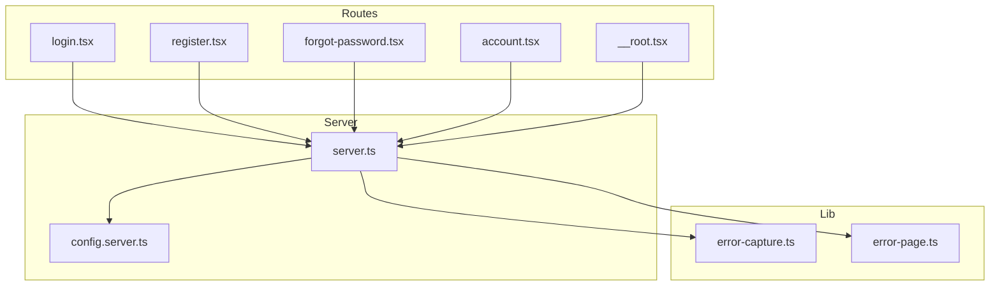
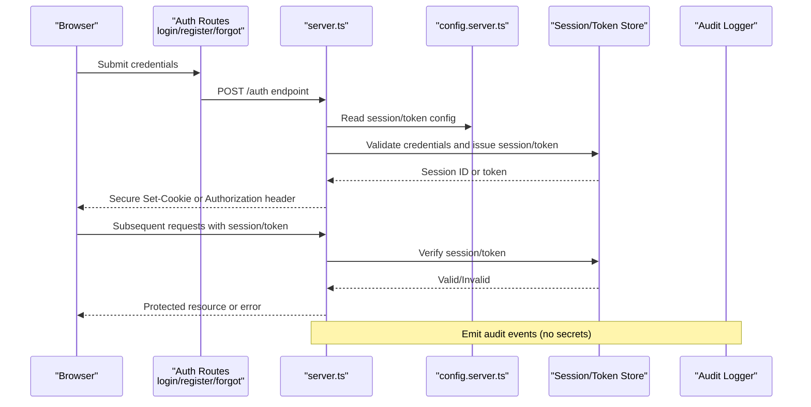
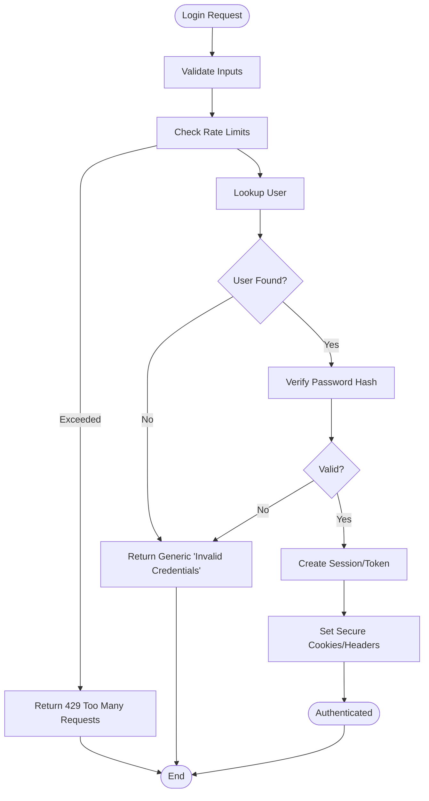
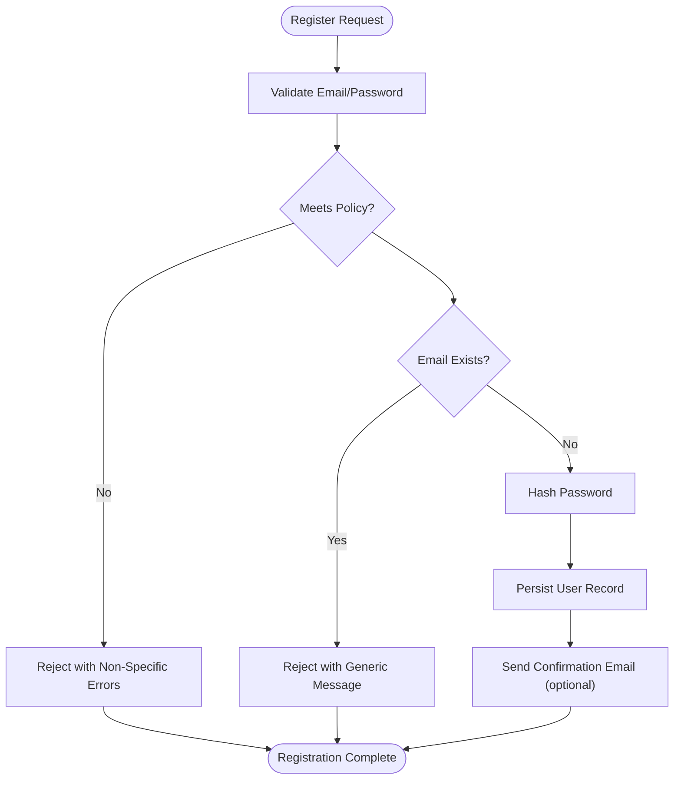
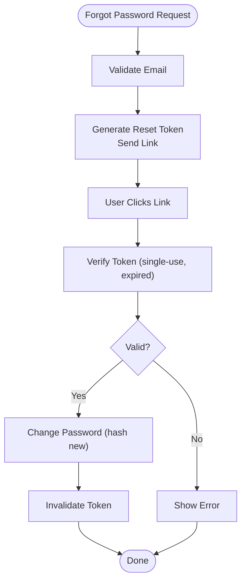
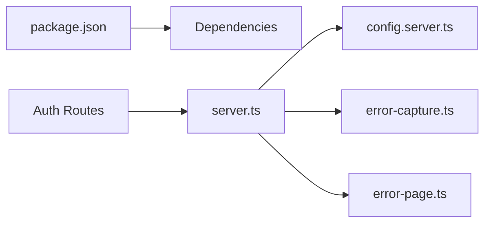

# Security & Session Management

<cite>
**Referenced Files in This Document**
- [login.tsx](file://src/routes/login.tsx)
- [register.tsx](file://src/routes/register.tsx)
- [forgot-password.tsx](file://src/routes/forgot-password.tsx)
- [account.tsx](file://src/routes/account.tsx)
- [server.ts](file://src/server.ts)
- [config.server.ts](file://src/lib/config.server.ts)
- [error-capture.ts](file://src/lib/error-capture.ts)
- [error-page.ts](file://src/lib/error-page.ts)
- [__root.tsx](file://src/routes/__root.tsx)
- [package.json](file://package.json)
</cite>

## Table of Contents
1. [Introduction](#introduction)
2. [Project Structure](#project-structure)
3. [Core Components](#core-components)
4. [Architecture Overview](#architecture-overview)
5. [Detailed Component Analysis](#detailed-component-analysis)
6. [Dependency Analysis](#dependency-analysis)
7. [Performance Considerations](#performance-considerations)
8. [Troubleshooting Guide](#troubleshooting-guide)
9. [Conclusion](#conclusion)
10. [Appendices](#appendices)

## Introduction
This document provides comprehensive security guidance for user authentication, session management, password policies, data protection, CSRF/XSS prevention, secure communication, token storage, session lifecycle, logout procedures, multi-factor authentication, audit logging, monitoring, vulnerability mitigation, penetration testing considerations, and compliance requirements. It is tailored to the application’s route-based authentication flows and server-side configuration points visible in the codebase.

## Project Structure
The application uses a route-based structure for authentication-related pages and server-side configuration:
- Authentication routes: login, registration, password recovery, account management
- Server entrypoint and server-side configuration
- Error handling utilities
- Root layout for global behavior

**Diagram sources**
- [login.tsx](file://src/routes/login.tsx)
- [register.tsx](file://src/routes/register.tsx)
- [forgot-password.tsx](file://src/routes/forgot-password.tsx)
- [account.tsx](file://src/routes/account.tsx)
- [__root.tsx](file://src/routes/__root.tsx)
- [server.ts](file://src/server.ts)
- [config.server.ts](file://src/lib/config.server.ts)
- [error-capture.ts](file://src/lib/error-capture.ts)
- [error-page.ts](file://src/lib/error-page.ts)

**Section sources**
- [login.tsx](file://src/routes/login.tsx)
- [register.tsx](file://src/routes/register.tsx)
- [forgot-password.tsx](file://src/routes/forgot-password.tsx)
- [account.tsx](file://src/routes/account.tsx)
- [__root.tsx](file://src/routes/__root.tsx)
- [server.ts](file://src/server.ts)
- [config.server.ts](file://src/lib/config.server.ts)
- [error-capture.ts](file://src/lib/error-capture.ts)
- [error-page.ts](file://src/lib/error-page.ts)

## Core Components
- Authentication routes implement login, registration, and password recovery flows. These are primary surfaces for credential handling and must enforce strong input validation, rate limiting, and secure session/token issuance.
- The server entrypoint centralizes middleware, headers, and transport-level security settings.
- Server-side configuration holds secrets, cookie/session options, and feature flags.
- Error capture and error page utilities should avoid leaking sensitive details to clients.

Key responsibilities:
- Validate and sanitize all inputs at the boundary.
- Enforce HTTPS-only communication.
- Issue short-lived tokens or secure cookies with appropriate flags.
- Implement CSRF protections for state-changing requests.
- Prevent XSS by encoding outputs and using safe APIs.
- Log security events without sensitive data.

**Section sources**
- [login.tsx](file://src/routes/login.tsx)
- [register.tsx](file://src/routes/register.tsx)
- [forgot-password.tsx](file://src/routes/forgot-password.tsx)
- [account.tsx](file://src/routes/account.tsx)
- [server.ts](file://src/server.ts)
- [config.server.ts](file://src/lib/config.server.ts)
- [error-capture.ts](file://src/lib/error-capture.ts)
- [error-page.ts](file://src/lib/error-page.ts)

## Architecture Overview
Authentication and session flow across client and server:

**Diagram sources**
- [login.tsx](file://src/routes/login.tsx)
- [register.tsx](file://src/routes/register.tsx)
- [forgot-password.tsx](file://src/routes/forgot-password.tsx)
- [server.ts](file://src/server.ts)
- [config.server.ts](file://src/lib/config.server.ts)

## Detailed Component Analysis

### Login Flow
- Input validation: Ensure username/email and password fields are validated server-side before processing.
- Rate limiting: Apply per-IP and per-account throttling to mitigate brute-force attacks.
- Credential hashing: Use a modern algorithm (e.g., Argon2/bcrypt) with unique salts.
- Session issuance: Create a new session only after successful verification; rotate session IDs upon privilege changes.
- Response sanitization: Do not echo back passwords or internal errors.

**Diagram sources**
- [login.tsx](file://src/routes/login.tsx)
- [server.ts](file://src/server.ts)

**Section sources**
- [login.tsx](file://src/routes/login.tsx)
- [server.ts](file://src/server.ts)

### Registration Flow
- Enforce strong password policy (length, complexity, breach checks).
- Validate email format and uniqueness; send confirmation link if applicable.
- Avoid storing plaintext passwords; hash immediately.
- Return generic success messages to prevent enumeration.

**Diagram sources**
- [register.tsx](file://src/routes/register.tsx)
- [server.ts](file://src/server.ts)

**Section sources**
- [register.tsx](file://src/routes/register.tsx)
- [server.ts](file://src/server.ts)

### Forgot Password Flow
- Accept only valid emails; do not reveal whether an account exists.
- Generate a time-limited, single-use reset token stored securely server-side.
- Send a secure reset link; invalidate token after use or expiration.
- Require re-authentication or step-up verification before password change.

**Diagram sources**
- [forgot-password.tsx](file://src/routes/forgot-password.tsx)
- [server.ts](file://src/server.ts)

**Section sources**
- [forgot-password.tsx](file://src/routes/forgot-password.tsx)
- [server.ts](file://src/server.ts)

### Account Management
- Protect sensitive endpoints behind verified sessions/tokens.
- Enforce authorization checks for read/write operations.
- Log access to sensitive actions without sensitive payloads.

**Section sources**
- [account.tsx](file://src/routes/account.tsx)
- [server.ts](file://src/server.ts)

## Dependency Analysis
Security-relevant dependencies and their roles:
- Server runtime and framework: Central place to configure HTTPS, cookies, CORS, and security headers.
- Configuration module: Holds secrets, cookie/session options, and feature toggles.
- Error utilities: Must be sanitized to avoid information leakage.

**Diagram sources**
- [package.json](file://package.json)
- [server.ts](file://src/server.ts)
- [config.server.ts](file://src/lib/config.server.ts)
- [error-capture.ts](file://src/lib/error-capture.ts)
- [error-page.ts](file://src/lib/error-page.ts)

**Section sources**
- [package.json](file://package.json)
- [server.ts](file://src/server.ts)
- [config.server.ts](file://src/lib/config.server.ts)
- [error-capture.ts](file://src/lib/error-capture.ts)
- [error-page.ts](file://src/lib/error-page.ts)

## Performance Considerations
- Prefer short-lived tokens with refresh mechanisms to reduce exposure windows.
- Cache non-sensitive lookups; avoid caching sensitive responses.
- Use efficient hashing algorithms tuned for security rather than speed.
- Limit payload sizes and apply timeouts to prevent abuse.

[No sources needed since this section provides general guidance]

## Troubleshooting Guide
Common issues and mitigations:
- Information leakage in errors: Ensure error handlers strip stack traces and internal details.
- Cookie misconfiguration: Verify SameSite, Secure, HttpOnly, and domain/path scoping.
- CSRF failures: Confirm origin checking and anti-CSRF tokens for state-changing endpoints.
- Session fixation: Rotate session IDs after login and on privilege escalation.
- Logging sensitive data: Audit logs must exclude passwords, tokens, and PII.

**Section sources**
- [error-capture.ts](file://src/lib/error-capture.ts)
- [error-page.ts](file://src/lib/error-page.ts)
- [server.ts](file://src/server.ts)
- [config.server.ts](file://src/lib/config.server.ts)

## Conclusion
Secure authentication requires layered controls: strict input validation, robust session/token handling, secure defaults, careful error handling, and continuous monitoring. Align implementation with the routes and server configuration points identified above, and regularly validate defenses through testing and audits.

[No sources needed since this section summarizes without analyzing specific files]

## Appendices

### Security Controls Checklist
- Authentication
  - Enforce HTTPS everywhere; redirect HTTP to HTTPS.
  - Use strong password hashing with unique salts.
  - Implement rate limiting and account lockout thresholds.
  - Enforce session rotation on login and privilege changes.
- Session and Token Management
  - Use HttpOnly, Secure, SameSite=Strict/Lax cookies.
  - Short TTL for access tokens; secure refresh token rotation.
  - Stateless verification where possible; otherwise, secure store with expiry.
- CSRF Protection
  - Anti-CSRF tokens for state-changing requests or SameSite+Origin checks.
- XSS Prevention
  - Encode outputs; avoid innerHTML; use safe DOM APIs.
  - Content Security Policy with strict directives.
- Input Sanitization
  - Validate types, lengths, formats; reject unexpected values.
- Secure Communication
  - TLS 1.2+; disable weak ciphers; HSTS enabled.
- Multi-Factor Authentication
  - Support TOTP/WebAuthn; require MFA for privileged actions.
- Audit Logging and Monitoring
  - Log auth events, failures, and admin actions; redact secrets.
  - Alert on anomalies (brute force, impossible travel).
- Vulnerability Mitigation
  - Keep dependencies updated; scan for known CVEs.
  - Perform regular pen tests and threat modeling.
- Compliance
  - Follow OWASP ASVS/Top 10; align with GDPR/CCPA for PII.

[No sources needed since this section provides general guidance]