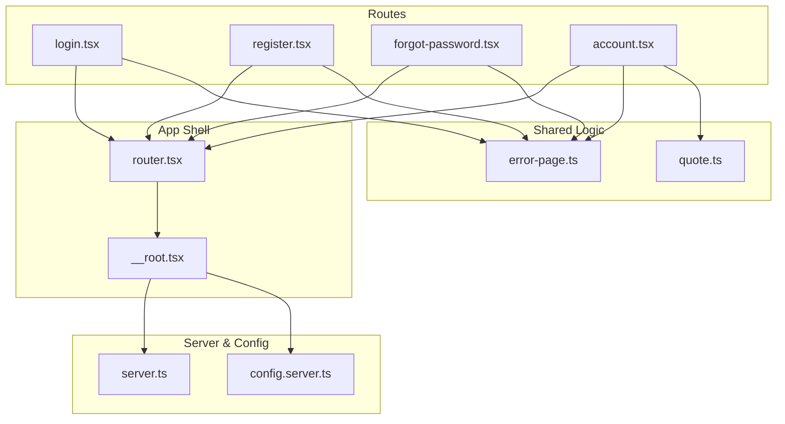
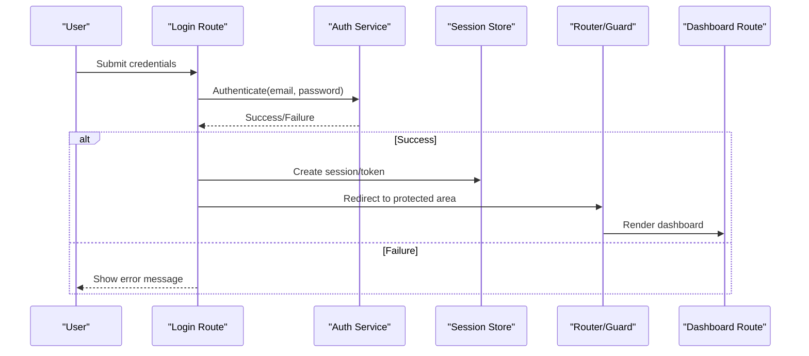
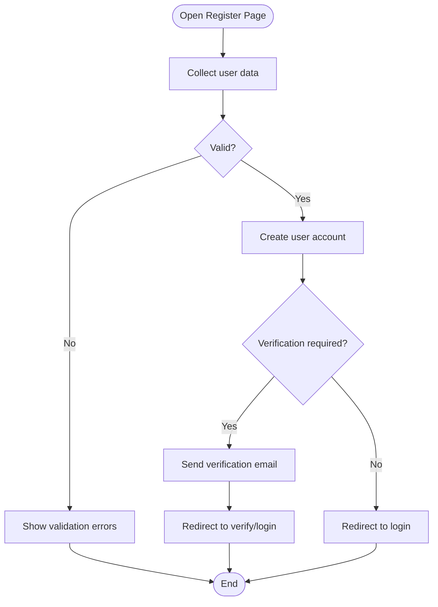
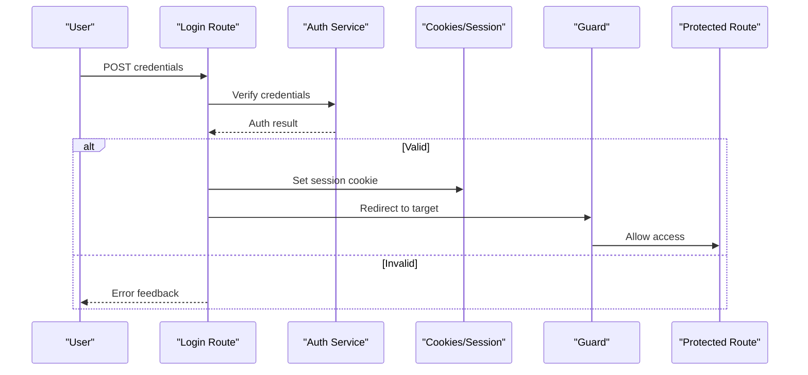
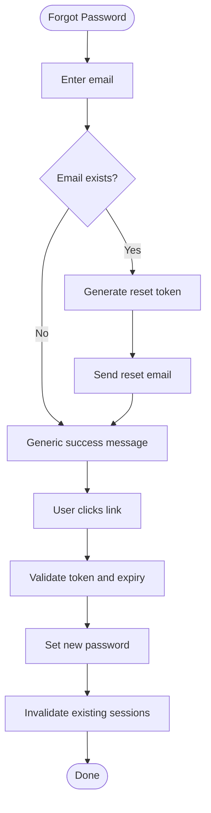
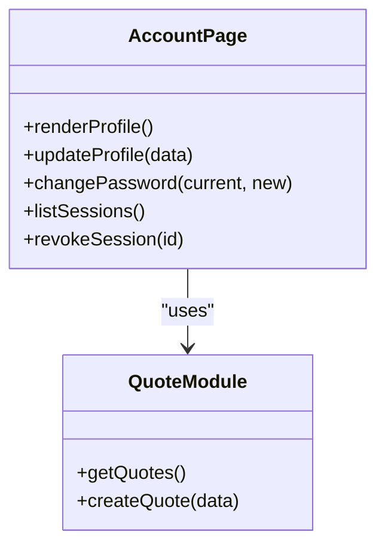
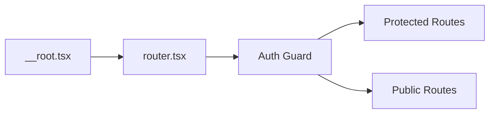

# User Accounts & Authentication

<cite>
**Referenced Files in This Document**
- [login.tsx](file://src/routes/login.tsx)
- [register.tsx](file://src/routes/register.tsx)
- [forgot-password.tsx](file://src/routes/forgot-password.tsx)
- [account.tsx](file://src/routes/account.tsx)
- [router.tsx](file://src/router.tsx)
- [__root.tsx](file://src/routes/__root.tsx)
- [server.ts](file://src/server.ts)
- [config.server.ts](file://src/lib/config.server.ts)
- [error-page.ts](file://src/lib/error-page.ts)
- [quote.ts](file://src/lib/quote.ts)
</cite>

## Table of Contents
1. [Introduction](#introduction)
2. [Project Structure](#project-structure)
3. [Core Components](#core-components)
4. [Architecture Overview](#architecture-overview)
5. [Detailed Component Analysis](#detailed-component-analysis)
6. [Dependency Analysis](#dependency-analysis)
7. [Performance Considerations](#performance-considerations)
8. [Troubleshooting Guide](#troubleshooting-guide)
9. [Conclusion](#conclusion)
10. [Appendices](#appendices)

## Introduction
This document explains the user accounts and authentication system as implemented in the project. It covers the registration flow, login/logout mechanisms, account dashboard functionality, password recovery, session management, and security considerations. It also provides guidance on extending user profiles, implementing role-based access control (RBAC), integrating with external authentication providers, and troubleshooting common issues.

## Project Structure
The authentication-related features are primarily implemented as routes and shared utilities:
- Routes for login, registration, password recovery, and account dashboard
- Root layout and router configuration that may enforce authentication guards
- Server-side configuration and error handling utilities
- Shared business logic modules used by routes

**Diagram sources**
- [login.tsx](file://src/routes/login.tsx)
- [register.tsx](file://src/routes/register.tsx)
- [forgot-password.tsx](file://src/routes/forgot-password.tsx)
- [account.tsx](file://src/routes/account.tsx)
- [router.tsx](file://src/router.tsx)
- [__root.tsx](file://src/routes/__root.tsx)
- [server.ts](file://src/server.ts)
- [config.server.ts](file://src/lib/config.server.ts)
- [error-page.ts](file://src/lib/error-page.ts)
- [quote.ts](file://src/lib/quote.ts)

**Section sources**
- [router.tsx](file://src/router.tsx)
- [__root.tsx](file://src/routes/__root.tsx)
- [server.ts](file://src/server.ts)
- [config.server.ts](file://src/lib/config.server.ts)
- [error-page.ts](file://src/lib/error-page.ts)
- [login.tsx](file://src/routes/login.tsx)
- [register.tsx](file://src/routes/register.tsx)
- [forgot-password.tsx](file://src/routes/forgot-password.tsx)
- [account.tsx](file://src/routes/account.tsx)
- [quote.ts](file://src/lib/quote.ts)

## Core Components
- Login route: Handles credential submission, validates input, authenticates the user, and establishes a session or token.
- Register route: Accepts new user data, enforces validation rules, creates an account, and optionally triggers verification flows.
- Forgot password route: Initiates password reset by sending a secure link or code to the user’s email.
- Account dashboard: Displays user profile information, allows updates, and manages preferences.
- App shell and router: Provide global guards, redirects, and context for authenticated state.
- Server and config: Centralize environment variables, cookie/session settings, and feature flags.
- Error handling: Standardized error pages and messages for consistent UX.

**Section sources**
- [login.tsx](file://src/routes/login.tsx)
- [register.tsx](file://src/routes/register.tsx)
- [forgot-password.tsx](file://src/routes/forgot-password.tsx)
- [account.tsx](file://src/routes/account.tsx)
- [router.tsx](file://src/router.tsx)
- [__root.tsx](file://src/routes/__root.tsx)
- [server.ts](file://src/server.ts)
- [config.server.ts](file://src/lib/config.server.ts)
- [error-page.ts](file://src/lib/error-page.ts)

## Architecture Overview
The authentication architecture follows a route-driven pattern with server-side configuration and centralized error handling. The root layout and router coordinate authentication state and protected routes.

**Diagram sources**
- [login.tsx](file://src/routes/login.tsx)
- [router.tsx](file://src/router.tsx)
- [account.tsx](file://src/routes/account.tsx)

## Detailed Component Analysis

### Registration Flow
- Input collection and validation: Enforce required fields, format checks, and policy constraints.
- Account creation: Persist user record and set initial status (e.g., unverified).
- Post-registration actions: Optionally send verification email, assign default roles, and redirect to verification or login page.

**Diagram sources**
- [register.tsx](file://src/routes/register.tsx)
- [error-page.ts](file://src/lib/error-page.ts)

**Section sources**
- [register.tsx](file://src/routes/register.tsx)
- [error-page.ts](file://src/lib/error-page.ts)

### Login and Logout Mechanisms
- Login: Validates credentials, creates a session or token, sets secure cookies, and redirects to the intended destination.
- Logout: Invalidates session/token, clears cookies, and redirects to home or login page.

**Diagram sources**
- [login.tsx](file://src/routes/login.tsx)
- [router.tsx](file://src/router.tsx)

**Section sources**
- [login.tsx](file://src/routes/login.tsx)
- [router.tsx](file://src/router.tsx)

### Password Recovery
- Initiate reset: Accept email, validate existence without leaking info, generate a time-limited reset token.
- Reset execution: Validate token, enforce password policy, update credentials, invalidate old sessions.

**Diagram sources**
- [forgot-password.tsx](file://src/routes/forgot-password.tsx)
- [error-page.ts](file://src/lib/error-page.ts)

**Section sources**
- [forgot-password.tsx](file://src/routes/forgot-password.tsx)
- [error-page.ts](file://src/lib/error-page.ts)

### Account Dashboard
- Display profile: Load current user data and render editable fields.
- Update profile: Validate inputs, persist changes, handle conflicts and errors.
- Session controls: View active sessions, revoke sessions, change password.

**Diagram sources**
- [account.tsx](file://src/routes/account.tsx)
- [quote.ts](file://src/lib/quote.ts)

**Section sources**
- [account.tsx](file://src/routes/account.tsx)
- [quote.ts](file://src/lib/quote.ts)

### App Shell and Routing Guards
- Root layout: Provides global context, theme, and error boundaries.
- Router: Defines route hierarchy, applies authentication guards, and handles redirects for unauthenticated users.

**Diagram sources**
- [__root.tsx](file://src/routes/__root.tsx)
- [router.tsx](file://src/router.tsx)

**Section sources**
- [__root.tsx](file://src/routes/__root.tsx)
- [router.tsx](file://src/router.tsx)

### Server Configuration and Environment
- Centralizes environment variables such as session secret, cookie settings, provider keys, and feature toggles.
- Ensures sensitive values are loaded securely and applied consistently across routes.

**Section sources**
- [server.ts](file://src/server.ts)
- [config.server.ts](file://src/lib/config.server.ts)

## Dependency Analysis
Authentication components depend on routing, configuration, and error-handling utilities. The following diagram shows key relationships among files involved in auth flows.

```mermaid
graph TB
Login["login.tsx"] --> Router["router.tsx"]
Register["register.tsx"] --> Router
Forgot["forgot-password.tsx"] --> Router
Account["account.tsx"] --> Router
Account --> Quote["quote.ts"]
Router --> Root["__root.tsx"]
Root --> Server["server.ts"]
Root --> Config["config.server.ts"]
Login --> Errors["error-page.ts"]
Register --> Errors
Forgot --> Errors
Account --> Errors
```

**Diagram sources**
- [login.tsx](file://src/routes/login.tsx)
- [register.tsx](file://src/routes/register.tsx)
- [forgot-password.tsx](file://src/routes/forgot-password.tsx)
- [account.tsx](file://src/routes/account.tsx)
- [router.tsx](file://src/router.tsx)
- [__root.tsx](file://src/routes/__root.tsx)
- [server.ts](file://src/server.ts)
- [config.server.ts](file://src/lib/config.server.ts)
- [error-page.ts](file://src/lib/error-page.ts)
- [quote.ts](file://src/lib/quote.ts)

**Section sources**
- [login.tsx](file://src/routes/login.tsx)
- [register.tsx](file://src/routes/register.tsx)
- [forgot-password.tsx](file://src/routes/forgot-password.tsx)
- [account.tsx](file://src/routes/account.tsx)
- [router.tsx](file://src/router.tsx)
- [__root.tsx](file://src/routes/__root.tsx)
- [server.ts](file://src/server.ts)
- [config.server.ts](file://src/lib/config.server.ts)
- [error-page.ts](file://src/lib/error-page.ts)
- [quote.ts](file://src/lib/quote.ts)

## Performance Considerations
- Minimize round-trips by batching profile updates and using optimistic UI where safe.
- Cache non-sensitive user metadata client-side with short TTLs; revalidate on mutations.
- Use secure, httpOnly cookies for sessions to avoid heavy client-side storage overhead.
- Debounce form submissions and prevent duplicate requests during login and password resets.
- Keep error responses concise and structured to reduce payload size.

[No sources needed since this section provides general guidance]

## Troubleshooting Guide
Common issues and resolutions:
- Login failures due to invalid credentials: Ensure correct email/password and check for case sensitivity or whitespace trimming.
- Session not persisting: Verify cookie domain/path attributes and SameSite settings in server configuration.
- Password reset link expired: Confirm token lifetime and ensure clock skew is handled; regenerate if necessary.
- Dashboard loads but shows stale data: Force revalidation after profile updates and clear local caches.
- Cross-site request issues: Align CORS and cookie policies between frontend and backend.

**Section sources**
- [error-page.ts](file://src/lib/error-page.ts)
- [config.server.ts](file://src/lib/config.server.ts)
- [server.ts](file://src/server.ts)

## Conclusion
The authentication system is organized around dedicated routes for login, registration, password recovery, and account management, coordinated by a central router and root layout. Security relies on proper configuration via server-side settings and standardized error handling. Extensibility points include adding RBAC in guards, integrating external providers through configuration, and enriching the user model within the dashboard and related services.

[No sources needed since this section summarizes without analyzing specific files]

## Appendices

### Configuration Options
- Authentication providers: Configure provider IDs, secrets, and callback URLs in server configuration.
- Password policy: Define minimum length, complexity requirements, and history constraints.
- Account verification: Enable/disable email verification and configure resend limits.
- Session settings: Cookie name, domain, path, secure flag, SameSite, and expiration.

**Section sources**
- [config.server.ts](file://src/lib/config.server.ts)
- [server.ts](file://src/server.ts)

### Extending User Profiles
- Add new fields to the profile form and validation schema.
- Persist changes via the account update endpoint and refresh cached data.
- Expose new fields in the dashboard and any relevant API consumers.

**Section sources**
- [account.tsx](file://src/routes/account.tsx)
- [quote.ts](file://src/lib/quote.ts)

### Implementing Role-Based Access Control (RBAC)
- Introduce roles in the user model and guard middleware.
- Protect routes by checking roles before rendering.
- Surface role-specific UI elements conditionally.

**Section sources**
- [router.tsx](file://src/router.tsx)
- [__root.tsx](file://src/routes/__root.tsx)

### Integrating External Authentication Services
- Add provider configuration in server settings.
- Implement OAuth/OIDC callbacks and map external claims to internal roles.
- Handle linking/unlinking accounts and managing session lifetimes.

**Section sources**
- [config.server.ts](file://src/lib/config.server.ts)
- [server.ts](file://src/server.ts)

### Security Best Practices
- Enforce HTTPS and secure cookies.
- Rate-limit login and password reset endpoints.
- Use strong hashing for passwords and rotate secrets regularly.
- Avoid logging sensitive data and sanitize error messages.

**Section sources**
- [config.server.ts](file://src/lib/config.server.ts)
- [error-page.ts](file://src/lib/error-page.ts)