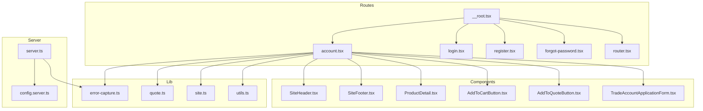
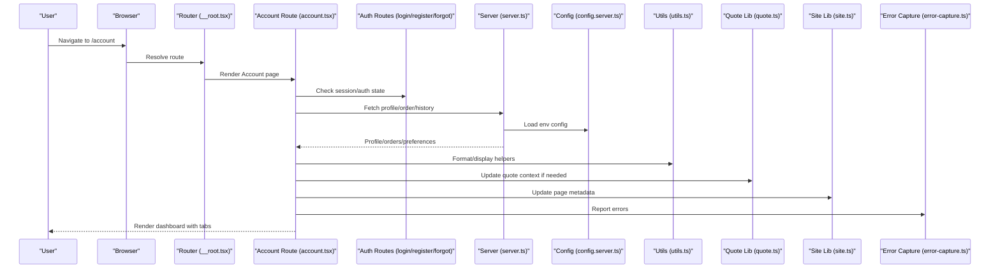
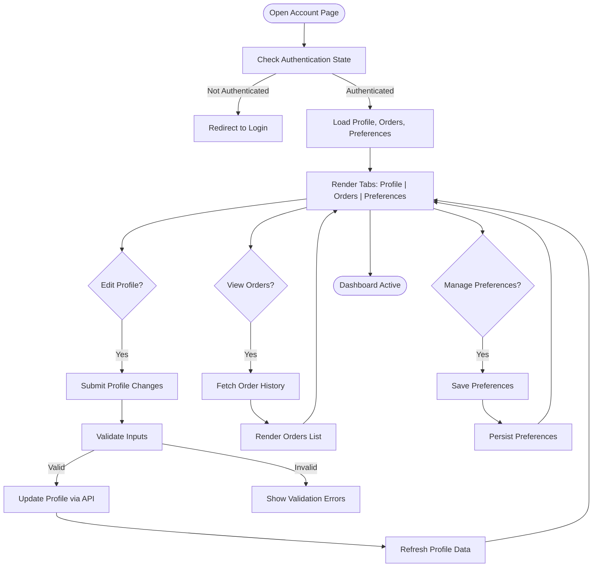
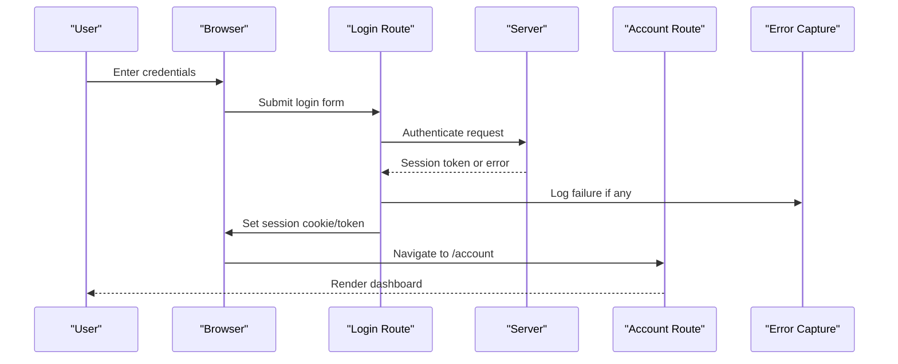
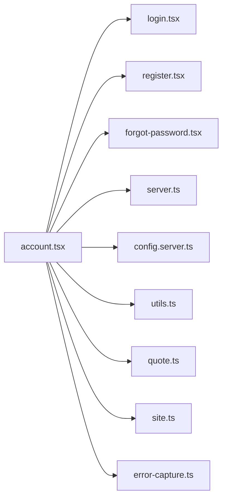

# User Dashboard & Profile Management

<cite>
**Referenced Files in This Document**
- [account.tsx](file://src/routes/account.tsx)
- [login.tsx](file://src/routes/login.tsx)
- [register.tsx](file://src/routes/register.tsx)
- [forgot-password.tsx](file://src/routes/forgot-password.tsx)
- [__root.tsx](file://src/routes/__root.tsx)
- [router.tsx](file://src/router.tsx)
- [server.ts](file://src/server.ts)
- [config.server.ts](file://src/lib/config.server.ts)
- [error-capture.ts](file://src/lib/error-capture.ts)
- [quote.ts](file://src/lib/quote.ts)
- [site.ts](file://src/lib/site.ts)
- [utils.ts](file://src/lib/utils.ts)
- [AddToCartButton.tsx](file://src/components/shopify/AddToCartButton.tsx)
- [AddToQuoteButton.tsx](file://src/components/shopify/AddToQuoteButton.tsx)
- [BuildQuoteFromCartButton.tsx](file://src/components/shopify/BuildQuoteFromCartButton.tsx)
- [CollectionPage.tsx](file://src/components/shopify/CollectionPage.tsx)
- [InfoPage.tsx](file://src/components/shopify/InfoPage.tsx)
- [PaymentMarks.tsx](file://src/components/shopify/PaymentMarks.tsx)
- [ProductCard.tsx](file://src/components/shopify/ProductCard.tsx)
- [ProductDetail.tsx](file://src/components/shopify/ProductDetail.tsx)
- [SiteFooter.tsx](file://src/components/shopify/SiteFooter.tsx)
- [SiteHeader.tsx](file://src/components/shopify/SiteHeader.tsx)
- [SupportRequestForm.tsx](file://src/components/shopify/SupportRequestForm.tsx)
- [TradeAccountApplicationForm.tsx](file://src/components/shopify/TradeAccountApplicationForm.tsx)
- [use-mobile.tsx](file://src/hooks/use-mobile.tsx)
</cite>

## Table of Contents
1. [Introduction](#introduction)
2. [Project Structure](#project-structure)
3. [Core Components](#core-components)
4. [Architecture Overview](#architecture-overview)
5. [Detailed Component Analysis](#detailed-component-analysis)
6. [Dependency Analysis](#dependency-analysis)
7. [Performance Considerations](#performance-considerations)
8. [Troubleshooting Guide](#troubleshooting-guide)
9. [Conclusion](#conclusion)
10. [Appendices](#appendices)

## Introduction
This document provides comprehensive documentation for the user dashboard and profile management system within the project. It explains how account information is displayed, how profile editing can be implemented, how order history can be integrated, and how user preferences can be managed. It also covers data modeling for user profiles, API endpoints for profile operations, real-time updates, extensibility patterns, role-based features, integration with external identity providers, UX considerations, data synchronization strategies, and performance optimization techniques.

The current codebase includes authentication-related routes (login, register, forgot password), a root layout, routing configuration, server entrypoint, and utility libraries. The user dashboard and profile management features are not fully implemented yet; this guide outlines where to add them and how to integrate them with existing components and utilities.

## Project Structure
The application uses a route-based structure with React Router and Vite. Authentication and account-related routes exist under src/routes. Shared UI components live under src/components/ui and shopify-specific components under src/components/shopify. Utilities, configuration, and error handling are centralized under src/lib.

**Diagram sources**
- [account.tsx](file://src/routes/account.tsx)
- [login.tsx](file://src/routes/login.tsx)
- [register.tsx](file://src/routes/register.tsx)
- [forgot-password.tsx](file://src/routes/forgot-password.tsx)
- [__root.tsx](file://src/routes/__root.tsx)
- [router.tsx](file://src/router.tsx)
- [server.ts](file://src/server.ts)
- [config.server.ts](file://src/lib/config.server.ts)
- [error-capture.ts](file://src/lib/error-capture.ts)
- [quote.ts](file://src/lib/quote.ts)
- [site.ts](file://src/lib/site.ts)
- [utils.ts](file://src/lib/utils.ts)
- [SiteHeader.tsx](file://src/components/shopify/SiteHeader.tsx)
- [SiteFooter.tsx](file://src/components/shopify/SiteFooter.tsx)
- [ProductDetail.tsx](file://src/components/shopify/ProductDetail.tsx)
- [AddToCartButton.tsx](file://src/components/shopify/AddToCartButton.tsx)
- [AddToQuoteButton.tsx](file://src/components/shopify/AddToQuoteButton.tsx)
- [TradeAccountApplicationForm.tsx](file://src/components/shopify/TradeAccountApplicationForm.tsx)

**Section sources**
- [account.tsx](file://src/routes/account.tsx)
- [login.tsx](file://src/routes/login.tsx)
- [register.tsx](file://src/routes/register.tsx)
- [forgot-password.tsx](file://src/routes/forgot-password.tsx)
- [__root.tsx](file://src/routes/__root.tsx)
- [router.tsx](file://src/router.tsx)
- [server.ts](file://src/server.ts)
- [config.server.ts](file://src/lib/config.server.ts)
- [error-capture.ts](file://src/lib/error-capture.ts)
- [quote.ts](file://src/lib/quote.ts)
- [site.ts](file://src/lib/site.ts)
- [utils.ts](file://src/lib/utils.ts)
- [SiteHeader.tsx](file://src/components/shopify/SiteHeader.tsx)
- [SiteFooter.tsx](file://src/components/shopify/SiteFooter.tsx)
- [ProductDetail.tsx](file://src/components/shopify/ProductDetail.tsx)
- [AddToCartButton.tsx](file://src/components/shopify/AddToCartButton.tsx)
- [AddToQuoteButton.tsx](file://src/components/shopify/AddToQuoteButton.tsx)
- [TradeAccountApplicationForm.tsx](file://src/components/shopify/TradeAccountApplicationForm.tsx)

## Core Components
- Account Route: Provides the entry point for the user dashboard and profile management. It should render account overview, profile editing, order history, and preferences sections.
- Authentication Routes: Login, Register, and Forgot Password handle user identity lifecycle and session establishment.
- Root Layout and Router: Manage global layout, navigation, and route definitions.
- Server and Configuration: Initialize server-side behavior and load environment configuration.
- Utilities and Libraries: Provide shared logic for quoting, site metadata, error capture, and general helpers.

Key responsibilities:
- Display account information and provide access to profile editing.
- Integrate order history retrieval and display.
- Manage user preferences such as notifications and theme settings.
- Ensure secure session handling and proper error reporting.

**Section sources**
- [account.tsx](file://src/routes/account.tsx)
- [login.tsx](file://src/routes/login.tsx)
- [register.tsx](file://src/routes/register.tsx)
- [forgot-password.tsx](file://src/routes/forgot-password.tsx)
- [__root.tsx](file://src/routes/__root.tsx)
- [router.tsx](file://src/router.tsx)
- [server.ts](file://src/server.ts)
- [config.server.ts](file://src/lib/config.server.ts)
- [error-capture.ts](file://src/lib/error-capture.ts)
- [quote.ts](file://src/lib/quote.ts)
- [site.ts](file://src/lib/site.ts)
- [utils.ts](file://src/lib/utils.ts)

## Architecture Overview
The user dashboard and profile management system integrates with the existing route-based architecture. The account route serves as the central hub for profile operations, while authentication routes manage identity. The server initializes runtime configuration and error capture. Utilities support quoting and site-level concerns.

**Diagram sources**
- [__root.tsx](file://src/routes/__root.tsx)
- [account.tsx](file://src/routes/account.tsx)
- [login.tsx](file://src/routes/login.tsx)
- [register.tsx](file://src/routes/register.tsx)
- [forgot-password.tsx](file://src/routes/forgot-password.tsx)
- [server.ts](file://src/server.ts)
- [config.server.ts](file://src/lib/config.server.ts)
- [utils.ts](file://src/lib/utils.ts)
- [quote.ts](file://src/lib/quote.ts)
- [site.ts](file://src/lib/site.ts)
- [error-capture.ts](file://src/lib/error-capture.ts)

## Detailed Component Analysis

### Account Route (Dashboard Hub)
Responsibilities:
- Present account overview and navigation to profile editing, order history, and preferences.
- Coordinate data fetching for profile, orders, and preferences.
- Handle user interactions and form submissions.
- Integrate with quoting and site utilities for consistent UX.

Implementation guidance:
- Use tabs or sections for Profile, Orders, Preferences.
- Leverage existing UI primitives from src/components/ui for forms, tables, dialogs, and badges.
- Utilize utils.ts helpers for formatting and validation.
- Use quote.ts to reflect changes that affect quotes (e.g., shipping address).
- Use site.ts to update page titles and meta tags per section.
- Use error-capture.ts to log failures gracefully.

**Diagram sources**
- [account.tsx](file://src/routes/account.tsx)
- [utils.ts](file://src/lib/utils.ts)
- [quote.ts](file://src/lib/quote.ts)
- [site.ts](file://src/lib/site.ts)
- [error-capture.ts](file://src/lib/error-capture.ts)

**Section sources**
- [account.tsx](file://src/routes/account.tsx)
- [utils.ts](file://src/lib/utils.ts)
- [quote.ts](file://src/lib/quote.ts)
- [site.ts](file://src/lib/site.ts)
- [error-capture.ts](file://src/lib/error-capture.ts)

### Authentication Flows
- Login: Authenticates users and establishes sessions.
- Register: Creates new accounts and sets initial profile defaults.
- Forgot Password: Handles password reset workflows.

Integration points:
- Redirect to account page upon successful login.
- Persist session tokens securely and invalidate on logout.
- Use error-capture.ts to report authentication failures.

**Diagram sources**
- [login.tsx](file://src/routes/login.tsx)
- [register.tsx](file://src/routes/register.tsx)
- [forgot-password.tsx](file://src/routes/forgot-password.tsx)
- [account.tsx](file://src/routes/account.tsx)
- [server.ts](file://src/server.ts)
- [error-capture.ts](file://src/lib/error-capture.ts)

**Section sources**
- [login.tsx](file://src/routes/login.tsx)
- [register.tsx](file://src/routes/register.tsx)
- [forgot-password.tsx](file://src/routes/forgot-password.tsx)
- [account.tsx](file://src/routes/account.tsx)
- [server.ts](file://src/server.ts)
- [error-capture.ts](file://src/lib/error-capture.ts)

### Shop Integration Context
While not directly part of profile management, the shop components interact with user context (cart, quotes, trade accounts). These may influence profile fields like shipping addresses or company details.

Relevant components:
- AddToCartButton.tsx
- AddToQuoteButton.tsx
- BuildQuoteFromCartButton.tsx
- ProductDetail.tsx
- TradeAccountApplicationForm.tsx

Use these to ensure profile data consistency when updating addresses or company info.

**Section sources**
- [AddToCartButton.tsx](file://src/components/shopify/AddToCartButton.tsx)
- [AddToQuoteButton.tsx](file://src/components/shopify/AddToQuoteButton.tsx)
- [BuildQuoteFromCartButton.tsx](file://src/components/shopify/BuildQuoteFromCartButton.tsx)
- [ProductDetail.tsx](file://src/components/shopify/ProductDetail.tsx)
- [TradeAccountApplicationForm.tsx](file://src/components/shopify/TradeAccountApplicationForm.tsx)

## Dependency Analysis
The account route depends on authentication routes for session checks, server configuration for environment variables, and utilities for formatting and validation. It also interacts with quoting and site metadata libraries.

**Diagram sources**
- [account.tsx](file://src/routes/account.tsx)
- [login.tsx](file://src/routes/login.tsx)
- [register.tsx](file://src/routes/register.tsx)
- [forgot-password.tsx](file://src/routes/forgot-password.tsx)
- [server.ts](file://src/server.ts)
- [config.server.ts](file://src/lib/config.server.ts)
- [utils.ts](file://src/lib/utils.ts)
- [quote.ts](file://src/lib/quote.ts)
- [site.ts](file://src/lib/site.ts)
- [error-capture.ts](file://src/lib/error-capture.ts)

**Section sources**
- [account.tsx](file://src/routes/account.tsx)
- [login.tsx](file://src/routes/login.tsx)
- [register.tsx](file://src/routes/register.tsx)
- [forgot-password.tsx](file://src/routes/forgot-password.tsx)
- [server.ts](file://src/server.ts)
- [config.server.ts](file://src/lib/config.server.ts)
- [utils.ts](file://src/lib/utils.ts)
- [quote.ts](file://src/lib/quote.ts)
- [site.ts](file://src/lib/site.ts)
- [error-capture.ts](file://src/lib/error-capture.ts)

## Performance Considerations
- Minimize re-renders by memoizing expensive computations and using stable references for props.
- Defer non-critical data loads (e.g., order history) until the user navigates to the relevant tab.
- Implement optimistic updates for profile edits to improve perceived responsiveness.
- Cache frequently accessed profile data locally and invalidate on mutations.
- Use pagination or virtualization for large order lists.
- Debounce input validations and network requests during profile editing.
- Avoid heavy operations in render paths; offload to background tasks or web workers if necessary.

[No sources needed since this section provides general guidance]

## Troubleshooting Guide
Common issues and resolutions:
- Authentication failures: Verify session cookies/tokens and check error logs via error-capture.ts.
- Profile save errors: Inspect validation messages and server responses; use utils.ts helpers to normalize inputs.
- Order history not loading: Confirm API availability and network connectivity; implement retry logic and user-friendly error states.
- Preferences not persisting: Ensure backend persistence and client-side cache invalidation.

Operational tips:
- Centralize error reporting through error-capture.ts.
- Use site.ts to update page titles and breadcrumbs for better navigation context.
- Keep configuration consistent across environments via config.server.ts.

**Section sources**
- [error-capture.ts](file://src/lib/error-capture.ts)
- [utils.ts](file://src/lib/utils.ts)
- [site.ts](file://src/lib/site.ts)
- [config.server.ts](file://src/lib/config.server.ts)

## Conclusion
The user dashboard and profile management system builds on the existing route-based architecture, leveraging authentication flows, server configuration, and shared utilities. By implementing the outlined patterns—tabbed sections for profile, orders, and preferences; robust error handling; caching and optimistic updates—you can deliver a responsive and maintainable experience. Extensibility is supported through modular components and clear separation of concerns, enabling role-based features and integration with external identity systems.

[No sources needed since this section summarizes without analyzing specific files]

## Appendices

### Data Model for User Profiles
Suggested fields:
- Identifier: unique ID
- Personal info: name, email, phone
- Address: street, city, state, postal code, country
- Preferences: notification toggles, language, timezone
- Roles: admin, customer, trade account holder
- Metadata: created_at, updated_at

Notes:
- Align fields with shop integration needs (shipping/billing addresses).
- Use enums for roles and preference flags.
- Maintain audit timestamps for compliance.

[No sources needed since this section describes conceptual model]

### API Endpoints for Profile Operations
Recommended endpoints:
- GET /api/profile: Retrieve current user profile
- PUT /api/profile: Update profile fields
- GET /api/orders: Fetch order history with pagination
- GET /api/preferences: Retrieve user preferences
- PUT /api/preferences: Update user preferences
- POST /api/password/reset: Initiate password reset flow

Security considerations:
- Enforce authentication and authorization checks.
- Validate and sanitize all inputs.
- Rate-limit sensitive endpoints.

[No sources needed since this section proposes design]

### Real-Time Updates
Strategies:
- Use WebSocket or Server-Sent Events for live notifications (e.g., order status changes).
- Polling fallback for environments without WebSocket support.
- Optimistic UI updates with rollback on failure.

[No sources needed since this section proposes design]

### Extending User Profile Fields
Approach:
- Define schema extensions in the backend and propagate to frontend types.
- Add form fields in the profile editing section with validation rules.
- Persist changes via profile update endpoint.
- Invalidate caches and refresh UI accordingly.

[No sources needed since this section proposes design]

### Role-Based Dashboard Features
Examples:
- Admin: Access to user management and analytics.
- Trade Account Holder: Special pricing and bulk ordering features.
- Customer: Standard profile and order history.

Implementation:
- Check roles after authentication.
- Conditionally render dashboard sections based on roles.
- Secure backend endpoints to enforce role permissions.

[No sources needed since this section proposes design]

### Integrating with External User Management Systems
Options:
- OAuth/OIDC providers (Google, Microsoft, etc.)
- Enterprise SSO (SAML, LDAP)
- Custom identity service APIs

Steps:
- Configure provider credentials in environment variables.
- Implement callback handlers and session mapping.
- Sync external attributes into local profile store.

[No sources needed since this section proposes design]

### User Experience Considerations
- Clear feedback for success and error states.
- Accessible forms with labels and keyboard navigation.
- Progressive disclosure for complex settings.
- Consistent branding and typography using shared UI components.

[No sources needed since this section provides general guidance]

### Data Synchronization
- Client-side cache with stale-while-revalidate strategy.
- Conflict resolution for concurrent edits.
- Background sync for offline scenarios.

[No sources needed since this section provides general guidance]