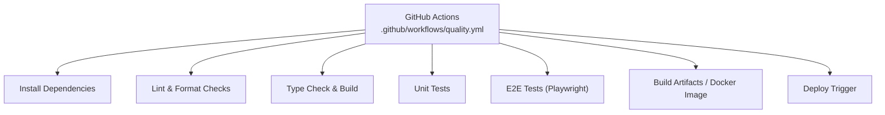
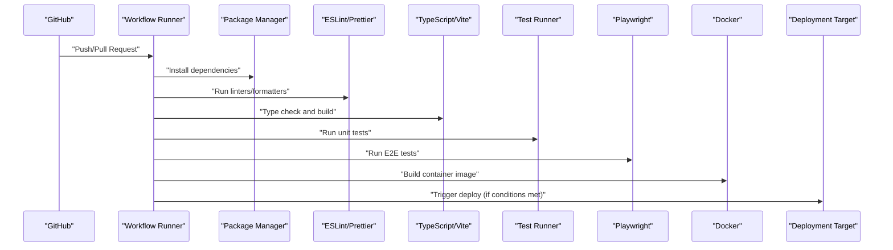
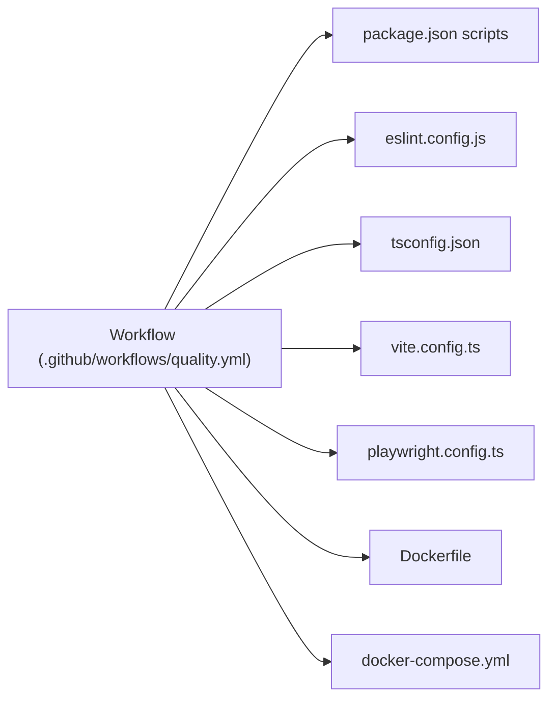

# CI/CD Pipeline Configuration

<cite>
**Referenced Files in This Document**
- [quality.yml](file://.github/workflows/quality.yml)
- [package.json](file://package.json)
- [playwright.config.ts](file://playwright.config.ts)
- [eslint.config.js](file://eslint.config.js)
- [Dockerfile](file://Dockerfile)
- [docker-compose.yml](file://docker-compose.yml)
- [tsconfig.json](file://tsconfig.json)
- [vite.config.ts](file://vite.config.ts)
</cite>

## Table of Contents
1. [Introduction](#introduction)
2. [Project Structure](#project-structure)
3. [Core Components](#core-components)
4. [Architecture Overview](#architecture-overview)
5. [Detailed Component Analysis](#detailed-component-analysis)
6. [Dependency Analysis](#dependency-analysis)
7. [Performance Considerations](#performance-considerations)
8. [Troubleshooting Guide](#troubleshooting-guide)
9. [Conclusion](#conclusion)
10. [Appendices](#appendices)

## Introduction
This document explains the CI/CD pipeline implementation using GitHub Actions, focusing on quality assurance, automated testing, code validation, build stages, linting, and deployment triggers. It also provides guidance for customizing the pipeline, adding jobs, configuring environment-specific deployments, error handling, notifications, monitoring, and local development workflows that mirror CI behavior.

The repository includes a GitHub Actions workflow file under .github/workflows/quality.yml and related configuration files (e.g., Playwright, ESLint, TypeScript, Vite, Docker). The following sections describe how these pieces fit together into a cohesive quality and delivery pipeline.

## Project Structure
At a high level, the CI/CD surface area is defined by:
- GitHub Actions workflow: orchestrates jobs and steps
- Linting and formatting rules: ESLint and Prettier
- Type checking and build tooling: TypeScript and Vite
- End-to-end tests: Playwright
- Containerization: Docker and docker-compose

[No sources needed since this diagram shows conceptual workflow, not actual code structure]

## Core Components
- Workflow orchestration: The GitHub Actions workflow defines jobs, runners, caching, matrix strategies, and step sequences.
- Code quality: ESLint enforces style and correctness; Prettier ensures consistent formatting.
- Type safety and build: TypeScript compiler validates types; Vite builds assets and bundles.
- Testing: Unit tests run via the test runner configured in package scripts; E2E tests use Playwright.
- Containerization: Dockerfile builds an image; docker-compose supports local or CI container runs.

Key responsibilities:
- Validate code changes early (lint/type checks)
- Run comprehensive tests (unit + e2e)
- Produce reproducible artifacts (build output or images)
- Gate deployments on passing quality gates

**Section sources**
- [quality.yml](file://.github/workflows/quality.yml)
- [eslint.config.js](file://eslint.config.js)
- [tsconfig.json](file://tsconfig.json)
- [vite.config.ts](file://vite.config.ts)
- [playwright.config.ts](file://playwright.config.ts)
- [Dockerfile](file://Dockerfile)
- [docker-compose.yml](file://docker-compose.yml)
- [package.json](file://package.json)

## Architecture Overview
The pipeline follows a staged approach:
- Install and cache dependencies
- Lint and format
- Type check and build
- Test (unit and e2e)
- Build artifacts or container image
- Deploy trigger (conditional on branch/tag)

[No sources needed since this diagram shows conceptual workflow, not actual code structure]

## Detailed Component Analysis

### Quality Assurance Workflow (GitHub Actions)
The workflow coordinates multiple jobs/steps:
- Environment setup: Node/Bun runtime selection, OS matrix if applicable
- Dependency management: install and cache node_modules/bun lockfiles
- Code quality: lint and format checks
- Build: type check and asset build
- Tests: unit and e2e execution
- Artifacts: upload build outputs or images
- Deployment: conditional triggers based on branches/tags

Customization tips:
- Add new jobs by duplicating existing job blocks and adjusting steps
- Use matrix strategy to test across Node versions or platforms
- Cache dependencies to speed up subsequent runs
- Use secrets for sensitive configuration during deploy

Error handling and notifications:
- Configure failure notifications (e.g., Slack/email) per job
- Persist logs and artifacts for failed runs
- Use continue-on-error selectively for non-blocking tasks

Monitoring:
- Track run duration, success rate, and flaky tests
- Use GitHub Actions artifacts and logs for diagnostics

**Section sources**
- [quality.yml](file://.github/workflows/quality.yml)

### Automated Testing Integration
- Unit tests: Executed via the test script defined in package.json. Ensure coverage thresholds are enforced where applicable.
- E2E tests: Playwright configuration drives browser provisioning, timeouts, and reporting.

Best practices:
- Isolate test environments and seed data
- Parallelize test suites when possible
- Capture screenshots/videos on failures
- Publish test reports as artifacts

**Section sources**
- [playwright.config.ts](file://playwright.config.ts)
- [package.json](file://package.json)

### Code Validation Processes
- Linting: ESLint config defines rules and plugins for static analysis.
- Formatting: Prettier ensures consistent code style.
- Type checking: TypeScript validates types before build.
- Build validation: Vite compiles assets and verifies bundling.

Recommendations:
- Fail fast on lint/type errors
- Enforce pre-commit hooks locally to mirror CI
- Centralize shared configs to reduce duplication

**Section sources**
- [eslint.config.js](file://eslint.config.js)
- [tsconfig.json](file://tsconfig.json)
- [vite.config.ts](file://vite.config.ts)

### Build Pipeline Stages
Stages typically include:
- Prepare: install dependencies and caches
- Validate: lint, format, type check
- Build: compile and bundle assets
- Test: unit and e2e
- Package: create artifacts or images
- Deploy: conditional release

Optimization:
- Cache dependencies and build caches
- Split heavy jobs into parallel jobs
- Use lightweight runners for simple checks

**Section sources**
- [quality.yml](file://.github/workflows/quality.yml)
- [vite.config.ts](file://vite.config.ts)
- [package.json](file://package.json)

### Test Execution
- Unit tests: run via npm/yarn/bun test command
- E2E tests: run via Playwright with appropriate browsers and headless mode
- Reporting: generate HTML/JUnit reports and upload as artifacts

Reliability:
- Stabilize flaky tests with retries and better selectors
- Use dedicated test databases/services when needed

**Section sources**
- [playwright.config.ts](file://playwright.config.ts)
- [package.json](file://package.json)

### Linting and Formatting
- ESLint: enforce coding standards and catch potential bugs
- Prettier: ensure consistent formatting across the codebase

Integration:
- Run both in CI and locally
- Auto-fix on commit via pre-commit hooks (optional)

**Section sources**
- [eslint.config.js](file://eslint.config.js)

### Deployment Triggers
Common triggers:
- Push to main/release branches
- Tagged releases (e.g., v*)
- Manual workflow dispatch

Environment-specific configuration:
- Use environment variables and secrets per environment
- Separate staging and production jobs
- Guardrails: require approvals for production

**Section sources**
- [quality.yml](file://.github/workflows/quality.yml)

### Containerization and Artifacts
- Dockerfile: define multi-stage builds for smaller images and faster CI
- docker-compose: orchestrate services for local/dev and CI integration tests
- Artifacts: upload build outputs for traceability and rollback

**Section sources**
- [Dockerfile](file://Dockerfile)
- [docker-compose.yml](file://docker-compose.yml)

### Customizing the Pipeline
Examples:
- Add a new job for security scanning or dependency audits
- Introduce a performance regression test stage
- Add a preview deployment for pull requests
- Configure artifact retention policies

Guidance:
- Keep jobs small and focused
- Share reusable actions or composite actions for repeated logic
- Use environment protection rules for critical targets

[No sources needed since this section provides general guidance]

### Error Handling, Notifications, and Monitoring
- Error handling: fail fast on critical steps; capture logs and artifacts
- Notifications: integrate Slack, email, or issue creation on failure
- Monitoring: track run metrics, flakiness, and bottlenecks

[No sources needed since this section provides general guidance]

### Local Development Mirroring CI
To mirror CI locally:
- Install dependencies using the same manager as CI
- Run linters and formatters
- Execute type checks and build
- Run unit and e2e tests with the same flags as CI
- Optionally build Docker images and compose services

Benefits:
- Catch issues earlier
- Reduce CI feedback loops
- Improve developer experience

[No sources needed since this section provides general guidance]

## Dependency Analysis
The pipeline depends on:
- Runtime and package manager (Node/Bun)
- Tooling packages (ESLint, Prettier, TypeScript, Vite, Playwright)
- Optional services for E2E (browser binaries, databases)
- Secrets and environment variables for deployment

**Diagram sources**
- [quality.yml](file://.github/workflows/quality.yml)
- [package.json](file://package.json)
- [eslint.config.js](file://eslint.config.js)
- [tsconfig.json](file://tsconfig.json)
- [vite.config.ts](file://vite.config.ts)
- [playwright.config.ts](file://playwright.config.ts)
- [Dockerfile](file://Dockerfile)
- [docker-compose.yml](file://docker-compose.yml)

**Section sources**
- [quality.yml](file://.github/workflows/quality.yml)
- [package.json](file://package.json)
- [eslint.config.js](file://eslint.config.js)
- [tsconfig.json](file://tsconfig.json)
- [vite.config.ts](file://vite.config.ts)
- [playwright.config.ts](file://playwright.config.ts)
- [Dockerfile](file://Dockerfile)
- [docker-compose.yml](file://docker-compose.yml)

## Performance Considerations
- Cache dependencies and build caches to reduce install/build times
- Parallelize independent jobs (lint, type-check, build, test)
- Use matrix builds sparingly; prefer targeted matrices
- Limit artifact sizes; only retain necessary outputs
- Optimize E2E tests: isolate scenarios, reuse state, avoid unnecessary waits

[No sources needed since this section provides general guidance]

## Troubleshooting Guide
Common issues and resolutions:
- Flaky E2E tests: stabilize selectors, add retries, increase timeouts, isolate resources
- Slow installs: enable dependency caching, pin versions, use lockfiles
- Build failures: validate TypeScript and Vite configs; inspect build logs
- Permission issues: verify secrets and environment variables
- Resource limits: adjust runner size or split heavy jobs

Diagnostic steps:
- Download artifacts and logs from failed runs
- Reproduce locally with the same commands used in CI
- Enable verbose logging for problematic steps

**Section sources**
- [playwright.config.ts](file://playwright.config.ts)
- [vite.config.ts](file://vite.config.ts)
- [Dockerfile](file://Dockerfile)

## Conclusion
This CI/CD pipeline integrates code quality, type safety, building, and testing into a reliable automation flow. By leveraging GitHub Actions, ESLint, TypeScript, Vite, Playwright, and Docker, teams can maintain high standards, accelerate feedback, and safely deliver changes. Customize the workflow to match your team’s needs, adopt best practices for reliability and performance, and mirror CI locally to improve developer productivity.

## Appendices

### Example: Adding a New Job
- Duplicate an existing job block in the workflow
- Adjust steps for the new task (e.g., security audit, performance tests)
- Add caching and artifact uploads as needed
- Gate on required checks if it affects deployment

[No sources needed since this section provides general guidance]

### Example: Environment-Specific Deployments
- Define separate environments (staging, production)
- Use environment protection rules and approvals
- Inject environment-specific secrets and variables
- Conditionally run deploy jobs based on branch/tag

[No sources needed since this section provides general guidance]