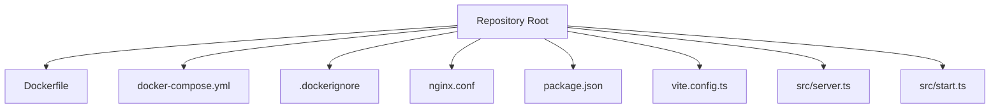
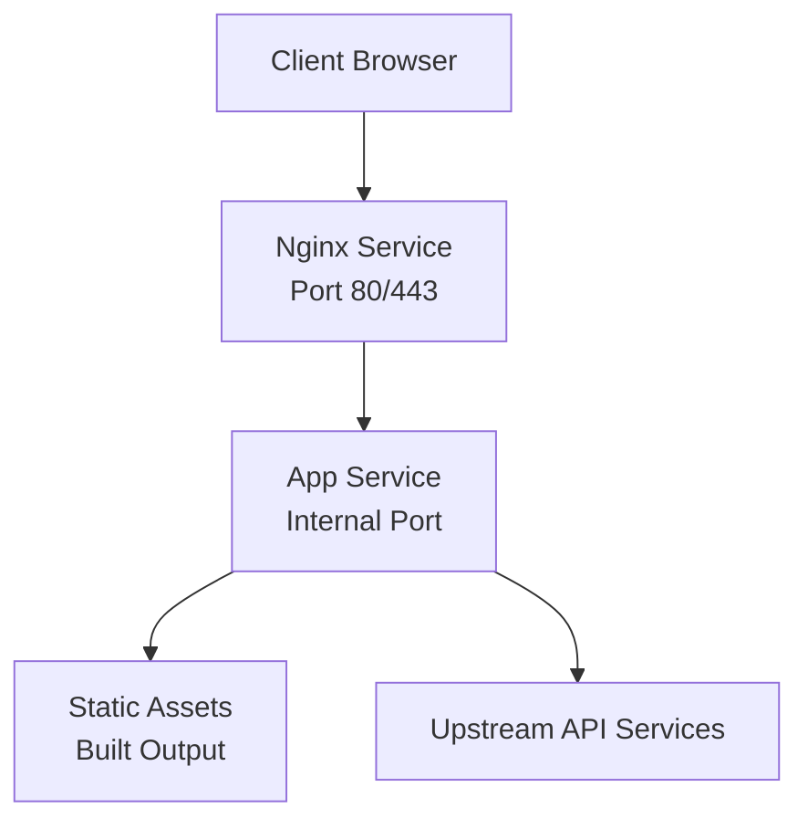
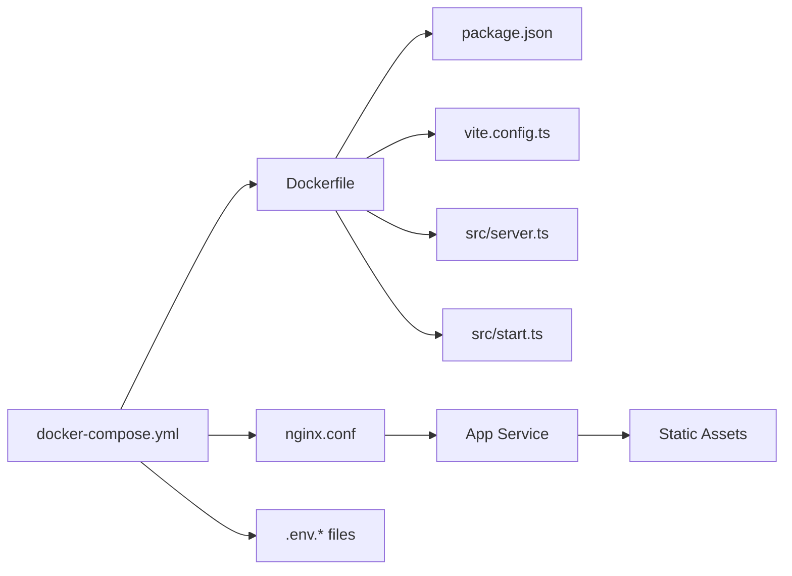

# Containerization with Docker

<cite>
**Referenced Files in This Document**
- [Dockerfile](file://Dockerfile)
- [docker-compose.yml](file://docker-compose.yml)
- [.dockerignore](file://.dockerignore)
- [nginx.conf](file://nginx.conf)
- [package.json](file://package.json)
- [vite.config.ts](file://vite.config.ts)
- [src/server.ts](file://src/server.ts)
- [src/start.ts](file://src/start.ts)
</cite>

## Table of Contents
1. [Introduction](#introduction)
2. [Project Structure](#project-structure)
3. [Core Components](#core-components)
4. [Architecture Overview](#architecture-overview)
5. [Detailed Component Analysis](#detailed-component-analysis)
6. [Dependency Analysis](#dependency-analysis)
7. [Performance Considerations](#performance-considerations)
8. [Troubleshooting Guide](#troubleshooting-guide)
9. [Conclusion](#conclusion)
10. [Appendices](#appendices)

## Introduction
This document explains how SpareAutomation is containerized using Docker and docker-compose. It covers the multi-stage build process, image optimization strategies, runtime configuration, local development and staging orchestration, environment variable management, security best practices, networking, data persistence, lifecycle management, troubleshooting, and performance tuning. The goal is to help you build, run, and operate containers reliably across environments.

## Project Structure
The repository includes key containerization artifacts at the root:
- Dockerfile: Multi-stage build for production images
- docker-compose.yml: Local development and staging service orchestration
- .dockerignore: Build context filtering for smaller images and faster builds
- nginx.conf: Reverse proxy configuration used by the web server container
- Application entrypoints and build scripts are defined in package.json and referenced by the Dockerfile and compose file

**Diagram sources**
- [Dockerfile:1-200](file://Dockerfile#L1-L200)
- [docker-compose.yml:1-200](file://docker-compose.yml#L1-L200)
- [.dockerignore:1-200](file://.dockerignore#L1-L200)
- [nginx.conf:1-200](file://nginx.conf#L1-L200)
- [package.json:1-200](file://package.json#L1-L200)
- [vite.config.ts:1-200](file://vite.config.ts#L1-L200)
- [src/server.ts:1-200](file://src/server.ts#L1-L200)
- [src/start.ts:1-200](file://src/start.ts#L1-L200)

**Section sources**
- [Dockerfile:1-200](file://Dockerfile#L1-L200)
- [docker-compose.yml:1-200](file://docker-compose.yml#L1-L200)
- [.dockerignore:1-200](file://.dockerignore#L1-L200)
- [nginx.conf:1-200](file://nginx.conf#L1-L200)
- [package.json:1-200](file://package.json#L1-L200)
- [vite.config.ts:1-200](file://vite.config.ts#L1-L200)
- [src/server.ts:1-200](file://src/server.ts#L1-L200)
- [src/start.ts:1-200](file://src/start.ts#L1-L200)

## Core Components
- Dockerfile (multi-stage build):
  - Stage 1: Install dependencies and build static assets
  - Stage 2: Minimal runtime image that serves the application and proxies requests via Nginx
  - Optimizations include dependency caching layers, selective COPY, and a small final image
- docker-compose.yml:
  - Defines services for the app and Nginx
  - Configures ports, volumes, environment variables, and health checks
  - Supports local development and staging profiles or overrides
- .dockerignore:
  - Excludes unnecessary files from the build context to reduce image size and speed up builds
- nginx.conf:
  - Reverse proxy rules, static asset handling, and upstream pointing to the app service
- Application entrypoints:
  - src/server.ts and src/start.ts define the runtime behavior and startup sequence

Key responsibilities:
- Build-time: dependency resolution, asset compilation, and artifact packaging
- Runtime: serving static content, proxying API calls, and exposing HTTP endpoints
- Orchestration: service discovery, port mapping, volume mounts, and env var injection

**Section sources**
- [Dockerfile:1-200](file://Dockerfile#L1-L200)
- [docker-compose.yml:1-200](file://docker-compose.yml#L1-L200)
- [.dockerignore:1-200](file://.dockerignore#L1-L200)
- [nginx.conf:1-200](file://nginx.conf#L1-L200)
- [src/server.ts:1-200](file://src/server.ts#L1-L200)
- [src/start.ts:1-200](file://src/start.ts#L1-L200)

## Architecture Overview
The container architecture uses two primary services:
- App service: runs the compiled application and exposes an internal HTTP port
- Nginx service: reverse proxy that terminates TLS (optional), serves static assets, and forwards API traffic to the app

**Diagram sources**
- [docker-compose.yml:1-200](file://docker-compose.yml#L1-L200)
- [nginx.conf:1-200](file://nginx.conf#L1-L200)
- [Dockerfile:1-200](file://Dockerfile#L1-L200)

## Detailed Component Analysis

### Dockerfile: Multi-stage Build and Image Optimization
- Build stage:
  - Installs dependencies and compiles assets
  - Uses layer caching by copying lockfiles first
  - Produces optimized static output for production
- Runtime stage:
  - Copies only necessary artifacts from the build stage
  - Runs a minimal runtime image
  - Sets non-root user where applicable
  - Exposes the correct port and defines health checks

Optimization strategies:
- Layer ordering to maximize cache hits
- Selective COPY to avoid including dev-only files
- Use of .dockerignore to prune large directories
- Pinning base image versions for reproducibility

Security considerations:
- Non-root execution
- Minimal attack surface with slim base images
- Avoid embedding secrets; use runtime env vars or secret managers

**Section sources**
- [Dockerfile:1-200](file://Dockerfile#L1-L200)
- [.dockerignore:1-200](file://.dockerignore#L1-L200)

### docker-compose.yml: Service Orchestration
- Services:
  - app: builds from the Dockerfile and runs the application
  - nginx: reverse proxy configured via nginx.conf
- Networking:
  - Internal Docker network for inter-service communication
  - Host port mappings for local access
- Volumes:
  - Development hot reload mounts for source code
  - Persistent volumes for logs or uploads if needed
- Environment variables:
  - Injected via compose file or external env files
  - Used to configure runtime behavior and feature flags

Lifecycle commands:
- Start services: docker compose up
- Run detached: docker compose up -d
- Stop services: docker compose down
- View logs: docker compose logs -f
- Exec into container: docker compose exec app sh

**Section sources**
- [docker-compose.yml:1-200](file://docker-compose.yml#L1-L200)

### nginx.conf: Reverse Proxy Configuration
- Listens on standard HTTP/HTTPS ports
- Proxies API routes to the app service
- Serves static assets directly for performance
- Includes headers for security and caching as appropriate

Best practices:
- Keep proxy timeouts reasonable
- Enable gzip/brotli compression when suitable
- Add security headers (HSTS, X-Frame-Options, etc.)

**Section sources**
- [nginx.conf:1-200](file://nginx.conf#L1-L200)

### Application Entrypoints: src/server.ts and src/start.ts
- src/server.ts:
  - Initializes the server, registers middleware, and binds to the internal port
- src/start.ts:
  - Orchestrates startup tasks such as loading configuration and connecting to external services

Runtime configuration:
- Reads environment variables for database URLs, API keys, and feature toggles
- Validates required settings at startup and fails fast if misconfigured

**Section sources**
- [src/server.ts:1-200](file://src/server.ts#L1-L200)
- [src/start.ts:1-200](file://src/start.ts#L1-L200)

### Build Scripts and Tooling: package.json and vite.config.ts
- package.json:
  - Defines build, start, and test scripts consumed by the Dockerfile and compose setup
- vite.config.ts:
  - Controls asset bundling and output paths used by the build stage

Integration points:
- Ensure build outputs match what the runtime expects
- Align environment-specific configurations between build and runtime

**Section sources**
- [package.json:1-200](file://package.json#L1-L200)
- [vite.config.ts:1-200](file://vite.config.ts#L1-L200)

### Build and Run Workflows

#### Building Custom Images
- Build with default tags:
  - docker build -t spareautomation/app:latest .
- Build with custom tag:
  - docker build -t spareautomation/app:v1.2.3 .
- Build specific stages (if applicable):
  - docker build --target runtime -t spareautomation/app:runtime .

Running Containers Locally
- Using docker run:
  - docker run -p 8080:80 --env-file .env.local spareautomation/app:latest
- Using docker compose:
  - docker compose up
  - docker compose up -d
  - docker compose down

Managing Lifecycle
- Inspect logs:
  - docker compose logs -f app
- Restart services:
  - docker compose restart
- Scale horizontally (if applicable):
  - docker compose up --scale app=2

Environment Variable Management
- Provide per-environment files:
  - .env.development
  - .env.staging
- Compose can load them automatically or explicitly via env_file directives
- Validate required variables at startup to fail fast

**Section sources**
- [Dockerfile:1-200](file://Dockerfile#L1-L200)
- [docker-compose.yml:1-200](file://docker-compose.yml#L1-L200)
- [package.json:1-200](file://package.json#L1-L200)

### Security Best Practices
- Use minimal base images and pin versions
- Run as non-root user inside containers
- Scan images for vulnerabilities regularly
- Do not bake secrets into images; inject at runtime
- Limit capabilities and resources via compose or orchestrator policies
- Enable HTTPS termination at the edge (Nginx) and enforce secure headers

Network Configuration
- Restrict exposed ports to only those required
- Use internal networks for inter-service communication
- Configure firewall rules at host/cloud level

Data Persistence
- Mount persistent volumes for logs, uploads, or caches
- Ensure backups and rotation policies for persistent data

**Section sources**
- [Dockerfile:1-200](file://Dockerfile#L1-L200)
- [docker-compose.yml:1-200](file://docker-compose.yml#L1-L200)
- [nginx.conf:1-200](file://nginx.conf#L1-L200)

### Performance Optimization Tips
- Leverage multi-stage builds to minimize final image size
- Order Dockerfile instructions to maximize layer caching
- Use .dockerignore to exclude dev dependencies and large folders
- Enable compression and caching in Nginx for static assets
- Tune connection limits and worker processes in Nginx based on workload
- Monitor resource usage and set CPU/memory limits in compose

[No sources needed since this section provides general guidance]

## Dependency Analysis
The following diagram shows how container components depend on each other and on application artifacts.

**Diagram sources**
- [Dockerfile:1-200](file://Dockerfile#L1-L200)
- [docker-compose.yml:1-200](file://docker-compose.yml#L1-L200)
- [nginx.conf:1-200](file://nginx.conf#L1-L200)
- [package.json:1-200](file://package.json#L1-L200)
- [vite.config.ts:1-200](file://vite.config.ts#L1-L200)
- [src/server.ts:1-200](file://src/server.ts#L1-L200)
- [src/start.ts:1-200](file://src/start.ts#L1-L200)

**Section sources**
- [Dockerfile:1-200](file://Dockerfile#L1-L200)
- [docker-compose.yml:1-200](file://docker-compose.yml#L1-L200)
- [nginx.conf:1-200](file://nginx.conf#L1-L200)
- [package.json:1-200](file://package.json#L1-L200)
- [vite.config.ts:1-200](file://vite.config.ts#L1-L200)
- [src/server.ts:1-200](file://src/server.ts#L1-L200)
- [src/start.ts:1-200](file://src/start.ts#L1-L200)

## Performance Considerations
- Prefer multi-stage builds to keep runtime images lean
- Cache dependency installs by isolating lockfile copies before copying full source
- Exclude node_modules, tests, and docs from the build context via .dockerignore
- Use efficient Nginx configuration for static assets and proxying
- Set appropriate resource limits and monitor utilization
- Consider horizontal scaling behind a load balancer for high traffic

[No sources needed since this section provides general guidance]

## Troubleshooting Guide
Common issues and resolutions:
- Build failures due to missing dependencies:
  - Verify lockfiles are present and correctly copied in the build stage
  - Check .dockerignore excludes that might remove required files
- Port conflicts locally:
  - Adjust host port mappings in docker-compose.yml
- Environment variables not applied:
  - Confirm .env files are loaded and variables are prefixed as expected
  - Validate required variables exist at startup
- Nginx 502 Bad Gateway:
  - Ensure the app service is healthy and reachable on the internal port
  - Review upstream configuration in nginx.conf
- Slow builds:
  - Improve layer caching order and prune unused build context
- High memory usage:
  - Set memory limits in compose and tune application concurrency

Operational tips:
- Use docker compose logs -f to inspect real-time logs
- Use docker compose exec to debug inside running containers
- Validate images with vulnerability scanners before deployment

**Section sources**
- [docker-compose.yml:1-200](file://docker-compose.yml#L1-L200)
- [nginx.conf:1-200](file://nginx.conf#L1-L200)
- [.dockerignore:1-200](file://.dockerignore#L1-L200)

## Conclusion
SpareAutomation’s containerization leverages a multi-stage Dockerfile for optimized images, a clear separation of concerns between app and Nginx services, and a robust docker-compose setup for local and staging environments. By following the security, networking, and performance recommendations outlined here, teams can reliably build, deploy, and operate containers across their workflows.

[No sources needed since this section summarizes without analyzing specific files]

## Appendices

### Quick Commands Reference
- Build image:
  - docker build -t spareautomation/app:latest .
- Run locally:
  - docker compose up
- Detached mode:
  - docker compose up -d
- Stop and clean up:
  - docker compose down
- View logs:
  - docker compose logs -f
- Execute into app:
  - docker compose exec app sh

**Section sources**
- [docker-compose.yml:1-200](file://docker-compose.yml#L1-L200)
- [Dockerfile:1-200](file://Dockerfile#L1-L200)