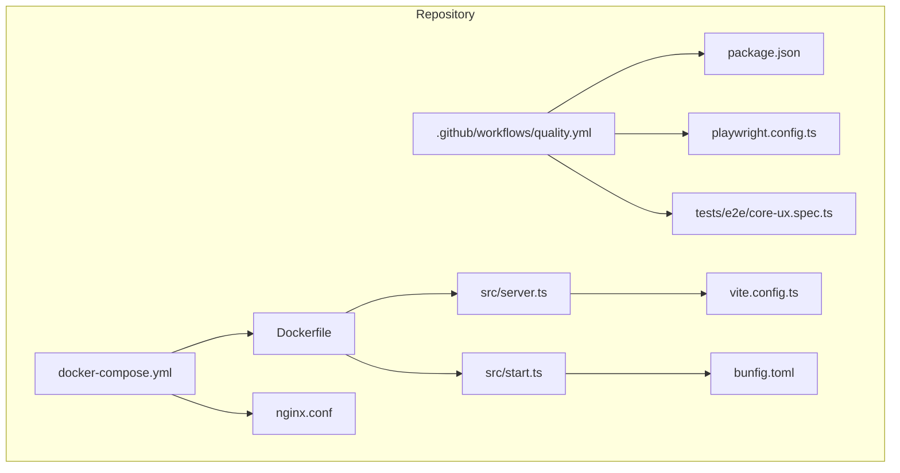
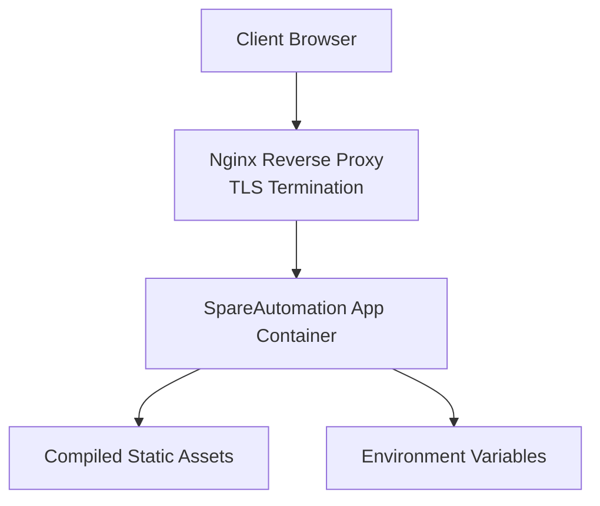
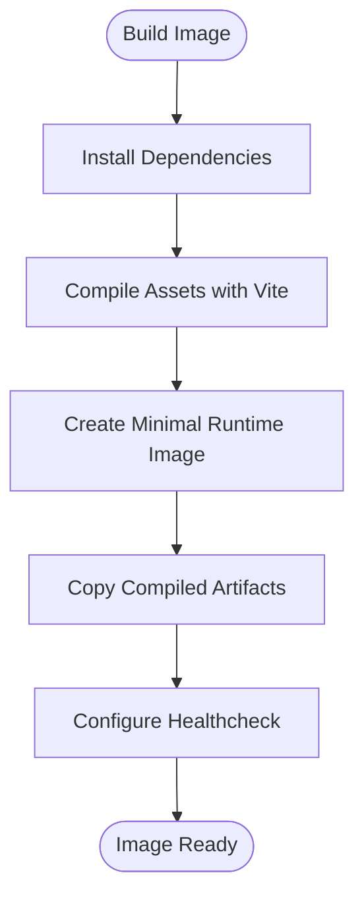
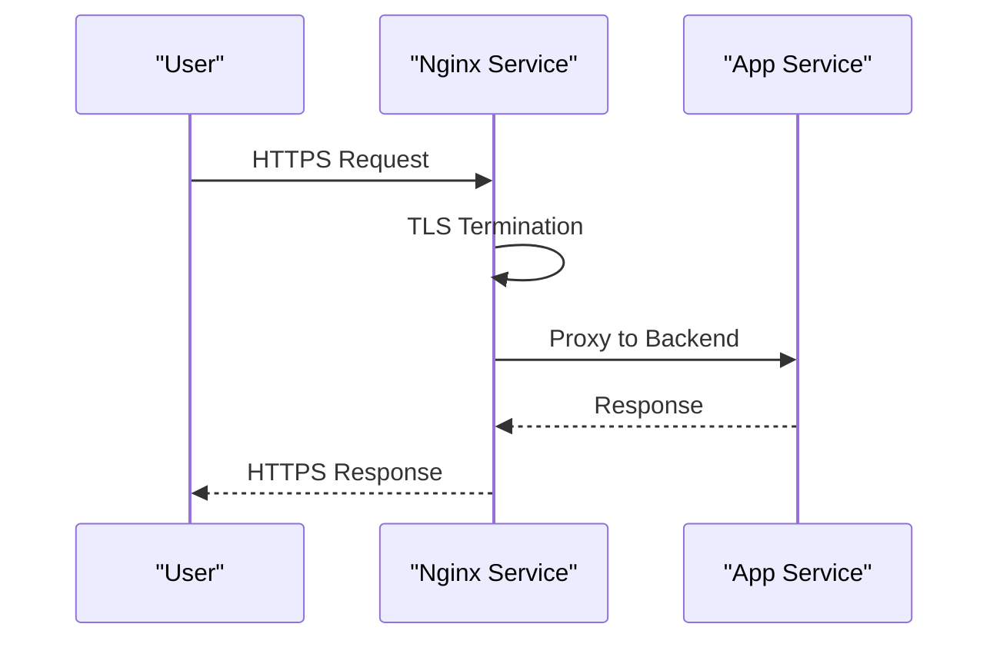
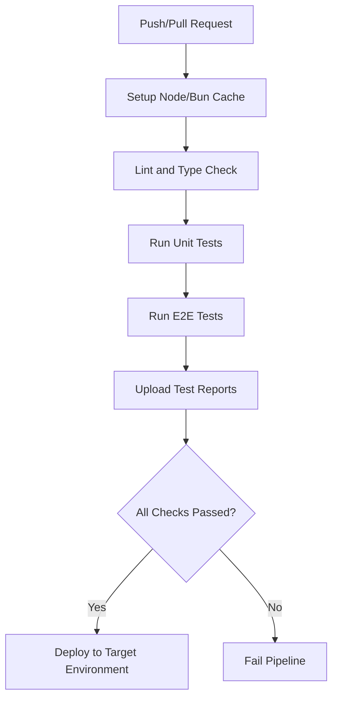
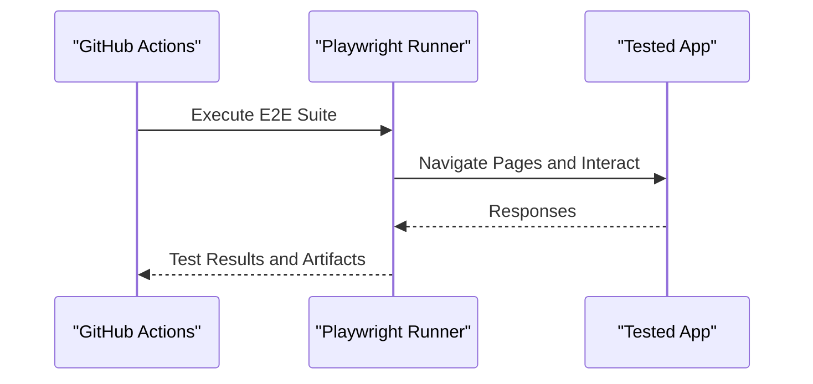
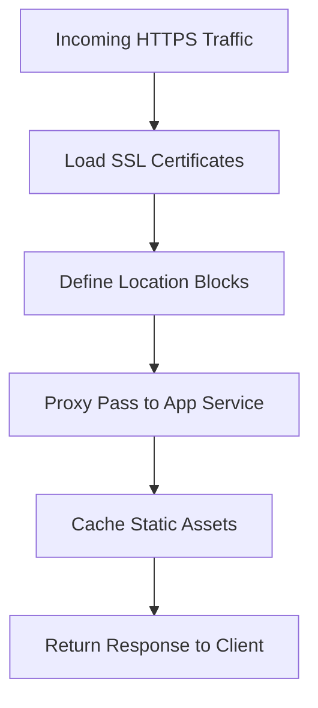
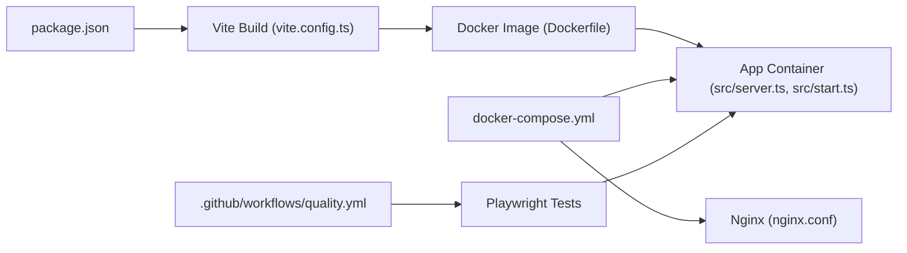

# Deployment & DevOps

<cite>
**Referenced Files in This Document**
- [Dockerfile](file://Dockerfile)
- [docker-compose.yml](file://docker-compose.yml)
- [nginx.conf](file://nginx.conf)
- [.github/workflows/quality.yml](file://.github/workflows/quality.yml)
- [package.json](file://package.json)
- [playwright.config.ts](file://playwright.config.ts)
- [tests/e2e/core-ux.spec.ts](file://tests/e2e/core-ux.spec.ts)
- [src/server.ts](file://src/server.ts)
- [src/start.ts](file://src/start.ts)
- [vite.config.ts](file://vite.config.ts)
- [bunfig.toml](file://bunfig.toml)
</cite>

## Table of Contents
1. [Introduction](#introduction)
2. [Project Structure](#project-structure)
3. [Core Components](#core-components)
4. [Architecture Overview](#architecture-overview)
5. [Detailed Component Analysis](#detailed-component-analysis)
6. [Dependency Analysis](#dependency-analysis)
7. [Performance Considerations](#performance-considerations)
8. [Troubleshooting Guide](#troubleshooting-guide)
9. [Conclusion](#conclusion)
10. [Appendices](#appendices)

## Introduction
This document provides comprehensive deployment and DevOps guidance for SpareAutomation. It explains containerization with Docker, orchestration via docker-compose, CI/CD configuration, automated testing integration, and production deployment patterns. It also covers environment variable management, reverse proxy configuration with nginx, monitoring and logging strategies, error tracking setup, performance monitoring, security considerations (SSL, isolation, secrets), scaling and load balancing, disaster recovery procedures, and workflows for local development, staging, and production.

## Project Structure
The repository includes essential artifacts for building, running, and deploying the application:
- Container image definition and runtime entrypoints
- Compose-based service orchestration
- Nginx reverse proxy configuration
- GitHub Actions workflow for quality checks
- E2E test configuration and tests
- Build tooling and server startup scripts

**Diagram sources**
- [Dockerfile:1-200](file://Dockerfile#L1-L200)
- [docker-compose.yml:1-200](file://docker-compose.yml#L1-L200)
- [nginx.conf:1-200](file://nginx.conf#L1-L200)
- [.github/workflows/quality.yml:1-200](file://.github/workflows/quality.yml#L1-L200)
- [package.json:1-200](file://package.json#L1-L200)
- [playwright.config.ts:1-200](file://playwright.config.ts#L1-L200)
- [tests/e2e/core-ux.spec.ts:1-200](file://tests/e2e/core-ux.spec.ts#L1-L200)
- [src/server.ts:1-200](file://src/server.ts#L1-L200)
- [src/start.ts:1-200](file://src/start.ts#L1-L200)
- [vite.config.ts:1-200](file://vite.config.ts#L1-L200)
- [bunfig.toml:1-200](file://bunfig.toml#L1-L200)

**Section sources**
- [Dockerfile:1-200](file://Dockerfile#L1-L200)
- [docker-compose.yml:1-200](file://docker-compose.yml#L1-L200)
- [nginx.conf:1-200](file://nginx.conf#L1-L200)
- [.github/workflows/quality.yml:1-200](file://.github/workflows/quality.yml#L1-L200)
- [package.json:1-200](file://package.json#L1-L200)
- [playwright.config.config.ts:1-200](file://playwright.config.ts#L1-L200)
- [tests/e2e/core-ux.spec.ts:1-200](file://tests/e2e/core-ux.spec.ts#L1-L200)
- [src/server.ts:1-200](file://src/server.ts#L1-L200)
- [src/start.ts:1-200](file://src/start.ts#L1-L200)
- [vite.config.ts:1-200](file://vite.config.ts#L1-L200)
- [bunfig.toml:1-200](file://bunfig.toml#L1-L200)

## Core Components
- Container Image Definition: The Dockerfile defines how to build a production-ready image, including dependency installation, asset compilation, and runtime configuration.
- Orchestration: docker-compose.yml defines services for the application server and nginx reverse proxy, along with networking and volume mounts.
- Reverse Proxy: nginx.conf configures HTTP/HTTPS termination, static assets caching, and proxying to the backend service.
- CI/CD Pipeline: .github/workflows/quality.yml runs linting, type checks, unit tests, and E2E tests on pull requests and pushes.
- Testing: Playwright is configured for E2E testing; tests are executed within CI and locally.
- Server Entrypoints: src/server.ts and src/start.ts define the runtime behavior and initialization logic.
- Build Configuration: vite.config.ts controls asset bundling and optimization; bunfig.toml configures the Bun runtime.

**Section sources**
- [Dockerfile:1-200](file://Dockerfile#L1-L200)
- [docker-compose.yml:1-200](file://docker-compose.yml#L1-L200)
- [nginx.conf:1-200](file://nginx.conf#L1-L200)
- [.github/workflows/quality.yml:1-200](file://.github/workflows/quality.yml#L1-L200)
- [playwright.config.ts:1-200](file://playwright.config.ts#L1-L200)
- [tests/e2e/core-ux.spec.ts:1-200](file://tests/e2e/core-ux.spec.ts#L1-L200)
- [src/server.ts:1-200](file://src/server.ts#L1-L200)
- [src/start.ts:1-200](file://src/start.ts#L1-L200)
- [vite.config.ts:1-200](file://vite.config.ts#L1-L200)
- [bunfig.toml:1-200](file://bunfig.toml#L1-L200)

## Architecture Overview
The production architecture consists of:
- Nginx as a reverse proxy handling TLS termination and routing traffic to the application container.
- Application container serving the compiled frontend and any server-side endpoints.
- Optional external services (database, cache) managed by docker-compose or an orchestrator.

**Diagram sources**
- [nginx.conf:1-200](file://nginx.conf#L1-L200)
- [docker-compose.yml:1-200](file://docker-compose.yml#L1-L200)
- [Dockerfile:1-200](file://Dockerfile#L1-L200)

## Detailed Component Analysis

### Containerization Strategy (Docker)
- Multi-stage build recommended to minimize image size and reduce attack surface.
- Install dependencies using the package manager defined in package.json.
- Compile assets with Vite to produce optimized static files.
- Run the application using Bun runtime configured in bunfig.toml.
- Expose only necessary ports and set healthcheck endpoints if available.

**Diagram sources**
- [Dockerfile:1-200](file://Dockerfile#L1-L200)
- [package.json:1-200](file://package.json#L1-L200)
- [vite.config.ts:1-200](file://vite.config.ts#L1-L200)
- [bunfig.toml:1-200](file://bunfig.toml#L1-L200)

**Section sources**
- [Dockerfile:1-200](file://Dockerfile#L1-L200)
- [package.json:1-200](file://package.json#L1-L200)
- [vite.config.ts:1-200](file://vite.config.ts#L1-L200)
- [bunfig.toml:1-200](file://bunfig.toml#L1-L200)

### Orchestration with docker-compose
- Define services for the app and nginx.
- Map ports for HTTP/HTTPS exposure.
- Mount volumes for logs and persistent data if needed.
- Use environment variables for configuration and secrets.
- Add restart policies and resource limits for resilience.

**Diagram sources**
- [docker-compose.yml:1-200](file://docker-compose.yml#L1-L200)
- [nginx.conf:1-200](file://nginx.conf#L1-L200)

**Section sources**
- [docker-compose.yml:1-200](file://docker-compose.yml#L1-L200)
- [nginx.conf:1-200](file://nginx.conf#L1-L200)

### Production Deployment Patterns
- Use immutable images built from version-controlled code.
- Separate environments (staging, production) via compose profiles or separate compose files.
- Manage environment variables through secure secret stores or platform-native mechanisms.
- Enable graceful shutdowns and rolling updates when supported by the orchestrator.

[No sources needed since this section provides general guidance]

### CI/CD Pipeline Configuration
- Trigger on push and pull request events.
- Cache dependencies to speed up builds.
- Run linting, type checking, unit tests, and E2E tests.
- Upload test reports and artifacts for debugging.
- Gate deployments on successful pipeline runs.

**Diagram sources**
- [.github/workflows/quality.yml:1-200](file://.github/workflows/quality.yml#L1-L200)
- [package.json:1-200](file://package.json#L1-L200)
- [playwright.config.ts:1-200](file://playwright.config.ts#L1-L200)
- [tests/e2e/core-ux.spec.ts:1-200](file://tests/e2e/core-ux.spec.ts#L1-L200)

**Section sources**
- [.github/workflows/quality.yml:1-200](file://.github/workflows/quality.yml#L1-L200)
- [package.json:1-200](file://package.json#L1-L200)
- [playwright.config.ts:1-200](file://playwright.config.ts#L1-L200)
- [tests/e2e/core-ux.spec.ts:1-200](file://tests/e2e/core-ux.spec.ts#L1-L200)

### Automated Testing Integration
- Configure Playwright for browser automation and cross-browser testing.
- Provide environment-specific base URLs for local, staging, and production.
- Capture screenshots and videos on failures for diagnostics.
- Integrate test execution into CI to enforce quality gates.

**Diagram sources**
- [playwright.config.ts:1-200](file://playwright.config.ts#L1-L200)
- [tests/e2e/core-ux.spec.ts:1-200](file://tests/e2e/core-ux.spec.ts#L1-L200)
- [.github/workflows/quality.yml:1-200](file://.github/workflows/quality.yml#L1-L200)

**Section sources**
- [playwright.config.ts:1-200](file://playwright.config.ts#L1-L200)
- [tests/e2e/core-ux.spec.ts:1-200](file://tests/e2e/core-ux.spec.ts#L1-L200)
- [.github/workflows/quality.yml:1-200](file://.github/workflows/quality.yml#L1-L200)

### Quality Assurance Processes
- Enforce consistent code style and formatting via linters and formatters.
- Perform static analysis and type checks before merging changes.
- Maintain a suite of E2E tests covering critical user journeys.
- Generate coverage reports and track trends over time.

[No sources needed since this section provides general guidance]

### Building Docker Images
- Ensure dependencies are installed and assets are compiled during the build stage.
- Use a minimal runtime image to reduce size and improve security posture.
- Set appropriate labels and metadata for traceability.
- Validate images locally before pushing to registries.

**Section sources**
- [Dockerfile:1-200](file://Dockerfile#L1-L200)
- [package.json:1-200](file://package.json#L1-L200)
- [vite.config.ts:1-200](file://vite.config.ts#L1-L200)

### Configuring Nginx Reverse Proxy
- Terminate SSL at nginx using certificates stored securely.
- Route API requests to the application service.
- Serve static assets efficiently with caching headers.
- Implement security headers and rate limiting where applicable.

**Diagram sources**
- [nginx.conf:1-200](file://nginx.conf#L1-L200)

**Section sources**
- [nginx.conf:1-200](file://nginx.conf#L1-L200)

### Managing Environment Variables
- Externalize all configuration via environment variables.
- Avoid hardcoding secrets; use platform secret managers or compose secret files.
- Provide defaults for non-sensitive settings and validate required variables at startup.
- Document all expected variables and their scopes.

**Section sources**
- [docker-compose.yml:1-200](file://docker-compose.yml#L1-L200)
- [src/server.ts:1-200](file://src/server.ts#L1-L200)
- [src/start.ts:1-200](file://src/start.ts#L1-L200)

### Monitoring and Logging Strategies
- Stream structured logs to stdout/stderr for collection by log aggregators.
- Include correlation IDs in logs for request tracing across services.
- Configure healthcheck endpoints for readiness and liveness probes.
- Export metrics (if applicable) for dashboards and alerting.

**Section sources**
- [src/server.ts:1-200](file://src/server.ts#L1-L200)
- [src/start.ts:1-200](file://src/start.ts#L1-L200)

### Error Tracking Setup
- Integrate error capture libraries to report unhandled exceptions and UI errors.
- Filter sensitive information from error payloads.
- Correlate errors with logs and traces for faster resolution.

**Section sources**
- [src/lib/error-capture.ts:1-200](file://src/lib/error-capture.ts#L1-L200)
- [src/lib/lovable-error-reporting.ts:1-200](file://src/lib/lovable-error-reporting.ts#L1-L200)

### Performance Monitoring
- Monitor key SLOs such as latency, throughput, and error rates.
- Instrument critical paths and business transactions.
- Use profiling tools to identify bottlenecks in CPU and memory usage.

[No sources needed since this section provides general guidance]

### Security Considerations
- SSL/TLS: Terminate at nginx with strong cipher suites and certificate rotation.
- Environment Isolation: Separate compose stacks per environment; restrict network access.
- Secret Management: Use secret files or platform-native secret stores; avoid committing secrets.
- Least Privilege: Run containers with non-root users and minimal capabilities.

**Section sources**
- [nginx.conf:1-200](file://nginx.conf#L1-L200)
- [docker-compose.yml:1-200](file://docker-compose.yml#L1-L200)
- [Dockerfile:1-200](file://Dockerfile#L1-L200)

### Scaling Strategies and Load Balancing
- Horizontal scaling: Run multiple app replicas behind nginx or an ingress controller.
- Stateless design: Store session state externally if needed; rely on shared caches.
- Auto-scaling: Configure orchestrator policies based on CPU/memory or custom metrics.
- Connection pooling: Tune database and upstream connection pools for high concurrency.

**Section sources**
- [docker-compose.yml:1-200](file://docker-compose.yml#L1-L200)
- [nginx.conf:1-200](file://nginx.conf#L1-L200)

### Disaster Recovery Procedures
- Regular backups: Schedule snapshots of databases and persistent volumes.
- Restore drills: Periodically test restoration procedures in isolated environments.
- Rollback strategy: Keep previous image versions and configuration revisions for quick rollback.
- RTO/RPO targets: Define acceptable recovery time and point objectives and align processes accordingly.

[No sources needed since this section provides general guidance]

### Local Development Setup
- Use docker-compose to run app and nginx locally with hot reload enabled.
- Provide local environment variables and mock external services.
- Run E2E tests against the local stack to validate integrations.

**Section sources**
- [docker-compose.yml:1-200](file://docker-compose.yml#L1-L200)
- [playwright.config.ts:1-200](file://playwright.config.ts#L1-L200)
- [tests/e2e/core-ux.spec.ts:1-200](file://tests/e2e/core-ux.spec.ts#L1-L200)

### Staging Environments
- Mirror production configuration with sanitized secrets.
- Automate deployments from main branch after passing CI checks.
- Run full regression suites and smoke tests before promotion.

**Section sources**
- [.github/workflows/quality.yml:1-200](file://.github/workflows/quality.yml#L1-L200)
- [docker-compose.yml:1-200](file://docker-compose.yml#L1-L200)

### Production Deployment Workflows
- Immutable artifact promotion: Promote tested images across environments.
- Blue/green or canary releases: Gradually shift traffic to new versions.
- Feature flags: Control feature rollout without redeployments.
- Post-deployment verification: Automated health checks and synthetic transactions.

[No sources needed since this section provides general guidance]

## Dependency Analysis
The following diagram shows key relationships among build, runtime, and orchestration components.

**Diagram sources**
- [package.json:1-200](file://package.json#L1-L200)
- [vite.config.ts:1-200](file://vite.config.ts#L1-L200)
- [Dockerfile:1-200](file://Dockerfile#L1-L200)
- [src/server.ts:1-200](file://src/server.ts#L1-L200)
- [src/start.ts:1-200](file://src/start.ts#L1-L200)
- [docker-compose.yml:1-200](file://docker-compose.yml#L1-L200)
- [nginx.conf:1-200](file://nginx.conf#L1-L200)
- [.github/workflows/quality.yml:1-200](file://.github/workflows/quality.yml#L1-L200)
- [playwright.config.ts:1-200](file://playwright.config.ts#L1-L200)

**Section sources**
- [package.json:1-200](file://package.json#L1-L200)
- [vite.config.ts:1-200](file://vite.config.ts#L1-L200)
- [Dockerfile:1-200](file://Dockerfile#L1-L200)
- [src/server.ts:1-200](file://src/server.ts#L1-L200)
- [src/start.ts:1-200](file://src/start.ts#L1-L200)
- [docker-compose.yml:1-200](file://docker-compose.yml#L1-L200)
- [nginx.conf:1-200](file://nginx.conf#L1-L200)
- [.github/workflows/quality.yml:1-200](file://.github/workflows/quality.yml#L1-L200)
- [playwright.config.ts:1-200](file://playwright.config.ts#L1-L200)

## Performance Considerations
- Optimize asset bundles and enable compression at the reverse proxy.
- Use efficient container runtimes and keep images small.
- Tune worker processes and connections in nginx and the application server.
- Leverage caching layers for frequently accessed resources.
- Profile and monitor under realistic load to identify bottlenecks.

[No sources needed since this section provides general guidance]

## Troubleshooting Guide
- Verify container health and logs for both app and nginx.
- Inspect CI job outputs and test artifacts for failing steps.
- Validate environment variables and secret mounts in each environment.
- Reproduce issues locally using docker-compose with identical configurations.

**Section sources**
- [docker-compose.yml:1-200](file://docker-compose.yml#L1-L200)
- [nginx.conf:1-200](file://nginx.conf#L1-L200)
- [.github/workflows/quality.yml:1-200](file://.github/workflows/quality.yml#L1-L200)

## Conclusion
By adopting the practices outlined here—containerized builds, orchestrated services, robust CI/CD, comprehensive testing, secure configuration, and proactive monitoring—you can deploy SpareAutomation reliably across local, staging, and production environments while maintaining high performance and security standards.

## Appendices

### Example Commands and Workflows
- Build and run locally with docker-compose.
- Execute E2E tests against the local stack.
- Push images to a registry and deploy to target environments.

[No sources needed since this section provides general guidance]