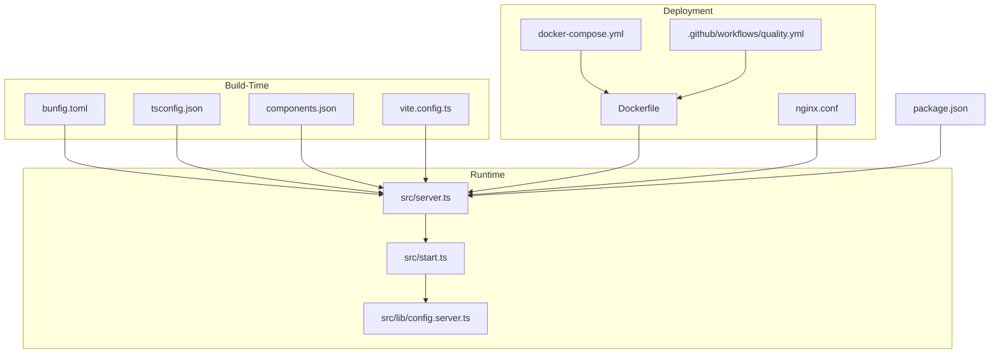
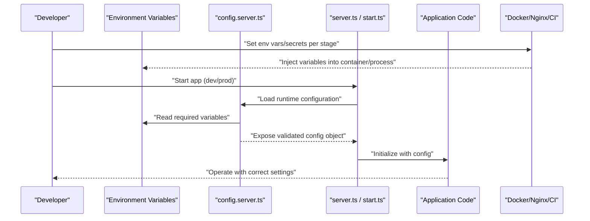
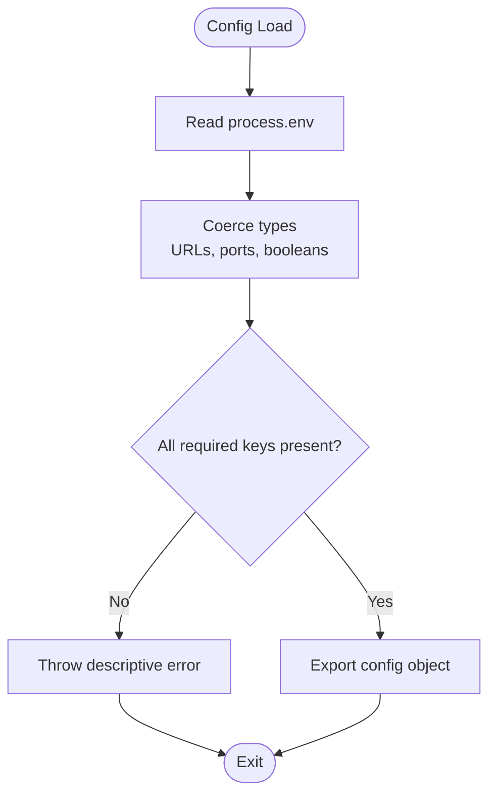
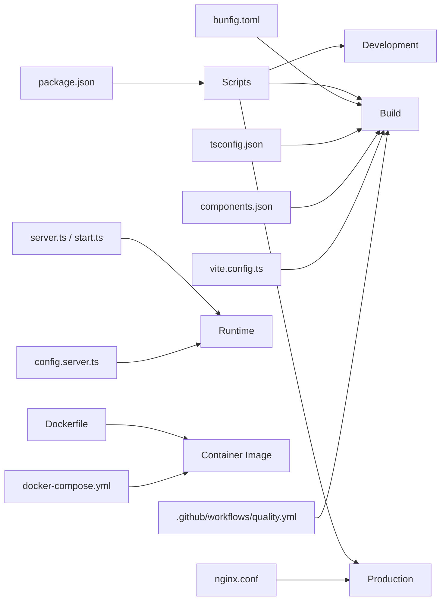

# Environment & Configuration Management

<cite>
**Referenced Files in This Document**
- [bunfig.toml](file://bunfig.toml)
- [tsconfig.json](file://tsconfig.json)
- [components.json](file://components.json)
- [vite.config.ts](file://vite.config.ts)
- [server.ts](file://src/server.ts)
- [start.ts](file://src/start.ts)
- [config.server.ts](file://src/lib/config.server.ts)
- [docker-compose.yml](file://docker-compose.yml)
- [Dockerfile](file://Dockerfile)
- [nginx.conf](file://nginx.conf)
- [.github/workflows/quality.yml](file://.github/workflows/quality.yml)
- [package.json](file://package.json)
</cite>

## Table of Contents
1. [Introduction](#introduction)
2. [Project Structure](#project-structure)
3. [Core Components](#core-components)
4. [Architecture Overview](#architecture-overview)
5. [Detailed Component Analysis](#detailed-component-analysis)
6. [Dependency Analysis](#dependency-analysis)
7. [Performance Considerations](#performance-considerations)
8. [Troubleshooting Guide](#troubleshooting-guide)
9. [Conclusion](#conclusion)
10. [Appendices](#appendices)

## Introduction
This document explains how environment and configuration are managed across development, staging, and production for this project. It focuses on the roles of key configuration files (bunfig.toml, tsconfig.json, components.json), runtime configuration loading, environment variable handling, secret management, and validation strategies. It also provides practical examples for local development, staging, and production deployments, along with best practices and troubleshooting guidance.

## Project Structure
Configuration spans build-time, runtime, and deployment layers:
- Build-time configuration: Bun, TypeScript, Vite, UI component generator
- Runtime configuration: Server startup and config loader
- Deployment configuration: Docker, Nginx, CI pipeline
- Package scripts: Entry points and commands

**Diagram sources**
- [bunfig.toml](file://bunfig.toml)
- [tsconfig.json](file://tsconfig.json)
- [components.json](file://components.json)
- [vite.config.ts](file://vite.config.ts)
- [src/server.ts](file://src/server.ts)
- [src/start.ts](file://src/start.ts)
- [src/lib/config.server.ts](file://src/lib/config.server.ts)
- [Dockerfile](file://Dockerfile)
- [docker-compose.yml](file://docker-compose.yml)
- [nginx.conf](file://nginx.conf)
- [.github/workflows/quality.yml](file://.github/workflows/quality.yml)
- [package.json](file://package.json)

**Section sources**
- [bunfig.toml](file://bunfig.toml)
- [tsconfig.json](file://tsconfig.json)
- [components.json](file://components.json)
- [vite.config.ts](file://vite.config.ts)
- [src/server.ts](file://src/server.ts)
- [src/start.ts](file://src/start.ts)
- [src/lib/config.server.ts](file://src/lib/config.server.ts)
- [Dockerfile](file://Dockerfile)
- [docker-compose.yml](file://docker-compose.yml)
- [nginx.conf](file://nginx.conf)
- [.github/workflows/quality.yml](file://.github/workflows/quality.yml)
- [package.json](file://package.json)

## Core Components
- bunfig.toml: Controls Bun runtime behavior (e.g., bundling, dev server, aliases). Influences how assets and modules resolve during development and builds.
- tsconfig.json: Defines TypeScript compilation targets, module resolution, path mappings, and strictness. Impacts both development experience and output artifacts.
- components.json: Configures a UI component generator or library integration. Affects which UI primitives are available and how they are referenced at build time.
- vite.config.ts: Vite build and dev server settings. Often reads environment variables to toggle features, API endpoints, and logging levels.
- src/server.ts and src/start.ts: Application entry points that initialize the server and load runtime configuration.
- src/lib/config.server.ts: Centralized runtime configuration loader that reads environment variables and exposes validated configuration to the app.
- Dockerfile and docker-compose.yml: Container image definition and orchestration; inject environment variables and secrets into containers.
- nginx.conf: Reverse proxy and static asset serving configuration for production.
- .github/workflows/quality.yml: CI pipeline that may run checks and builds using environment-specific variables.
- package.json: Scripts and metadata used by npm/Bun to start, build, and test the application.

**Section sources**
- [bunfig.toml](file://bunfig.toml)
- [tsconfig.json](file://tsconfig.json)
- [components.json](file://components.json)
- [vite.config.ts](file://vite.config.ts)
- [src/server.ts](file://src/server.ts)
- [src/start.ts](file://src/start.ts)
- [src/lib/config.server.ts](file://src/lib/config.server.ts)
- [Dockerfile](file://Dockerfile)
- [docker-compose.yml](file://docker-compose.yml)
- [nginx.conf](file://nginx.conf)
- [.github/workflows/quality.yml](file://.github/workflows/quality.yml)
- [package.json](file://package.json)

## Architecture Overview
The configuration architecture separates concerns across build-time, runtime, and deployment:

**Diagram sources**
- [src/lib/config.server.ts](file://src/lib/config.server.ts)
- [src/server.ts](file://src/server.ts)
- [src/start.ts](file://src/start.ts)
- [Dockerfile](file://Dockerfile)
- [docker-compose.yml](file://docker-compose.yml)
- [nginx.conf](file://nginx.conf)
- [.github/workflows/quality.yml](file://.github/workflows/quality.yml)

## Detailed Component Analysis

### Build-Time Configuration

#### bunfig.toml
- Purpose: Configure Bun’s bundler and dev server behavior.
- Typical responsibilities:
  - Define alias paths for imports
  - Control dev server options (port, host)
  - Adjust bundling behavior for performance
- Environment impact:
  - Development: Faster reloads, source maps enabled
  - Production: Optimized bundles, minimized assets
- Best practices:
  - Keep aliases consistent with tsconfig paths
  - Avoid environment-specific toggles here; prefer runtime/env-based flags

**Section sources**
- [bunfig.toml](file://bunfig.toml)

#### tsconfig.json
- Purpose: TypeScript compiler options and path mapping.
- Typical responsibilities:
  - Target ES version and module system
  - Enable strict mode and type checking
  - Map import aliases to directories
- Environment impact:
  - Development: Enhanced diagnostics and IDE support
  - Production: Correct target and module output for runtime
- Best practices:
  - Align baseUrl and paths with bunfig aliases
  - Use separate profiles if needed for different outputs

**Section sources**
- [tsconfig.json](file://tsconfig.json)

#### components.json
- Purpose: Configuration for a UI component generator or library integration.
- Typical responsibilities:
  - Specify component libraries and shadcn/ui setup
  - Define base styles and theme tokens
  - Configure generated component locations
- Environment impact:
  - Development: Interactive generation and preview
  - Production: Bundled components included in final assets
- Best practices:
  - Keep theme and style references centralized
  - Avoid injecting secrets via this file

**Section sources**
- [components.json](file://components.json)

#### vite.config.ts
- Purpose: Vite build and dev server configuration.
- Typical responsibilities:
  - Read process.env variables for feature flags and endpoints
  - Configure plugins, proxies, and optimization
  - Set publicPath and build targets
- Environment impact:
  - Development: Hot reload, proxy to backend APIs
  - Production: Asset hashing, minification, tree-shaking
- Best practices:
  - Validate required env vars before building
  - Expose only safe client-facing variables to the browser bundle

**Section sources**
- [vite.config.ts](file://vite.config.ts)

### Runtime Configuration

#### src/lib/config.server.ts
- Purpose: Centralized runtime configuration loader.
- Responsibilities:
  - Read environment variables from process.env
  - Parse and coerce values (ports, URLs, booleans)
  - Validate presence and format of critical settings
  - Export a typed configuration object to the rest of the app
- Security considerations:
  - Never log secrets
  - Fail fast when required variables are missing
  - Provide clear error messages indicating which keys are invalid
- Environment impact:
  - Development: Local defaults and relaxed validation
  - Staging/Production: Strict validation and secure defaults

**Diagram sources**
- [src/lib/config.server.ts](file://src/lib/config.server.ts)

**Section sources**
- [src/lib/config.server.ts](file://src/lib/config.server.ts)

#### src/server.ts and src/start.ts
- Purpose: Application entry points that initialize the HTTP server and bootstrap the app.
- Responsibilities:
  - Import and use the runtime configuration
  - Bind to configured host/port
  - Initialize middleware, routes, and integrations
- Environment impact:
  - Development: Debug logs, hot reload hooks
  - Production: Graceful shutdown, health checks, resource limits

**Section sources**
- [src/server.ts](file://src/server.ts)
- [src/start.ts](file://src/start.ts)

### Deployment Configuration

#### Dockerfile
- Purpose: Define the container image for the application.
- Responsibilities:
  - Install dependencies and build artifacts
  - Copy runtime-only files
  - Set default environment variables and CMD/ENTRYPOINT
- Secrets handling:
  - Prefer passing secrets at runtime via orchestrator or secret managers
  - Avoid baking secrets into images
- Best practices:
  - Multi-stage builds to minimize image size
  - Pin dependency versions for reproducibility

**Section sources**
- [Dockerfile](file://Dockerfile)

#### docker-compose.yml
- Purpose: Orchestrate services and inject environment variables.
- Responsibilities:
  - Define service definitions, networks, volumes
  - Inject environment variables and secrets into containers
  - Manage port mappings and dependencies
- Best practices:
  - Use .env files for local development
  - Reference external secret stores for staging/production

**Section sources**
- [docker-compose.yml](file://docker-compose.yml)

#### nginx.conf
- Purpose: Reverse proxy and static asset serving for production.
- Responsibilities:
  - Proxy requests to the Node/Bun server
  - Serve static assets efficiently
  - Configure SSL termination and security headers
- Best practices:
  - Harden headers (HSTS, CSP)
  - Cache static assets appropriately

**Section sources**
- [nginx.conf](file://nginx.conf)

#### .github/workflows/quality.yml
- Purpose: CI pipeline for quality checks and builds.
- Responsibilities:
  - Run linting, type checks, tests
  - Build artifacts using environment variables
  - Publish or deploy based on branch/tag rules
- Secrets handling:
  - Store secrets in repository or organization settings
  - Mask sensitive outputs in logs

**Section sources**
- [.github/workflows/quality.yml](file://.github/workflows/quality.yml)

#### package.json
- Purpose: Scripts and metadata for running the app.
- Responsibilities:
  - Define start, build, dev, test scripts
  - Declare dependencies and engines
- Best practices:
  - Use cross-platform compatible scripts
  - Separate dev and prod scripts where necessary

**Section sources**
- [package.json](file://package.json)

## Dependency Analysis
Configuration dependencies across stages:

**Diagram sources**
- [package.json](file://package.json)
- [bunfig.toml](file://bunfig.toml)
- [tsconfig.json](file://tsconfig.json)
- [components.json](file://components.json)
- [vite.config.ts](file://vite.config.ts)
- [src/server.ts](file://src/server.ts)
- [src/start.ts](file://src/start.ts)
- [src/lib/config.server.ts](file://src/lib/config.server.ts)
- [Dockerfile](file://Dockerfile)
- [docker-compose.yml](file://docker-compose.yml)
- [nginx.conf](file://nginx.conf)
- [.github/workflows/quality.yml](file://.github/workflows/quality.yml)

**Section sources**
- [package.json](file://package.json)
- [bunfig.toml](file://bunfig.toml)
- [tsconfig.json](file://tsconfig.json)
- [components.json](file://components.json)
- [vite.config.ts](file://vite.config.ts)
- [src/server.ts](file://src/server.ts)
- [src/start.ts](file://src/start.ts)
- [src/lib/config.server.ts](file://src/lib/config.server.ts)
- [Dockerfile](file://Dockerfile)
- [docker-compose.yml](file://docker-compose.yml)
- [nginx.conf](file://nginx.conf)
- [.github/workflows/quality.yml](file://.github/workflows/quality.yml)

## Performance Considerations
- Build optimizations:
  - Use Bun and Vite flags to enable incremental builds and caching
  - Ensure TypeScript strictness is balanced with developer productivity
- Runtime efficiency:
  - Minimize environment variable lookups by loading config once at startup
  - Avoid heavy computations during initialization
- Deployment:
  - Use multi-stage Docker builds to reduce image size
  - Leverage reverse proxy caching for static assets

[No sources needed since this section provides general guidance]

## Troubleshooting Guide
Common issues and resolutions:
- Missing environment variables:
  - Symptom: Startup errors indicating required keys are undefined
  - Resolution: Verify all required variables are set in the current environment
- Invalid URL or port formats:
  - Symptom: Type coercion failures or network binding errors
  - Resolution: Ensure URLs include protocol and ports are numeric within valid ranges
- Secret exposure:
  - Symptom: Logs or responses containing sensitive data
  - Resolution: Remove secret logging, mask outputs in CI, and validate secret presence without printing values
- Build-time mismatches:
  - Symptom: Alias resolution errors between bunfig and tsconfig
  - Resolution: Align path mappings and ensure consistent base directories
- Container networking:
  - Symptom: Services cannot reach each other
  - Resolution: Confirm docker-compose service names and port mappings

**Section sources**
- [src/lib/config.server.ts](file://src/lib/config.server.ts)
- [src/server.ts](file://src/server.ts)
- [src/start.ts](file://src/start.ts)
- [docker-compose.yml](file://docker-compose.yml)
- [Dockerfile](file://Dockerfile)
- [nginx.conf](file://nginx.conf)
- [.github/workflows/quality.yml](file://.github/workflows/quality.yml)

## Conclusion
Effective environment and configuration management requires clear separation of concerns across build-time, runtime, and deployment layers. By centralizing configuration loading, validating inputs early, and managing secrets securely, you can maintain consistency and reliability across development, staging, and production. Follow the best practices outlined above and use the troubleshooting guide to quickly diagnose and resolve common issues.

[No sources needed since this section summarizes without analyzing specific files]

## Appendices

### Example Setup Scenarios

- Local development:
  - Create a .env file with development values
  - Start the dev server using the provided script
  - Ensure aliases and paths align with tsconfig and bunfig
- Staging configuration:
  - Set staging-specific environment variables in your orchestrator
  - Run builds with staging flags if applicable
  - Validate configuration at startup
- Production deployment:
  - Inject secrets via secret manager or platform-native mechanisms
  - Use hardened Docker images and reverse proxy configurations
  - Monitor startup logs for configuration errors

[No sources needed since this section provides general guidance]