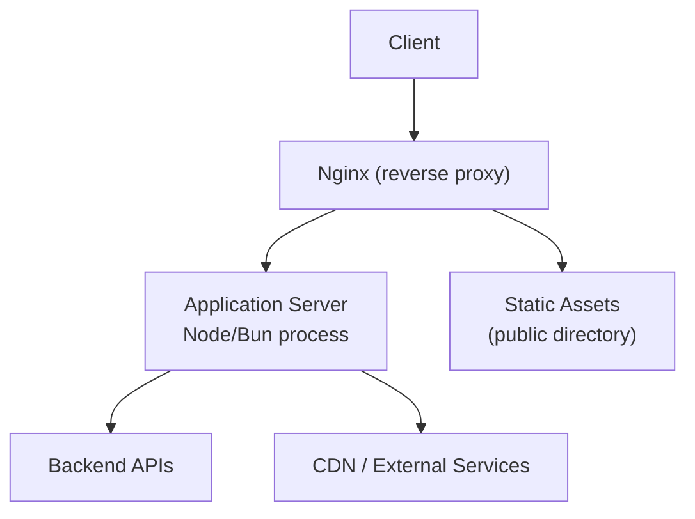
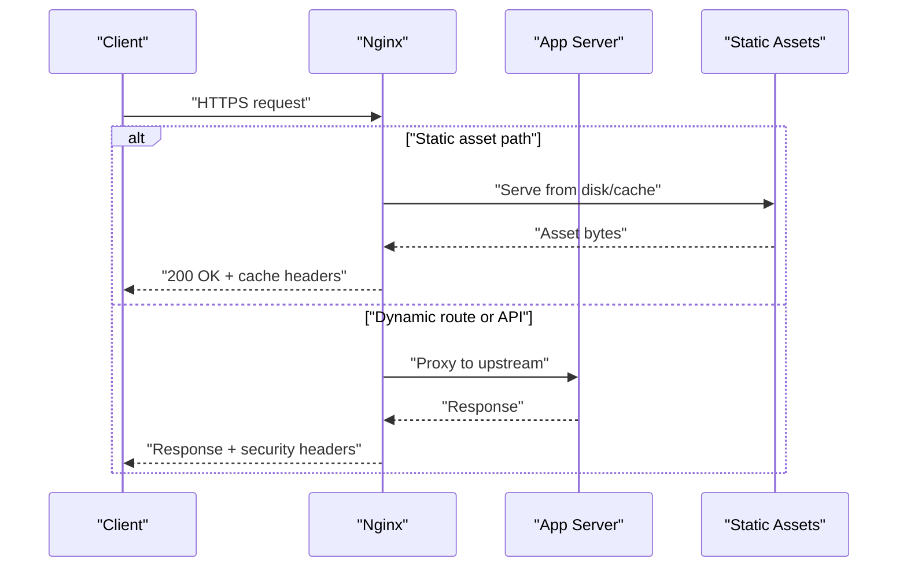
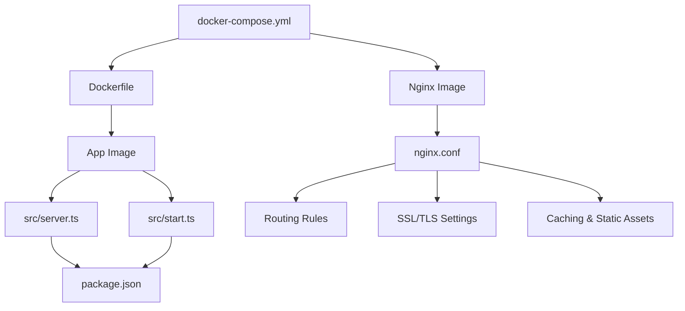

# Web Server & Reverse Proxy

<cite>
**Referenced Files in This Document**
- [nginx.conf](file://nginx.conf)
- [Dockerfile](file://Dockerfile)
- [docker-compose.yml](file://docker-compose.yml)
- [src/server.ts](file://src/server.ts)
- [src/start.ts](file://src/start.ts)
- [vite.config.ts](file://vite.config.ts)
- [package.json](file://package.json)
</cite>

## Table of Contents
1. Introduction
2. Project Structure
3. Core Components
4. Architecture Overview
5. Detailed Component Analysis
6. Dependency Analysis
7. Performance Considerations
8. Troubleshooting Guide
9. Conclusion

## Introduction
This document provides a comprehensive guide to configuring nginx as a reverse proxy for the application, including configuration structure, routing rules, SSL/TLS setup, performance optimizations, static asset serving and caching, security headers, load balancing, health checks, monitoring integration, troubleshooting, log analysis, performance tuning, and environment-specific guidance for development versus production.

## Project Structure
The repository includes an nginx configuration file at the root, a Dockerfile, and a docker-compose file that together define how nginx is deployed alongside the application server. The application server is implemented in TypeScript/JavaScript with an entry point and runtime configuration files.

[No sources needed since this diagram shows conceptual workflow, not actual code structure]

**Section sources**
- [nginx.conf](file://nginx.conf)
- [Dockerfile](file://Dockerfile)
- [docker-compose.yml](file://docker-compose.yml)
- [src/server.ts](file://src/server.ts)
- [src/start.ts](file://src/start.ts)
- [vite.config.ts](file://vite.config.ts)
- [package.json](file://package.json)

## Core Components
- Nginx reverse proxy: Handles TLS termination, request routing, static assets, caching, security headers, and optional load balancing and health checks.
- Application server: A Node/Bun-based HTTP server that serves dynamic routes and APIs.
- Containerization: Dockerfile and docker-compose orchestrate running nginx and the app server together.

Key responsibilities:
- Nginx: TLS termination, routing, compression, caching, security headers, access control, logging, metrics exposure.
- App server: Business logic, SSR/SSG output, API endpoints, session/auth handling.

**Section sources**
- [nginx.conf](file://nginx.conf)
- [Dockerfile](file://Dockerfile)
- [docker-compose.yml](file://docker-compose.yml)
- [src/server.ts](file://src/server.ts)
- [src/start.ts](file://src/start.ts)

## Architecture Overview
The typical deployment places nginx in front of the application server. Nginx terminates HTTPS, proxies requests to the backend, serves static assets directly when possible, applies caching and security policies, and forwards logs and metrics for observability.

[No sources needed since this diagram shows conceptual workflow, not actual code structure]

## Detailed Component Analysis

### Nginx Configuration File Structure
- Top-level directives: worker processes, events, http block.
- Upstream definitions: group one or more backend servers for load balancing.
- Server blocks: listen on ports, hostnames, include SSL settings, and define location blocks.
- Location blocks: match URL patterns, set proxy targets, enable caching, add headers, and configure timeouts.
- Logging and metrics: access/error logs, Prometheus exporter endpoint if used.

Recommended structure:
- Global settings: worker_processes, multi_accept, sendfile, tcp_nopush, keepalive_timeout.
- HTTP block: gzip, default types, proxy defaults, rate limiting zones, map blocks for header manipulation.
- Upstreams: round-robin or least_conn; mark unhealthy nodes for failover.
- Servers:
  - HTTP-to-HTTPS redirect server.
  - HTTPS server with SSL certificates, modern protocols/ciphers, HSTS, OCSP stapling.
  - Locations:
    - Root/static: serve public assets with long-lived cache and immutable flags.
    - Dynamic routes: proxy_pass to upstream with proper headers and timeouts.
    - Health check endpoint: return 200 for liveness/readiness probes.
    - Metrics endpoint: expose /metrics for Prometheus scraping.

Security headers to include:
- Strict-Transport-Security
- X-Content-Type-Options
- X-Frame-Options or Content-Security-Policy
- Referrer-Policy
- Permissions-Policy
- Cross-Origin-Embedder-Policy / Cross-Origin-Opener-Policy (if using COOP/COEP)

Performance toggles:
- gzip/brotli compression for text-like responses.
- proxy_cache_path and cache keys for dynamic content.
- client_max_body_size, proxy_buffering, proxy_read_timeout, proxy_send_timeout.

**Section sources**
- [nginx.conf](file://nginx.conf)

### Routing Rules
- Use precise location prefixes for static assets (e.g., /assets, /images).
- Use regex or exact matches for SPA fallback to index.html where applicable.
- Separate API paths (/api/*) to proxy to backend services with distinct timeouts and buffering.
- Use maps to normalize Host headers and route by domain.

Example patterns:
- Static: location ^~ /static/ { ... }
- API: location /api/ { proxy_pass http://app_upstream; ... }
- SPA fallback: location / { try_files $uri $uri/ /index.html; }

**Section sources**
- [nginx.conf](file://nginx.conf)

### SSL/TLS Setup
- Listen on port 443 with ssl enabled.
- Provide certificate and key paths.
- Enable modern protocol versions (TLS 1.2+), strong cipher suites, and prefer server ciphers.
- Enable OCSP stapling and HSTS with appropriate max-age.
- Redirect all HTTP to HTTPS.

**Section sources**
- [nginx.conf](file://nginx.conf)

### Performance Optimizations
- Compression: enable gzip or brotli for text-based responses.
- Caching:
  - Static assets: long Cache-Control with immutable flag and versioned filenames.
  - Dynamic: proxy_cache with cache keys based on method, URI, and selected headers.
- Buffering: tune proxy_buffering, proxy_buffers, and proxy_busy_buffers_size.
- Timeouts: adjust proxy_read_timeout and proxy_send_timeout for slow backends.
- Keepalive: reuse upstream connections via keepalive in upstream and proxy_http_version 1.1.

**Section sources**
- [nginx.conf](file://nginx.conf)

### Static Asset Serving and Caching Strategy
- Serve from a dedicated directory mapped to the build output or public folder.
- Set immutable and long-lived Cache-Control for hashed assets.
- Use ETag/Last-Modified appropriately.
- Configure proxy_cache for API responses where safe and beneficial.

**Section sources**
- [nginx.conf](file://nginx.conf)

### Security Headers Configuration
- Add HSTS, X-Content-Type-Options, X-Frame-Options or CSP, Referrer-Policy, Permissions-Policy.
- Restrict CORS origins and methods explicitly.
- Limit request body size and enforce sane limits for upload endpoints.

**Section sources**
- [nginx.conf](file://nginx.conf)

### Load Balancing and Health Checks
- Define upstream with multiple backend instances.
- Choose strategy: round-robin (default), least_conn, ip_hash for sticky sessions.
- Mark servers down/unhealthy; use max_fails and fail_timeout for passive health checks.
- For active health checks, integrate with external tools or sidecars.

**Section sources**
- [nginx.conf](file://nginx.conf)

### Monitoring Integration
- Expose a /metrics endpoint via a lightweight exporter (e.g., nginx-prometheus-exporter) and scrape with Prometheus.
- Ensure SELinux/firewall allows scraping.
- Centralize logs with a log shipper (Fluent Bit, Vector) to Elasticsearch/Loki.

**Section sources**
- [nginx.conf](file://nginx.conf)

### Development vs Production Configurations
- Development:
  - Disable strict caching and HSTS.
  - Enable verbose error pages and detailed logs.
  - Allow larger request bodies and longer timeouts.
- Production:
  - Enforce HTTPS, HSTS, strong ciphers.
  - Enable compression and caching.
  - Tune worker_processes, keepalive, and buffer sizes.
  - Rotate and compress logs.

Environment variables can drive differences such as upstream addresses, cache paths, and feature flags.

**Section sources**
- [nginx.conf](file://nginx.conf)

### Application Server Integration
- The app server listens on a local port inside the container.
- Nginx proxies to this upstream.
- Ensure the app binds to 0.0.0.0 within containers and uses correct port mapping.

**Section sources**
- [src/server.ts](file://src/server.ts)
- [src/start.ts](file://src/start.ts)
- [Dockerfile](file://Dockerfile)
- [docker-compose.yml](file://docker-compose.yml)

### Build and Static Output
- Vite config defines the build output directory and base path.
- Ensure nginx serves the built files from the correct path.
- Versioned assets should be served with long cache lifetimes.

**Section sources**
- [vite.config.ts](file://vite.config.ts)

## Dependency Analysis
The following diagram illustrates how the containerized components interact and depend on each other.

**Diagram sources**
- [docker-compose.yml](file://docker-compose.yml)
- [Dockerfile](file://Dockerfile)
- [nginx.conf](file://nginx.conf)
- [src/server.ts](file://src/server.ts)
- [src/start.ts](file://src/start.ts)
- [package.json](file://package.json)

**Section sources**
- [docker-compose.yml](file://docker-compose.yml)
- [Dockerfile](file://Dockerfile)
- [nginx.conf](file://nginx.conf)
- [src/server.ts](file://src/server.ts)
- [src/start.ts](file://src/start.ts)
- [package.json](file://package.json)

## Performance Considerations
- Worker processes: set to CPU cores or auto.
- Connection handling: enable sendfile, tcp_nopush, tcp_nodelay.
- Keepalive: tune upstream keepalive and client keepalive.
- Compression: enable gzip/brotli selectively for large payloads.
- Caching: leverage browser cache for static assets and proxy cache for idempotent GETs.
- Timeouts: align with expected backend latency; avoid premature timeouts.
- Buffering: increase buffers for large headers or response bodies.
- Rate limiting: protect against abuse and mitigate DoS.

[No sources needed since this section provides general guidance]

## Troubleshooting Guide
Common issues and resolutions:
- 502 Bad Gateway:
  - Verify upstream address/port and that the app is listening on the expected interface.
  - Check firewall and container networking.
- 504 Gateway Timeout:
  - Increase proxy_read_timeout and proxy_send_timeout.
  - Investigate slow backend queries or heavy processing.
- 413 Request Entity Too Large:
  - Adjust client_max_body_size for uploads.
- SSL handshake failures:
  - Validate certificate paths, permissions, and supported protocols/ciphers.
- High memory/CPU usage:
  - Review worker_processes, keepalive, and buffering settings.
  - Inspect logs for spikes and hotspots.

Log analysis:
- Access logs: analyze status codes, latency, top clients, and endpoints.
- Error logs: focus on upstream errors, SSL errors, and permission issues.
- Correlate timestamps across nginx and app logs.

Operational tips:
- Use health check endpoints to validate readiness.
- Implement graceful reloads for config changes.
- Centralize logs and set retention policies.

**Section sources**
- [nginx.conf](file://nginx.conf)
- [Dockerfile](file://Dockerfile)
- [docker-compose.yml](file://docker-compose.yml)

## Conclusion
By placing nginx in front of the application server, you gain robust TLS termination, efficient static asset delivery, flexible routing, caching, security hardening, and scalability through load balancing. Combine these with thoughtful performance tuning, comprehensive logging, and monitoring to achieve a reliable and high-performing web stack. Align configurations with environment needs—lenient and verbose in development, secure and optimized in production—and continuously monitor and iterate based on real-world traffic patterns.