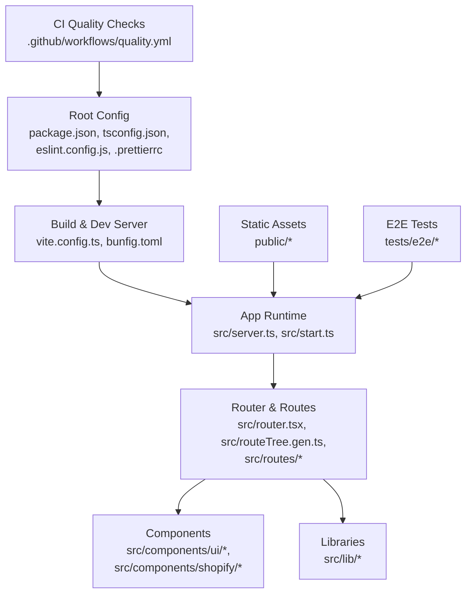
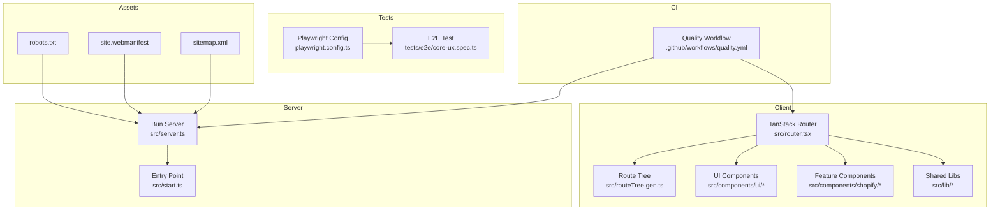
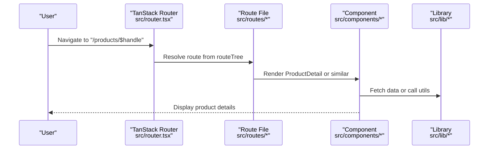
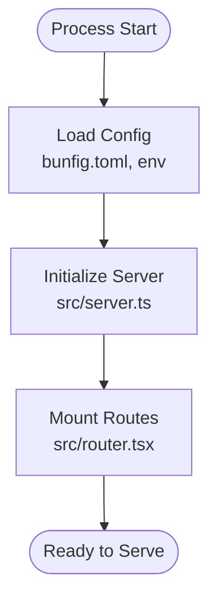
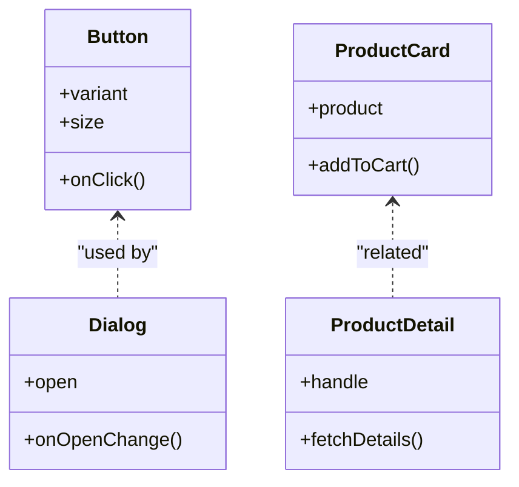
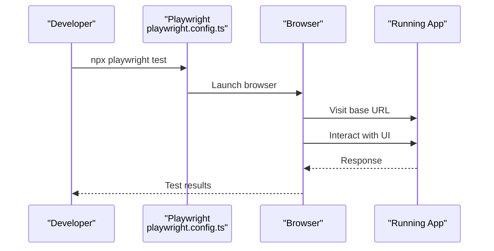
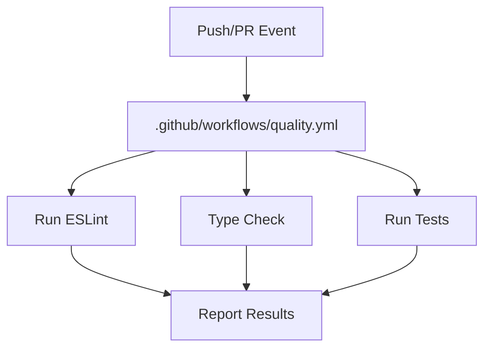
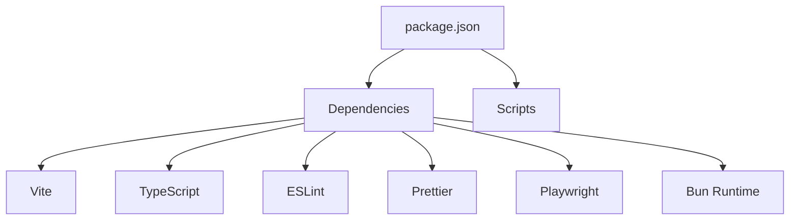

# Development Guidelines

<cite>
**Referenced Files in This Document**
- [package.json](file://package.json)
- [tsconfig.json](file://tsconfig.json)
- [eslint.config.js](file://eslint.config.js)
- [.prettierrc](file://.prettierrc)
- [.prettierignore](file://.prettierignore)
- [vite.config.ts](file://vite.config.ts)
- [bunfig.toml](file://bunfig.toml)
- [Dockerfile](file://Dockerfile)
- [docker-compose.yml](file://docker-compose.yml)
- [nginx.conf](file://nginx.conf)
- [playwright.config.ts](file://playwright.config.ts)
- [tests/e2e/core-ux.spec.ts](file://tests/e2e/core-ux.spec.ts)
- [src/server.ts](file://src/server.ts)
- [src/start.ts](file://src/start.ts)
- [src/router.tsx](file://src/router.tsx)
- [src/routeTree.gen.ts](file://src/routeTree.gen.ts)
- [src/lib/seo.ts](file://src/lib/seo.ts)
- [public/robots.txt](file://public/robots.txt)
- [public/site.webmanifest](file://public/site.webmanifest)
- [public/sitemap.xml](file://public/sitemap.xml)
- [.github/workflows/quality.yml](file:.github/workflows/quality.yml)
- [README.md](file://README.md)
</cite>

## Table of Contents
1. Introduction
2. Project Structure
3. Core Components
4. Architecture Overview
5. Detailed Component Analysis
6. Dependency Analysis
7. Performance Considerations
8. Troubleshooting Guide
9. Conclusion
10. Appendices

## Introduction
This document provides comprehensive development guidelines for contributing to SpareAutomation. It covers coding standards, linting and formatting rules, TypeScript configuration, Git workflow, commit conventions, code review practices, environment setup, debugging, performance profiling, security best practices, accessibility requirements, SEO considerations, dependency management, versioning, upgrade procedures, documentation updates, changelog maintenance, and release preparation. The goal is to help contributors write consistent, maintainable, and high-quality code while following the project’s established patterns and tooling.

## Project Structure
The repository follows a modern React + Vite + TanStack Router stack with Bun as the runtime and Playwright for end-to-end tests. Key areas:
- src/components: Feature and UI components (Shopify integration and shared UI primitives)
- src/routes: Page-level routes using TanStack Router file-based routing
- src/lib: Shared utilities, server config, error handling, SEO helpers, and site metadata
- public: Static assets including SEO-related files
- tests/e2e: Playwright E2E tests
- Configuration at root: package.json, tsconfig.json, eslint.config.js, .prettierrc, vite.config.ts, bunfig.toml, Dockerfile, docker-compose.yml, nginx.conf, playwright.config.ts, GitHub Actions quality workflow

**Diagram sources**
- [package.json](file://package.json)
- [tsconfig.json](file://tsconfig.json)
- [eslint.config.js](file://eslint.config.js)
- [.prettierrc](file://.prettierrc)
- [vite.config.ts](file://vite.config.ts)
- [bunfig.toml](file://bunfig.toml)
- [src/server.ts](file://src/server.ts)
- [src/start.ts](file://src/start.ts)
- [src/router.tsx](file://src/router.tsx)
- [src/routeTree.gen.ts](file://src/routeTree.gen.ts)
- [src/components/ui/button.tsx](file://src/components/ui/button.tsx)
- [src/components/shopify/ProductCard.tsx](file://src/components/shopify/ProductCard.tsx)
- [src/lib/seo.ts](file://src/lib/seo.ts)
- [public/robots.txt](file://public/robots.txt)
- [public/site.webmanifest](file://public/site.webmanifest)
- [public/sitemap.xml](file://public/sitemap.xml)
- [tests/e2e/core-ux.spec.ts](file://tests/e2e/core-ux.spec.ts)
- [.github/workflows/quality.yml](file:.github/workflows/quality.yml)

**Section sources**
- [README.md](file://README.md)
- [package.json](file://package.json)
- [vite.config.ts](file://vite.config.ts)
- [src/router.tsx](file://src/router.tsx)
- [src/routeTree.gen.ts](file://src/routeTree.gen.ts)

## Core Components
- Build and dev server: Vite is configured via vite.config.ts; Bun runtime settings are defined in bunfig.toml.
- Linting and formatting: ESLint is configured in eslint.config.js; Prettier is configured in .prettierrc with an ignore list in .prettierignore.
- TypeScript: Strictness and module resolution are controlled by tsconfig.json.
- Routing: TanStack Router uses file-based routing under src/routes and generates routeTree.gen.ts.
- Server entry points: src/server.ts and src/start.ts bootstrap the application.
- UI and feature components: src/components/ui contains reusable primitives; src/components/shopify contains Shopify-specific features.
- Libraries: src/lib includes SEO helpers, error capture, site config, and utilities.
- Static assets: public contains robots.txt, site.webmanifest, and sitemap.xml for SEO.
- E2E testing: Playwright configuration in playwright.config.ts and example test in tests/e2e/core-ux.spec.ts.
- CI: Quality checks pipeline in .github/workflows/quality.yml.

**Section sources**
- [vite.config.ts](file://vite.config.ts)
- [bunfig.toml](file://bunfig.toml)
- [eslint.config.js](file://eslint.config.js)
- [.prettierrc](file://.prettierrc)
- [.prettierignore](file://.prettierignore)
- [tsconfig.json](file://tsconfig.json)
- [src/router.tsx](file://src/router.tsx)
- [src/routeTree.gen.ts](file://src/routeTree.gen.ts)
- [src/server.ts](file://src/server.ts)
- [src/start.ts](file://src/start.ts)
- [src/components/ui/button.tsx](file://src/components/ui/button.tsx)
- [src/components/shopify/ProductCard.tsx](file://src/components/shopify/ProductCard.tsx)
- [src/lib/seo.ts](file://src/lib/seo.ts)
- [public/robots.txt](file://public/robots.txt)
- [public/site.webmanifest](file://public/site.webmanifest)
- [public/sitemap.xml](file://public/sitemap.xml)
- [playwright.config.ts](file://playwright.config.ts)
- [tests/e2e/core-ux.spec.ts](file://tests/e2e/core-ux.spec.ts)
- [.github/workflows/quality.yml](file:.github/workflows/quality.yml)

## Architecture Overview
High-level architecture:
- Client-side app built with Vite and served by Bun.
- TanStack Router manages client-side navigation and route definitions.
- Components are organized into UI primitives and feature modules.
- SEO-related static files reside in public.
- E2E tests validate core user flows.
- CI runs quality checks on push/PR.

**Diagram sources**
- [src/router.tsx](file://src/router.tsx)
- [src/routeTree.gen.ts](file://src/routeTree.gen.ts)
- [src/server.ts](file://src/server.ts)
- [src/start.ts](file://src/start.ts)
- [public/robots.txt](file://public/robots.txt)
- [public/site.webmanifest](file://public/site.webmanifest)
- [public/sitemap.xml](file://public/sitemap.xml)
- [playwright.config.ts](file://playwright.config.ts)
- [tests/e2e/core-ux.spec.ts](file://tests/e2e/core-ux.spec.ts)
- [.github/workflows/quality.yml](file:.github/workflows/quality.yml)

## Detailed Component Analysis

### Coding Standards and Conventions
- Language and types:
  - Use TypeScript across the codebase. Configure strict mode and module resolution per tsconfig.json. Prefer explicit types and avoid any where possible.
- Formatting:
  - Follow Prettier rules defined in .prettierrc. Ignore files listed in .prettierignore.
- Linting:
  - Adhere to ESLint rules in eslint.config.js. Fix all warnings and errors before submitting PRs.
- File naming and structure:
  - Use kebab-case for route files under src/routes and PascalCase for component files. Keep related logic close to components when appropriate.
- Imports and exports:
  - Group imports logically and prefer named exports for clarity. Avoid deep relative paths; use path aliases if configured.
- Error handling:
  - Centralize error reporting and page rendering via src/lib/error-capture.ts and src/lib/error-page.ts. Surface meaningful messages to users.
- SEO:
  - Use src/lib/seo.ts for dynamic metadata and ensure public/robots.txt, public/site.webmanifest, and public/sitemap.xml are kept up to date.

**Section sources**
- [tsconfig.json](file://tsconfig.json)
- [.prettierrc](file://.prettierrc)
- [.prettierignore](file://.prettierignore)
- [eslint.config.js](file://eslint.config.js)
- [src/lib/error-capture.ts](file://src/lib/error-capture.ts)
- [src/lib/error-page.ts](file://src/lib/error-page.ts)
- [src/lib/seo.ts](file://src/lib/seo.ts)
- [public/robots.txt](file://public/robots.txt)
- [public/site.webmanifest](file://public/site.webmanifest)
- [public/sitemap.xml](file://public/sitemap.xml)

### TypeScript Configuration
- Target and module settings:
  - Ensure target and module align with Vite and Bun expectations as configured in tsconfig.json.
- Path aliases:
  - If path aliases are defined, import using alias prefixes consistently across components and libraries.
- Strictness:
  - Enable strictNullChecks and other strict flags to catch potential runtime issues early.

**Section sources**
- [tsconfig.json](file://tsconfig.json)

### Linting and Formatting Rules
- ESLint:
  - Configure rules that enforce consistent style, prevent anti-patterns, and improve reliability. Run linter locally and in CI.
- Prettier:
  - Enforce consistent formatting across the codebase. Integrate with your editor to auto-format on save.

**Section sources**
- [eslint.config.js](file://eslint.config.js)
- [.prettierrc](file://.prettierrc)
- [.prettierignore](file://.prettierignore)

### Build and Runtime Configuration
- Vite:
  - Adjust build targets, plugins, and optimization settings in vite.config.ts.
- Bun:
  - Configure runtime behavior and script execution in bunfig.toml.

**Section sources**
- [vite.config.ts](file://vite.config.ts)
- [bunfig.toml](file://bunfig.toml)

### Routing and Pages
- TanStack Router:
  - Define pages under src/routes. The router generates routeTree.gen.ts automatically.
- Root layout:
  - Configure global layout and providers in src/router.tsx.

**Diagram sources**
- [src/router.tsx](file://src/router.tsx)
- [src/routeTree.gen.ts](file://src/routeTree.gen.ts)
- [src/routes/products/$handle.tsx](file://src/routes/products/$handle.tsx)
- [src/components/shopify/ProductDetail.tsx](file://src/components/shopify/ProductDetail.tsx)
- [src/lib/utils.ts](file://src/lib/utils.ts)

**Section sources**
- [src/router.tsx](file://src/router.tsx)
- [src/routeTree.gen.ts](file://src/routeTree.gen.ts)
- [src/routes/products/$handle.tsx](file://src/routes/products/$handle.tsx)
- [src/components/shopify/ProductDetail.tsx](file://src/components/shopify/ProductDetail.tsx)

### Server Entry Points
- Server initialization:
  - src/server.ts sets up HTTP server and middleware.
- App start:
  - src/start.ts bootstraps the application and connects routes.

**Diagram sources**
- [src/server.ts](file://src/server.ts)
- [src/start.ts](file://src/start.ts)
- [src/router.tsx](file://src/router.tsx)
- [bunfig.toml](file://bunfig.toml)

**Section sources**
- [src/server.ts](file://src/server.ts)
- [src/start.ts](file://src/start.ts)

### UI and Feature Components
- UI primitives:
  - Reusable building blocks under src/components/ui (button, dialog, table, etc.).
- Feature components:
  - Shopify-specific features under src/components/shopify (ProductCard, ProductDetail, AddToCartButton, etc.).

**Diagram sources**
- [src/components/ui/button.tsx](file://src/components/ui/button.tsx)
- [src/components/ui/dialog.tsx](file://src/components/ui/dialog.tsx)
- [src/components/shopify/ProductCard.tsx](file://src/components/shopify/ProductCard.tsx)
- [src/components/shopify/ProductDetail.tsx](file://src/components/shopify/ProductDetail.tsx)

**Section sources**
- [src/components/ui/button.tsx](file://src/components/ui/button.tsx)
- [src/components/ui/dialog.tsx](file://src/components/ui/dialog.tsx)
- [src/components/shopify/ProductCard.tsx](file://src/components/shopify/ProductCard.tsx)
- [src/components/shopify/ProductDetail.tsx](file://src/components/shopify/ProductDetail.tsx)

### End-to-End Testing
- Playwright configuration:
  - playwright.config.ts defines browser targets, base URL, and test options.
- Example test:
  - tests/e2e/core-ux.spec.ts validates critical user flows.

**Diagram sources**
- [playwright.config.ts](file://playwright.config.ts)
- [tests/e2e/core-ux.spec.ts](file://tests/e2e/core-ux.spec.ts)

**Section sources**
- [playwright.config.ts](file://playwright.config.ts)
- [tests/e2e/core-ux.spec.ts](file://tests/e2e/core-ux.spec.ts)

### Continuous Integration
- Quality checks:
  - .github/workflows/quality.yml runs linting, type checking, and tests on push/PR.

**Diagram sources**
- [.github/workflows/quality.yml](file:.github/workflows/quality.yml)

**Section sources**
- [.github/workflows/quality.yml](file:.github/workflows/quality.yml)

## Dependency Analysis
- Package manager:
  - Dependencies and scripts are declared in package.json. Lockfiles include bun.lock and package-lock.json.
- Build dependencies:
  - Vite, TypeScript, ESLint, Prettier, Playwright, and Bun runtime are managed through package.json.
- Upgrade procedure:
  - Update versions in package.json, run install, verify builds and tests, then commit changes.

**Diagram sources**
- [package.json](file://package.json)

**Section sources**
- [package.json](file://package.json)

## Performance Considerations
- Build optimizations:
  - Tune Vite settings in vite.config.ts for production builds (code splitting, minification).
- Runtime efficiency:
  - Profile with Bun’s built-in tools and browser devtools.
- Asset management:
  - Optimize images and static assets in public.
- SSR/CSR balance:
  - Ensure routes render efficiently; leverage TanStack Router’s capabilities.

[No sources needed since this section provides general guidance]

## Troubleshooting Guide
- Common issues:
  - Lint/format failures: Run local ESLint/Prettier and fix reported issues.
  - Type errors: Address TypeScript errors indicated by tsconfig.json strictness.
  - Build failures: Verify vite.config.ts and bunfig.toml configurations.
  - E2E test failures: Check playwright.config.ts base URL and network conditions.
- Debugging techniques:
  - Use Bun’s logging and Node-compatible debuggers.
  - Inspect network requests and console logs in browser devtools.
- Error reporting:
  - Utilize src/lib/error-capture.ts and src/lib/error-page.ts for centralized error handling.

**Section sources**
- [eslint.config.js](file://eslint.config.js)
- [.prettierrc](file://.prettierrc)
- [tsconfig.json](file://tsconfig.json)
- [vite.config.ts](file://vite.config.ts)
- [bunfig.toml](file://bunfig.toml)
- [playwright.config.ts](file://playwright.config.ts)
- [src/lib/error-capture.ts](file://src/lib/error-capture.ts)
- [src/lib/error-page.ts](file://src/lib/error-page.ts)

## Conclusion
By adhering to these guidelines—consistent coding standards, robust linting and formatting, clear TypeScript configuration, structured routing, thorough testing, and CI checks—you will contribute effectively to SpareAutomation. Maintain strong focus on performance, security, accessibility, and SEO to deliver a high-quality user experience.

[No sources needed since this section summarizes without analyzing specific files]

## Appendices

### Development Environment Setup
- Prerequisites:
  - Install Bun as the runtime.
- Installation:
  - Install dependencies using the package manager referenced in package.json.
- Local development:
  - Start the dev server using the script defined in package.json.
- Docker:
  - Use Dockerfile and docker-compose.yml for containerized development and deployment.
- Nginx:
  - Configure reverse proxy and static asset serving via nginx.conf.

**Section sources**
- [package.json](file://package.json)
- [Dockerfile](file://Dockerfile)
- [docker-compose.yml](file://docker-compose.yml)
- [nginx.conf](file://nginx.conf)

### Git Workflow and Branching Strategy
- Branching:
  - Use feature branches for new work, bugfix branches for fixes, and main branch for stable releases.
- Commit messages:
  - Follow conventional commits (e.g., feat:, fix:, docs:, chore:) for clarity and automation.
- Code reviews:
  - Open pull requests with descriptive titles and summaries. Request reviews from maintainers.
- CI gates:
  - Ensure all quality checks pass in .github/workflows/quality.yml before merging.

[No sources needed since this section provides general guidance]

### Security Best Practices
- Secrets management:
  - Never commit secrets; use environment variables and secure secret stores.
- Input validation:
  - Validate and sanitize inputs on both client and server sides.
- Dependencies:
  - Regularly audit and update dependencies; monitor advisories.
- CSP and headers:
  - Configure security headers via server configuration and nginx.conf.

[No sources needed since this section provides general guidance]

### Accessibility Requirements
- Semantic HTML:
  - Use proper landmarks, headings, and roles.
- Keyboard navigation:
  - Ensure all interactive elements are keyboard accessible.
- ARIA attributes:
  - Apply ARIA labels and states where necessary.
- Color contrast:
  - Maintain sufficient contrast ratios for readability.

[No sources needed since this section provides general guidance]

### SEO Considerations
- Metadata:
  - Manage title, description, and canonical URLs via src/lib/seo.ts.
- Static assets:
  - Keep public/robots.txt, public/site.webmanifest, and public/sitemap.xml updated.
- Structured data:
  - Add JSON-LD where applicable for rich results.

**Section sources**
- [src/lib/seo.ts](file://src/lib/seo.ts)
- [public/robots.txt](file://public/robots.txt)
- [public/site.webmanifest](file://public/site.webmanifest)
- [public/sitemap.xml](file://public/sitemap.xml)

### Documentation Updates and Changelog Maintenance
- Documentation:
  - Update README.md and inline comments when introducing new features or changing behavior.
- Changelog:
  - Maintain a changelog aligned with commit conventions and release notes.
- Release preparation:
  - Tag versions, update package.json version fields, and publish artifacts as per CI pipeline.

**Section sources**
- [README.md](file://README.md)
- [package.json](file://package.json)