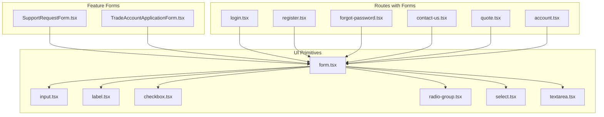
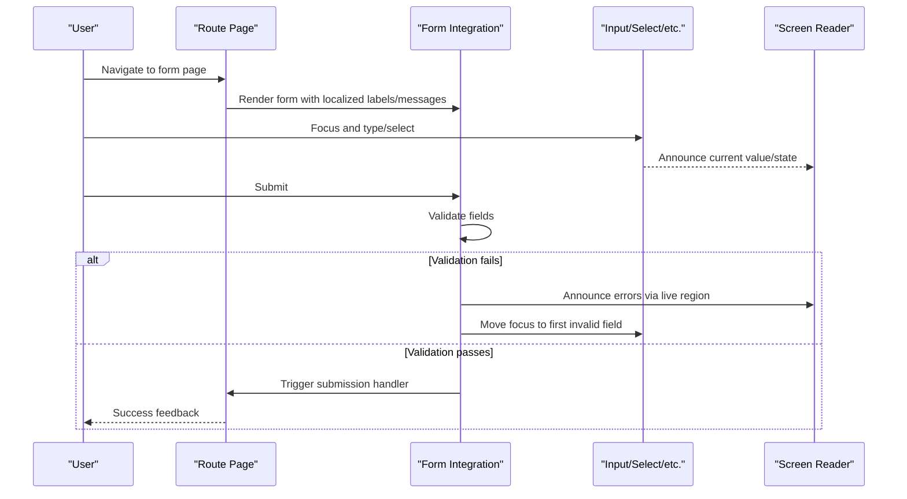
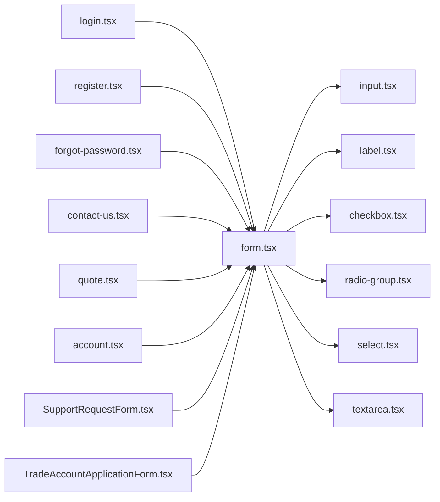

# Accessibility & Internationalization

<cite>
**Referenced Files in This Document**
- [form.tsx](file://src/components/ui/form.tsx)
- [input.tsx](file://src/components/ui/input.tsx)
- [label.tsx](file://src/components/ui/label.tsx)
- [checkbox.tsx](file://src/components/ui/checkbox.tsx)
- [radio-group.tsx](file://src/components/ui/radio-group.tsx)
- [select.tsx](file://src/components/ui/select.tsx)
- [textarea.tsx](file://src/components/ui/textarea.tsx)
- [SupportRequestForm.tsx](file://src/components/shopify/SupportRequestForm.tsx)
- [TradeAccountApplicationForm.tsx](file://src/components/shopify/TradeAccountApplicationForm.tsx)
- [login.tsx](file://src/routes/login.tsx)
- [register.tsx](file://src/routes/register.tsx)
- [forgot-password.tsx](file://src/routes/forgot-password.tsx)
- [contact-us.tsx](file://src/routes/contact-us.tsx)
- [quote.tsx](file://src/routes/quote.tsx)
- [account.tsx](file://src/routes/account.tsx)
- [styles.css](file://src/styles.css)
- [playwright.config.ts](file://playwright.config.ts)
- [core-ux.spec.ts](file://tests/e2e/core-ux.spec.ts)
</cite>

## Table of Contents
1. [Introduction](#introduction)
2. [Project Structure](#project-structure)
3. [Core Components](#core-components)
4. [Architecture Overview](#architecture-overview)
5. [Detailed Component Analysis](#detailed-component-analysis)
6. [Dependency Analysis](#dependency-analysis)
7. [Performance Considerations](#performance-considerations)
8. [Troubleshooting Guide](#troubleshooting-guide)
9. [Conclusion](#conclusion)
10. [Appendices](#appendices)

## Introduction
This document provides comprehensive guidance for implementing accessible and internationalized forms across the application. It covers ARIA attributes, keyboard navigation, screen reader support, focus management, color contrast, semantic HTML structure, assistive technology compatibility, error announcements, validation feedback, dynamic label translation, date/time formatting, currency display, right-to-left (RTL) language support, and testing strategies for accessibility and internationalization coverage.

## Project Structure
The project organizes form-related UI primitives under a shared UI layer and composes them into feature-specific forms and routes. The key areas relevant to accessibility and internationalization are:
- UI primitives: input, label, checkbox, radio-group, select, textarea, and a higher-level form integration component
- Feature forms: Support Request Form and Trade Account Application Form
- Route pages that host forms: login, register, forgot-password, contact-us, quote, account
- Global styles for contrast and visual consistency
- E2E tests for core UX including accessibility scenarios

**Diagram sources**
- [form.tsx](file://src/components/ui/form.tsx)
- [input.tsx](file://src/components/ui/input.tsx)
- [label.tsx](file://src/components/ui/label.tsx)
- [checkbox.tsx](file://src/components/ui/checkbox.tsx)
- [radio-group.tsx](file://src/components/ui/radio-group.tsx)
- [select.tsx](file://src/components/ui/select.tsx)
- [textarea.tsx](file://src/components/ui/textarea.tsx)
- [SupportRequestForm.tsx](file://src/components/shopify/SupportRequestForm.tsx)
- [TradeAccountApplicationForm.tsx](file://src/components/shopify/TradeAccountApplicationForm.tsx)
- [login.tsx](file://src/routes/login.tsx)
- [register.tsx](file://src/routes/register.tsx)
- [forgot-password.tsx](file://src/routes/forgot-password.tsx)
- [contact-us.tsx](file://src/routes/contact-us.tsx)
- [quote.tsx](file://src/routes/quote.tsx)
- [account.tsx](file://src/routes/account.tsx)

**Section sources**
- [form.tsx](file://src/components/ui/form.tsx)
- [input.tsx](file://src/components/ui/input.tsx)
- [label.tsx](file://src/components/ui/label.tsx)
- [checkbox.tsx](file://src/components/ui/checkbox.tsx)
- [radio-group.tsx](file://src/components/ui/radio-group.tsx)
- [select.tsx](file://src/components/ui/select.tsx)
- [textarea.tsx](file://src/components/ui/textarea.tsx)
- [SupportRequestForm.tsx](file://src/components/shopify/SupportRequestForm.tsx)
- [TradeAccountApplicationForm.tsx](file://src/components/shopify/TradeAccountApplicationForm.tsx)
- [login.tsx](file://src/routes/login.tsx)
- [register.tsx](file://src/routes/register.tsx)
- [forgot-password.tsx](file://src/routes/forgot-password.tsx)
- [contact-us.tsx](file://src/routes/contact-us.tsx)
- [quote.tsx](file://src/routes/quote.tsx)
- [account.tsx](file://src/routes/account.tsx)

## Core Components
This section outlines how the UI primitives implement accessibility patterns and where to extend them for internationalization.

- Form integration component
  - Responsibilities: bind inputs to a form model, manage validation state, announce errors to screen readers, and coordinate focus on invalid fields.
  - Accessibility considerations: associate field descriptions and error messages via ARIA attributes; ensure live regions for dynamic announcements; maintain logical tab order.
  - Internationalization hooks: accept localized strings for labels, placeholders, and error messages; support RTL layout direction when needed.

- Input
  - Accessibility: supports explicit labeling via associated label or aria-label/aria-labelledby; exposes aria-invalid and aria-describedby for validation feedback; ensures sufficient color contrast for borders and text.
  - Keyboard: standard typing, selection, and cut/copy/paste; custom behaviors should preserve native semantics.
  - i18n: placeholder and hint text should be translatable; consider locale-specific input masks or formats.

- Label
  - Accessibility: associates with an input using htmlFor/id pairing or wrapping; conveys required state consistently.
  - i18n: label text must be fully translatable and context-aware.

- Checkbox
  - Accessibility: uses native checkbox semantics; communicates checked/indeterminate states; groups related checkboxes with fieldset/legend when applicable.
  - Keyboard: space toggles state; arrow keys navigate within groups if implemented as a composite widget.
  - i18n: option texts and group legends must be localized.

- Radio Group
  - Accessibility: implements role-based grouping with aria-checked per option; manages roving tabindex for arrow-key navigation; announces selected value.
  - Keyboard: arrow keys move selection; Enter/Space activates.
  - i18n: option labels and helper text must be localized.

- Select
  - Accessibility: exposes aria-expanded, aria-controls, aria-activedescendant for custom implementations; maintains association with label and description.
  - Keyboard: Up/Down navigates options; Enter selects; Escape closes.
  - i18n: option values and group headers must be localized; consider locale-specific sorting.

- Textarea
  - Accessibility: same principles as input; supports multiline content and character counters announced via aria-live if used.
  - i18n: placeholder and hints localized; consider line-break conventions.

**Section sources**
- [form.tsx](file://src/components/ui/form.tsx)
- [input.tsx](file://src/components/ui/input.tsx)
- [label.tsx](file://src/components/ui/label.tsx)
- [checkbox.tsx](file://src/components/ui/checkbox.tsx)
- [radio-group.tsx](file://src/components/ui/radio-group.tsx)
- [select.tsx](file://src/components/ui/select.tsx)
- [textarea.tsx](file://src/components/ui/textarea.tsx)

## Architecture Overview
Forms are composed by combining UI primitives through a central form integration component. Routes embed these forms and provide page-level context such as localization and submission handling.

**Diagram sources**
- [form.tsx](file://src/components/ui/form.tsx)
- [input.tsx](file://src/components/ui/input.tsx)
- [select.tsx](file://src/components/ui/select.tsx)
- [login.tsx](file://src/routes/login.tsx)
- [register.tsx](file://src/routes/register.tsx)
- [forgot-password.tsx](file://src/routes/forgot-password.tsx)
- [contact-us.tsx](file://src/routes/contact-us.tsx)
- [quote.tsx](file://src/routes/quote.tsx)
- [account.tsx](file://src/routes/account.tsx)

## Detailed Component Analysis

### Accessible Labels and Descriptions
- Use explicit label associations for all inputs. Prefer visible labels over placeholders.
- Provide additional instructions or help text linked via aria-describedby.
- For complex fields, use aria-labelledby to reference multiple descriptive elements.

Implementation references:
- [label.tsx](file://src/components/ui/label.tsx)
- [input.tsx](file://src/components/ui/input.tsx)
- [textarea.tsx](file://src/components/ui/textarea.tsx)
- [select.tsx](file://src/components/ui/select.tsx)

**Section sources**
- [label.tsx](file://src/components/ui/label.tsx)
- [input.tsx](file://src/components/ui/input.tsx)
- [textarea.tsx](file://src/components/ui/textarea.tsx)
- [select.tsx](file://src/components/ui/select.tsx)

### Error Announcements and Validation Feedback
- Announce errors immediately after validation using aria-live regions.
- Set aria-invalid on invalid fields and link error messages via aria-describedby.
- Move focus to the first invalid field upon failed submission.
- Provide clear, actionable error messages in the user’s language.

Implementation references:
- [form.tsx](file://src/components/ui/form.tsx)
- [input.tsx](file://src/components/ui/input.tsx)
- [checkbox.tsx](file://src/components/ui/checkbox.tsx)
- [radio-group.tsx](file://src/components/ui/radio-group.tsx)
- [select.tsx](file://src/components/ui/select.tsx)
- [textarea.tsx](file://src/components/ui/textarea.tsx)

**Section sources**
- [form.tsx](file://src/components/ui/form.tsx)
- [input.tsx](file://src/components/ui/input.tsx)
- [checkbox.tsx](file://src/components/ui/checkbox.tsx)
- [radio-group.tsx](file://src/components/ui/radio-group.tsx)
- [select.tsx](file://src/components/ui/select.tsx)
- [textarea.tsx](file://src/components/ui/textarea.tsx)

### Keyboard Navigation Patterns
- Ensure all interactive controls are reachable via Tab and operable with Enter/Space.
- For composite widgets (radio group, select), implement roving tabindex and arrow key navigation.
- Preserve natural focus order matching visual layout.

Implementation references:
- [radio-group.tsx](file://src/components/ui/radio-group.tsx)
- [select.tsx](file://src/components/ui/select.tsx)
- [checkbox.tsx](file://src/components/ui/checkbox.tsx)

**Section sources**
- [radio-group.tsx](file://src/components/ui/radio-group.tsx)
- [select.tsx](file://src/components/ui/select.tsx)
- [checkbox.tsx](file://src/components/ui/checkbox.tsx)

### Screen Reader Support
- Use semantic HTML elements (button, input, select, fieldset, legend) to convey meaning.
- Avoid relying solely on color to communicate state; pair with text or icons with accessible names.
- Keep aria-live regions concise and updated only when necessary.

Implementation references:
- [form.tsx](file://src/components/ui/form.tsx)
- [label.tsx](file://src/components/ui/label.tsx)
- [checkbox.tsx](file://src/components/ui/checkbox.tsx)
- [radio-group.tsx](file://src/components/ui/radio-group.tsx)
- [select.tsx](file://src/components/ui/select.tsx)
- [textarea.tsx](file://src/components/ui/textarea.tsx)

**Section sources**
- [form.tsx](file://src/components/ui/form.tsx)
- [label.tsx](file://src/components/ui/label.tsx)
- [checkbox.tsx](file://src/components/ui/checkbox.tsx)
- [radio-group.tsx](file://src/components/ui/radio-group.tsx)
- [select.tsx](file://src/components/ui/select.tsx)
- [textarea.tsx](file://src/components/ui/textarea.tsx)

### Focus Management
- On submit failure, focus the first invalid control and scroll it into view if needed.
- After successful actions (e.g., modal close), return focus to the triggering element.
- Avoid programmatic focus changes that disrupt user flow.

Implementation references:
- [form.tsx](file://src/components/ui/form.tsx)

**Section sources**
- [form.tsx](file://src/components/ui/form.tsx)

### Color Contrast and Visual Semantics
- Maintain minimum contrast ratios for text and UI components against backgrounds.
- Do not use color alone to indicate validity; include text or icon cues.
- Ensure focus indicators are visible and meet contrast requirements.

Implementation references:
- [styles.css](file://src/styles.css)

**Section sources**
- [styles.css](file://src/styles.css)

### Assistive Technology Compatibility
- Test with common ATs (screen readers, voice control, switch devices).
- Verify that custom widgets expose correct roles, states, and properties.
- Ensure dynamic updates are announced appropriately.

Implementation references:
- [form.tsx](file://src/components/ui/form.tsx)
- [radio-group.tsx](file://src/components/ui/radio-group.tsx)
- [select.tsx](file://src/components/ui/select.tsx)

**Section sources**
- [form.tsx](file://src/components/ui/form.tsx)
- [radio-group.tsx](file://src/components/ui/radio-group.tsx)
- [select.tsx](file://src/components/ui/select.tsx)

### Internationalization Patterns
- Dynamic label translation: pass localized strings to labels, placeholders, and helper text.
- Date/time formatting: format dates/times according to locale; avoid hard-coded formats.
- Currency display: localize currency symbols and number formatting.
- RTL support: set dir="rtl" at root or container level; mirror layouts and icons accordingly.

Implementation references:
- [SupportRequestForm.tsx](file://src/components/shopify/SupportRequestForm.tsx)
- [TradeAccountApplicationForm.tsx](file://src/components/shopify/TradeAccountApplicationForm.tsx)
- [login.tsx](file://src/routes/login.tsx)
- [register.tsx](file://src/routes/register.tsx)
- [forgot-password.tsx](file://src/routes/forgot-password.tsx)
- [contact-us.tsx](file://src/routes/contact-us.tsx)
- [quote.tsx](file://src/routes/quote.tsx)
- [account.tsx](file://src/routes/account.tsx)

**Section sources**
- [SupportRequestForm.tsx](file://src/components/shopify/SupportRequestForm.tsx)
- [TradeAccountApplicationForm.tsx](file://src/components/shopify/TradeAccountApplicationForm.tsx)
- [login.tsx](file://src/routes/login.tsx)
- [register.tsx](file://src/routes/register.tsx)
- [forgot-password.tsx](file://src/routes/forgot-password.tsx)
- [contact-us.tsx](file://src/routes/contact-us.tsx)
- [quote.tsx](file://src/routes/quote.tsx)
- [account.tsx](file://src/routes/account.tsx)

### Examples of Accessible Form Patterns
- Accessible label example path: [label.tsx](file://src/components/ui/label.tsx), [input.tsx](file://src/components/ui/input.tsx)
- Error announcement example path: [form.tsx](file://src/components/ui/form.tsx), [input.tsx](file://src/components/ui/input.tsx)
- Validation feedback example path: [checkbox.tsx](file://src/components/ui/checkbox.tsx), [radio-group.tsx](file://src/components/ui/radio-group.tsx), [select.tsx](file://src/components/ui/select.tsx), [textarea.tsx](file://src/components/ui/textarea.tsx)

**Section sources**
- [label.tsx](file://src/components/ui/label.tsx)
- [input.tsx](file://src/components/ui/input.tsx)
- [form.tsx](file://src/components/ui/form.tsx)
- [checkbox.tsx](file://src/components/ui/checkbox.tsx)
- [radio-group.tsx](file://src/components/ui/radio-group.tsx)
- [select.tsx](file://src/components/ui/select.tsx)
- [textarea.tsx](file://src/components/ui/textarea.tsx)

## Dependency Analysis
The following diagram shows how route pages depend on the form integration and UI primitives to deliver accessible, internationalized experiences.

**Diagram sources**
- [login.tsx](file://src/routes/login.tsx)
- [register.tsx](file://src/routes/register.tsx)
- [forgot-password.tsx](file://src/routes/forgot-password.tsx)
- [contact-us.tsx](file://src/routes/contact-us.tsx)
- [quote.tsx](file://src/routes/quote.tsx)
- [account.tsx](file://src/routes/account.tsx)
- [SupportRequestForm.tsx](file://src/components/shopify/SupportRequestForm.tsx)
- [TradeAccountApplicationForm.tsx](file://src/components/shopify/TradeAccountApplicationForm.tsx)
- [form.tsx](file://src/components/ui/form.tsx)
- [input.tsx](file://src/components/ui/input.tsx)
- [label.tsx](file://src/components/ui/label.tsx)
- [checkbox.tsx](file://src/components/ui/checkbox.tsx)
- [radio-group.tsx](file://src/components/ui/radio-group.tsx)
- [select.tsx](file://src/components/ui/select.tsx)
- [textarea.tsx](file://src/components/ui/textarea.tsx)

**Section sources**
- [login.tsx](file://src/routes/login.tsx)
- [register.tsx](file://src/routes/register.tsx)
- [forgot-password.tsx](file://src/routes/forgot-password.tsx)
- [contact-us.tsx](file://src/routes/contact-us.tsx)
- [quote.tsx](file://src/routes/quote.tsx)
- [account.tsx](file://src/routes/account.tsx)
- [SupportRequestForm.tsx](file://src/components/shopify/SupportRequestForm.tsx)
- [TradeAccountApplicationForm.tsx](file://src/components/shopify/TradeAccountApplicationForm.tsx)
- [form.tsx](file://src/components/ui/form.tsx)
- [input.tsx](file://src/components/ui/input.tsx)
- [label.tsx](file://src/components/ui/label.tsx)
- [checkbox.tsx](file://src/components/ui/checkbox.tsx)
- [radio-group.tsx](file://src/components/ui/radio-group.tsx)
- [select.tsx](file://src/components/ui/select.tsx)
- [textarea.tsx](file://src/components/ui/textarea.tsx)

## Performance Considerations
- Minimize re-renders of large forms by memoizing localized strings and validation results.
- Debounce heavy validation logic while preserving immediate feedback for critical fields.
- Avoid unnecessary DOM mutations in live regions; update only changed content.
- Use efficient event delegation for composite widgets like radio groups and selects.

[No sources needed since this section provides general guidance]

## Troubleshooting Guide
Common issues and resolutions:
- Missing labels: Ensure every input has an associated label or accessible name.
- Unannounced errors: Confirm aria-live regions exist and are updated on validation failures.
- Broken keyboard navigation: Verify roving tabindex and arrow key handlers in composite widgets.
- Low contrast: Audit colors and focus indicators to meet contrast thresholds.
- Incorrect RTL behavior: Check dir attribute and mirrored layouts/icons.

Verification paths:
- [form.tsx](file://src/components/ui/form.tsx)
- [input.tsx](file://src/components/ui/input.tsx)
- [radio-group.tsx](file://src/components/ui/radio-group.tsx)
- [select.tsx](file://src/components/ui/select.tsx)
- [styles.css](file://src/styles.css)

**Section sources**
- [form.tsx](file://src/components/ui/form.tsx)
- [input.tsx](file://src/components/ui/input.tsx)
- [radio-group.tsx](file://src/components/ui/radio-group.tsx)
- [select.tsx](file://src/components/ui/select.tsx)
- [styles.css](file://src/styles.css)

## Conclusion
By leveraging the provided UI primitives and form integration, the application can deliver accessible and internationally compatible forms. Adhering to ARIA best practices, robust keyboard navigation, clear error announcements, strong contrast, and thorough localization ensures inclusive experiences across languages and assistive technologies.

[No sources needed since this section summarizes without analyzing specific files]

## Appendices

### Testing Approaches for Accessibility and Internationalization
- Automated checks: integrate accessibility linting and snapshot tests for static markup.
- Manual audits: verify keyboard-only operation, screen reader announcements, and focus management.
- Localization tests: validate dynamic label translation, date/time and currency formatting, and RTL rendering.
- E2E scenarios: assert focus movement, error announcements, and success flows.

References:
- [playwright.config.ts](file://playwright.config.ts)
- [core-ux.spec.ts](file://tests/e2e/core-ux.spec.ts)

**Section sources**
- [playwright.config.ts](file://playwright.config.ts)
- [core-ux.spec.ts](file://tests/e2e/core-ux.spec.ts)