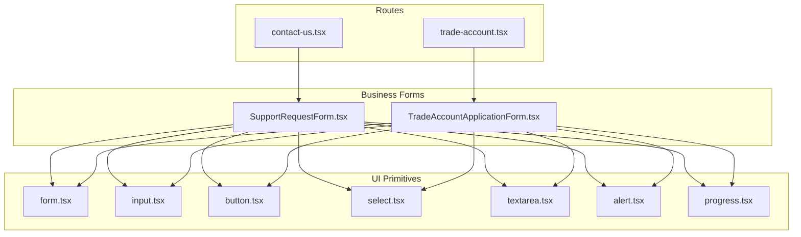
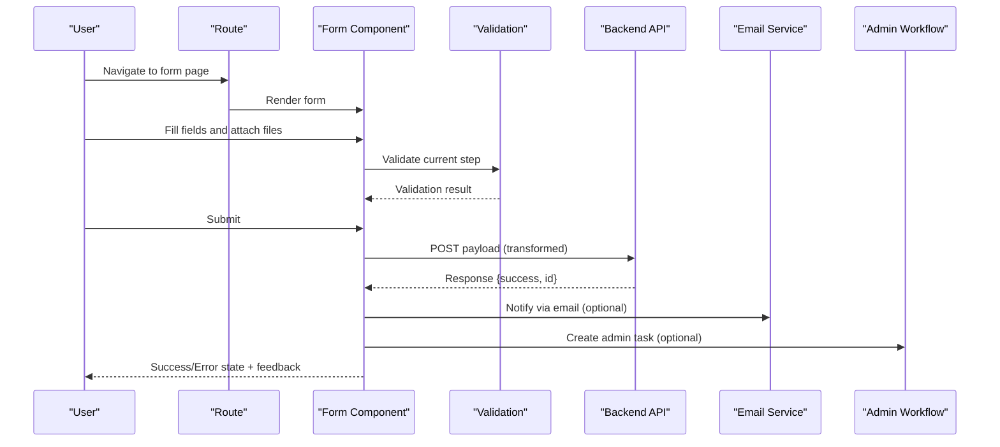
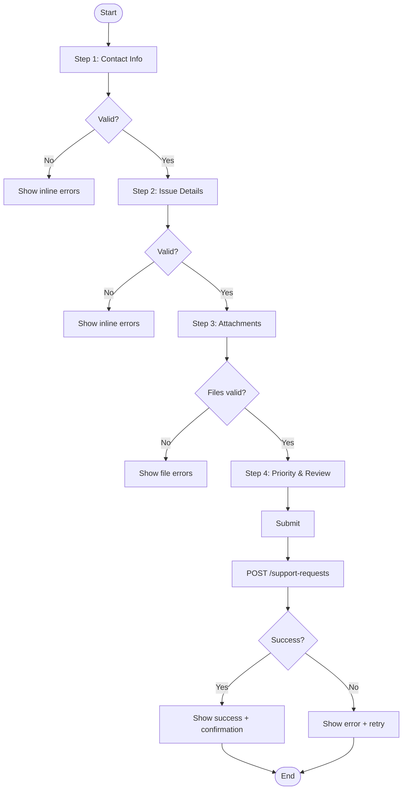
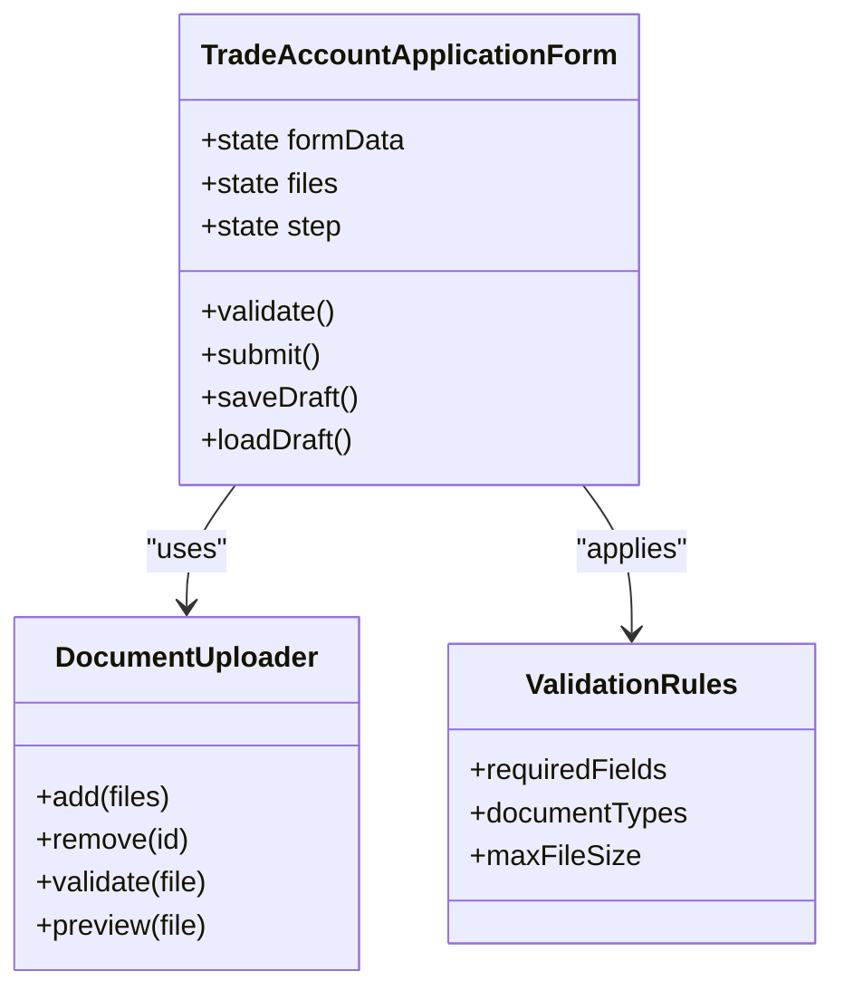
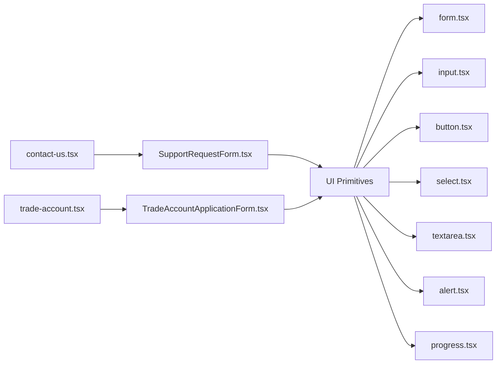

# Business Forms Implementation

<cite>
**Referenced Files in This Document**
- [SupportRequestForm.tsx](file://src/components/shopify/SupportRequestForm.tsx)
- [TradeAccountApplicationForm.tsx](file://src/components/shopify/TradeAccountApplicationForm.tsx)
- [form.tsx](file://src/components/ui/form.tsx)
- [input.tsx](file://src/components/ui/input.tsx)
- [button.tsx](file://src/components/ui/button.tsx)
- [select.tsx](file://src/components/ui/select.tsx)
- [textarea.tsx](file://src/components/ui/textarea.tsx)
- [alert.tsx](file://src/components/ui/alert.tsx)
- [progress.tsx](file://src/components/ui/progress.tsx)
- [contact-us.tsx](file://src/routes/contact-us.tsx)
- [trade-account.tsx](file://src/routes/trade-account.tsx)
</cite>

## Table of Contents
1. [Introduction](#introduction)
2. [Project Structure](#project-structure)
3. [Core Components](#core-components)
4. [Architecture Overview](#architecture-overview)
5. [Detailed Component Analysis](#detailed-component-analysis)
6. [Dependency Analysis](#dependency-analysis)
7. [Performance Considerations](#performance-considerations)
8. [Troubleshooting Guide](#troubleshooting-guide)
9. [Conclusion](#conclusion)

## Introduction
This document explains the business-specific form implementations in SpareAutomation, focusing on:
- Support Request Form: multi-step workflow, file attachment handling, and priority selection logic
- Trade Account Application Form: document upload, company verification fields, and approval workflow integration
It also covers data transformation, API submission handling, success/error states, user feedback, persistence (drafts), and integrations with backend services, email notifications, and admin workflows.

## Project Structure
The forms are implemented as React components under src/components/shopify and integrated into routes for user access. UI primitives are provided by a shared component library under src/components/ui.

**Diagram sources**
- [contact-us.tsx](file://src/routes/contact-us.tsx)
- [trade-account.tsx](file://src/routes/trade-account.tsx)
- [SupportRequestForm.tsx](file://src/components/shopify/SupportRequestForm.tsx)
- [TradeAccountApplicationForm.tsx](file://src/components/shopify/TradeAccountApplicationForm.tsx)
- [form.tsx](file://src/components/ui/form.tsx)
- [input.tsx](file://src/components/ui/input.tsx)
- [button.tsx](file://src/components/ui/button.tsx)
- [select.tsx](file://src/components/ui/select.tsx)
- [textarea.tsx](file://src/components/ui/textarea.tsx)
- [alert.tsx](file://src/components/ui/alert.tsx)
- [progress.tsx](file://src/components/ui/progress.tsx)

**Section sources**
- [contact-us.tsx](file://src/routes/contact-us.tsx)
- [trade-account.tsx](file://src/routes/trade-account.tsx)
- [SupportRequestForm.tsx](file://src/components/shopify/SupportRequestForm.tsx)
- [TradeAccountApplicationForm.tsx](file://src/components/shopify/TradeAccountApplicationForm.tsx)

## Core Components
- SupportRequestForm.tsx: Implements a multi-step support request flow with validation, file attachments, and priority selection. It manages step navigation, local draft persistence, and submission state.
- TradeAccountApplicationForm.tsx: Implements a trade account application with document uploads, company verification fields, and an approval workflow integration point. It handles multi-file uploads, validation, and submission states.

Both components leverage shared UI primitives for consistent behavior and accessibility.

**Section sources**
- [SupportRequestForm.tsx](file://src/components/shopify/SupportRequestForm.tsx)
- [TradeAccountApplicationForm.tsx](file://src/components/shopify/TradeAccountApplicationForm.tsx)
- [form.tsx](file://src/components/ui/form.tsx)
- [input.tsx](file://src/components/ui/input.tsx)
- [button.tsx](file://src/components/ui/button.tsx)
- [select.tsx](file://src/components/ui/select.tsx)
- [textarea.tsx](file://src/components/ui/textarea.tsx)
- [alert.tsx](file://src/components/ui/alert.tsx)
- [progress.tsx](file://src/components/ui/progress.tsx)

## Architecture Overview
The forms follow a layered architecture:
- Route layer: Renders the appropriate form page and provides minimal layout or context.
- Form layer: Encapsulates business logic, validation, state, and submission.
- UI layer: Reusable primitives for inputs, buttons, alerts, and progress indicators.
- Integration layer: Handles API calls, file uploads, and external notifications (email/admin).

[No sources needed since this diagram shows conceptual workflow, not actual code structure]

## Detailed Component Analysis

### Support Request Form
Key responsibilities:
- Multi-step workflow: Step-by-step collection of contact details, issue description, and attachments.
- File attachment handling: Validates file types/sizes, previews, and includes in submission.
- Priority selection: Determines urgency based on user input and/or rules.
- Persistence: Saves drafts locally between steps and sessions.
- Submission: Transforms data, sends to API, and updates UI state.

**Diagram sources**
- [SupportRequestForm.tsx](file://src/components/shopify/SupportRequestForm.tsx)

Behavior highlights:
- Data transformation: Normalizes inputs (trimming, formatting dates/times), aggregates attachments metadata, and maps to API schema.
- Priority logic: Computes priority from explicit selection and contextual cues; may adjust based on keywords or SLA rules.
- Draft saving: Persists partial data to local storage keyed by session or user ID; restores on reload.
- User feedback: Inline field-level errors, step-level alerts, and global success/error banners.

**Section sources**
- [SupportRequestForm.tsx](file://src/components/shopify/SupportRequestForm.tsx)
- [form.tsx](file://src/components/ui/form.tsx)
- [input.tsx](file://src/components/ui/input.tsx)
- [textarea.tsx](file://src/components/ui/textarea.tsx)
- [select.tsx](file://src/components/ui/select.tsx)
- [alert.tsx](file://src/components/ui/alert.tsx)
- [progress.tsx](file://src/components/ui/progress.tsx)

### Trade Account Application Form
Key responsibilities:
- Document upload: Supports multiple documents (e.g., business license, tax ID) with type/size validation and preview.
- Company verification fields: Captures legal name, registration number, address, and authorized signatory details.
- Approval workflow integration: Submits application to backend which triggers review/approval processes and notifications.
- Persistence and recovery: Auto-saves drafts and allows resuming incomplete applications.

**Diagram sources**
- [TradeAccountApplicationForm.tsx](file://src/components/shopify/TradeAccountApplicationForm.tsx)

Behavior highlights:
- Data transformation: Serializes company info and documents into a structured payload; encodes base64 or prepares multipart for upload.
- Submission flow: Calls backend endpoint, handles retries, and persists submission status.
- Approval integration: On success, creates an admin task and optionally emails stakeholders.
- User feedback: Progress indicators during upload, per-document validation messages, and final status banners.

**Section sources**
- [TradeAccountApplicationForm.tsx](file://src/components/shopify/TradeAccountApplicationForm.tsx)
- [form.tsx](file://src/components/ui/form.tsx)
- [input.tsx](file://src/components/ui/input.tsx)
- [select.tsx](file://src/components/ui/select.tsx)
- [alert.tsx](file://src/components/ui/alert.tsx)
- [progress.tsx](file://src/components/ui/progress.tsx)

## Dependency Analysis
Forms depend on shared UI primitives for consistency and reusability. Routes render the forms and provide minimal context.

**Diagram sources**
- [contact-us.tsx](file://src/routes/contact-us.tsx)
- [trade-account.tsx](file://src/routes/trade-account.tsx)
- [SupportRequestForm.tsx](file://src/components/shopify/SupportRequestForm.tsx)
- [TradeAccountApplicationForm.tsx](file://src/components/shopify/TradeAccountApplicationForm.tsx)
- [form.tsx](file://src/components/ui/form.tsx)
- [input.tsx](file://src/components/ui/input.tsx)
- [button.tsx](file://src/components/ui/button.tsx)
- [select.tsx](file://src/components/ui/select.tsx)
- [textarea.tsx](file://src/components/ui/textarea.tsx)
- [alert.tsx](file://src/components/ui/alert.tsx)
- [progress.tsx](file://src/components/ui/progress.tsx)

**Section sources**
- [contact-us.tsx](file://src/routes/contact-us.tsx)
- [trade-account.tsx](file://src/routes/trade-account.tsx)
- [SupportRequestForm.tsx](file://src/components/shopify/SupportRequestForm.tsx)
- [TradeAccountApplicationForm.tsx](file://src/components/shopify/TradeAccountApplicationForm.tsx)

## Performance Considerations
- Debounced validation to reduce re-renders during typing.
- Chunked or lazy loading of large attachments; show upload progress.
- Local draft persistence with throttled writes to avoid excessive storage operations.
- Memoization of computed values (e.g., priority calculation) to prevent unnecessary recalculations.
- Efficient file validation using size/type checks before processing.

[No sources needed since this section provides general guidance]

## Troubleshooting Guide
Common issues and resolutions:
- Validation failures: Ensure required fields are present and formats match expectations; check per-field error messages.
- File upload errors: Verify allowed types and sizes; confirm network connectivity and server endpoints.
- Submission timeouts: Implement retry logic and clear error messages; log request payloads for debugging.
- Draft loss: Confirm local storage keys and versioning; handle migration if schema changes.
- Email/notification failures: Check service configuration and fallback mechanisms; surface actionable errors to users.

**Section sources**
- [SupportRequestForm.tsx](file://src/components/shopify/SupportRequestForm.tsx)
- [TradeAccountApplicationForm.tsx](file://src/components/shopify/TradeAccountApplicationForm.tsx)
- [alert.tsx](file://src/components/ui/alert.tsx)

## Conclusion
SpareAutomation’s business forms deliver robust, user-friendly experiences through modular components, strong validation, and clear feedback. The Support Request Form streamlines multi-step submissions with attachments and priority logic, while the Trade Account Application Form supports comprehensive document handling and approval workflows. Both integrate seamlessly with backend services and provide persistence and recovery for improved usability.

[No sources needed since this section summarizes without analyzing specific files]