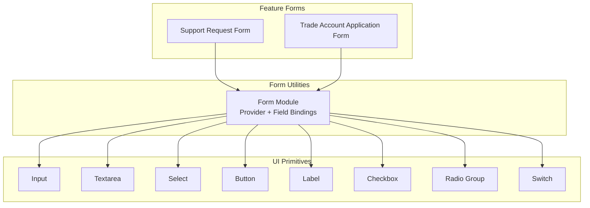
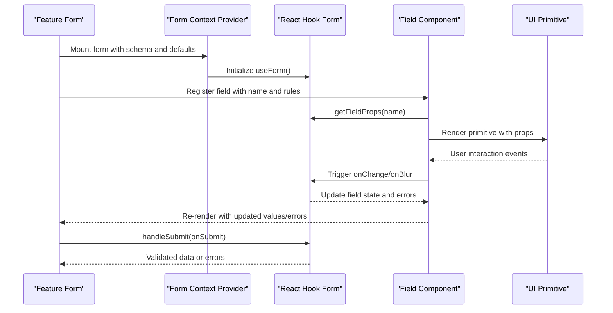
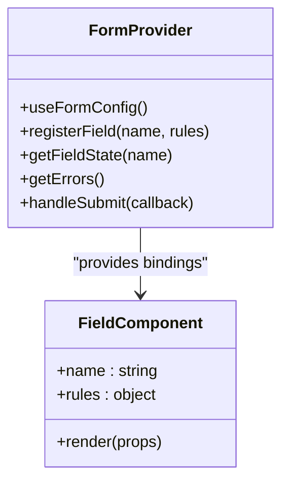
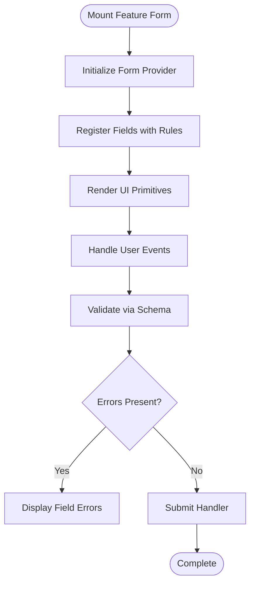
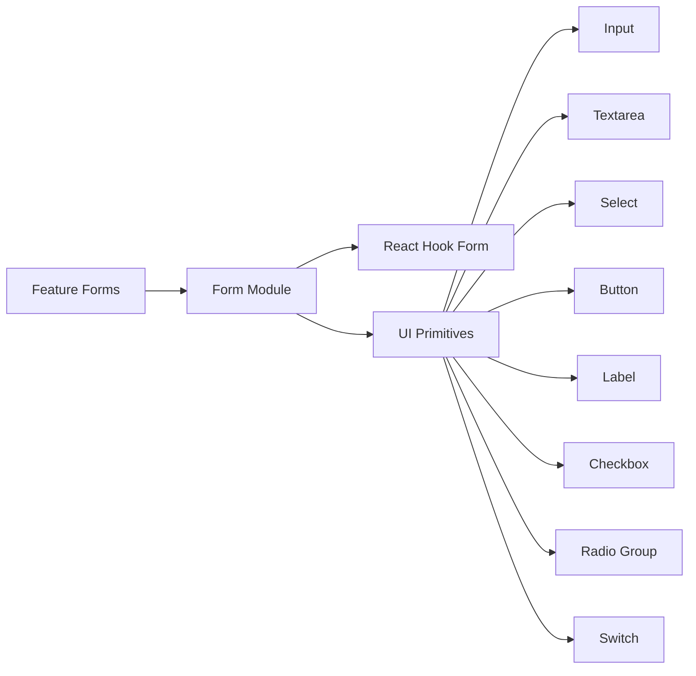

# Form Architecture & Core Components

<cite>
**Referenced Files in This Document**
- [form.tsx](file://src/components/ui/form.tsx)
- [input.tsx](file://src/components/ui/input.tsx)
- [textarea.tsx](file://src/components/ui/textarea.tsx)
- [select.tsx](file://src/components/ui/select.tsx)
- [button.tsx](file://src/components/ui/button.tsx)
- [label.tsx](file://src/components/ui/label.tsx)
- [checkbox.tsx](file://src/components/ui/checkbox.tsx)
- [radio-group.tsx](file://src/components/ui/radio-group.tsx)
- [switch.tsx](file://src/components/ui/switch.tsx)
- [SupportRequestForm.tsx](file://src/components/shopify/SupportRequestForm.tsx)
- [TradeAccountApplicationForm.tsx](file://src/components/shopify/TradeAccountApplicationForm.tsx)
</cite>

## Table of Contents
1. [Introduction](#introduction)
2. [Project Structure](#project-structure)
3. [Core Components](#core-components)
4. [Architecture Overview](#architecture-overview)
5. [Detailed Component Analysis](#detailed-component-analysis)
6. [Dependency Analysis](#dependency-analysis)
7. [Performance Considerations](#performance-considerations)
8. [Troubleshooting Guide](#troubleshooting-guide)
9. [Conclusion](#conclusion)
10. [Appendices](#appendices)

## Introduction
This document explains the form architecture and reusable UI components used across SpareAutomation. It focuses on how React Hook Form is integrated, how fields are composed from base primitives, and how to build accessible, performant forms consistently. You will learn:
- The integration pattern between React Hook Form and the UI layer
- How to register fields, bind validation, and display errors
- The props, styling options, and accessibility features of core form components
- How the form context provider manages field state and re-renders
- Performance optimization techniques for large or complex forms
- Guidelines for creating custom form components that integrate seamlessly with the existing system

## Project Structure
The form-related code is organized under a clear separation of concerns:
- Base UI primitives live under src/components/ui and implement accessible, styled inputs and controls
- Higher-level form utilities (React Hook Form bindings) are provided by a dedicated module
- Feature forms compose these primitives into domain-specific experiences

**Diagram sources**
- [form.tsx](file://src/components/ui/form.tsx)
- [input.tsx](file://src/components/ui/input.tsx)
- [textarea.tsx](file://src/components/ui/textarea.tsx)
- [select.tsx](file://src/components/ui/select.tsx)
- [button.tsx](file://src/components/ui/button.tsx)
- [label.tsx](file://src/components/ui/label.tsx)
- [checkbox.tsx](file://src/components/ui/checkbox.tsx)
- [radio-group.tsx](file://src/components/ui/radio-group.tsx)
- [switch.tsx](file://src/components/ui/switch.tsx)
- [SupportRequestForm.tsx](file://src/components/shopify/SupportRequestForm.tsx)
- [TradeAccountApplicationForm.tsx](file://src/components/shopify/TradeAccountApplicationForm.tsx)

**Section sources**
- [form.tsx](file://src/components/ui/form.tsx)
- [input.tsx](file://src/components/ui/input.tsx)
- [textarea.tsx](file://src/components/ui/textarea.tsx)
- [select.tsx](file://src/components/ui/select.tsx)
- [button.tsx](file://src/components/ui/button.tsx)
- [label.tsx](file://src/components/ui/label.tsx)
- [checkbox.tsx](file://src/components/ui/checkbox.tsx)
- [radio-group.tsx](file://src/components/ui/radio-group.tsx)
- [switch.tsx](file://src/components/ui/switch.tsx)
- [SupportRequestForm.tsx](file://src/components/shopify/SupportRequestForm.tsx)
- [TradeAccountApplicationForm.tsx](file://src/components/shopify/TradeAccountApplicationForm.tsx)

## Core Components
This section documents the base form components and their typical usage patterns within the React Hook Form ecosystem.

- Input
  - Purpose: Single-line text input bound to React Hook Form
  - Typical props: value, onChange, onBlur, id, name, placeholder, disabled, required, type, className, error message binding
  - Styling: Controlled via className; supports variants through composition
  - Accessibility: Associates label via htmlFor/id, exposes aria-invalid when invalid, forwards ref

- Textarea
  - Purpose: Multi-line text input bound to React Hook Form
  - Typical props: rows, maxLength, placeholder, disabled, required, className, error binding
  - Styling: Controlled via className; consistent with Input design tokens
  - Accessibility: Label association, aria-invalid, role semantics

- Select
  - Purpose: Dropdown selection control bound to React Hook Form
  - Typical props: options, value, onChange, placeholder, disabled, required, className, error binding
  - Styling: Controlled via className; consistent with other primitives
  - Accessibility: Keyboard navigation, aria-selected, role="listbox", option roles

- Button
  - Purpose: Submit or action button for forms
  - Typical props: type (submit/reset/button), variant, size, disabled, loading state, className
  - Styling: Controlled via className; consistent theme tokens
  - Accessibility: Semantic button element, keyboard support, aria-busy for async actions

- Label
  - Purpose: Accessible label component for inputs
  - Typical props: htmlFor, className, required indicator
  - Styling: Controlled via className
  - Accessibility: Proper association with input via htmlFor/id

- Checkbox
  - Purpose: Boolean toggle bound to React Hook Form
  - Typical props: checked, onCheckedChange, disabled, required, className, error binding
  - Styling: Controlled via className
  - Accessibility: aria-checked, role="checkbox", keyboard interaction

- Radio Group
  - Purpose: Mutually exclusive selection bound to React Hook Form
  - Typical props: value, onValueChange, orientation, className, error binding
  - Styling: Controlled via className
  - Accessibility: role="radiogroup", radio item roles, arrow key navigation

- Switch
  - Purpose: Toggle switch bound to React Hook Form
  - Typical props: checked, onCheckedChange, disabled, required, className, error binding
  - Styling: Controlled via className
  - Accessibility: aria-checked, role="switch", keyboard interaction

These components are designed to be composed with React Hook Form’s Controller or direct registration patterns, ensuring consistent behavior and accessibility.

**Section sources**
- [input.tsx](file://src/components/ui/input.tsx)
- [textarea.tsx](file://src/components/ui/textarea.tsx)
- [select.tsx](file://src/components/ui/select.tsx)
- [button.tsx](file://src/components/ui/button.tsx)
- [label.tsx](file://src/components/ui/label.tsx)
- [checkbox.tsx](file://src/components/ui/checkbox.tsx)
- [radio-group.tsx](file://src/components/ui/radio-group.tsx)
- [switch.tsx](file://src/components/ui/switch.tsx)

## Architecture Overview
The form architecture follows a layered approach:
- React Hook Form provides state management, validation, and submission handling
- A form utility module wraps React Hook Form to expose a Provider and field bindings
- Base UI primitives encapsulate styling and accessibility
- Feature forms compose primitives and bindings to deliver domain-specific experiences

**Diagram sources**
- [form.tsx](file://src/components/ui/form.tsx)
- [SupportRequestForm.tsx](file://src/components/shopify/SupportRequestForm.tsx)
- [TradeAccountApplicationForm.tsx](file://src/components/shopify/TradeAccountApplicationForm.tsx)

## Detailed Component Analysis

### Form Module (Provider and Bindings)
The form module centralizes React Hook Form configuration and exposes a Provider for consuming forms. It typically:
- Initializes useForm with default values and validation schema
- Provides field registration helpers and error accessors via context
- Ensures consistent field naming and validation lifecycle across the app

Key responsibilities:
- Form initialization and lifecycle management
- Field registration and validation binding
- Error propagation and display hooks
- Submission handling and side effects

**Diagram sources**
- [form.tsx](file://src/components/ui/form.tsx)

**Section sources**
- [form.tsx](file://src/components/ui/form.tsx)

### Input Component
The Input component is a controlled primitive that integrates with React Hook Form. It:
- Accepts standard HTML input attributes plus form-specific props
- Forwards ref and event handlers to React Hook Form
- Applies styling via className and theme tokens
- Exposes accessibility attributes like aria-invalid and role semantics

Typical usage patterns:
- Direct registration with name and rules
- Binding error messages and visual feedback
- Supporting disabled and required states

**Section sources**
- [input.tsx](file://src/components/ui/input.tsx)

### Textarea Component
The Textarea component mirrors Input behavior for multi-line content. It:
- Supports rows, maxLength, and multiline-specific attributes
- Integrates with React Hook Form for validation and state
- Maintains consistent styling and accessibility patterns

**Section sources**
- [textarea.tsx](file://src/components/ui/textarea.tsx)

### Select Component
The Select component provides dropdown selection with:
- Options array and controlled value
- Keyboard navigation and screen reader support
- Integration with React Hook Form for validation and state updates

**Section sources**
- [select.tsx](file://src/components/ui/select.tsx)

### Button Component
The Button component is used for form submission and actions. It:
- Supports submit/reset/button types
- Offers variant and size customization
- Indicates loading state during async submissions
- Maintains semantic button behavior and accessibility

**Section sources**
- [button.tsx](file://src/components/ui/button.tsx)

### Label Component
The Label component ensures proper association with inputs:
- Uses htmlFor/id pairing for accessibility
- Supports required indicators and styling

**Section sources**
- [label.tsx](file://src/components/ui/label.tsx)

### Checkbox Component
The Checkbox component handles boolean toggles:
- Binds checked state and change events to React Hook Form
- Provides keyboard and screen reader support

**Section sources**
- [checkbox.tsx](file://src/components/ui/checkbox.tsx)

### Radio Group Component
The Radio Group component manages mutually exclusive selections:
- Controls group value and individual radio items
- Ensures correct roles and keyboard navigation

**Section sources**
- [radio-group.tsx](file://src/components/ui/radio-group.tsx)

### Switch Component
The Switch component offers a toggle interface:
- Mirrors checkbox semantics with switch-specific visuals
- Integrates with React Hook Form for state and validation

**Section sources**
- [switch.tsx](file://src/components/ui/switch.tsx)

### Feature Forms Composition
Feature forms demonstrate how to compose primitives and bindings:
- Support Request Form: collects user details and request specifics
- Trade Account Application Form: orchestrates multiple sections and validations

**Diagram sources**
- [SupportRequestForm.tsx](file://src/components/shopify/SupportRequestForm.tsx)
- [TradeAccountApplicationForm.tsx](file://src/components/shopify/TradeAccountApplicationForm.tsx)

**Section sources**
- [SupportRequestForm.tsx](file://src/components/shopify/SupportRequestForm.tsx)
- [TradeAccountApplicationForm.tsx](file://src/components/shopify/TradeAccountApplicationForm.tsx)

## Dependency Analysis
The form system exhibits low coupling between primitives and high cohesion around React Hook Form integration. Dependencies flow from feature forms down to primitives, while the form module abstracts React Hook Form usage.

**Diagram sources**
- [form.tsx](file://src/components/ui/form.tsx)
- [input.tsx](file://src/components/ui/input.tsx)
- [textarea.tsx](file://src/components/ui/textarea.tsx)
- [select.tsx](file://src/components/ui/select.tsx)
- [button.tsx](file://src/components/ui/button.tsx)
- [label.tsx](file://src/components/ui/label.tsx)
- [checkbox.tsx](file://src/components/ui/checkbox.tsx)
- [radio-group.tsx](file://src/components/ui/radio-group.tsx)
- [switch.tsx](file://src/components/ui/switch.tsx)
- [SupportRequestForm.tsx](file://src/components/shopify/SupportRequestForm.tsx)
- [TradeAccountApplicationForm.tsx](file://src/components/shopify/TradeAccountApplicationForm.tsx)

**Section sources**
- [form.tsx](file://src/components/ui/form.tsx)
- [input.tsx](file://src/components/ui/input.tsx)
- [textarea.tsx](file://src/components/ui/textarea.tsx)
- [select.tsx](file://src/components/ui/select.tsx)
- [button.tsx](file://src/components/ui/button.tsx)
- [label.tsx](file://src/components/ui/label.tsx)
- [checkbox.tsx](file://src/components/ui/checkbox.tsx)
- [radio-group.tsx](file://src/components/ui/radio-group.tsx)
- [switch.tsx](file://src/components/ui/switch.tsx)
- [SupportRequestForm.tsx](file://src/components/shopify/SupportRequestForm.tsx)
- [TradeAccountApplicationForm.tsx](file://src/components/shopify/TradeAccountApplicationForm.tsx)

## Performance Considerations
- Prefer memoization for expensive field computations and derived values
- Use React Hook Form’s built-in optimizations (e.g., mode, shouldUnregister) to minimize re-renders
- Avoid unnecessary prop drilling by leveraging the form context provider
- Debounce heavy validation logic where appropriate
- Keep UI primitives focused on rendering and event forwarding to reduce overhead

[No sources needed since this section provides general guidance]

## Troubleshooting Guide
Common issues and resolutions:
- Field not updating: Ensure the field is registered with the correct name and that onChange/onBlur are forwarded
- Validation not triggering: Verify rules are attached and the form mode is configured appropriately
- Accessibility warnings: Confirm label-for/input-id pairing and presence of aria-invalid when invalid
- Submit not firing: Check that the submit handler is wrapped with handleSubmit and no preventDefault interferes

**Section sources**
- [form.tsx](file://src/components/ui/form.tsx)
- [input.tsx](file://src/components/ui/input.tsx)
- [textarea.tsx](file://src/components/ui/textarea.tsx)
- [select.tsx](file://src/components/ui/select.tsx)
- [button.tsx](file://src/components/ui/button.tsx)

## Conclusion
SpareAutomation’s form architecture combines React Hook Form with a set of accessible, composable UI primitives. By centralizing form configuration and field bindings in a provider, the system ensures consistency, performance, and accessibility across feature forms. Following the guidelines here will help you create robust forms and custom components that integrate seamlessly with the existing ecosystem.

[No sources needed since this section summarizes without analyzing specific files]

## Appendices

### Creating Custom Form Components
Guidelines for building custom components that integrate with the form system:
- Accept and forward standard input props (value, onChange, onBlur, id, name, disabled, required)
- Integrate with React Hook Form using either direct registration or Controller-based binding
- Maintain accessibility: associate labels, expose aria-invalid, ensure keyboard support
- Keep styling flexible via className and avoid hard-coded styles
- Compose with existing primitives when possible to maintain consistency

**Section sources**
- [form.tsx](file://src/components/ui/form.tsx)
- [input.tsx](file://src/components/ui/input.tsx)
- [textarea.tsx](file://src/components/ui/textarea.tsx)
- [select.tsx](file://src/components/ui/select.tsx)
- [button.tsx](file://src/components/ui/button.tsx)
- [label.tsx](file://src/components/ui/label.tsx)
- [checkbox.tsx](file://src/components/ui/checkbox.tsx)
- [radio-group.tsx](file://src/components/ui/radio-group.tsx)
- [switch.tsx](file://src/components/ui/switch.tsx)