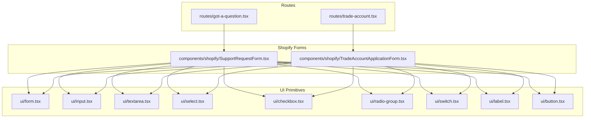
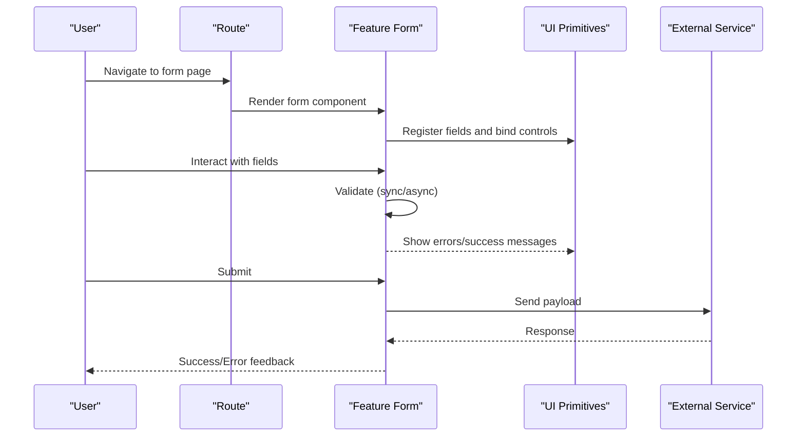
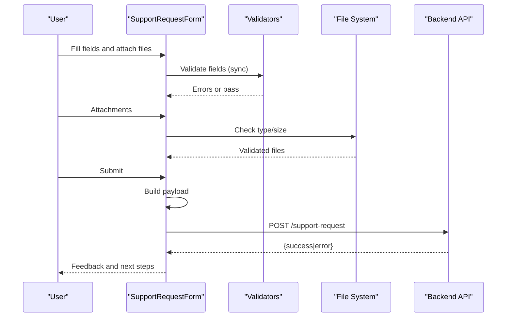
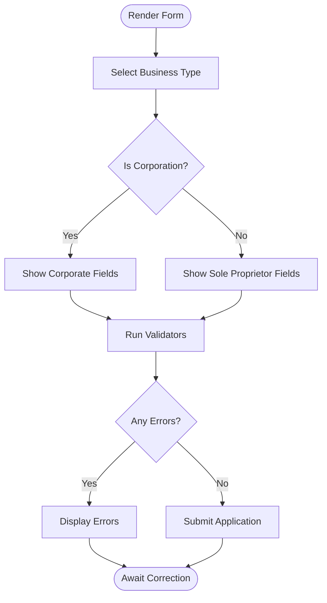
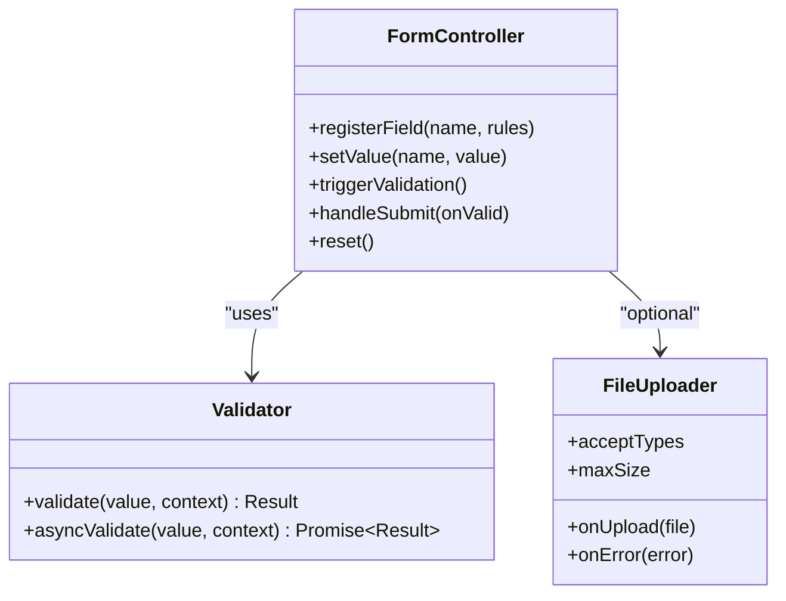
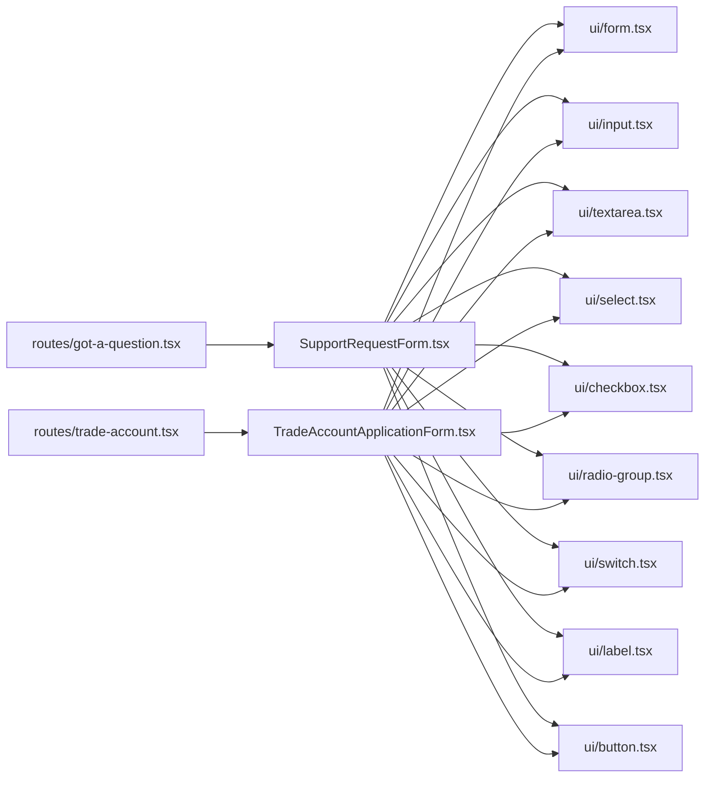

# Forms & Validation

<cite>
**Referenced Files in This Document**
- [SupportRequestForm.tsx](file://src/components/shopify/SupportRequestForm.tsx)
- [TradeAccountApplicationForm.tsx](file://src/components/shopify/TradeAccountApplicationForm.tsx)
- [form.tsx](file://src/components/ui/form.tsx)
- [input.tsx](file://src/components/ui/input.tsx)
- [textarea.tsx](file://src/components/ui/textarea.tsx)
- [select.tsx](file://src/components/ui/select.tsx)
- [checkbox.tsx](file://src/components/ui/checkbox.tsx)
- [radio-group.tsx](file://src/components/ui/radio-group.tsx)
- [switch.tsx](file://src/components/ui/switch.tsx)
- [label.tsx](file://src/components/ui/label.tsx)
- [button.tsx](file://src/components/ui/button.tsx)
- [got-a-question.tsx](file://src/routes/got-a-question.tsx)
- [trade-account.tsx](file://src/routes/trade-account.tsx)
</cite>

## Table of Contents
1. [Introduction](#introduction)
2. [Project Structure](#project-structure)
3. [Core Components](#core-components)
4. [Architecture Overview](#architecture-overview)
5. [Detailed Component Analysis](#detailed-component-analysis)
6. [Dependency Analysis](#dependency-analysis)
7. [Performance Considerations](#performance-considerations)
8. [Troubleshooting Guide](#troubleshooting-guide)
9. [Conclusion](#conclusion)
10. [Appendices](#appendices)

## Introduction
This document explains the forms and validation architecture in SpareAutomation with a focus on React Hook Form integration, validation strategies, error management, accessibility, internationalization patterns, file upload handling, large form optimization, state persistence, and guidelines for building new forms consistently. It includes concrete examples from support request forms and trade account applications to illustrate field validation, conditional logic, and submission handling.

## Project Structure
Forms are implemented as reusable components under src/components/shopify and integrated into routes via src/routes. The UI primitives used by forms live under src/components/ui.

**Diagram sources**
- [got-a-question.tsx](file://src/routes/got-a-question.tsx)
- [trade-account.tsx](file://src/routes/trade-account.tsx)
- [SupportRequestForm.tsx](file://src/components/shopify/SupportRequestForm.tsx)
- [TradeAccountApplicationForm.tsx](file://src/components/shopify/TradeAccountApplicationForm.tsx)
- [form.tsx](file://src/components/ui/form.tsx)
- [input.tsx](file://src/components/ui/input.tsx)
- [textarea.tsx](file://src/components/ui/textarea.tsx)
- [select.tsx](file://src/components/ui/select.tsx)
- [checkbox.tsx](file://src/components/ui/checkbox.tsx)
- [radio-group.tsx](file://src/components/ui/radio-group.tsx)
- [switch.tsx](file://src/components/ui/switch.tsx)
- [label.tsx](file://src/components/ui/label.tsx)
- [button.tsx](file://src/components/ui/button.tsx)

**Section sources**
- [got-a-question.tsx](file://src/routes/got-a-question.tsx)
- [trade-account.tsx](file://src/routes/trade-account.tsx)
- [SupportRequestForm.tsx](file://src/components/shopify/SupportRequestForm.tsx)
- [TradeAccountApplicationForm.tsx](file://src/components/shopify/TradeAccountApplicationForm.tsx)
- [form.tsx](file://src/components/ui/form.tsx)
- [input.tsx](file://src/components/ui/input.tsx)
- [textarea.tsx](file://src/components/ui/textarea.tsx)
- [select.tsx](file://src/components/ui/select.tsx)
- [checkbox.tsx](file://src/components/ui/checkbox.tsx)
- [radio-group.tsx](file://src/components/ui/radio-group.tsx)
- [switch.tsx](file://src/components/ui/switch.tsx)
- [label.tsx](file://src/components/ui/label.tsx)
- [button.tsx](file://src/components/ui/button.tsx)

## Core Components
- SupportRequestForm: A feature-specific form component that encapsulates fields, validation rules, conditional logic, and submission behavior for support requests.
- TradeAccountApplicationForm: A feature-specific form component for trade account applications with its own schema, validation, and submission flow.
- UI primitives (form, input, textarea, select, checkbox, radio-group, switch, label, button): Reusable accessible building blocks used by both forms.

Key responsibilities:
- Field registration and control via React Hook Form.
- Declarative validation using schema-based or custom validators.
- Centralized error display and user feedback.
- Conditional rendering based on field values.
- Submission orchestration and loading/error states.

**Section sources**
- [SupportRequestForm.tsx](file://src/components/shopify/SupportRequestForm.tsx)
- [TradeAccountApplicationForm.tsx](file://src/components/shopify/TradeAccountApplicationForm.tsx)
- [form.tsx](file://src/components/ui/form.tsx)
- [input.tsx](file://src/components/ui/input.tsx)
- [textarea.tsx](file://src/components/ui/textarea.tsx)
- [select.tsx](file://src/components/ui/select.tsx)
- [checkbox.tsx](file://src/components/ui/checkbox.tsx)
- [radio-group.tsx](file://src/components/ui/radio-group.tsx)
- [switch.tsx](file://src/components/ui/switch.tsx)
- [label.tsx](file://src/components/ui/label.tsx)
- [button.tsx](file://src/components/ui/button.tsx)

## Architecture Overview
The forms follow a layered approach:
- Route layer mounts feature forms.
- Feature form layer orchestrates React Hook Form, validation, and submission.
- UI primitive layer provides accessible inputs and layout helpers.

[No sources needed since this diagram shows conceptual workflow, not actual code structure]

## Detailed Component Analysis

### Support Request Form
Responsibilities:
- Collects user details, issue type, description, and optional attachments.
- Applies required, length, and format validations.
- Handles conditional fields (e.g., show additional info when specific issue types are selected).
- Manages file uploads with size/type checks and progress feedback.
- Submits data and displays success or error states.

Validation strategy:
- Schema-driven validation for core fields.
- Custom validators for domain-specific constraints.
- Asynchronous validation for uniqueness or server-side checks where applicable.

Error management:
- Field-level errors displayed near inputs.
- Global errors shown at the top of the form.
- Clear, actionable messages aligned with accessibility best practices.

Accessibility:
- Labels associated with inputs via aria attributes.
- Error summaries linked to invalid fields.
- Keyboard navigation and focus management for complex sections.

Internationalization:
- All user-facing strings externalized for translation.
- Dynamic labels and help text based on locale.

File upload handling:
- Client-side validation for file type and size.
- Optional image processing before upload (resize/compress).
- Upload progress and retry on failure.

Large form optimization:
- Lazy evaluation of expensive validations.
- Debounced async checks.
- Virtualization if supporting very long lists.

Draft saving and recovery:
- Auto-save draft to local storage periodically.
- Resume draft on reload.
- Clear draft after successful submission.

Submission handling:
- Prevent duplicate submissions.
- Show loading state during network calls.
- Handle timeouts and retries gracefully.

**Section sources**
- [SupportRequestForm.tsx](file://src/components/shopify/SupportRequestForm.tsx)
- [form.tsx](file://src/components/ui/form.tsx)
- [input.tsx](file://src/components/ui/input.tsx)
- [textarea.tsx](file://src/components/ui/textarea.tsx)
- [select.tsx](file://src/components/ui/select.tsx)
- [checkbox.tsx](file://src/components/ui/checkbox.tsx)
- [radio-group.tsx](file://src/components/ui/radio-group.tsx)
- [switch.tsx](file://src/components/ui/switch.tsx)
- [label.tsx](file://src/components/ui/label.tsx)
- [button.tsx](file://src/components/ui/button.tsx)

#### Sequence Diagram: Support Request Submission

**Diagram sources**
- [SupportRequestForm.tsx](file://src/components/shopify/SupportRequestForm.tsx)

### Trade Account Application Form
Responsibilities:
- Captures business information, contact details, and compliance-related fields.
- Enforces stricter validation rules (e.g., tax ID formats, address requirements).
- Implements conditional sections based on business type or region.
- Integrates with backend workflows for approval processes.

Validation strategy:
- Strong schema validation for legal and financial fields.
- Cross-field validation (e.g., matching addresses).
- Async checks for existing accounts or domains.

Error management:
- Grouped errors for sections.
- Inline guidance and tooltips for complex fields.

Accessibility:
- Section headings and landmarks for screen readers.
- Focus order optimized for multi-step flows.

Internationalization:
- Locale-aware formatting for numbers, dates, and currencies.
- Region-specific options and labels.

File upload handling:
- Required documents (e.g., certificates) with strict type/size limits.
- Preview and remove capabilities.

Large form optimization:
- Step-by-step wizard pattern to reduce cognitive load.
- Persist per-step drafts.

Draft saving and recovery:
- Per-step auto-save.
- Resume across sessions.

Submission handling:
- Multi-stage submission with progress indicators.
- Robust error handling and retry mechanisms.

**Section sources**
- [TradeAccountApplicationForm.tsx](file://src/components/shopify/TradeAccountApplicationForm.tsx)
- [form.tsx](file://src/components/ui/form.tsx)
- [input.tsx](file://src/components/ui/input.tsx)
- [textarea.tsx](file://src/components/ui/textarea.tsx)
- [select.tsx](file://src/components/ui/select.tsx)
- [checkbox.tsx](file://src/components/ui/checkbox.tsx)
- [radio-group.tsx](file://src/components/ui/radio-group.tsx)
- [switch.tsx](file://src/components/ui/switch.tsx)
- [label.tsx](file://src/components/ui/label.tsx)
- [button.tsx](file://src/components/ui/button.tsx)

#### Flowchart: Conditional Logic Example

**Diagram sources**
- [TradeAccountApplicationForm.tsx](file://src/components/shopify/TradeAccountApplicationForm.tsx)

### Conceptual Overview
The following conceptual diagrams summarize common patterns used across forms.

[No sources needed since this diagram shows conceptual workflow, not actual code structure]

## Dependency Analysis
Forms depend on UI primitives for consistent styling and accessibility. Routes mount feature forms and may provide route-level props or context.

**Diagram sources**
- [got-a-question.tsx](file://src/routes/got-a-question.tsx)
- [trade-account.tsx](file://src/routes/trade-account.tsx)
- [SupportRequestForm.tsx](file://src/components/shopify/SupportRequestForm.tsx)
- [TradeAccountApplicationForm.tsx](file://src/components/shopify/TradeAccountApplicationForm.tsx)
- [form.tsx](file://src/components/ui/form.tsx)
- [input.tsx](file://src/components/ui/input.tsx)
- [textarea.tsx](file://src/components/ui/textarea.tsx)
- [select.tsx](file://src/components/ui/select.tsx)
- [checkbox.tsx](file://src/components/ui/checkbox.tsx)
- [radio-group.tsx](file://src/components/ui/radio-group.tsx)
- [switch.tsx](file://src/components/ui/switch.tsx)
- [label.tsx](file://src/components/ui/label.tsx)
- [button.tsx](file://src/components/ui/button.tsx)

**Section sources**
- [got-a-question.tsx](file://src/routes/got-a-question.tsx)
- [trade-account.tsx](file://src/routes/trade-account.tsx)
- [SupportRequestForm.tsx](file://src/components/shopify/SupportRequestForm.tsx)
- [TradeAccountApplicationForm.tsx](file://src/components/shopify/TradeAccountApplicationForm.tsx)
- [form.tsx](file://src/components/ui/form.tsx)
- [input.tsx](file://src/components/ui/input.tsx)
- [textarea.tsx](file://src/components/ui/textarea.tsx)
- [select.tsx](file://src/components/ui/select.tsx)
- [checkbox.tsx](file://src/components/ui/checkbox.tsx)
- [radio-group.tsx](file://src/components/ui/radio-group.tsx)
- [switch.tsx](file://src/components/ui/switch.tsx)
- [label.tsx](file://src/components/ui/label.tsx)
- [button.tsx](file://src/components/ui/button.tsx)

## Performance Considerations
- Prefer schema-based validation to minimize re-renders.
- Use debouncing for async validations triggered by typing.
- Split large forms into steps or sections to reduce initial render cost.
- Memoize heavy computations and derived values.
- Avoid unnecessary state updates; batch changes where possible.
- For file uploads, compress images client-side and stream uploads for large files.

[No sources needed since this section provides general guidance]

## Troubleshooting Guide
Common issues and resolutions:
- Validation not triggering: Ensure fields are registered and rules are correctly bound.
- Duplicate submissions: Guard submit handlers with loading flags.
- File upload failures: Validate MIME types and sizes early; handle network errors with retries.
- Accessibility gaps: Verify labels, aria-describedby for errors, and focus management.
- Internationalization problems: Confirm all strings are externalized and locale-aware formatting is applied.

**Section sources**
- [SupportRequestForm.tsx](file://src/components/shopify/SupportRequestForm.tsx)
- [TradeAccountApplicationForm.tsx](file://src/components/shopify/TradeAccountApplicationForm.tsx)
- [form.tsx](file://src/components/ui/form.tsx)

## Conclusion
SpareAutomation’s forms leverage React Hook Form with a clear separation between feature-specific logic and reusable UI primitives. Validation is declarative and extensible, with robust error handling, accessibility, and i18n support. File uploads and large form patterns are addressed through client-side checks, compression, and stepwise flows. Draft persistence improves user experience by allowing recovery and resuming work. Following the guidelines here ensures consistent, accessible, and performant forms across the application.

[No sources needed since this section summarizes without analyzing specific files]

## Appendices

### Guidelines for Creating New Forms
- Use React Hook Form for registration, control, and validation.
- Define a schema for each form and keep validators close to the form.
- Compose UI primitives from the shared UI library for consistency and accessibility.
- Externalize all user-facing strings for internationalization.
- Implement conditional logic only when necessary; keep it testable and readable.
- Provide clear error messages and success feedback.
- Add keyboard navigation and screen reader annotations.
- For large forms, consider step wizards and per-step persistence.
- For file uploads, validate types/sizes, offer previews, and handle errors gracefully.

[No sources needed since this section provides general guidance]