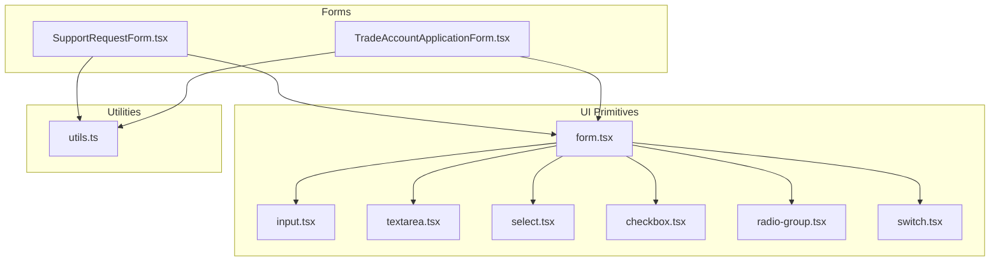
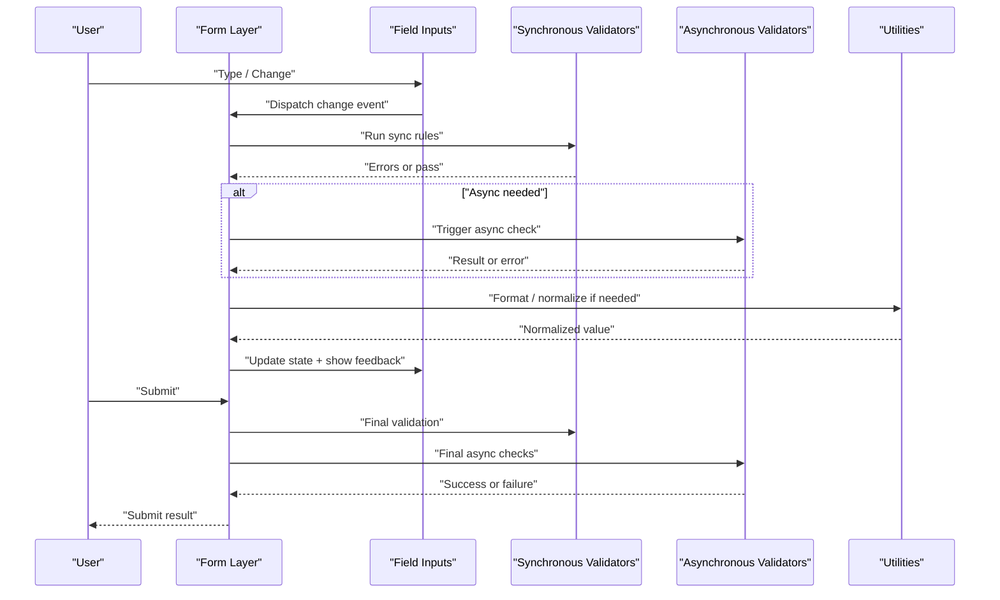
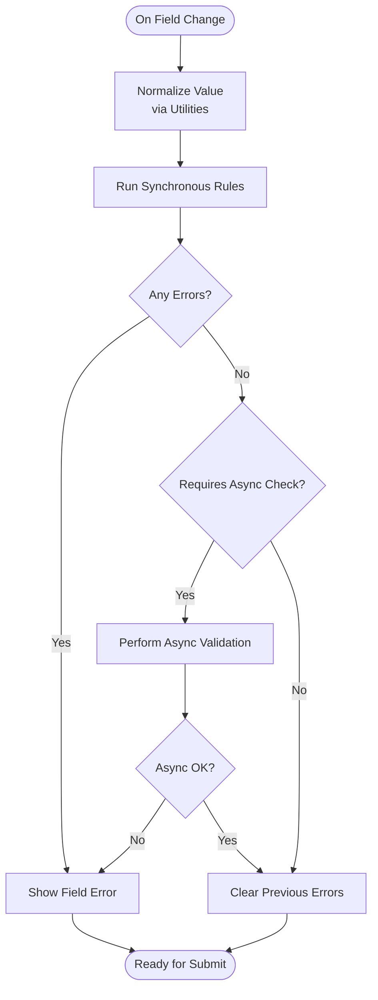
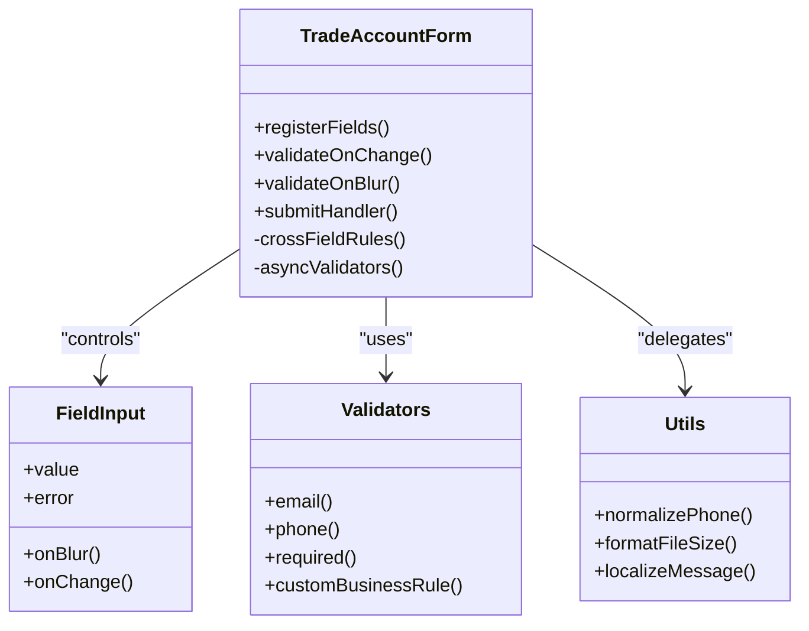
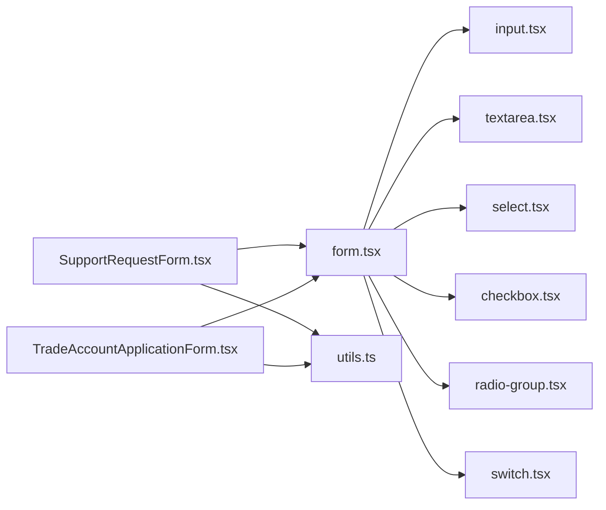

# Validation Strategies & Patterns

<cite>
**Referenced Files in This Document**
- [SupportRequestForm.tsx](file://src/components/shopify/SupportRequestForm.tsx)
- [TradeAccountApplicationForm.tsx](file://src/components/shopify/TradeAccountApplicationForm.tsx)
- [form.tsx](file://src/components/ui/form.tsx)
- [input.tsx](file://src/components/ui/input.tsx)
- [textarea.tsx](file://src/components/ui/textarea.tsx)
- [select.tsx](file://src/components/ui/select.tsx)
- [checkbox.tsx](file://src/components/ui/checkbox.tsx)
- [radio-group.tsx](file://src/components/ui/radio-group.tsx)
- [switch.tsx](file://src/components/ui/switch.tsx)
- [utils.ts](file://src/lib/utils.ts)
</cite>

## Table of Contents
1. [Introduction](#introduction)
2. [Project Structure](#project-structure)
3. [Core Components](#core-components)
4. [Architecture Overview](#architecture-overview)
5. [Detailed Component Analysis](#detailed-component-analysis)
6. [Dependency Analysis](#dependency-analysis)
7. [Performance Considerations](#performance-considerations)
8. [Troubleshooting Guide](#troubleshooting-guide)
9. [Conclusion](#conclusion)

## Introduction
This document explains the validation strategies and patterns used across SpareAutomation forms, focusing on both synchronous and asynchronous approaches, custom validators, schema-based validation, field-level rules, cross-field checks, conditional logic, and real-time feedback. It includes examples drawn from the Support Request and Trade Account Application forms, covering email validation, phone number formatting, file size limits, and business rule enforcement. It also addresses error messaging, localization support, and performance considerations for complex scenarios.

## Project Structure
Validation is implemented primarily within form components using a UI form system and shared input primitives. The key files include:
- Form components that implement validation logic and user interactions
- Reusable UI primitives that integrate with the form system
- Utility helpers for common operations

**Diagram sources**
- [SupportRequestForm.tsx](file://src/components/shopify/SupportRequestForm.tsx)
- [TradeAccountApplicationForm.tsx](file://src/components/shopify/TradeAccountApplicationForm.tsx)
- [form.tsx](file://src/components/ui/form.tsx)
- [input.tsx](file://src/components/ui/input.tsx)
- [textarea.tsx](file://src/components/ui/textarea.tsx)
- [select.tsx](file://src/components/ui/select.tsx)
- [checkbox.tsx](file://src/components/ui/checkbox.tsx)
- [radio-group.tsx](file://src/components/ui/radio-group.tsx)
- [switch.tsx](file://src/components/ui/switch.tsx)
- [utils.ts](file://src/lib/utils.ts)

**Section sources**
- [SupportRequestForm.tsx](file://src/components/shopify/SupportRequestForm.tsx)
- [TradeAccountApplicationForm.tsx](file://src/components/shopify/TradeAccountApplicationForm.tsx)
- [form.tsx](file://src/components/ui/form.tsx)
- [input.tsx](file://src/components/ui/input.tsx)
- [textarea.tsx](file://src/components/ui/textarea.tsx)
- [select.tsx](file://src/components/ui/select.tsx)
- [checkbox.tsx](file://src/components/ui/checkbox.tsx)
- [radio-group.tsx](file://src/components/ui/radio-group.tsx)
- [switch.tsx](file://src/components/ui/switch.tsx)
- [utils.ts](file://src/lib/utils.ts)

## Core Components
- Form orchestration layer: Provides field registration, state management, validation triggers, and submission handling.
- Input primitives: Provide controlled inputs that integrate with the form layer and expose validation states to consumers.
- Utilities: Offer helper functions for formatting, normalization, and shared validation logic.

Key responsibilities:
- Field-level validation: Enforce required fields, format constraints (e.g., email, phone), and business rules.
- Cross-field validation: Validate relationships between multiple fields (e.g., confirmations, dependent fields).
- Conditional validation: Enable/disable or alter rules based on other field values or selections.
- Real-time feedback: Show errors as users type or blur, with debounced updates where appropriate.
- Asynchronous validation: Perform server-side checks (e.g., uniqueness) with loading states and cancellation.

**Section sources**
- [form.tsx](file://src/components/ui/form.tsx)
- [input.tsx](file://src/components/ui/input.tsx)
- [textarea.tsx](file://src/components/ui/textarea.tsx)
- [select.tsx](file://src/components/ui/select.tsx)
- [checkbox.tsx](file://src/components/ui/checkbox.tsx)
- [radio-group.tsx](file://src/components/ui/radio-group.tsx)
- [switch.tsx](file://src/components/ui/switch.tsx)
- [utils.ts](file://src/lib/utils.ts)

## Architecture Overview
The validation architecture separates concerns into three layers:
- Schema and rules: Define field constraints, formats, and cross-field conditions.
- Validators: Implement synchronous and asynchronous checks; may be composed or reused across forms.
- UI integration: Connects validation results to input components, showing messages and controlling submit behavior.

[No sources needed since this diagram shows conceptual workflow, not actual code structure]

## Detailed Component Analysis

### Support Request Form
Focus areas:
- Email validation: Ensures correct format and domain constraints.
- Phone number formatting: Normalizes input and validates length/format.
- File upload: Validates file size and type before submission.
- Business rules: Enforces required fields and contextual constraints.

Implementation highlights:
- Field-level rules are applied on change and blur events for immediate feedback.
- Asynchronous checks are used for availability or policy verification when applicable.
- Conditional logic adjusts required fields based on request type or category selection.
- Error messages are localized via utility functions or message maps.

**Section sources**
- [SupportRequestForm.tsx](file://src/components/shopify/SupportRequestForm.tsx)
- [form.tsx](file://src/components/ui/form.tsx)
- [input.tsx](file://src/components/ui/input.tsx)
- [textarea.tsx](file://src/components/ui/textarea.tsx)
- [utils.ts](file://src/lib/utils.ts)

### Trade Account Application Form
Focus areas:
- Multi-step or grouped fields with cross-field validation (e.g., company details vs. contact info).
- Conditional requirements based on account type or region.
- Robust email and phone validation with internationalization support.
- File attachments with strict size/type checks and progress feedback.

Implementation highlights:
- Cross-field rules validate dependencies (e.g., tax ID presence depending on country).
- Debounced async validation reduces network calls during typing.
- Centralized error mapping supports consistent messaging and localization.

**Diagram sources**
- [TradeAccountApplicationForm.tsx](file://src/components/shopify/TradeAccountApplicationForm.tsx)
- [form.tsx](file://src/components/ui/form.tsx)
- [input.tsx](file://src/components/ui/input.tsx)
- [utils.ts](file://src/lib/utils.ts)

**Section sources**
- [TradeAccountApplicationForm.tsx](file://src/components/shopify/TradeAccountApplicationForm.tsx)
- [form.tsx](file://src/components/ui/form.tsx)
- [input.tsx](file://src/components/ui/input.tsx)
- [textarea.tsx](file://src/components/ui/textarea.tsx)
- [select.tsx](file://src/components/ui/select.tsx)
- [checkbox.tsx](file://src/components/ui/checkbox.tsx)
- [radio-group.tsx](file://src/components/ui/radio-group.tsx)
- [switch.tsx](file://src/components/ui/switch.tsx)
- [utils.ts](file://src/lib/utils.ts)

### Shared UI Primitives Integration
- Controlled inputs accept value, onChange, onBlur, and error props to integrate with the form layer.
- Select, radio group, checkbox, and switch components follow the same contract for consistency.
- Error display is handled by wrapping components or dedicated error slots provided by the form layer.

**Section sources**
- [form.tsx](file://src/components/ui/form.tsx)
- [input.tsx](file://src/components/ui/input.tsx)
- [textarea.tsx](file://src/components/ui/textarea.tsx)
- [select.tsx](file://src/components/ui/select.tsx)
- [checkbox.tsx](file://src/components/ui/checkbox.tsx)
- [radio-group.tsx](file://src/components/ui/radio-group.tsx)
- [switch.tsx](file://src/components/ui/switch.tsx)

## Dependency Analysis
The validation flow depends on:
- Form layer for state and lifecycle management
- Input primitives for rendering and event handling
- Utilities for normalization, formatting, and localization

**Diagram sources**
- [SupportRequestForm.tsx](file://src/components/shopify/SupportRequestForm.tsx)
- [TradeAccountApplicationForm.tsx](file://src/components/shopify/TradeAccountApplicationForm.tsx)
- [form.tsx](file://src/components/ui/form.tsx)
- [input.tsx](file://src/components/ui/input.tsx)
- [textarea.tsx](file://src/components/ui/textarea.tsx)
- [select.tsx](file://src/components/ui/select.tsx)
- [checkbox.tsx](file://src/components/ui/checkbox.tsx)
- [radio-group.tsx](file://src/components/ui/radio-group.tsx)
- [switch.tsx](file://src/components/ui/switch.tsx)
- [utils.ts](file://src/lib/utils.ts)

**Section sources**
- [SupportRequestForm.tsx](file://src/components/shopify/SupportRequestForm.tsx)
- [TradeAccountApplicationForm.tsx](file://src/components/shopify/TradeAccountApplicationForm.tsx)
- [form.tsx](file://src/components/ui/form.tsx)
- [input.tsx](file://src/components/ui/input.tsx)
- [textarea.tsx](file://src/components/ui/textarea.tsx)
- [select.tsx](file://src/components/ui/select.tsx)
- [checkbox.tsx](file://src/components/ui/checkbox.tsx)
- [radio-group.tsx](file://src/components/ui/radio-group.tsx)
- [switch.tsx](file://src/components/ui/switch.tsx)
- [utils.ts](file://src/lib/utils.ts)

## Performance Considerations
- Debounce async validation to avoid excessive network requests during rapid typing.
- Run synchronous validations only when necessary; skip on every keystroke for heavy computations.
- Use memoization for computed validation results when field sets are large.
- Batch updates to minimize re-renders; update only affected fields.
- Cancel pending async validations on unmount or when new input arrives to prevent race conditions.
- Prefer normalized values to reduce repeated parsing and formatting overhead.

[No sources needed since this section provides general guidance]

## Troubleshooting Guide
Common issues and resolutions:
- Missing error messages: Ensure the form layer passes error strings to input components and that localized messages are resolved correctly.
- Stale async results: Implement cancellation tokens or abort controllers to discard outdated responses.
- Inconsistent field states: Verify that onChange and onBlur handlers update the same source of truth and trigger validation consistently.
- Localization gaps: Confirm that all error keys exist in the message map and fallback gracefully.
- File validation failures: Double-check size thresholds and MIME types; ensure client-side checks align with server expectations.

**Section sources**
- [form.tsx](file://src/components/ui/form.tsx)
- [input.tsx](file://src/components/ui/input.tsx)
- [utils.ts](file://src/lib/utils.ts)

## Conclusion
SpareAutomation’s forms employ a layered validation strategy combining synchronous and asynchronous checks, reusable utilities, and consistent UI integration. Field-level and cross-field rules, along with conditional logic and real-time feedback, provide robust user experiences. By following the patterns outlined here—debouncing async work, centralizing error messaging, and leveraging shared utilities—you can extend validation across additional forms while maintaining performance and clarity.