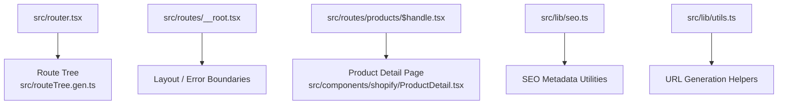
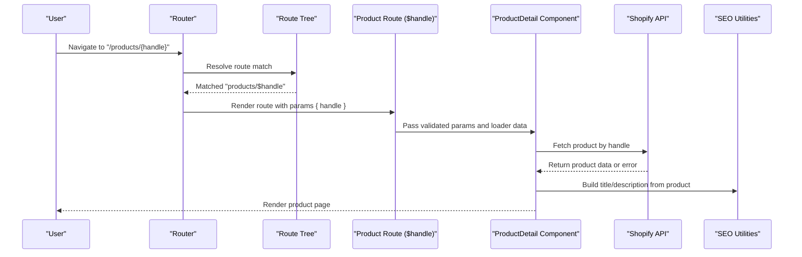
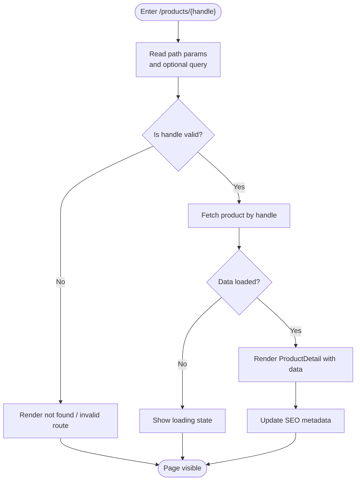
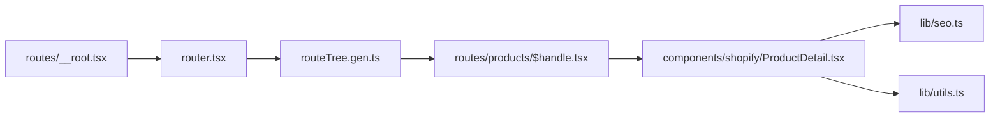

# Dynamic Routing & Parameters

<cite>
**Referenced Files in This Document**
- [src/routes/products/$handle.tsx](file://src/routes/products/$handle.tsx)
- [src/router.tsx](file://src/router.tsx)
- [src/routes/__root.tsx](file://src/routes/__root.tsx)
- [src/routeTree.gen.ts](file://src/routeTree.gen.ts)
- [src/components/shopify/ProductDetail.tsx](file://src/components/shopify/ProductDetail.tsx)
- [src/lib/seo.ts](file://src/lib/seo.ts)
- [src/lib/utils.ts](file://src/lib/utils.ts)
</cite>

## Table of Contents
1. [Introduction](#introduction)
2. [Project Structure](#project-structure)
3. [Core Components](#core-components)
4. [Architecture Overview](#architecture-overview)
5. [Detailed Component Analysis](#detailed-component-analysis)
6. [Dependency Analysis](#dependency-analysis)
7. [Performance Considerations](#performance-considerations)
8. [Troubleshooting Guide](#troubleshooting-guide)
9. [Conclusion](#conclusion)
10. [Appendices](#appendices)

## Introduction

This document explains how dynamic routing and parameter handling work in SpareAutomation, focusing on path parameters, query strings, route validation, product detail pages with handle-based URLs, error handling, fallbacks, URL generation utilities, SEO-friendly URLs, and loading states during data transitions. It provides practical guidance for creating new dynamic routes, extracting and validating parameters, implementing route-specific data fetching, and maintaining robust user experiences.

## Project Structure

SpareAutomation uses a file-based routing approach where each route is represented by a file under src/routes. Dynamic segments use a dollar-prefixed filename (for example, $handle). The generated route tree and router configuration centralize route definitions and runtime behavior.

**Diagram sources**
- [src/router.tsx](file://src/router.tsx)
- [src/routeTree.gen.ts](file://src/routeTree.gen.ts)
- [src/routes/__root.tsx](file://src/routes/__root.tsx)
- [src/routes/products/$handle.tsx](file://src/routes/products/$handle.tsx)
- [src/components/shopify/ProductDetail.tsx](file://src/components/shopify/ProductDetail.tsx)
- [src/lib/seo.ts](file://src/lib/seo.ts)
- [src/lib/utils.ts](file://src/lib/utils.ts)

**Section sources**
- [src/router.tsx](file://src/router.tsx)
- [src/routeTree.gen.ts](file://src/routeTree.gen.ts)
- [src/routes/__root.tsx](file://src/routes/__root.tsx)
- [src/routes/products/$handle.tsx](file://src/routes/products/$handle.tsx)

## Core Components

- Dynamic route file for product details using a handle-based path segment.
- Root layout and global error boundaries to catch route-level errors.
- Product detail component responsible for rendering product information.
- SEO utilities for generating metadata from dynamic content.
- Utility helpers for building and normalizing URLs.

Key responsibilities:
- Extracting path parameters and query strings.
- Validating inputs before data fetching.
- Rendering loading and error states.
- Generating SEO-friendly URLs and metadata.

**Section sources**
- [src/routes/products/$handle.tsx](file://src/routes/products/$handle.tsx)
- [src/routes/__root.tsx](file://src/routes/__root.tsx)
- [src/components/shopify/ProductDetail.tsx](file://src/components/shopify/ProductDetail.tsx)
- [src/lib/seo.ts](file://src/lib/seo.ts)
- [src/lib/utils.ts](file://src/lib/utils.ts)

## Architecture Overview

The routing architecture centers around a generated route tree and a root layout that provides shared UI and error boundaries. Dynamic product routes map a handle to a product detail page, which fetches data and renders it with SEO metadata.

**Diagram sources**
- [src/router.tsx](file://src/router.tsx)
- [src/routeTree.gen.ts](file://src/routeTree.gen.ts)
- [src/routes/products/$handle.tsx](file://src/routes/products/$handle.tsx)
- [src/components/shopify/ProductDetail.tsx](file://src/components/shopify/ProductDetail.tsx)
- [src/lib/seo.ts](file://src/lib/seo.ts)

## Detailed Component Analysis

### Product Detail Route (Handle-Based URL)

The product detail route uses a dynamic path segment named handle. This pattern enables clean, SEO-friendly URLs like /products/my-product-handle.

Implementation highlights:
- Path parameter extraction: The route receives the handle via the route’s params object.
- Query string handling: Optional filters or variants can be read from the search object.
- Validation: Ensure the handle is non-empty and conforms to expected format before data fetching.
- Data fetching: Use a loader or effect to fetch product data by handle; handle network errors gracefully.
- Loading state: Show a skeleton or spinner while data loads.
- Error boundary: Wrap route content to display a friendly error message if fetching fails.
- SEO: Generate title and description from product data.

**Diagram sources**
- [src/routes/products/$handle.tsx](file://src/routes/products/$handle.tsx)
- [src/components/shopify/ProductDetail.tsx](file://src/components/shopify/ProductDetail.tsx)
- [src/lib/seo.ts](file://src/lib/seo.ts)

**Section sources**
- [src/routes/products/$handle.tsx](file://src/routes/products/$handle.tsx)
- [src/components/shopify/ProductDetail.tsx](file://src/components/shopify/ProductDetail.tsx)
- [src/lib/seo.ts](file://src/lib/seo.ts)

### Root Layout and Error Boundaries

The root layout defines global UI chrome and error boundaries. It ensures consistent navigation, header/footer, and catches route-level errors so users see a graceful error page instead of a crash.

Responsibilities:
- Provide shared layout components.
- Implement error boundaries for route-level failures.
- Optionally set default SEO metadata.

**Section sources**
- [src/routes/__root.tsx](file://src/routes/__root.tsx)

### Product Detail Component

The product detail component renders product information once data is available. It should:
- Accept validated parameters and preloaded data.
- Display loading skeletons when data is pending.
- Handle and display errors returned from data fetching.
- Integrate with SEO utilities to update page metadata.

**Section sources**
- [src/components/shopify/ProductDetail.tsx](file://src/components/shopify/ProductDetail.tsx)

### SEO Utilities

SEO utilities help generate human-readable titles and descriptions from dynamic content such as product names and summaries. They also ensure canonical URLs and meta tags are set appropriately for SEO.

**Section sources**
- [src/lib/seo.ts](file://src/lib/seo.ts)

### URL Generation Utilities

Utility functions assist in constructing URLs for internal links, including dynamic segments and query strings. These helpers improve consistency and reduce duplication across the app.

**Section sources**
- [src/lib/utils.ts](file://src/lib/utils.ts)

## Dependency Analysis

The following diagram shows key dependencies among routing, product detail, and utility modules.

**Diagram sources**
- [src/router.tsx](file://src/router.tsx)
- [src/routeTree.gen.ts](file://src/routeTree.gen.ts)
- [src/routes/products/$handle.tsx](file://src/routes/products/$handle.tsx)
- [src/components/shopify/ProductDetail.tsx](file://src/components/shopify/ProductDetail.tsx)
- [src/lib/seo.ts](file://src/lib/seo.ts)
- [src/lib/utils.ts](file://src/lib/utils.ts)

**Section sources**
- [src/router.tsx](file://src/router.tsx)
- [src/routeTree.gen.ts](file://src/routeTree.gen.ts)
- [src/routes/products/$handle.tsx](file://src/routes/products/$handle.tsx)
- [src/components/shopify/ProductDetail.tsx](file://src/components/shopify/ProductDetail.tsx)
- [src/lib/seo.ts](file://src/lib/seo.ts)
- [src/lib/utils.ts](file://src/lib/utils.ts)

## Performance Considerations

- Prefer server-side or route-level data fetching to avoid unnecessary client requests.
- Cache product data at the route level to prevent refetches on navigations within the same route.
- Defer heavy computations until after initial render to keep interactions responsive.
- Use pagination or lazy loading for large lists and related resources.
- Normalize URLs to avoid duplicate content and improve caching.

[No sources needed since this section provides general guidance]

## Troubleshooting Guide

Common issues and resolutions:
- Invalid or missing handle: Validate the handle early and render a clear “not found” or “invalid route” message.
- Network errors during product fetch: Surface user-friendly errors and allow retry actions.
- Stale or inconsistent URLs: Normalize handles (lowercase, hyphenated) and redirect to canonical forms.
- SEO mismatches: Ensure metadata updates whenever product data changes.
- Loading UX gaps: Always show skeletons or spinners during data transitions to avoid layout shifts.

**Section sources**
- [src/routes/__root.tsx](file://src/routes/__root.tsx)
- [src/routes/products/$handle.tsx](file://src/routes/products/$handle.tsx)
- [src/components/shopify/ProductDetail.tsx](file://src/components/shopify/ProductDetail.tsx)

## Conclusion

SpareAutomation’s dynamic routing leverages handle-based paths for product detail pages, combined with robust parameter validation, error boundaries, and SEO-friendly metadata. By following the patterns outlined here—validating inputs, handling loading and error states, and using URL generation utilities—you can add new dynamic routes confidently while maintaining a smooth, accessible user experience.

[No sources needed since this section summarizes without analyzing specific files]

## Appendices

### Creating a New Dynamic Route

Steps:
- Create a new file under src/routes with a dollar-prefixed segment (for example, $id.tsx).
- Extract parameters from the route context and validate them.
- Implement data fetching tied to the route lifecycle.
- Add loading and error states.
- Update SEO metadata from dynamic content.
- Link to the new route using URL generation utilities.

**Section sources**
- [src/routes/products/$handle.tsx](file://src/routes/products/$handle.tsx)
- [src/lib/utils.ts](file://src/lib/utils.ts)
- [src/lib/seo.ts](file://src/lib/seo.ts)

### Extracting and Validating Route Parameters

Guidelines:
- Read path parameters from the route’s params object.
- Read query strings from the route’s search object.
- Validate presence and format (e.g., non-empty, alphanumeric/hyphenated for handles).
- Redirect or render an error page for invalid inputs.

**Section sources**
- [src/routes/products/$handle.tsx](file://src/routes/products/$handle.tsx)

### Implementing Route-Specific Data Fetching

Recommendations:
- Fetch data in the route layer to leverage caching and avoid double-fetching.
- Handle network errors and timeouts explicitly.
- Use optimistic UI only when appropriate; otherwise, rely on explicit loading indicators.

**Section sources**
- [src/routes/products/$handle.tsx](file://src/routes/products/$handle.tsx)
- [src/components/shopify/ProductDetail.tsx](file://src/components/shopify/ProductDetail.tsx)

### URL Generation and Route Linking Patterns

Best practices:
- Centralize URL construction in utility functions to maintain consistency.
- Include query parameters programmatically rather than hardcoding strings.
- Normalize handles to lowercase and replace spaces/special characters with hyphens.

**Section sources**
- [src/lib/utils.ts](file://src/lib/utils.ts)

### Maintaining SEO-Friendly URLs with Dynamic Content

Checklist:
- Use descriptive, stable handles for products.
- Set unique titles and descriptions per product.
- Define canonical URLs to prevent duplicate content.
- Keep URLs concise and readable.

**Section sources**
- [src/lib/seo.ts](file://src/lib/seo.ts)

### Error Boundaries and Loading States During Transitions

Patterns:
- Wrap route content with an error boundary to catch and display errors gracefully.
- Show skeletons or spinners while data loads.
- Provide retry actions for failed requests.

**Section sources**
- [src/routes/__root.tsx](file://src/routes/__root.tsx)
- [src/routes/products/$handle.tsx](file://src/routes/products/$handle.tsx)
- [src/components/shopify/ProductDetail.tsx](file://src/components/shopify/ProductDetail.tsx)