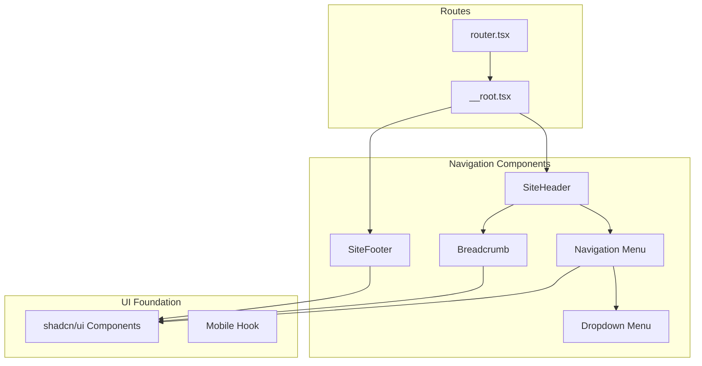
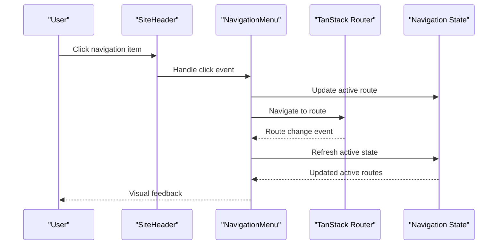
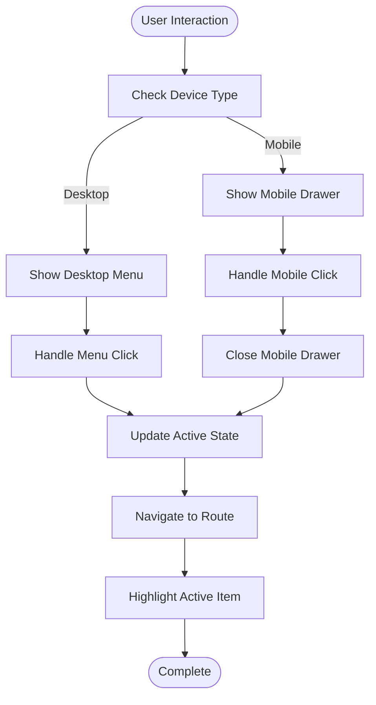
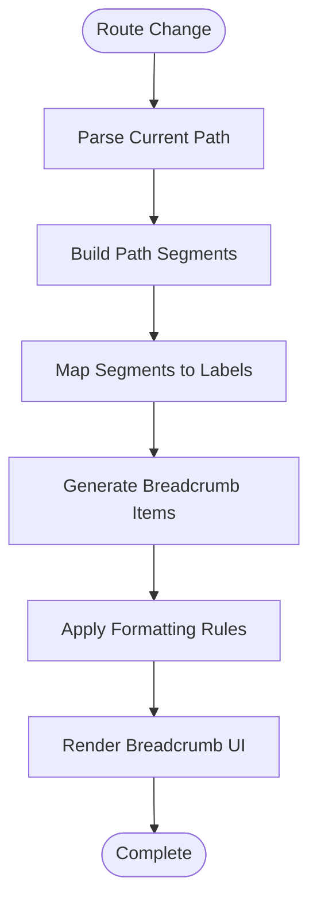
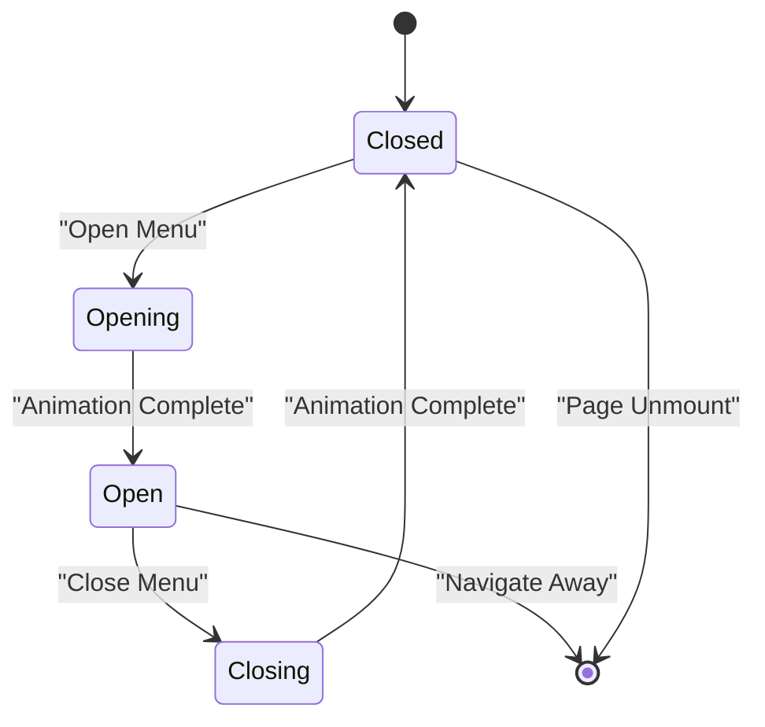
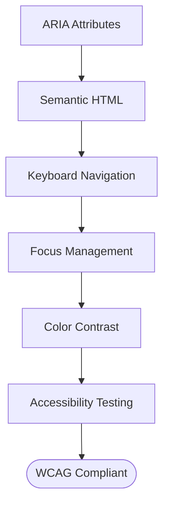
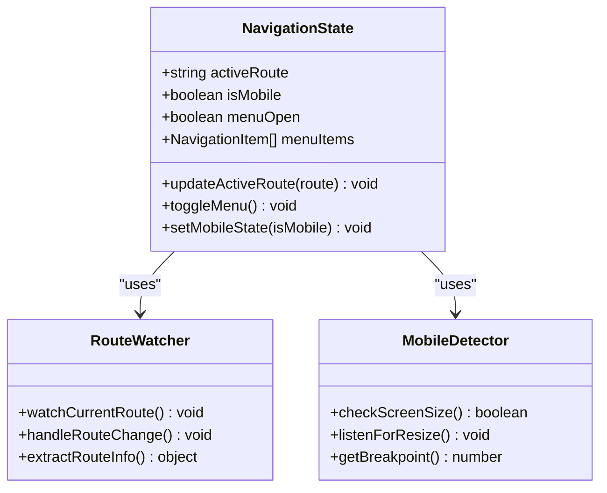
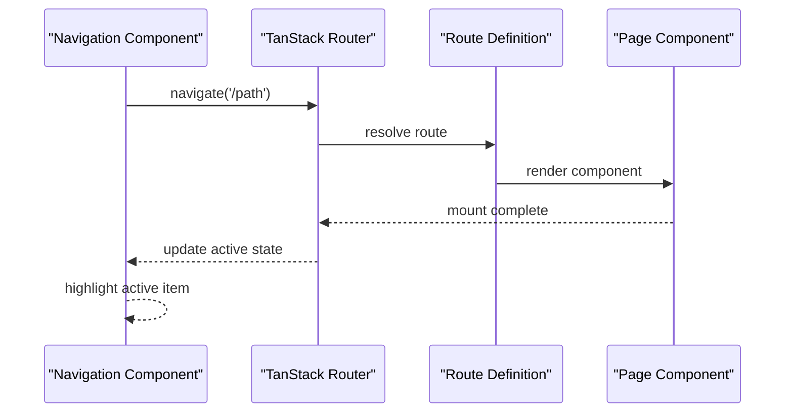

# Navigation Components & UI Patterns

<cite>
**Referenced Files in This Document**
- [SiteHeader.tsx](file://src/components/shopify/SiteHeader.tsx)
- [SiteFooter.tsx](file://src/components/shopify/SiteFooter.tsx)
- [breadcrumb.tsx](file://src/components/ui/breadcrumb.tsx)
- [navigation-menu.tsx](file://src/components/ui/navigation-menu.tsx)
- [dropdown-menu.tsx](file://src/components/ui/dropdown-menu.tsx)
- [__root.tsx](file://src/routes/__root.tsx)
- [router.tsx](file://src/router.tsx)
- [use-mobile.tsx](file://src/hooks/use-mobile.tsx)
</cite>

## Table of Contents
1. [Introduction](#introduction)
2. [Project Structure](#project-structure)
3. [Core Navigation Components](#core-navigation-components)
4. [Architecture Overview](#architecture-overview)
5. [Detailed Component Analysis](#detailed-component-analysis)
6. [Responsive Design Patterns](#responsive-design-patterns)
7. [Accessibility Implementation](#accessibility-implementation)
8. [State Management for Navigation](#state-management-for-navigation)
9. [Routing Integration](#routing-integration)
10. [Customization Guide](#customization-guide)
11. [Performance Considerations](#performance-considerations)
12. [Troubleshooting Guide](#troubleshooting-guide)
13. [Conclusion](#conclusion)

## Introduction

This document provides comprehensive documentation for navigation components and UI patterns in SpareAutomation. It covers the implementation of main navigation menus, breadcrumb systems, header and footer navigation structures, along with their props, customization options, responsive behavior, accessibility compliance, and integration with the routing system.

The navigation system is built using modern React patterns with shadcn/ui components, providing a robust foundation for scalable and accessible navigation experiences across desktop and mobile devices.

## Project Structure

The navigation components are organized following a feature-based architecture pattern:



**Diagram sources**
- [SiteHeader.tsx](file://src/components/shopify/SiteHeader.tsx)
- [SiteFooter.tsx](file://src/components/shopify/SiteFooter.tsx)
- [breadcrumb.tsx](file://src/components/ui/breadcrumb.tsx)
- [navigation-menu.tsx](file://src/components/ui/navigation-menu.tsx)
- [dropdown-menu.tsx](file://src/components/ui/dropdown-menu.tsx)
- [__root.tsx](file://src/routes/__root.tsx)
- [router.tsx](file://src/router.tsx)

## Core Navigation Components

### SiteHeader Component

The main application header containing primary navigation, branding, and user actions.

**Key Features:**
- Responsive navigation menu with mobile hamburger menu
- Active route highlighting
- User authentication state integration
- Search functionality
- Cart and account access

**Props Interface:**
```typescript
interface SiteHeaderProps {
  className?: string;
  showSearch?: boolean;
  showCart?: boolean;
  showAccount?: boolean;
}
```

**Section sources**
- [SiteHeader.tsx](file://src/components/shopify/SiteHeader.tsx)

### SiteFooter Component

Comprehensive footer navigation with site links, contact information, and legal pages.

**Key Features:**
- Multi-column link organization
- Social media integration
- Newsletter subscription form
- Mobile-responsive layout
- SEO-friendly structure

**Props Interface:**
```typescript
interface SiteFooterProps {
  className?: string;
  showNewsletter?: boolean;
  showSocialLinks?: boolean;
  columns?: FooterColumn[];
}
```

**Section sources**
- [SiteFooter.tsx](file://src/components/shopify/SiteFooter.tsx)

### Breadcrumb Component

Contextual navigation showing current page location within the site hierarchy.

**Key Features:**
- Dynamic path generation
- Customizable separator icons
- Accessibility-compliant markup
- Mobile-optimized display

**Props Interface:**
```typescript
interface BreadcrumbProps {
  items: BreadcrumbItem[];
  separator?: React.ReactNode;
  className?: string;
  maxItems?: number;
}

interface BreadcrumbItem {
  label: string;
  href: string;
  isActive?: boolean;
}
```

**Section sources**
- [breadcrumb.tsx](file://src/components/ui/breadcrumb.tsx)

### Navigation Menu Component

Primary horizontal navigation with dropdown support and active state management.

**Key Features:**
- Desktop horizontal menu
- Mobile slide-out drawer
- Dropdown submenu support
- Keyboard navigation
- Screen reader optimized

**Props Interface:**
```typescript
interface NavigationMenuProps {
  items: NavigationItem[];
  className?: string;
  mobileBreakpoint?: number;
  showActiveIndicator?: boolean;
}

interface NavigationItem {
  label: string;
  href: string;
  children?: NavigationItem[];
  icon?: React.ReactNode;
  badge?: string;
}
```

**Section sources**
- [navigation-menu.tsx](file://src/components/ui/navigation-menu.tsx)

### Dropdown Menu Component

Accessible dropdown menus for secondary navigation and contextual actions.

**Key Features:**
- Keyboard navigation support
- Focus management
- Click outside to close
- Positioning intelligence
- Touch device optimization

**Props Interface:**
```typescript
interface DropdownMenuProps {
  trigger: React.ReactNode;
  children: React.ReactNode;
  align?: 'start' | 'end' | 'center';
  side?: 'top' | 'bottom' | 'left' | 'right';
  collisionPadding?: number;
}
```

**Section sources**
- [dropdown-menu.tsx](file://src/components/ui/dropdown-menu.tsx)

## Architecture Overview

The navigation system follows a layered architecture pattern with clear separation of concerns:



**Diagram sources**
- [SiteHeader.tsx](file://src/components/shopify/SiteHeader.tsx)
- [navigation-menu.tsx](file://src/components/ui/navigation-menu.tsx)
- [router.tsx](file://src/router.tsx)

## Detailed Component Analysis

### Main Navigation Flow

The main navigation flow handles user interactions and maintains consistent state across the application:



**Diagram sources**
- [navigation-menu.tsx](file://src/components/ui/navigation-menu.tsx)
- [use-mobile.tsx](file://src/hooks/use-mobile.tsx)

### Breadcrumb Generation Logic

The breadcrumb system dynamically generates navigation paths based on the current route:



**Diagram sources**
- [breadcrumb.tsx](file://src/components/ui/breadcrumb.tsx)

### Mobile Navigation Pattern

Mobile navigation uses a drawer pattern with smooth transitions and proper focus management:



**Diagram sources**
- [navigation-menu.tsx](file://src/components/ui/navigation-menu.tsx)
- [use-mobile.tsx](file://src/hooks/use-mobile.tsx)

## Responsive Design Patterns

### Breakpoint Strategy

The navigation system implements a mobile-first approach with strategic breakpoints:

| Breakpoint | Device Type | Navigation Style |
|------------|-------------|------------------|
| < 768px | Mobile | Hamburger menu + drawer |
| 768px - 1024px | Tablet | Collapsed menu + overflow |
| > 1024px | Desktop | Full horizontal menu |

### Adaptive Behavior Patterns

**Desktop Navigation:**
- Horizontal layout with hover states
- Multi-level dropdown menus
- Sticky positioning on scroll
- Expanded search functionality

**Mobile Navigation:**
- Hamburger toggle button
- Slide-out drawer with backdrop
- Touch-optimized touch targets
- Simplified menu hierarchy

**Tablet Navigation:**
- Condensed horizontal menu
- Overflow handling for long menus
- Hybrid desktop/mobile features

**Section sources**
- [use-mobile.tsx](file://src/hooks/use-mobile.tsx)
- [navigation-menu.tsx](file://src/components/ui/navigation-menu.tsx)

## Accessibility Implementation

### Keyboard Navigation Support

The navigation system provides comprehensive keyboard navigation:

- **Tab Navigation**: Logical tab order through all interactive elements
- **Arrow Keys**: Vertical navigation within dropdown menus
- **Escape Key**: Close open menus and drawers
- **Enter/Space**: Activate menu items and buttons
- **Focus Management**: Proper focus trapping in modals and drawers

### Screen Reader Compatibility

- **ARIA Labels**: Descriptive labels for all interactive elements
- **Live Regions**: Announce navigation changes to screen readers
- **Semantic HTML**: Proper use of nav, ul, li, and button elements
- **Skip Links**: Direct navigation to main content
- **Focus Indicators**: Visible focus styles for keyboard users

### WCAG Compliance Features



**Section sources**
- [breadcrumb.tsx](file://src/components/ui/breadcrumb.tsx)
- [navigation-menu.tsx](file://src/components/ui/navigation-menu.tsx)
- [dropdown-menu.tsx](file://src/components/ui/dropdown-menu.tsx)

## State Management for Navigation

### Active Route Detection

The system uses TanStack Router's built-in state management for tracking active routes:



**Diagram sources**
- [navigation-menu.tsx](file://src/components/ui/navigation-menu.tsx)
- [use-mobile.tsx](file://src/hooks/use-mobile.tsx)

### Navigation Highlighting Logic

Active route detection and visual highlighting follows a priority-based system:

1. **Exact Match**: Route exactly matches the navigation item path
2. **Prefix Match**: Current route starts with the navigation item path
3. **Query Parameter Match**: Routes with matching query parameters
4. **Fallback**: Default active state based on URL structure

**Section sources**
- [navigation-menu.tsx](file://src/components/ui/navigation-menu.tsx)

## Routing Integration

### TanStack Router Integration

The navigation components integrate seamlessly with TanStack Router for client-side navigation:



**Diagram sources**
- [router.tsx](file://src/router.tsx)
- [navigation-menu.tsx](file://src/components/ui/navigation-menu.tsx)

### Client-Side Navigation Handling

Client-side navigation provides seamless page transitions without full page reloads:

- **Smooth Transitions**: Animated page transitions
- **Scroll Position Preservation**: Maintain scroll position on back navigation
- **Loading States**: Loading indicators during navigation
- **Error Boundaries**: Graceful error handling for failed navigations

**Section sources**
- [router.tsx](file://src/router.tsx)
- [__root.tsx](file://src/routes/__root.tsx)

## Customization Guide

### Adding New Navigation Items

To add new items to the main navigation:

1. **Define Navigation Configuration**: Add items to the navigation config array
2. **Set Route Paths**: Ensure routes exist in the routing configuration
3. **Configure Permissions**: Set up role-based access if needed
4. **Test Responsiveness**: Verify mobile and desktop behavior

### Implementing Dropdown Menus

Dropdown menus support nested navigation structures:

```typescript
const navigationItems = [
  {
    label: 'Products',
    href: '/products',
    children: [
      { label: 'Category 1', href: '/products/category-1' },
      { label: 'Category 2', href: '/products/category-2' }
    ]
  }
];
```

### Creating Mobile-Friendly Navigation

Mobile navigation automatically adapts based on screen size:

- **Touch Targets**: Minimum 44px touch targets
- **Swipe Gestures**: Swipe to close mobile menus
- **Haptic Feedback**: Optional vibration on interactions
- **Reduced Motion**: Respects user motion preferences

### Theme Customization

Navigation components support theme customization through CSS variables and Tailwind classes:

- **Colors**: Primary, secondary, and accent colors
- **Typography**: Font families and sizes
- **Spacing**: Padding and margin adjustments
- **Animations**: Transition durations and easing functions

**Section sources**
- [SiteHeader.tsx](file://src/components/shopify/SiteHeader.tsx)
- [SiteFooter.tsx](file://src/components/shopify/SiteFooter.tsx)

## Performance Considerations

### Lazy Loading

Navigation components implement lazy loading strategies:

- **Code Splitting**: Separate bundles for different navigation sections
- **Image Optimization**: Optimized images in navigation headers
- **Component Memoization**: Prevent unnecessary re-renders
- **Event Debouncing**: Debounced resize handlers for responsive behavior

### Memory Management

Efficient memory usage through:

- **Event Listener Cleanup**: Proper cleanup of window listeners
- **Component Unmounting**: Clean removal of event handlers
- **State Optimization**: Minimal state updates and memoization
- **Memory Leak Prevention**: Regular cleanup of references

### Rendering Optimization

- **Virtual Scrolling**: For large navigation lists
- **Conditional Rendering**: Only render visible navigation items
- **CSS Containment**: Isolate rendering contexts
- **Hardware Acceleration**: GPU-accelerated animations

## Troubleshooting Guide

### Common Issues and Solutions

**Navigation Not Highlighting Active Routes:**
- Verify route path configuration matches navigation items
- Check for case sensitivity issues in route paths
- Ensure router is properly configured with basename if needed

**Mobile Menu Not Opening:**
- Confirm mobile breakpoint values are correct
- Check for CSS conflicts preventing drawer display
- Verify touch event handlers are properly attached

**Keyboard Navigation Issues:**
- Ensure all interactive elements have proper tabindex values
- Check for focus trap implementations in modal components
- Verify ARIA attributes are correctly applied

**Screen Reader Compatibility Problems:**
- Validate semantic HTML structure
- Check ARIA labels and descriptions
- Test with popular screen readers (NVDA, JAWS, VoiceOver)

### Debugging Tools

- **React DevTools**: Inspect component state and props
- **Accessibility Inspector**: Verify ARIA attributes and roles
- **Network Tab**: Monitor navigation requests and performance
- **Console Logging**: Strategic logging for navigation events

**Section sources**
- [navigation-menu.tsx](file://src/components/ui/navigation-menu.tsx)
- [breadcrumb.tsx](file://src/components/ui/breadcrumb.tsx)

## Conclusion

The navigation system in SpareAutomation provides a robust, accessible, and responsive foundation for user interaction across all devices. By leveraging modern React patterns, shadcn/ui components, and TanStack Router, the system delivers a seamless navigation experience that meets contemporary web standards and accessibility requirements.

The modular architecture allows for easy customization and extension while maintaining consistency across the application. The comprehensive documentation and troubleshooting guides ensure that developers can effectively maintain and enhance the navigation system as the application grows.

Future enhancements may include advanced analytics integration, personalized navigation based on user behavior, and enhanced mobile gestures for improved touch interactions.