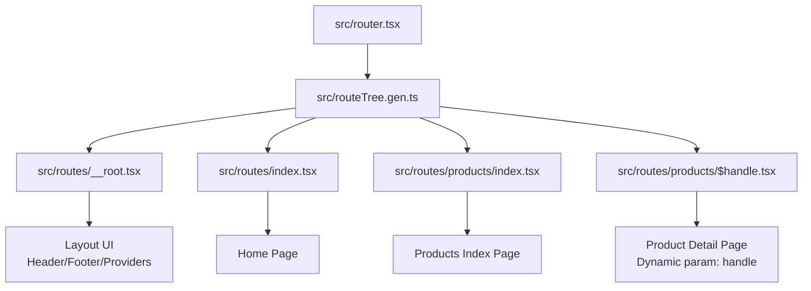
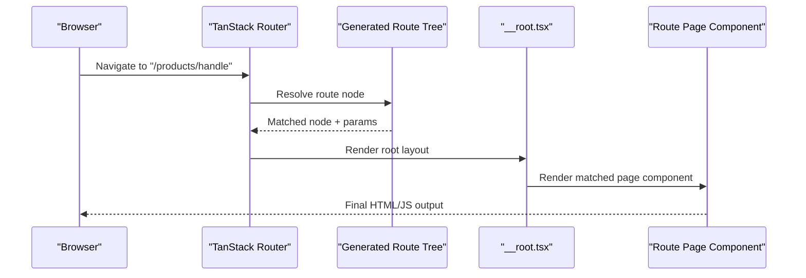
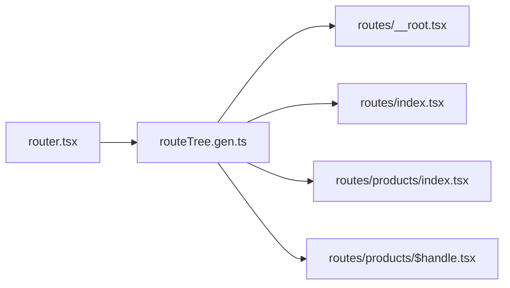

# Route Configuration & Structure

<cite>
**Referenced Files in This Document**
- [router.tsx](file://src/router.tsx)
- [__root.tsx](file://src/routes/__root.tsx)
- [index.tsx](file://src/routes/index.tsx)
- [products/$handle.tsx](file://src/routes/products/$handle.tsx)
- [products/index.tsx](file://src/routes/products/index.tsx)
- [routeTree.gen.ts](file://src/routeTree.gen.ts)
- [seo.ts](file://src/lib/seo.ts)
- [site.ts](file://src/lib/site.ts)
- [robots.txt](file://public/robots.txt)
- [sitemap.xml](file://public/sitemap.xml)
</cite>

## Table of Contents
1. [Introduction](#introduction)
2. [Project Structure](#project-structure)
3. [Core Components](#core-components)
4. [Architecture Overview](#architecture-overview)
5. [Detailed Component Analysis](#detailed-component-analysis)
6. [Dependency Analysis](#dependency-analysis)
7. [Performance Considerations](#performance-considerations)
8. [Troubleshooting Guide](#troubleshooting-guide)
9. [Conclusion](#conclusion)
10. [Appendices](#appendices)

## Introduction
This document explains how routing is configured and structured in SpareAutomation using TanStack Router with a file-based approach. It covers the root layout, generated route tree, nested routes, dynamic parameters, route guards and protected routes, data loading strategies at the route level, performance optimizations via lazy loading and code splitting, and SEO considerations including meta tags and canonical URLs.

## Project Structure
SpareAutomation uses TanStack Router’s file-based routing convention:
- The router entrypoint configures TanStack Router and registers the generated route tree.
- The routes directory contains one file per route; folders represent nested routes.
- A special __root.tsx file defines the root layout that wraps all pages.
- A generated route tree (routeTree.gen.ts) is produced by the build tooling to power type-safe navigation and route inference.

**Diagram sources**
- [router.tsx](file://src/router.tsx)
- [routeTree.gen.ts](file://src/routeTree.gen.ts)
- [__root.tsx](file://src/routes/__root.tsx)
- [index.tsx](file://src/routes/index.tsx)
- [products/index.tsx](file://src/routes/products/index.tsx)
- [products/$handle.tsx](file://src/routes/products/$handle.tsx)

**Section sources**
- [router.tsx](file://src/router.tsx)
- [routeTree.gen.ts](file://src/routeTree.gen.ts)
- [__root.tsx](file://src/routes/__root.tsx)
- [index.tsx](file://src/routes/index.tsx)
- [products/index.tsx](file://src/routes/products/index.tsx)
- [products/$handle.tsx](file://src/routes/products/$handle.tsx)

## Core Components
- Router configuration: Initializes TanStack Router, sets up history, and wires the generated route tree for type safety and navigation.
- Root layout (__root.tsx): Provides global shell, providers, and shared UI such as header/footer.
- Generated route tree (routeTree.gen.ts): Auto-generated mapping from files to route nodes, enabling typed params and path inference.
- Route files: Each .tsx file under src/routes maps to a URL segment; folders create nested routes.

Key responsibilities:
- router.tsx: Central router setup and integration with the generated tree.
- __root.tsx: Global layout and context providers.
- routeTree.gen.ts: Type definitions and route graph used by the router.
- Route pages: Presentational components bound to paths.

**Section sources**
- [router.tsx](file://src/router.tsx)
- [__root.tsx](file://src/routes/__root.tsx)
- [routeTree.gen.ts](file://src/routeTree.gen.ts)

## Architecture Overview
The routing architecture follows a clear separation between configuration, layout, and page components:
- The router entrypoint consumes the generated route tree to configure TanStack Router.
- The root layout renders shared chrome and provides application-wide contexts.
- Individual route files render page-specific content and can load data or perform guards.

**Diagram sources**
- [router.tsx](file://src/router.tsx)
- [routeTree.gen.ts](file://src/routeTree.gen.ts)
- [__root.tsx](file://src/routes/__root.tsx)
- [products/$handle.tsx](file://src/routes/products/$handle.tsx)

## Detailed Component Analysis

### File-Based Routing Conventions
- One file per route under src/routes.
- Folder names become nested segments.
- index.tsx represents the default child of its folder.
- Dynamic segments use $paramName (e.g., products/$handle.tsx).

Examples:
- / → src/routes/index.tsx
- /products → src/routes/products/index.tsx
- /products/:handle → src/routes/products/$handle.tsx

**Section sources**
- [index.tsx](file://src/routes/index.tsx)
- [products/index.tsx](file://src/routes/products/index.tsx)
- [products/$handle.tsx](file://src/routes/products/$handle.tsx)

### Nested Routes and Layouts
- Nested folders imply nested route segments.
- The root layout in __root.tsx wraps all pages and can include shared UI and providers.
- You can add intermediate layouts by creating a file named after the folder with a layout suffix if needed by your router setup.

**Section sources**
- [__root.tsx](file://src/routes/__root.tsx)
- [products/index.tsx](file://src/routes/products/index.tsx)

### Dynamic Route Parameters
- Use $ prefix for dynamic segments (e.g., $handle).
- Access parameters through the route hook provided by TanStack Router within the page component.
- Validation and fallbacks can be implemented inside the route component.

**Section sources**
- [products/$handle.tsx](file://src/routes/products/$handle.tsx)

### Creating New Routes
- Add a new .tsx file under src/routes for top-level routes.
- Create a folder for nested routes and place an index.tsx for the folder’s default route.
- For dynamic segments, name the file with $paramName.tsx.
- After adding files, regenerate the route tree if required by your build process.

**Section sources**
- [index.tsx](file://src/routes/index.tsx)
- [products/index.tsx](file://src/routes/products/index.tsx)
- [products/$handle.tsx](file://src/routes/products/$handle.tsx)

### Route Guards and Protected Routes
- Implement authentication checks inside route components or layout wrappers.
- Redirect unauthenticated users to a login route before rendering protected content.
- Use router APIs to programmatically navigate based on auth state.

Best practices:
- Centralize guard logic in a reusable function or wrapper component.
- Keep redirects consistent and preserve intended destination when possible.

[No sources needed since this section provides general guidance]

### Data Loading Strategies at the Route Level
- Load data within route components using TanStack Router’s data hooks or effects.
- Prefer route-level loaders to fetch only what is needed for the current view.
- Cache and deduplicate requests where appropriate to avoid redundant network calls.

[No sources needed since this section provides general guidance]

### Performance Optimizations: Lazy Loading and Code Splitting
- Use dynamic imports for heavy route components to enable code splitting.
- Ensure the router loads only the necessary chunks for the active route.
- Preload critical resources and defer non-critical assets.

[No sources needed since this section provides general guidance]

### SEO Considerations
- Set page titles and meta descriptions in route components or via a helper.
- Manage canonical URLs to prevent duplicate content issues.
- Provide robots.txt and sitemap.xml for crawlers.

Relevant utilities and assets:
- SEO helpers and site metadata are available in lib/seo.ts and lib/site.ts.
- public/robots.txt and public/sitemap.xml support search engine indexing.

**Section sources**
- [seo.ts](file://src/lib/seo.ts)
- [site.ts](file://src/lib/site.ts)
- [robots.txt](file://public/robots.txt)
- [sitemap.xml](file://public/sitemap.xml)

## Dependency Analysis
The router depends on the generated route tree, which in turn reflects the file structure. The root layout is part of the route graph and is rendered for every route unless overridden by specific layouts.

**Diagram sources**
- [router.tsx](file://src/router.tsx)
- [routeTree.gen.ts](file://src/routeTree.gen.ts)
- [__root.tsx](file://src/routes/__root.tsx)
- [index.tsx](file://src/routes/index.tsx)
- [products/index.tsx](file://src/routes/products/index.tsx)
- [products/$handle.tsx](file://src/routes/products/$handle.tsx)

**Section sources**
- [router.tsx](file://src/router.tsx)
- [routeTree.gen.ts](file://src/routeTree.gen.ts)

## Performance Considerations
- Favor lazy loading for large route components to reduce initial bundle size.
- Leverage TanStack Router’s built-in caching and prefetching features where applicable.
- Avoid heavy computations in render paths; move them to loaders or memoized hooks.
- Monitor route chunk sizes and split further if needed.

[No sources needed since this section provides general guidance]

## Troubleshooting Guide
Common issues and resolutions:
- Route not found: Ensure the file exists under src/routes and matches the expected path pattern. Regenerate the route tree if necessary.
- Dynamic parameter undefined: Verify the file naming uses $paramName and access the parameter via the correct hook.
- Auth redirect loops: Check guard conditions and ensure they do not redirect back to the same protected route without proper handling.
- SEO not applied: Confirm meta tags and canonical links are set in the route component or via helpers.

[No sources needed since this section provides general guidance]

## Conclusion
SpareAutomation’s routing leverages TanStack Router with a clean, file-based structure. The generated route tree ensures type safety and predictable navigation, while the root layout centralizes shared UI and providers. By following the conventions outlined here—nested folders, dynamic segments, route-level data loading, and lazy loading—you can maintain a scalable and performant application. Apply consistent guard patterns for protected routes and implement robust SEO practices for better discoverability.

## Appendices

### Quick Reference: Route-to-File Mapping
- Home: src/routes/index.tsx
- Products list: src/routes/products/index.tsx
- Product detail: src/routes/products/$handle.tsx
- Root layout: src/routes/__root.tsx
- Router setup: src/router.tsx
- Generated tree: src/routeTree.gen.ts

**Section sources**
- [index.tsx](file://src/routes/index.tsx)
- [products/index.tsx](file://src/routes/products/index.tsx)
- [products/$handle.tsx](file://src/routes/products/$handle.tsx)
- [__root.tsx](file://src/routes/__root.tsx)
- [router.tsx](file://src/router.tsx)
- [routeTree.gen.ts](file://src/routeTree.gen.ts)