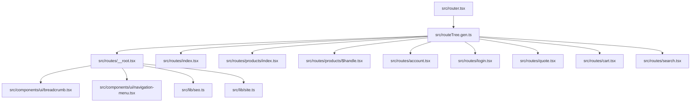
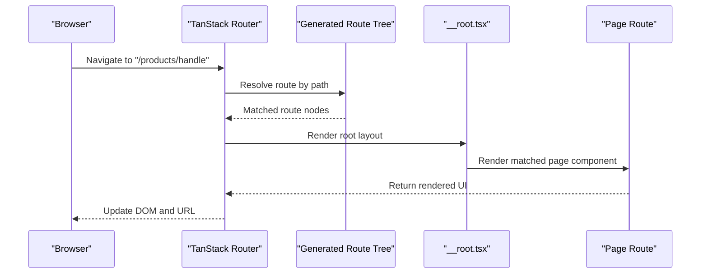
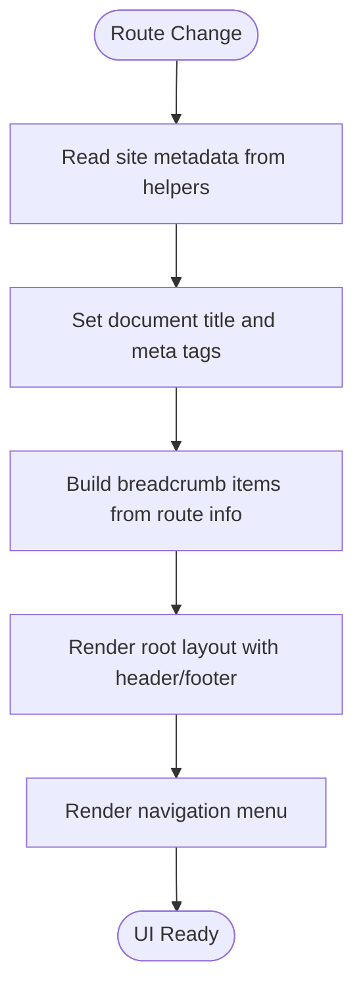
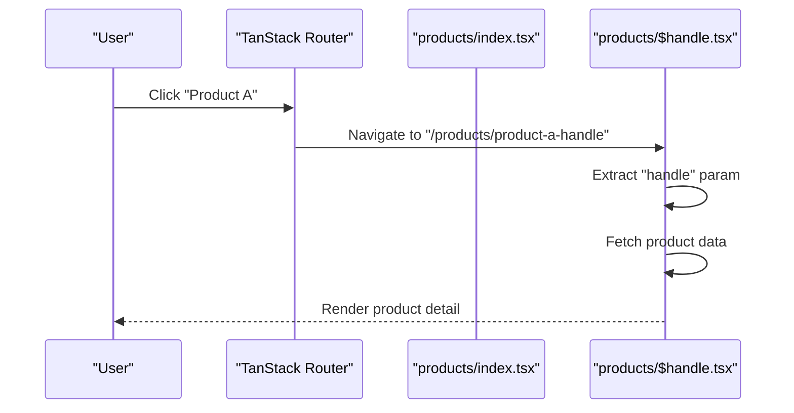
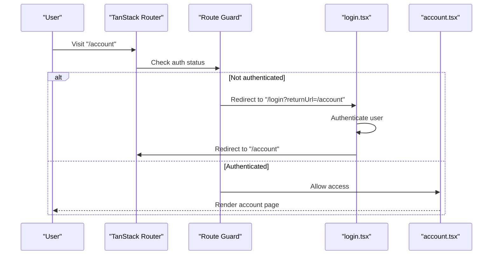
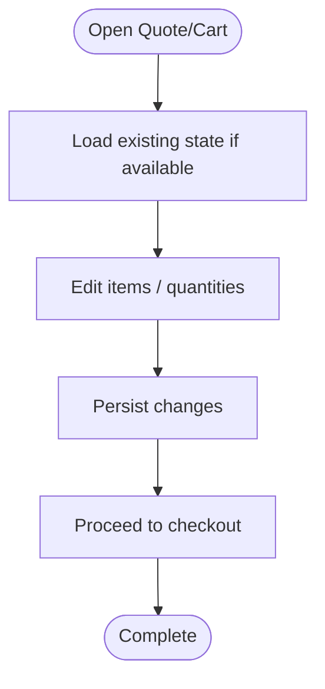
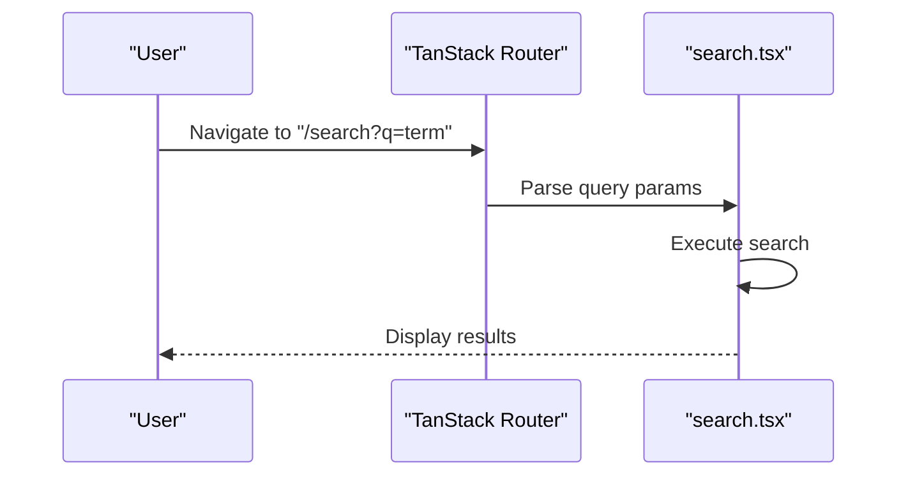
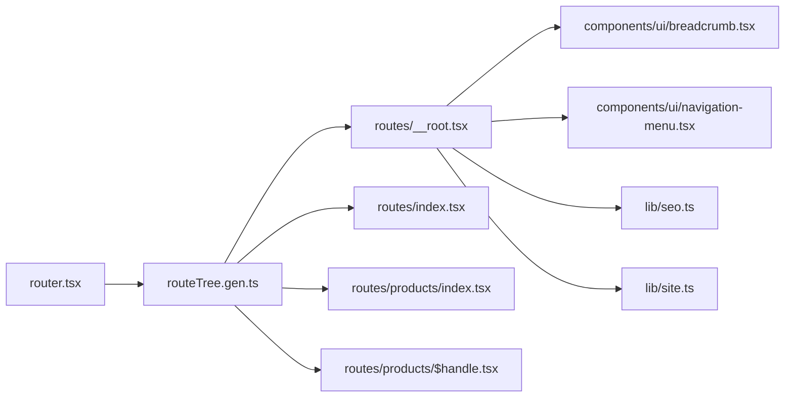

# Routing & Navigation

<cite>
**Referenced Files in This Document**
- [router.tsx](file://src/router.tsx)
- [__root.tsx](file://src/routes/__root.tsx)
- [index.tsx](file://src/routes/index.tsx)
- [about-us.tsx](file://src/routes/about-us.tsx)
- [products/index.tsx](file://src/routes/products/index.tsx)
- [products/$handle.tsx](file://src/routes/products/$handle.tsx)
- [account.tsx](file://src/routes/account.tsx)
- [login.tsx](file://src/routes/login.tsx)
- [quote.tsx](file://src/routes/quote.tsx)
- [cart.tsx](file://src/routes/cart.tsx)
- [search.tsx](file://src/routes/search.tsx)
- [breadcrumb.tsx](file://src/components/ui/breadcrumb.tsx)
- [navigation-menu.tsx](file://src/components/ui/navigation-menu.tsx)
- [seo.ts](file://src/lib/seo.ts)
- [site.ts](file://src/lib/site.ts)
- [routeTree.gen.ts](file://src/routeTree.gen.ts)
</cite>

## Table of Contents
1. [Introduction](#introduction)
2. [Project Structure](#project-structure)
3. [Core Components](#core-components)
4. [Architecture Overview](#architecture-overview)
5. [Detailed Component Analysis](#detailed-component-analysis)
6. [Dependency Analysis](#dependency-analysis)
7. [Performance Considerations](#performance-considerations)
8. [Troubleshooting Guide](#troubleshooting-guide)
9. [Conclusion](#conclusion)
10. [Appendices](#appendices)

## Introduction
This document explains the routing and navigation system in SpareAutomation, which is built on TanStack Router with a file-based route tree. It covers:
- Route-based architecture and nested routes
- Root layout and global navigation patterns
- Breadcrumb implementation and menu systems
- Dynamic routing patterns and route parameters
- Protected routes and authentication-based access control
- Client-side navigation and navigation state
- SEO-friendly URL patterns, meta tag management, and optimization strategies
- Data loading strategies and code splitting for performance

## Project Structure
SpareAutomation uses a file-based routing convention under src/routes. The root router configuration wires up the application’s route tree, while each route file maps to a URL path. Nested folders create nested routes (e.g., products/index.tsx and products/$handle.tsx).

**Diagram sources**
- [router.tsx](file://src/router.tsx)
- [routeTree.gen.ts](file://src/routeTree.gen.ts)
- [__root.tsx](file://src/routes/__root.tsx)
- [index.tsx](file://src/routes/index.tsx)
- [products/index.tsx](file://src/routes/products/index.tsx)
- [products/$handle.tsx](file://src/routes/products/$handle.tsx)
- [account.tsx](file://src/routes/account.tsx)
- [login.tsx](file://src/routes/login.tsx)
- [quote.tsx](file://src/routes/quote.tsx)
- [cart.tsx](file://src/routes/cart.tsx)
- [search.tsx](file://src/routes/search.tsx)
- [breadcrumb.tsx](file://src/components/ui/breadcrumb.tsx)
- [navigation-menu.tsx](file://src/components/ui/navigation-menu.tsx)
- [seo.ts](file://src/lib/seo.ts)
- [site.ts](file://src/lib/site.ts)

**Section sources**
- [router.tsx](file://src/router.tsx)
- [routeTree.gen.ts](file://src/routeTree.gen.ts)
- [__root.tsx](file://src/routes/__root.tsx)

## Core Components
- Router setup: The application initializes TanStack Router and connects it to the generated route tree. This is where you configure providers, history mode, and any global options.
- Root layout (__root): Provides the shell for all pages, including header/footer, breadcrumbs, navigation menus, and global SEO metadata.
- Page routes: Each .tsx file under src/routes represents a page or nested route. For example, index.tsx is the home page, products/index.tsx is the product listing, and products/$handle.tsx is a dynamic product detail route.
- UI primitives: Breadcrumb and navigation menu components are used within the root layout to render consistent site-wide navigation.

Key responsibilities:
- router.tsx: Configure router instance and integrate with the app.
- __root.tsx: Compose global layout, navigation, breadcrumbs, and SEO.
- Route files: Implement page-specific content and data fetching.
- lib/seo.ts and lib/site.ts: Centralize SEO helpers and site metadata.

**Section sources**
- [router.tsx](file://src/router.tsx)
- [__root.tsx](file://src/routes/__root.tsx)
- [index.tsx](file://src/routes/index.tsx)
- [products/index.tsx](file://src/routes/products/index.tsx)
- [products/$handle.tsx](file://src/routes/products/$handle.tsx)
- [breadcrumb.tsx](file://src/components/ui/breadcrumb.tsx)
- [navigation-menu.tsx](file://src/components/ui/navigation-menu.tsx)
- [seo.ts](file://src/lib/seo.ts)
- [site.ts](file://src/lib/site.ts)

## Architecture Overview
The routing architecture follows TanStack Router’s file-based conventions:
- File-to-route mapping: Each route file corresponds to a URL segment.
- Nested routes: Folder nesting creates nested layouts and child routes.
- Dynamic segments: Files prefixed with $ represent dynamic parameters.
- Generated route tree: The build process generates a strongly typed route tree that the router consumes.

**Diagram sources**
- [router.tsx](file://src/router.tsx)
- [routeTree.gen.ts](file://src/routeTree.gen.ts)
- [__root.tsx](file://src/routes/__root.tsx)
- [products/$handle.tsx](file://src/routes/products/$handle.tsx)

## Detailed Component Analysis

### Root Layout and Global Navigation
The root layout composes the site shell, including:
- Header and footer
- Breadcrumbs derived from current route
- Navigation menu entries
- Global SEO metadata via helper utilities

**Diagram sources**
- [__root.tsx](file://src/routes/__root.tsx)
- [breadcrumb.tsx](file://src/components/ui/breadcrumb.tsx)
- [navigation-menu.tsx](file://src/components/ui/navigation-menu.tsx)
- [seo.ts](file://src/lib/seo.ts)
- [site.ts](file://src/lib/site.ts)

**Section sources**
- [__root.tsx](file://src/routes/__root.tsx)
- [breadcrumb.tsx](file://src/components/ui/breadcrumb.tsx)
- [navigation-menu.tsx](file://src/components/ui/navigation-menu.tsx)
- [seo.ts](file://src/lib/seo.ts)
- [site.ts](file://src/lib/site.ts)

### Product Listing and Dynamic Product Detail
- Static listing: products/index.tsx renders the product list page.
- Dynamic detail: products/$handle.tsx resolves the handle parameter and loads product details.

**Diagram sources**
- [products/index.tsx](file://src/routes/products/index.tsx)
- [products/$handle.tsx](file://src/routes/products/$handle.tsx)

**Section sources**
- [products/index.tsx](file://src/routes/products/index.tsx)
- [products/$handle.tsx](file://src/routes/products/$handle.tsx)

### Account and Authentication Flow
Typical flow:
- Unauthenticated users visiting protected routes are redirected to login.
- After successful login, users are redirected back to the intended destination.

**Diagram sources**
- [account.tsx](file://src/routes/account.tsx)
- [login.tsx](file://src/routes/login.tsx)

**Section sources**
- [account.tsx](file://src/routes/account.tsx)
- [login.tsx](file://src/routes/login.tsx)

### Quote and Cart Workflows
These routes typically manage stateful flows such as building quotes and managing cart contents. They may use client-side navigation between steps and persist state across navigations.

[No sources needed since this diagram shows conceptual workflow, not actual code structure]

**Section sources**
- [quote.tsx](file://src/routes/quote.tsx)
- [cart.tsx](file://src/routes/cart.tsx)

### Search Route
The search route accepts query parameters and renders results based on the provided search terms.

**Diagram sources**
- [search.tsx](file://src/routes/search.tsx)

**Section sources**
- [search.tsx](file://src/routes/search.tsx)

## Dependency Analysis
The router depends on the generated route tree, which in turn references all route files. The root layout depends on UI primitives and SEO helpers.

**Diagram sources**
- [router.tsx](file://src/router.tsx)
- [routeTree.gen.ts](file://src/routeTree.gen.ts)
- [__root.tsx](file://src/routes/__root.tsx)
- [index.tsx](file://src/routes/index.tsx)
- [products/index.tsx](file://src/routes/products/index.tsx)
- [products/$handle.tsx](file://src/routes/products/$handle.tsx)
- [breadcrumb.tsx](file://src/components/ui/breadcrumb.tsx)
- [navigation-menu.tsx](file://src/components/ui/navigation-menu.tsx)
- [seo.ts](file://src/lib/seo.ts)
- [site.ts](file://src/lib/site.ts)

**Section sources**
- [router.tsx](file://src/router.tsx)
- [routeTree.gen.ts](file://src/routeTree.gen.ts)
- [__root.tsx](file://src/routes/__root.tsx)

## Performance Considerations
- Code splitting: TanStack Router supports lazy-loading route components to reduce initial bundle size. Use lazy imports for heavy pages.
- Prefetching: Configure link prefetching for likely next navigations to improve perceived performance.
- Data loading: Prefer route-level loaders to fetch data before rendering, reducing waterfalls and improving TTI.
- Memoization: Memoize expensive computations in route components and shared layout components.
- Asset optimization: Ensure images and static assets are optimized and served with appropriate caching headers.

[No sources needed since this section provides general guidance]

## Troubleshooting Guide
Common issues and resolutions:
- Route not found: Verify the file exists under src/routes and matches the expected path pattern. For dynamic routes, ensure the filename uses the $param convention.
- Params missing: Confirm the URL includes required dynamic segments and that the route file reads them correctly.
- Auth redirects loop: Ensure guards check authentication consistently and redirect only when necessary.
- SEO not updating: Verify that meta tags are set in the root layout or per-route and that helpers update document.title and meta elements.
- Menu links not active: Ensure navigation menu components receive correct active state props based on current route.

**Section sources**
- [__root.tsx](file://src/routes/__root.tsx)
- [breadcrumb.tsx](file://src/components/ui/breadcrumb.tsx)
- [navigation-menu.tsx](file://src/components/ui/navigation-menu.tsx)
- [seo.ts](file://src/lib/seo.ts)

## Conclusion
SpareAutomation’s routing and navigation system leverages TanStack Router’s file-based conventions to provide a clear, scalable architecture. The root layout centralizes global concerns like navigation, breadcrumbs, and SEO, while individual route files encapsulate page logic and data loading. By following the patterns outlined here—dynamic segments, protected routes, client-side navigation, and SEO best practices—you can extend the system confidently and maintain high performance.

## Appendices

### Creating a New Route
- Add a new .tsx file under src/routes with the desired path name.
- If the route requires parameters, prefix the filename with $ (e.g., $id.tsx).
- For nested routes, place the file inside a folder to mirror the URL hierarchy.
- Optionally add SEO metadata using helpers in lib/seo.ts and lib/site.ts.

**Section sources**
- [routeTree.gen.ts](file://src/routeTree.gen.ts)
- [seo.ts](file://src/lib/seo.ts)
- [site.ts](file://src/lib/site.ts)

### Implementing Protected Routes
- Create a guard function that checks authentication state.
- Apply the guard in the router configuration or within route components to redirect unauthenticated users to login.
- Preserve the intended destination via query parameters for post-login redirection.

**Section sources**
- [account.tsx](file://src/routes/account.tsx)
- [login.tsx](file://src/routes/login.tsx)

### Handling Route Parameters
- Use dynamic filenames with $ to define parameters (e.g., $handle.tsx).
- Read parameters from the route context provided by TanStack Router.
- Validate and sanitize inputs before using them in data requests.

**Section sources**
- [products/$handle.tsx](file://src/routes/products/$handle.tsx)

### Managing Navigation State
- Use TanStack Router APIs to read and navigate programmatically.
- Persist critical state (e.g., cart, quote) in local storage or a state store to survive navigations.
- Leverage search params for shareable states like search queries.

**Section sources**
- [search.tsx](file://src/routes/search.tsx)
- [cart.tsx](file://src/routes/cart.tsx)
- [quote.tsx](file://src/routes/quote.tsx)

### SEO-Friendly URLs and Meta Management
- Choose descriptive, human-readable paths (e.g., /products/handle).
- Centralize title and meta updates in the root layout or per-route components using helpers.
- Keep URLs stable and avoid unnecessary query strings for primary content.

**Section sources**
- [__root.tsx](file://src/routes/__root.tsx)
- [seo.ts](file://src/lib/seo.ts)
- [site.ts](file://src/lib/site.ts)