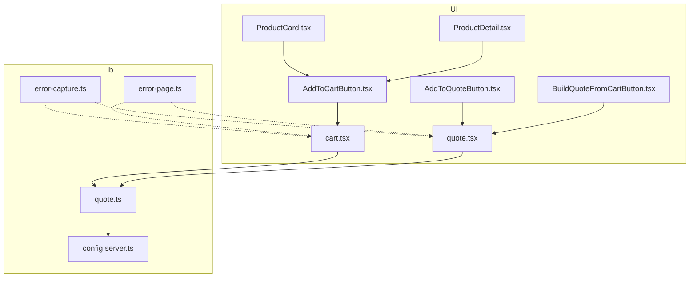
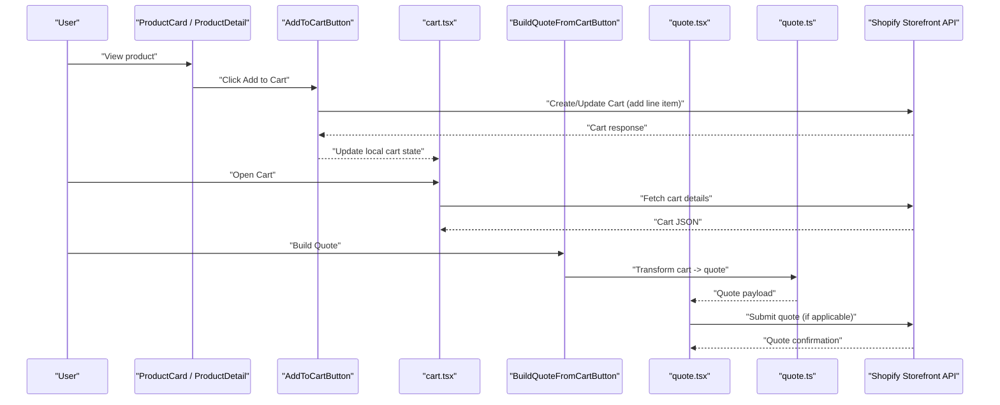
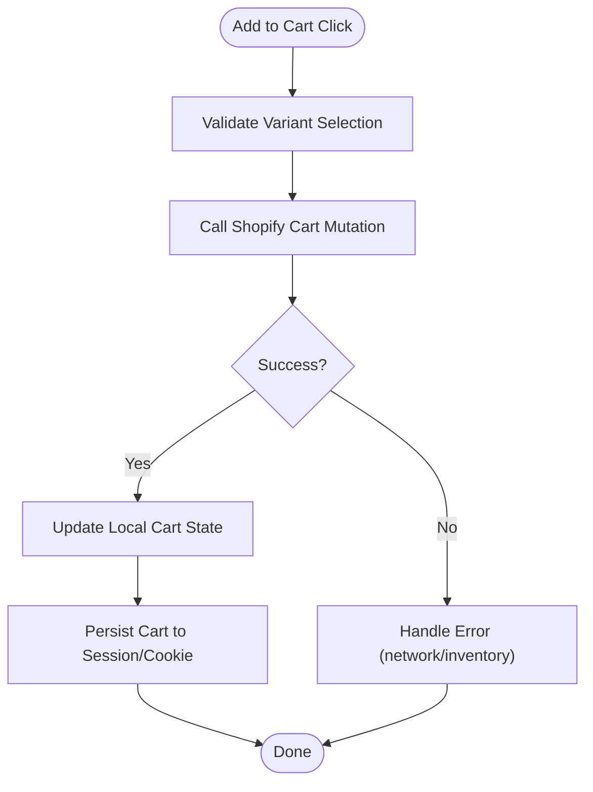
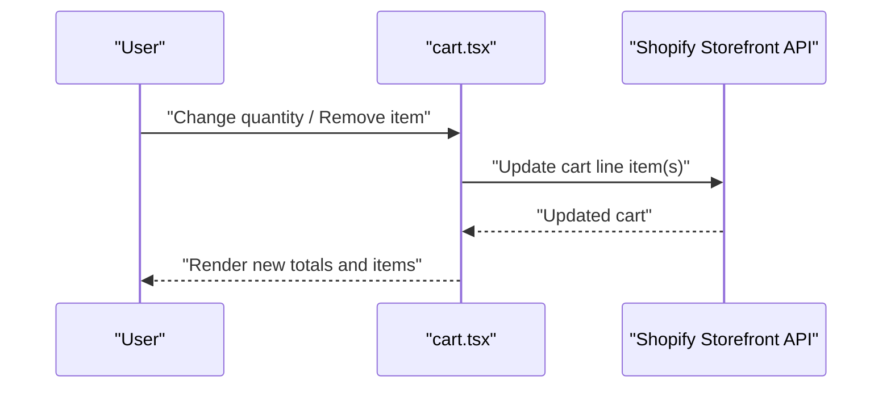
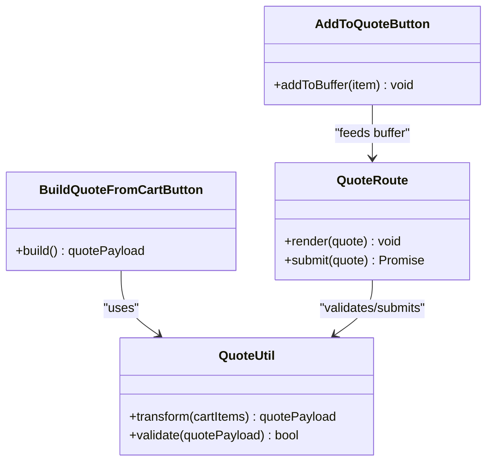
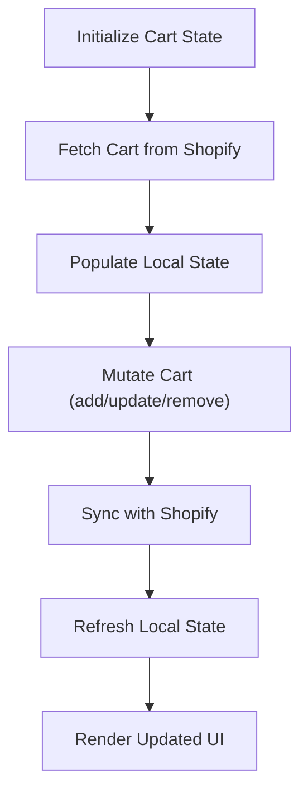
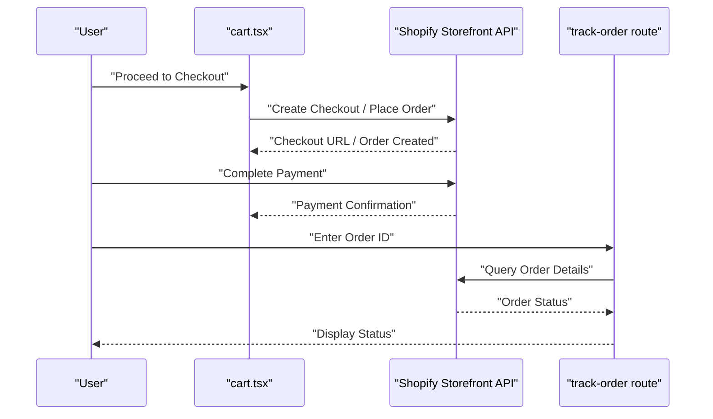
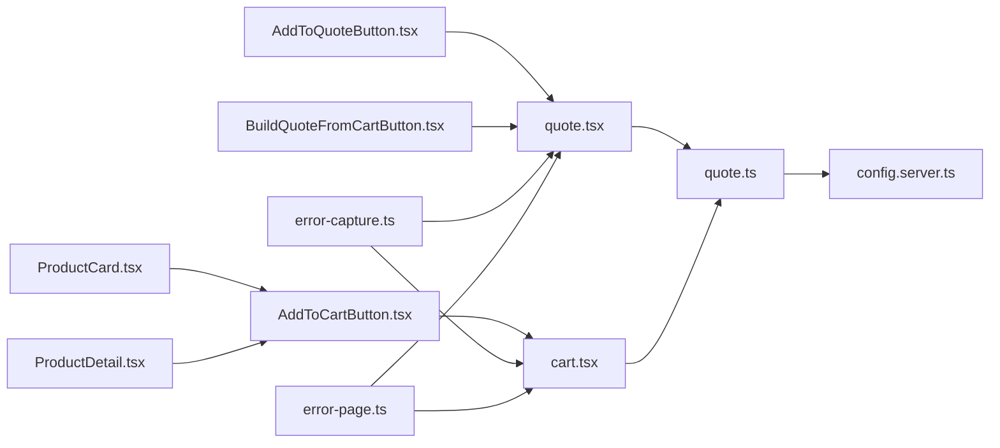

# Cart & Order Processing

<cite>
**Referenced Files in This Document**
- [AddToCartButton.tsx](file://src/components/shopify/AddToCartButton.tsx)
- [AddToQuoteButton.tsx](file://src/components/shopify/AddToQuoteButton.tsx)
- [BuildQuoteFromCartButton.tsx](file://src/components/shopify/BuildQuoteFromCartButton.tsx)
- [ProductCard.tsx](file://src/components/shopify/ProductCard.tsx)
- [ProductDetail.tsx](file://src/components/shopify/ProductDetail.tsx)
- [cart.tsx](file://src/routes/cart.tsx)
- [quote.tsx](file://src/routes/quote.tsx)
- [quote.ts](file://src/lib/quote.ts)
- [config.server.ts](file://src/lib/config.server.ts)
- [error-capture.ts](file://src/lib/error-capture.ts)
- [error-page.ts](file://src/lib/error-page.ts)
</cite>

## Table of Contents
1. [Introduction](#introduction)
2. [Project Structure](#project-structure)
3. [Core Components](#core-components)
4. [Architecture Overview](#architecture-overview)
5. [Detailed Component Analysis](#detailed-component-analysis)
6. [Dependency Analysis](#dependency-analysis)
7. [Performance Considerations](#performance-considerations)
8. [Troubleshooting Guide](#troubleshooting-guide)
9. [Conclusion](#conclusion)

## Introduction
This document explains how the application integrates with Shopify to provide shopping cart functionality, quote generation for trade accounts, and order processing workflows. It covers adding items to cart, updating quantities, removing products, persisting cart state across sessions and devices, converting cart contents into quotes, creating orders, handling payments, tracking order status, and robust error handling for failed transactions, inventory conflicts, and network timeouts.

## Project Structure
The cart and quote features are implemented primarily through React components and routes that interact with Shopify’s storefront APIs. Key areas include:
- Product pages with add-to-cart controls
- A dedicated cart route for managing line items
- Quote-related components and a quote route for generating quotes from cart items
- Utility modules for quoting logic and configuration
- Error capture utilities for observability

**Diagram sources**
- [AddToCartButton.tsx](file://src/components/shopify/AddToCartButton.tsx)
- [AddToQuoteButton.tsx](file://src/components/shopify/AddToQuoteButton.tsx)
- [BuildQuoteFromCartButton.tsx](file://src/components/shopify/BuildQuoteFromCartButton.tsx)
- [ProductCard.tsx](file://src/components/shopify/ProductCard.tsx)
- [ProductDetail.tsx](file://src/components/shopify/ProductDetail.tsx)
- [cart.tsx](file://src/routes/cart.tsx)
- [quote.tsx](file://src/routes/quote.tsx)
- [quote.ts](file://src/lib/quote.ts)
- [config.server.ts](file://src/lib/config.server.ts)
- [error-capture.ts](file://src/lib/error-capture.ts)
- [error-page.ts](file://src/lib/error-page.ts)

**Section sources**
- [AddToCartButton.tsx](file://src/components/shopify/AddToCartButton.tsx)
- [AddToQuoteButton.tsx](file://src/components/shopify/AddToQuoteButton.tsx)
- [BuildQuoteFromCartButton.tsx](file://src/components/shopify/BuildQuoteFromCartButton.tsx)
- [ProductCard.tsx](file://src/components/shopify/ProductCard.tsx)
- [ProductDetail.tsx](file://src/components/shopify/ProductDetail.tsx)
- [cart.tsx](file://src/routes/cart.tsx)
- [quote.tsx](file://src/routes/quote.tsx)
- [quote.ts](file://src/lib/quote.ts)
- [config.server.ts](file://src/lib/config.server.ts)
- [error-capture.ts](file://src/lib/error-capture.ts)
- [error-page.ts](file://src/lib/error-page.ts)

## Core Components
- Add to Cart button: Initiates adding a product variant to the cart by invoking the appropriate API call and updating local state.
- Add to Quote button: Adds an item to a temporary quote buffer for later conversion into a formal quote.
- Build Quote from Cart button: Converts current cart items into a structured quote payload.
- Cart route: Displays cart contents, allows quantity updates, removals, and checkout initiation.
- Quote route: Presents generated quotes and supports submission flows.
- Quote utility: Encapsulates quote transformation logic and data mapping between cart and quote formats.
- Configuration: Provides environment-based settings such as storefront endpoints and feature flags.
- Error capture and error page: Centralized error reporting and user-facing error presentation.

**Section sources**
- [AddToCartButton.tsx](file://src/components/shopify/AddToCartButton.tsx)
- [AddToQuoteButton.tsx](file://src/components/shopify/AddToQuoteButton.tsx)
- [BuildQuoteFromCartButton.tsx](file://src/components/shopify/BuildQuoteFromCartButton.tsx)
- [cart.tsx](file://src/routes/cart.tsx)
- [quote.tsx](file://src/routes/quote.tsx)
- [quote.ts](file://src/lib/quote.ts)
- [config.server.ts](file://src/lib/config.server.ts)
- [error-capture.ts](file://src/lib/error-capture.ts)
- [error-page.ts](file://src/lib/error-page.ts)

## Architecture Overview
The system follows a client-driven flow where UI components trigger actions against Shopify’s storefront APIs. Local state is updated optimistically and persisted via session storage or cookies. Quotes are derived from cart state using a transformation layer before being submitted.

**Diagram sources**
- [ProductCard.tsx](file://src/components/shopify/ProductCard.tsx)
- [ProductDetail.tsx](file://src/components/shopify/ProductDetail.tsx)
- [AddToCartButton.tsx](file://src/components/shopify/AddToCartButton.tsx)
- [cart.tsx](file://src/routes/cart.tsx)
- [BuildQuoteFromCartButton.tsx](file://src/components/shopify/BuildQuoteFromCartButton.tsx)
- [quote.tsx](file://src/routes/quote.tsx)
- [quote.ts](file://src/lib/quote.ts)

## Detailed Component Analysis

### Add to Cart Flow
- Entry points: ProductCard and ProductDetail render AddToCartButton.
- Action: AddToCartButton calls Shopify’s cart mutation to add a line item for a selected variant.
- State update: On success, the cart route receives updated cart data; optimistic UI updates improve responsiveness.
- Persistence: Cart ID and contents are stored in session storage or cookies to survive refreshes and enable cross-device sync when combined with server-side persistence.

**Diagram sources**
- [AddToCartButton.tsx](file://src/components/shopify/AddToCartButton.tsx)
- [ProductCard.tsx](file://src/components/shopify/ProductCard.tsx)
- [ProductDetail.tsx](file://src/components/shopify/ProductDetail.tsx)
- [cart.tsx](file://src/routes/cart.tsx)

**Section sources**
- [AddToCartButton.tsx](file://src/components/shopify/AddToCartButton.tsx)
- [ProductCard.tsx](file://src/components/shopify/ProductCard.tsx)
- [ProductDetail.tsx](file://src/components/shopify/ProductDetail.tsx)
- [cart.tsx](file://src/routes/cart.tsx)

### Cart Management (Quantities and Removal)
- The cart route displays line items and provides controls to increase/decrease quantities and remove items.
- Each change triggers a Shopify cart update mutation and re-fetches cart totals.
- Optimistic updates reflect changes immediately while background requests ensure consistency.

**Diagram sources**
- [cart.tsx](file://src/routes/cart.tsx)

**Section sources**
- [cart.tsx](file://src/routes/cart.tsx)

### Quote Generation from Cart
- AddToQuoteButton adds items to a temporary quote buffer.
- BuildQuoteFromCartButton transforms the current cart into a quote structure using quote.ts.
- The quote route presents the generated quote and can submit it to Shopify if supported.

**Diagram sources**
- [AddToQuoteButton.tsx](file://src/components/shopify/AddToQuoteButton.tsx)
- [BuildQuoteFromCartButton.tsx](file://src/components/shopify/BuildQuoteFromCartButton.tsx)
- [quote.tsx](file://src/routes/quote.tsx)
- [quote.ts](file://src/lib/quote.ts)

**Section sources**
- [AddToQuoteButton.tsx](file://src/components/shopify/AddToQuoteButton.tsx)
- [BuildQuoteFromCartButton.tsx](file://src/components/shopify/BuildQuoteFromCartButton.tsx)
- [quote.tsx](file://src/routes/quote.tsx)
- [quote.ts](file://src/lib/quote.ts)

### Data Flow Between Local Cart State and Shopify
- Local state mirrors Shopify cart representation for fast UI updates.
- On mutations (add/update/remove), the app sends GraphQL mutations to Shopify and reconciles responses with local state.
- On navigation to the cart route, the app fetches the latest cart from Shopify to ensure accuracy.

**Diagram sources**
- [cart.tsx](file://src/routes/cart.tsx)

**Section sources**
- [cart.tsx](file://src/routes/cart.tsx)

### Cart Persistence and Cross-Device Sync
- Persistence strategy: store cart ID and contents in session storage or cookies to survive page reloads.
- Cross-device synchronization: associate cart with a customer session on the server side; upon login, merge or replace local cart with server-backed cart.
- Conflict resolution: prefer server state after authentication; reconcile differences by merging unique line items and summing quantities.

[No sources needed since this section provides general guidance]

### Order Creation, Payment Processing, and Status Tracking
- Order creation: initiated from the cart route after payment authorization; the app calls Shopify’s checkout or order creation endpoint depending on integration design.
- Payment processing: handled by Shopify’s hosted checkout or embedded payment methods; the app listens for completion events and redirects accordingly.
- Order status tracking: the track-order route queries order details by order ID or email and displays status updates.

**Diagram sources**
- [cart.tsx](file://src/routes/cart.tsx)

**Section sources**
- [cart.tsx](file://src/routes/cart.tsx)

## Dependency Analysis
The following diagram shows key dependencies among cart and quote components and supporting libraries.

**Diagram sources**
- [ProductCard.tsx](file://src/components/shopify/ProductCard.tsx)
- [ProductDetail.tsx](file://src/components/shopify/ProductDetail.tsx)
- [AddToCartButton.tsx](file://src/components/shopify/AddToCartButton.tsx)
- [cart.tsx](file://src/routes/cart.tsx)
- [AddToQuoteButton.tsx](file://src/components/shopify/AddToQuoteButton.tsx)
- [BuildQuoteFromCartButton.tsx](file://src/components/shopify/BuildQuoteFromCartButton.tsx)
- [quote.tsx](file://src/routes/quote.tsx)
- [quote.ts](file://src/lib/quote.ts)
- [config.server.ts](file://src/lib/config.server.ts)
- [error-capture.ts](file://src/lib/error-capture.ts)
- [error-page.ts](file://src/lib/error-page.ts)

**Section sources**
- [ProductCard.tsx](file://src/components/shopify/ProductCard.tsx)
- [ProductDetail.tsx](file://src/components/shopify/ProductDetail.tsx)
- [AddToCartButton.tsx](file://src/components/shopify/AddToCartButton.tsx)
- [cart.tsx](file://src/routes/cart.tsx)
- [AddToQuoteButton.tsx](file://src/components/shopify/AddToQuoteButton.tsx)
- [BuildQuoteFromCartButton.tsx](file://src/components/shopify/BuildQuoteFromCartButton.tsx)
- [quote.tsx](file://src/routes/quote.tsx)
- [quote.ts](file://src/lib/quote.ts)
- [config.server.ts](file://src/lib/config.server.ts)
- [error-capture.ts](file://src/lib/error-capture.ts)
- [error-page.ts](file://src/lib/error-page.ts)

## Performance Considerations
- Use optimistic UI updates for cart mutations to reduce perceived latency.
- Debounce rapid quantity changes to avoid excessive API calls.
- Cache product listings and cart metadata where appropriate.
- Prefetch cart data on navigation to the cart route.
- Minimize re-renders by memoizing computed values like totals and tax estimates.

[No sources needed since this section provides general guidance]

## Troubleshooting Guide
Common issues and strategies:
- Failed transactions: Capture errors centrally and present actionable messages; retry idempotent operations safely.
- Inventory conflicts: Detect insufficient stock responses and prompt users to adjust quantities or select alternatives.
- Network timeouts: Implement retries with exponential backoff and fallback states; surface clear connectivity errors.
- Observability: Leverage error-capture to log context and error-page to display friendly messages.

**Section sources**
- [error-capture.ts](file://src/lib/error-capture.ts)
- [error-page.ts](file://src/lib/error-page.ts)

## Conclusion
The cart and quote system integrates tightly with Shopify’s storefront APIs, providing a responsive user experience through optimistic updates and robust persistence. Quotes are generated from cart state using a dedicated transformation layer, and order workflows leverage Shopify’s checkout and order capabilities. Centralized error handling ensures reliability and good user feedback across failures, inventory conflicts, and network issues.