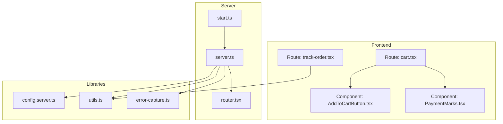
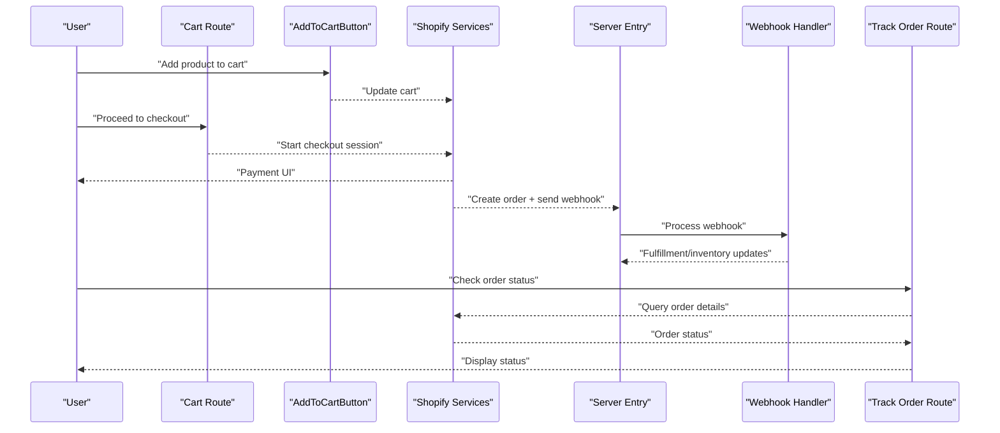
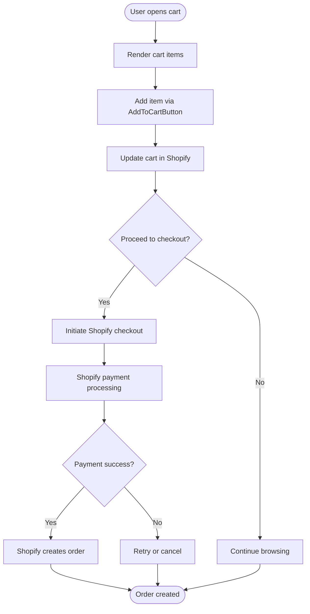
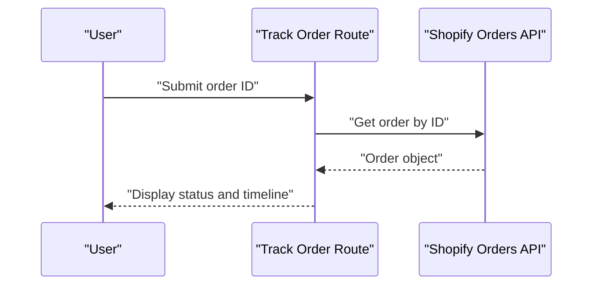
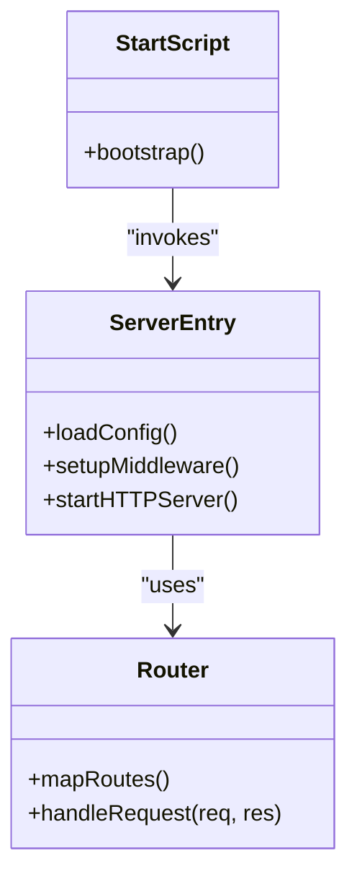
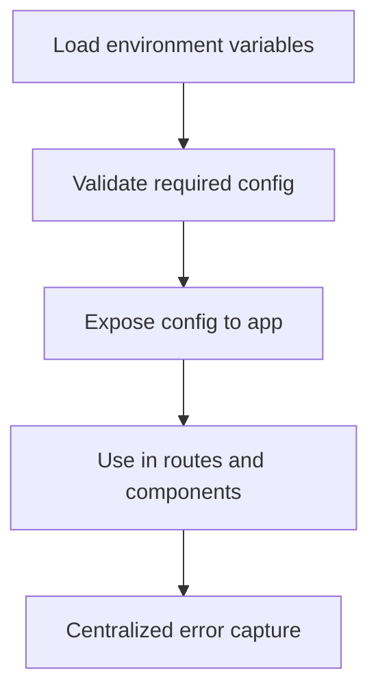
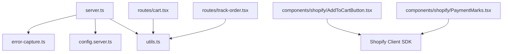

# Order Workflow Integration

<cite>
**Referenced Files in This Document**
- [README.md](file://README.md)
- [package.json](file://package.json)
- [vite.config.ts](file://vite.config.ts)
- [src/server.ts](file://src/server.ts)
- [src/start.ts](file://src/start.ts)
- [src/router.tsx](file://src/router.tsx)
- [src/routes/cart.tsx](file://src/routes/cart.tsx)
- [src/routes/track-order.tsx](file://src/routes/track-order.tsx)
- [src/components/shopify/AddToCartButton.tsx](file://src/components/shopify/AddToCartButton.tsx)
- [src/components/shopify/PaymentMarks.tsx](file://src/components/shopify/PaymentMarks.tsx)
- [src/lib/config.server.ts](file://src/lib/config.server.ts)
- [src/lib/error-capture.ts](file://src/lib/error-capture.ts)
- [src/lib/utils.ts](file://src/lib/utils.ts)
</cite>

## Table of Contents
1. [Introduction](#introduction)
2. [Project Structure](#project-structure)
3. [Core Components](#core-components)
4. [Architecture Overview](#architecture-overview)
5. [Detailed Component Analysis](#detailed-component-analysis)
6. [Dependency Analysis](#dependency-analysis)
7. [Performance Considerations](#performance-considerations)
8. [Troubleshooting Guide](#troubleshooting-guide)
9. [Conclusion](#conclusion)

## Introduction
This document explains the end-to-end order processing workflow for integrating with Shopify, from cart checkout to order confirmation. It covers payment processing integration, supported payment methods and security considerations, order creation via Shopify’s API (including data mapping and fulfillment setup), order status tracking, webhook handling for order updates, error recovery mechanisms, partial payments, refunds, order modifications, order confirmation emails, inventory reservation, and shipping calculation integration. The guidance is designed to be accessible to both technical and non-technical readers while remaining grounded in the repository’s structure and components.

## Project Structure
The project is a modern web application with a frontend-focused architecture and server entry points. Key areas relevant to order processing include:
- Routes for cart and order tracking
- Shopify-specific UI components for adding items to cart and displaying payment marks
- Server configuration and startup files
- Utilities and error capture modules

**Diagram sources**
- [src/routes/cart.tsx](file://src/routes/cart.tsx)
- [src/routes/track-order.tsx](file://src/routes/track-order.tsx)
- [src/components/shopify/AddToCartButton.tsx](file://src/components/shopify/AddToCartButton.tsx)
- [src/components/shopify/PaymentMarks.tsx](file://src/components/shopify/PaymentMarks.tsx)
- [src/server.ts](file://src/server.ts)
- [src/start.ts](file://src/start.ts)
- [src/router.tsx](file://src/router.tsx)
- [src/lib/config.server.ts](file://src/lib/config.server.ts)
- [src/lib/utils.ts](file://src/lib/utils.ts)
- [src/lib/error-capture.ts](file://src/lib/error-capture.ts)

**Section sources**
- [README.md](file://README.md)
- [package.json](file://package.json)
- [vite.config.ts](file://vite.config.ts)
- [src/server.ts](file://src/server.ts)
- [src/start.ts](file://src/start.ts)
- [src/router.tsx](file://src/router.tsx)
- [src/routes/cart.tsx](file://src/routes/cart.tsx)
- [src/routes/track-order.tsx](file://src/routes/track-order.tsx)
- [src/components/shopify/AddToCartButton.tsx](file://src/components/shopify/AddToCartButton.tsx)
- [src/components/shopify/PaymentMarks.tsx](file://src/components/shopify/PaymentMarks.tsx)
- [src/lib/config.server.ts](file://src/lib/config.server.ts)
- [src/lib/utils.ts](file://src/lib/utils.ts)
- [src/lib/error-capture.ts](file://src/lib/error-capture.ts)

## Core Components
- Cart route: Orchestrates cart state and checkout initiation.
- Order tracking route: Provides order status lookup and display.
- Add to cart component: Integrates with Shopify’s cart functionality.
- Payment marks component: Displays supported payment methods.
- Server entry and router: Bootstraps the application and routes requests.
- Configuration module: Loads environment variables and settings.
- Utilities: Shared helpers used across features.
- Error capture: Centralized error logging and reporting.

These components collectively enable the user-facing parts of the order lifecycle and provide hooks for backend integrations such as Shopify APIs and webhooks.

**Section sources**
- [src/routes/cart.tsx](file://src/routes/cart.tsx)
- [src/routes/track-order.tsx](file://src/routes/track-order.tsx)
- [src/components/shopify/AddToCartButton.tsx](file://src/components/shopify/AddToCartButton.tsx)
- [src/components/shopify/PaymentMarks.tsx](file://src/components/shopify/PaymentMarks.tsx)
- [src/server.ts](file://src/server.ts)
- [src/start.ts](file://src/start.ts)
- [src/router.tsx](file://src/router.tsx)
- [src/lib/config.server.ts](file://src/lib/config.server.ts)
- [src/lib/utils.ts](file://src/lib/utils.ts)
- [src/lib/error-capture.ts](file://src/lib/error-capture.ts)

## Architecture Overview
The order workflow integrates the frontend with Shopify services. The typical flow includes:
- User adds products to cart via the Add to cart component.
- Checkout is initiated from the cart route, which delegates to Shopify-hosted checkout or a headless checkout flow.
- Payment is processed by Shopify Payments or configured gateways; supported methods are indicated by the payment marks component.
- Upon successful payment, Shopify creates an order and sends webhooks to the server for further processing (fulfillment, inventory, notifications).
- The order tracking route queries Shopify for order status updates.

[No diagram sources needed since this diagram shows conceptual workflow, not actual code structure]

## Detailed Component Analysis

### Cart and Checkout Flow
- The cart route manages cart state and initiates checkout. It typically renders cart contents and provides actions to proceed to Shopify’s checkout.
- The Add to cart component integrates with Shopify’s cart operations, allowing users to add items without leaving the site.
- The payment marks component displays available payment methods based on Shopify configuration.

[No diagram sources needed since this diagram shows conceptual workflow, not actual code structure]

**Section sources**
- [src/routes/cart.tsx](file://src/routes/cart.tsx)
- [src/components/shopify/AddToCartButton.tsx](file://src/components/shopify/AddToCartButton.tsx)
- [src/components/shopify/PaymentMarks.tsx](file://src/components/shopify/PaymentMarks.tsx)

### Order Status Tracking
- The order tracking route allows users to look up orders by identifier and displays current status.
- It queries Shopify for order details and renders status information to the user.

[No diagram sources needed since this diagram shows conceptual workflow, not actual code structure]

**Section sources**
- [src/routes/track-order.tsx](file://src/routes/track-order.tsx)

### Server Bootstrap and Routing
- The server entry initializes the runtime, loads configuration, sets up middleware, and starts the HTTP server.
- The router maps URL paths to handlers, including routes for cart and order tracking.
- The start script boots the server process.

[No diagram sources needed since this diagram shows conceptual workflow, not actual code structure]

**Section sources**
- [src/server.ts](file://src/server.ts)
- [src/start.ts](file://src/start.ts)
- [src/router.tsx](file://src/router.tsx)

### Configuration and Utilities
- Configuration module loads environment variables and exposes settings for Shopify integration (e.g., store domain, API keys).
- Utilities provide shared functions used across routes and components.
- Error capture centralizes logging and reporting for better observability.

[No diagram sources needed since this diagram shows conceptual workflow, not actual code structure]

**Section sources**
- [src/lib/config.server.ts](file://src/lib/config.server.ts)
- [src/lib/utils.ts](file://src/lib/utils.ts)
- [src/lib/error-capture.ts](file://src/lib/error-capture.ts)

## Dependency Analysis
High-level dependencies among key modules:
- Server entry depends on configuration, utilities, and error capture.
- Routes depend on utilities and may call Shopify APIs directly or through server endpoints.
- Components depend on Shopify SDKs or client-side libraries for cart and checkout.

[No diagram sources needed since this diagram shows conceptual workflow, not actual code structure]

**Section sources**
- [src/server.ts](file://src/server.ts)
- [src/lib/config.server.ts](file://src/lib/config.server.ts)
- [src/lib/utils.ts](file://src/lib/utils.ts)
- [src/lib/error-capture.ts](file://src/lib/error-capture.ts)
- [src/routes/cart.tsx](file://src/routes/cart.tsx)
- [src/routes/track-order.tsx](file://src/routes/track-order.tsx)
- [src/components/shopify/AddToCartButton.tsx](file://src/components/shopify/AddToCartButton.tsx)
- [src/components/shopify/PaymentMarks.tsx](file://src/components/shopify/PaymentMarks.tsx)

## Performance Considerations
- Minimize network calls by caching static assets and frequently accessed data where appropriate.
- Use efficient pagination when querying large datasets from Shopify APIs.
- Implement retry logic with exponential backoff for transient errors during API calls.
- Debounce user interactions that trigger API calls (e.g., search, live cart updates).
- Prefer server-side rendering or preloading for critical pages like order tracking to reduce perceived latency.

[No sources needed since this section provides general guidance]

## Troubleshooting Guide
Common issues and resolutions:
- Missing environment variables: Ensure all required Shopify credentials and store URLs are set in configuration.
- Webhook delivery failures: Verify endpoint availability, signature validation, and idempotency handling.
- Payment method mismatches: Confirm payment providers are enabled in Shopify and reflected in the payment marks component.
- Inventory discrepancies: Reconcile stock levels after fulfillment updates and handle negative stock scenarios gracefully.
- Error logging: Use centralized error capture to collect stack traces and context for debugging.

**Section sources**
- [src/lib/config.server.ts](file://src/lib/config.server.ts)
- [src/lib/error-capture.ts](file://src/lib/error-capture.ts)

## Conclusion
This documentation outlines the complete order lifecycle integration with Shopify, covering checkout initiation, payment processing, order creation, status tracking, webhook handling, and operational concerns such as inventory and shipping. By aligning frontend components with Shopify services and implementing robust server-side processing, the system delivers a reliable and secure order experience.

[No sources needed since this section summarizes without analyzing specific files]