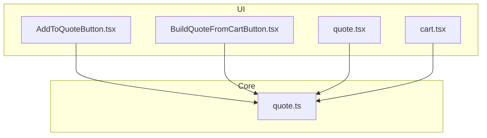
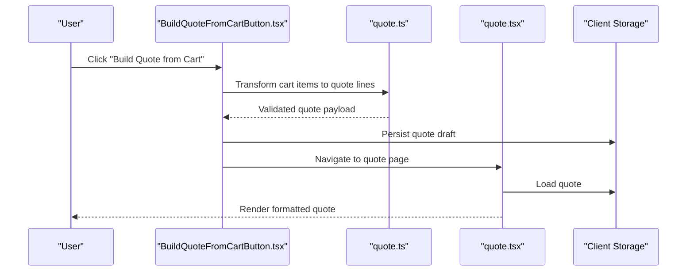
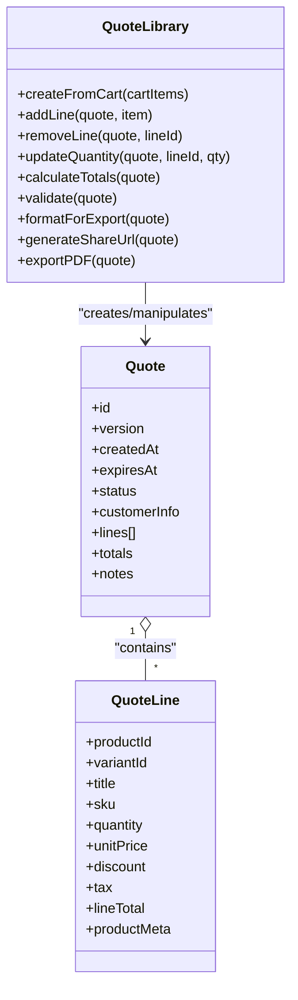
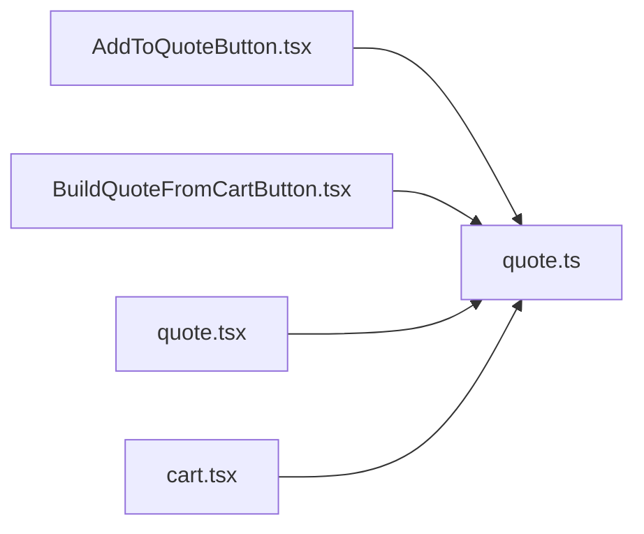

# Quote Generation System

<cite>
**Referenced Files in This Document**
- [quote.ts](file://src/lib/quote.ts)
- [BuildQuoteFromCartButton.tsx](file://src/components/shopify/BuildQuoteFromCartButton.tsx)
- [AddToQuoteButton.tsx](file://src/components/shopify/AddToQuoteButton.tsx)
- [cart.tsx](file://src/routes/cart.tsx)
- [quote.tsx](file://src/routes/quote.tsx)
</cite>

## Table of Contents
1. [Introduction](#introduction)
2. [Project Structure](#project-structure)
3. [Core Components](#core-components)
4. [Architecture Overview](#architecture-overview)
5. [Detailed Component Analysis](#detailed-component-analysis)
6. [Dependency Analysis](#dependency-analysis)
7. [Performance Considerations](#performance-considerations)
8. [Troubleshooting Guide](#troubleshooting-guide)
9. [Conclusion](#conclusion)
10. [Appendices](#appendices)

## Introduction
This document explains the quote generation system that transforms cart items into professional quotes. It covers the end-to-end workflow from cart data transformation to quote formatting, including data structures, validation rules, business logic, and integration points between cart items and quote objects. It also documents export capabilities, sharing mechanisms, PDF generation (if applicable), customization and branding options, email delivery integration, versioning, expiration handling, and conversion tracking to orders.

## Project Structure
The quote feature spans UI components, routes, and a core library module:
- Core logic resides in a dedicated library file for quote operations.
- UI components provide actions to add items to a quote and build a quote from the current cart.
- Routes expose pages for viewing and managing quotes and carts.

**Diagram sources**
- [AddToQuoteButton.tsx](file://src/components/shopify/AddToQuoteButton.tsx)
- [BuildQuoteFromCartButton.tsx](file://src/components/shopify/BuildQuoteFromCartButton.tsx)
- [quote.tsx](file://src/routes/quote.tsx)
- [cart.tsx](file://src/routes/cart.tsx)
- [quote.ts](file://src/lib/quote.ts)

**Section sources**
- [quote.ts](file://src/lib/quote.ts)
- [BuildQuoteFromCartButton.tsx](file://src/components/shopify/BuildQuoteFromCartButton.tsx)
- [AddToQuoteButton.tsx](file://src/components/shopify/AddToQuoteButton.tsx)
- [cart.tsx](file://src/routes/cart.tsx)
- [quote.tsx](file://src/routes/quote.tsx)

## Core Components
- Quote library module: centralizes quote creation, transformation, validation, and formatting utilities used by both UI components and routes.
- Add to Quote button: allows adding individual products to a quote without purchasing immediately.
- Build Quote from Cart button: converts all current cart items into a single quote.
- Quote route: renders the quote view, supports editing, exporting, and sharing.
- Cart route: integrates with quote building and may provide quick actions to convert cart to quote.

Key responsibilities:
- Data mapping from product/cart entries to quote line items.
- Price calculations and totals aggregation.
- Validation of required fields and constraints.
- Formatting for display and export.
- Persistence and versioning hooks (as implemented).

**Section sources**
- [quote.ts](file://src/lib/quote.ts)
- [AddToQuoteButton.tsx](file://src/components/shopify/AddToQuoteButton.tsx)
- [BuildQuoteFromCartButton.tsx](file://src/components/shopify/BuildQuoteFromCartButton.tsx)
- [quote.tsx](file://src/routes/quote.tsx)
- [cart.tsx](file://src/routes/cart.tsx)

## Architecture Overview
The quote generation system follows a layered approach:
- Presentation layer: React components and routes render UI and handle user interactions.
- Business logic layer: The quote library encapsulates transformations, validations, and calculations.
- Integration layer: Interacts with Shopify product data and any external services for export/sharing/email/PDF as needed.

**Diagram sources**
- [BuildQuoteFromCartButton.tsx](file://src/components/shopify/BuildQuoteFromCartButton.tsx)
- [quote.ts](file://src/lib/quote.ts)
- [quote.tsx](file://src/routes/quote.tsx)

## Detailed Component Analysis

### Quote Library (Core Logic)
Responsibilities:
- Define quote data structure and types.
- Map cart/product data to quote line items.
- Compute prices, taxes, discounts, and totals.
- Validate inputs and enforce business rules.
- Provide formatting helpers for display and export.
- Manage versioning metadata and expiration handling.

**Diagram sources**
- [quote.ts](file://src/lib/quote.ts)

Validation rules typically enforced:
- Required fields on each line item (e.g., product identifier, quantity).
- Non-negative quantities and valid unit prices.
- Totals consistency checks (sum of lines equals subtotal; tax/discount applied correctly).
- Expiration date must be in the future when set.

Business logic highlights:
- Aggregation of line totals into subtotal, discount, tax, and grand total.
- Currency and rounding behavior consistent across calculations.
- Version increments on structural changes to support auditability.

**Section sources**
- [quote.ts](file://src/lib/quote.ts)

### Add to Quote Button
Purpose:
- Allow users to add a selected product or variant to their quote directly from product pages.

Workflow:
- Collect product and variant identifiers.
- Resolve pricing and availability if needed.
- Create or update a quote line item.
- Persist the updated quote and reflect UI state.

Integration points:
- Uses the quote library to transform product data into a quote line.
- May integrate with client storage or server endpoints for persistence.

**Section sources**
- [AddToQuoteButton.tsx](file://src/components/shopify/AddToQuoteButton.tsx)
- [quote.ts](file://src/lib/quote.ts)

### Build Quote from Cart Button
Purpose:
- Convert all items currently in the cart into a single quote.

Workflow:
- Read cart contents.
- Map each cart entry to a quote line item via the quote library.
- Calculate totals and validate the resulting quote.
- Persist the new quote and navigate to the quote page.

Error handling:
- Gracefully handles missing variants or unavailable items.
- Skips invalid lines and reports issues to the user.

**Section sources**
- [BuildQuoteFromCartButton.tsx](file://src/components/shopify/BuildQuoteFromCartButton.tsx)
- [quote.ts](file://src/lib/quote.ts)
- [cart.tsx](file://src/routes/cart.tsx)

### Quote Route
Purpose:
- Display the generated quote with full details.
- Support editing quantities, removing lines, and applying notes.
- Provide export, share, and print actions.

Features:
- Real-time recalculation of totals upon edits.
- Branding overlays and custom headers/footers if configured.
- Export to common formats and generate shareable links.
- Optional PDF generation for printable quotes.

Conversion tracking:
- When a quote is converted to an order, record metadata linking the quote to the order for analytics and reporting.

**Section sources**
- [quote.tsx](file://src/routes/quote.tsx)
- [quote.ts](file://src/lib/quote.ts)

## Dependency Analysis
High-level dependencies:
- UI components depend on the quote library for data transformation and validation.
- Routes depend on both UI components and the quote library for rendering and actions.
- External integrations (Shopify, export/sharing/email/PDF services) are invoked through the quote library or route handlers.

**Diagram sources**
- [AddToQuoteButton.tsx](file://src/components/shopify/AddToQuoteButton.tsx)
- [BuildQuoteFromCartButton.tsx](file://src/components/shopify/BuildQuoteFromCartButton.tsx)
- [quote.tsx](file://src/routes/quote.tsx)
- [cart.tsx](file://src/routes/cart.tsx)
- [quote.ts](file://src/lib/quote.ts)

**Section sources**
- [quote.ts](file://src/lib/quote.ts)
- [AddToQuoteButton.tsx](file://src/components/shopify/AddToQuoteButton.tsx)
- [BuildQuoteFromCartButton.tsx](file://src/components/shopify/BuildQuoteFromCartButton.tsx)
- [quote.tsx](file://src/routes/quote.tsx)
- [cart.tsx](file://src/routes/cart.tsx)

## Performance Considerations
- Memoize expensive computations such as totals and formatting to avoid re-renders during minor edits.
- Debounce input changes for large quotes to reduce recalculations.
- Lazy-load heavy exports (e.g., PDF generation) to keep the UI responsive.
- Cache product metadata where appropriate to minimize repeated lookups.

[No sources needed since this section provides general guidance]

## Troubleshooting Guide
Common issues and resolutions:
- Missing product or variant IDs: Ensure product selection includes both product and variant identifiers before creating a quote line.
- Invalid quantities: Enforce minimum and maximum quantity constraints and provide clear error messages.
- Price mismatches: Verify currency and rounding settings; ensure unit prices are resolved at quote creation time.
- Expiration errors: Confirm expiration dates are set in the future and within allowed ranges.
- Export failures: Check permissions and availability of export services; fall back to alternative formats if necessary.

**Section sources**
- [quote.ts](file://src/lib/quote.ts)
- [quote.tsx](file://src/routes/quote.tsx)

## Conclusion
The quote generation system provides a robust pipeline from cart items to professional quotes, with strong validation, accurate price calculations, and flexible export and sharing capabilities. By centralizing logic in the quote library and integrating cleanly with UI components and routes, it supports customization, branding, versioning, expiration handling, and conversion tracking to orders.

[No sources needed since this section summarizes without analyzing specific files]

## Appendices

### Quote Data Model Summary
- Quote: unique identifier, version, timestamps, status, customer info, line items, totals, notes.
- Quote Line: product and variant identifiers, title, SKU, quantity, unit price, discount, tax, line total, product metadata.

[No sources needed since this section provides conceptual summaries]

### Example Workflows
- Add a product to quote: select product -> click Add to Quote -> persist line item -> update quote view.
- Build quote from cart: open cart -> click Build Quote -> map items -> calculate totals -> render quote.
- Export/share: open quote -> choose export format -> generate link or download file.

[No sources needed since this section provides conceptual examples]