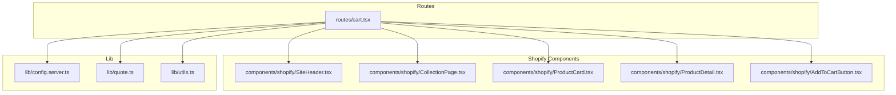
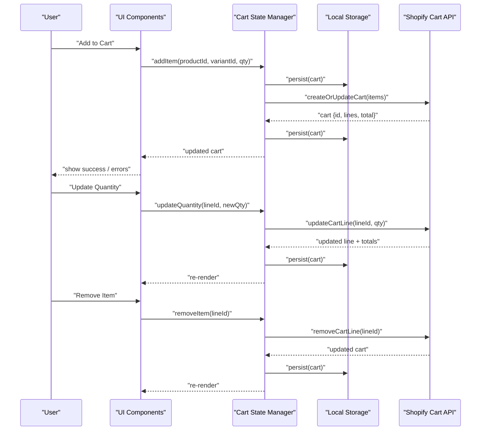
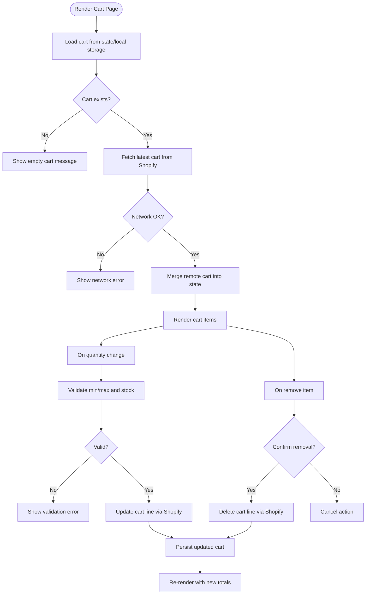
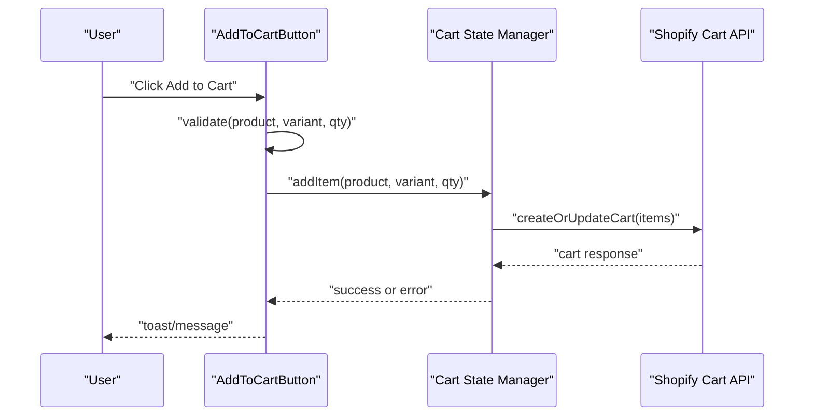
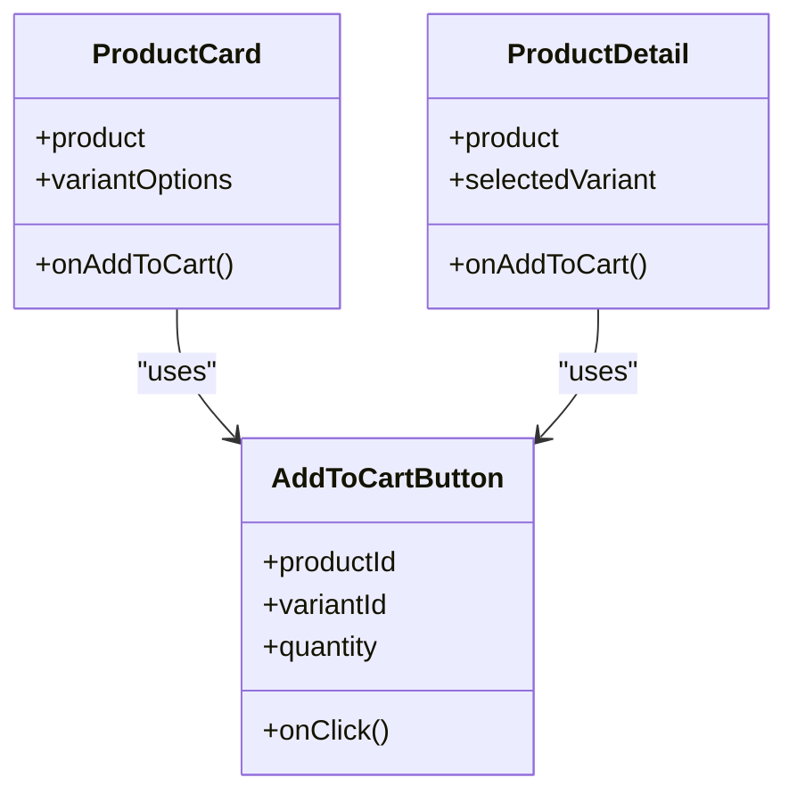
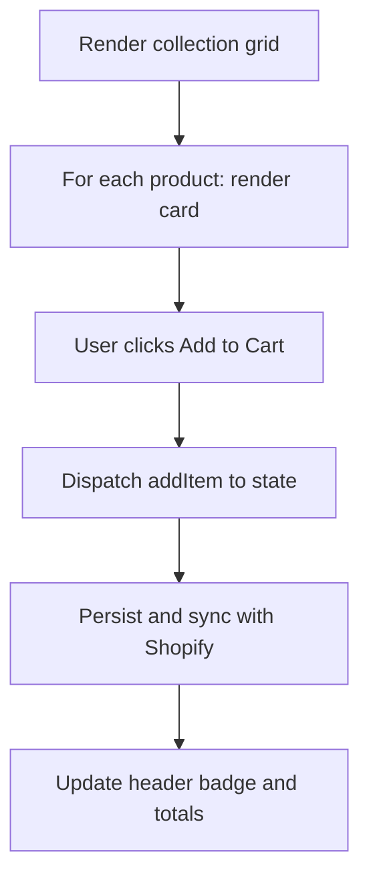
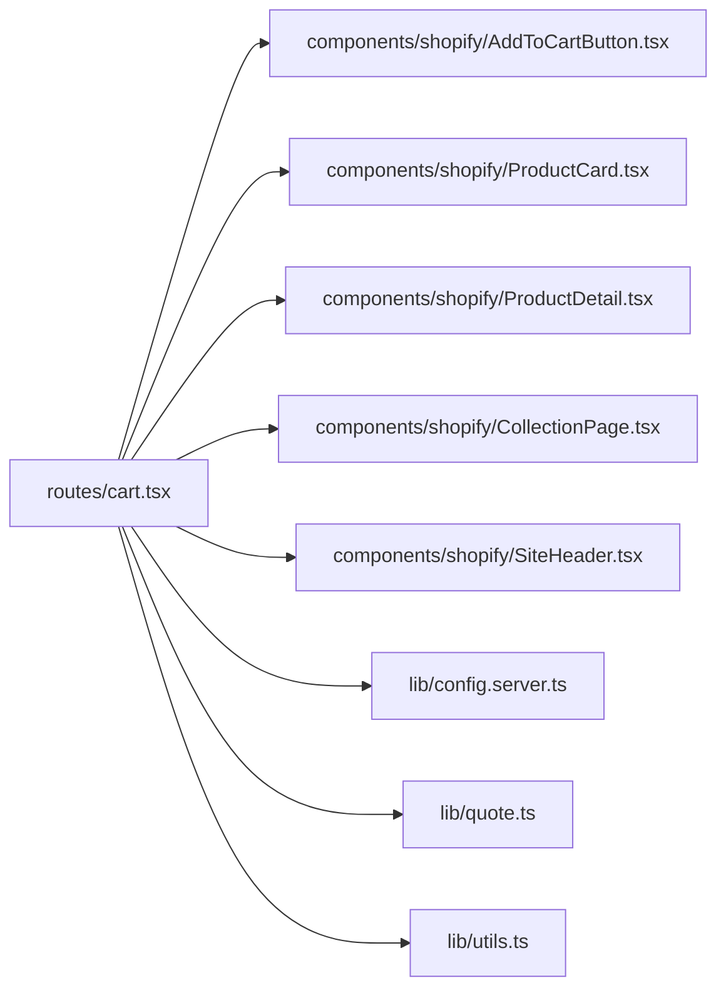

# Shopping Cart Management

<cite>
**Referenced Files in This Document**
- [cart.tsx](file://src/routes/cart.tsx)
- [AddToCartButton.tsx](file://src/components/shopify/AddToCartButton.tsx)
- [ProductCard.tsx](file://src/components/shopify/ProductCard.tsx)
- [ProductDetail.tsx](file://src/components/shopify/ProductDetail.tsx)
- [CollectionPage.tsx](file://src/components/shopify/CollectionPage.tsx)
- [SiteHeader.tsx](file://src/components/shopify/SiteHeader.tsx)
- [config.server.ts](file://src/lib/config.server.ts)
- [quote.ts](file://src/lib/quote.ts)
- [utils.ts](file://src/lib/utils.ts)
</cite>

## Table of Contents
1. [Introduction](#introduction)
2. [Project Structure](#project-structure)
3. [Core Components](#core-components)
4. [Architecture Overview](#architecture-overview)
5. [Detailed Component Analysis](#detailed-component-analysis)
6. [Dependency Analysis](#dependency-analysis)
7. [Performance Considerations](#performance-considerations)
8. [Troubleshooting Guide](#troubleshooting-guide)
9. [Conclusion](#conclusion)

## Introduction
This document explains the shopping cart management system implemented in the application. It covers adding products to the cart, updating quantities, removing items, cart state management (including local storage persistence and session handling), integration with Shopify’s cart API for real-time inventory and pricing, UI components and event handling, error states, synchronization across devices, item validation, stock availability checks, and performance optimization for large carts and memory management.

## Project Structure
The cart functionality spans routes, shopify-specific components, and shared utilities:
- Route-level cart page for viewing and editing cart contents
- Shop component layer for product interactions and cart actions
- Shared utilities and configuration for server-side settings and helpers

**Diagram sources**
- [cart.tsx](file://src/routes/cart.tsx)
- [SiteHeader.tsx](file://src/components/shopify/SiteHeader.tsx)
- [CollectionPage.tsx](file://src/components/shopify/CollectionPage.tsx)
- [ProductCard.tsx](file://src/components/shopify/ProductCard.tsx)
- [ProductDetail.tsx](file://src/components/shopify/ProductDetail.tsx)
- [AddToCartButton.tsx](file://src/components/shopify/AddToCartButton.tsx)
- [config.server.ts](file://src/lib/config.server.ts)
- [quote.ts](file://src/lib/quote.ts)
- [utils.ts](file://src/lib/utils.ts)

**Section sources**
- [cart.tsx](file://src/routes/cart.tsx)
- [SiteHeader.tsx](file://src/components/shopify/SiteHeader.tsx)
- [CollectionPage.tsx](file://src/components/shopify/CollectionPage.tsx)
- [ProductCard.tsx](file://src/components/shopify/ProductCard.tsx)
- [ProductDetail.tsx](file://src/components/shopify/ProductDetail.tsx)
- [AddToCartButton.tsx](file://src/components/shopify/AddToCartButton.tsx)
- [config.server.ts](file://src/lib/config.server.ts)
- [quote.ts](file://src/lib/quote.ts)
- [utils.ts](file://src/lib/utils.ts)

## Core Components
- Cart route: Renders the cart view, manages user interactions (update quantity, remove item), and coordinates with Shopify for live totals and availability.
- Add-to-cart button: Initiates add-to-cart flows from product listings or detail pages, validates inputs, and updates the cart state.
- Product card/detail: Displays product info and exposes add-to-cart controls; may show stock status and price.
- Collection page: Lists multiple products and provides add-to-cart actions per item.
- Site header: Shows cart summary and links to the cart route.

Key responsibilities:
- State management: Maintain a normalized cart model with item IDs, variants, quantities, and metadata.
- Persistence: Persist cart state to local storage and synchronize with Shopify when online.
- Validation: Enforce minimum/maximum quantities and stock limits.
- Error handling: Surface network errors, out-of-stock conditions, and invalid operations.

**Section sources**
- [cart.tsx](file://src/routes/cart.tsx)
- [AddToCartButton.tsx](file://src/components/shopify/AddToCartButton.tsx)
- [ProductCard.tsx](file://src/components/shopify/ProductCard.tsx)
- [ProductDetail.tsx](file://src/components/shopify/ProductDetail.tsx)
- [CollectionPage.tsx](file://src/components/shopify/CollectionPage.tsx)
- [SiteHeader.tsx](file://src/components/shopify/SiteHeader.tsx)

## Architecture Overview
The cart system follows a layered architecture:
- UI Layer: React components render cart views and trigger actions.
- State Layer: In-memory cart state is kept in sync with persisted storage and remote Shopify data.
- Integration Layer: Calls to Shopify’s cart API fetch/update cart data, including inventory and pricing.
- Utilities: Helpers for normalization, validation, and formatting.

**Diagram sources**
- [cart.tsx](file://src/routes/cart.tsx)
- [AddToCartButton.tsx](file://src/components/shopify/AddToCartButton.tsx)
- [config.server.ts](file://src/lib/config.server.ts)

## Detailed Component Analysis

### Cart Route
Responsibilities:
- Render cart items, totals, and actions.
- Handle update quantity and remove item events.
- Display error messages and loading states.
- Coordinate with Shopify for live prices and stock.

**Diagram sources**
- [cart.tsx](file://src/routes/cart.tsx)

**Section sources**
- [cart.tsx](file://src/routes/cart.tsx)

### Add To Cart Button
Responsibilities:
- Accept product and variant selection.
- Validate input (e.g., required variant).
- Dispatch add-to-cart action and handle success/error feedback.
- Optionally pre-validate stock before calling Shopify.

**Diagram sources**
- [AddToCartButton.tsx](file://src/components/shopify/AddToCartButton.tsx)

**Section sources**
- [AddToCartButton.tsx](file://src/components/shopify/AddToCartButton.tsx)

### Product Card and Detail
Responsibilities:
- Display product name, price, and stock status.
- Provide add-to-cart control(s).
- Reflect real-time availability if possible.

**Diagram sources**
- [ProductCard.tsx](file://src/components/shopify/ProductCard.tsx)
- [ProductDetail.tsx](file://src/components/shopify/ProductDetail.tsx)
- [AddToCartButton.tsx](file://src/components/shopify/AddToCartButton.tsx)

**Section sources**
- [ProductCard.tsx](file://src/components/shopify/ProductCard.tsx)
- [ProductDetail.tsx](file://src/components/shopify/ProductDetail.tsx)
- [AddToCartButton.tsx](file://src/components/shopify/AddToCartButton.tsx)

### Collection Page
Responsibilities:
- List multiple products with add-to-cart buttons.
- Aggregate cart updates across many items efficiently.

**Diagram sources**
- [CollectionPage.tsx](file://src/components/shopify/CollectionPage.tsx)
- [SiteHeader.tsx](file://src/components/shopify/SiteHeader.tsx)

**Section sources**
- [CollectionPage.tsx](file://src/components/shopify/CollectionPage.tsx)
- [SiteHeader.tsx](file://src/components/shopify/SiteHeader.tsx)

### Site Header
Responsibilities:
- Show cart count and subtotal.
- Link to cart route.
- Reflect real-time changes after cart updates.

**Section sources**
- [SiteHeader.tsx](file://src/components/shopify/SiteHeader.tsx)

### Configuration and Utilities
- Server configuration: Provides environment-based settings used by client integrations (e.g., storefront endpoints).
- Quote utility: May bridge between cart and quote workflows.
- Utils: Shared helpers for normalization, formatting, and validation.

**Section sources**
- [config.server.ts](file://src/lib/config.server.ts)
- [quote.ts](file://src/lib/quote.ts)
- [utils.ts](file://src/lib/utils.ts)

## Dependency Analysis
High-level dependencies among cart-related modules:

**Diagram sources**
- [cart.tsx](file://src/routes/cart.tsx)
- [AddToCartButton.tsx](file://src/components/shopify/AddToCartButton.tsx)
- [ProductCard.tsx](file://src/components/shopify/ProductCard.tsx)
- [ProductDetail.tsx](file://src/components/shopify/ProductDetail.tsx)
- [CollectionPage.tsx](file://src/components/shopify/CollectionPage.tsx)
- [SiteHeader.tsx](file://src/components/shopify/SiteHeader.tsx)
- [config.server.ts](file://src/lib/config.server.ts)
- [quote.ts](file://src/lib/quote.ts)
- [utils.ts](file://src/lib/utils.ts)

**Section sources**
- [cart.tsx](file://src/routes/cart.tsx)
- [AddToCartButton.tsx](file://src/components/shopify/AddToCartButton.tsx)
- [ProductCard.tsx](file://src/components/shopify/ProductCard.tsx)
- [ProductDetail.tsx](file://src/components/shopify/ProductDetail.tsx)
- [CollectionPage.tsx](file://src/components/shopify/CollectionPage.tsx)
- [SiteHeader.tsx](file://src/components/shopify/SiteHeader.tsx)
- [config.server.ts](file://src/lib/config.server.ts)
- [quote.ts](file://src/lib/quote.ts)
- [utils.ts](file://src/lib/utils.ts)

## Performance Considerations
- Batched updates: Coalesce rapid quantity changes to minimize Shopify calls.
- Optimistic UI: Apply local state changes immediately, then reconcile with server responses.
- Debounced persistence: Throttle writes to local storage to avoid excessive IO.
- Selective re-renders: Use memoization and stable references for cart items and totals.
- Pagination/lazy loading: For large collections, load more items on demand to reduce initial payload.
- Memory management: Normalize cart state, avoid deep cloning on every update, and clean up unused references.

[No sources needed since this section provides general guidance]

## Troubleshooting Guide
Common issues and resolutions:
- Network failures: Detect and surface errors during Shopify API calls; allow retry and fallback to last known good state.
- Out-of-stock: Disable add-to-cart or set quantity to zero; display clear messaging.
- Invalid quantities: Enforce min/max constraints and round to allowed increments.
- Stale cache: On navigation or focus, refresh cart totals from Shopify to ensure consistency.
- Cross-device sync: Ensure cart ID is preserved and synced; prompt users to sign in to merge carts if applicable.

**Section sources**
- [cart.tsx](file://src/routes/cart.tsx)
- [AddToCartButton.tsx](file://src/components/shopify/AddToCartButton.tsx)

## Conclusion
The cart system integrates UI components with Shopify’s cart API to deliver real-time pricing and inventory while maintaining a responsive user experience through optimistic updates and robust error handling. Proper state normalization, persistence, and validation ensure reliability and scalability even for large carts.

[No sources needed since this section summarizes without analyzing specific files]