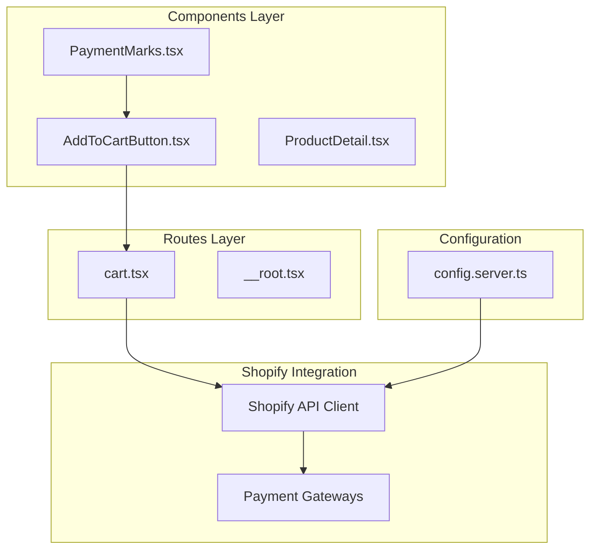
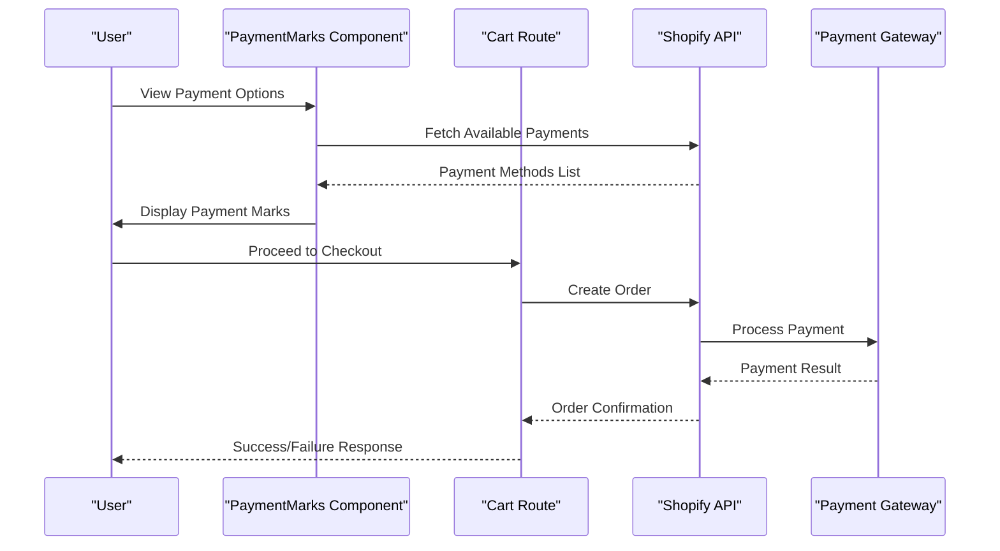
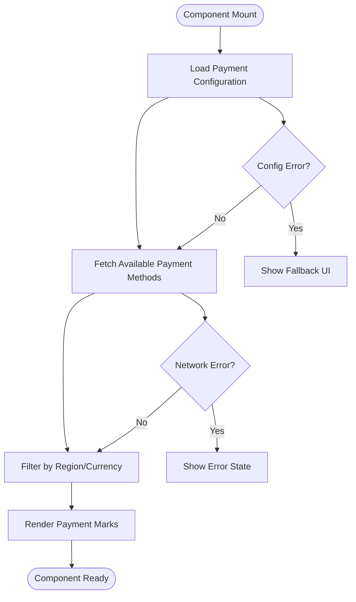
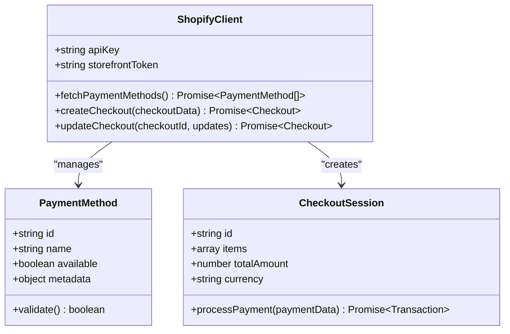
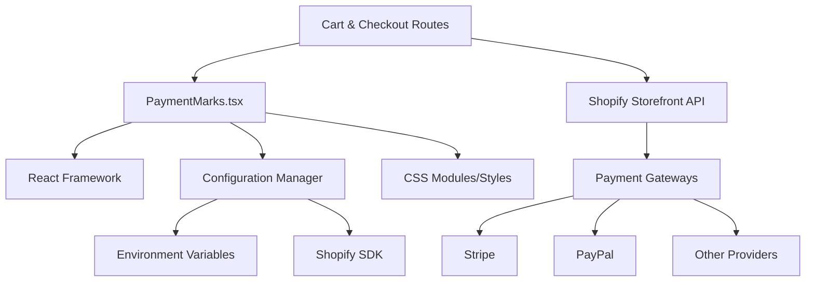
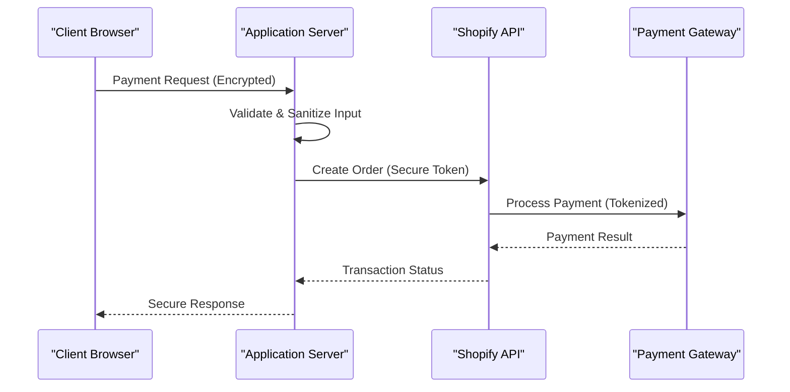

# Payment Integration

<cite>
**Referenced Files in This Document**   
- [PaymentMarks.tsx](file://src/components/shopify/PaymentMarks.tsx)
- [config.server.ts](file://src/lib/config.server.ts)
- [cart.tsx](file://src/routes/cart.tsx)
- [AddToCartButton.tsx](file://src/components/shopify/AddToCartButton.tsx)
- [ProductDetail.tsx](file://src/components/shopify/ProductDetail.tsx)
</cite>

## Table of Contents
1. [Introduction](#introduction)
2. [Project Structure](#project-structure)
3. [Core Components](#core-components)
4. [Architecture Overview](#architecture-overview)
5. [Detailed Component Analysis](#detailed-component-analysis)
6. [Dependency Analysis](#dependency-analysis)
7. [Performance Considerations](#performance-considerations)
8. [Security and PCI Compliance](#security-and-pci-compliance)
9. [Testing Strategies](#testing-strategies)
10. [Troubleshooting Guide](#troubleshooting-guide)
11. [Conclusion](#conclusion)

## Introduction

This document provides comprehensive guidance for implementing payment integration within the Shopify ecosystem using the PaymentMarks component. It covers payment method display, gateway configuration, checkout flow integration, validation, transaction handling, customization options, error handling, security considerations, and testing strategies.

## Project Structure

The project follows a modular architecture with clear separation between UI components, business logic, and configuration:

**Diagram sources**
- [PaymentMarks.tsx](file://src/components/shopify/PaymentMarks.tsx)
- [cart.tsx](file://src/routes/cart.tsx)
- [config.server.ts](file://src/lib/config.server.ts)

**Section sources**
- [PaymentMarks.tsx](file://src/components/shopify/PaymentMarks.tsx)
- [config.server.ts](file://src/lib/config.server.ts)

## Core Components

### PaymentMarks Component

The PaymentMarks component is responsible for displaying supported payment methods and their associated marks/logos. Key responsibilities include:

- Rendering payment provider logos and brand marks
- Managing payment method availability based on configuration
- Handling responsive design for different screen sizes
- Providing accessibility features for payment method information

### Configuration Management

Server-side configuration handles:
- Shopify store credentials and API keys
- Payment gateway settings
- Environment-specific configurations
- Feature flags for payment providers

**Section sources**
- [PaymentMarks.tsx](file://src/components/shopify/PaymentMarks.tsx)
- [config.server.ts](file://src/lib/config.server.ts)

## Architecture Overview

The payment integration follows a layered architecture pattern:

**Diagram sources**
- [PaymentMarks.tsx](file://src/components/shopify/PaymentMarks.tsx)
- [cart.tsx](file://src/routes/cart.tsx)

## Detailed Component Analysis

### PaymentMarks Component Implementation

The PaymentMarks component implements several key patterns:

#### Data Flow Pattern

**Diagram sources**
- [PaymentMarks.tsx](file://src/components/shopify/PaymentMarks.tsx)

#### Component Lifecycle
The component manages its lifecycle through:
- Initialization with configuration props
- Dynamic loading of payment method data
- Error boundary implementation for graceful degradation
- Cleanup procedures for event listeners and subscriptions

### Shopify Integration Layer

The integration layer handles communication with Shopify's APIs:

#### API Communication Flow

**Diagram sources**
- [config.server.ts](file://src/lib/config.server.ts)

**Section sources**
- [PaymentMarks.tsx](file://src/components/shopify/PaymentMarks.tsx)
- [config.server.ts](file://src/lib/config.server.ts)

## Dependency Analysis

The payment integration has the following dependency relationships:

**Diagram sources**
- [PaymentMarks.tsx](file://src/components/shopify/PaymentMarks.tsx)
- [config.server.ts](file://src/lib/config.server.ts)

**Section sources**
- [PaymentMarks.tsx](file://src/components/shopify/PaymentMarks.tsx)
- [config.server.ts](file://src/lib/config.server.ts)

## Performance Considerations

### Optimization Strategies

1. **Lazy Loading**: Payment methods are loaded on-demand to reduce initial bundle size
2. **Caching**: Payment method configurations are cached to minimize API calls
3. **Image Optimization**: Payment provider logos are optimized for web delivery
4. **Code Splitting**: Payment-related functionality is split into separate bundles

### Monitoring and Metrics

Key performance indicators to track:
- Payment method load time
- API response times
- Error rates during payment processing
- User interaction metrics with payment options

## Security and PCI Compliance

### Security Best Practices

1. **PCI DSS Compliance**: Ensure all payment data handling meets PCI requirements
2. **HTTPS Enforcement**: All payment communications must use HTTPS
3. **Input Validation**: Validate all user inputs before processing
4. **CSRF Protection**: Implement CSRF tokens for payment requests
5. **XSS Prevention**: Sanitize all user-generated content

### Secure Communication Patterns

**Diagram sources**
- [config.server.ts](file://src/lib/config.server.ts)

## Testing Strategies

### Unit Testing Approach

1. **Component Testing**: Test PaymentMarks rendering and interactions
2. **Mock Services**: Mock Shopify API responses for consistent testing
3. **Error Scenarios**: Test various failure conditions and error handling
4. **Integration Tests**: Verify end-to-end payment flows

### Test Coverage Areas

- Payment method display logic
- Configuration validation
- Error boundary behavior
- Responsive design across devices
- Accessibility compliance

## Troubleshooting Guide

### Common Issues and Solutions

1. **Payment Methods Not Loading**
   - Check API credentials configuration
   - Verify network connectivity
   - Review browser console for errors

2. **Payment Processing Failures**
   - Validate payment gateway configuration
   - Check webhook endpoints
   - Review transaction logs

3. **Display Issues**
   - Verify CSS styling conflicts
   - Check responsive breakpoints
   - Test across different browsers

### Debugging Tools

- Enable development logging for payment flows
- Use browser developer tools for network inspection
- Implement structured error reporting
- Monitor application performance metrics

## Conclusion

This payment integration documentation provides a comprehensive framework for implementing secure, efficient, and user-friendly payment functionality within the Shopify ecosystem. The PaymentMarks component serves as the primary interface for displaying payment options, while the underlying architecture ensures robust integration with Shopify's payment infrastructure.

By following the guidelines outlined in this document, developers can create reliable payment experiences that meet security standards, provide excellent user experience, and maintain high performance across all devices and browsers.