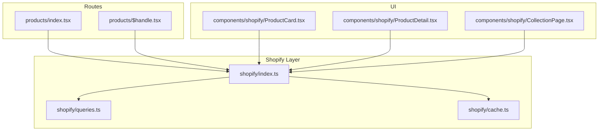
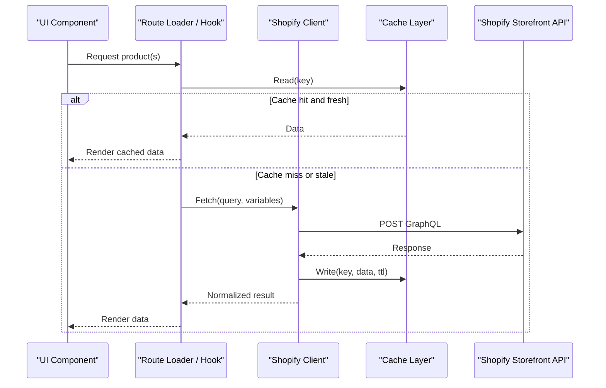
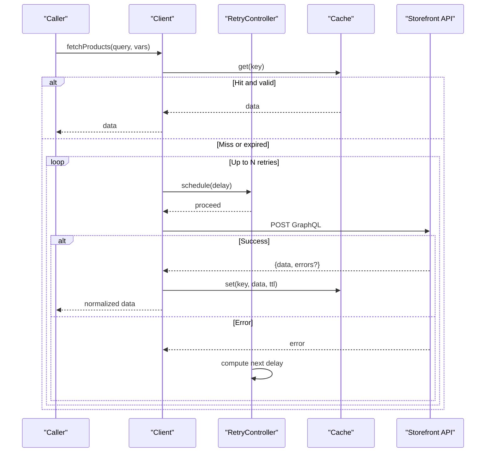
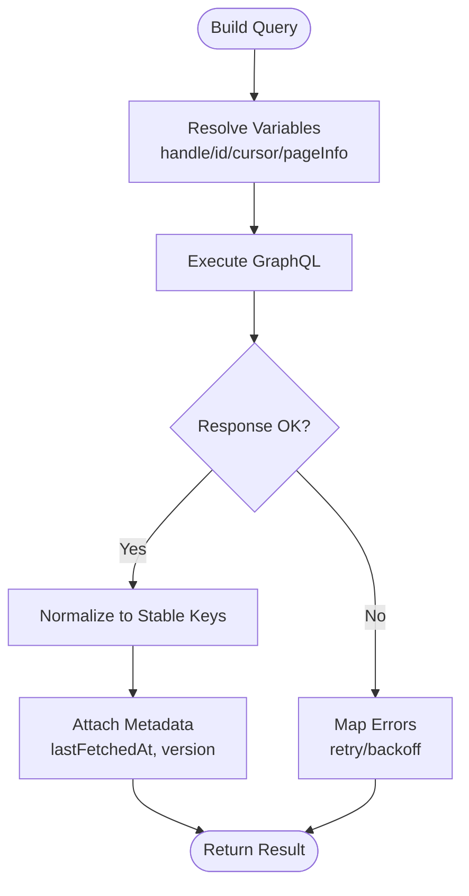
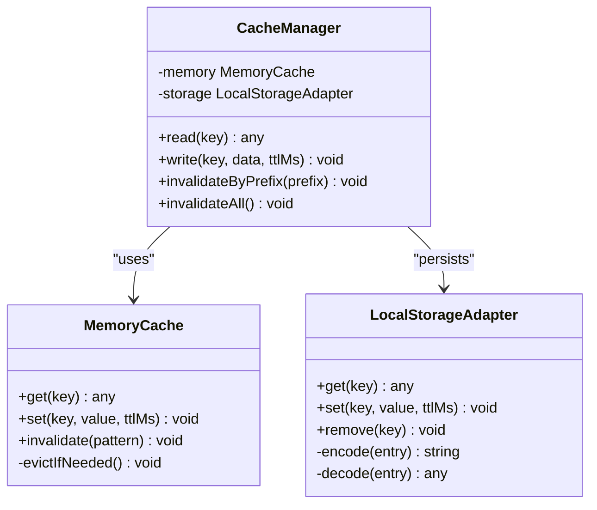
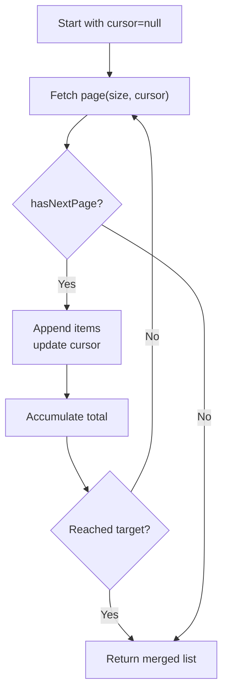
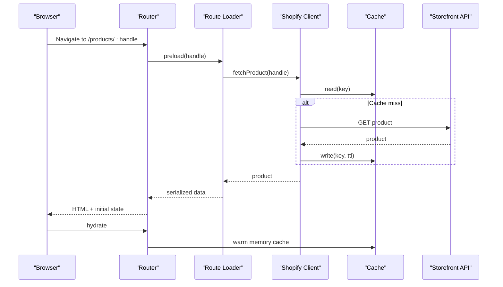
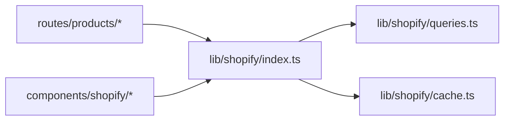

# Product Data Fetching & Caching

<cite>
**Referenced Files in This Document**
- [src/lib/shopify/index.ts](file://src/lib/shopify/index.ts)
- [src/lib/shopify/queries.ts](file://src/lib/shopify/queries.ts)
- [src/lib/shopify/cache.ts](file://src/lib/shopify/cache.ts)
- [src/routes/products/index.tsx](file://src/routes/products/index.tsx)
- [src/routes/products/$handle.tsx](file://src/routes/products/$handle.tsx)
- [src/components/shopify/ProductCard.tsx](file://src/components/shopify/ProductCard.tsx)
- [src/components/shopify/ProductDetail.tsx](file://src/components/shopify/ProductDetail.tsx)
- [src/components/shopify/CollectionPage.tsx](file://src/components/shopify/CollectionPage.tsx)
</cite>

## Table of Contents
1. [Introduction](#introduction)
2. [Project Structure](#project-structure)
3. [Core Components](#core-components)
4. [Architecture Overview](#architecture-overview)
5. [Detailed Component Analysis](#detailed-component-analysis)
6. [Dependency Analysis](#dependency-analysis)
7. [Performance Considerations](#performance-considerations)
8. [Troubleshooting Guide](#troubleshooting-guide)
9. [Conclusion](#conclusion)

## Introduction

This document explains how products are fetched from the Shopify Storefront API and cached efficiently across the application. It covers GraphQL queries, error handling, retry logic, caching strategies (local storage and memory), cache invalidation policies, pagination for large catalogs, search optimization, real-time inventory updates, request deduplication, background refresh, and offline support.

## Project Structure

The product data layer is organized into focused modules:
- Shopify client and GraphQL query definitions
- Caching utilities with memory and local storage backends
- Route-level data loaders for server-side rendering and client hydration
- UI components that consume product data and handle loading/error states

**Diagram sources**
- [src/routes/products/index.tsx](file://src/routes/products/index.tsx)
- [src/routes/products/$handle.tsx](file://src/routes/products/$handle.tsx)
- [src/lib/shopify/index.ts](file://src/lib/shopify/index.ts)
- [src/lib/shopify/queries.ts](file://src/lib/shopify/queries.ts)
- [src/lib/shopify/cache.ts](file://src/lib/shopify/cache.ts)
- [src/components/shopify/ProductCard.tsx](file://src/components/shopify/ProductCard.tsx)
- [src/components/shopify/ProductDetail.tsx](file://src/components/shopify/ProductDetail.tsx)
- [src/components/shopify/CollectionPage.tsx](file://src/components/shopify/CollectionPage.tsx)

**Section sources**
- [src/routes/products/index.tsx](file://src/routes/products/index.tsx)
- [src/routes/products/$handle.tsx](file://src/routes/products/$handle.tsx)
- [src/lib/shopify/index.ts](file://src/lib/shopify/index.ts)
- [src/lib/shopify/queries.ts](file://src/lib/shopify/queries.ts)
- [src/lib/shopify/cache.ts](file://src/lib/shopify/cache.ts)
- [src/components/shopify/ProductCard.tsx](file://src/components/shopify/ProductCard.tsx)
- [src/components/shopify/ProductDetail.tsx](file://src/components/shopify/ProductDetail.tsx)
- [src/components/shopify/CollectionPage.tsx](file://src/components/shopify/CollectionPage.tsx)

## Core Components

- Shopify client: Encapsulates Storefront API calls, headers, retries, and error mapping.
- Query definitions: Centralized GraphQL fragments and queries for products, collections, and variants.
- Cache layer: In-memory LRU-like store plus local storage persistence with TTL and invalidation helpers.
- Route loaders: Server-side fetchers for SSR and client-side refetch hooks.
- UI components: Presentational layers that render product lists, details, and collection pages.

Key responsibilities:
- Build typed GraphQL requests with variables and cursors for pagination.
- Normalize responses to stable keys for efficient caching.
- Deduplicate concurrent requests for the same query+variables.
- Persist critical data to local storage with expiration and versioning.
- Provide optimistic and fallback behaviors for network failures.

**Section sources**
- [src/lib/shopify/index.ts](file://src/lib/shopify/index.ts)
- [src/lib/shopify/queries.ts](file://src/lib/shopify/queries.ts)
- [src/lib/shopify/cache.ts](file://src/lib/shopify/cache.ts)
- [src/routes/products/index.tsx](file://src/routes/products/index.tsx)
- [src/routes/products/$handle.tsx](file://src/routes/products/$handle.tsx)

## Architecture Overview

End-to-end flow for fetching and caching product data:

**Diagram sources**
- [src/routes/products/index.tsx](file://src/routes/products/index.tsx)
- [src/routes/products/$handle.tsx](file://src/routes/products/$handle.tsx)
- [src/lib/shopify/index.ts](file://src/lib/shopify/index.ts)
- [src/lib/shopify/cache.ts](file://src/lib/shopify/cache.ts)

## Detailed Component Analysis

### Shopify Client and Error Handling

Responsibilities:
- Construct Storefront API requests with required headers and access token.
- Execute GraphQL queries and map errors to user-friendly messages.
- Implement retry logic with exponential backoff and jitter for transient failures.
- Enforce timeouts and abort signals for long-running requests.

Error handling strategy:
- Network errors: Retry up to N times with backoff; surface a degraded UI state if exhausted.
- GraphQL errors: Parse message and extensions; bubble actionable errors to UI.
- Rate limiting: Detect HTTP 429 and apply longer backoff; optionally pause further requests.

Retry policy:
- Base delay, max attempts, exponential growth, random jitter, and per-operation overrides.

Request lifecycle:
- Build request -> check cache -> execute -> normalize response -> write cache -> return.

**Section sources**
- [src/lib/shopify/index.ts](file://src/lib/shopify/index.ts)

#### Sequence: Fetch with Retry and Cache

**Diagram sources**
- [src/lib/shopify/index.ts](file://src/lib/shopify/index.ts)
- [src/lib/shopify/cache.ts](file://src/lib/shopify/cache.ts)

### GraphQL Queries and Normalization

Query design:
- Use fragments for reusable fields (product, variant, image).
- Parameterize by handle, id, collection, or search terms.
- Include only necessary fields to minimize payload size.

Normalization:
- Convert arrays to maps keyed by stable IDs/handles.
- Flatten nested relationships where possible to reduce recomputation.
- Attach metadata like lastFetchedAt and version for invalidation.

Examples of typical queries:
- Get product by handle
- List products in a collection with pagination
- Search products by keyword with filters

**Section sources**
- [src/lib/shopify/queries.ts](file://src/lib/shopify/queries.ts)

#### Flow: Query Execution and Normalization

**Diagram sources**
- [src/lib/shopify/queries.ts](file://src/lib/shopify/queries.ts)
- [src/lib/shopify/index.ts](file://src/lib/shopify/index.ts)

### Caching Strategy: Memory + Local Storage

Design goals:
- Fast reads via in-memory cache.
- Persistence across reloads using local storage.
- Time-based expiration and explicit invalidation.
- Versioned keys to bust caches after schema changes.

Implementation highlights:
- Memory cache: LRU-like eviction with configurable max size and TTL.
- Local storage: JSON-serialized entries with expiry timestamps.
- Sync: On read, prefer memory; on miss, load from local storage and populate memory. On write, update both.
- Invalidation: By key prefix, by entity type, or by version bump.

Cache keys:
- Compose from operation name + sorted variables + version.
- Separate namespaces for products, collections, and search results.

Invalidation policies:
- TTL-based expiration (e.g., 5–15 minutes for product listings, shorter for inventory).
- Explicit invalidation on mutations (add to cart, price changes).
- Global version bump when schema or query contracts change.

Offline behavior:
- Serve stale data when network unavailable.
- Queue background refresh when connectivity returns.

**Section sources**
- [src/lib/shopify/cache.ts](file://src/lib/shopify/cache.ts)

#### Class Diagram: Cache Layer

**Diagram sources**
- [src/lib/shopify/cache.ts](file://src/lib/shopify/cache.ts)

### Pagination for Large Catalogs

Approach:
- Cursor-based pagination using pageInfo.endCursor and hasNextPage.
- Accumulate pages until desired count or until no more pages.
- Merge normalized results while preserving order and avoiding duplicates.

Best practices:
- Limit page sizes to balance latency and payload.
- Debounce rapid cursor advancement during scroll-driven loads.
- Provide “Load More” controls for better UX.

Example patterns:
- Collection listing with infinite scroll
- Search results with incremental loading

**Section sources**
- [src/lib/shopify/queries.ts](file://src/lib/shopify/queries.ts)
- [src/components/shopify/CollectionPage.tsx](file://src/components/shopify/CollectionPage.tsx)

#### Flow: Cursor-Based Pagination

**Diagram sources**
- [src/lib/shopify/queries.ts](file://src/lib/shopify/queries.ts)

### Search Query Optimization

Strategies:
- Narrow scope with filters (collections, tags, product types).
- Use autocomplete-style debounced input to avoid excessive queries.
- Prefer partial matches and fuzzy search where supported.
- Cache search results aggressively due to repeated queries.

Optimization tips:
- Index-only fields in queries to reduce payload.
- Combine multiple filters into a single request rather than fan-out.
- Pre-warm popular searches at app startup.

**Section sources**
- [src/lib/shopify/queries.ts](file://src/lib/shopify/queries.ts)

### Real-Time Inventory Updates

Mechanisms:
- Shorter TTL for inventory-related endpoints.
- Background polling with staggered intervals to avoid thundering herds.
- Optimistic UI updates on add-to-cart actions with rollback on failure.
- Optional WebSocket or webhook-based triggers if available in your backend.

Practical approach:
- Track inventory availability flags and low-stock thresholds.
- Invalidate specific product keys when stock changes.
- Show subtle indicators for out-of-stock or limited availability.

**Section sources**
- [src/lib/shopify/cache.ts](file://src/lib/shopify/cache.ts)
- [src/lib/shopify/index.ts](file://src/lib/shopify/index.ts)

### Route Loaders and Hydration

Server-side:
- Load product and collection data during SSR to improve TTFB.
- Serialize initial state into the HTML for fast hydration.

Client-side:
- Reuse server-fetched data to avoid duplicate requests.
- Refetch on navigation or explicit user actions.

Examples:
- Product detail route loader resolves by handle.
- Products index route loader resolves by collection or default catalog.

**Section sources**
- [src/routes/products/$handle.tsx](file://src/routes/products/$handle.tsx)
- [src/routes/products/index.tsx](file://src/routes/products/index.tsx)

#### Sequence: SSR Load and Hydration

**Diagram sources**
- [src/routes/products/$handle.tsx](file://src/routes/products/$handle.tsx)
- [src/lib/shopify/index.ts](file://src/lib/shopify/index.ts)
- [src/lib/shopify/cache.ts](file://src/lib/shopify/cache.ts)

### UI Components Integration

Components should:
- Accept normalized product data and display loading skeletons.
- Handle error states gracefully with retry prompts.
- Trigger cache invalidation on user actions that affect data (e.g., adding to cart).

Examples:
- ProductCard renders summary info and links to detail.
- ProductDetail shows full description, variants, and availability.
- CollectionPage manages pagination and search inputs.

**Section sources**
- [src/components/shopify/ProductCard.tsx](file://src/components/shopify/ProductCard.tsx)
- [src/components/shopify/ProductDetail.tsx](file://src/components/shopify/ProductDetail.tsx)
- [src/components/shopify/CollectionPage.tsx](file://src/components/shopify/CollectionPage.tsx)

## Dependency Analysis

High-level dependencies between modules:

Observations:
- Low coupling: UI depends on the client abstraction, not on routes.
- Single source of truth: All GraphQL queries live in one module.
- Cache isolation: Cache implementation is swappable behind an interface.

Potential risks:
- Ensure no circular imports between client and cache.
- Keep query normalization consistent to avoid cache fragmentation.

**Diagram sources**
- [src/routes/products/index.tsx](file://src/routes/products/index.tsx)
- [src/routes/products/$handle.tsx](file://src/routes/products/$handle.tsx)
- [src/lib/shopify/index.ts](file://src/lib/shopify/index.ts)
- [src/lib/shopify/queries.ts](file://src/lib/shopify/queries.ts)
- [src/lib/shopify/cache.ts](file://src/lib/shopify/cache.ts)
- [src/components/shopify/ProductCard.tsx](file://src/components/shopify/ProductCard.tsx)
- [src/components/shopify/ProductDetail.tsx](file://src/components/shopify/ProductDetail.tsx)
- [src/components/shopify/CollectionPage.tsx](file://src/components/shopify/CollectionPage.tsx)

**Section sources**
- [src/lib/shopify/index.ts](file://src/lib/shopify/index.ts)
- [src/lib/shopify/queries.ts](file://src/lib/shopify/queries.ts)
- [src/lib/shopify/cache.ts](file://src/lib/shopify/cache.ts)
- [src/routes/products/index.tsx](file://src/routes/products/index.tsx)
- [src/routes/products/$handle.tsx](file://src/routes/products/$handle.tsx)
- [src/components/shopify/ProductCard.tsx](file://src/components/shopify/ProductCard.tsx)
- [src/components/shopify/ProductDetail.tsx](file://src/components/shopify/ProductDetail.tsx)
- [src/components/shopify/CollectionPage.tsx](file://src/components/shopify/CollectionPage.tsx)

## Performance Considerations

- Request deduplication: Coalesce identical in-flight requests to prevent redundant network calls.
- Background refresh: Periodically refresh hot data in the background without blocking UI.
- Offline support: Serve stale cache when offline; queue refetches when online.
- Payload minimization: Select only needed fields; use fragments to keep queries lean.
- Pagination tuning: Adjust page sizes based on device capabilities and network conditions.
- Cache sizing: Cap memory cache size and enforce TTL to prevent unbounded growth.
- Debouncing and throttling: Apply to search inputs and scroll-driven loads.

[No sources needed since this section provides general guidance]

## Troubleshooting Guide

Common issues and resolutions:
- Stale data: Increase TTL or invalidate explicitly after mutations.
- Excessive retries: Tune backoff parameters and max attempts; inspect rate limit headers.
- Cache bloat: Enforce LRU eviction and clear expired entries periodically.
- Missing fields: Verify query fragments match current schema; bump cache version on breaking changes.
- Slow initial load: Enable SSR and pre-warm popular queries at startup.

Operational checks:
- Validate cache keys for uniqueness and stability.
- Log failed requests with context (query, variables, status, error).
- Monitor cache hit rates and average response times.

**Section sources**
- [src/lib/shopify/index.ts](file://src/lib/shopify/index.ts)
- [src/lib/shopify/cache.ts](file://src/lib/shopify/cache.ts)

## Conclusion

A robust product data layer combines well-scoped GraphQL queries, resilient networking with retries, and a multi-tier cache backed by memory and local storage. With careful normalization, invalidation policies, and pagination strategies, the system delivers fast, reliable product experiences even under large catalogs and intermittent connectivity.

[No sources needed since this section summarizes without analyzing specific files]