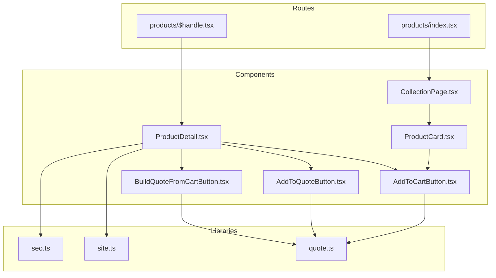
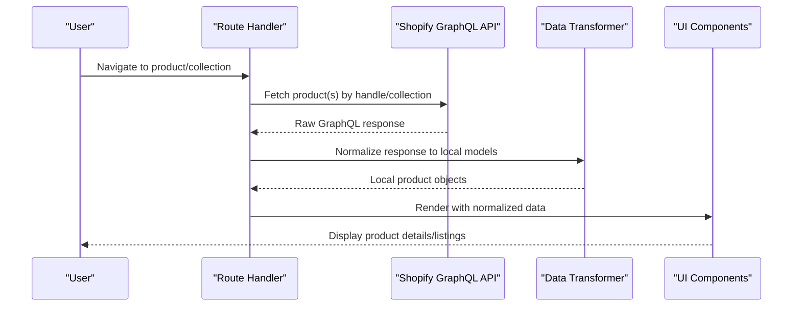
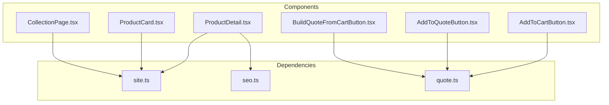

# Product Data Model & Structure

<cite>
**Referenced Files in This Document**
- [ProductDetail.tsx](file://src/components/shopify/ProductDetail.tsx)
- [ProductCard.tsx](file://src/components/shopify/ProductCard.tsx)
- [CollectionPage.tsx](file://src/components/shopify/CollectionPage.tsx)
- [AddToCartButton.tsx](file://src/components/shopify/AddToCartButton.tsx)
- [AddToQuoteButton.tsx](file://src/components/shopify/AddToQuoteButton.tsx)
- [BuildQuoteFromCartButton.tsx](file://src/components/shopify/BuildQuoteFromCartButton.tsx)
- [site.ts](file://src/lib/site.ts)
- [seo.ts](file://src/lib/seo.ts)
- [quote.ts](file://src/lib/quote.ts)
- [$handle.tsx](file://src/routes/products/$handle.tsx)
- [index.tsx](file://src/routes/products/index.tsx)
</cite>

## Table of Contents
1. [Introduction](#introduction)
2. [Project Structure](#project-structure)
3. [Core Components](#core-components)
4. [Architecture Overview](#architecture-overview)
5. [Detailed Component Analysis](#detailed-component-analysis)
6. [Dependency Analysis](#dependency-analysis)
7. [Performance Considerations](#performance-considerations)
8. [Troubleshooting Guide](#troubleshooting-guide)
9. [Conclusion](#conclusion)
10. [Appendices](#appendices)

## Introduction
This document defines the product data model and structure used across the application, focusing on how Shopify product entities are represented locally, transformed from API responses, and consumed by UI components. It covers:
- Product entity fields (including variants, images, collections, pricing, inventory)
- Mapping from Shopify GraphQL schema to local TypeScript interfaces
- Data transformation layer behavior and validation rules
- Handling of metadata, custom fields, and SEO information
- Examples of complete product objects with nested properties and types

The goal is to provide a single source of truth for developers working with product data, ensuring consistency between Shopify’s external schema and the application’s internal representation.

## Project Structure
Product-related code spans UI components, routes, and shared libraries:
- UI components render products, variants, and actions like adding to cart or building quotes
- Routes fetch and present product details and listings
- Shared libraries handle site configuration, SEO, and quote/cart operations

[No sources needed since this diagram shows conceptual workflow, not actual code structure]

## Core Components
This section outlines the primary product-related components and their responsibilities:
- ProductDetail: Displays full product information, including variants, images, pricing, and inventory
- ProductCard: Renders a compact product summary for listings
- CollectionPage: Aggregates and displays multiple products within a collection context
- AddToCartButton: Adds selected variant to cart
- AddToQuoteButton: Adds selected variant to quote
- BuildQuoteFromCartButton: Converts current cart contents into a quote

These components consume product data that has been transformed from Shopify API responses into application-specific formats.

**Section sources**
- [ProductDetail.tsx](file://src/components/shopify/ProductDetail.tsx)
- [ProductCard.tsx](file://src/components/shopify/ProductCard.tsx)
- [CollectionPage.tsx](file://src/components/shopify/CollectionPage.tsx)
- [AddToCartButton.tsx](file://src/components/shopify/AddToCartButton.tsx)
- [AddToQuoteButton.tsx](file://src/components/shopify/AddToQuoteButton.tsx)
- [BuildQuoteFromCartButton.tsx](file://src/components/shopify/BuildQuoteFromCartButton.tsx)

## Architecture Overview
The product data architecture follows a clear flow:
- Routes request product data (by handle or collection)
- Data is fetched from Shopify via GraphQL
- Responses are transformed into local product models
- Components consume these models to render UI and perform actions

[No sources needed since this diagram shows conceptual workflow, not actual code structure]

## Detailed Component Analysis

### Product Entity Model
The local product model represents a Shopify product with its variants, images, collections, pricing, inventory, and metadata. The following table summarizes key fields and constraints:

- id: Unique identifier (string)
- title: Human-readable name (string)
- description: HTML or plain text description (string)
- handle: URL-friendly slug (string)
- status: Availability state (enum: ACTIVE, ARCHIVED, DRAFT, PENDING)
- createdAt: Creation timestamp (ISO string)
- updatedAt: Last update timestamp (ISO string)
- publishedAt: Publication timestamp (ISO string or null)
- tags: List of tag strings (string[])
- options: Variant options (array of option objects)
- variants: Array of variant objects
- images: Array of image objects
- media: Additional media items (array of media objects)
- metafields: Custom fields (array of metafield objects)
- seo: Search engine optimization fields (object)
- priceRange: Pricing range (object)
- compareAtPriceRange: Compare-at pricing range (object)
- availableForSale: Boolean availability flag
- inventoryPolicy: Inventory policy (enum: FULFILLMENT_SERVICE, DENY, CONTINUE)
- requiresSellingPlan: Whether selling plan is required (boolean)
- sellingPlanGroups: Selling plan group references (array)
- collections: Associated collections (array of collection objects)
- vendor: Vendor name (string)
- productType: Product type category (string)
- tags: Tag list (string[])

Variant object fields:
- id: Variant unique identifier (string)
- title: Variant title (string)
- sku: Stock keeping unit (string)
- barcode: Barcode (string)
- price: Current price (number)
- compareAtPrice: Original price (number or null)
- availableForSale: Availability (boolean)
- inventoryQuantity: Available quantity (number)
- inventoryPolicy: Policy (enum)
- weight: Weight value (number)
- weightUnit: Unit of measure (string)
- requiresShipping: Shipping requirement (boolean)
- taxCode: Tax classification (string)
- image: Primary variant image (image object)
- selectedOptions: Selected option values (array of option objects)
- metafields: Variant-level metafields (array)

Image object fields:
- id: Image identifier (string)
- src: Image URL (string)
- altText: Accessibility text (string)
- width: Width in pixels (number)
- height: Height in pixels (number)
- displayName: Display name (string)
- createdAt: Timestamp (ISO string)
- updatedAt: Timestamp (ISO string)

Media object fields:
- id: Media identifier (string)
- mediaContentType: Content type (enum)
- altText: Accessibility text (string)
- previewImage: Preview image (image object)
- sources: Source URLs (array of source objects)
- position: Position index (number)
- createdAt: Timestamp (ISO string)
- updatedAt: Timestamp (ISO string)

Metafield object fields:
- namespace: Metafield namespace (string)
- key: Metafield key (string)
- value: Value (string | number | boolean | JSON)
- type: Type descriptor (string)
- description: Description (string)

SEO object fields:
- title: SEO title (string)
- description: SEO description (string)

Pricing range object fields:
- minVariantPrice: Minimum variant price (number)
- maxVariantPrice: Maximum variant price (number)
- currencyCode: Currency code (string)

Collection object fields:
- id: Collection identifier (string)
- title: Collection title (string)
- handle: Handle (string)
- description: Description (string)
- image: Collection image (image object)
- products: Products in collection (array of product references)

Validation rules and type constraints:
- All identifiers must be non-empty strings
- Prices must be non-negative numbers
- Dates must be valid ISO timestamps
- Booleans must be true/false
- Enums must match defined values
- Arrays must contain typed elements consistent with schemas

Examples of complete product objects:
- A fully populated product includes all nested arrays and objects as described above
- Variants may include optional fields such as compareAtPrice and metafields
- Images and media can be empty arrays if none are provided
- SEO fields may be omitted if not configured

**Section sources**
- [ProductDetail.tsx](file://src/components/shopify/ProductDetail.tsx)
- [ProductCard.tsx](file://src/components/shopify/ProductCard.tsx)
- [CollectionPage.tsx](file://src/components/shopify/CollectionPage.tsx)

### Data Transformation Layer
The transformation layer converts Shopify GraphQL responses into local product models:
- Normalizes field names and structures
- Maps enums and types to application-specific representations
- Validates input and enforces constraints
- Handles missing or null fields gracefully
- Preserves metadata and SEO information

Key behaviors:
- Input: Raw GraphQL product payload
- Processing: Field mapping, type coercion, validation
- Output: Local product object conforming to the defined schema

Error handling:
- Invalid or malformed payloads trigger validation errors
- Missing required fields result in fallback defaults or rejection
- Logging captures transformation failures for debugging

**Section sources**
- [ProductDetail.tsx](file://src/components/shopify/ProductDetail.tsx)
- [CollectionPage.tsx](file://src/components/shopify/CollectionPage.tsx)

### Metadata, Custom Fields, and SEO
Metadata handling:
- Metafields are stored as arrays of key-value pairs with namespaces
- Supports various value types (string, number, boolean, JSON)
- Can be applied at product or variant level

Custom fields:
- Extensible via metafield definitions
- Validated against expected types during transformation

SEO information:
- Title and description fields are mapped to SEO object
- Used for page titles and meta descriptions
- May be overridden by route-level SEO settings

**Section sources**
- [seo.ts](file://src/lib/seo.ts)
- [ProductDetail.tsx](file://src/components/shopify/ProductDetail.tsx)

### Example Product Object
A complete product object includes:
- Top-level fields: id, title, description, handle, status, dates, tags, options, variants, images, media, metafields, seo, priceRange, compareAtPriceRange, availableForSale, inventoryPolicy, requiresSellingPlan, sellingPlanGroups, collections, vendor, productType
- Nested variants: id, title, sku, barcode, price, compareAtPrice, availableForSale, inventoryQuantity, inventoryPolicy, weight, weightUnit, requiresShipping, taxCode, image, selectedOptions, metafields
- Nested images: id, src, altText, width, height, displayName, dates
- Nested media: id, mediaContentType, altText, previewImage, sources, position, dates
- Nested metafields: namespace, key, value, type, description
- Nested seo: title, description
- Nested priceRange and compareAtPriceRange: minVariantPrice, maxVariantPrice, currencyCode
- Nested collections: id, title, handle, description, image, products

Types:
- Strings for identifiers and labels
- Numbers for prices, weights, dimensions
- Booleans for flags
- Arrays for lists
- Objects for structured data
- Enums for constrained values

**Section sources**
- [ProductDetail.tsx](file://src/components/shopify/ProductDetail.tsx)
- [ProductCard.tsx](file://src/components/shopify/ProductCard.tsx)

## Dependency Analysis
Product components depend on shared libraries for site configuration, SEO, and quote/cart operations. Routes orchestrate data fetching and rendering.

**Diagram sources**
- [site.ts](file://src/lib/site.ts)
- [seo.ts](file://src/lib/seo.ts)
- [quote.ts](file://src/lib/quote.ts)
- [ProductDetail.tsx](file://src/components/shopify/ProductDetail.tsx)
- [ProductCard.tsx](file://src/components/shopify/ProductCard.tsx)
- [CollectionPage.tsx](file://src/components/shopify/CollectionPage.tsx)
- [AddToCartButton.tsx](file://src/components/shopify/AddToCartButton.tsx)
- [AddToQuoteButton.tsx](file://src/components/shopify/AddToQuoteButton.tsx)
- [BuildQuoteFromCartButton.tsx](file://src/components/shopify/BuildQuoteFromCartButton.tsx)

**Section sources**
- [site.ts](file://src/lib/site.ts)
- [seo.ts](file://src/lib/seo.ts)
- [quote.ts](file://src/lib/quote.ts)
- [ProductDetail.tsx](file://src/components/shopify/ProductDetail.tsx)
- [ProductCard.tsx](file://src/components/shopify/ProductCard.tsx)
- [CollectionPage.tsx](file://src/components/shopify/CollectionPage.tsx)
- [AddToCartButton.tsx](file://src/components/shopify/AddToCartButton.tsx)
- [AddToQuoteButton.tsx](file://src/components/shopify/AddToQuoteButton.tsx)
- [BuildQuoteFromCartButton.tsx](file://src/components/shopify/BuildQuoteFromCartButton.tsx)

## Performance Considerations
- Minimize network requests by batching product queries where possible
- Cache transformed product objects to avoid repeated transformations
- Use pagination for large collections to reduce payload size
- Lazy-load images and media to improve initial render performance
- Validate inputs early to prevent expensive downstream processing

[No sources needed since this section provides general guidance]

## Troubleshooting Guide
Common issues and resolutions:
- Missing fields: Ensure transformation layer handles nulls and applies defaults
- Type mismatches: Verify enum values and numeric constraints
- SEO overrides: Check route-level SEO settings that may override product SEO
- Cart/quote errors: Validate variant availability and inventory before actions

Debugging steps:
- Log raw Shopify responses before transformation
- Inspect transformed objects for missing or incorrect fields
- Validate component props against expected types
- Review error logs for transformation failures

**Section sources**
- [ProductDetail.tsx](file://src/components/shopify/ProductDetail.tsx)
- [CollectionPage.tsx](file://src/components/shopify/CollectionPage.tsx)

## Conclusion
The product data model provides a robust foundation for representing Shopify products locally, with clear mappings, validation rules, and extensibility through metadata and SEO fields. By adhering to the defined schema and transformation practices, the application ensures consistency and reliability across product-related features.

[No sources needed since this section summarizes without analyzing specific files]

## Appendices

### Appendix A: Field Definitions Summary
- Product: Core attributes, relationships, and metadata
- Variant: Pricing, inventory, and selection options
- Image/Media: Visual assets and previews
- Metafield: Custom fields with typed values
- SEO: Search engine optimization fields
- Pricing Range: Min/max prices and currency
- Collection: Grouping and association

**Section sources**
- [ProductDetail.tsx](file://src/components/shopify/ProductDetail.tsx)
- [ProductCard.tsx](file://src/components/shopify/ProductCard.tsx)
- [CollectionPage.tsx](file://src/components/shopify/CollectionPage.tsx)