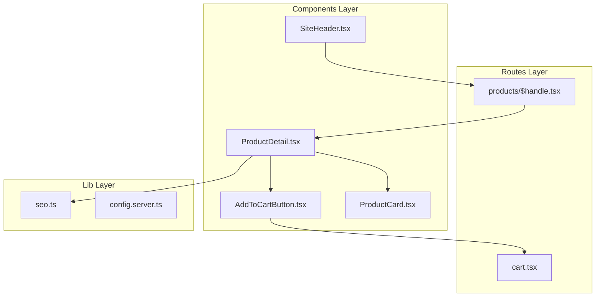
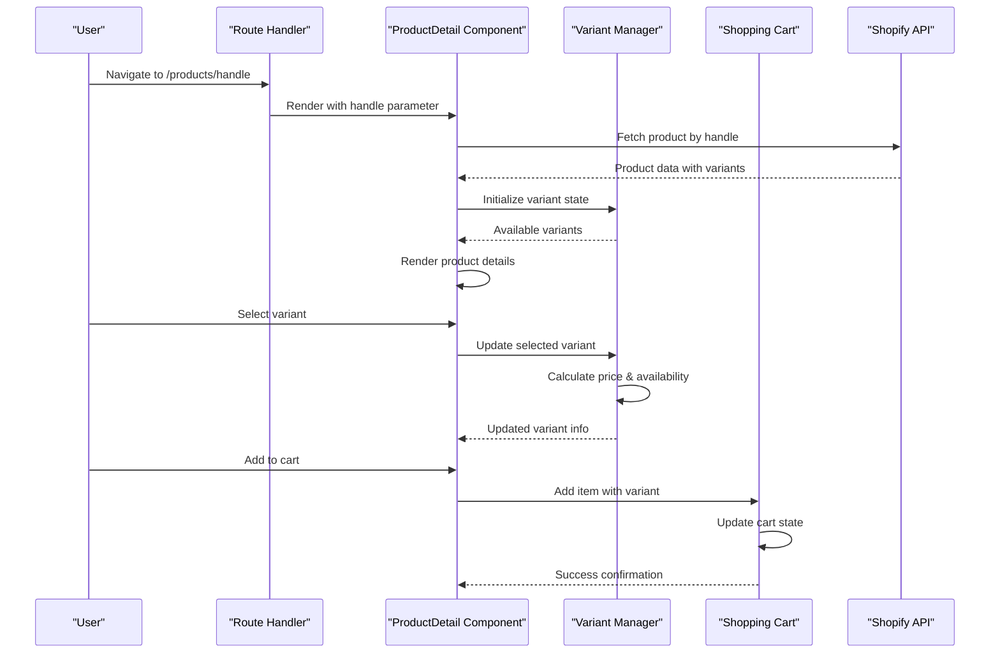
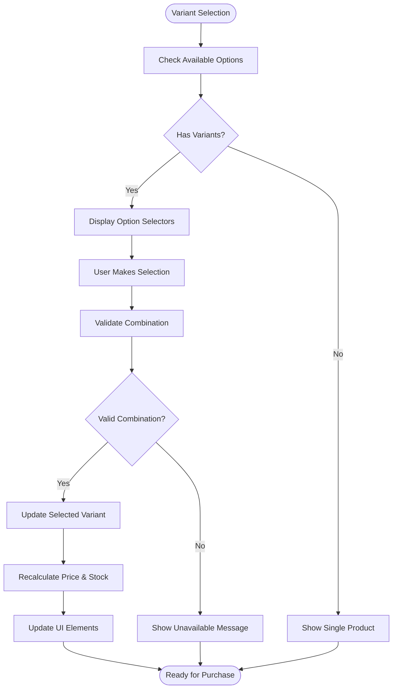
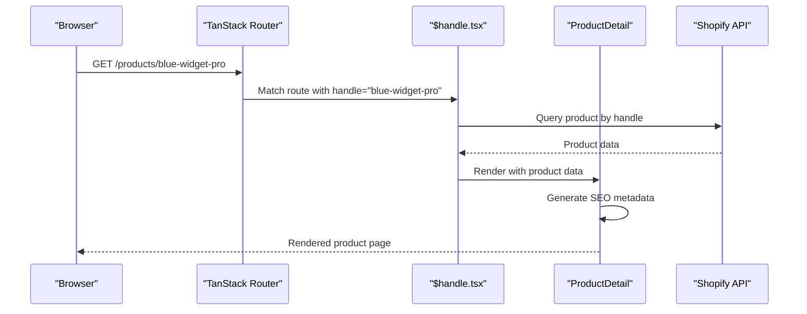
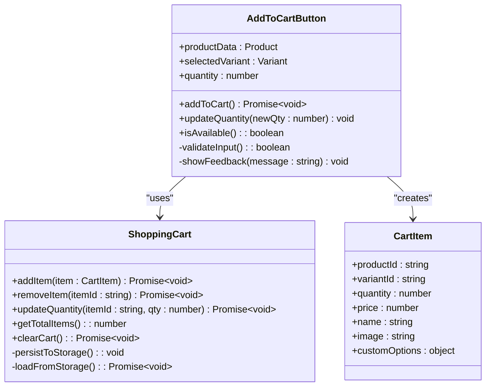
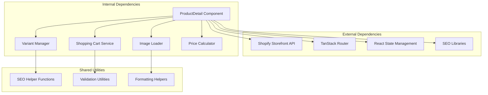

# Product Detail & Variant Management

<cite>
**Referenced Files in This Document**
- [ProductDetail.tsx](file://src/components/shopify/ProductDetail.tsx)
- [$handle.tsx](file://src/routes/products/$handle.tsx)
- [AddToCartButton.tsx](file://src/components/shopify/AddToCartButton.tsx)
- [seo.ts](file://src/lib/seo.ts)
- [cart.tsx](file://src/routes/cart.tsx)
- [ProductCard.tsx](file://src/components/shopify/ProductCard.tsx)
- [SiteHeader.tsx](file://src/components/shopify/SiteHeader.tsx)
</cite>

## Table of Contents
1. [Introduction](#introduction)
2. [Project Structure](#project-structure)
3. [Core Components](#core-components)
4. [Architecture Overview](#architecture-overview)
5. [Detailed Component Analysis](#detailed-component-analysis)
6. [Dependency Analysis](#dependency-analysis)
7. [Performance Considerations](#performance-considerations)
8. [Troubleshooting Guide](#troubleshooting-guide)
9. [Conclusion](#conclusion)

## Introduction

This document provides comprehensive documentation for implementing product detail pages and variant management systems in a Shopify-based e-commerce application. The system focuses on creating dynamic product pages with advanced variant handling, real-time pricing updates, inventory management, and seamless shopping cart integration. The implementation leverages modern React patterns, TypeScript for type safety, and follows best practices for SEO optimization and user experience.

The product detail system supports complex scenarios including multiple product variants, custom options, dynamic inventory checking, and sophisticated add-to-cart functionality. It integrates with Shopify's API to provide real-time product data while maintaining optimal performance through efficient state management and caching strategies.

## Project Structure

The product detail system is organized following a feature-based architecture pattern, with clear separation between UI components, business logic, and data management:

**Diagram sources**
- [products/$handle.tsx](file://src/routes/products/$handle.tsx)
- [ProductDetail.tsx](file://src/components/shopify/ProductDetail.tsx)
- [AddToCartButton.tsx](file://src/components/shopify/AddToCartButton.tsx)
- [seo.ts](file://src/lib/seo.ts)

**Section sources**
- [ProductDetail.tsx](file://src/components/shopify/ProductDetail.tsx)
- [$handle.tsx](file://src/routes/products/$handle.tsx)
- [AddToCartButton.tsx](file://src/components/shopify/AddToCartButton.tsx)
- [seo.ts](file://src/lib/seo.ts)

## Core Components

### ProductDetail Component Architecture

The ProductDetail component serves as the main container for displaying product information, managing variant selection, and coordinating interactions with other system components. It implements a comprehensive state management system that handles product data, selected variants, image galleries, and user interactions.

Key responsibilities include:
- Product data fetching and caching
- Variant selection and validation
- Dynamic pricing calculations
- Image gallery management
- Inventory status display
- Add-to-cart coordination
- SEO metadata generation

### Variant Management System

The variant management system provides sophisticated handling of product variants with support for:
- Multiple option types (size, color, material, etc.)
- Real-time availability checking
- Price variations per variant
- Image associations with variants
- Stock level monitoring
- Custom option combinations

### Shopping Cart Integration

The add-to-cart functionality integrates seamlessly with the shopping cart system, providing:
- Real-time cart updates
- Quantity management
- Error handling for unavailable items
- User feedback mechanisms
- Cart persistence across sessions

**Section sources**
- [ProductDetail.tsx](file://src/components/shopify/ProductDetail.tsx)
- [AddToCartButton.tsx](file://src/components/shopify/AddToCartButton.tsx)

## Architecture Overview

The product detail system follows a layered architecture pattern with clear separation of concerns:

**Diagram sources**
- [$handle.tsx](file://src/routes/products/$handle.tsx)
- [ProductDetail.tsx](file://src/components/shopify/ProductDetail.tsx)
- [AddToCartButton.tsx](file://src/components/shopify/AddToCartButton.tsx)

## Detailed Component Analysis

### ProductDetail Component Implementation

The ProductDetail component implements a comprehensive product display system with advanced variant management capabilities.

#### State Management Architecture

The component maintains several key state variables:
- Product data and metadata
- Selected variant configuration
- Image gallery state
- Loading and error states
- User interaction flags

#### Image Gallery System

The image gallery supports multiple images per product with variant-specific image associations. It includes:
- Thumbnail navigation
- Main image display with zoom capability
- Loading states for large images
- Accessibility features for screen readers
- Keyboard navigation support

#### Description Rendering Engine

Product descriptions are rendered with support for:
- Rich text formatting
- HTML content sanitization
- Responsive layout adaptation
- Media embedding (images, videos)
- SEO-friendly markup generation

#### Variant Selection Logic

The variant selection system handles complex scenarios:
- Multi-option combinations
- Availability filtering
- Price calculation per variant
- Image switching based on variant
- URL synchronization for shared links

**Diagram sources**
- [ProductDetail.tsx](file://src/components/shopify/ProductDetail.tsx)

#### Dynamic Pricing Updates

The pricing system provides real-time price updates based on:
- Variant selection changes
- Promotional pricing rules
- Currency conversion
- Tax calculations
- Discount applications

#### Inventory Checking System

Inventory management includes:
- Real-time stock level checking
- Low stock warnings
- Out-of-stock handling
- Backorder support
- Warehouse-specific availability

**Section sources**
- [ProductDetail.tsx](file://src/components/shopify/ProductDetail.tsx)

### URL Routing with Product Handles

The routing system uses dynamic route parameters to handle product URLs efficiently:

**Diagram sources**
- [$handle.tsx](file://src/routes/products/$handle.tsx)
- [ProductDetail.tsx](file://src/components/shopify/ProductDetail.tsx)

### SEO Optimization Implementation

The SEO system ensures product pages are optimized for search engines:
- Dynamic meta tag generation
- Open Graph protocol support
- Schema.org structured data
- Canonical URL management
- Sitemap integration
- Social media sharing optimization

**Section sources**
- [$handle.tsx](file://src/routes/products/$handle.tsx)
- [seo.ts](file://src/lib/seo.ts)

### Add-to-Cart Functionality

The add-to-cart system provides seamless shopping cart integration:

**Diagram sources**
- [AddToCartButton.tsx](file://src/components/shopify/AddToCartButton.tsx)

**Section sources**
- [AddToCartButton.tsx](file://src/components/shopify/AddToCartButton.tsx)
- [cart.tsx](file://src/routes/cart.tsx)

## Dependency Analysis

The product detail system has well-defined dependencies and clear separation of concerns:

**Diagram sources**
- [ProductDetail.tsx](file://src/components/shopify/ProductDetail.tsx)
- [seo.ts](file://src/lib/seo.ts)

### Component Coupling Analysis

The system demonstrates low coupling between components through:
- Interface-based communication
- Event-driven architecture
- Clear prop interfaces
- Context-based state sharing
- Hook-based logic extraction

### External Integration Points

Key external integrations include:
- Shopify Storefront API for product data
- Analytics services for tracking
- Payment processing systems
- Inventory management systems
- Shipping calculators

**Section sources**
- [ProductDetail.tsx](file://src/components/shopify/ProductDetail.tsx)
- [seo.ts](file://src/lib/seo.ts)

## Performance Considerations

### Image Optimization Strategies

The system implements several image optimization techniques:
- Lazy loading for below-the-fold images
- Responsive image formats (WebP, AVIF)
- Image compression and CDN delivery
- Progressive image loading
- Cache busting for updated images

### State Management Efficiency

Efficient state management includes:
- Memoized computations for expensive operations
- Selective re-rendering with React.memo
- Optimistic UI updates
- Background data refetching
- Debounced user input handling

### Network Request Optimization

Network efficiency is achieved through:
- Request deduplication
- Stale-while-revalidate caching
- Conditional requests with ETags
- Batched API calls
- Connection pooling

### Memory Management

Memory optimization strategies:
- Cleanup of event listeners
- Disposal of subscriptions
- Removal of large objects from memory
- Efficient array operations
- Proper cleanup in useEffect hooks

## Troubleshooting Guide

### Common Issues and Solutions

#### Product Data Loading Failures
- Verify Shopify API credentials
- Check network connectivity
- Implement retry logic with exponential backoff
- Provide fallback content for failed loads

#### Variant Selection Problems
- Validate variant combination existence
- Handle missing variant data gracefully
- Ensure proper error boundaries
- Log variant resolution failures

#### Add-to-Cart Errors
- Check inventory availability before adding
- Handle concurrent cart modifications
- Implement optimistic updates with rollback
- Provide clear error messages to users

#### Performance Issues
- Monitor bundle size growth
- Track component render times
- Identify memory leaks
- Optimize image loading strategies

### Debugging Tools and Techniques

The system includes comprehensive debugging capabilities:
- Development mode logging
- Performance profiling hooks
- Error boundary implementations
- User action tracking
- Network request inspection

**Section sources**
- [ProductDetail.tsx](file://src/components/shopify/ProductDetail.tsx)
- [AddToCartButton.tsx](file://src/components/shopify/AddToCartButton.tsx)

## Conclusion

The product detail and variant management system provides a robust foundation for e-commerce product pages with advanced functionality. The implementation demonstrates best practices in React development, including proper state management, error handling, performance optimization, and accessibility considerations.

Key strengths of the system include:
- Comprehensive variant handling for complex products
- Real-time pricing and inventory updates
- Seamless shopping cart integration
- SEO-optimized product pages
- Responsive and accessible user interface
- Scalable architecture supporting future enhancements

The modular design allows for easy extension and customization while maintaining code quality and performance standards. The system is well-suited for production deployment and can handle high traffic volumes with proper infrastructure scaling.

Future enhancement opportunities include:
- Advanced recommendation engine integration
- Enhanced mobile experience optimizations
- A/B testing framework integration
- Advanced analytics and reporting
- Multi-language and currency support expansion