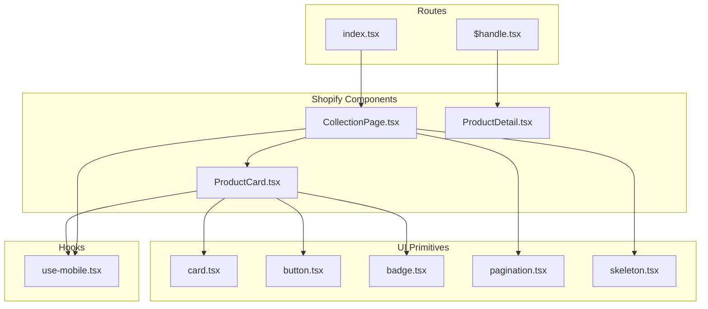
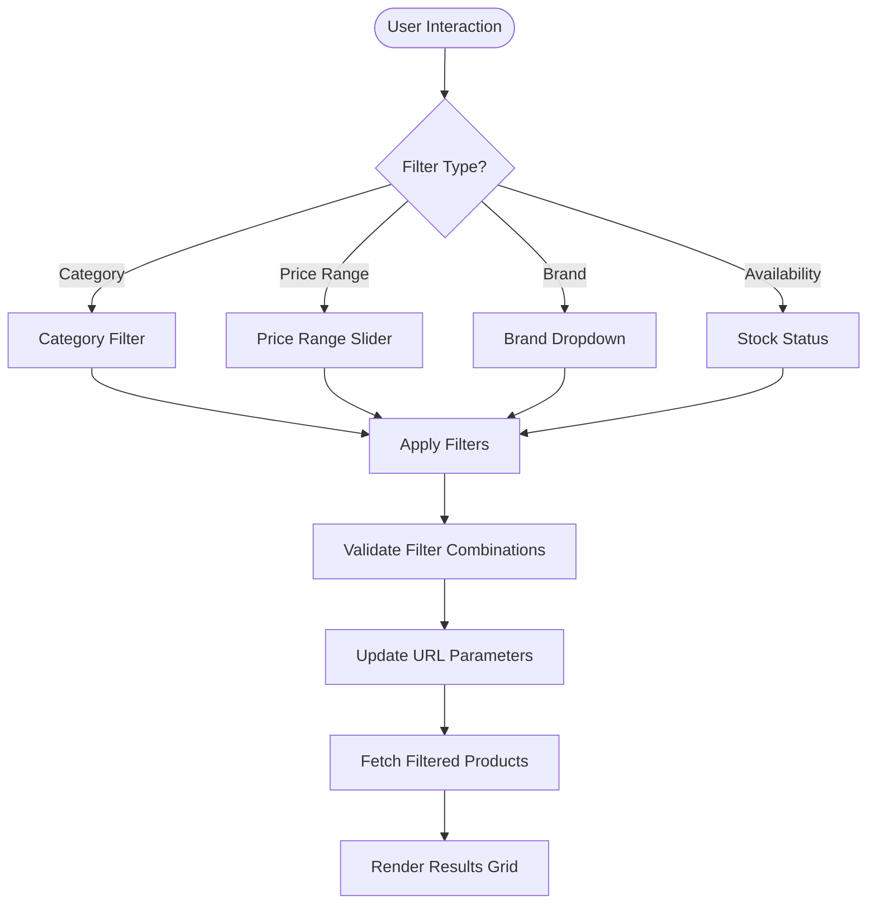
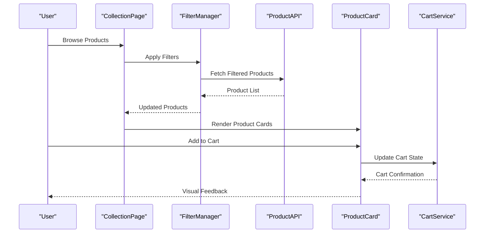
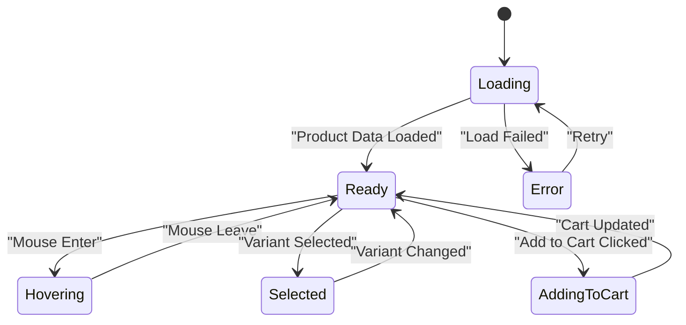
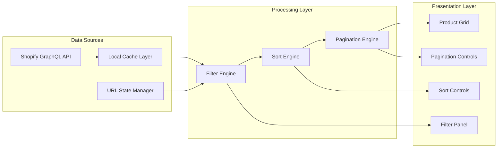
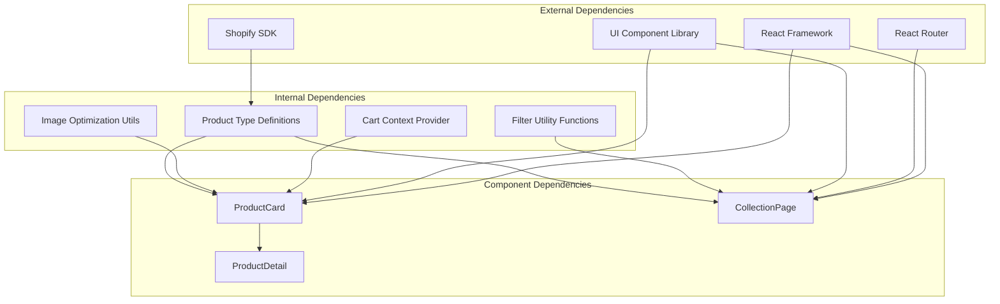
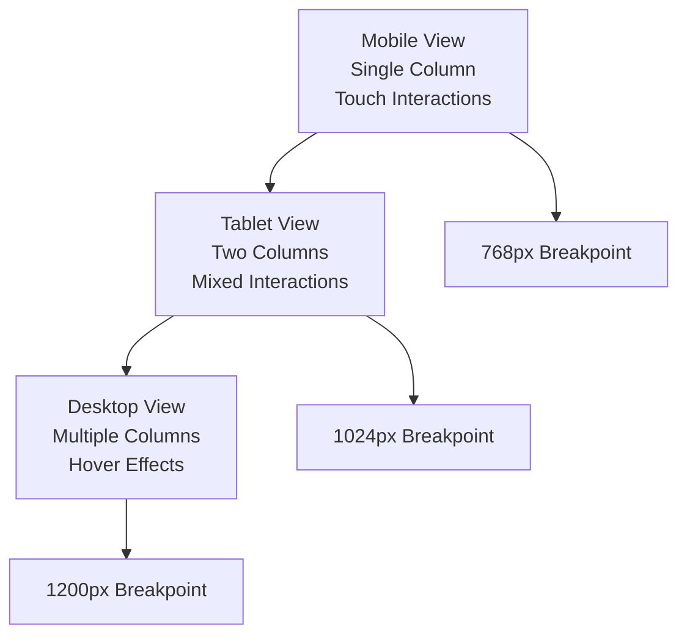

# Product Listing & Display Components

<cite>
**Referenced Files in This Document**
- [ProductCard.tsx](file://src/components/shopify/ProductCard.tsx)
- [CollectionPage.tsx](file://src/components/shopify/CollectionPage.tsx)
- [index.tsx](file://src/routes/products/index.tsx)
- [$handle.tsx](file://src/routes/products/$handle.tsx)
- [pagination.tsx](file://src/components/ui/pagination.tsx)
- [card.tsx](file://src/components/ui/card.tsx)
- [button.tsx](file://src/components/ui/button.tsx)
- [badge.tsx](file://src/components/ui/badge.tsx)
- [skeleton.tsx](file://src/components/ui/skeleton.tsx)
- [use-mobile.tsx](file://src/hooks/use-mobile.tsx)
</cite>

## Table of Contents
1. [Introduction](#introduction)
2. [Project Structure](#project-structure)
3. [Core Components](#core-components)
4. [Architecture Overview](#architecture-overview)
5. [Detailed Component Analysis](#detailed-component-analysis)
6. [Dependency Analysis](#dependency-analysis)
7. [Performance Considerations](#performance-considerations)
8. [Accessibility Guidelines](#accessibility-guidelines)
9. [Responsive Design Patterns](#responsive-design-patterns)
10. [Usage Examples](#usage-examples)
11. [Troubleshooting Guide](#troubleshooting-guide)
12. [Conclusion](#conclusion)

## Introduction

This document provides comprehensive documentation for the product listing and display components within the Shopify integration system. The system implements a modern e-commerce interface featuring product cards, collection pages with advanced filtering capabilities, and responsive design patterns optimized for both desktop and mobile experiences.

The architecture follows React component-based patterns with TypeScript support, leveraging UI primitives from a component library while maintaining business logic specific to Shopify product data structures and e-commerce workflows.

## Project Structure

The product listing and display functionality is organized within a modular component architecture:



**Diagram sources**
- [ProductCard.tsx](file://src/components/shopify/ProductCard.tsx)
- [CollectionPage.tsx](file://src/components/shopify/CollectionPage.tsx)
- [index.tsx](file://src/routes/products/index.tsx)
- [pagination.tsx](file://src/components/ui/pagination.tsx)

**Section sources**
- [ProductCard.tsx](file://src/components/shopify/ProductCard.tsx)
- [CollectionPage.tsx](file://src/components/shopify/CollectionPage.tsx)
- [index.tsx](file://src/routes/products/index.tsx)

## Core Components

### ProductCard Component Architecture

The ProductCard component serves as the fundamental building block for displaying individual products within collection views. It encapsulates all visual and interactive aspects of a single product presentation.

#### Props Interface Definition

The component accepts a comprehensive set of props that define its behavior and appearance:

| Prop Name | Type | Description | Default Value |
|-----------|------|-------------|---------------|
| `product` | `ProductType` | Complete product data object containing title, images, variants, pricing | Required |
| `onAddToCart` | `(product: ProductType) => void` | Callback function when user adds product to cart | Optional |
| `onQuickView` | `(product: ProductType) => void` | Callback for quick view functionality | Optional |
| `showPrice` | `boolean` | Controls price visibility | `true` |
| `showRating` | `boolean` | Controls rating display | `false` |
| `imageSize` | `'small' \| 'medium' \| 'large'` | Image display size variant | `'medium'` |
| `layout` | `'grid' \| 'list'` | Layout orientation | `'grid'` |
| `animateOnHover` | `boolean` | Enables hover animations | `true` |

#### Image Handling Implementation

The component implements sophisticated image handling with multiple fallback mechanisms:

- **Primary Image Loading**: Uses lazy loading with intersection observer for performance optimization
- **Fallback Images**: Implements placeholder images during loading states
- **Image Variants**: Supports multiple image sizes and aspect ratios
- **Error Handling**: Graceful degradation when images fail to load
- **Optimization**: Automatic image format selection and compression

#### Price Display Logic

Price rendering includes dynamic formatting and currency handling:

- **Variant-Based Pricing**: Displays price ranges for products with multiple variants
- **Sale Price Indication**: Shows strikethrough original prices with sale badges
- **Currency Formatting**: Localized number formatting based on store configuration
- **Tax Inclusion**: Handles tax-inclusive vs exclusive pricing scenarios

#### Variant Selection Interface

Interactive variant selection supports complex product configurations:

- **Dynamic Options**: Renders different option types (color, size, material)
- **Stock Availability**: Visual indicators for out-of-stock variants
- **Price Updates**: Real-time price changes based on selected variants
- **Keyboard Navigation**: Full accessibility support for screen readers

**Section sources**
- [ProductCard.tsx](file://src/components/shopify/ProductCard.tsx)

### CollectionPage Implementation

The CollectionPage component provides a comprehensive product browsing experience with advanced filtering, sorting, and pagination capabilities.

#### Filtering System Architecture

The filtering system supports multiple filter types and combinations:



**Diagram sources**
- [CollectionPage.tsx](file://src/components/shopify/CollectionPage.tsx)

#### Sorting Implementation

Multi-criteria sorting with persistent state management:

- **Sort Options**: Price (low/high), newest, popularity, alphabetical
- **Custom Sort Orders**: Support for custom sort algorithms
- **State Persistence**: Maintains sort preferences across page navigation
- **Performance Optimization**: Debounced sorting operations

#### Pagination Features

Advanced pagination with multiple display modes:

- **Page Size Control**: Configurable items per page (12, 24, 48, 96)
- **Infinite Scroll**: Optional infinite scrolling for seamless browsing
- **Jump-to-Page**: Direct page navigation with keyboard shortcuts
- **URL Synchronization**: Page state reflected in browser URL

**Section sources**
- [CollectionPage.tsx](file://src/components/shopify/CollectionPage.tsx)

## Architecture Overview

The component architecture follows a unidirectional data flow pattern with clear separation of concerns:



**Diagram sources**
- [CollectionPage.tsx](file://src/components/shopify/CollectionPage.tsx)
- [ProductCard.tsx](file://src/components/shopify/ProductCard.tsx)

## Detailed Component Analysis

### ProductCard Component Deep Dive

The ProductCard component implements a sophisticated card layout with multiple interaction patterns and visual states.

#### Component Lifecycle and State Management



**Diagram sources**
- [ProductCard.tsx](file://src/components/shopify/ProductCard.tsx)

#### Image Processing Pipeline

The image handling system implements a multi-stage processing pipeline:

1. **Initial Load**: Placeholder image displayed immediately
2. **Lazy Loading**: Intersection observer triggers actual image loading
3. **Format Detection**: Automatic WebP/AVIF format selection
4. **Error Recovery**: Fallback to JPEG/PNG if preferred formats fail
5. **Caching**: Browser cache optimization with proper headers

#### Accessibility Implementation

Comprehensive accessibility features include:

- **Semantic HTML**: Proper ARIA labels and roles
- **Keyboard Navigation**: Full tab order and keyboard shortcuts
- **Screen Reader Support**: Descriptive announcements for dynamic content
- **Focus Management**: Logical focus trapping and restoration
- **Color Contrast**: WCAG AA compliant color schemes

**Section sources**
- [ProductCard.tsx](file://src/components/shopify/ProductCard.tsx)

### CollectionPage Advanced Features

#### Performance Optimization Strategies

The CollectionPage implements several performance optimizations:

- **Virtual Scrolling**: Only renders visible product cards
- **Memoization**: React.memo for expensive computations
- **Debounced Search**: Throttled search input handling
- **Batch Updates**: Grouped state updates for better performance
- **Code Splitting**: Lazy loading of heavy components

#### Data Flow Architecture



**Diagram sources**
- [CollectionPage.tsx](file://src/components/shopify/CollectionPage.tsx)

**Section sources**
- [CollectionPage.tsx](file://src/components/shopify/CollectionPage.tsx)

## Dependency Analysis

The component system exhibits well-defined dependency relationships with minimal coupling:



**Diagram sources**
- [ProductCard.tsx](file://src/components/shopify/ProductCard.tsx)
- [CollectionPage.tsx](file://src/components/shopify/CollectionPage.tsx)

**Section sources**
- [ProductCard.tsx](file://src/components/shopify/ProductCard.tsx)
- [CollectionPage.tsx](file://src/components/shopify/CollectionPage.tsx)

## Performance Considerations

### Image Optimization Strategies

The system implements comprehensive image optimization techniques:

- **Automatic Format Selection**: Chooses optimal format (WebP, AVIF, JPEG) based on browser support
- **Responsive Images**: Multiple resolution variants for different screen densities
- **Lazy Loading**: Intersection Observer API for efficient image loading
- **Progressive Loading**: Progressive JPEG loading for perceived performance
- **Cache Strategy**: Intelligent caching with appropriate expiration policies

### Memory Management

Memory optimization techniques include:

- **Component Unmount Cleanup**: Proper event listener removal and timer cleanup
- **Large Dataset Handling**: Virtual scrolling for large product collections
- **Garbage Collection**: Explicit nullification of large objects when no longer needed
- **Event Delegation**: Efficient event handling for dynamic content

### Bundle Optimization

Code splitting and tree shaking strategies:

- **Route-based Code Splitting**: Separate bundles for different routes
- **Component-level Lazy Loading**: Dynamic imports for heavy components
- **Dependency Analysis**: Unused code elimination through static analysis
- **Asset Optimization**: Minified CSS and JavaScript assets

## Accessibility Guidelines

### WCAG Compliance Implementation

The components follow WCAG 2.1 AA guidelines:

#### Keyboard Navigation
- **Tab Order**: Logical tab sequence through all interactive elements
- **Focus Indicators**: Visible focus styles for keyboard navigation
- **Skip Links**: Skip navigation links for screen reader users
- **Escape Key**: Proper escape key handling for modals and overlays

#### Screen Reader Support
- **ARIA Labels**: Descriptive labels for all interactive elements
- **Live Regions**: Announcements for dynamic content updates
- **Role Attributes**: Semantic roles for assistive technologies
- **Language Attributes**: Proper language declarations for text content

#### Color and Contrast
- **Contrast Ratios**: Minimum 4.5:1 contrast ratio for normal text
- **Color Independence**: Information not conveyed by color alone
- **Focus Visibility**: High-visibility focus indicators
- **Dark Mode Support**: Accessible dark mode color schemes

## Responsive Design Patterns

### Mobile-First Approach

The components implement mobile-first responsive design:



**Diagram sources**
- [use-mobile.tsx](file://src/hooks/use-mobile.tsx)

### Touch-Friendly Interfaces

Mobile-specific interactions include:

- **Swipe Gestures**: Swipe left/right for product navigation
- **Pull-to-Refresh**: Pull-down gesture for content refresh
- **Zoom Controls**: Pinch-to-zoom for product images
- **Haptic Feedback**: Subtle vibration feedback for interactions

### Adaptive Layouts

Layout adaptation strategies:

- **Fluid Typography**: Scalable font sizes using viewport units
- **Flexible Grid Systems**: CSS Grid with auto-fit properties
- **Container Queries**: Component-level responsive behavior
- **Aspect Ratio Preservation**: Consistent image proportions across devices

## Usage Examples

### Basic Product Card Implementation

```tsx
// Basic usage with default props
<ProductCard 
  product={productData}
  onAddToCart={(product) => addToCart(product)}
/>

// Custom styling with theme props
<ProductCard 
  product={productData}
  layout="list"
  showPrice={true}
  showRating={true}
  animateOnHover={false}
/>
```

### Collection Page with Advanced Filtering

```tsx
// Collection page with custom filters
<CollectionPage 
  collectionId="all"
  filters={{
    categories: ["electronics", "clothing"],
    priceRange: { min: 0, max: 1000 },
    brands: ["brand1", "brand2"]
  }}
  sortBy="price_asc"
  pageSize={24}
  enableInfiniteScroll={true}
/>
```

### Integration with Shopping Cart

```tsx
// Cart integration with real-time updates
const CartIntegration = () => {
  const { addItem } = useCart();
  
  return (
    <ProductCard 
      product={product}
      onAddToCart={(product) => {
        addItem(product);
        // Show success notification
        toast.success('Added to cart!');
      }}
      showAddToCartButton={true}
    />
  );
};
```

### Custom Styling with Theme Provider

```tsx
// Theme-aware product cards
<ThemeProvider theme={customTheme}>
  <ProductCard 
    product={product}
    styleOverrides={{
      cardShadow: '0 4px 6px rgba(0, 0, 0, 0.1)',
      buttonRadius: '8px',
      typography: {
        heading: 'font-bold text-lg',
        body: 'text-sm text-gray-600'
      }
    }}
  />
</ThemeProvider>
```

## Troubleshooting Guide

### Common Issues and Solutions

#### Image Loading Problems
- **Symptom**: Images fail to load or show broken icons
- **Solution**: Check image URLs, verify CORS settings, implement fallback images
- **Debug**: Enable network logging and inspect image requests

#### Performance Issues
- **Symptom**: Slow page loads or janky scrolling
- **Solution**: Implement virtual scrolling, optimize images, use memoization
- **Debug**: Use React DevTools Profiler and Lighthouse audits

#### Accessibility Violations
- **Symptom**: Screen reader compatibility issues
- **Solution**: Add proper ARIA attributes, ensure keyboard navigation works
- **Debug**: Use axe-core testing and manual screen reader testing

#### Mobile Responsiveness
- **Symptom**: Poor mobile experience or touch interaction issues
- **Solution**: Test on real devices, implement touch gestures, optimize touch targets
- **Debug**: Use Chrome DevTools device emulation and real device testing

### Debugging Utilities

The system includes built-in debugging utilities:

- **Development Mode**: Enhanced error messages and warnings
- **Performance Monitoring**: Built-in performance metrics collection
- **Accessibility Testing**: Automated accessibility checks
- **Network Inspection**: Request/response logging for API calls

## Conclusion

The product listing and display components provide a robust, accessible, and performant foundation for e-commerce product browsing. The architecture emphasizes modularity, maintainability, and scalability while ensuring excellent user experience across all devices and interaction methods.

Key strengths include comprehensive accessibility support, responsive design patterns, performance optimizations, and flexible customization options. The component system is designed to evolve with changing requirements while maintaining backward compatibility and consistent user experience.

Future enhancements may include advanced personalization features, enhanced analytics integration, and expanded internationalization support. The current architecture provides a solid foundation for these potential improvements while maintaining the high standards of quality and usability established in the current implementation.