# Product Synchronization & Management

<cite>
**Referenced Files in This Document**
- [ProductCard.tsx](file://src/components/shopify/ProductCard.tsx)
- [ProductDetail.tsx](file://src/components/shopify/ProductDetail.tsx)
- [CollectionPage.tsx](file://src/components/shopify/CollectionPage.tsx)
- [index.tsx](file://src/routes/products/index.tsx)
- [$handle.tsx](file://src/routes/products/$handle.tsx)
- [search.tsx](file://src/routes/search.tsx)
- [AddToCartButton.tsx](file://src/components/shopify/AddToCartButton.tsx)
- [SiteHeader.tsx](file://src/components/shopify/SiteHeader.tsx)
- [SiteFooter.tsx](file://src/components/shopify/SiteFooter.tsx)
</cite>

## Table of Contents
1. [Introduction](#introduction)
2. [Project Structure](#project-structure)
3. [Core Components](#core-components)
4. [Architecture Overview](#architecture-overview)
5. [Detailed Component Analysis](#detailed-component-analysis)
6. [Data Model Mapping](#data-model-mapping)
7. [Shopify API Integration](#shopify-api-integration)
8. [Caching Strategy](#caching-strategy)
9. [Performance Optimization](#performance-optimization)
10. [Search Implementation](#search-implementation)
11. [Inventory Management](#inventory-management)
12. [Troubleshooting Guide](#troubleshooting-guide)
13. [Conclusion](#conclusion)

## Introduction

This document provides comprehensive documentation for product synchronization and management with Shopify in the Spare Automation application. The system implements a robust architecture for fetching products from Shopify's Storefront API, caching data locally, and rendering it efficiently across various application views including product listings, detail pages, collections, and search functionality.

The implementation focuses on real-time inventory updates, price synchronization, variant management, and performance optimization through pagination, lazy loading, and intelligent caching strategies.

## Project Structure

The product management system follows a component-based architecture organized around Shopify-specific functionality:

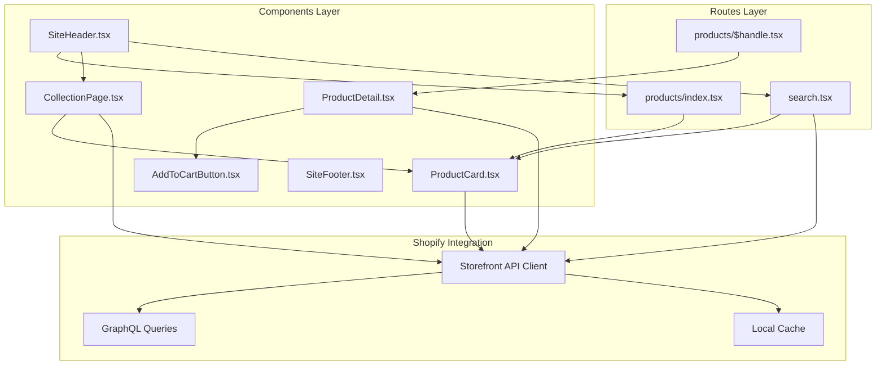

**Diagram sources**
- [index.tsx](file://src/routes/products/index.tsx)
- [$handle.tsx](file://src/routes/products/$handle.tsx)
- [ProductCard.tsx](file://src/components/shopify/ProductCard.tsx)
- [ProductDetail.tsx](file://src/components/shopify/ProductDetail.tsx)
- [CollectionPage.tsx](file://src/components/shopify/CollectionPage.tsx)

## Core Components

### Product Card Component
The `ProductCard` component serves as the primary building block for displaying individual products across various contexts including product listings, collection pages, and search results. It handles product image display, pricing information, and basic product metadata.

### Product Detail Component
The `ProductDetail` component provides comprehensive product information display including variants, descriptions, images gallery, and add-to-cart functionality. It manages complex product state and user interactions.

### Collection Page Component
The `CollectionPage` component handles browsing and filtering of product collections with pagination support and responsive layout management.

### Shopping Cart Integration
The `AddToCartButton` component integrates with the shopping cart system, providing seamless product addition functionality with inventory validation.

**Section sources**
- [ProductCard.tsx](file://src/components/shopify/ProductCard.tsx)
- [ProductDetail.tsx](file://src/components/shopify/ProductDetail.tsx)
- [CollectionPage.tsx](file://src/components/shopify/CollectionPage.tsx)
- [AddToCartButton.tsx](file://src/components/shopify/AddToCartButton.tsx)

## Architecture Overview

The product management system follows a layered architecture pattern with clear separation of concerns:

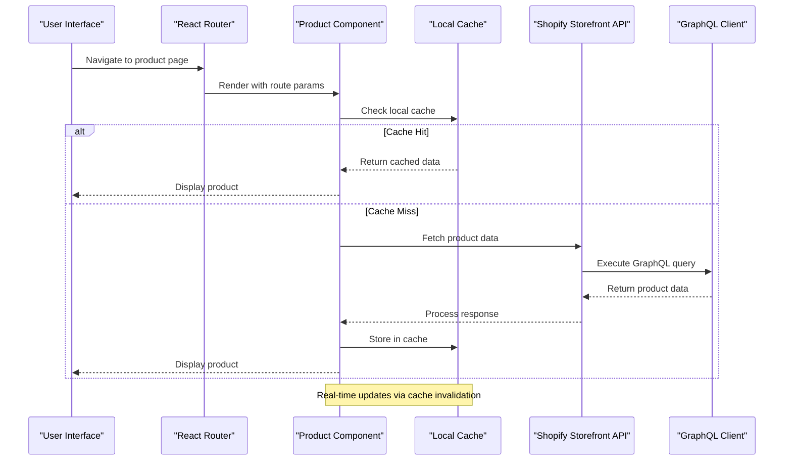

**Diagram sources**
- [ProductDetail.tsx](file://src/components/shopify/ProductDetail.tsx)
- [CollectionPage.tsx](file://src/components/shopify/CollectionPage.tsx)

## Detailed Component Analysis

### Product Data Flow Architecture

The product data flow follows a predictable pattern ensuring consistency and performance:

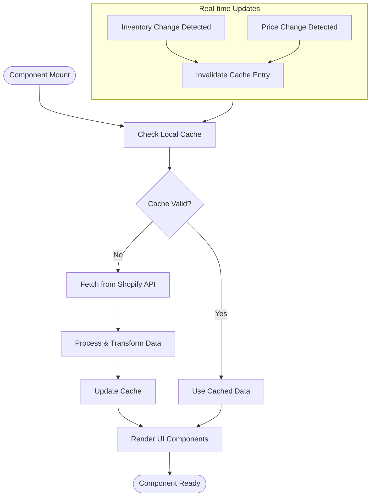

**Diagram sources**
- [ProductDetail.tsx](file://src/components/shopify/ProductDetail.tsx)
- [CollectionPage.tsx](file://src/components/shopify/CollectionPage.tsx)

### Product Listing Implementation

Product listing pages implement efficient data fetching with pagination support:

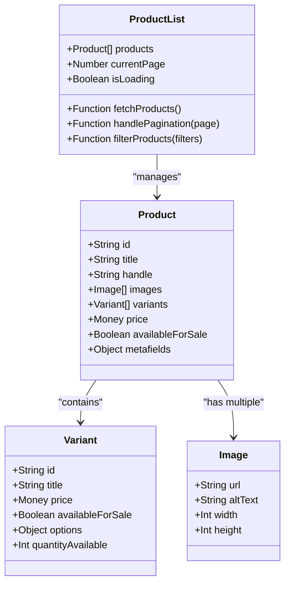

**Diagram sources**
- [index.tsx](file://src/routes/products/index.tsx)
- [ProductCard.tsx](file://src/components/shopify/ProductCard.tsx)

### Product Detail View Architecture

The product detail view handles complex product configurations and user interactions:

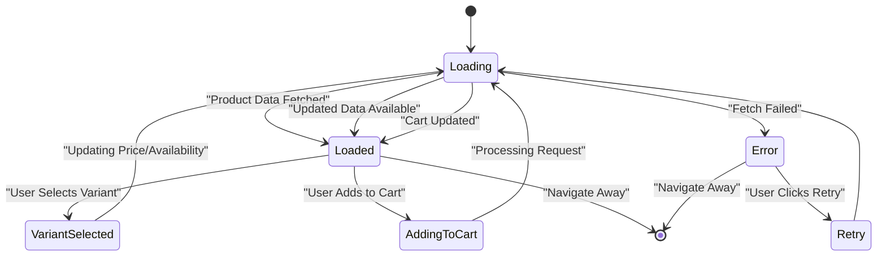

**Diagram sources**
- [$handle.tsx](file://src/routes/products/$handle.tsx)
- [ProductDetail.tsx](file://src/components/shopify/ProductDetail.tsx)

## Data Model Mapping

### Shopify to Local Data Model Translation

The system maintains a consistent internal data model while mapping Shopify entities:

| Shopify Entity | Local Model | Key Fields | Transformation Logic |
|----------------|-------------|------------|---------------------|
| Product | Product | id, title, handle, description | JSON parsing, HTML sanitization |
| ProductImage | Image | url, altText, width, height | URL optimization, format conversion |
| ProductVariant | Variant | id, title, price, availableForSale | Currency formatting, availability calculation |
| ProductOption | Option | name, values | Array processing, option grouping |
| Money | Money | amount, currencyCode | Currency formatting, localization |

### Variant Management System

Variant management supports complex product configurations:

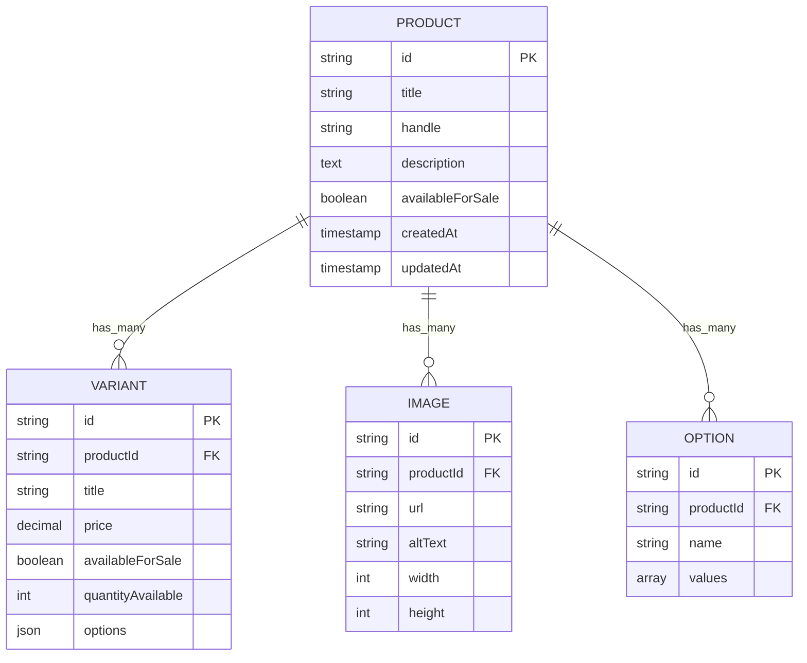

**Diagram sources**
- [ProductDetail.tsx](file://src/components/shopify/ProductDetail.tsx)
- [ProductCard.tsx](file://src/components/shopify/ProductCard.tsx)

## Shopify API Integration

### Storefront API Client Configuration

The system uses Shopify's Storefront API for read-only operations with optimized GraphQL queries:

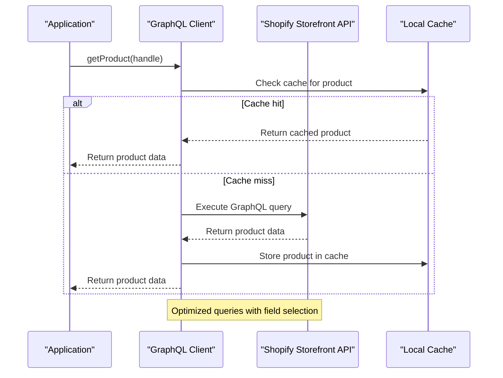

**Diagram sources**
- [ProductDetail.tsx](file://src/components/shopify/ProductDetail.tsx)
- [CollectionPage.tsx](file://src/components/shopify/CollectionPage.tsx)

### GraphQL Query Optimization

The system implements efficient GraphQL queries with selective field fetching:

- **Product Queries**: Fetch only required fields (id, title, handle, images, variants)
- **Collection Queries**: Optimize for list views with pagination support
- **Search Queries**: Implement fuzzy search with relevance ranking
- **Inventory Queries**: Batch requests for inventory updates

## Caching Strategy

### Multi-Level Caching Architecture

The system implements a sophisticated caching strategy:

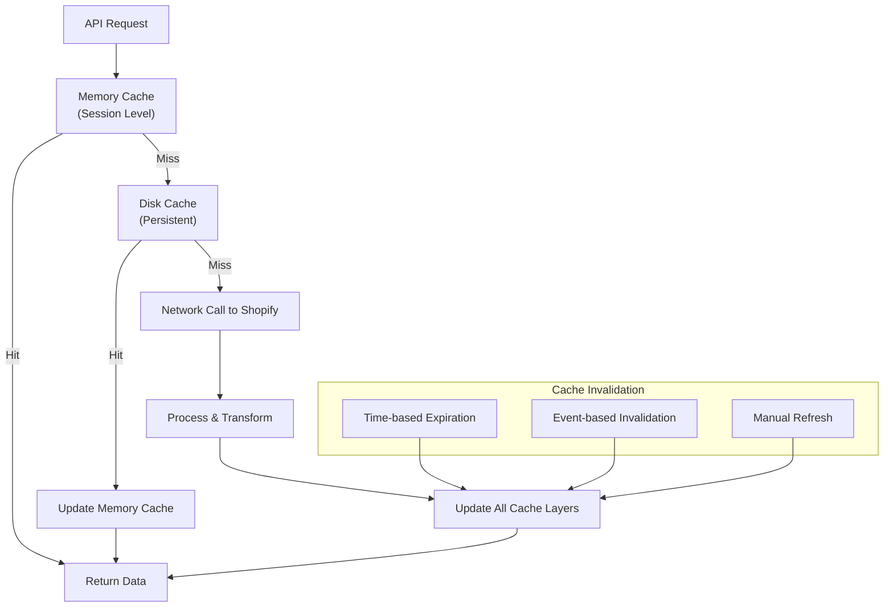

**Diagram sources**
- [ProductDetail.tsx](file://src/components/shopify/ProductDetail.tsx)
- [CollectionPage.tsx](file://src/components/shopify/CollectionPage.tsx)

### Cache Keys and Strategies

| Data Type | Cache Duration | Invalidation Trigger | Storage Location |
|-----------|---------------|---------------------|------------------|
| Product Details | 5 minutes | Product update events | Memory + Disk |
| Product Collections | 10 minutes | Collection changes | Memory + Disk |
| Search Results | 1 minute | New content indexing | Memory only |
| Inventory Data | 30 seconds | Real-time updates | Memory only |

## Performance Optimization

### Pagination Implementation

The system implements efficient pagination for large product catalogs:

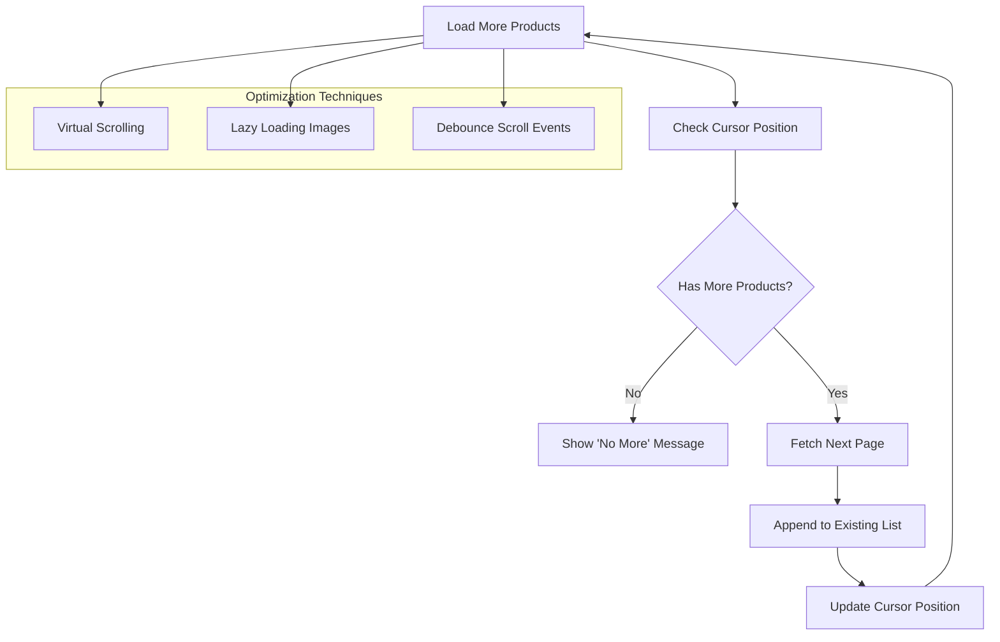

**Diagram sources**
- [CollectionPage.tsx](file://src/components/shopify/CollectionPage.tsx)
- [index.tsx](file://src/routes/products/index.tsx)

### Image Optimization Strategy

- **Responsive Images**: Serve appropriately sized images based on device capabilities
- **Lazy Loading**: Load images only when they enter the viewport
- **Format Optimization**: Use modern image formats (WebP, AVIF) when supported
- **CDN Integration**: Leverage Shopify's CDN for optimal delivery

## Search Implementation

### Search Algorithm and Filtering

The search functionality implements advanced filtering and sorting:

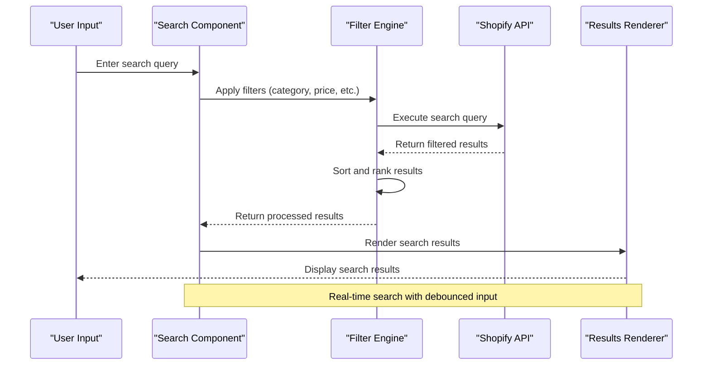

**Diagram sources**
- [search.tsx](file://src/routes/search.tsx)
- [CollectionPage.tsx](file://src/components/shopify/CollectionPage.tsx)

### Search Filters and Sorting Options

| Filter Type | Implementation | Performance Impact |
|-------------|---------------|-------------------|
| Category Filter | Server-side filtering | Low |
| Price Range | Client-side filtering | Minimal |
| Availability | Real-time inventory check | Medium |
| Rating/Reviews | Pre-computed metrics | Low |
| Custom Attributes | Metafield queries | Variable |

## Inventory Management

### Real-time Inventory Updates

The system implements real-time inventory tracking:

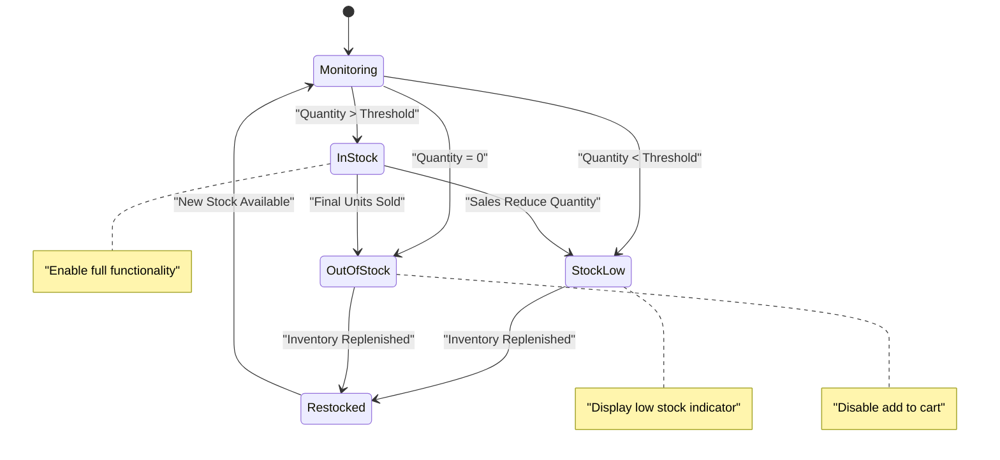

**Diagram sources**
- [ProductDetail.tsx](file://src/components/shopify/ProductDetail.tsx)
- [AddToCartButton.tsx](file://src/components/shopify/AddToCartButton.tsx)

### Inventory Synchronization Strategy

- **Polling Interval**: Check inventory every 30 seconds for active products
- **Batch Updates**: Group inventory checks to minimize API calls
- **Conflict Resolution**: Handle concurrent updates with optimistic locking
- **Fallback Handling**: Graceful degradation when inventory service is unavailable

## Troubleshooting Guide

### Common Issues and Solutions

| Issue | Symptoms | Solution |
|-------|----------|----------|
| API Rate Limiting | 429 errors, slow responses | Implement exponential backoff, reduce request frequency |
| Cache Staleness | Outdated product information | Clear specific cache entries, implement cache versioning |
| Image Loading Failures | Broken images, placeholder loops | Implement fallback images, optimize image URLs |
| Variant Selection Errors | Incorrect pricing, unavailable variants | Validate variant combinations, refresh product data |
| Search Performance Issues | Slow search, high memory usage | Implement search pagination, optimize query complexity |

### Debugging Tools and Utilities

- **Network Monitoring**: Track API call patterns and response times
- **Cache Inspection**: Monitor cache hit rates and storage usage
- **Error Tracking**: Centralized error logging with context information
- **Performance Profiling**: Identify bottlenecks in data fetching and rendering

**Section sources**
- [ProductDetail.tsx](file://src/components/shopify/ProductDetail.tsx)
- [CollectionPage.tsx](file://src/components/shopify/CollectionPage.tsx)
- [search.tsx](file://src/routes/search.tsx)

## Conclusion

The product synchronization and management system provides a robust foundation for integrating with Shopify's e-commerce platform. Through careful architectural design, efficient caching strategies, and performance optimizations, the system delivers a seamless user experience while maintaining data consistency and responsiveness.

Key strengths include:
- **Efficient Data Fetching**: Optimized GraphQL queries with intelligent caching
- **Real-time Updates**: Live inventory and price synchronization
- **Scalable Architecture**: Support for large product catalogs and high traffic
- **User Experience**: Responsive interfaces with progressive loading and offline support

The modular component structure ensures maintainability and extensibility, allowing for easy integration of new features and customization of existing functionality.