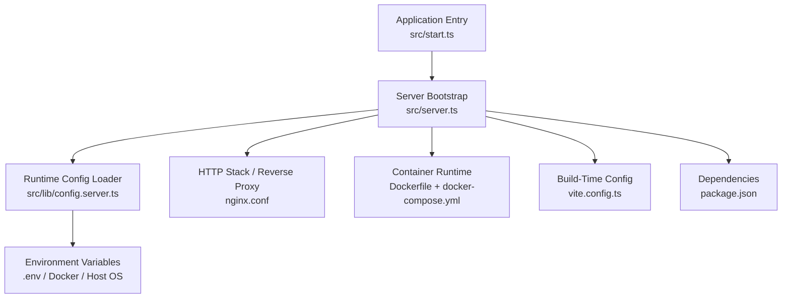
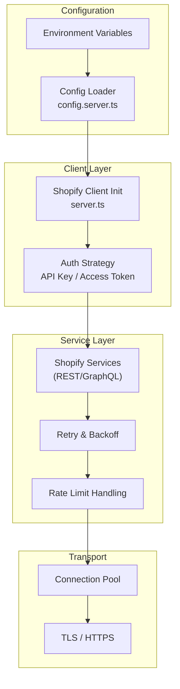
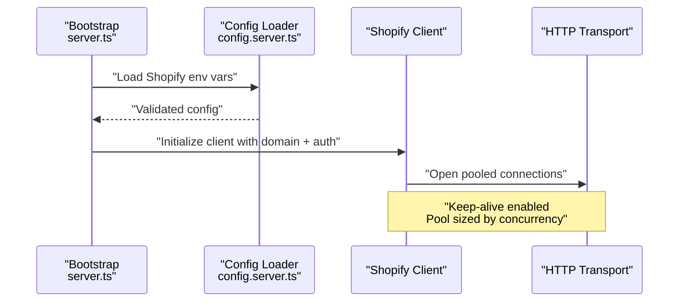
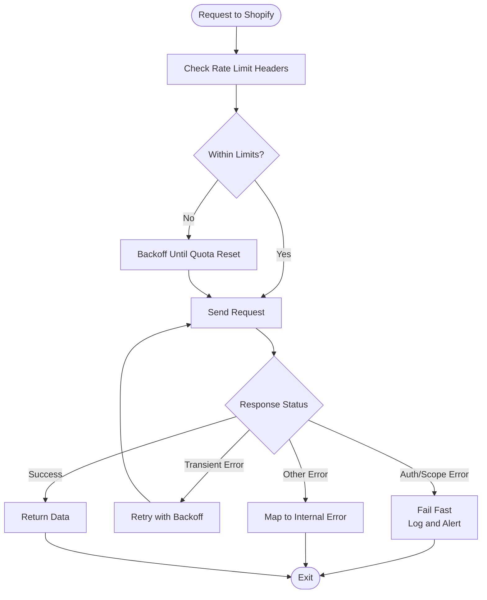
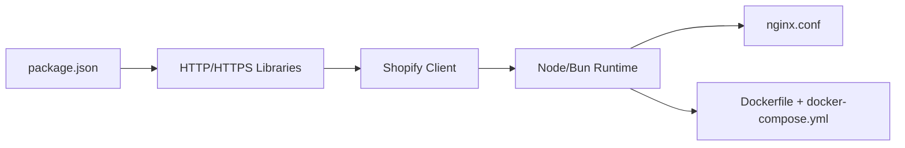

# Shopify API Configuration

<cite>
**Referenced Files in This Document**
- [config.server.ts](file://src/lib/config.server.ts)
- [server.ts](file://src/server.ts)
- [start.ts](file://src/start.ts)
- [vite.config.ts](file://vite.config.ts)
- [package.json](file://package.json)
- [docker-compose.yml](file://docker-compose.yml)
- [Dockerfile](file://Dockerfile)
- [nginx.conf](file://nginx.conf)
</cite>

## Table of Contents
1. [Introduction](#introduction)
2. [Project Structure](#project-structure)
3. [Core Components](#core-components)
4. [Architecture Overview](#architecture-overview)
5. [Detailed Component Analysis](#detailed-component-analysis)
6. [Dependency Analysis](#dependency-analysis)
7. [Performance Considerations](#performance-considerations)
8. [Troubleshooting Guide](#troubleshooting-guide)
9. [Conclusion](#conclusion)
10. [Appendices](#appendices)

## Introduction
This document explains how to configure and operate the Shopify integration within SpareAutomation. It covers environment setup, API key management, store domain configuration, client initialization, authentication methods, connection pooling strategies, rate limiting and retries, error handling patterns, security best practices, and troubleshooting guidance for common connection issues. The goal is to enable reliable, secure, and maintainable connections to Shopify across development, staging, and production environments.

## Project Structure
The project is a modern web application with server-side entry points and configuration files that influence runtime behavior. Key areas relevant to Shopify configuration include:
- Server startup and runtime configuration
- Build-time configuration for environment variables
- Containerization and deployment settings
- Package dependencies that may include Shopify SDKs or HTTP clients

**Diagram sources**
- [start.ts](file://src/start.ts)
- [server.ts](file://src/server.ts)
- [config.server.ts](file://src/lib/config.server.ts)
- [vite.config.ts](file://vite.config.ts)
- [nginx.conf](file://nginx.conf)
- [Dockerfile](file://Dockerfile)
- [docker-compose.yml](file://docker-compose.yml)
- [package.json](file://package.json)

**Section sources**
- [start.ts](file://src/start.ts)
- [server.ts](file://src/server.ts)
- [config.server.ts](file://src/lib/config.server.ts)
- [vite.config.ts](file://vite.config.ts)
- [nginx.conf](file://nginx.conf)
- [Dockerfile](file://Dockerfile)
- [docker-compose.yml](file://docker-compose.yml)
- [package.json](file://package.json)

## Core Components
- Environment-driven configuration loader: Centralizes reading of Shopify-related settings at runtime from environment variables.
- Server bootstrap: Initializes services and exposes endpoints; integrates with configuration and any HTTP client libraries.
- Build-time configuration: Controls which environment variables are exposed to the browser versus server-only.
- Deployment artifacts: Docker and nginx configurations that inject secrets and manage network boundaries.

Operational responsibilities:
- Validate required Shopify settings (store domain, API keys/tokens).
- Initialize Shopify client(s) with appropriate scopes and options.
- Configure retry/backoff and rate-limiting behaviors.
- Enforce secure storage and access of credentials.

**Section sources**
- [config.server.ts](file://src/lib/config.server.ts)
- [server.ts](file://src/server.ts)
- [vite.config.ts](file://vite.config.ts)
- [docker-compose.yml](file://docker-compose.yml)
- [Dockerfile](file://Dockerfile)
- [nginx.conf](file://nginx.conf)
- [package.json](file://package.json)

## Architecture Overview
The Shopify integration follows a layered approach:
- Configuration layer reads secrets and settings from environment variables.
- Client initialization layer constructs authenticated Shopify clients per environment.
- Service layer encapsulates Shopify API calls with retry and error handling.
- Transport layer manages HTTP connections, pooling, timeouts, and rate limits.

[No sources needed since this diagram shows conceptual workflow, not actual code structure]

## Detailed Component Analysis

### Environment Variables and Store Domain Setup
- Required Shopify settings typically include:
  - Store domain (e.g., my-store.myshopify.com)
  - API key or app token
  - App secret or shared secret (if applicable)
  - Optional: custom port, proxy settings, logging level
- Best practices:
  - Use separate variables per environment (development, staging, production).
  - Never hardcode secrets in source control.
  - Validate presence and format at startup; fail fast if missing.

Example variable names (use consistent naming):
- SHOPIFY_STORE_DOMAIN
- SHOPIFY_API_KEY
- SHOPIFY_APP_SECRET
- SHOPIFY_ACCESS_TOKEN
- SHOPIFY_SCOPES
- SHOPIFY_TIMEOUT_MS
- SHOPIFY_MAX_RETRIES
- SHOPIFY_RETRY_BASE_DELAY_MS

**Section sources**
- [config.server.ts](file://src/lib/config.server.ts)
- [server.ts](file://src/server.ts)

### API Key Management and Authentication Methods
- Supported methods:
  - API Key + Shared Secret for private apps
  - Access Token for installed apps or OAuth flows
  - Scoped tokens for least privilege
- Initialization flow:
  - Load credentials from environment
  - Construct client with selected auth method
  - Apply scopes and base URL derived from store domain
- Security considerations:
  - Restrict token scopes to minimum required
  - Rotate keys regularly
  - Avoid logging sensitive values

**Section sources**
- [config.server.ts](file://src/lib/config.server.ts)
- [server.ts](file://src/server.ts)

### Client Initialization and Connection Pooling
- Client initialization:
  - Create one client per store/domain to reuse connections
  - Set timeouts, user-agent headers, and request defaults
- Connection pooling:
  - Reuse underlying HTTP connections via keep-alive
  - Tune pool size based on expected concurrency
  - Ensure proper cleanup on shutdown

**Diagram sources**
- [server.ts](file://src/server.ts)
- [config.server.ts](file://src/lib/config.server.ts)

**Section sources**
- [server.ts](file://src/server.ts)
- [config.server.ts](file://src/lib/config.server.ts)

### Rate Limiting, Retries, and Error Handling
- Rate limiting:
  - Respect Shopify’s quota headers
  - Implement adaptive backoff when approaching limits
- Retries:
  - Retry transient errors (network timeouts, 5xx)
  - Exponential backoff with jitter
  - Idempotency-safe operations only
- Error handling:
  - Normalize Shopify errors into internal types
  - Surface actionable messages to logs and monitoring
  - Fail fast on invalid configuration

**Diagram sources**
- [server.ts](file://src/server.ts)
- [config.server.ts](file://src/lib/config.server.ts)

**Section sources**
- [server.ts](file://src/server.ts)
- [config.server.ts](file://src/lib/config.server.ts)

### Multi-Environment Configuration Examples
- Development:
  - Use a sandbox store domain
  - Enable verbose logging
  - Lower timeout and retry counts for faster feedback
- Staging:
  - Mirror production settings
  - Use dedicated staging store
  - Moderate retries and timeouts
- Production:
  - Strict scopes and minimal privileges
  - Higher timeouts and robust retries
  - Disable debug logs; enable structured logging

Environment-specific toggles can be driven by environment variables such as LOG_LEVEL, SHOPIFY_TIMEOUT_MS, and SHOPIFY_MAX_RETRIES.

**Section sources**
- [config.server.ts](file://src/lib/config.server.ts)
- [vite.config.ts](file://vite.config.ts)

### Security Best Practices
- Storage:
  - Use platform secret managers or container secrets
  - Inject via environment variables at runtime
- Transmission:
  - Always use HTTPS/TLS
  - Validate certificates
- Access Control:
  - Least-privilege scopes
  - Short-lived tokens where possible
- Operational:
  - Audit access and rotate credentials periodically
  - Avoid printing secrets in logs

**Section sources**
- [docker-compose.yml](file://docker-compose.yml)
- [Dockerfile](file://Dockerfile)
- [nginx.conf](file://nginx.conf)
- [config.server.ts](file://src/lib/config.server.ts)

## Dependency Analysis
Key dependencies influencing Shopify connectivity:
- HTTP client library used by the Shopify client
- TLS and networking stack provided by the runtime
- Reverse proxy (nginx) for termination and buffering
- Container orchestration for secret injection

**Diagram sources**
- [package.json](file://package.json)
- [nginx.conf](file://nginx.conf)
- [Dockerfile](file://Dockerfile)
- [docker-compose.yml](file://docker-compose.yml)

**Section sources**
- [package.json](file://package.json)
- [nginx.conf](file://nginx.conf)
- [Dockerfile](file://Dockerfile)
- [docker-compose.yml](file://docker-compose.yml)

## Performance Considerations
- Connection pooling:
  - Keep connections alive
  - Size pools according to concurrency
- Timeouts:
  - Set reasonable connect/read/write timeouts
- Retries:
  - Use exponential backoff with jitter
  - Limit total attempts to avoid cascading failures
- Rate limiting:
  - Monitor quota usage and adaptively throttle
- Caching:
  - Cache read-heavy data where safe
- Observability:
  - Track latency, error rates, and quota utilization

[No sources needed since this section provides general guidance]

## Troubleshooting Guide
Common issues and resolutions:
- Invalid store domain:
  - Verify domain format and reachability
  - Confirm DNS resolution and firewall rules
- Authentication failures:
  - Check API key/token validity and scopes
  - Ensure correct base URL for the store
- Rate limit exceeded:
  - Inspect response headers for quota info
  - Increase backoff or reduce request frequency
- Timeouts:
  - Adjust timeouts and retry policies
  - Check upstream proxy buffers (nginx)
- TLS errors:
  - Validate certificate chain and hostname
  - Ensure system CA bundle is up to date

Debugging techniques:
- Enable detailed logs in non-production
- Log request IDs and timestamps
- Capture failed payloads (sanitized)
- Use health checks and readiness probes

**Section sources**
- [config.server.ts](file://src/lib/config.server.ts)
- [server.ts](file://src/server.ts)
- [nginx.conf](file://nginx.conf)

## Conclusion
By centralizing configuration, enforcing secure credential handling, initializing robust Shopify clients, and implementing resilient retry and rate-limiting logic, SpareAutomation can reliably integrate with Shopify across all environments. Follow the security and performance recommendations above to ensure stability and compliance in production.

## Appendices

### Appendix A: Environment Variable Reference
- SHOPIFY_STORE_DOMAIN: Primary store domain
- SHOPIFY_API_KEY: Private app API key
- SHOPIFY_APP_SECRET: Private app shared secret
- SHOPIFY_ACCESS_TOKEN: Installed app access token
- SHOPIFY_SCOPES: Comma-separated scopes
- SHOPIFY_TIMEOUT_MS: Request timeout in milliseconds
- SHOPIFY_MAX_RETRIES: Maximum retry attempts
- SHOPIFY_RETRY_BASE_DELAY_MS: Base delay for exponential backoff
- LOG_LEVEL: Logging verbosity

**Section sources**
- [config.server.ts](file://src/lib/config.server.ts)

### Appendix B: Deployment Checklist
- Secrets injected via environment variables or secret managers
- TLS terminated at reverse proxy or application
- Health checks configured
- Monitoring and alerting enabled for Shopify quotas and errors
- Regular rotation schedule for credentials

**Section sources**
- [docker-compose.yml](file://docker-compose.yml)
- [Dockerfile](file://Dockerfile)
- [nginx.conf](file://nginx.conf)