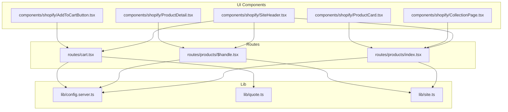
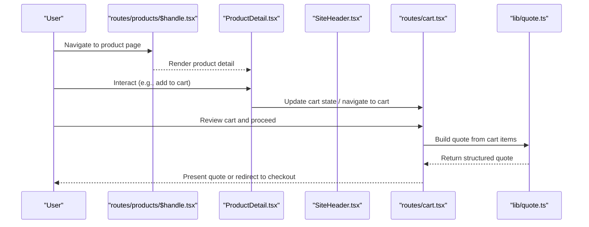
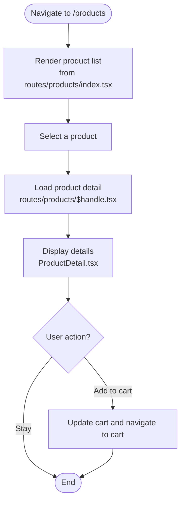
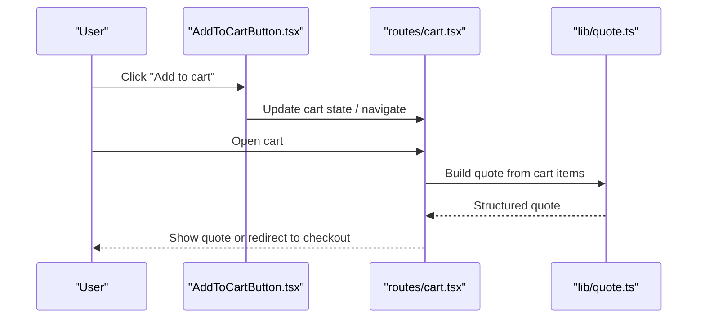
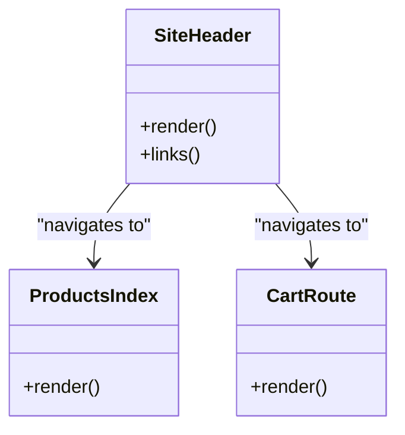
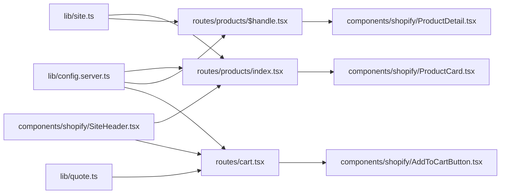

# Shopify Integration

<cite>
**Referenced Files in This Document**
- [AddToCartButton.tsx](file://src/components/shopify/AddToCartButton.tsx)
- [CollectionPage.tsx](file://src/components/shopify/CollectionPage.tsx)
- [ProductCard.tsx](file://src/components/shopify/ProductCard.tsx)
- [ProductDetail.tsx](file://src/components/shopify/ProductDetail.tsx)
- [SiteHeader.tsx](file://src/components/shopify/SiteHeader.tsx)
- [cart.tsx](file://src/routes/cart.tsx)
- [products/index.tsx](file://src/routes/products/index.tsx)
- [products/$handle.tsx](file://src/routes/products/$handle.tsx)
- [config.server.ts](file://src/lib/config.server.ts)
- [quote.ts](file://src/lib/quote.ts)
- [site.ts](file://src/lib/site.ts)
</cite>

## Table of Contents
1. [Introduction](#introduction)
2. [Project Structure](#project-structure)
3. [Core Components](#core-components)
4. [Architecture Overview](#architecture-overview)
5. [Detailed Component Analysis](#detailed-component-analysis)
6. [Dependency Analysis](#dependency-analysis)
7. [Performance Considerations](#performance-considerations)
8. [Troubleshooting Guide](#troubleshooting-guide)
9. [Security Considerations](#security-considerations)
10. [Conclusion](#conclusion)

## Introduction
This document explains how SpareAutomation integrates with Shopify using the Storefront API to power product browsing, collections, cart operations, and order-related workflows. It focuses on:
- How products and collections are fetched and displayed
- How cart operations are implemented
- How quotes are built from carts
- Configuration for connecting to Shopify stores
- Error handling strategies, retry logic, rate limiting considerations, and debugging techniques
- Security considerations for API keys and secure communication patterns
- The relationship between Shopify entities and local data models

## Project Structure
Shopify integration spans UI components and routes that render product pages, collections, and cart flows, along with server-side configuration and utilities for quoting.

**Diagram sources**
- [SiteHeader.tsx](file://src/components/shopify/SiteHeader.tsx)
- [CollectionPage.tsx](file://src/components/shopify/CollectionPage.tsx)
- [ProductCard.tsx](file://src/components/shopify/ProductCard.tsx)
- [ProductDetail.tsx](file://src/components/shopify/ProductDetail.tsx)
- [AddToCartButton.tsx](file://src/components/shopify/AddToCartButton.tsx)
- [products/index.tsx](file://src/routes/products/index.tsx)
- [products/$handle.tsx](file://src/routes/products/$handle.tsx)
- [cart.tsx](file://src/routes/cart.tsx)
- [config.server.ts](file://src/lib/config.server.ts)
- [quote.ts](file://src/lib/quote.ts)
- [site.ts](file://src/lib/site.ts)

**Section sources**
- [SiteHeader.tsx](file://src/components/shopify/SiteHeader.tsx)
- [CollectionPage.tsx](file://src/components/shopify/CollectionPage.tsx)
- [ProductCard.tsx](file://src/components/shopify/ProductCard.tsx)
- [ProductDetail.tsx](file://src/components/shopify/ProductDetail.tsx)
- [AddToCartButton.tsx](file://src/components/shopify/AddToCartButton.tsx)
- [products/index.tsx](file://src/routes/products/index.tsx)
- [products/$handle.tsx](file://src/routes/products/$handle.tsx)
- [cart.tsx](file://src/routes/cart.tsx)
- [config.server.ts](file://src/lib/config.server.ts)
- [quote.ts](file://src/lib/quote.ts)
- [site.ts](file://src/lib/site.ts)

## Core Components
- SiteHeader: Provides navigation and links into product listings and cart.
- CollectionPage: Renders a list of products within a collection context.
- ProductCard: Displays a summary card for a product and actions like adding to cart.
- ProductDetail: Shows detailed product information and purchase options.
- AddToCartButton: Triggers adding an item to the cart.
- Routes:
  - products/index.tsx: Entry point for listing products/collections.
  - products/$handle.tsx: Dynamic route for individual product details.
  - cart.tsx: Cart view and checkout flow orchestration.
- Lib:
  - config.server.ts: Centralized configuration for Shopify connection settings.
  - quote.ts: Utilities to build quotes from cart contents.
  - site.ts: Site-level metadata and helpers used across pages.

These components collectively implement product browsing, selection, and cart operations. Order processing is typically handled via Shopify’s hosted checkout or redirect flows; this codebase focuses on storefront presentation and cart management.

**Section sources**
- [SiteHeader.tsx](file://src/components/shopify/SiteHeader.tsx)
- [CollectionPage.tsx](file://src/components/shopify/CollectionPage.tsx)
- [ProductCard.tsx](file://src/components/shopify/ProductCard.tsx)
- [ProductDetail.tsx](file://src/components/shopify/ProductDetail.tsx)
- [AddToCartButton.tsx](file://src/components/shopify/AddToCartButton.tsx)
- [products/index.tsx](file://src/routes/products/index.tsx)
- [products/$handle.tsx](file://src/routes/products/$handle.tsx)
- [cart.tsx](file://src/routes/cart.tsx)
- [config.server.ts](file://src/lib/config.server.ts)
- [quote.ts](file://src/lib/quote.ts)
- [site.ts](file://src/lib/site.ts)

## Architecture Overview
The integration follows a client-driven storefront pattern:
- Routes fetch product and collection data (via Storefront API calls or server-side helpers).
- Components render product catalogs and detail views.
- Cart operations are performed through Shopify’s Storefront Cart APIs.
- Quotes can be generated from cart items for offline or B2B workflows.

**Diagram sources**
- [products/$handle.tsx](file://src/routes/products/$handle.tsx)
- [ProductDetail.tsx](file://src/components/shopify/ProductDetail.tsx)
- [SiteHeader.tsx](file://src/components/shopify/SiteHeader.tsx)
- [cart.tsx](file://src/routes/cart.tsx)
- [quote.ts](file://src/lib/quote.ts)

## Detailed Component Analysis

### Product Listing and Detail Flow
- products/index.tsx drives the product listing experience and may link to specific product handles.
- products/$handle.tsx renders a single product based on its handle.
- ProductDetail.tsx displays product attributes and provides actions such as adding to cart.
- ProductCard.tsx shows a compact representation of a product for listing contexts.

**Diagram sources**
- [products/index.tsx](file://src/routes/products/index.tsx)
- [products/$handle.tsx](file://src/routes/products/$handle.tsx)
- [ProductDetail.tsx](file://src/components/shopify/ProductDetail.tsx)
- [ProductCard.tsx](file://src/components/shopify/ProductCard.tsx)

**Section sources**
- [products/index.tsx](file://src/routes/products/index.tsx)
- [products/$handle.tsx](file://src/routes/products/$handle.tsx)
- [ProductDetail.tsx](file://src/components/shopify/ProductDetail.tsx)
- [ProductCard.tsx](file://src/components/shopify/ProductCard.tsx)

### Cart Operations and Quote Building
- AddToCartButton triggers adding items to the cart.
- cart.tsx manages cart display and checkout initiation.
- quote.ts builds quotes from cart contents for internal use or downstream processes.

**Diagram sources**
- [AddToCartButton.tsx](file://src/components/shopify/AddToCartButton.tsx)
- [cart.tsx](file://src/routes/cart.tsx)
- [quote.ts](file://src/lib/quote.ts)

**Section sources**
- [AddToCartButton.tsx](file://src/components/shopify/AddToCartButton.tsx)
- [cart.tsx](file://src/routes/cart.tsx)
- [quote.ts](file://src/lib/quote.ts)

### Navigation and Global Context
- SiteHeader.tsx provides global navigation including links to product listings and cart.

**Diagram sources**
- [SiteHeader.tsx](file://src/components/shopify/SiteHeader.tsx)
- [products/index.tsx](file://src/routes/products/index.tsx)
- [cart.tsx](file://src/routes/cart.tsx)

**Section sources**
- [SiteHeader.tsx](file://src/components/shopify/SiteHeader.tsx)
- [products/index.tsx](file://src/routes/products/index.tsx)
- [cart.tsx](file://src/routes/cart.tsx)

## Dependency Analysis
Key dependencies among Shopify-related modules:
- Routes depend on lib/config.server.ts for connection settings and on lib/site.ts for site metadata.
- UI components depend on routes for data and on each other for shared interactions (e.g., header to routes).
- Cart route depends on quote utilities to transform cart data into quotes.

**Diagram sources**
- [config.server.ts](file://src/lib/config.server.ts)
- [site.ts](file://src/lib/site.ts)
- [quote.ts](file://src/lib/quote.ts)
- [SiteHeader.tsx](file://src/components/shopify/SiteHeader.tsx)
- [products/index.tsx](file://src/routes/products/index.tsx)
- [products/$handle.tsx](file://src/routes/products/$handle.tsx)
- [cart.tsx](file://src/routes/cart.tsx)
- [ProductDetail.tsx](file://src/components/shopify/ProductDetail.tsx)
- [ProductCard.tsx](file://src/components/shopify/ProductCard.tsx)
- [AddToCartButton.tsx](file://src/components/shopify/AddToCartButton.tsx)

**Section sources**
- [config.server.ts](file://src/lib/config.server.ts)
- [site.ts](file://src/lib/site.ts)
- [quote.ts](file://src/lib/quote.ts)
- [SiteHeader.tsx](file://src/components/shopify/SiteHeader.tsx)
- [products/index.tsx](file://src/routes/products/index.tsx)
- [products/$handle.tsx](file://src/routes/products/$handle.tsx)
- [cart.tsx](file://src/routes/cart.tsx)
- [ProductDetail.tsx](file://src/components/shopify/ProductDetail.tsx)
- [ProductCard.tsx](file://src/components/shopify/ProductCard.tsx)
- [AddToCartButton.tsx](file://src/components/shopify/AddToCartButton.tsx)

## Performance Considerations
- Prefer fetching only necessary fields for product lists versus detail views to reduce payload size.
- Cache static site metadata and frequently accessed configurations at the edge or in memory where appropriate.
- Avoid redundant re-renders by memoizing derived data in components and routes.
- Use pagination or cursors when loading large catalogs to keep initial load times low.
- Defer heavy computations (like quote building) until needed and cache results per session if stable.

[No sources needed since this section provides general guidance]

## Troubleshooting Guide
Common areas to inspect:
- Configuration: Verify Shopify connection settings in the server configuration module.
- Network errors: Check network requests for timeouts or rate limit responses.
- Data shape mismatches: Ensure product and cart payloads match expected structures in components and routes.
- Logging: Add targeted logs around key transitions (navigation, cart updates, quote generation) to trace issues.

Practical steps:
- Validate environment variables and secrets used for Shopify access.
- Inspect browser dev tools for failed requests and response codes.
- Reproduce issues with minimal inputs (single product, small cart) to isolate problems.

**Section sources**
- [config.server.ts](file://src/lib/config.server.ts)
- [cart.tsx](file://src/routes/cart.tsx)
- [products/$handle.tsx](file://src/routes/products/$handle.tsx)

## Security Considerations
- Keep Shopify credentials out of client-side code; store them securely in server-side configuration.
- Use HTTPS for all communications with Shopify endpoints.
- Validate and sanitize any user-supplied inputs before constructing API queries or redirects.
- Limit exposed error details to avoid leaking sensitive information.
- Apply least-privilege scopes for API tokens and rotate keys regularly.

[No sources needed since this section provides general guidance]

## Conclusion
SpareAutomation’s Shopify integration centers on storefront rendering and cart operations, with robust separation between UI components, routes, and configuration. By following the patterns outlined here—structured data fetching, clear component responsibilities, and careful configuration—you can extend the integration to support additional features such as advanced inventory checks, real-time updates, and deeper order processing while maintaining performance and security.